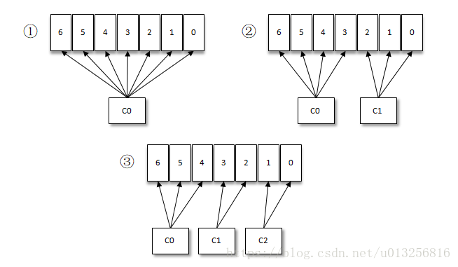
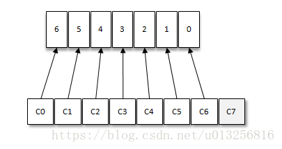

摘自：

```
https://blog.csdn.net/u013256816/article/details/81123600
https://blog.csdn.net/u013256816/article/details/81123625
```

# 引言

按照Kafka默认的消费逻辑设定，一个分区只能被同一个消费组（ConsumerGroup）内的一个消费者消费。假设目前某消费组内只有一个消费者C0，订阅了一个topic，这个topic包含7个分区，也就是说这个消费者C0订阅了7个分区，参考下图（1）。



此时消费组内又加入了一个新的消费者C1，按照既定的逻辑需要将原来消费者C0的部分分区分配给消费者C1消费，情形上图（2），消费者C0和C1各自负责消费所分配到的分区，相互之间并无实质性的干扰。

接着消费组内又加入了一个新的消费者C2，如此消费者C0、C1和C2按照上图（3）中的方式各自负责消费所分配到的分区。

如果消费者过多，出现了消费者的数量大于分区的数量的情况，就会有消费者分配不到任何分区。参考下图，一共有8个消费者，7个分区，那么最后的消费者C7由于分配不到任何分区进而就无法消费任何消息。



上面各个示例中的整套逻辑是按照Kafka中默认的分区分配策略来实施的。Kafka提供了消费者客户端参数partition.assignment.strategy用来设置消费者与订阅主题之间的分区分配策略。默认情况下，此参数的值为：org.apache.kafka.clients.consumer.RangeAssignor，即采用RangeAssignor分配策略。除此之外，Kafka中还提供了另外两种分配策略： RoundRobinAssignor和StickyAssignor。消费者客户端参数partition.asssignment.strategy可以配置多个分配策略，彼此之间以逗号分隔。

# RangeAssignor分配策略

RangeAssignor策略的原理是按照消费者总数和分区总数进行整除运算来获得一个跨度，然后将分区按照跨度进行平均分配，以保证分区尽可能均匀地分配给所有的消费者。对于每一个topic，RangeAssignor策略会将消费组内所有订阅这个topic的消费者按照名称的字典序排序，然后为每个消费者划分固定的分区范围，如果不够平均分配，那么字典序靠前的消费者会被多分配一个分区。

假设n=分区数/消费者数量，m=分区数%消费者数量，那么前m个消费者每个分配n+1个分区，后面的（消费者数量-m）个消费者每个分配n个分区。

为了更加通俗的讲解RangeAssignor策略，我们不妨再举一些示例。假设消费组内有2个消费者C0和C1，都订阅了主题t0和t1，并且每个主题都有4个分区，那么所订阅的所有分区可以标识为：t0p0、t0p1、t0p2、t0p3、t1p0、t1p1、t1p2、t1p3。最终的分配结果为：

```
消费者C0：t0p0、t0p1、t1p0、t1p1
消费者C1：t0p2、t0p3、t1p2、t1p3
```


这样分配的很均匀，那么此种分配策略能够一直保持这种良好的特性呢？我们再来看下另外一种情况。假设上面例子中2个主题都只有3个分区，那么所订阅的所有分区可以标识为：t0p0、t0p1、t0p2、t1p0、t1p1、t1p2。最终的分配结果为：

```
消费者C0：t0p0、t0p1、t1p0、t1p1
消费者C1：t0p2、t1p2
```


可以明显的看到这样的分配并不均匀，如果将类似的情形扩大，有可能会出现部分消费者过载的情况。对此我们再来看下另一种RoundRobinAssignor策略的分配效果如何。


# RoundRobinAssignor分配策略

RoundRobinAssignor策略的原理是将消费组内所有消费者以及消费者所订阅的所有topic的partition按照字典序排序，然后通过轮询方式逐个将分区以此分配给每个消费者。RoundRobinAssignor策略对应的partition.assignment.strategy参数值为：org.apache.kafka.clients.consumer.RoundRobinAssignor。

如果同一个消费组内所有的消费者的订阅信息都是相同的，那么RoundRobinAssignor策略的分区分配会是均匀的。举例，假设消费组中有2个消费者C0和C1，都订阅了主题t0和t1，并且每个主题都有3个分区，那么所订阅的所有分区可以标识为：t0p0、t0p1、t0p2、t1p0、t1p1、t1p2。最终的分配结果为：

```
消费者C0：t0p0、t0p2、t1p1
消费者C1：t0p1、t1p0、t1p2
```


如果同一个消费组内的消费者所订阅的信息是不相同的，那么在执行分区分配的时候就不是完全的轮询分配，有可能会导致分区分配的不均匀。如果某个消费者没有订阅消费组内的某个topic，那么在分配分区的时候此消费者将分配不到这个topic的任何分区。

举例，假设消费组内有3个消费者C0、C1和C2，它们共订阅了3个主题：t0、t1、t2，这3个主题分别有1、2、3个分区，即整个消费组订阅了t0p0、t1p0、t1p1、t2p0、t2p1、t2p2这6个分区。具体而言，消费者C0订阅的是主题t0，消费者C1订阅的是主题t0和t1，消费者C2订阅的是主题t0、t1和t2，那么最终的分配结果为：

```
消费者C0：t0p0
消费者C1：t1p0
消费者C2：t1p1、t2p0、t2p1、t2p2
```


可以看到RoundRobinAssignor策略也不是十分完美，这样分配其实并不是最优解，因为完全可以将分区t1p1分配给消费者C1。

# StickyAssignor分配策略

我们再来看一下StickyAssignor策略，“sticky”这个单词可以翻译为“粘性的”，Kafka从0.11.x版本开始引入这种分配策略，它主要有两个目的：

分区的分配要尽可能的均匀；
分区的分配尽可能的与上次分配的保持相同。
当两者发生冲突时，第一个目标优先于第二个目标。鉴于这两个目标，StickyAssignor策略的具体实现要比RangeAssignor和RoundRobinAssignor这两种分配策略要复杂很多。我们举例来看一下StickyAssignor策略的实际效果。
假设消费组内有3个消费者：C0、C1和C2，它们都订阅了4个主题：t0、t1、t2、t3，并且每个主题有2个分区，也就是说整个消费组订阅了t0p0、t0p1、t1p0、t1p1、t2p0、t2p1、t3p0、t3p1这8个分区。最终的分配结果如下：

```
消费者C0：t0p0、t1p1、t3p0
消费者C1：t0p1、t2p0、t3p1
消费者C2：t1p0、t2p1
```


这样初看上去似乎与采用RoundRobinAssignor策略所分配的结果相同，但事实是否真的如此呢？再假设此时消费者C1脱离了消费组，那么消费组就会执行再平衡操作，进而消费分区会重新分配。如果采用RoundRobinAssignor策略，那么此时的分配结果如下：

```
消费者C0：t0p0、t1p0、t2p0、t3p0
消费者C2：t0p1、t1p1、t2p1、t3p1
```


如分配结果所示，RoundRobinAssignor策略会按照消费者C0和C2进行重新轮询分配。而如果此时使用的是StickyAssignor策略，那么分配结果为：

```
消费者C0：t0p0、t1p1、t3p0、t2p0
消费者C2：t1p0、t2p1、t0p1、t3p1
```


可以看到分配结果中保留了上一次分配中对于消费者C0和C2的所有分配结果，并将原来消费者C1的“负担”分配给了剩余的两个消费者C0和C2，最终C0和C2的分配还保持了均衡。

如果发生分区重分配，那么对于同一个分区而言有可能之前的消费者和新指派的消费者不是同一个，对于之前消费者进行到一半的处理还要在新指派的消费者中再次复现一遍，这显然很浪费系统资源。StickyAssignor策略如同其名称中的“sticky”一样，让分配策略具备一定的“粘性”，尽可能地让前后两次分配相同，进而减少系统资源的损耗以及其它异常情况的发生。

到目前为止所分析的都是消费者的订阅信息都是相同的情况，我们来看一下订阅信息不同的情况下的处理。

举例，同样消费组内有3个消费者：C0、C1和C2，集群中有3个主题：t0、t1和t2，这3个主题分别有1、2、3个分区，也就是说集群中有t0p0、t1p0、t1p1、t2p0、t2p1、t2p2这6个分区。消费者C0订阅了主题t0，消费者C1订阅了主题t0和t1，消费者C2订阅了主题t0、t1和t2。

如果此时采用RoundRobinAssignor策略，那么最终的分配结果如下所示（和讲述RoundRobinAssignor策略时的一样，这样不妨赘述一下）：

【分配结果集1】

```
消费者C0：t0p0
消费者C1：t1p0
消费者C2：t1p1、t2p0、t2p1、t2p2
```


如果此时采用的是StickyAssignor策略，那么最终的分配结果为：

【分配结果集2】

```
消费者C0：t0p0
消费者C1：t1p0、t1p1
消费者C2：t2p0、t2p1、t2p2
```


可以看到这是一个最优解（消费者C0没有订阅主题t1和t2，所以不能分配主题t1和t2中的任何分区给它，对于消费者C1也可同理推断）。
假如此时消费者C0脱离了消费组，那么RoundRobinAssignor策略的分配结果为：

```
消费者C1：t0p0、t1p1
消费者C2：t1p0、t2p0、t2p1、t2p2
```


可以看到RoundRobinAssignor策略保留了消费者C1和C2中原有的3个分区的分配：t2p0、t2p1和t2p2（针对结果集1）。而如果采用的是StickyAssignor策略，那么分配结果为：

```
消费者C1：t1p0、t1p1、t0p0
消费者C2：t2p0、t2p1、t2p2
```


可以看到StickyAssignor策略保留了消费者C1和C2中原有的5个分区的分配：t1p0、t1p1、t2p0、t2p1、t2p2。

从结果上看StickyAssignor策略比另外两者分配策略而言显得更加的优异，这个策略的代码实现也是异常复杂，如果读者没有接触过这种分配策略，不妨使用一下来尝尝鲜。
