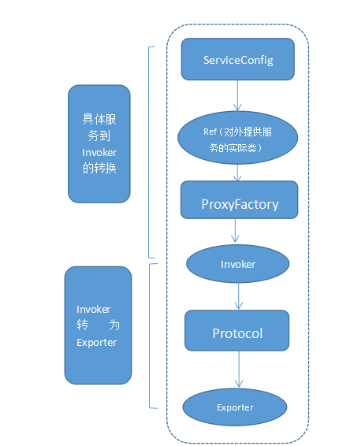
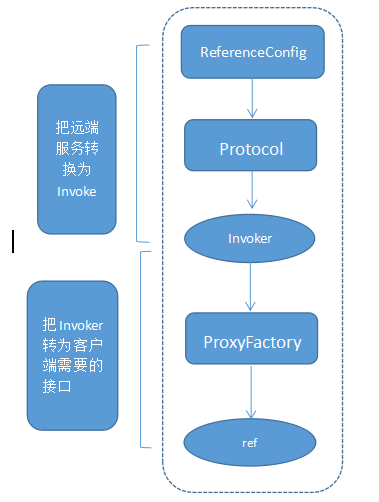
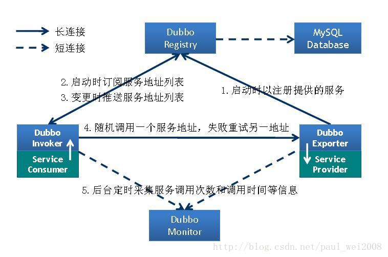
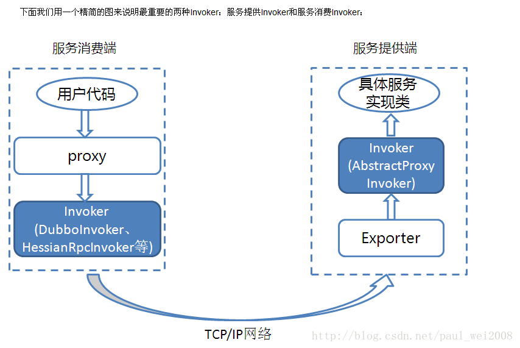
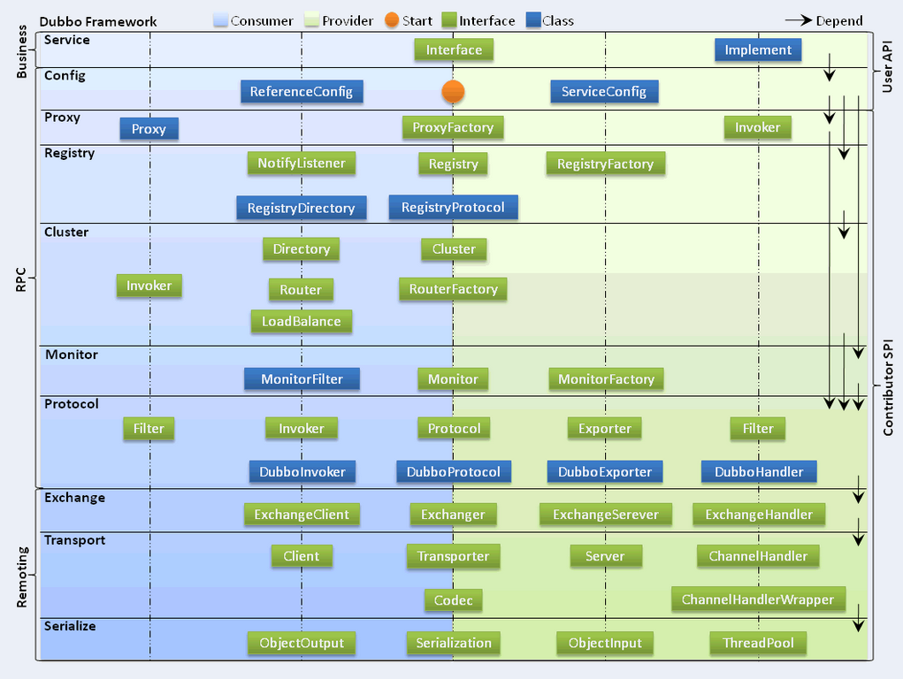
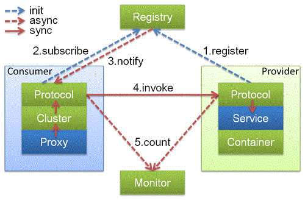
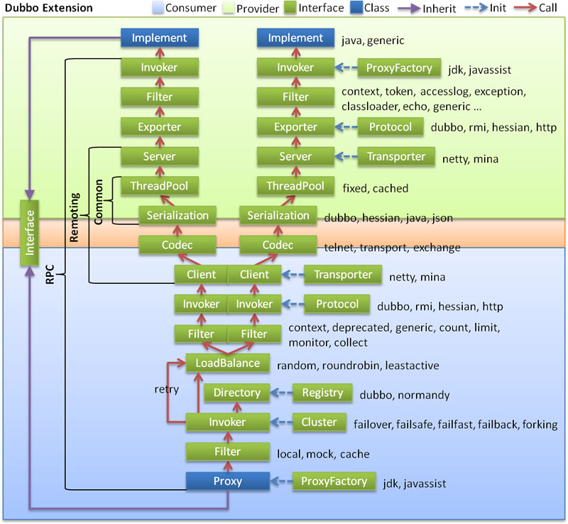
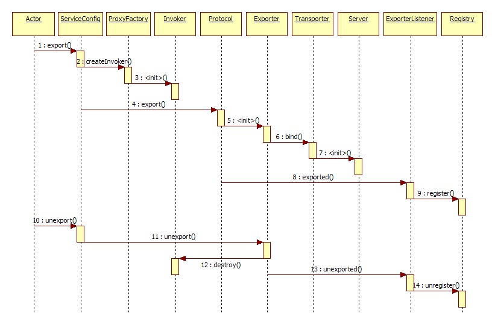
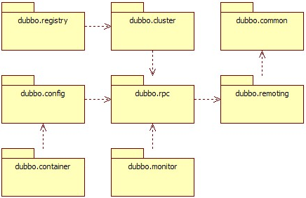

摘自：`https://www.cnblogs.com/aspirant/p/9002663.html`

## 一、Dubbo结构图

 


duubo结构图

我们解释以下这个架构图：
Consumer服务消费者，Provider服务提供者。Container服务容器。消费当然是invoke提供者了，invoke这条实线按照图上的说明当然同步的意思了。但是在实际调用过程中，Provider的位置对于Consumer来说是透明的，上一次调用服务的位置（IP地址）和下一次调用服务的位置，是不确定的。这个地方就需要使用注册中心来实现软负载。
**Register**
服务提供者先启动start，然后注册register服务。消费订阅subscribe服务，如果没有订阅到自己想获得的服务，它会不断的尝试订阅。新的服务注册到注册中心以后，注册中心会将这些服务通过notify到消费者。
**Monitor**
这是一个监控，图中虚线表明Consumer 和Provider通过异步的方式发送消息至Monitor，Consumer和Provider会将信息存放在本地磁盘，平均1min会发送一次信息。Monitor在整个架构中是可选的（图中的虚线并不是可选的意思），Monitor功能需要单独配置，不配置或者配置以后，Monitor挂掉并不会影响服务的调用。

## 二、Dubbo原理

**初始化过程细节：** 第一步，就是将服务装载容器中，然后准备注册服务。和spring中启动过程类似，spring启动时，将bean装载进容器中的时候，首先要解析bean。所以dubbo也是先读配置文件解析服务。

###### **解析服务：**

1）、基于dubbo.jar内的Meta-inf/spring.handlers配置，spring在遇到dubbo名称空间时，会回调DubboNamespaceHandler类。
2）、所有的dubbo标签，都统一用DubboBeanDefinitionParser进行解析，基于一对一属性映射，将XML标签解析为Bean对象。生产者或者消费者初始化的时候，会将Bean对象转会为url格式，将所有Bean属性转成url的参数。 然后将URL传给Protocol扩展点，基于扩展点的Adaptive机制，根据URL的协议头，进行不同协议的服务暴露和引用。

###### **暴露服务：**

a、 直接暴露服务端口
在没有使用注册中心的情况，这种情况一般适用在开发环境下，服务的调用这和提供在同一个IP上，只需要打开服务的端口即可。 即，当配置 or ServiceConfig解析出的URL的格式为： Dubbo：//service-host/com.xxx.TxxService?version=1.0.0 基于扩展点的Adaptiver机制，通过URL的“dubbo：//”协议头识别，直接调用DubboProtocol的export（）方法，打开服务端口。

b、向注册中心暴露服务：
和上一种的区别：需要将服务的IP和端口一同暴露给注册中心。 ServiceConfig解析出的url格式为： 

```
registry://registry-host/com.alibaba.dubbo.registry.RegistryService?export=URL.encode(“dubbo://service-host/com.xxx.TxxService?version=1.0.0”)
```


基于扩展点的Adaptive机制，通过URL的“registry：//”协议头识别，调用RegistryProtocol的export方法，将export参数中的提供者URL先注册到注册中心，再重新传给Protocol扩展点进行暴露：` Dubbo：//service-host/com.xxx.TxxService?version=1.0.0`

###### **引用服务：**

a、直接引用服务：
在没有注册中心的，直连提供者情况下， ReferenceConfig解析出的URL格式为： Dubbo：//service-host/com.xxx.TxxService?version=1.0.0
基于扩展点的Adaptive机制，通过url的“dubbo：//”协议头识别，直接调用DubboProtocol的refer方法，返回提供者引用。

b、从注册中心发现引用服务：
此时，ReferenceConfig解析出的URL的格式为： 

```
registry://registry-host/com.alibaba.dubbo.registry.RegistryService?refer=URL.encode(“consumer://consumer-host/com.foo.FooService?version=1.0.0”)
```

基于扩展点的Apaptive机制，通过URL的“registry：//”协议头识别，就会调用RegistryProtocol的refer方法，基于refer参数总的条件，查询提供者URL，如： Dubbo：//service-host/com.xxx.TxxService?version=1.0.0
基于扩展点的Adaptive机制，通过提供者URL的“dubbo：//”协议头识别，就会调用DubboProtocol的refer（）方法，得到提供者引用。 然后RegistryProtocol将多个提供者引用，通过Cluster扩展点，伪装成单个提供这引用返回。

## 三、服务提供与消费详细过程



服务提供者暴露一个服务的详细过程

暴露服务的主过程：

首先ServiceConfig类拿到对外提供服务的实际类ref，然后将ProxyFactory类的getInvoker方法使用ref生成一个AbstractProxyInvoker实例，到这一步就完成具体服务到invoker的转化。接下来就是Invoker转换到Exporter的过程。 Dubbo处理服务暴露的关键就在Invoker转换到Exporter的过程，下面我们以Dubbo和rmi这两种典型协议的实现来进行说明： Dubbo的实现： Dubbo协议的Invoker转为Exporter发生在DubboProtocol类的export方法，它主要是打开socket侦听服务，并接收客户端发来的各种请求，通讯细节由dubbo自己实现。 Rmi的实现： RMI协议的Invoker转为Exporter发生在RmiProtocol类的export方法，他通过Spring或Dubbo或JDK来实现服务，通讯细节由JDK底层来实现。



服务消费的主过程

服务消费的主过程：

首先ReferenceConfig类的init方法调用Protocol的refer方法生成Invoker实例。接下来把Invoker转为客户端需要的接口

######  分布式服务框架：

–高性能和透明化的RPC远程服务调用方案
–SOA服务治理方案
-Apache MINA 框架基于Reactor模型通信框架，基于tcp长连接

Dubbo缺省协议采用单一长连接和NIO异步通讯，
适合于小数据量大并发的服务调用，以及服务消费者机器数远大于服务提供者机器数的情况
分析源代码，基本原理如下：

1. client一个线程调用远程接口，生成一个唯一的ID（比如一段随机字符串，UUID等），Dubbo是使用AtomicLong从0开始累计数字的
2. 将打包的方法调用信息（如调用的接口名称，方法名称，参数值列表等），和处理结果的回调对象callback，全部封装在一起，组成一个对象object
3. 向专门存放调用信息的全局ConcurrentHashMap里面put(ID, object)
4. 将ID和打包的方法调用信息封装成一对象connRequest，使用IoSession.write(connRequest)异步发送出去
5. 当前线程再使用callback的get()方法试图获取远程返回的结果，在get()内部，则使用synchronized获取回调对象callback的锁， 再先检测是否已经获取到结果，如果没有，然后调用callback的wait()方法，释放callback上的锁，让当前线程处于等待状态。
6. 服务端接收到请求并处理后，将结果（此结果中包含了前面的ID，即回传）发送给客户端，客户端socket连接上专门监听消息的线程收到消息，分析结果，取到ID，再从前面的ConcurrentHashMap里面get(ID)，从而找到callback，将方法调用结果设置到callback对象里。
7. 监听线程接着使用synchronized获取回调对象callback的锁（因为前面调用过wait()，那个线程已释放callback的锁了），再notifyAll()，唤醒前面处于等待状态的线程继续执行（callback的get()方法继续执行就能拿到调用结果了），至此，整个过程结束。

- 当前线程怎么让它“暂停”，等结果回来后，再向后执行？

​     答：先生成一个对象obj，在一个全局map里put(ID,obj)存放起来，再用synchronized获取obj锁，再调用obj.wait()让当前线程处于等待状态，然后另一消息监听线程等到服 务端结果来了后，再map.get(ID)找到obj，再用synchronized获取obj锁，再调用obj.notifyAll()唤醒前面处于等待状态的线程。

- 正如前面所说，Socket通信是一个全双工的方式，如果有多个线程同时进行远程方法调用，这时建立在client server之间的socket连接上会有很多双方发送的消息传递，前后顺序也可能是乱七八糟的，server处理完结果后，将结果消息发送给client，client收到很多消息，怎么知道哪个消息结果是原先哪个线程调用的？

​     答：使用一个ID，让其唯一，然后传递给服务端，再服务端又回传回来，这样就知道结果是原先哪个线程的了。






**总体架构**

Dubbo的总体架构，如图所示：



Dubbo框架设计一共划分了10个层，最上面的Service层是留给实际想要使用Dubbo开发分布式服务的开发者实现业务逻辑的接口层。图中左边淡蓝背景的为服务消费方使用的接口，右边淡绿色背景的为服务提供方使用的接口， 位于中轴线上的为双方都用到的接口。
下面，结合Dubbo官方文档，我们分别理解一下框架分层架构中，各个层次的设计要点：

1. 服务接口层（Service）：该层是与实际业务逻辑相关的，根据服务提供方和服务消费方的业务设计对应的接口和实现。
2. 配置层（Config）：对外配置接口，以ServiceConfig和ReferenceConfig为中心，可以直接new配置类，也可以通过spring解析配置生成配置类。
3. 服务代理层（Proxy）：服务接口透明代理，生成服务的客户端Stub和服务器端Skeleton，以ServiceProxy为中心，扩展接口为ProxyFactory。
4. 服务注册层（Registry）：封装服务地址的注册与发现，以服务URL为中心，扩展接口为RegistryFactory、Registry和RegistryService。可能没有服务注册中心，此时服务提供方直接暴露服务。
5. 集群层（Cluster）：封装多个提供者的路由及负载均衡，并桥接注册中心，以Invoker为中心，扩展接口为Cluster、Directory、Router和LoadBalance。将多个服务提供方组合为一个服务提供方，实现对服务消费方来透明，只需要与一个服务提供方进行交互。
6. 监控层（Monitor）：RPC调用次数和调用时间监控，以Statistics为中心，扩展接口为MonitorFactory、Monitor和MonitorService。
7. 远程调用层（Protocol）：封将RPC调用，以Invocation和Result为中心，扩展接口为Protocol、Invoker和Exporter。Protocol是服务域，它是Invoker暴露和引用的主功能入口，它负责Invoker的生命周期管理。Invoker是实体域，它是Dubbo的核心模型，其它模型都向它靠扰，或转换成它，它代表一个可执行体，可向它发起invoke调用，它有可能是一个本地的实现，也可能是一个远程的实现，也可能一个集群实现。
8. 信息交换层（Exchange）：封装请求响应模式，同步转异步，以Request和Response为中心，扩展接口为Exchanger、ExchangeChannel、ExchangeClient和ExchangeServer。
9. 网络传输层（Transport）：抽象mina和netty为统一接口，以Message为中心，扩展接口为Channel、Transporter、Client、Server和Codec。
10. 数据序列化层（Serialize）：可复用的一些工具，扩展接口为Serialization、 ObjectInput、ObjectOutput和ThreadPool。

根据官方提供的，对于上述各层之间关系的描述，如下所示：

- 在RPC中，Protocol是核心层，也就是只要有Protocol + Invoker + Exporter就可以完成非透明的RPC调用，然后在Invoker的主过程上Filter拦截点。
- 图中的Consumer和Provider是抽象概念，只是想让看图者更直观的了解哪些类分属于客户端与服务器端，不用Client和Server的原因是Dubbo在很多场景下都使用Provider、Consumer、Registry、Monitor划分逻辑拓普节点，保持统一概念。
- 而Cluster是外围概念，所以Cluster的目的是将多个Invoker伪装成一个Invoker，这样其它人只要关注Protocol层Invoker即可，加上Cluster或者去掉Cluster对其它层都不会造成影响，因为只有一个提供者时，是不需要Cluster的。
- Proxy层封装了所有接口的透明化代理，而在其它层都以Invoker为中心，只有到了暴露给用户使用时，才用Proxy将Invoker转成接口，或将接口实现转成Invoker，也就是去掉Proxy层RPC是可以Run的，只是不那么透明，不那么看起来像调本地服务一样调远程服务。
- 而Remoting实现是Dubbo协议的实现，如果你选择RMI协议，整个Remoting都不会用上，Remoting内部再划为Transport传输层和Exchange信息交换层，Transport层只负责单向消息传输，是对Mina、Netty、Grizzly的抽象，它也可以扩展UDP传输，而Exchange层是在传输层之上封装了Request-Response语义。
- Registry和Monitor实际上不算一层，而是一个独立的节点，只是为了全局概览，用层的方式画在一起。

Dubbo作为一个分布式服务框架，主要具有如下几个核心的要点：

**服务定义**
    服务是围绕服务提供方和服务消费方的，服务提供方实现服务，而服务消费方调用服务。

**服务注册**
    服务提供方，它需要发布服务，而且由于应用系统的复杂性，服务的数量、类型也不断膨胀；对于服务消费方，它最关心如何获取到它所需要的服务，而面对复杂的应用系统，需要管理大量的服务调用。而且，对于服务提供方和服务消费方来说，他们还有可能兼具这两种角色，即既需要提供服务，有需要消费服务。
通过将服务统一管理起来，可以有效地优化内部应用对服务发布/使用的流程和管理。服务注册中心可以通过特定协议来完成服务对外的统一。Dubbo提供的注册中心有如下几种类型可供选择：

- Multicast注册中心
- Zookeeper注册中心
- Redis注册中心
- Simple注册中心

**服务监控**

​     服务提供方，还是服务消费方，他们都需要对服务调用的实际状态进行有效的监控，从而改进服务质量。

**远程通信与信息交换**

​     远程通信需要指定通信双方所约定的协议，在保证通信双方理解协议语义的基础上，还要保证高效、稳定的消息传输。Dubbo继承了当前主流的网络通信框架，主要包括如下几个：

- Mina
- Netty
- Grizzly

**服务调用**

​    下面从Dubbo官网直接拿来，看一下基于RPC层，服务提供方和服务消费方之间的调用关系，如图所示：

​    

**节点角色说明：**

- Provider: 暴露服务的服务提供方。
- Consumer: 调用远程服务的服务消费方。
- Registry: 服务注册与发现的注册中心。
- Monitor: 统计服务的调用次调和调用时间的监控中心。
- Container: 服务运行容器。

上图中，蓝色的表示与业务有交互，绿色的表示只对Dubbo内部交互。上述图所描述的调用流程如下：

- 服务容器负责启动，加载，运行服务提供者。
- 服务提供者在启动时，向注册中心注册自己提供的服务。
- 服务消费者在启动时，向注册中心订阅自己所需的服务。
- 注册中心返回服务提供者地址列表给消费者，如果有变更，注册中心将基于长连接推送变更数据给消费者。
- 服务消费者，从提供者地址列表中，基于软负载均衡算法，选一台提供者进行调用，如果调用失败，再选另一台调用。
- 服务消费者和提供者，在内存中累计调用次数和调用时间，定时每分钟发送一次统计数据到监控中心。

接着，将上面抽象的调用流程图展开，详细如图所示：



**注册/注销服务**
    服务的注册与注销，是对服务提供方角色而言，那么注册服务与注销服务的时序图，如图所示：

 

**服务订阅/取消**
     为了满足应用系统的需求，服务消费方的可能需要从服务注册中心订阅指定的有服务提供方发布的服务，在得到通知可以使用服务时，就可以直接调用服务。反过来，如果不需要某一个服务了，可以取消该服务。   

**Dubbo的模块组成**

Dubbo以包结构来组织各个模块，各个模块及其关系，如图所示：




可以通过Dubbo的代码（使用Maven管理）组织，与上面的模块进行比较。简单说明各个包的情况：

- dubbo-common 公共逻辑模块，包括Util类和通用模型。
- dubbo-remoting 远程通讯模块，相当于Dubbo协议的实现，如果RPC用RMI协议则不需要使用此包。
- dubbo-rpc 远程调用模块，抽象各种协议，以及动态代理，只包含一对一的调用，不关心集群的管理。
- dubbo-cluster 集群模块，将多个服务提供方伪装为一个提供方，包括：负载均衡、容错、路由等，集群的地址列表可以是静态配置的，也可以是由注册中心下发。
- dubbo-registry 注册中心模块，基于注册中心下发地址的集群方式，以及对各种注册中心的抽象。
- dubbo-monitor 监控模块，统计服务调用次数，调用时间的，调用链跟踪的服务。
- dubbo-config 配置模块，是Dubbo对外的API，用户通过Config使用Dubbo，隐藏Dubbo所有细节。
- dubbo-container 容器模块，是一个Standalone的容器，以简单的Main加载Spring启动，因为服务通常不需要Tomcat/JBoss等Web容器的特性，没必要用Web容器去加载服务。 

  