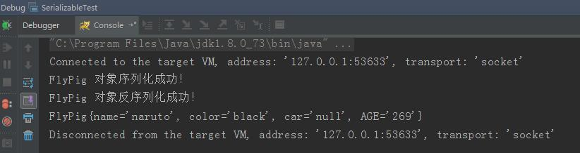
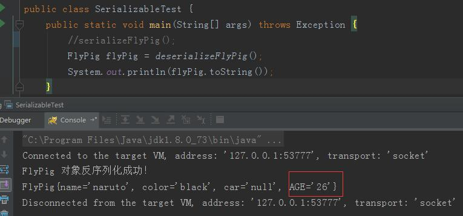
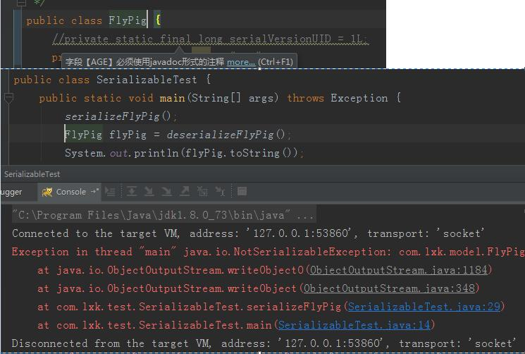
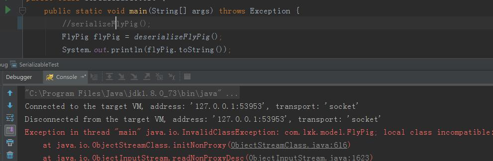
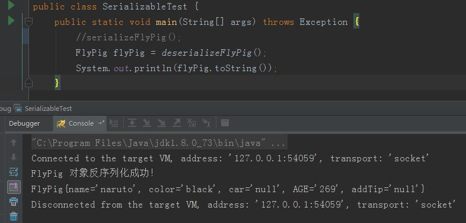

摘自：`https://blog.csdn.net/qq_27093465/article/details/78544505`


遇到这个 Java Serializable 序列化这个接口，我们可能会有如下的问题
a，什么叫序列化和反序列化
b，作用。为啥要实现这个 Serializable 接口，也就是为啥要序列化
c，serialVersionUID 这个的值到底是在怎么设置的，有什么用。有的是1L，有的是一长串数字，迷惑ing。
我刚刚见到这个关键字 Serializable 的时候，就有如上的这么些问题。

在处理这个问题之前，你要先知道一个问题，这个比较重要。
这个Serializable接口，以及相关的东西，全部都在 Java io 里面的。


1,序列化和反序列化的概念
序列化：把对象转换为字节序列的过程称为对象的序列化。
反序列化：把字节序列恢复为对象的过程称为对象的反序列化。

上面是专业的解释，现在来点通俗的解释。在代码运行的时候，我们可以看到很多的对象(debug过的都造吧)，
可以是一个，也可以是一类对象的集合，很多的对象数据，这些数据中，
有些信息我们想让他持久的保存起来，那么这个就叫序列化。
就是把内存里面的这些对象给变成一连串的字节(bytes)描述的过程。
常见的就是变成文件
我不序列化也可以保存文件啥的呀，有什么影响呢？我也是这么问的。

2,什么情况下需要序列化 
当你想把的内存中的对象状态保存到一个文件中或者数据库中时候；
当你想用套接字在网络上传送对象的时候；
当你想通过RMI传输对象的时候；

(老实说，上面的几种，我可能就用过个存数据库的。)

 

3,java如何实现序列化
实现Serializable接口即可

上面这些理论都比较简单，下面实际代码看看这个序列化到底能干啥，以及会产生的bug问题。

先上对象代码，飞猪.java

```java
package com.lxk.model;
import java.io.Serializable;

public class FlyPig implements Serializable {
    //private static final long serialVersionUID = 1L;
    private static String AGE = "269";
    private String name;
    private String color;
    transient private String car;
 
    //private String addTip;
 
    public String getName() {
        return name;
    }
 
    public void setName(String name) {
        this.name = name;
    }
 
    public String getColor() {
        return color;
    }
 
    public void setColor(String color) {
        this.color = color;
    }
 
    public String getCar() {
        return car;
    }
 
    public void setCar(String car) {
        this.car = car;
    }
 
    //public String getAddTip() {
    //    return addTip;
    //}
    //
    //public void setAddTip(String addTip) {
    //    this.addTip = addTip;
    //}
 
    @Override
    public String toString() {
        return "FlyPig{" +
                "name='" + name + '\'' +
                ", color='" + color + '\'' +
                ", car='" + car + '\'' +
                ", AGE='" + AGE + '\'' +
                //", addTip='" + addTip + '\'' +
                '}';
    }
}
```

注意下，注释的代码，是一会儿要各种情况下使用的。下面就是main方法啦

```java
package com.lxk.test;
 
import com.lxk.model.FlyPig;
 
import java.io.*;
 
/**
 * 序列化测试
 *
 * @author lxk on 2017/11/1
 */
public class SerializableTest {
    public static void main(String[] args) throws Exception {
        serializeFlyPig();
        FlyPig flyPig = deserializeFlyPig();
        System.out.println(flyPig.toString());
 
    }
 
    /**
     * 序列化
     */
    private static void serializeFlyPig() throws IOException {
        FlyPig flyPig = new FlyPig();
        flyPig.setColor("black");
        flyPig.setName("naruto");
        flyPig.setCar("0000");
        // ObjectOutputStream 对象输出流，将 flyPig 对象存储到E盘的 flyPig.txt 文件中，完成对 flyPig 对象的序列化操作
        ObjectOutputStream oos = new ObjectOutputStream(new FileOutputStream(new File("d:/flyPig.txt")));
        oos.writeObject(flyPig);
        System.out.println("FlyPig 对象序列化成功！");
        oos.close();
    }
 
    /**
     * 反序列化
     */
    private static FlyPig deserializeFlyPig() throws Exception {
        ObjectInputStream ois = new ObjectInputStream(new FileInputStream(new File("d:/flyPig.txt")));
        FlyPig person = (FlyPig) ois.readObject();
        System.out.println("FlyPig 对象反序列化成功！");
        return person;
    }
}
```

对上面的2个操作文件流的类的简单说明。ObjectOutputStream代表对象输出流：

它的writeObject(Object obj)方法可对参数指定的obj对象进行序列化，把得到的字节序列写到一个目标输出流中。ObjectInputStream代表对象输入流：

它的readObject()方法从一个源输入流中读取字节序列，再把它们反序列化为一个对象，并将其返回。

具体怎么看运行情况。第一种：上来就这些代码，不动，直接run，看效果。实际运行结果，他会在 d:/flyPig.txt 生成个文件。


从运行结果上看：

1，他实现了对象的序列化和反序列化。

2，transient 修饰的属性，是不会被序列化的。我设置的奥迪四个圈的车不见啦，成了null。my god。

3，你先别着急说，这个静态变量AGE也被序列化啦。这个得另测。

 

第二种：为了验证这个静态的属性能不能被序列化和反序列化，可如下操作。

```java
public static void main(String[] args) throws Exception {
    serializeFlyPig();
    //FlyPig flyPig = deserializeFlyPig();
    //System.out.println(flyPig.toString());
}
```

这个完了之后，意思也就是说，你先序列化个对象到文件了。这个对象是带静态变量的static。

现在修改flyPig类里面的AGE的值，给改成26吧。然后，看下图里面的运行代码和执行结果。



可以看到，刚刚序列化的269，没有读出来。而是刚刚修改的26，如果可以的话，应该是覆盖这个26，是269才对。

所以，得出结论，这个静态static的属性，他不序列化。

 

第三种：示范这个 serialVersionUID 的作用和用法

最暴力的改法，直接把model的类实现的这个接口去掉。然后执行后面的序列化和反序列化的方法。直接报错。抛异常：NotSerializableException



这个太暴力啦，不推荐这么干。

然后就是，还和上面的操作差不多，先是单独执行序列化方法。生成文件。然后，打开属性 addTip ，这之后，再次执行反序列化方法，看现象。



抛异常：InvalidClassException  详情如下。

InvalidClassException: com.lxk.model.FlyPig; 
local class incompatible: 
stream classdesc serialVersionUID = -3983502914954951240, 
local class serialVersionUID = 7565838717623951575

解释一下：

因为我再model里面是没有明确的给这个 serialVersionUID 赋值，但是，Java会自动的给我赋值的，

这个值跟这个model的属性相关计算出来的。我保存的时候，也就是我序列化的时候，那时候还没有这个addTip属性呢，所以，自动生成的serialVersionUID 这个值，

在我反序列化的时候Java自动生成的这个serialVersionUID值是不同的，他就抛异常啦。

（你还可以反过来，带ID去序列化，然后，没ID去反序列化。也是同样的问题。）

再来一次，就是先序列化，这个时候，把 private static final long serialVersionUID = 1L; 这行代码的注释打开。那个addTip属性先注释掉，序列化之后，再把这个属性打开，再反序列化。看看什么情况。




这个时候，代码执行OK，一切正常。good。序列化的时候，是没的那个属性的，在发序列化的时候，对应的model多了个属性，但是，反序列化执行OK，没出异常。

 

这个现象对我们有什么意义：

老铁，这个意义比较大，首先，你要是不知道这个序列化是干啥的，万一他真的如开头所讲的那样存数据库（这个存db是否涉及到Java的序列化估计还的看什么数据库吧）啦，socket传输啦，rmi传输啦。虽然我也不知道这是干啥的。你就给model bean 实现了个这个接口，你没写这个 serialVersionUID 那么在后来扩展的时候，可能就会出现不认识旧数据的bug，那不就炸啦吗。回忆一下上面的这个出错情况。想想都可怕，这个锅谁来背？ 

所以，有这么个理论，就是在实现这个Serializable 接口的时候，一定要给这个 serialVersionUID 赋值，就是这么个问题。这也就解释了，我们刚刚开始编码的时候，实现了这个接口之后，为啥eclipse编辑器要黄色警告，需要添加个这个ID的值。而且还是一长串你都不知道怎么来的数字。

 

下面解释这个 serialVersionUID 的值到底怎么设置才OK。

首先，你可以不用自己去赋值，Java会给你赋值，但是，这个就会出现上面的bug，很不安全，所以，还得自己手动的来。那么，我该怎么赋值，eclipse可能会自动给你赋值个一长串数字。这个是没必要的。可以简单的赋值个 1L，这就可以啦。。这样可以确保代码一致时反序列化成功。不同的serialVersionUID的值，会影响到反序列化，也就是数据的读取，你写1L，注意L大些。计算机是不区分大小写的，但是，作为观众的我们，是要区分1和L的l，所以说，这个值，闲的没事不要乱动，不然一个版本升级，旧数据就不兼容了，你还不知道问题在哪。。。

下面是摘自 jdk api 文档里面关于接口 Serializable 的描述。类通过实现 java.io.Serializable 接口以启用其序列化功能。未实现此接口的类将无法使其任何状态序列化或反序列化。可序列化类的所有子类型本身都是可序列化的。因为实现接口也是间接的等同于继承。序列化接口没有方法或字段，仅用于标识可序列化的语义。

序列化运行时使用一个称为 serialVersionUID 的版本号与每个可序列化类相关联，该序列号在反序列化过程中用于验证序列化对象的发送者和接收者是否为该对象加载了与序列化兼容的类。如果接收者加载的该对象的类的 serialVersionUID 与对应的发送者的类的版本号不同，则反序列化将会导致 InvalidClassException。可序列化类可以通过声明名为 "serialVersionUID" 的字段（该字段必须是静态 (static)、最终 (final) 的 long 型字段）显式声明其自己的 serialVersionUID：

如果可序列化类未显式声明 serialVersionUID，则序列化运行时将基于该类的各个方面计算该类的默认 serialVersionUID 值，如“Java(TM) 对象序列化规范”中所述。不过，强烈建议 所有可序列化类都显式声明 serialVersionUID 值，原因是计算默认的 serialVersionUID 对类的详细信息具有较高的敏感性，根据编译器实现的不同可能千差万别，这样在反序列化过程中可能会导致意外的 InvalidClassException。因此，为保证 serialVersionUID 值跨不同 java 编译器实现的一致性，序列化类必须声明一个明确的 serialVersionUID 值。还强烈建议使用 private 修饰符显示声明 serialVersionUID（如果可能），原因是这种声明仅应用于直接声明类 -- serialVersionUID 字段作为继承成员没有用处。数组类不能声明一个明确的 serialVersionUID，因此它们总是具有默认的计算值，但是数组类没有匹配 serialVersionUID 值的要求。


这个serialVersionUID 的值在存数据库的时候，存在那里？在java中，我们可以通过多种方式来创建对象，并且只要对象没有被回收，我们都可以复用该对象。但是，我们创建出来的这些java对象都是存在JVM的堆内存中的。只有JVM处于运行状态的时候，这些对象才可能存在。一旦JVM停止运行，这些对象的状态也就随之而丢失了。
但是在真实的应用场景中，我们需要将这些对象持久化下来，并且能够在需要的时候把对象重新读取出来。java 的对象序列化可以帮我们实现该功能。


