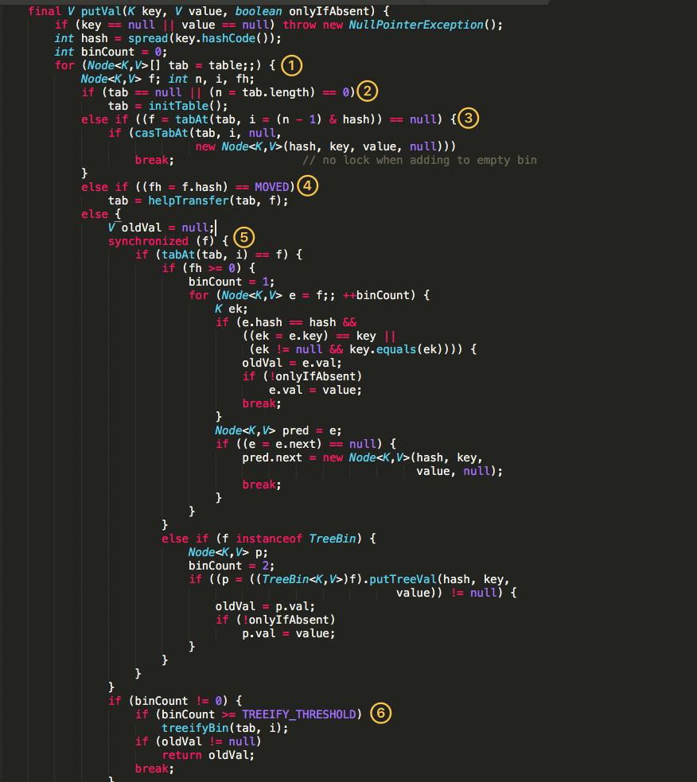

参考：

```
https://crossoverjie.top/2018/07/23/java-senior/ConcurrentHashMap/
http://www.jasongj.com/java/concurrenthashmap/
```

# 一、jdk7中实现简介

原理上来说：`ConcurrentHashMap` 采用了分段锁技术，其中 `Segment `继承于` ReentrantLock`。不会像 `HashTable `那样不管是 `put `还是 `get `操作都需要做同步处理，理论上` ConcurrentHashMap` 支持 `CurrencyLevel `(`Segment `数组数量)的线程并发。每当一个线程占用锁访问一个` Segment `时，不会影响到其他的` Segment`。


# 二、jdk8实现原理

JDK1.8的实现已经摒弃了Segment的概念，而是直接用Node数组+链表+红黑树的数据结构来实现，并发控制使用Synchronized和CAS来操作，整个看起来就像是优化过且线程安全的HashMap，虽然在JDK1.8中还能看到Segment的数据结构，但是已经简化了属性，只是为了兼容旧版本。




- 根据 key 计算出 hashcode 。
- 判断是否需要进行初始化。
- `f` 即为当前 key 定位出的 Node，如果为空表示当前位置可以写入数据，利用 CAS 尝试写入，失败则自旋保证成功。
- 如果当前位置的 `hashcode == MOVED == -1`,则需要进行扩容。
- 如果都不满足，则利用 synchronized 锁写入数据。
- 如果数量大于 `TREEIFY_THRESHOLD` 则要转换为红黑树。


对于put操作，如果Key对应的数组元素为null，则通过[CAS操作](http://www.jasongj.com/java/thread_safe/#CAS（compare-and-swap）)将其设置为当前值。如果Key对应的数组元素（也即链表表头或者树的根元素）不为null，则对该元素使用synchronized关键字申请锁，然后进行操作。如果该put操作使得当前链表长度超过一定阈值，则将该链表转换为树，从而提高寻址效率。

对于读操作，由于数组被volatile关键字修饰，因此不用担心数组的可见性问题。同时每个元素是一个Node实例（Java 7中每个元素是一个HashEntry），它的Key值和hash值都由final修饰，不可变更，无须关心它们被修改后的可见性问题。而其Value及对下一个元素的引用由volatile修饰，可见性也有保障。

```
static class Node<K,V> implements Map.Entry<K,V> {
  final int hash;
  final K key;
  volatile V val;
  volatile Node<K,V> next;
}
```


对于Key对应的数组元素的可见性，由Unsafe的getObjectVolatile方法保证。

```
static final <K,V> Node<K,V> tabAt(Node<K,V>[] tab, int i) {
  return (Node<K,V>)U.getObjectVolatile(tab, ((long)i << ASHIFT) + ABASE);
}
```


