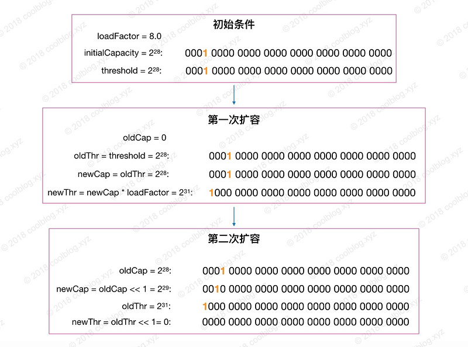
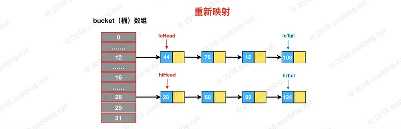

### 1.概述

参考：`https://segmentfault.com/a/1190000012926722`

这里直接从`jdk8`源码中的说明截取出来：

* 此实现提供了所有可选的映射操作,并**允许`null`值和`null`键**。( `HashMap `类大致等同于` Hashtable` ,除了它是未同步的并允许`null`)。这个类不保证映射的顺序。

* `HashMap` 的实例有两个影响其性能的参数：初始容量和负载因子。`capacity `是散列表中的桶的数量,初始容量只是创建散列表时的容量。当哈希表中的条目的数量超过负载因子和当前容量的乘积时,哈希表被重新哈希(即,重建内部数据结构),使得哈希表具有大约两倍的桶数。

* 如果多个线程并发访问哈希映射,并且至少有一个线程在结构上修改了映射,则必须同步外部。 (结构修改是添加或删除一个或多个映射的任何操作;仅改变与实例已经包含的关键字相关联的值不是结构修改。)这通常通过在自然地封装映射的某个对象上同步来实现。

* 所有这个类的"集合视图方法"返回的迭代器都是**` fail-fast `**：如果在创建迭代器之后的任何时候地图被结构化修改,除非通过迭代器自己的` remove `方法,迭代器将抛出一个`ConcurrentModificationException`。因此,面对并发修改,迭代器快速而干净地失败,而不是在将来的未确定时间冒任意的,非确定性行为的风险。

### 2.原理

`HashMap`的主体数据结构就是**数组+链表+红黑树**。首先通过`key`的`hash`值与容器初始容量取余得到在数组中的位置`index`，如果当前位置为空，则直接添加，否则与当前已存在的元素组成一个链表，当链表上的元素个数达到`8`个的时候，这个链表转换为一颗红黑树。当红黑树上的元素减少到`6`个的时候则会转换为链表结构，其基本结构图如下：


#### 2.1 构造函数、初始容量、负载因子、阈值

构造函数这里不细说，提供四个构造函数，可以指定负载因子和初始容量，为了性能，最好不要将初始容量设置得过高，同时默认负载因子已经足够平衡，无须自己指定。

```java
//默认的初始容量 - 必须是2的幂。这样hash值与容量取模操作则变成了位移操作，可以提高性能
static final int DEFAULT_INITIAL_CAPACITY = 1 << 4; // aka 16

//最大容量,如果较高的值由具有参数的任何构造函数隐式指定,则使用此容量。必须是二的幂<= 1 << 30。
static final int MAXIMUM_CAPACITY = 1 << 30;

//在构造函数中未指定时使用的负载系数。
static final float DEFAULT_LOAD_FACTOR = 0.75f;

//链表转换为红黑树的阈值
static final int TREEIFY_THRESHOLD = 8;

//红黑树转换为链表的阈值
static final int UNTREEIFY_THRESHOLD = 6;

//容器的树最小的表容量。 (否则,如果bin中有太多的节点,则调整表的大小。)
//应至少为4 * TREEIFY_THRESHOLD,以避免调整大小和树化阈值之间的冲突。
static final int MIN_TREEIFY_CAPACITY = 64;

//调整大小的下一个大小值(容量*负载系数)，超过此值则需要扩容
int threshold;
```


#### 2.2 查找

```java
public V get(Object key) {
    Node<K,V> e;
    return (e = getNode(hash(key), key)) == null ? null : e.value;
}

final Node<K,V> getNode(int hash, Object key) {
    Node<K,V>[] tab; Node<K,V> first, e; int n; K k;
	//确定当前节点所在数组的位置 index=(n - 1) & hash
	//如果首节点不为空
    if ((tab = table) != null && (n = tab.length) > 0 &&
        (first = tab[(n - 1) & hash]) != null) {
		//如果首节点与当前节点的hash值一样，且key也一样，说明要找的就是首节点
        if (first.hash == hash && // always check first node
            ((k = first.key) == key || (key != null && key.equals(k))))
            return first;
        if ((e = first.next) != null) {
			//如果首节点时一个树节点，则去树里面查找，否则在链表中查找
            if (first instanceof TreeNode)
                return ((TreeNode<K,V>)first).getTreeNode(hash, key);
            do {
                if (e.hash == hash &&
                    ((k = e.key) == key || (key != null && key.equals(k))))
                    return e;
            } while ((e = e.next) != null);
        }
    }
    return null;
}
//就算hash值
static final int hash(Object key) {
    int h;
    return (key == null) ? 0 : (h = key.hashCode()) ^ (h >>> 16);
}
```

这里对`hash`值计算进行说明：

我们再看一下上面求余的计算图，图中的` hash `是由键的` hashCode `产生。计算余数时，由于` n `比较小，`hash `只有低`4`位参与了计算，高位的计算可以认为是无效的。这样导致了计算结果只与低位信息有关，高位数据没发挥作用。为了处理这个缺陷，我们可以上图中的` hash` 高`4`位数据与低`4`位数据进行异或运算，即` hash ^ (hash >>> 4)`。通过这种方式，让高位数据与低位数据进行异或，以此加大低位信息的随机性，变相的让高位数据参与到计算中。此时的计算过程如下：


在` Java `中，`hashCode `方法产生的 `hash` 是` int `类型，`32 `位宽。前`16`位为高位，后`16`位为低位，所以要右移`16`位。上面所说的是重新计算` hash `的一个好处，除此之外，重新计算` hash `的另一个好处是可以增加` hash `的复杂度。当我们覆写` hashCode `方法时，可能会写出分布性不佳的` hashCode `方法，进而导致` hash` 的冲突率比较高。通过移位和异或运算，可以让` hash` 变得更复杂，进而影响` hash `的分布性。这也就是为什么` HashMap `不直接使用键对象原始` hash `的原因了。


#### 2.3遍历

在遍历` HashMap `的过程中会发现，多次对` HashMap `进行遍历时，遍历结果顺序都是一致的。但这个顺序和插入的顺序一般都是不一致的。产生上述行为的原因是怎样的呢？大家想一下原因。我先把遍历相关的代码贴出来，如下：

```java
//Map基本迭代使用
Set keys = map.keySet();
Iterator ite = keys.iterator();
while (ite.hasNext()) {
    Object key = ite.next();
    // do something
}
//一般会调用此方法获得key集合
public Set<K> keySet() {
    Set<K> ks;
    return (ks = keySet) == null ? (keySet = new KeySet()) : ks;
}
/**
 * 键集合，无有参构造函数
 */
final class KeySet extends AbstractSet<K> {
    public final int size()                 { return size; }
    public final void clear()               { HashMap.this.clear(); }
    public final Iterator<K> iterator()     { return new KeyIterator(); }
    public final boolean contains(Object o) { return containsKey(o); }
    public final boolean remove(Object key) {
        return removeNode(hash(key), key, null, false, true) != null;
    }
    // 省略部分代码
}

/**
 * 键迭代器
 */
final class KeyIterator extends HashIterator 
    implements Iterator<K> {
    public final K next() { return nextNode().key; }
}

abstract class HashIterator {
    Node<K,V> next;        // next entry to return
    Node<K,V> current;     // current entry
    int expectedModCount;  // for fast-fail
    int index;             // current slot数组的index
	//此构造方法会被调用
    HashIterator() {
        expectedModCount = modCount;
        Node<K,V>[] t = table;//当前map容器
        current = next = null;
        index = 0;
        //找到容器数组中第一个不为空的节点
        if (t != null && size > 0) { // advance to first entry 
            // 寻找第一个包含链表节点引用的桶
            do {} while (index < t.length && (next = t[index++]) == null);
        }
    }

    public final boolean hasNext() {
        return next != null;
    }

    final Node<K,V> nextNode() {
        Node<K,V>[] t;
        Node<K,V> e = next;
        if (modCount != expectedModCount)
            throw new ConcurrentModificationException();
        if (e == null)
            throw new NoSuchElementException();
        //调用时这里每次都将不为空的next节点返回出去，而每次都检测容器不为空是
        //因为在迭代器中可以调用删除方法
        //当某个链表遍历完时，next也为null了，于是进入到if语句中
        if ((next = (current = e).next) == null && (t = table) != null) {
            //和初始化操作一样，寻找下一个包含链表节点引用的桶
            do {} while (index < t.length && (next = t[index++]) == null);
        }
        return e;
    }
    //省略部分代码
}
```

如上面的源码，遍历所有的键时，首先要获取键集合`KeySet`对象，然后再通过` KeySet `的迭代器`KeyIterator`进行遍历。`KeyIterator `类继承自`HashIterator`类，核心逻辑也封装在` HashIterator `类中。`HashIterator `的逻辑并不复杂，**在初始化时，`HashIterator` 先从桶数组中找到第一个不为空的节点**。遍历时将每个数组的每个不为空的位置都当作一个链表去表里。遍历完成后，再继续寻找下一个包含链表节点引用的桶，找到继续遍历。找不到，则结束遍历。如图所示：


这里有一个问题是，在迭代过程中并没有看到对红黑树的遍历？这个问题可参考`2.6`节。


#### 2.4 插入

首先肯定是先定位要插入的键值对属于哪个桶，定位到桶后，再判断桶是否为空。如果为空，则将键值对存入即可。如果不为空，则需将键值对接在链表最后一个位置，或者更新键值对，但是显然不会这么简单。首先 `HashMap `是变长集合，所以需要考虑扩容的问题。其次，在` JDK 1.8 `中，`HashMap` 引入了红黑树优化过长链表，这里还要考虑多长的链表需要进行优化，优化过程又是怎样的问题。源码如下：

```java
public V put(K key, V value) {
    return putVal(hash(key), key, value, false, true);
}

final V putVal(int hash, K key, V value, boolean onlyIfAbsent,
               boolean evict) {
    Node<K,V>[] tab; Node<K,V> p; int n, i;
    // 初始化桶数组 table，table 被延迟到插入新数据时再进行初始化
    if ((tab = table) == null || (n = tab.length) == 0)
        n = (tab = resize()).length;
    // 如果桶中不包含键值对节点引用，则将新键值对节点的引用存入桶中即可，计算index
    if ((p = tab[i = (n - 1) & hash]) == null)
        tab[i] = newNode(hash, key, value, null);
    else {
        Node<K,V> e; K k;
        // 如果键的值以及节点 hash 等于链表中的第一个键值对节点时，则将 e 指向该键值对
        if (p.hash == hash &&
            ((k = p.key) == key || (key != null && key.equals(k))))
            e = p;
            
        // 如果桶中的引用类型为 TreeNode，则调用红黑树的插入方法
        else if (p instanceof TreeNode)  
            e = ((TreeNode<K,V>)p).putTreeVal(this, tab, hash, key, value);
        else {
            // 对链表进行遍历，并统计链表长度
            for (int binCount = 0; ; ++binCount) {
                // 链表中不包含要插入的键值对节点时，则将该节点接在链表的最后
                if ((e = p.next) == null) {
                    p.next = newNode(hash, key, value, null);
                    // 如果链表长度大于或等于树化阈值，则进行树化操作
                    if (binCount >= TREEIFY_THRESHOLD - 1) // -1 for 1st
                        treeifyBin(tab, hash);
                    break;
                }
                
                // 条件为 true，表示当前链表包含要插入的键值对，终止遍历
                if (e.hash == hash &&
                    ((k = e.key) == key || (key != null && key.equals(k))))
                    break;
                p = e;
            }
        }
        
        // 判断要插入的键值对是否存在 HashMap 中
        if (e != null) { // existing mapping for key
            V oldValue = e.value;
            // onlyIfAbsent 表示是否仅在 oldValue 为 null 的情况下更新键值对的值
            if (!onlyIfAbsent || oldValue == null)
                e.value = value;
            afterNodeAccess(e);
            return oldValue;
        }
    }
    ++modCount;
    // 键值对数量超过阈值时，则进行扩容
    if (++size > threshold)
        resize();
    afterNodeInsertion(evict);
    return null;
}
```

`putVal` 方法主要做了这么几件事情：

* 1. 当桶数组` table `为空时，通过扩容的方式初始化` table`
* 2. 查找要插入的键值对是否已经存在，存在的话根据条件判断是否用新值替换旧值
* 3. 如果不存在，则将键值对链入链表中，并根据链表长度决定是否将链表转为红黑树
* 4. 判断键值对数量是否大于阈值，大于的话则进行扩容操作

以上就是 `HashMap `插入的逻辑，并不是很复杂，这里就不多说了。接下来来分析一下扩容机制。

我们直到`HashMap`的键和值都是可以为`null`的，而`null`键存放在数组中的第一个位置，即`table[0]`。

#### 2.5 扩容

在 `HashMap `中，桶数组的长度均是`2`的幂，阈值大小为桶数组长度与负载因子的乘积。当 `HashMap `中的键值对数量超过阈值时，进行扩容。

`HashMap`的扩容机制与其他变长集合的套路不太一样，`HashMap` 按当前桶数组长度的`2`倍进行扩容，阈值也变为原来的`2`倍（如果计算过程中，阈值溢出归零，则按阈值公式重新计算）。扩容之后，要重新计算键值对的位置，并把它们移动到合适的位置上去。以上就是` HashMap `的扩容大致过程，接下来我们来看看具体的实现：

```java
final Node<K,V>[] resize() {
    Node<K,V>[] oldTab = table;
    int oldCap = (oldTab == null) ? 0 : oldTab.length;
    int oldThr = threshold;
    int newCap, newThr = 0;
    //分支一： 如果 table 不为空，表明已经初始化过了
    if (oldCap > 0) {
        // 当 table 容量超过容量最大值，则不再扩容
        if (oldCap >= MAXIMUM_CAPACITY) {
            threshold = Integer.MAX_VALUE;
            return oldTab;
        } 
        // 按旧容量和阈值的2倍计算新容量和阈值的大小
        else if ((newCap = oldCap << 1) < MAXIMUM_CAPACITY &&
                 oldCap >= DEFAULT_INITIAL_CAPACITY)
            newThr = oldThr << 1; // double threshold
    } else if (oldThr > 0) // initial capacity was placed in threshold
        /*
         * 初始化时，将 threshold 的值赋值给 newCap，
         * HashMap 使用 threshold 变量暂时保存 initialCapacity 参数的值
         * oldCap == 0 && oldThr > 0
         */ 
        newCap = oldThr;
    else {               // zero initial threshold signifies using defaults
        /*
         * 调用无参构造方法时，桶数组容量为默认容量，
         * 阈值为默认容量与默认负载因子乘积
         */
        newCap = DEFAULT_INITIAL_CAPACITY;
        newThr = (int)(DEFAULT_LOAD_FACTOR * DEFAULT_INITIAL_CAPACITY);
    }
    
    //分支二： newThr 为 0 时，按阈值计算公式进行计算
    if (newThr == 0) {
        float ft = (float)newCap * loadFactor;
        newThr = (newCap < MAXIMUM_CAPACITY && ft < (float)MAXIMUM_CAPACITY ?
                  (int)ft : Integer.MAX_VALUE);
    }
    threshold = newThr;
    // 创建新的桶数组，桶数组的初始化也是在这里完成的
    Node<K,V>[] newTab = (Node<K,V>[])new Node[newCap];
    table = newTab;
    if (oldTab != null) {
        // 如果旧的桶数组不为空，则遍历桶数组，并将键值对映射到新的桶数组中
        for (int j = 0; j < oldCap; ++j) {
            Node<K,V> e;
            if ((e = oldTab[j]) != null) {
                oldTab[j] = null;
                //此位置上只有一个节点
                if (e.next == null)
                    newTab[e.hash & (newCap - 1)] = e;
                else if (e instanceof TreeNode)
                    // 重新映射时，需要对红黑树进行拆分
                    ((TreeNode<K,V>)e).split(this, newTab, j, oldCap);
                else { // preserve order
                    Node<K,V> loHead = null, loTail = null;
                    Node<K,V> hiHead = null, hiTail = null;
                    Node<K,V> next;
                    // 遍历链表，并将链表节点按原顺序进行分组
                    do {
                        next = e.next;
                        if ((e.hash & oldCap) == 0) {
                            if (loTail == null)
                                loHead = e;
                            else
                                loTail.next = e;
                            loTail = e;
                        }
                        else {
                            if (hiTail == null)
                                hiHead = e;
                            else
                                hiTail.next = e;
                            hiTail = e;
                        }
                    } while ((e = next) != null);
                    // 将分组后的链表映射到新桶中
                    if (loTail != null) {
                        loTail.next = null;
                        newTab[j] = loHead;
                    }
                    if (hiTail != null) {
                        hiTail.next = null;
                        newTab[j + oldCap] = hiHead;
                    }
                }
            }
        }
    }
    return newTab;
}
```

上面的源码总共做了`3`件事，分别是：

* 计算新桶数组的容量` newCap` 和新阈值` newThr`
* 根据计算出的` newCap `创建新的桶数组，桶数组` table `也是在这里进行初始化的
* 将键值对节点重新映射到新的桶数组里。如果节点是` TreeNode` 类型，则需要拆分红黑树。如果是普通节点，则节点按原顺序进行分组。

分支一包含了三种情况：

| 条件                         | 覆盖情况                                | 备注                                                         |
| ---------------------------- | --------------------------------------- | ------------------------------------------------------------ |
| `oldCap > 0`                 | 桶数组` table `已经被初始化             |                                                              |
| `oldThr > 0`                 | `threshold > 0`，且桶数组未被初始化     | 调用` HashMap(int) `和 `HashMap(int, float)` 构造方法时会产生这种情况，此种情况下` newCap = oldThr`，`newThr `在第二个条件分支中算出 |
| `oldCap == 0 && oldThr == 0` | 桶数组未被初始化，且` threshold `为 `0` | 调用` HashMap() `构造方法会产生这种情况                      |

这里把`oldThr > 0`情况单独拿出来说一下。在这种情况下，会将` oldThr `赋值给` newCap`，等价于`newCap = threshold = tableSizeFor(initialCapacity)`。我们在初始化时传入的` initialCapacity `参数经过 `threshold `中转最终赋值给了` newCap`。这也就解答了前面提的一个疑问：`initialCapacity `参数没有被保存下来，那么它怎么参与桶数组的初始化过程的呢？
嵌套分支：

| 条件                           | 覆盖情况                                        | 备注                                                        |
| ------------------------------ | ----------------------------------------------- | ----------------------------------------------------------- |
| `oldCap >= 2^30`               | 桶数组容量大于或等于最大桶容量 `2^30`           | 这种情况下不再扩容                                          |
| `newCap < 2^30 && oldCap > 16` | 新桶数组容量小于最大值，且旧桶数组容量大于` 16` | 该种情况下新阈值` newThr = oldThr << 1`，移位可能会导致溢出 |

这里简单说明一下移位导致的溢出情况，当` loadFactor`小数位为` 0`，整数位可被`2`整除且大于等于`8`时，在某次计算中就可能会导致` newThr` 溢出归零。见下图：



分支二：

| 条件          | 覆盖情况                                                     | 备注 |
| ------------- | ------------------------------------------------------------ | ---- |
| `newThr == 0` | 第一个条件分支未计算` newThr `或嵌套分支在计算过程中导致` newThr `溢出归零 |      |

这里就是进行重新映射了，基本原理就是依次遍历链表，并计算节点 `hash & oldCap` 的值。如下图所示：


如果值为`0`，将` loHead 和 loTail `指向这个节点。如果后面还有节点` hash & oldCap `为`0`的话，则将节点链入` loHead` 指向的链表中，并将` loTail `指向该节点。如果值为非`0`的话，则让` hiHead` 和` hiTail `指向该节点。完成遍历后，可能会得到两条链表，此时就完成了链表分组：


最后再将这两条链接存放到相应的桶中，完成扩容。如下图：


这里一定要注意，在决定某个节点是否要重新映射的时候判断依据是`hash & oldCap`是否为`0`，而计算`index`的时候是`hash&(newCap - 1)`。

从上图可以发现，重新映射后，两条链表中的节点顺序并未发生变化，还是保持了扩容前的顺序。以上就是` JDK 1.8 `中` HashMap `扩容的代码讲解。另外再补充一下，在` JDK 1.8 `中，则通过引入红黑树避免了多次计算 `hash` 的操作，提高了扩容效率。上面如果节点是红黑树，则还要对其进行拆分。


#### 2.6 链表树化、红黑树链化与拆分

红黑树是一种自平衡的二叉查找树，本身就比较复杂，这里不做细说，只是分析树化相关代码：

```java
static final int TREEIFY_THRESHOLD = 8;

/**
 * 当桶数组容量小于该值时，优先进行扩容，而不是树化
 */
static final int MIN_TREEIFY_CAPACITY = 64;

static final class TreeNode<K,V> extends LinkedHashMap.Entry<K,V> {
    TreeNode<K,V> parent;  // red-black tree links
    TreeNode<K,V> left;
    TreeNode<K,V> right;
    TreeNode<K,V> prev;    // needed to unlink next upon deletion
    boolean red;
    TreeNode(int hash, K key, V val, Node<K,V> next) {
        super(hash, key, val, next);
    }
}

/**
 * 将普通节点链表转换成树形节点链表
 */
final void treeifyBin(Node<K,V>[] tab, int hash) {
    int n, index; Node<K,V> e;
    // 桶数组容量小于 MIN_TREEIFY_CAPACITY，优先进行扩容而不是树化
    if (tab == null || (n = tab.length) < MIN_TREEIFY_CAPACITY)
        resize();
    else if ((e = tab[index = (n - 1) & hash]) != null) {
        // hd 为头节点（head），tl 为尾节点（tail）
        TreeNode<K,V> hd = null, tl = null;
        do {
            // 将普通节点替换成树形节点
            TreeNode<K,V> p = replacementTreeNode(e, null);
            if (tl == null)
                hd = p;
            else {
                p.prev = tl;
                tl.next = p;
            }
            tl = p;
        } while ((e = e.next) != null);  // 将普通链表转成由树形节点链表
        if ((tab[index] = hd) != null)
            // 将树形链表转换成红黑树
            hd.treeify(tab);
    }
}

TreeNode<K,V> replacementTreeNode(Node<K,V> p, Node<K,V> next) {
    return new TreeNode<>(p.hash, p.key, p.value, next);
}
```

在扩容过程中，树化要满足两个条件：

1. 链表长度大于等于` TREEIFY_THRESHOLD`
2. 桶数组容量大于等于 `MIN_TREEIFY_CAPACITY`

第一个条件比较好理解，这里就不说了。这里来说说加入第二个条件的原因，个人觉得原因如下：

**当桶数组容量比较小时，键值对节点` hash `的碰撞率可能会比较高，进而导致链表长度较长。这个时候应该优先扩容，而不是立马树化**。毕竟高碰撞率是因为桶数组容量较小引起的，这个是主因。容量小时，优先扩容可以避免一些列的不必要的树化过程。同时，桶容量较小时，扩容会比较频繁，扩容时需要拆分红黑树并重新映射。所以在桶容量比较小的情况下，将长链表转成红黑树是一件吃力不讨好的事。

回到上面的源码中，我们继续看一下` treeifyBin` 方法。该方法主要的作用是将普通链表转成为由` TreeNode `型节点组成的链表，并在最后调用` treeify `是将该链表转为红黑树。**`TreeNode `继承自 `Node `类，所以 `TreeNode` 仍然包含` next` 引用，原链表的节点顺序最终通过` next` 引用被保存下来**。我们假设树化前，链表结构如下：


**补充**：在分析之前先提一点，就是之前在遍历的时候我们并没有看到相关对红黑树的操作，从这里就可以看出来是为什么了，因为`TreeNode`继承自`Node`类，就算链表树化，通过`next`引用也同样可以找到下一个节点。

`HashMap `在设计之初，并没有考虑到以后会引入红黑树进行优化。所以并没有像` TreeMap `那样，要求键类实现 `comparable `接口或提供相应的比较器。但由于树化过程需要比较两个键对象的大小，在键类没有实现 `comparable `接口的情况下，怎么比较键与键之间的大小了就成了一个棘手的问题。为了解决这个问题，`HashMap` 是做了三步处理，确保可以比较出两个键的大小，如下：

* 比较键与键之间 `hash` 的大小，如果` hash `相同，继续往下比较
* 检测键类是否实现了` Comparable `接口，如果实现调用` compareTo `方法进行比较
* 如果仍未比较出大小，就需要进行仲裁了，仲裁方法为` tieBreakOrder`（大家自己看源码吧）。`tie break` 是网球术语，可以理解为加时赛的意思，起这个名字还是挺有意思的。

通过上面三次比较，最终就可以比较出孰大孰小。比较出大小后就可以构造红黑树了，最终构造出的红黑树如下：


橙色的箭头表示 `TreeNode` 的` next` 引用。由于空间有限，`prev` 引用未画出。可以看出，链表转成红黑树后，原链表的顺序仍然会被引用仍被保留了（红黑树的根节点会被移动到链表的第一位），我们仍然可以按遍历链表的方式去遍历上面的红黑树。这样的结构为后面红黑树的切分以及红黑树转成链表做好了铺垫，我们继续往下分析。


**红黑树拆分**

扩容后，普通节点需要重新映射，红黑树节点也不例外。按照一般的思路，我们可以先把红黑树转成链表，之后再重新映射链表即可。这种处理方式是大家比较容易想到的，但这样做会损失一定的效率。不同于上面的处理方式，`HashMap` 实现的思路则是上好佳（上好佳请把广告费打给我）。如上节所说，在将普通链表转成红黑树时，`HashMap `通过两个额外的引用 `next` 和` prev` 保留了原链表的节点顺序。这样再对红黑树进行重新映射时，完全可以按照映射链表的方式进行。这样就避免了将红黑树转成链表后再进行映射，无形中提高了效率。

```java
// 红黑树转链表阈值
static final int UNTREEIFY_THRESHOLD = 6;

final void split(HashMap<K,V> map, Node<K,V>[] tab, int index, int bit) {
    TreeNode<K,V> b = this;
    // Relink into lo and hi lists, preserving order
    TreeNode<K,V> loHead = null, loTail = null;
    TreeNode<K,V> hiHead = null, hiTail = null;
    int lc = 0, hc = 0;
    /* 
     * 红黑树节点仍然保留了 next 引用，故仍可以按链表方式遍历红黑树。
     * 下面的循环是对红黑树节点进行分组，与上面类似
     */
    for (TreeNode<K,V> e = b, next; e != null; e = next) {
        next = (TreeNode<K,V>)e.next;
        e.next = null;
        if ((e.hash & bit) == 0) {
            if ((e.prev = loTail) == null)
                loHead = e;
            else
                loTail.next = e;
            loTail = e;
            ++lc;
        }
        else {
            if ((e.prev = hiTail) == null)
                hiHead = e;
            else
                hiTail.next = e;
            hiTail = e;
            ++hc;
        }
    }

    if (loHead != null) {
        // 如果 loHead 不为空，且链表长度小于等于 6，则将红黑树转成链表
        if (lc <= UNTREEIFY_THRESHOLD)
            tab[index] = loHead.untreeify(map);
        else {
            tab[index] = loHead;
            /* 
             * hiHead == null 时，表明扩容后，
             * 所有节点仍在原位置，树结构不变，无需重新树化
             */
            if (hiHead != null) 
                loHead.treeify(tab);
        }
    }
    // 与上面类似
    if (hiHead != null) {
        if (hc <= UNTREEIFY_THRESHOLD)
            tab[index + bit] = hiHead.untreeify(map);
        else {
            tab[index + bit] = hiHead;
            if (loHead != null)
                hiHead.treeify(tab);
        }
    }
}
```

从源码上可以看得出，重新映射红黑树的逻辑和重新映射链表的逻辑基本一致。不同的地方在于，重新映射后，会将红黑树拆分成两条由 `TreeNode` 组成的链表。如果链表长度小于 `UNTREEIFY_THRESHOLD`，则将链表转换成普通链表。否则根据条件重新将` TreeNode` 链表树化。举个例子说明一下，假设扩容后，重新映射上图的红黑树，映射结果如下：



##### 红黑树链化

前面说过，红黑树中仍然保留了原链表节点顺序。有了这个前提，再将红黑树转成链表就简单多了，仅需将 `TreeNode` 链表转成 `Node` 类型的链表即可。相关代码如下：

```java
final Node<K,V> untreeify(HashMap<K,V> map) {
    Node<K,V> hd = null, tl = null;
    // 遍历 TreeNode 链表，并用 Node 替换
    for (Node<K,V> q = this; q != null; q = q.next) {
        // 替换节点类型
        Node<K,V> p = map.replacementNode(q, null);
        if (tl == null)
            hd = p;
        else
            tl.next = p;
        tl = p;
    }
    return hd;
}

Node<K,V> replacementNode(Node<K,V> p, Node<K,V> next) {
    return new Node<>(p.hash, p.key, p.value, next);
}
```

#### 2.7 删除

`HashMap` 的删除操作并不复杂，仅需三个步骤即可完成。第一步是定位桶位置，第二步遍历链表并找到键值相等的节点，第三步删除节点。相关源码如下：

```java
public V remove(Object key) {
    Node<K,V> e;
    return (e = removeNode(hash(key), key, null, false, true)) == null ?
        null : e.value;
}

final Node<K,V> removeNode(int hash, Object key, Object value,
                           boolean matchValue, boolean movable) {
    Node<K,V>[] tab; Node<K,V> p; int n, index;
    if ((tab = table) != null && (n = tab.length) > 0 &&
        // 1. 定位桶位置
        (p = tab[index = (n - 1) & hash]) != null) {
        Node<K,V> node = null, e; K k; V v;
        // 如果键的值与链表第一个节点相等，则将 node 指向该节点
        if (p.hash == hash &&
            ((k = p.key) == key || (key != null && key.equals(k))))
            node = p;
        else if ((e = p.next) != null) {  
            // 如果是 TreeNode 类型，调用红黑树的查找逻辑定位待删除节点
            if (p instanceof TreeNode)
                node = ((TreeNode<K,V>)p).getTreeNode(hash, key);
            else {
                // 2. 遍历链表，找到待删除节点
                do {
                    if (e.hash == hash &&
                        ((k = e.key) == key ||
                         (key != null && key.equals(k)))) {
                        node = e;
                        break;
                    }
                    p = e;
                } while ((e = e.next) != null);
            }
        }
        
        // 3. 删除节点，并修复链表或红黑树
        if (node != null && (!matchValue || (v = node.value) == value ||
                             (value != null && value.equals(v)))) {
            if (node instanceof TreeNode)
                ((TreeNode<K,V>)node).removeTreeNode(this, tab, movable);
            else if (node == p)
                tab[index] = node.next;
            else
                p.next = node.next;
            ++modCount;
            --size;
            afterNodeRemoval(node);
            return node;
        }
    }
    return null;
}
```


### 3.被 `transient` 所修饰 `table` 变量

如果大家细心阅读` HashMap `的源码，会发现桶数组` table `被申明为` transient`。`transient `表示易变的意思，在` Java` 中，被该关键字修饰的变量不会被默认的序列化机制序列化。我们再回到源码中，考虑一个问题：桶数组` table `是 `HashMap` 底层重要的数据结构，不序列化的话，别人还怎么还原呢？

这里简单说明一下吧，`HashMap` 并没有使用默认的序列化机制，而是通过实现`readObject/writeObject`两个方法自定义了序列化的内容。这样做是有原因的，试问一句，`HashMap` 中存储的内容是什么？不用说，大家也知道是键值对。所以只要我们把键值对序列化了，我们就可以根据键值对数据重建` HashMap`。有的朋友可能会想，序列化` table` 不是可以一步到位，后面直接还原不就行了吗？这样一想，倒也是合理。但序列化` talbe` 存在着两个问题：

* `table `多数情况下是无法被存满的，序列化未使用的部分，浪费空间
* 同一个键值对在不同` JVM` 下，所处的桶位置可能是不同的，在不同的` JVM `下反序列化` table` 可能会发生错误。

以上两个问题中，第一个问题比较好理解，第二个问题解释一下。`HashMap `的`get/put/remove`等方法第一步就是根据 `hash `找到键所在的桶位置，但如果键没有覆写 `hashCode `方法，计算 `hash `时最终调用 `Object `中的` hashCode` 方法。但` Object `中的 `hashCode `方法是` native` 型的，不同的` JVM `下，可能会有不同的实现，产生的 `hash` 可能也是不一样的。也就是说同一个键在不同平台下可能会产生不同的` hash`，此时再对在同一个 `table `继续操作，就会出现问题。


### 4.三个未实现的方法

在 `JDK 1.8 HashMap `的源码中，有三个`after`开头的方法未实现：

```java
// Callbacks to allow LinkedHashMap post-actions
//LinkedHashMap中当访问过某个节点后，该节点会被放置到链表的末尾，可见仅有accessOrder为true时，且
//访问节点不等于尾节点时，该方法才有意义。通过before、after重定向，将新访问节点链接为链表尾节点。
void afterNodeAccess(Node<K,V> p) { }
//由于removeEldestEntry()所返回的false无执行意义。也就意味着如果想要让它有意义必须重
//写removeEldestEntry()。
void afterNodeInsertion(boolean evict) { }
//在删除后处理其对应链表前后关系（刨掉一截）
void afterNodeRemoval(Node<K,V> p) { }
```

根据这三个方法的注释可以看出，这些方法的用途是在增删查等操作后，通过回调的方式，让` LinkedHashMap `有机会做一些后置操作。上述三个方法的具体实现在` LinkedHashMap `中，会详细分析。


