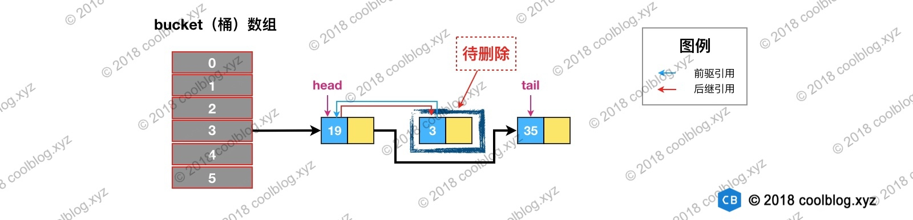
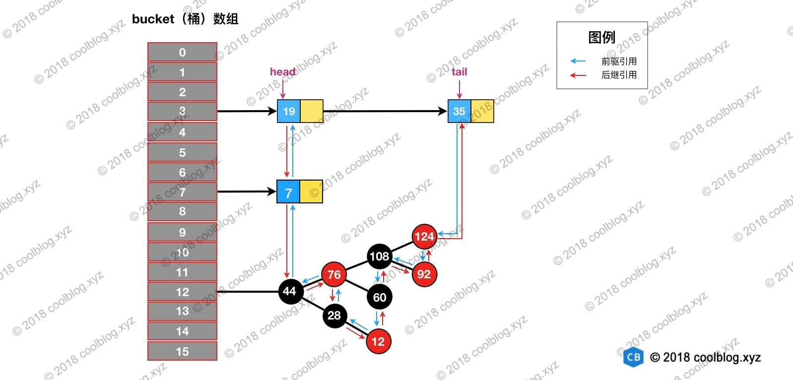
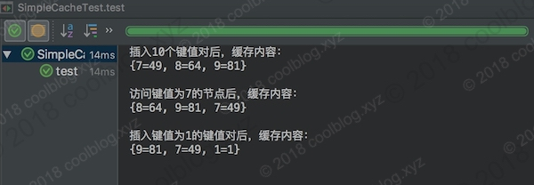

参考：`http://www.tianxiaobo.com/2018/01/24/LinkedHashMap-%E6%BA%90%E7%A0%81%E8%AF%A6%E7%BB%86%E5%88%86%E6%9E%90%EF%BC%88JDK1-8%EF%BC%89/`


### 1.概述

`LinkedHashMap `继承自` HashMap`，在` HashMap` 基础上，通过维护一条双向链表，解决了` HashMap `不能随时保持遍历顺序和插入顺序一致的问题。除此之外，`LinkedHashMap `对访问顺序也提供了相关支持。在一些场景下，该特性很有用，比如缓存。在实现上，`LinkedHashMap `很多方法直接继承自` HashMap`，仅为维护双向链表覆写了部分方法。所以，要看懂` LinkedHashMap `的源码，需要先看懂` HashMap `的源码。本文将不再分析集合类的基本操作（查找、遍历、插入、删除），而是把重点放在双向链表的维护上。


### 2.原理

`LinkedHashMap` 继承自` HashMap`，所以它的底层仍然是基于拉链式散列结构。该结构由数组和链表或红黑树组成，结构示意图大致如下：


`LinkedHashMap `在上面结构的基础上，增加了一条双向链表，使得上面的结构可以保持键值对的插入顺序。同时通过对链表进行相应的操作，实现了访问顺序相关逻辑。其结构可能如下图：


淡蓝色的箭头表示前驱引用，红色箭头表示后继引用。每当有新键值对节点插入，新节点最终会接在` tail `引用指向的节点后面。而` tail `引用则会移动到新的节点上，这样一个双向链表就建立起来了。

### 3.源码分析

#### 3.1 Entry 的继承体系


`HashMap `的内部类` TreeNode` 不继承它的了一个内部类` Node`，却继承自 `Node` 的子类` LinkedHashMap 内部类 `Entry`。这里这样做是有一定原因的，这里先不说。先来简单说明一下上面的继承体系。

`LinkedHashMap` 内部类 `Entry` 继承自` HashMap `内部类 `Node`，并新增了两个引用，分别是 `before` 和 `after`。这两个引用的用途不难理解，也就是用于维护双向链表。同时，`TreeNode` 继承 `LinkedHashMap `的内部类 `Entry `后，就具备了和其他` Entry` 一起组成链表的能力。但是这里需要大家考虑一个问题。当我们使用 `HashMap` 时，`TreeNode` 并不需要具备组成链表能力。如果继承` LinkedHashMap `内部类 `Entry` ，`TreeNode` 就多了两个用不到的引用，这样做不是会浪费空间吗？

简单说明一下这个问题（水平有限，不保证完全正确），这里这么做确实会浪费空间，但与` TreeNode `通过继承获取的组成链表的能力相比，这点浪费是值得的。在` HashMap `的设计思路注释中，有这样一段话：

```
Because TreeNodes are about twice the size of regular nodes, we use them only when bins contain enough nodes to warrant use (see TREEIFY_THRESHOLD). And when they become too small (due to removal or resizing) they are converted back to plain bins. In usages with well-distributed user hashCodes, tree bins are rarely used.
```

大致的意思是 `TreeNode `对象的大小约是普通` Node `对象的2倍，我们仅在桶（`bin`）中包含足够多的节点时再使用。当桶中的节点数量变少时（取决于删除和扩容），`TreeNode` 会被转成 `Node`。当用户实现的` hashCode` 方法具有良好分布性时，树类型的桶将会很少被使用。

通过上面的注释，我们可以了解到。一般情况下，只要` hashCode `的实现不糟糕，`Node`组成的链表很少会被转成由` TreeNode` 组成的红黑树。也就是说` TreeNode `使用的并不多，浪费那点空间是可接受的。假如` TreeNode` 机制继承自` Node` 类，那么它要想具备组成链表的能力，就需要 `Node` 去继承 `LinkedHashMap `的内部类 `Entry`。这个时候就得不偿失了，浪费很多空间去获取不一定用得到的能力。


#### 3.2 链表的建立过程
链表的建立过程是在插入键值对节点时开始的，初始情况下，让 `LinkedHashMap` 的 `head` 和` tail `引用同时指向新节点，链表就算建立起来了。随后不断有新节点插入，通过将新节点接在` tail `引用指向节点的后面，即可实现链表的更新。

`Map `类型的集合类是通过 `put(K,V) `方法插入键值对，`LinkedHashMap` 本身并没有覆写父类的 `put `方法，而是直接使用了父类的实现。但在` HashMap `中，`put `方法插入的是 `HashMap` 内部类 `Node `类型的节点，该类型的节点并不具备与 `LinkedHashMap `内部类` Entry `及其子类型节点组成链表的能力。那么，`LinkedHashMap `是怎样建立链表的呢？在展开说明之前，我们先看一下` LinkedHashMap` 插入操作相关的代码：

```java
// HashMap 中实现
public V put(K key, V value) {
    return putVal(hash(key), key, value, false, true);
}

// HashMap 中实现
final V putVal(int hash, K key, V value, boolean onlyIfAbsent,
               boolean evict) {
    Node<K,V>[] tab; Node<K,V> p; int n, i;
    if ((tab = table) == null || (n = tab.length) == 0) {...}
    // 通过节点 hash 定位节点所在的桶位置，并检测桶中是否包含节点引用
    if ((p = tab[i = (n - 1) & hash]) == null) {...}
    else {
        Node<K,V> e; K k;
        if (p.hash == hash &&
            ((k = p.key) == key || (key != null && key.equals(k))))
            e = p;
        else if (p instanceof TreeNode) {...}
        else {
            // 遍历链表，并统计链表长度
            for (int binCount = 0; ; ++binCount) {
                // 未在单链表中找到要插入的节点，将新节点接在单链表的后面
                if ((e = p.next) == null) {
                    p.next = newNode(hash, key, value, null);
                    if (binCount >= TREEIFY_THRESHOLD - 1) {...}
                    break;
                }
                // 插入的节点已经存在于单链表中
                if (e.hash == hash &&
                    ((k = e.key) == key || (key != null && key.equals(k))))
                    break;
                p = e;
            }
        }
        if (e != null) { // existing mapping for key
            V oldValue = e.value;
            if (!onlyIfAbsent || oldValue == null) {...}
            afterNodeAccess(e);    // 回调方法，后续说明
            return oldValue;
        }
    }
    ++modCount;
    if (++size > threshold) {...}
    afterNodeInsertion(evict);    // 回调方法，后续说明
    return null;
}

// HashMap 中实现
Node<K,V> newNode(int hash, K key, V value, Node<K,V> next) {
    return new Node<>(hash, key, value, next);
}

// LinkedHashMap 中覆写
Node<K,V> newNode(int hash, K key, V value, Node<K,V> e) {
    LinkedHashMap.Entry<K,V> p =
        new LinkedHashMap.Entry<K,V>(hash, key, value, e);
    // 将 Entry 接在双向链表的尾部
    linkNodeLast(p);
    return p;
}

// LinkedHashMap 中实现
private void linkNodeLast(LinkedHashMap.Entry<K,V> p) {
    LinkedHashMap.Entry<K,V> last = tail;
    tail = p;
    // last 为 null，表明链表还未建立
    if (last == null)
        head = p;
    else {
        // 将新节点 p 接在链表尾部
        p.before = last;
        last.after = p;
    }
}
```

`LinkedHashMap `覆写了该方法。在这个方法中，`LinkedHashMap` 创建了` Entry`，并通过` linkNodeLast `方法将` Entry `接在双向链表的尾部，实现了双向链表的建立。双向链表建立之后，我们就可以按照插入顺序去遍历 `LinkedHashMap`，大家可以自己写点测试代码验证一下插入顺序。其实就是在插入的时候不仅创建新的`Node`，并且这个`Node`是一个双向链表结构的`Node`，就是一个节点插入到了一个双向链表中。


#### 3.3 链表节点的删除过程

与插入操作一样，`LinkedHashMap `删除操作相关的代码也是直接用父类的实现。在删除节点时，父类的删除逻辑并不会修复` LinkedHashMap` 所维护的双向链表，这不是它的职责。于是在删除及节点后，回调方法 `afterNodeRemoval` 会被调用。`LinkedHashMap` 覆写该方法，并在该方法中完成了移除被删除节点的操作。相关源码如下：

```java
// HashMap 中实现
public V remove(Object key) {
    Node<K,V> e;
    return (e = removeNode(hash(key), key, null, false, true)) == null ?
        null : e.value;
}

// HashMap 中实现
final Node<K,V> removeNode(int hash, Object key, Object value,
                           boolean matchValue, boolean movable) {
    Node<K,V>[] tab; Node<K,V> p; int n, index;
    if ((tab = table) != null && (n = tab.length) > 0 &&
        (p = tab[index = (n - 1) & hash]) != null) {
        Node<K,V> node = null, e; K k; V v;
        if (p.hash == hash &&
            ((k = p.key) == key || (key != null && key.equals(k))))
            node = p;
        else if ((e = p.next) != null) {
            if (p instanceof TreeNode) {...}
            else {
                // 遍历单链表，寻找要删除的节点，并赋值给 node 变量
                do {
                    if (e.hash == hash &&
                        ((k = e.key) == key ||
                         (key != null && key.equals(k)))) {
                        node = e;
                        break;
                    }
                    p = e;
                } while ((e = e.next) != null);
            }
        }
        if (node != null && (!matchValue || (v = node.value) == value ||
                             (value != null && value.equals(v)))) {
            if (node instanceof TreeNode) {...}
            // 将要删除的节点从单链表中移除
            else if (node == p)
                tab[index] = node.next;
            else
                p.next = node.next;
            ++modCount;
            --size;
            afterNodeRemoval(node);    // 调用删除回调方法进行后续操作
            return node;
        }
    }
    return null;
}

// LinkedHashMap 中覆写
void afterNodeRemoval(Node<K,V> e) { // unlink
    LinkedHashMap.Entry<K,V> p =
        (LinkedHashMap.Entry<K,V>)e, b = p.before, a = p.after;
    // 将 p 节点的前驱后后继引用置空
    p.before = p.after = null;
    // b 为 null，表明 p 是头节点
    if (b == null)
        head = a;
    else
        b.after = a;
    // a 为 null，表明 p 是尾节点
    if (a == null)
        tail = b;
    else
        a.before = b;
}
```

删除的过程并不复杂，就是一个双向链表的删除，上面这么多代码其实就做了三件事：

* 根据 `hash `定位到桶位置
* 遍历链表或调用红黑树相关的删除方法
* 从 `LinkedHashMap `维护的双链表中移除要删除的节点

举个例子说明一下，假如我们要删除下图键值为` 3 `的节点。


根据 `hash `定位到该节点属于3号桶，然后在对3号桶保存的单链表进行遍历。找到要删除的节点后，先从单链表中移除该节点。如下：




然后再双向链表中移除该节点：




#### 3.4 访问顺序的维护过程

默认情况下，`LinkedHashMap` 是按插入顺序维护链表。不过我们可以在初始化` LinkedHashMap``，指定 accessOrder` 参数为` true（new LinkedHashMap(10, 0.75, true);）`，即可让它按访问顺序维护链表，最少被访问的`entry`靠前，最近访问的`entry`靠后。访问顺序的原理上并不复杂，当我们调用`get/getOrDefault/replace`等方法时，只需要将这些方法访问的节点移动到链表的尾部即可。相应的源码如下：

```java
// LinkedHashMap 中覆写
public V get(Object key) {
    Node<K,V> e;
    if ((e = getNode(hash(key), key)) == null)
        return null;
    // 如果 accessOrder 为 true，则调用 afterNodeAccess 将被访问节点移动到链表最后
    if (accessOrder)
        afterNodeAccess(e);
    return e.value;
}

// LinkedHashMap 中覆写
void afterNodeAccess(Node<K,V> e) { // move node to last
    LinkedHashMap.Entry<K,V> last;
    if (accessOrder && (last = tail) != e) {
        LinkedHashMap.Entry<K,V> p =
            (LinkedHashMap.Entry<K,V>)e, b = p.before, a = p.after;
        p.after = null;
        // 如果 b 为 null，表明 p 为头节点
        if (b == null)
            head = a;
        else
            b.after = a;
            
        if (a != null)
            a.before = b;
        /*
         * 这里存疑，父条件分支已经确保节点 e 不会是尾节点，
         * 那么 e.after 必然不会为 null，不知道 else 分支有什么作用
         */
        else
            last = b;
    
        if (last == null)
            head = p;
        else {
            // 将 p 接在链表的最后
            p.before = last;
            last.after = p;
        }
        tail = p;
        ++modCount;
    }
}
```

下面举例演示一下，帮助大家理解。假设我们访问下图键值为3的节点，访问前结构为：


访问后，键值为3的节点将会被移动到双向链表的最后位置，其前驱和后继也会跟着更新。访问后的结构如下：


#### 3.5 基于 LinkedHashMap 实现缓存

本节我们来写一些代码实践一下，这里通过继承` LinkedHashMap `实现了一个简单的` LRU `策略的缓存。在写代码之前，先介绍一下前置知识。

在`3.1`节分析链表建立过程时，我故意忽略了部分源码分析。本节就把忽略的部分补上，先看源码吧：

```java
void afterNodeInsertion(boolean evict) { // possibly remove eldest
    LinkedHashMap.Entry<K,V> first;
    // 根据条件判断是否移除最近最少被访问的节点
    if (evict && (first = head) != null && removeEldestEntry(first)) {
        K key = first.key;
        removeNode(hash(key), key, null, false, true);
    }
}

// 移除最近最少被访问条件之一，通过覆盖此方法可实现不同策略的缓存
protected boolean removeEldestEntry(Map.Entry<K,V> eldest) {
    return false;
}
```

上面的源码的核心逻辑在一般情况下都不会被执行，由于`removeEldestEntry()`所返回的`false`无执行意义，也就意味着如果想要让它有意义必须重写。**上面的代码做的事情比较简单，就是通过一些条件，判断是否移除最近最少被访问的节点。**看到这里，大家应该知道上面两个方法的用途了。当我们基于` LinkedHashMap `实现缓存时，通过覆写``removeEldestEntry``方法可以实现自定义策略的` LRU `缓存。比如我们可以根据节点数量判断是否移除最近最少被访问的节点，或者根据节点的存活时间判断是否移除该节点等。本节所实现的缓存是基于判断节点数量是否超限的策略。在构造缓存对象时，传入最大节点数。当插入的节点数超过最大节点数时，**移除最近最少被访问的节点(就是最前面的)**。实现代码如下：

```java
public class SimpleCache<K, V> extends LinkedHashMap<K, V> {

    private static final int MAX_NODE_NUM = 100;

    private int limit;

    public SimpleCache() {
        this(MAX_NODE_NUM);
    }

    public SimpleCache(int limit) {
        super(limit, 0.75f, true);
        this.limit = limit;
    }

    public V save(K key, V val) {
        return put(key, val);
    }

    public V getOne(K key) {
        return get(key);
    }

    public boolean exists(K key) {
        return containsKey(key);
    }
    
    /**
     * 判断节点数是否超限
     * @param eldest
     * @return 超限返回 true，否则返回 false
     */
    @Override
    protected boolean removeEldestEntry(Map.Entry<K, V> eldest) {
        return size() > limit;
    }
}
```

测试代码如下：

```java
public class SimpleCacheTest {

    @Test
    public void test() throws Exception {
        SimpleCache<Integer, Integer> cache = new SimpleCache<>(3);

        for (int i = 0; i < 10; i++) {
            cache.save(i, i * i);
        }

        System.out.println("插入10个键值对后，缓存内容：");
        System.out.println(cache + "\n");

        System.out.println("访问键值为7的节点后，缓存内容：");
        cache.getOne(7);
        System.out.println(cache + "\n");

        System.out.println("插入键值为1的键值对后，缓存内容：");
        cache.save(1, 1);
        System.out.println(cache);
    }
}
```

测试结果如下：



相关更详细的分析请参考：`https://segmentfault.com/a/1190000009498647`


