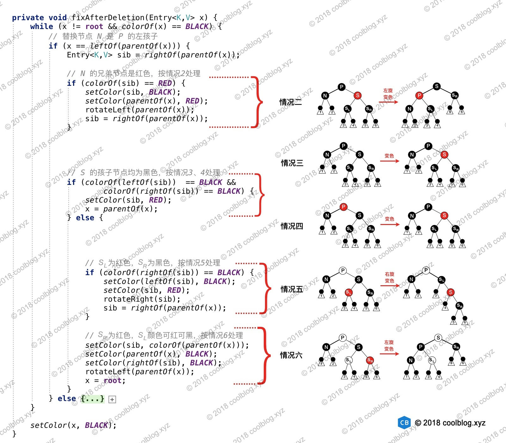

参考：`http://www.tianxiaobo.com/2018/01/11/TreeMap%E6%BA%90%E7%A0%81%E5%88%86%E6%9E%90/`


### 1.概述

`TreeMap `底层基于`红黑树`实现，可保证在`log(n)`时间复杂度内完成` containsKey、get、put `和` remove `操作，效率很高。另一方面，由于` TreeMap` 基于红黑树实现，这为` TreeMap` 保持键的有序性打下了基础。总的来说，`TreeMap `的核心是红黑树，其很多方法也是对红黑树增删查基础操作的一个包装。所以只要弄懂了红黑树，`TreeMap `就没什么秘密了。


### 2.概览

`TreeMap`继承自`AbstractMap`，并实现了 `NavigableMap`接口。`NavigableMap `接口继承了`SortedMap`接口，`SortedMap` 最终继承自`Map`接口，同时` AbstractMap `类也实现了 `Map `接口。以上就是` TreeMap` 的继承体系，如图所示：


先说 `NavigableMap `接口，`NavigableMap `接口声明了一些列具有导航功能的方法，比如：

```java
/**
 * 返回红黑树中最小键所对应的 Entry
 */
Map.Entry<K,V> firstEntry();

/**
 * 返回最大的键 maxKey，且 maxKey 仅小于参数 key
 */
K lowerKey(K key);

/**
 * 返回最小的键 minKey，且 minKey 仅大于参数 key
 */
K higherKey(K key);

// 其他略
```

通过这些导航方法，我们可以快速定位到目标的` key `或 `Entry`。至于 `SortedMap `接口，这个接口提供了一些基于有序键的操作，比如

```java
/**
 * 返回包含键值在 [minKey, toKey) 范围内的 Map
 */
SortedMap<K,V> headMap(K toKey);();

/**
 * 返回包含键值在 [fromKey, toKey) 范围内的 Map
 */
SortedMap<K,V> subMap(K fromKey, K toKey);

// 其他略
```

### 3.源码分析

本文挑选几个常用的方法进行分析。这些方法实现的功能分别是查找、遍历、插入、删除等，其他的方法小伙伴们有兴趣可以自己分析。`TreeMap`实现的核心部分是关于`红黑树`的实现，其绝大部分的方法基本都是对底层红黑树增、删、查操作的一个封装。如简介一节所说，只要弄懂了红黑树原理，`TreeMap` 就没什么秘密了。关于`红黑树`的原理，请参考本人的另一篇文章-[红黑树详细分析](http://www.coolblog.xyz/2018/01/11/%E7%BA%A2%E9%BB%91%E6%A0%91%E8%AF%A6%E7%BB%86%E5%88%86%E6%9E%90/)，本篇文章不会对此展开讨论。


#### 3.1 查找

`TreeMap`基于红黑树实现，而红黑树是一种自平衡二叉查找树，所以` TreeMap` 的查找操作流程和二叉查找树一致。二叉树的查找流程是这样的，先将目标值和根节点的值进行比较，如果目标值小于根节点的值，则再和根节点的左孩子进行比较。如果目标值大于根节点的值，则继续和根节点的右孩子比较。在查找过程中，如果目标值和二叉树中的某个节点值相等，则返回` true`，否则返回` false`。`TreeMap` 查找和此类似，只不过在` TreeMap` 中，节点（`Entry`）存储的是键值对`<k,v>`。在查找过程中，**比较的是键的大小**，返回的是值，如果没找到，则返回`null`。`TreeMap` 中的查找方法是`get`，具体实现在`getEntry`方法中，相关源码如下：

```java
public V get(Object key) {
    Entry<K,V> p = getEntry(key);
    return (p==null ? null : p.value);
}

final Entry<K,V> getEntry(Object key) {
    // Offload comparator-based version for sake of performance
    if (comparator != null)
        return getEntryUsingComparator(key);
    if (key == null)
        throw new NullPointerException();
    @SuppressWarnings("unchecked")
        Comparable<? super K> k = (Comparable<? super K>) key;
    Entry<K,V> p = root;
    
    // 查找操作的核心逻辑就在这个 while 循环里
    while (p != null) {
        int cmp = k.compareTo(p.key);
        if (cmp < 0)
            p = p.left;
        else if (cmp > 0)
            p = p.right;
        else
            return p;
    }
    return null;
}
```

#### 3.2 遍历

遍历操作也是大家使用频率较高的一个操作，对于`TreeMap`，使用方式一般如下：

```java
for(Object key : map.keySet()) {
    // do something
}
//或
for(Map.Entry entry : map.entrySet()) {
    // do something
}
```

从上面代码片段中可以看出，大家一般都是对 `TreeMap` 的 `key` 集合或` Entry `集合进行遍历。上面代码片段中用 `foreach `遍历`keySet `方法产生的集合，在编译时会转换成用迭代器遍历，等价于：

```java
Set keys = map.keySet();
Iterator ite = keys.iterator();
while (ite.hasNext()) {
    Object key = ite.next();
    // do something
}
```

另一方面，`TreeMap` 有一个特性，即可以保证键的有序性，默认是正序。所以在遍历过程中，大家会发现 `TreeMap `会从小到大输出键的值。那么，接下来就来分析一下`keySet`方法，以及在遍历` keySet `方法产生的集合时，`TreeMap `是如何保证键的有序性的。相关代码如下：

```java
public Set<K> keySet() {
    return navigableKeySet();
}

public NavigableSet<K> navigableKeySet() {
    KeySet<K> nks = navigableKeySet;
    return (nks != null) ? nks : (navigableKeySet = new KeySet<>(this));
}

static final class KeySet<E> extends AbstractSet<E> implements NavigableSet<E> {
    private final NavigableMap<E, ?> m;
    KeySet(NavigableMap<E,?> map) { m = map; }

    public Iterator<E> iterator() {
        if (m instanceof TreeMap)
            return ((TreeMap<E,?>)m).keyIterator();
        else
            return ((TreeMap.NavigableSubMap<E,?>)m).keyIterator();
    }

    // 省略非关键代码
}

Iterator<K> keyIterator() {
    return new KeyIterator(getFirstEntry());
}
//返回TreeMap中的第一个条目,也就是最小的节点
final Entry<K,V> getFirstEntry() {
    Entry<K,V> p = root;
    if (p != null)
        while (p.left != null)
            p = p.left;
    return p;
}

final class KeyIterator extends PrivateEntryIterator<K> {
    KeyIterator(Entry<K,V> first) {
        super(first);
    }
    public K next() {
        return nextEntry().key;
    }
}

abstract class PrivateEntryIterator<T> implements Iterator<T> {
    Entry<K,V> next;
    Entry<K,V> lastReturned;
    int expectedModCount;

    PrivateEntryIterator(Entry<K,V> first) {
        expectedModCount = modCount;
        lastReturned = null;
        next = first;
    }

    public final boolean hasNext() {
        return next != null;
    }

    final Entry<K,V> nextEntry() {
        Entry<K,V> e = next;
        if (e == null)
            throw new NoSuchElementException();
        if (modCount != expectedModCount)
            throw new ConcurrentModificationException();
        // 寻找节点 e 的后继节点
        next = successor(e);
        lastReturned = e;
        return e;
    }
    // 其他方法省略
}
```

上面的代码比较多，`keySet `涉及的代码还是比较多的，大家可以从上往下看。从上面源码可以看出` keySet `方法返回的是`KeySet`类的对象。这个类实现了`Iterable`接口，可以返回一个迭代器。该迭代器的具体实现是`KeyIterator`，而 `KeyIterator` 类的核心逻辑是在`PrivateEntryIterator`中实现的。上面的代码虽多，但核心代码还是` KeySet` 类和 `PrivateEntryIterator `类的 `nextEntry`方法。 `nextEntry `方法比较重要，下面简单分析一下。

在初始化 `KeyIterator `时，会将` TreeMap `中包含最小键的 `Entry `传给` PrivateEntryIterator`。当调用 `nextEntry `方法时，通过调用 `successor` 方法找到当前 `entry `的后继，并让` next` 指向后继，最后返回当前的` entry`。通过这种方式即可实现按正序返回键值的的逻辑。


#### 3.3 插入

相对于前两个操作，插入操作明显要复杂一些。当往` TreeMap `中放入新的键值对后，可能会破坏红黑树的性质。这里为了描述方便，把` Entry` 称为节点。并把新插入的节点称为`N`，`N `的父节点为`P`。`P` 的父节点为`G`，且 `P` 是 `G` 的左孩子。`P` 的兄弟节点为`U`。在往红黑树中插入新的节点 `N` 后（新节点为红色），会产生下面`5`种情况：

* `N `是根节点
* `N` 的父节点是黑色
* `N` 的父节点是红色，叔叔节点也是红色
* `N` 的父节点是红色，叔叔节点是黑色，且` N` 是` P` 的右孩子
* `N` 的父节点是红色，叔叔节点是黑色，且` N` 是` P` 的左孩子

上面`5`中情况中，情况`2`不会破坏红黑树性质，所以无需处理。情况`1 `会破坏红黑树性质`2`（根是黑色），情况`3、4`和`5`会破坏红黑树性质`4`（每个红色节点必须有两个黑色的子节点）。这个时候就需要进行调整，以使红黑树重新恢复平衡。至于怎么调整，可以参考我另一篇关于红黑树的文章（红黑树详细分析），这里不再重复说明。接下来分析一下插入操作相关源码：

```java
public V put(K key, V value) {
    Entry<K,V> t = root;
    // 1.如果根节点为 null，将新节点设为根节点
    if (t == null) {
        compare(key, key);
        root = new Entry<>(key, value, null);
        size = 1;
        modCount++;
        return null;
    }
    int cmp;
    Entry<K,V> parent;
    // split comparator and comparable paths
    Comparator<? super K> cpr = comparator;
    if (cpr != null) {
        // 2.为 key 在红黑树找到合适的位置
        do {
            parent = t;
            cmp = cpr.compare(key, t.key);
            if (cmp < 0)
                t = t.left;
            else if (cmp > 0)
                t = t.right;
            else
                return t.setValue(value);
        } while (t != null);
    } else {
        // 与上面代码逻辑类似，省略
    }
    Entry<K,V> e = new Entry<>(key, value, parent);
    // 3.将新节点链入红黑树中
    if (cmp < 0)
        parent.left = e;
    else
        parent.right = e;
    // 4.插入新节点可能会破坏红黑树性质，这里修正一下
    fixAfterInsertion(e);
    size++;
    modCount++;
    return null;
}
```

`put `方法代码如上，逻辑和二叉查找树插入节点逻辑一致。重要的步骤我已经写了注释，并不难理解。插入逻辑的复杂之处在于插入后的修复操作，对应的方法`fixAfterInsertion`，该方法的源码和说明如下：


#### 3.4 删除

删除操作是红黑树最复杂的部分，原因是该操作可能会破坏红黑树性质`5`（从任一节点到其每个叶子的所有简单路径都包含相同数目的黑色节点），修复性质`5`要比修复其他性质（性质`2`和`4`需修复，性质`1`和`3`不用修复）复杂的多。当删除操作导致性质`5`被破坏时，会出现`8`种情况。为了方便表述，这里还是先做一些假设。我们把最终被删除的节点称为` X`，`X `的替换节点称为 `N`。`N` 的父节点为`P`，且` N `是` P `的左孩子。`N `的兄弟节点为`S`，`S `的左孩子为 `SL`，右孩子为 `SR`。这里特地强调 `X` 是 最终被删除 的节点，是原因二叉查找树会把要删除有两个孩子的节点的情况转化为删除只有一个孩子的节点的情况，该节点是欲被删除节点的前驱和后继。

接下来，简单列举一下删除节点时可能会出现的情况，先列举较为简单的情况：

* 最终被删除的节点` X `是红色节点
* `X` 是黑色节点，但该节点的孩子节点是红色

比较复杂的情况：

* 替换节点` N `是新的根
* `N `为黑色，`N `的兄弟节点` S `为红色，其他节点为黑色。
* `N `为黑色，`N `的父节点` P`，兄弟节点` S `和` S `的孩子节点均为黑色。
* `N `为黑色，`P` 是红色，`S `和` S `孩子均为黑色。
* `N` 为黑色，`P` 可红可黑，`S` 为黑色，`S `的左孩子 `SL `为红色，右孩子 `SR `为黑色
* `N` 为黑色，`P` 可红可黑，`S` 为黑色，`SR `为红色，`SL `可红可黑
    上面列举的`8`种情况中，前两种处理起来比较简单，后`6`种情况中情况`2、6`较为复杂。接下来我将会对情况`2、6`展开分析，删除相关的源码如下：

```java
public V remove(Object key) {
    Entry<K,V> p = getEntry(key);
    if (p == null)
        return null;

    V oldValue = p.value;
    deleteEntry(p);
    return oldValue;
}

private void deleteEntry(Entry<K,V> p) {
    modCount++;
    size--;

    /* 
     * 1. 如果 p 有两个孩子节点，则找到后继节点，
     * 并把后继节点的值复制到节点 P 中，并让 p 指向其后继节点
     */
    if (p.left != null && p.right != null) {
        Entry<K,V> s = successor(p);
        p.key = s.key;
        p.value = s.value;
        p = s;
    } // p has 2 children

    // Start fixup at replacement node, if it exists.
    Entry<K,V> replacement = (p.left != null ? p.left : p.right);

    if (replacement != null) {
        /*
         * 2. 将 replacement parent 引用指向新的父节点，
         * 同时让新的父节点指向 replacement。
         */ 
        replacement.parent = p.parent;
        if (p.parent == null)
            root = replacement;
        else if (p == p.parent.left)
            p.parent.left  = replacement;
        else
            p.parent.right = replacement;

        // Null out links so they are OK to use by fixAfterDeletion.
        p.left = p.right = p.parent = null;

        // 3. 如果删除的节点 p 是黑色节点，则需要进行调整
        if (p.color == BLACK)
            fixAfterDeletion(replacement);
    } else if (p.parent == null) { // 删除的是根节点，且树中当前只有一个节点
        root = null;
    } else { // 删除的节点没有孩子节点
        // p 是黑色，则需要进行调整
        if (p.color == BLACK)
            fixAfterDeletion(p);

        // 将 P 从树中移除
        if (p.parent != null) {
            if (p == p.parent.left)
                p.parent.left = null;
            else if (p == p.parent.right)
                p.parent.right = null;
            p.parent = null;
        }
    }
}
```

从源码中可以看出，`remove`方法只是一个简单的保证，核心实现在`deleteEntry`方法中。`deleteEntry` 主要做了这么几件事：

* 如果待删除节点 `P` 有两个孩子，则先找到 `P `的后继` S`，然后将` S `中的值拷贝到 `P `中，并让` P` 指向` S`
* 如果最终被删除节点 `P`（`P` 现在指向最终被删除节点）的孩子不为空，则用其孩子节点替换掉
* 如果最终被删除的节点是黑色的话，调用` fixAfterDeletion `方法进行修复

上面说了` replacement` 不为空时，`deleteEntry` 的执行逻辑。上面说的略微啰嗦，如果简单说的话，`7`个字即可总结：`找后继 -> 替换 -> 修复`。这三步中，最复杂的是修复操作。修复操作要重新使红黑树恢复平衡，修复操作的源码分析如下：

`fixAfterDeletion `方法分析如下：




红黑树的分析请查看：[红黑树分析](././数据结构与算法/红黑树分析.md)


