摘自：`https://segmentfault.com/a/1190000016781127`

## 一、引言

算法领域有一种基本思想叫做“**分治**”，所谓“分治”就是将一个难以直接解决的大问题，分割成一些规模较小的子问题，以便各个击破，分而治之。

比如：对于一个规模为N的问题，若该问题可以容易地解决，则直接解决；否则将其分解为K个规模较小的子问题，这些子问题互相独立且与原问题性质相同，递归地解这些子问题，然后将各子问题的解合并得到原问题的解，这种算法设计策略叫做分治法。

许多基础算法都运用了“分治”的思想，比如二分查找、快速排序等等。

基于“分治”的思想，J.U.C在JDK1.7时引入了一套**Fork/Join**框架。Fork/Join框架的基本思想就是将一个大任务分解（**Fork**）成一系列子任务，子任务可以继续往下分解，当多个不同的子任务都执行完成后，可以将它们各自的结果合并（**Join**）成一个大结果，最终合并成大任务的结果：

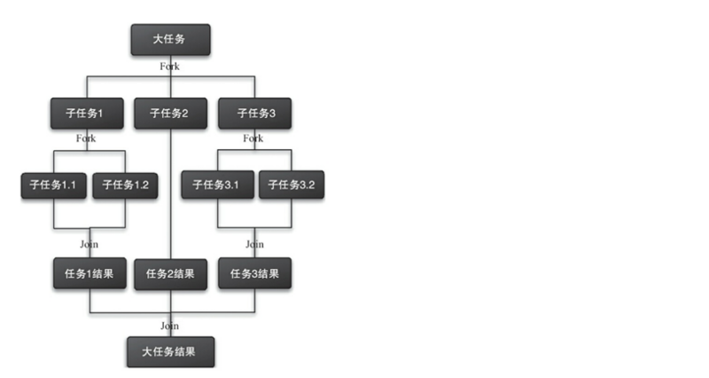

## 二、工作窃取算法

从上述Fork/Join框架的描述可以看出，我们需要一些线程来执行Fork出的任务，在实际中，如果每次都创建新的线程执行任务，对系统资源的开销会很大，所以Fork/Join框架利用了线程池来调度任务。

另外，这里可以思考一个问题，既然由线程池调度，根据我们之前学习[普通](https://segmentfault.com/a/1190000016629668)/[计划](https://segmentfault.com/a/1190000016672638)线程池的经验，必然存在两个要素：

- 工作线程
- 任务队列

一般的线程池只有一个任务队列，但是对于Fork/Join框架来说，由于Fork出的各个子任务其实是平行关系，为了提高效率，减少线程竞争，应该将这些平行的任务放到不同的队列中去，如上图中，大任务分解成三个子任务：子任务1、子任务2、子任务3，那么就创建三个任务队列，然后再创建3个工作线程与队列一一对应。

由于线程处理不同任务的速度不同，这样就可能存在某个线程先执行完了自己队列中的任务的情况，这时为了提升效率，我们可以让该线程去“窃取”其它任务队列中的任务，这就是所谓的**工作窃取算法**。

“工作窃取”的示意图如下，当线程1执行完自身任务队列中的任务后，尝试从线程2的任务队列中“窃取”任务：

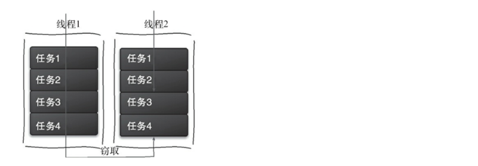

> 对于一般的队列来说，入队元素都是在“队尾”，出队元素在“队首”，要满足“工作窃取”的需求，任务队列应该支持从“队尾”出队元素，这样可以减少与其它工作线程的冲突（因为正常情况下，其它工作线程从“队首”获取自己任务队列中的任务），满足这一需求的任务队列其实就是我们在juc-collections框架中介绍过的双端阻塞队列——[LinkedBlockingDeque](https://segmentfault.com/a/1190000016398508)。
> 当然，出于性能考虑，J.U.C中的Fork/Join框架并没有直接利用LinkedBlockingDeque作为任务队列，而是自己重新实现了一个。

## 三、使用示例

为了给接下来的分析F/J框架组件做铺垫，我们先通过一个简单示例看下Fork/Join框架的基本使用。

> 假设有个非常大的long[]数组，通过FJ框架求解数组所有元素的和。

任务类定义，因为需要返回结果，所以继承RecursiveTask，并覆写**compute**方法。任务的fork通过ForkJoinTask的**fork**方法执行，join方法方法用于等待任务执行后返回：

```
public class ArraySumTask extends RecursiveTask<Long> {
 
    private final int[] array;
    private final int begin;
    private final int end;
 
    private static final int THRESHOLD = 100;
 
    public ArraySumTask(int[] array, int begin, int end) {
        this.array = array;
        this.begin = begin;
        this.end = end;
    }
 
    @Override
    protected Long compute() {
        long sum = 0;
 
        if (end - begin + 1 < THRESHOLD) {      // 小于阈值, 直接计算
            for (int i = begin; i <= end; i++) {
                sum += array[i];
            }
        } else {
            int middle = (end + begin) / 2;
            ArraySumTask subtask1 = new ArraySumTask(this.array, begin, middle);
            ArraySumTask subtask2 = new ArraySumTask(this.array, middle + 1, end);
 
            subtask1.fork();
            subtask2.fork();
 
            long sum1 = subtask1.join();
            long sum2 = subtask2.join();
 
            sum = sum1 + sum2;
        }
        return sum;
    }
}
```

调用方如下：

```java
public class Main {
    public static void main(String[] args) {
        ForkJoinPool executor = new ForkJoinPool();
        ArraySumTask task = new ArraySumTask(new int[10000], 0, 9999);
 
        ForkJoinTask future = executor.submit(task);
 
        // some time passed...
 
        if (future.isCompletedAbnormally()) {
            System.out.println(future.getException());
        }
 
        try {
            System.out.println("result: " + future.get());
        } catch (InterruptedException e) {
            e.printStackTrace();
        } catch (ExecutionException e) {
            e.printStackTrace();
        }
 
    }
}
```

> **注意：**ForkJoinTask在执行的时候可能会抛出异常，但是没办法在主线程里直接捕获异常，所以ForkJoinTask提供了`isCompletedAbnormally()`方法来检查任务是否已经抛出异常或已经被取消了，并且可以通过ForkJoinTask的`getException`方法获取异常.

## 四、核心组件

在前几小节中，我们简要介绍了Fork/Join框架和它的使用。本节我们将更进一步，深入F/J框架，了解它的各个组件的关系和核心设计思想，本节不会涉及太多的源码分析，而是从宏观上分析F/J框架，然后分析整个框架的调度流程，阅读完本节后，在下一节——Fork/Join框架（2） 实现中，我们再去深入源码会轻松很多。

F/J框架的实现非常复杂，内部大量运用了位操作和无锁算法，撇开这些实现细节不谈，该框架主要涉及三大核心组件：`ForkJoinPool`（线程池）、`ForkJoinTask`（任务）、`ForkJoinWorkerThread`（工作线程），外加`WorkQueue`（任务队列）：

- **ForkJoinPool**：ExecutorService的实现类，负责工作线程的管理、任务队列的维护，以及控制整个任务调度流程；
- **ForkJoinTask**：Future接口的实现类，fork是其核心方法，用于分解任务并异步执行；而join方法在任务结果计算完毕之后才会运行，用来合并或返回计算结果；
- **ForkJoinWorkerThread**：Thread的子类，作为线程池中的工作线程（Worker）执行任务；
- **WorkQueue**：任务队列，用于保存任务；

------

### ForkJoinPool

ForkJoinPool作为[Executors框架](https://segmentfault.com/a/1190000016586578)的一员，从外部看与其它线程池并没有什么区别，仅仅是ExecutorService的一个实现类：

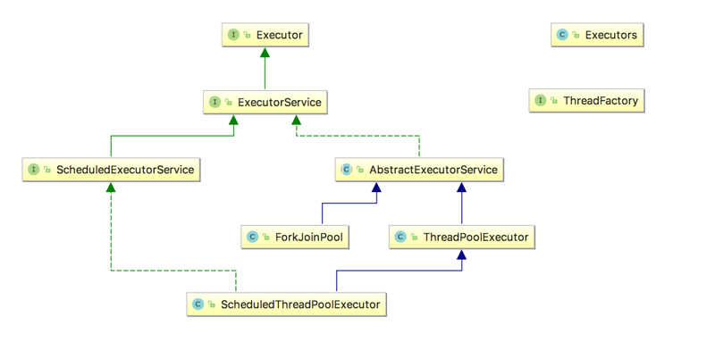

ForkJoinPool的主要工作如下：

1. 接受外部任务的提交（外部调用ForkJoinPool的`invoke`/`execute`/`submit`方法提交任务）；
2. 接受ForkJoinTask自身**fork**出的子任务的提交；
3. 任务队列数组（`WorkQueue[]`）的初始化和管理；
4. 工作线程（Worker）的创建/管理。

> **注意：**ForkJoinPool提供了3类外部提交任务的方法：**invoke**、**execute**、**submit**，它们的主要区别在于任务的执行方式上。

- 通过invoke方法提交的任务，调用线程直到任务执行完成才会返回，也就是说这是一个同步方法，且有返回结果；
- 通过**execute**方法提交的任务，调用线程会立即返回，也就是说这是一个**异步**方法，且**没有返回结果**；
- 通过**submit**方法提交的任务，调用线程会立即返回，也就是说这是一个**异步**方法，且**有返回结果**（返回Future实现类，可以通过get获取结果）。

ForkJoinPool对象的构建有两种方式：

1. 通过3种构造器的任意一种进行构造；
2. 通过`ForkJoinPool.commonPool()`静态方法构造。

> JDK8以后，ForkJoinPool又提供了一个静态方法commonPool()，这个方法返回一个ForkJoinPool内部声明的静态ForkJoinPool实例，主要是为了简化线程池的构建，这个ForkJoinPool实例可以满足大多数的使用场景：

```
public static ForkJoinPool commonPool() {
     // assert common != null : "static init error";
     return common;
 }
```

ForkJoinPool对外提供的3种构造器，其实最终都调用了下面这个构造器：

```
/**
 * @param parallelism      并行级别, 默认为CPU核心数
 * @param factory          工作线程工厂
 * @param handler          异常处理器
 * @param mode        调度模式: true表示FIFO_QUEUE; false表示LIFO_QUEUE
 * @param workerNamePrefix 工作线程的名称前缀
 */
private ForkJoinPool(int parallelism, ForkJoinWorkerThreadFactory factory, UncaughtExceptionHandler handler,
                     int mode, String workerNamePrefix) {
    this.workerNamePrefix = workerNamePrefix;
    this.factory = factory;
    this.ueh = handler;
    this.config = (parallelism & SMASK) | mode;
    long np = (long) (-parallelism); // offset ctl counts
    this.ctl = ((np << AC_SHIFT) & AC_MASK) | ((np << TC_SHIFT) & TC_MASK);

}
```

- **parallelism**：默认值为CPU核心数，ForkJoinPool里工作线程数量与该参数有关，但它不表示最大线程数；
- **factory**：工作线程工厂，默认是DefaultForkJoinWorkerThreadFactory，其实就是用来创建工作线程对象——ForkJoinWorkerThread；
- **handler**：异常处理器；
- **config**：保存parallelism和mode信息，供后续读取；
- **ctl**：线程池的核心控制字段

这些入参目前不用关注，我们重点是`mode`这个字段，ForkJoinPool支持两种模式：

1. 同步模式（默认方式）
2. 异步模式

```
mode = asyncMode ? FIFO_QUEUE : LIFO_QUEUE
```

> **注意：**这里的同步/异步并不是指F/J框架本身是采用同步模式还是采用异步模式工作，而是指其中的工作线程的工作方式。在F/J框架中，每个工作线程（Worker）都有一个属于自己的任务队列（WorkQueue），这是一个底层采用数组实现的**双向队列**。
> 同步是指：对于工作线程（Worker）自身队列中的任务，采用**后进先出（LIFO）**的方式执行；异步是指：对于工作线程（Worker）自身队列中的任务，采用**先进先出（FIFO）**的方式执行。

------

### ForkJoinTask

从Fork/Join框架的描述上来看，“任务”必须要满足一定的条件：

1. 支持Fork，即任务自身的分解
2. 支持Join，即任务结果的合并

因此，J.U.C提供了一个抽象类——**ForkJoinTask**，来作为该类Fork/Join任务的抽象定义：

```java
public abstract class ForkJoinTask<V> extends Object implements Future<V>, Serializerable
```

ForkJoinTask实现了Future接口，是一个异步任务，我们在使用Fork/Join框架时，一般需要使用线程池来调度任务，线程池内部调度的其实都是ForkJoinTask任务（即使提交的是一个Runnable或Callable任务，也会被适配成ForkJoinTask）。

除了ForkJoinTask，Fork/Join框架还提供了两个它的抽象实现，我们在自定义ForkJoin任务时，一般继承这两个类：

- **RecursiveAction**：表示具有返回结果的ForkJoin任务
- **RecursiveTask**：表示没有返回结果的ForkJoin任务

```
public abstract class RecursiveAction extends ForkJoinTask<Void> {
    /**
     * 该任务的执行,子类覆写该方法
     */
    protected abstract void compute();
 
    public final Void getRawResult() { return null; }
 
    protected final void setRawResult(Void mustBeNull) { }
 
    protected final boolean exec() {
        compute();
        return true;
    }
}
public abstract class RecursiveTask<V> extends ForkJoinTask<V> {
 
    /**
     * 该任务的执行结果.
     */
    V result;
 
    /**
     * 该任务的执行,子类覆写该方法
     */
    protected abstract V compute();
 
    public final V getRawResult() {
        return result;
    }
 
    protected final void setRawResult(V value) {
        result = value;
    }
 
    protected final boolean exec() {
        result = compute();
        return true;
    }

}
```

> ForkJoinTask除了和ForkJoinPool 结合使用外，也可以单独使用，当我们调用ForkJoinTask的fork方法时，其内部会通过`ForkJoinPool.commonPool()`方法创建线程池，然后将自己作为任务提交给线程池。

------

### ForkJoinWorkerThread

Fork/Join框架中，每个工作线程（Worker）都有一个自己的任务队列（WorkerQueue）， 所以需要对一般的Thread做些特性化处理，J.U.C提供了**ForkJoinWorkerThread**类作为ForkJoinPool中的工作线程：

```
public class ForkJoinWorkerThread extends Thread {
    
    final ForkJoinPool pool;                    // 该工作线程归属的线程池
    final ForkJoinPool.WorkQueue workQueue;     // 对应的任务队列
 
    protected ForkJoinWorkerThread(ForkJoinPool pool) {
        super("aForkJoinWorkerThread");         // 指定工作线程名称
        this.pool = pool;
        this.workQueue = pool.registerWorker(this);
    }
  
    // ...
}
```

ForkJoinWorkerThread 在构造过程中，会保存**所属线程池**信息和与自己**绑定的任务队列**信息。同时，它会通过ForkJoinPool的`registerWorker`方法将自己注册到线程池中。

> 线程池中的每个工作线程（ForkJoinWorkerThread）都有一个自己的任务队列（WorkQueue），工作线程优先处理自身队列中的任务（LIFO或FIFO顺序，由线程池构造时的参数 `mode` 决定），自身队列为空时，以FIFO的顺序随机窃取其它队列中的任务。

------

### WorkQueue

任务队列（**WorkQueue**）是ForkJoinPool与其它线程池区别最大的地方，在ForkJoinPool内部，维护着一个`WorkQueue[]`数组，它会在外部首次提交任务）时进行初始化：

```
volatile WorkQueue[] workQueues; // main registry
```

> 当通过线程池的外部方法（**submit**、**invoke**、**execute**）提交任务时，如果`WorkQueue[]`没有初始化，则会进行初始化；然后根据数组大小和线程随机数（`ThreadLocalRandom.probe`）等信息，计算出任务队列所在的数组索引（这个索引一定是**偶数**），如果索引处没有任务队列，则初始化一个，再将任务入队。也就是说，通过外部方法提交的任务一定是在偶数队列，没有绑定工作线程。

**WorkQueue**作为ForkJoinPool的内部类，表示一个**双端队列**。双端队列既可以作为**栈**使用(LIFO)，也可以作为**队列**使用(FIFO)。ForkJoinPool的“工作窃取”正是利用了这个特点，当工作线程从自己的队列中获取任务时，**默认**总是以栈操作（LIFO）的方式从栈顶取任务；当工作线程尝试窃取其它任务队列中的任务时，则是FIFO的方式。

> 我们在ForkJoinPool一节中曾讲过，可以指定线程池的同步/异步模式（mode参数），其作用就在于此。同步模式就是“栈操作”，异步模式就是“队列操作”，影响的就是工作线程从自己队列中取任务的方式。

ForkJoinPool中的工作队列可以分为两类：

- 有工作线程（Worker）绑定的任务队列：数组下标始终是**奇数**，称为**task queue**，该队列中的任务均由工作线程调用产生（工作线程调用FutureTask.fork方法）；
- 没有工作线程（Worker）绑定的任务队列：数组下标始终是**偶数**，称为**submissions queue**，该队列中的任务全部由其它线程提交（也就是非工作线程调用execute/submit/invoke或者FutureTask.fork方法）。

## 五、线程池调度示例

文字描述不太好理解，我们通过示意图来看下任务入队和“工作窃取”的整个过程：

> 假设现在通过ForkJoinPool的submit方法提交了一个FuturetTask任务，参考[使用示例](https://segmentfault.com/a/1190000016781127#articleHeader2)。

### 初始

初始状态下，线程池中的任务队列为空，`workQueues == null`，也没有工作线程：

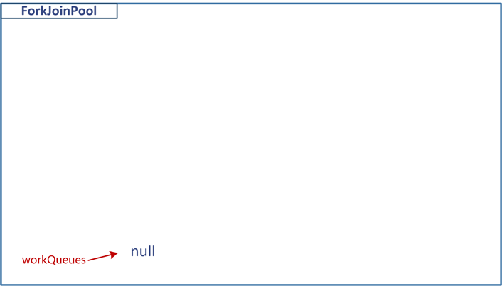

### 外部提交FutureTask任务

此时会初始化任务队列数组`WorkQueue[]`，大小为**2的幂次**，然后在某个槽位（**偶数**位）初始化一个任务队列（`WorkQueue`），并插入任务：

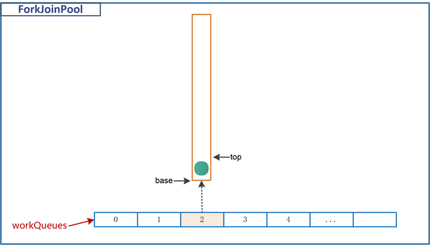

注意，由于是非工作线程通过外部方法提交的任务，所以这个任务队列并没有绑定工作线程。

> 之所以是2的幂次，是由于ForkJoinPool采用了一种随机算法（类似ConcurrentHashMap的随机算法），该算法通过线程池随机数（ThreadLocalRandom的probe值）和数组的大小计算出工作线程所映射的数组槽位，这种算法要求数组大小为2的幂次。

------

### 创建工作线程

首次提交任务后，由于没有工作线程，所以会创建一个工作线程，同时在某个**奇数**槽的位置创建一个与它绑定的任务队列，如下图：

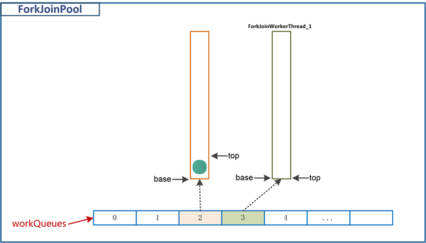


### 窃取任务

*ForkJoinWorkThread_1会随机扫描workQueues中的队列*，直到找到一个可以窃取的队列——`workQueues[2]`，然后从该队列的`base`端获取任务并执行，并将`base`加1：

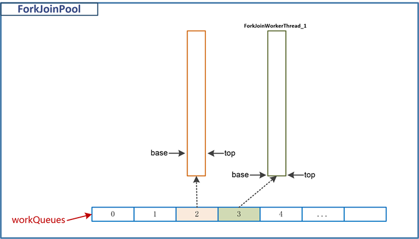

窃取到的任务是FutureTask，ForkJoinWorkThread_1最终会调用它的`compute`方法（子类继承ForkJoinTask，覆写compute，参考本文的[使用示例](https://segmentfault.com/a/1190000016781127#articleHeader2)），该方法中会新建两个子任务，并执行它们的`fork`方法：

```
@Override
protected Long compute() {
    long sum = 0;
 
    if (end - begin + 1 < THRESHOLD) {      // 小于阈值, 直接计算
        for (int i = begin; i <= end; i++) {
            sum += array[i];
        }
    } else {
        int middle = (end + begin) / 2;
        ArraySumTask subtask1 = new ArraySumTask(this.array, begin, middle);
        ArraySumTask subtask2 = new ArraySumTask(this.array, middle + 1, end);
 
        subtask1.fork();
        subtask2.fork();
 
        long sum1 = subtask1.join();
        long sum2 = subtask2.join();
 
        sum = sum1 + sum2;
    }
    return sum;
}
```

之前说过，由于是由工作线程ForkJoinWorkThread_1来调用FutureTask的`fork`方法，所以会将这两个子任务放入ForkJoinWorkThread_1自身队列中：

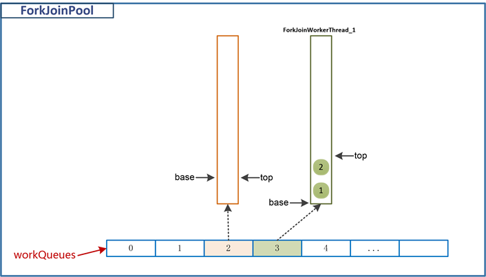


然后，ForkJoinWorkThread_1会阻塞等待任务1和任务2的结果（先在`subtask1.join`等待）：

```
  long sum1 = subtask1.join();
  long sum2 = subtask2.join();
```

> 从这里也可以看出，任务放到哪个队列，其实是**由调用线程来决定**的（根据线程探针值probe计算队列索引）。如果调用线程是工作线程，则必然有自己的队列（**task queue**），则任务都会放到自己的队列中；如果调用线程是其它线程（如主线程），则创建没有工作线程绑定的任务队列（**submissions queue**），然后存入任务。

------

### 新的工作线程

ForkJoinWorkThread_1调用两个子任务1和2的`fork`方法，除了将它们放入自己的任务队列外，还会导致新增一个工作线程ForkJoinWorkThread_2：

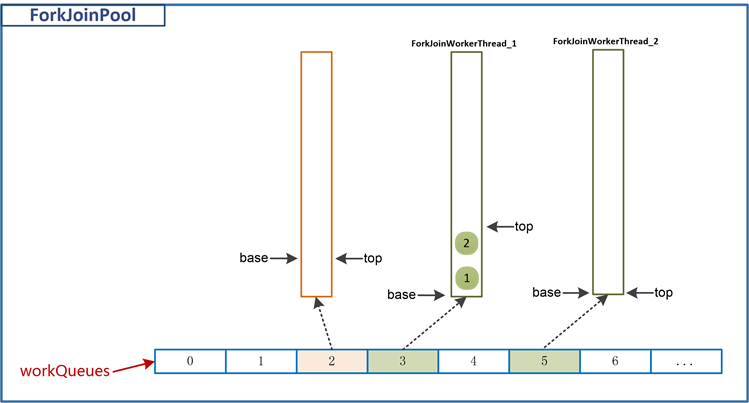

ForkJoinWorkThread_2运行后会像ForkJoinWorkThread_1那样从其它队列窃取任务，如下图，从ForkJoinWorkThread_1队列的`base`端窃取一个任务（直接执行，并不会放入自己队列）：

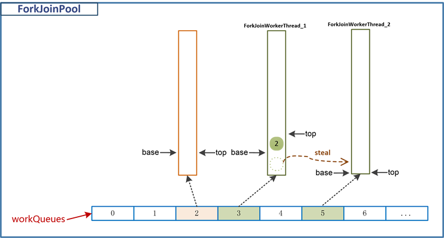

窃取完成后，ForkJoinWorkThread_2会直接执行任务1，又回到了FutureTask子类的`compute`方法，假设此时又`fork`出两个任务——任务3、任务4，则ForkJoinWorkThread_2最终会在任务3的`join`方法上等待：

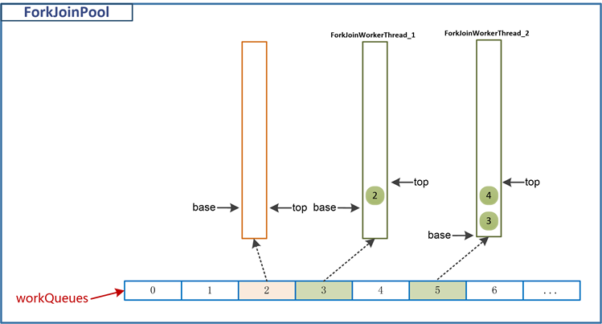

> 如果此时还有其它工作线程，则重复上述步骤：`窃取、执行、入队、join阻塞、返回`。ForkJoinTask的join方法内部逻辑非常复杂，上述ForkJoinWorkThread_1和ForkJoinWorkThread_2目前都在等待任务的完成，但事实上，ForkJoinTask存在一种**互助机制**，即工作线程之间可以互相帮助执行任务，这里不详细展开，只需要知道，ForkJoinWorkThread_1和ForkJoinWorkThread_2可能会被其它工作线程唤醒。

我们这里假设ForkJoinWorkThread_2被其它某个工作线程唤醒，任务3和任务4的join方法依次返回了结果，那么任务1的结果也会返回，于是ForkJoinWorkThread_1也被唤醒（它在任务1的join上等待），然后ForkJoinWorkThread_1会继续执行任务2的join方法，如果任务2不再分解，则最终返回任务1和任务2的合并结果，计算结束。

------

### 自身队列的任务执行

ForkJoinWorkThread_1和ForkJoinWorkThread_2唤醒执行完窃取到的任务后，还没有结束，它们还会去看看自身队列中有无任务可以执行。

```
/**
 * Executes the given task and any remaining local tasks.
 */
final void runTask(ForkJoinTask<?> task) {
    if (task != null) {
        scanState &= ~SCANNING; // mark as busy
        (currentSteal = task).doExec();
        U.putOrderedObject(this, QCURRENTSTEAL, null); // release for GC
        execLocalTasks();
        ForkJoinWorkerThread thread = owner;
        if (++nsteals < 0)      // collect on overflow
            transferStealCount(pool);
        scanState |= SCANNING;
        if (thread != null)
            thread.afterTopLevelExec();
    }
}
```

上述`ForkJoinPool.WorkQueue.runTask`方法中，`doExec()`就是执行窃取的任务，而`execLocalTasks`用于执行队列本身的任务。

我们假设此时的线程池是下面这种状态：

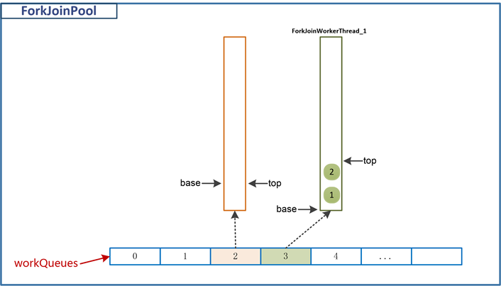

工作线程ForkJoinWorkThread_1调用**execLocalTasks**方法一次性执行自己队列中的所有任务，这时分成两种情况：

**1.异步模式（asyncMode==true）**

*如果构造线程池时，asyncMode为true，表示以异步模式执行工作线程自身队列中的任务，此时会从* `*base -> top*`*遍历并执行所有任务*。

**2.同步模式（asyncMode==false）**

如果构造线程池时，asyncMode为false（默认情况），表示以同步模式执行工作线程自身队列中的任务，此时会从 `top -> base` 遍历并执行所有任务。

> 任务的入队总是在`top`端，所以当以同步模式遍历时，其实相当于栈操作（从栈顶pop元素）；
> 如果是异步模式，相当于队列的出队操作（从base端poll元素）。
> **异步模式比较适合于那些不需要返回结果的任务**。其实如果将队列中的任务看成一棵树（无环连通图）的话，异步模式类似于图的广度优先遍历，同步模式类似于图的深度优先遍历

假设此处以默认的**同步模式**遍历，ForkJoinWorkThread_1从栈顶开始执行并移除任务，先执行任务2并移除，再执行任务1并：

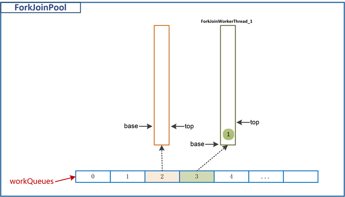


## 六、总结

本章简要概述了Fork/Join框架的思想、主要组件及基本使用，Fork/Join框架的核心包含四大组件：**ForkJoinTask**任务类、**ForkJoinPool**线程池、**ForkJoinWorkerThread**工作线程、**WorkQueue**任务队列。

本章通过示例，描述了各个组件的关系以及ForkJoin线程池的整个调度流程，F/J框架的核心来自于它的工作窃取及调度策略，可以总结为以下几点：

1. *每个Worker线程利用它自己的任务队列维护可执行任务；*
2. *任务队列是一种双端队列，支持LIFO的***push***和***pop***操作，也支持FIFO的***take***操作；*
3. *任务fork的子任务，只会push到它所在线程（调用fork方法的线程）的队列；*
4. *工作线程既可以使用LIFO通过pop处理自己队列中的任务，也可以FIFO通过poll处理自己队列中的任务，具体取决于构造线程池时的asyncMod*e参数；
5. 当工作线程自己队列中没有待处理任务时，它尝试去随机读取（窃取）其它任务队列的base端的任务；
6. 当线程进入join操作，它也会去处理其它工作线程的队列中的任务（自己的已经处理完了），直到目标任务完成（通过isDone方法）；
7. 当一个工作线程没有任务了，并且尝试从其它队列窃取也失败了，它让出资源（通过使用yields, sleeps或者其它优先级调整）并且随后会再次激活，直到所有工作线程都空闲了——此时，它们都阻塞在等待另一个顶层线程的调用。