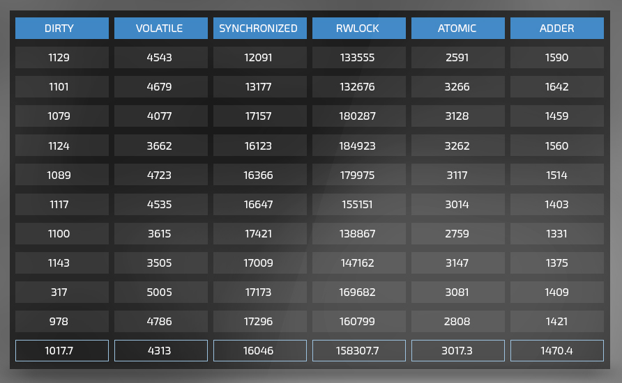

摘自：`https://wizardforcel.gitbooks.io/java8-tutorials/content/Java%208%20LongAdders%20%E7%AE%A1%E7%90%86%E5%B9%B6%E5%8F%91%E8%AE%A1%E6%95%B0%E5%99%A8%E7%9A%84%E6%AD%A3%E7%A1%AE%E6%96%B9%E5%BC%8F.html`

# Java 8 LongAdders：管理并发计数器的正确方式

这次我想讨论其中我最喜欢的之一：并发加法器。这是一个新的类集合，他们用来管理被多线程读写的计数器。这个新的API在显著提升性能同时，仍然保持了简单直接的特点。

多核架构到来之后人们就解决着并发计数器，让我们来看看到现在为止Java提供了哪些解决并发计数器的选项，并对比一下他们与新API的性能。

**脏计数器** – 这种方法意味着一个常规对象或静态属性正在被多线程读写。不幸的是，由于两个原因这行不通。原因之一，在Java中A += B操作不是原子的。如果你打开输出字节码，你将至少看到四个指令 —— 第一个用来将属性值从堆加载到线程栈，第二个用来加载delta，第三个用来把它们相加，第四个用来将结果重新分配给属性值。

如果多个线程同时作用于同一块内存单元，写操作有很大机会丢失，因为一个线程可以覆盖另一个线程的值（又名“读-修改-写”），另一个令人不快的是这种情况下你不得不处理值的冲突，还有更坏的情况。

这是相当菜鸟的一个问题，而且超级难调试。如果你确实发现有人在你的应用中这么做的话，我想要你帮个小忙。在你的数据库中搜索“Tal Weiss”，如果存在我的记录，请删除，这样我会觉得安全些。

**Synchronized** – 最基本的并发用语，它在读写一个值的时候会阻塞所有想读写该值的其他线程。虽然它是可行的，但你的代码却注定要被转向[DMV line](https://www.youtube.com/watch?v=1w_XVPImsqQ)。

**读写锁** – 基本Java锁的略复杂版本，它使你能够区分修改值并且需要阻塞其他线程的线程和仅是读取值并且不需要临界区的线程。虽然这更有效率（假设写线程数量很少），但由于当你获取写锁的时候阻塞了所有其他线程的执行，这真是一个“漂亮”的方法。事实上，只有当你了解到相比读线程，写线程的数量极大地受限时它才真正是一个好方法。

**Volatile** – 这个关键词非常容易被误解，它指示JIT编译器重新优化运行时机器码，使得属性的任何修改对其他线程都是即时可见的。

这将导致一些JIT处理内存分配的顺序这项JIT编译器最喜爱的优化失效。你再说一遍？是的，你没有听错。JIT编译器可以改变属性分配的顺序。这个神秘的小策略（又叫[happens-before](http://en.wikipedia.org/wiki/Happened-before)）能够最小化程序访问全局堆的次数，同时仍然确保你的代码没有被影响。真是相当隐蔽…

所以什么时候应该使用volatile处理计数器呢？如果你仅有一个线程更新值并且多个线程读取它，这时使用volatile无疑是一个真正好的策略。

那为什么不总是使用它呢？因为当多个线程同时更新属性的时候它不能很好的工作。由于A += B不是原子操作，这将带来覆盖其他写操作的风险。在Java8之前，处理这种情况你需要使用的是AtomicInteger。

**AtomicInteger** *– 这组类使用CAS（比较并交换）处理器指令来更新计数器的值。听起来不错，真的是这样吗？是也不是。好的一面是它通过一个直接机器码指令设置值时，能够最小程度地影响其他线程的执行。坏的一面是如果它在与其他线程竞争设置值时失败了，它不得不再次尝试。在高竞争下，这将转化为一个自旋锁，线程不得不持续尝试设置值，无限循环直到成功。这可不是我们想要的方法。让我们进入Java 8的LongAdders。*

**Java 8 加法器** *– 这是一个如此酷的新API以至于我一直在滔滔不绝地谈论它。从使用的角度看它与AtomicInteger非常相似，简单地创建一个LongAdder实例，并使用intValue()和add()来获取和设置值。神奇的地方发生在幕后。*

这个类所做的事情是当一个直接CAS由于竞争失败时，它将delta保存在为该线程分配的一个内部单元对象中，然后当intValue()被调用时，它会将这些临时单元的值再相加到结果和中。这就减少了返回重新CAS或者阻塞其他线程的必要。多么聪明的做法！

好吧，已经说的够多了-让我们看看这个类的实际表现吧。我们设立了下面的基准测试-通过多线程将一个计数器增加到10^8。我们用总共10个线程来运行这个测试-5个写操作，5个读操作。测试机器仅有一个四核的i7处理器，因此测试一定会产生一些严重的竞争：

**代码**在[这里](https://github.com/takipi/counters-benchmark)可以下载到

注意dirty和volatile都冒着一些严重的值覆盖危险。

**总结**

- 并行加法器相比原子整数拥有60%-100%的性能提升
- 执行加法的线程之间没有太大差别，除非被锁定
- 注意当你使用synchronized或读写锁时所带来的巨大性能问题 – 慢一个甚至两个数量级