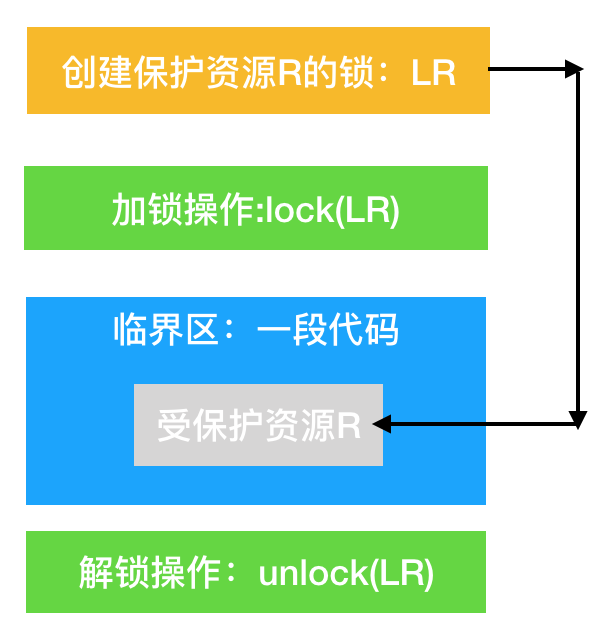
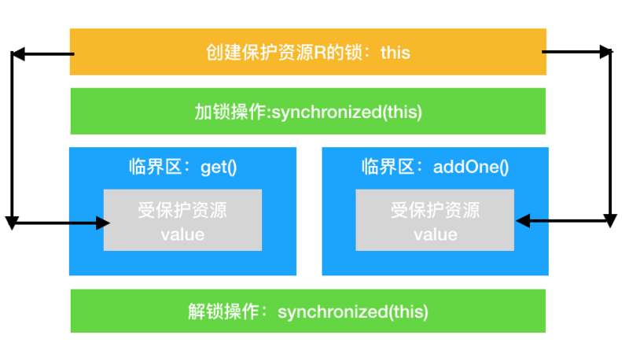
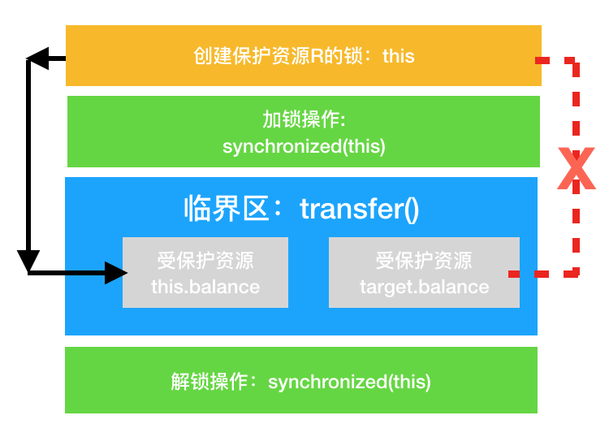
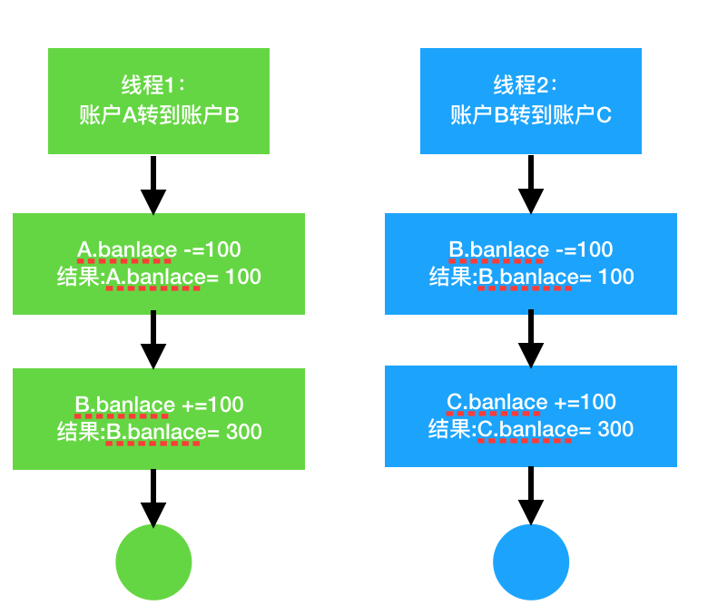

摘自：`https://segmentfault.com/a/1190000018825260`

可关注该博客


*在前面的分享中我们提到。*

> *一个或者多个操作在 CPU 执行的过程中不被中断的特性，称为“原子性”*

*思考：在32位的机器上对long型变量进行加减操作存在并发问题，什么原因！？*


## 原子性问题如何解决

我们已经知道原子性问题是`线程切换`，而操作系统做线程切换是依赖 CPU 中断的，所以禁止 CPU 发生中断就能够禁止线程切换。

在单核 CPU 时代，这个方案的确是可行的。这里我们以 32 位 CPU 上执行 long 型变量的写操作为例来说明这个问题，long 型变量是 64 位，在 32 位 CPU 上执行写操作会被拆分成两次写操作（写高 32 位和写低 32 位，如下图所示）。


  在单核 CPU 场景下，同一时刻只有一个线程执行，禁止 CPU 中断，获得 CPU 使用权的线程就可以不间断地执行，所以两次写操作一定是：要么都被执行，要么都没有被执行，具有原子性。

但是在多核场景下，同一时刻，有可能有两个线程同时在执行，一个线程执行在 CPU-1 上，一个线程执行在 CPU-2 上，此时禁止 CPU 中断，只能保证 CPU 上的线程连续执行，并不能保证同一时刻只有一个线程执行，如果这两个线程同时写 long 型变量高 32 位的话，还是会出现问题。

> `同一时刻只有一个线程执行`这个条件非常重要，我们称之为`互斥`。

如果我们能够保证对共享变量的修改是互斥的，那么，无论是单核 CPU 还是多核 CPU，就都能保证原子性了。

### 简易锁模型

互斥的解决方案，`锁`。大家脑中的模型可能是这样的。


线程在进入临界区之前，首先尝试加锁 lock()，如果成功，则进入临界区，此时我们称这个线程持有锁；否则就等待，直到持有锁的线程解锁；持有锁的线程执行完临界区的代码后，执行解锁 unlock()。

这样理解本身没有问题，但却很容易让我们忽视两个非常非常重要的点：

1. 我们锁的是什么？
2. 我们保护的又是什么？

### 改进后的锁模型

我们知道在现实世界里，锁和锁要保护的资源是有对应关系的，比如我用我家的锁保护我家的东西。在并发编程世界里，锁和资源也应该有这个关系，但这个关系在我们上面的模型中是没有体现的，所以我们需要完善一下我们的模型。



首先，我们要把临界区要保护的资源标注出来，如图中临界区里增加了一个元素：受保护的资源 R；其次，我们要保护资源 R 就得为它创建一把锁 LR；最后，针对这把锁 LR，我们还需在进出临界区时添上加锁操作和解锁操作。另外，在锁 LR 和受保护资源之间，增加了一条连线，这个关联关系非常重要，这里很容易发生BUG，容易出现了类似锁自家门来保护他家资产的事情。

## Java语言提供的锁

锁是一种通用的技术方案，Java 语言提供的`synchronized` 关键字，就是锁的一种实现。`synchronized`关键字可以用来修饰方法，也可以用来修饰代码块，基本使用：

```
class X {
  // 修饰非静态方法
  synchronized void foo() {
    // 临界区
  }
  // 修饰静态方法
  synchronized static void bar() {
    // 临界区
  }
  // 修饰代码块
  Object obj = new Object()；
  void baz() {
    synchronized(obj) {
      // 临界区
    }
  }
}  
```

参考我们上面提到的模型，加锁 lock() 和解锁 unlock() 这两个操作在Java 编译会自动加上。这样做的好处就是加锁 lock() 和解锁 unlock() 一定是成对出现的。

上面的代码我们看到只有修饰代码块的时候，锁定了一个 obj 对象，那修饰方法的时候锁定的是什么呢？这个也是 Java 的一条隐式规则：

> 当修饰静态方法的时候，锁定的是当前类的 Class 对象，在上面的例子中就是 Class X；
>
> 当修饰非静态方法的时候，锁定的是当前实例对象 this。

```
class X {
  // 修饰静态方法
  synchronized(X.class) static void bar() {
    // 临界区
  }
}

class X {
  // 修饰非静态方法
  synchronized(this) void foo() {
    // 临界区
  }
}
```

### 锁解决 count+1 问题

我们来尝试下用`synchronized`解决之前遇到的 `count+=1` 存在的并发问题，代码如下所示。SafeCalc 这个类有两个方法：一个是 get() 方法，用来获得 value 的值；另一个是 addOne() 方法，用来给 value 加 1，并且 addOne() 方法我们用 synchronized 修饰。那么我们使用的这两个方法有没有并发问题呢？

```
class SafeCalc {
  long value = 0L;
  long get() {
    return value;
  }
  synchronized void addOne() {
    value += 1;
  }
}
```

我们先来看看 addOne() 方法，首先可以肯定，被 synchronized 修饰后，无论是单核 CPU 还是多核 CPU，只有一个线程能够执行 addOne() 方法，所以一定能保证原子操作，那是否有可见性问题呢？
让我们回顾下之前讲一条 Happens-Before的规则。

> 管程中锁的规则：对一个锁的解锁 Happens-Before 于后续对这个锁的加锁。

管程，就是我们这里的 synchronized.我们知道 synchronized 修饰的临界区是互斥的，也就是说同一时刻只有一个线程执行临界区的代码；而这里指的就是前一个线程的解锁操作对后一个线程的加锁操作可见.我们就能得出前一个线程在临界区修改的共享变量（该操作在解锁之前），对后续进入临界区（该操作在加锁之后）的线程是可见的。

按照这个规则，如果多个线程同时执行 addOne() 方法，可见性是可以保证的，也就说如果有 1000 个线程执行 addOne() 方法，最终结果一定是 value 的值增加了 1000。

我们在来看下，执行 addOne() 方法后，value 的值对 get() 方法是可见的吗？这个可见性是没法保证的。管程中锁的规则，是只保证后续对这个锁的加锁的可见性，而 get() 方法并没有加锁操作，所以可见性没法保证。那如何解决呢？很简单，就是 get() 方法也 synchronized 一下，完整的代码如下所示。

```
class SafeCalc {
  long value = 0L;
  synchronized long get() {
    return value;
  }
  synchronized void addOne() {
    value += 1;
  }
}
```

上面的代码转换为我们提到的锁模型，就是下面图示这个样子。get() 方法和 addOne() 方法都需要访问 value 这个受保护的资源，这个资源用 this 这把锁来保护。线程要进入临界区 get() 和 addOne()，必须先获得 this 这把锁，这样 get() 和 addOne() 也是互斥的。



### 锁和受保护资源的关系

我们前面提到，受保护资源和锁之间的关联关系非常重要，他们的关系是怎样的呢？一个合理的关系是：

> 受保护资源和锁之间的关联关系是 N:1 的关系

上面那个例子我稍作改动，把 value 改成静态变量，把 addOne() 方法改成静态方法，此时 get() 方法和 addOne() 方法是否存在并发问题呢？

```
class SafeCalc {
  static long value = 0L;
  synchronized long get() {
    return value;
  }
  synchronized static void addOne() {
    value += 1;
  }
}
```

如果你仔细观察，就会发现改动后的代码是用两个锁保护一个资源。这个受保护的资源就是静态变量 value，两个锁分别是 this 和 SafeCalc.class。我们可以用下面这幅图来形象描述这个关系。由于临界区 get() 和 addOne() 是用两个锁保护的，因此这两个临界区没有互斥关系，临界区 addOne() 对 value 的修改对临界区 get() 也没有可见性保证，这就导致并发问题了。


### 锁小结

互斥锁，在并发领域的知名度极高，只要有了并发问题，大家首先容易想到的就是加锁，加锁能够保证执行临界区代码的互斥性。

synchronized 是 Java 在语言层面提供的互斥原语，其实 Java 里面还有很多其他类型的锁，但作为互斥锁，原理都是相通的：锁，一定有一个要锁定的对象，至于这个锁定的对象要保护的资源以及在哪里加锁 / 解锁，就属于设计层面的事情。

## 如何一把锁保护多个资源？

### 保护没有关联关系的多个资源

当我们要保护多个资源时，首先要区分这些资源是否存在关联关系。

同样这对应到编程领域，也很容易解决。例如，银行业务中有针对账户余额（余额是一种资源）的取款操作，也有针对账户密码（密码也是一种资源）的更改操作，我们可以为账户余额和账户密码分配不同的锁来解决并发问题，这个还是很简单的。

相关的示例代码如下，账户类 Account 有两个成员变量，分别是账户余额 balance 和账户密码 password。取款 withdraw() 和查看余额 getBalance() 操作会访问账户余额 balance，我们创建一个 final 对象 balLock 作为锁（类比球赛门票）；而更改密码 updatePassword() 和查看密码 getPassword() 操作会修改账户密码 password，我们创建一个 final 对象 pwLock 作为锁（类比电影票）。不同的资源用不同的锁保护，各自管各自的，很简单。

```
class Account {
  // 锁：保护账户余额
  private final Object balLock
    = new Object();
  // 账户余额  
  private Integer balance;
  // 锁：保护账户密码
  private final Object pwLock
    = new Object();
  // 账户密码
  private String password;

  // 取款
  void withdraw(Integer amt) {
    synchronized(balLock) {
      if (this.balance > amt){
        this.balance -= amt;
      }
    }
  } 
  // 查看余额
  Integer getBalance() {
    synchronized(balLock) {
      return balance;
    }
  }

  // 更改密码
  void updatePassword(String pw){
    synchronized(pwLock) {
      this.password = pw;
    }
  } 
  // 查看密码
  String getPassword() {
    synchronized(pwLock) {
      return password;
    }
  }
}
```

当然，我们也可以用一把互斥锁来保护多个资源，例如我们可以用 this 这一把锁来管理账户类里所有的资源：但是用一把锁就是性能太差，会导致取款、查看余额、修改密码、查看密码这四个操作都是串行的。而我们用两把锁，取款和修改密码是可以并行的。

```
用不同的锁对受保护资源进行精细化管理，能够提升性能 。这种锁还有个名字，叫 `细粒度锁`
```

### 保护有关联关系的多个资源

如果多个资源是有关联关系的，那这个问题就有点复杂了。例如银行业务里面的转账操作，账户 A 减少 100 元，账户 B 增加 100 元。这两个账户就是有关联关系的。那对于像转账这种有关联关系的操作，我们应该怎么去解决呢？先把这个问题代码化。我们声明了个账户类：Account，该类有一个成员变量余额：balance，还有一个用于转账的方法：transfer()，然后怎么保证转账操作 transfer() 没有并发问题呢？

```
class Account {
  private int balance;
  // 转账
  void transfer(Account target, int amt){
    if (this.balance > amt) {
      this.balance -= amt;
      target.balance += amt;
    }
  } 
}
```

相信你的直觉会告诉你这样的解决方案：用户 synchronized 关键字修饰一下 transfer() 方法就可以了，于是你很快就完成了相关的代码，如下所示。

```
class Account {
  private int balance;
  // 转账
  synchronized void transfer(Account target, int amt){
    if (this.balance > amt) {
      this.balance -= amt;
      target.balance += amt;
    }
  } 
}
```

在这段代码中，临界区内有两个资源，分别是转出账户的余额 `this.balance` 和转入账户的余额 `target.balance`，并且用的是一把锁`this`，符合我们前面提到的，多个资源可以用一把锁来保护，这看上去完全正确呀。真的是这样吗？可惜，这个方案仅仅是看似正确，为什么呢？

问题就出在 this 这把锁上，this 这把锁可以保护自己的余额 this.balance，却保护不了别人的余额 target.balance，就像你不能用自家的锁来保护别人家的资产，也不能用自己的票来保护别人的座位一样。



下面我们具体分析一下，假设有 A、B、C 三个账户，余额都是 200 元，我们用两个线程分别执行两个转账操作：账户 A 转给账户 B 100 元，账户 B 转给账户 C 100 元，最后我们期望的结果应该是账户 A 的余额是 100 元，账户 B 的余额是 200 元， 账户 C 的余额是 300 元。

我们假设线程 1 执行账户 A 转账户 B 的操作，线程 2 执行账户 B 转账户 C 的操作。这两个线程分别在两颗 CPU 上同时执行，那它们是互斥的吗？我们期望是，但实际上并不是。因为线程 1 锁定的是账户 A 的实例（A.this），而线程 2 锁定的是账户 B 的实例（B.this），所以这两个线程可以同时进入临界区 transfer()。同时进入临界区的结果是什么呢？线程 1 和线程 2 都会读到账户 B 的余额为 200，导致最终账户 B 的余额可能是 300（线程 1 后于线程 2 写 B.balance，线程 2 写的 B.balance 值被线程 1 覆盖），可能是 100（线程 1 先于线程 2 写 B.balance，线程 1 写的 B.balance 值被线程 2 覆盖），就是不可能是 200。



### 使用锁的正确知识

在上一篇文章中，我们提到用同一把锁来保护多个资源，也就是现实世界的“包场”，那在编程领域应该怎么“包场”呢？很简单，只要我们的 `锁能覆盖所有受保护资源` 就可以了。

这里我们用 `Account.class· 作为共享的锁`。Account.class 是所有 Account 对象共享的，而且这个对象是 Java 虚拟机在加载 Account 类的时候创建的，所以我们不用担心它的唯一性。

```
class Account {
  private int balance;
  // 转账
  void transfer(Account target, int amt){
    synchronized(Account.class) {
      if (this.balance > amt) {
        this.balance -= amt;
        target.balance += amt;
      }
    }
  } 
}
```

下面这幅图很直观地展示了我们是如何使用共享的锁 Account.class 来保护不同对象的临界区的。


思考下：上面的写法不是最佳实践，锁是可变的。

### 锁与资源关系小结

对如何保护多个资源已经很有心得了，关键是要分析多个资源之间的关系。如果资源之间没有关系，很好处理，每个资源一把锁就可以了。如果资源之间有关联关系，就要选择一个粒度更大的锁，这个锁应该能够覆盖所有相关的资源。除此之外，还要梳理出有哪些访问路径，所有的访问路径都要设置合适的锁。

> 问题：在第一个示例程序里，我们用了两把不同的锁来分别保护账户余额、账户密码，创建锁的时候，我们用的是：`private final Object xxxLock = new Object();`如果账户余额用 this.balance 作为互斥锁，账户密码用 this.password 作为互斥锁，你觉得是否可以呢？

