摘自：

```http
https://juejin.im/entry/5b9f0571f265da0a8f35b4bb
https://blog.csdn.net/liyantianmin/article/details/54673109
```

使用例子

```java
import java.util.concurrent.locks.ReentrantLock;

public class App {    
	public static void main(String[] args) throws Exception {        
		final int[] counter = {0};        
		ReentrantLock lock = new ReentrantLock();        
		for (int i= 0; i < 50; i++){            
			new Thread(new Runnable() {                
				@Override                
				public void run() {                    
					lock.lock();                    
					try {                        
						int a = counter[0];                        
						counter[0] = a + 1;                    
					}finally {                        
						lock.unlock();                    
					}                
				}            
			}).start();        
		}        
		// 主线程休眠，等待结果        
		Thread.sleep(5000);        
		System.out.println(counter[0]);    
	}
}
```

在这个例子中，开50个线程同时更新counter。分成三块来看看源码（初始化、获取锁、释放锁）

实现原理

```java
/**     
* Creates an instance of {@code ReentrantLock}.     
* This is equivalent to using {@code ReentrantLock(false)}.     
*/    
public ReentrantLock() {        
	sync = new NonfairSync();    
}
```

在lock的构造函数中，定义了一个NonFairSync，

```java
static final class NonfairSync extends Sync 
```

NonfairSync 又是继承于Sync

```java
abstract static class Sync extends AbstractQueuedSynchronizer
```


一步一步往上找，找到了这个鬼AbstractQueuedSynchronizer（简称AQS），最后这个鬼，又是继承于AbstractOwnableSynchronizer(AOS)，AOS主要是保存获取当前锁的线程对象，代码不多不再展开。最后我们可以看到几个主要类的继承关系。

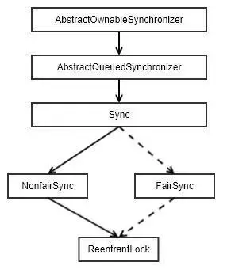

FairSync 与 NonfairSync的区别在于，是不是保证获取锁的公平性，因为默认是NonfairSync，我们以这个为例了解其背后的原理。独占和共享的区别：

* 当AQS的子类实现独占功能时，如ReentrantLock，资源是否可以被访问被定义为：只要AQS的state变量不为0，并且持有锁的线程不是当前线程，那么代表资源不可访问。
* 当AQS的子类实现共享功能时，如CountDownLatch，资源是否可以被访问被定义为：只要AQS的state变量不为0，那么代表资源不可以为访问。
    

其他几个类代码不多，最后的主要代码都是在AQS中，我们先看看这个类的主体结构。

**AbstractQueuedSynchronizer是个什么**

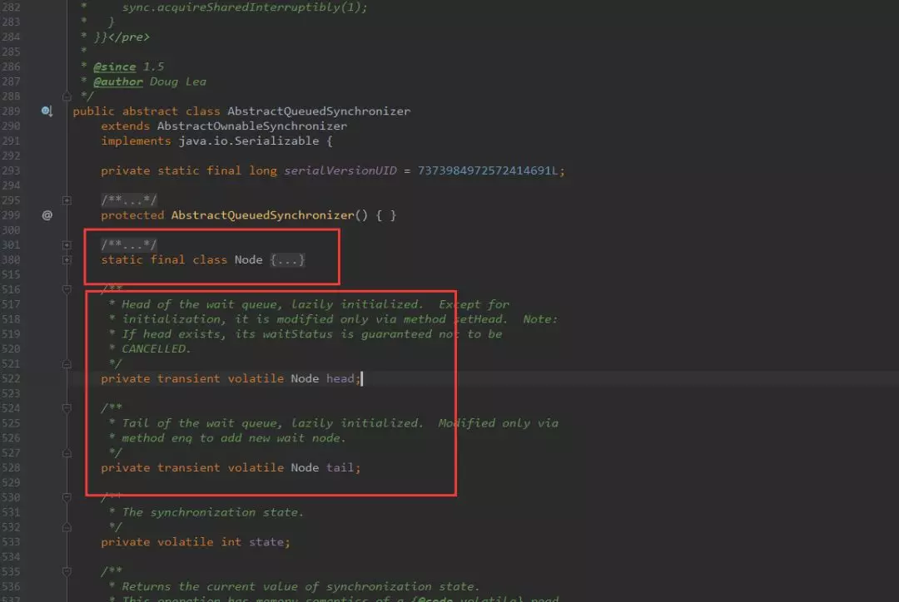

再看看Node是什么？

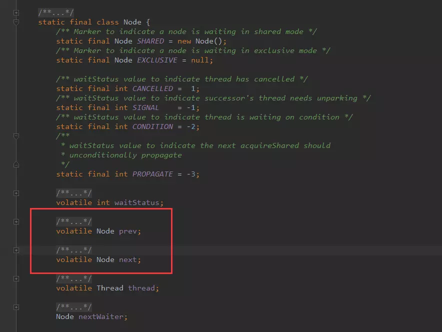

看到这里的同学，是不是有种热泪盈眶的感觉，这尼玛，不就是 **双向链表**么？我还记得第一次写这个数据结构的时候，发现居然还有这么神奇的一个东西。

**最后我们可以发现锁的存储结构就两个东西:"双向链表" + "int类型状态"。**需要注意的是，他们的变量都被" `transient`和`volatile`修饰。

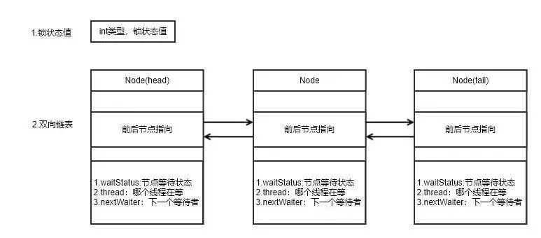

一个int值，一个双向链表是如何烹饪处理锁这道菜的呢，Doug Lea大神就是大神，我们接下来看看，如何获取锁？

**lock.lock()怎么获取锁？**

```java
/** * Acquires the lock. */
public void lock() {    
    sync.lock();
}
```

可以看到调用的是，`NonfairSync.lock()`

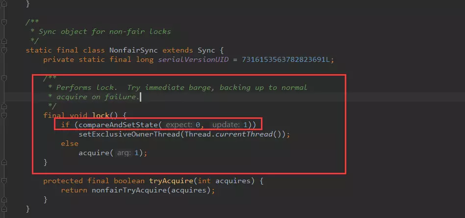

看到这里，我们基本有了一个大概的了解，还记得之前AQS中的int类型的state值，这里就是通过CAS（乐观锁）去修改state的值。 **lock的基本操作还是通过乐观锁来实现的**。

获取锁通过CAS，那么没有获取到锁，等待获取锁是如何实现的？我们可以看一下else分支的逻辑，acquire方法：

```java
public final void acquire(int arg) {    
	if (!tryAcquire(arg) && acquireQueued(addWaiter(Node.EXCLUSIVE), arg))        
		selfInterrupt();
}
```

这里干了三件事情：

- tryAcquire：会尝试再次通过CAS获取一次锁。
- addWaiter：将当前线程加入上面锁的双向链表（等待队列）中
- acquireQueued：通过自旋，判断当前队列节点是否可以获取锁。


**addWaiter 添加当前线程到等待链表中**

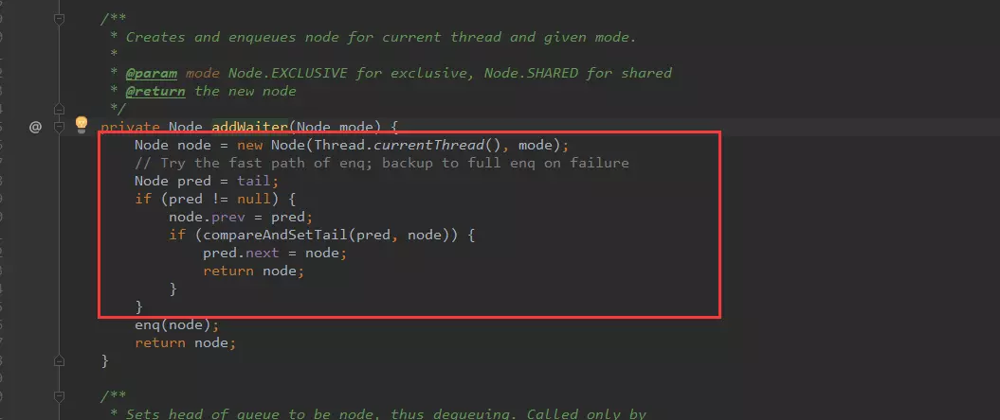

可以看到，通过CAS确保能够在线程安全的情况下，将当前线程加入到链表的尾部。 enq是个自旋+上述逻辑，有兴趣的可以翻翻源码。

**acquireQueued**

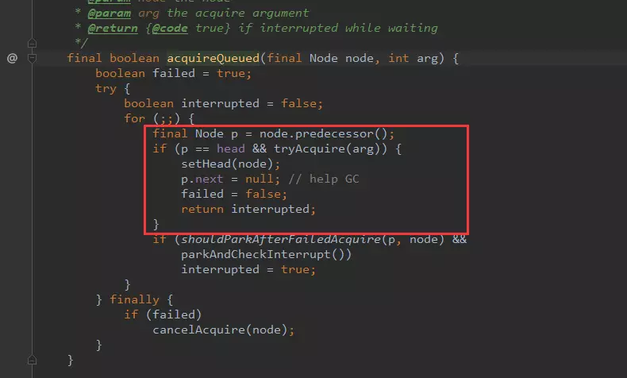

可以看到，当当前线程到头部的时候，尝试CAS更新锁状态，如果更新成功表示该等待线程获取成功。从头部移除。

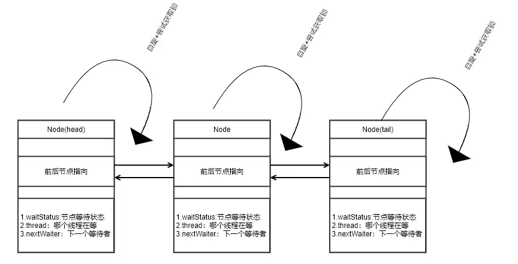

最后简要概括一下，获取锁的一个流程

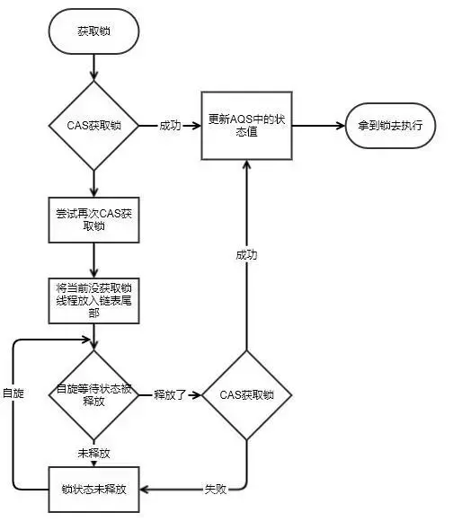

**lock.unlock() 释放锁**

```java
public void unlock() {    sync.release(1);}
```

可以看到调用的是，NonfairSync.release()

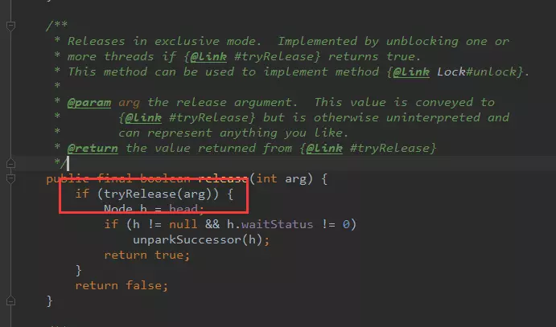

最后有调用了NonfairSync.tryRelease()

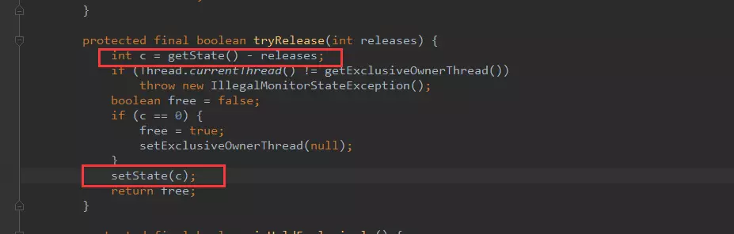


总结

- lock的存储结构：一个int类型状态值（用于锁的状态变更），一个双向链表（用于存储等待中的线程）
- lock获取锁的过程：本质上是通过CAS来获取状态值修改，如果当场没获取到，会将该线程放在线程等待链表中。
- lock释放锁的过程：修改状态值，调整等待链表。
- 可以看到在整个实现过程中，lock大量使用CAS+自旋。因此根据CAS特性，lock建议使用在低锁冲突的情况下。目前java1.6以后，官方对synchronized做了大量的锁优化（偏向锁、自旋、轻量级锁）。因此在非必要的情况下，建议使用synchronized做同步操作。