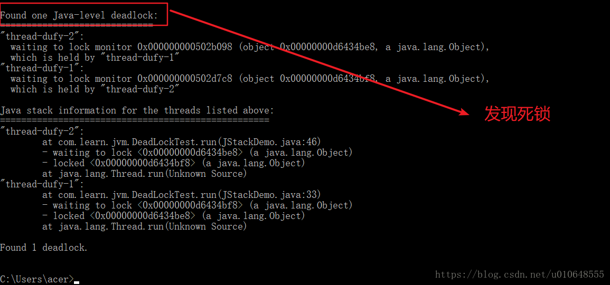
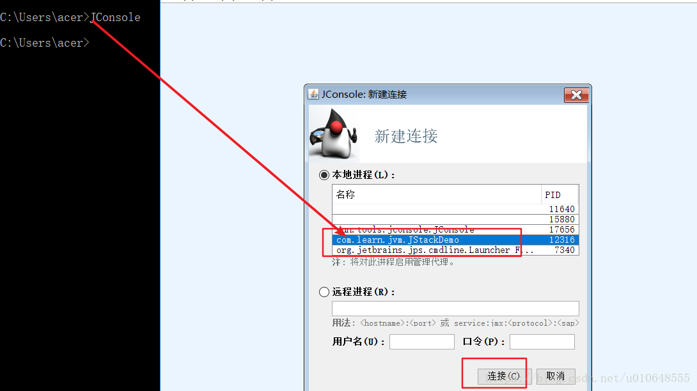
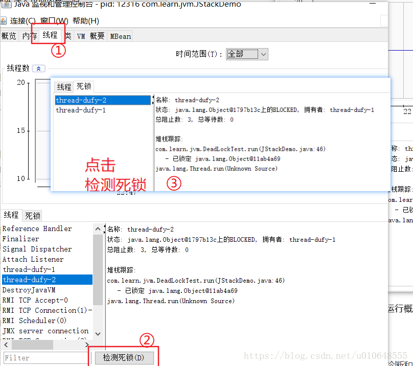
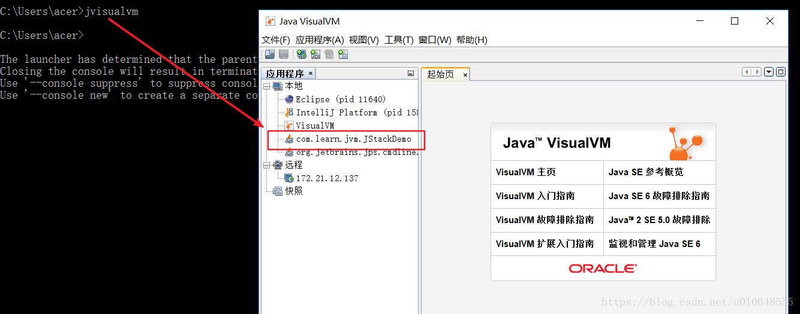
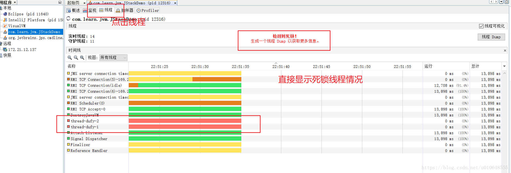

摘自：`<https://blog.csdn.net/u010648555/article/details/80721815>`


# Java死锁排查

首先写一个死锁的代码，看例子：

```java
/**
 * 
 * 使用jstack 排查死锁
 * @author dufyun
 *
 */
public class JStackDemo {
    public static void main(String[] args) {
        Thread t1 = new Thread(new DeadLockTest(true));//建立一个线程
        Thread t2 = new Thread(new DeadLockTest(false));//建立另一个线程
        t1.setName("thread-dufy-1");
        t2.setName("thread-dufy-2");
        t1.start();//启动一个线程
        t2.start();//启动另一个线程
    }
}
class DeadLockTest implements Runnable {
    public boolean falg;// 控制线程
    DeadLockTest(boolean falg) {
        this.falg = falg;
    }
    public void run() {
        /**
         * 如果falg的值为true则调用t1线程
         */
        if (falg) {
            while (true) {
                synchronized (Demo.o1) {
                    System.out.println("o1 " + Thread.currentThread().getName());
                    synchronized (Demo.o2) {
                        System.out.println("o2 " + Thread.currentThread().getName());
                    }
                }
            }
        }
        /**
         * 如果falg的值为false则调用t2线程
         */
        else {
            while (true) {
                synchronized (Demo.o2) {
                    System.out.println("o2 " + Thread.currentThread().getName());
                    synchronized (Demo.o1) {
                        System.out.println("o1 " + Thread.currentThread().getName());
                    }
                }
            }
        }
    }
}

class Demo {
    static Object o1 = new Object();
    static Object o2 = new Object();
}
```

*上面这段代码执行后，就会出现死锁，那么排查的方法有如下：*

#### *使用 jps + jstack*

> 第一：在windons命令窗口，使用 jps -l 【不会使用jps请自行查询资料】


> 第二：使用jstack -l 12316 【不会使用jstack请自行查询资料】



### 使用jconsole

在window打开 JConsole，JConsole是一个图形化的监控工具！






### 使用Java Visual VM

在window打开 jvisualvm，jvisualvm是一个图形化的监控工具！

> 在windons命令窗口 ，输出 jvisualvm






