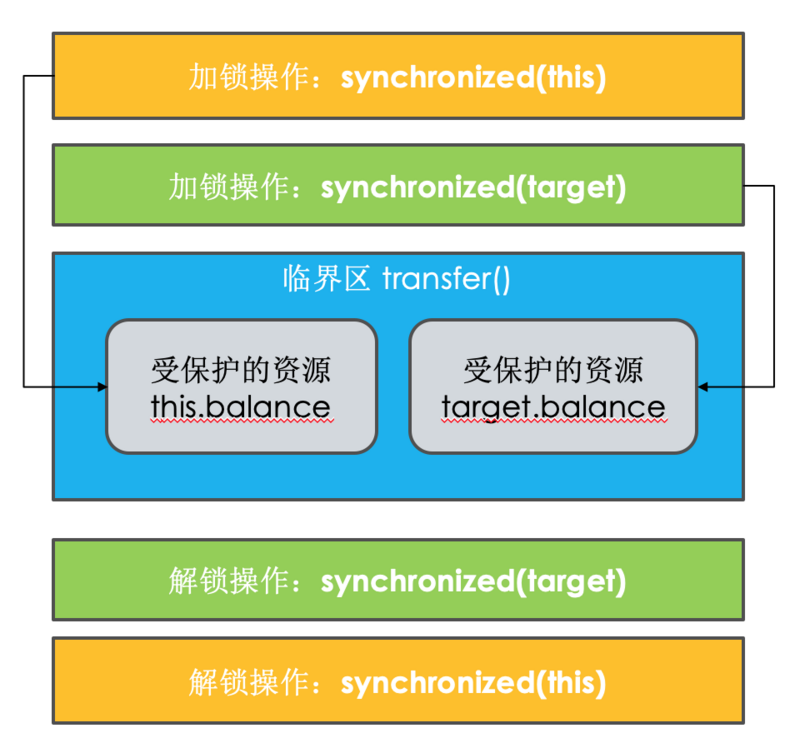
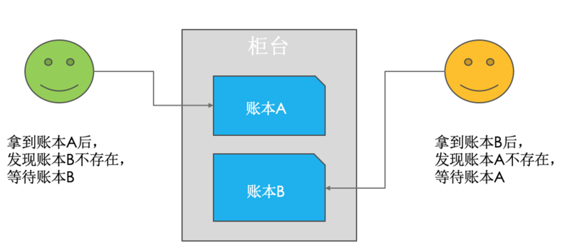
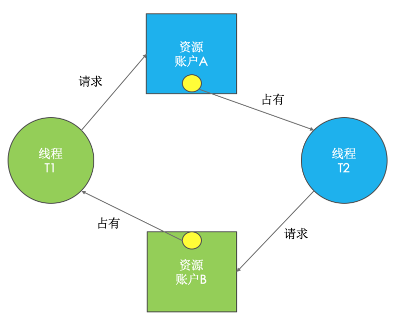
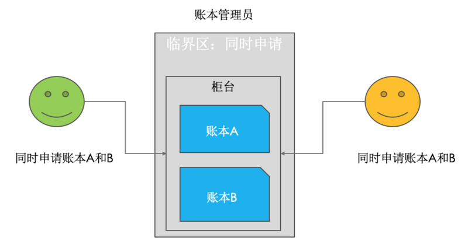

摘自：`<https://blog.csdn.net/u010648555/article/details/80721815>`


# Java死锁排查

首先写一个死锁的代码，看例子：

```java
/**
 * 
 * 使用jstack 排查死锁
 * @author dufyun
 *
 */
public class JStackDemo {
    public static void main(String[] args) {
        Thread t1 = new Thread(new DeadLockTest(true));//建立一个线程
        Thread t2 = new Thread(new DeadLockTest(false));//建立另一个线程
        t1.setName("thread-dufy-1");
        t2.setName("thread-dufy-2");
        t1.start();//启动一个线程
        t2.start();//启动另一个线程
    }
}
class DeadLockTest implements Runnable {
    public boolean falg;// 控制线程
    DeadLockTest(boolean falg) {
        this.falg = falg;
    }
    public void run() {
        /**
         * 如果falg的值为true则调用t1线程
         */
        if (falg) {
            while (true) {
                synchronized (Demo.o1) {
                    System.out.println("o1 " + Thread.currentThread().getName());
                    synchronized (Demo.o2) {
                        System.out.println("o2 " + Thread.currentThread().getName());
                    }
                }
            }
        }
        /**
         * 如果falg的值为false则调用t2线程
         */
        else {
            while (true) {
                synchronized (Demo.o2) {
                    System.out.println("o2 " + Thread.currentThread().getName());
                    synchronized (Demo.o1) {
                        System.out.println("o1 " + Thread.currentThread().getName());
                    }
                }
            }
        }
    }
}

class Demo {
    static Object o1 = new Object();
    static Object o2 = new Object();
}
```

上面这段代码执行后，就会出现死锁，那么排查的方法有如下：

#### *使用 jps + jstack*

> 第一：在windons命令窗口，使用 jps -l 【不会使用jps请自行查询资料】


> 第二：使用jstack -l 12316 【不会使用jstack请自行查询资料】


### 使用jconsole

在window打开 JConsole，JConsole是一个图形化的监控工具！


### 使用Java Visual VM

在window打开 jvisualvm，jvisualvm是一个图形化的监控工具！

> 在windons命令窗口 ，输出 jvisualvm


# 解决

摘自：`https://segmentfault.com/a/1190000018904080`

在上一篇中，我们尝试使用了 `Account.class`作为互斥锁，来解决转账问题。但是很容易发现这样，所有的转账操作都是串行的，性能太差了。

让我们尝试提升下性能。

现实世界中，转账操作是支持并发的。

我设想下，在古代没有信息化的时候。账户的存在就是一个个账本，而且每个用户都有一个账本。这些账本都放在架子上。银行柜员在转账时候，是去架子上同时拿到转入账本和转出账本，然后做转账都。这时候这个柜员会遇到3种情况
1，架子上刚好有 转入和转出账本，同时拿走即可。
2，如果架子上只有转入和转出账本之一，柜员先拿走一本，在等着另一本被送回来。
3，转入和转出账本都没有，柜员只好等着2个账本被送回来。

上面的步骤转换成编码，其实就是2把锁实现。转入账本一把锁，转出账本一把锁。在 transfer() 方法内部，我们首先尝试锁定转出账户 this（先把转出账本拿到手），然后尝试锁定转入账户 target（再把转入账本拿到手），只有当两者都成功时，才执行转账操作。这个逻辑可以图形化为下图这个样子。



如下所示。经过这样的优化后，账户 A 转账户 B 和账户 C 转账户 D 这两个转账操作就可以并行了。

```
class Account {
  private int balance;
  // 转账
  void transfer(Account target, int amt){
    // 锁定转出账户
    synchronized(this) {              
      // 锁定转入账户
      synchronized(target) {           
        if (this.balance > amt) {
          this.balance -= amt;
          target.balance += amt;
        }
      }
    }
  } 
}
```

相对于用 Account.class 作为互斥锁，锁定的范围太大，而我们锁定两个账户范围就小多了，这样的锁，上一章我们介绍过，叫`细粒度锁`使用细粒度锁可以提高并行度，是性能优化的一个重要手段。

使用细粒度锁这么简单嘛？编写并发程序就需要这样时时刻刻保持谨慎。

> 使用细粒度锁是有代价的，这个代价就是可能会导致死锁。

我们还是通过现实世界看一下死锁产生的原因。如果有客户找柜员张三做个转账业务：账户 A 转账户 B 100 元，此时另一个客户找柜员李四也做个转账业务：账户 B 转账户 A 100 元，于是张三和李四同时都去文件架上拿账本，这时候有可能凑巧张三拿到了账本 A，李四拿到了账本 B。张三拿到账本 A 后就等着账本 B（账本 B 已经被李四拿走），而李四拿到账本 B 后就等着账本 A（账本 A 已经被张三拿走），他们要等多久呢？他们会永远等待下去…因为张三不会把账本 A 送回去，李四也不会把账本 B 送回去。我们姑且称为死等吧。



现实世界里的死等，就是编程领域的死锁了。

`死锁` 一组互相竞争资源的线程因互相等待，导致“永久”阻塞的现象

```
class Account {
  private int balance;
  // 转账
  void transfer(Account target, int amt){
    // 锁定转出账户
    synchronized(this){     ①
      // 锁定转入账户
      synchronized(target){ ②
        if (this.balance > amt) {
          this.balance -= amt;
          target.balance += amt;
        }
      }
    }
  } 
}
```

关于这种现象，我们还可以借助资源分配图来可视化锁的占用情况（资源分配图是个有向图，它可以描述资源和线程的状态）。其中，资源用方形节点表示，线程用圆形节点表示；资源中的点指向线程的边表示线程已经获得该资源，线程指向资源的边则表示线程请求资源，但尚未得到。转账发生死锁时的资源分配图就如下图所示。


转账发生死锁时的资源分配图

## 如何预防死

并发程序一旦死锁，一般没有特别好的方法，很多时候我们只能重启应用。因此，解决死锁问题最好的办法还是规避死锁。

那如何避免死锁呢？要避免死锁就需要分析死锁发生的条件，有个叫 Coffman 的牛人早就总结过了，只有以下这四个条件都发生时才会出现死锁：

1，互斥，共享资源 X 和 Y 只能被一个线程占用；
2，占有且等待，线程 T1 已经取得共享资源 X，在等待共享资源 Y 的时候，不释放共享资源 X；
3，不可抢占，其他线程不能强行抢占线程 T1 占有的资源；
4，循环等待，线程 T1 等待线程 T2 占有的资源，线程 T2 等待线程 T1 占有的资源，就是循环等待。

> 反过来分析，也就是说只要我们破坏其中一个，就可以成功避免死锁的发生

其中，互斥这个条件我们没有办法破坏，因为我们用锁为的就是互斥。不过其他三个条件都是有办法破坏掉的，到底如何做呢？

1，对于“占用且等待”这个条件，我们可以一次性申请所有的资源，这样就不存在等待了。
2，对于“不可抢占”这个条件，占用部分资源的线程进一步申请其他资源时，如果申请不到，可以主动释放它占有的资源，这样不可抢占这个条件就破坏掉了。
3，对于“循环等待”这个条件，可以靠按序申请资源来预防。所谓按序申请，是指资源是有线性顺序的，申请的时候可以先申请资源序号小的，再申请资源序号大的，这样线性化后自然就不存在循环了。

我们已经从理论上解决了如何预防死锁，下面我们就来尝试用代码实践一下这些理论。

### 1. 破坏占用且等待条件

从理论上讲，要破坏这个条件，可以一次性申请所有资源。在现实世界里，就拿前面我们提到的转账操作来讲。可以增加一个账本管理员，然后只允许账本管理员从文件架上拿账本，也就是说柜员不能直接在文件架上拿账本，必须通过账本管理员才能拿到想要的账本。例如，张三同时申请账本 A 和 B，账本管理员如果发现文件架上只有账本 A，这个时候账本管理员是不会把账本 A 拿下来给张三的，只有账本 A 和 B 都在的时候才会给张三。这样就保证了“一次性申请所有资源”。


通过账本管理员拿账本图

对应到编程领域，“同时申请”这个操作是一个临界区，我们也需要一个角色（Java 里面的类）来管理这个临界区，我们就把这个角色定为 Allocator。它有两个重要功能，分别是：同时申请资源 apply() 和同时释放资源 free()。账户 Account 类里面持有一个 Allocator 的单例（必须是单例，只能由一个人来分配资源）。当账户 Account 在执行转账操作的时候，首先向 Allocator 同时申请转出账户和转入账户这两个资源，成功后再锁定这两个资源；当转账操作执行完，释放锁之后，我们需通知 Allocator 同时释放转出账户和转入账户这两个资源。具体的代码实现如下。

```
class Allocator {
  private List<Object> als =
    new ArrayList<>();
  // 一次性申请所有资源
  synchronized boolean apply(
    Object from, Object to){
    if(als.contains(from) ||
         als.contains(to)){
      return false;  
    } else {
      als.add(from);
      als.add(to);  
    }
    return true;
  }
  // 归还资源
  synchronized void free(
    Object from, Object to){
    als.remove(from);
    als.remove(to);
  }
}

class Account {
  // actr 应该为单例
  private Allocator actr;
  private int balance;
  // 转账
  void transfer(Account target, int amt){
    // 一次性申请转出账户和转入账户，直到成功
    while(!actr.apply(this, target))
      ；
    try{
      // 锁定转出账户
      synchronized(this){              
        // 锁定转入账户
        synchronized(target){           
          if (this.balance > amt){
            this.balance -= amt;
            target.balance += amt;
          }
        }
      }
    } finally {
      actr.free(this, target)
    }
  } 
}
```

### 2. 破坏不可抢占条件

破坏不可抢占条件看上去很简单，核心是要能够主动释放它占有的资源，这一点 synchronized 是做不到的。原因是 synchronized 申请资源的时候，如果申请不到，线程直接进入阻塞状态了，而线程进入阻塞状态，也释放不了线程已经占有的资源。java.util.concurrent 这个包下面提供的 Lock 是可以轻松解决这个问题的。关于这个话题，咱们后面会详细讲。

### 3. 破坏循环等待条件

破坏这个条件，需要对资源进行排序，然后按序申请资源。这个实现非常简单，我们假设每个账户都有不同的属性 id，这个 id 可以作为排序字段，申请的时候，我们可以按照从小到大的顺序来申请。比如下面代码中，①~⑥处的代码对转出账户（this）和转入账户（target）排序，然后按照序号从小到大的顺序锁定账户。这样就不存在“循环”等待了。

```
class Account {
  private int id;
  private int balance;
  // 转账
  void transfer(Account target, int amt){
    Account left = this        ①
    Account right = target;    ②
    if (this.id > target.id) { ③
      left = target;           ④
      right = this;            ⑤
    }                          ⑥
    // 锁定序号小的账户
    synchronized(left){
      // 锁定序号大的账户
      synchronized(right){ 
        if (this.balance > amt){
          this.balance -= amt;
          target.balance += amt;
        }
      }
    }
  } 
}
```

### 总结

当我们在编程世界里遇到问题时，应不局限于当下，可以换个思路，向现实世界要答案，利用现实世界的模型来构思解决方案，这样往往能够让我们的方案更容易理解，也更能够看清楚问题的本质。

用细粒度锁来锁定多个资源时，要注意死锁的问题.

预防死锁主要是破坏三个条件中的一个，有了这个思路后，实现就简单了。但仍需注意的是，有时候预防死锁成本也是很高的。例如上面转账那个例子，我们破坏占用且等待条件上我们也是锁了所有的账户，而且还是用了死循环 `while(!actr.apply(this, target));`方法，不过好在 apply() 这个方法基本不耗时。 在转账这个例子中，破坏循环等待条件就是成本最低的一个方案。

所以我们在选择具体方案的时候，还需要评估一下操作成本，从中选择一个成本最低的方案


