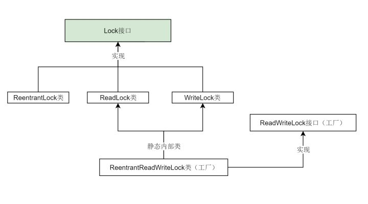
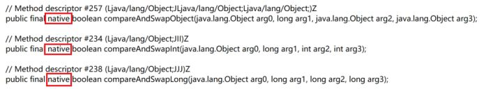
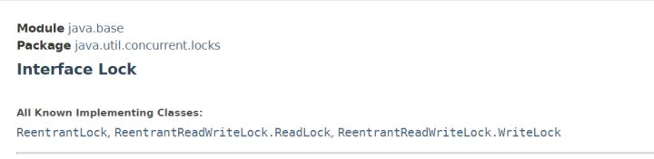
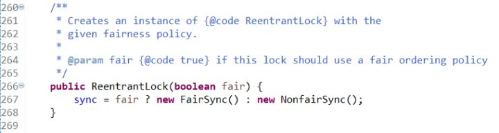
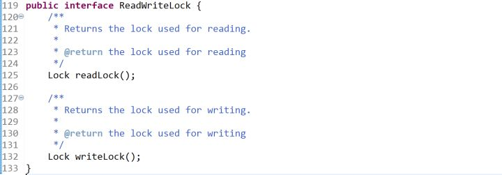
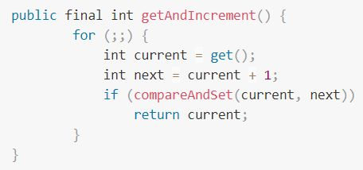

摘自：`https://zhuanlan.zhihu.com/p/71156910`

# 〇、synchronized与Lock
Java中有两种加锁的方式：一种是用synchronized关键字，另一种是用Lock接口的实现类。

形象地说，synchronized关键字是自动档，可以满足一切日常驾驶需求。但是如果你想要玩漂移或者各种骚操作，就需要手动档了——各种Lock的实现类。

所以如果你只是想要简单的加个锁，对性能也没什么特别的要求，用synchronized关键字就足够了。自Java 5之后，才在java.util.concurrent.locks包下有了另外一种方式来实现锁，那就是Lock。也就是说，synchronized是Java语言内置的关键字，而Lock是一个接口，这个接口的实现类在代码层面实现了锁的功能，具体细节不在本文展开，有兴趣可以研究下AbstractQueuedSynchronizer类。




其实只需要关注三个类就可以了：ReentrantLock类、ReadLock类、WriteLock类。
ReentrantLock、ReadLock、WriteLock 是Lock接口最重要的三个实现类。对应了“可重入锁”、“读锁”和“写锁”，后面会讲它们的用途。

ReadWriteLock其实是一个工厂接口，而ReentrantReadWriteLock是ReadWriteLock的实现类，它包含两个静态内部类ReadLock和WriteLock。这两个静态内部类又分别实现了Lock接口。

我们停止深究源码，仅从使用的角度看，Lock与synchronized的区别是什么？在接下来的几个小节中，我将梳理各种锁分类的概念，以及synchronized关键字、各种Lock实现类之间的区别与联系。

# 一、悲观锁与乐观锁
锁的一种宏观分类方式是悲观锁和乐观锁。悲观锁与乐观锁并不是特指某个锁（Java中没有哪个Lock实现类就叫PessimisticLock或OptimisticLock），而是在并发情况下的两种不同策略。

悲观锁（Pessimistic Lock）, 就是很悲观，每次去拿数据的时候都认为别人会修改。所以每次在拿数据的时候都会上锁。这样别人想拿数据就被挡住，直到悲观锁被释放。

乐观锁（Optimistic Lock）, 就是很乐观，每次去拿数据的时候都认为别人不会修改。所以不会上锁，不会上锁！但是如果想要更新数据，则会在更新前检查在读取至更新这段时间别人有没有修改过这个数据。如果修改过，则重新读取，再次尝试更新，循环上述步骤直到更新成功（当然也允许更新失败的线程放弃操作）。

悲观锁阻塞事务，乐观锁回滚重试，它们各有优缺点，不要认为一种一定好于另一种。像乐观锁适用于写比较少的情况下，即冲突真的很少发生的时候，这样可以省去锁的开销，加大了系统的整个吞吐量。但如果经常产生冲突，上层应用会不断的进行重试，这样反倒是降低了性能，所以这种情况下用悲观锁就比较合适。

# 二、乐观锁的基础——CAS
说到乐观锁，就必须提到一个概念：CAS

什么是CAS呢？Compare-and-Swap，即比较并替换，也有叫做Compare-and-Set的，比较并设置。

1、比较：读取到了一个值A，在将其更新为B之前，检查原值是否仍为A（未被其他线程改动）。

2、设置：如果是，将A更新为B，结束。[1]如果不是，则什么都不做。

上面的两步操作是原子性的，可以简单地理解为瞬间完成，在CPU看来就是一步操作。

有了CAS，就可以实现一个乐观锁：

```java
data = 123; // 共享数据

/* 更新数据的线程会进行如下操作 */
flag = true;
while (flag) {
    oldValue = data; // 保存原始数据
    newValue = doSomething(oldValue); 

    // 下面的部分为CAS操作，尝试更新data的值
    if (data == oldValue) { // 比较
        data = newValue; // 设置
        flag = false; // 结束
    } else {
	// 啥也不干，循环重试
    }
}
/* 
   很明显，这样的代码根本不是原子性的，
   因为真正的CAS利用了CPU指令，
   这里只是为了展示执行流程，本意是一样的。
*/
```

这是一个简单直观的乐观锁实现，它允许多个线程同时读取（因为根本没有加锁操作），但是只有一个线程可以成功更新数据，并导致其他要更新数据的线程回滚重试。 CAS利用CPU指令，从硬件层面保证了操作的原子性，以达到类似于锁的效果。



Java中真正的CAS操作调用的native方法
因为整个过程中并没有“加锁”和“解锁”操作，因此乐观锁策略也被称为无锁编程。换句话说，乐观锁其实不是“锁”，它仅仅是一个循环重试CAS的算法而已！


## CAS的例子：非阻塞堆栈

摘自：`https://www.cnblogs.com/Mainz/p/3546347.html`

下面是比非阻塞自增稍微复杂一点的CAS的例子：非阻塞堆栈/`ConcurrentStack` 。`ConcurrentStack` 中的 `push()` 和 `pop()` 操作在结构上与`NonblockingCounter` 上相似，只是做的工作有些冒险，希望在 “提交” 工作的时候，底层假设没有失效。`push()` 方法观察当前最顶的节点，构建一个新节点放在堆栈上，然后，如果最顶端的节点在初始观察之后没有变化，那么就安装新节点。如果 CAS 失败，意味着另一个线程已经修改了堆栈，那么过程就会重新开始。

```java
`public` `class` `ConcurrentStack<E> {``    ``AtomicReference<Node<E>> head = ``new` `AtomicReference<Node<E>>();``    ``public` `void` `push(E item) {``        ``Node<E> newHead = ``new` `Node<E>(item);``        ``Node<E> oldHead;``        ``do` `{``            ``oldHead = head.get();``            ``newHead.next = oldHead;``        ``} ``while` `(!head.compareAndSet(oldHead, newHead));``    ``}``    ``public` `E pop() {``        ``Node<E> oldHead;``        ``Node<E> newHead;``        ``do` `{``            ``oldHead = head.get();``            ``if` `(oldHead == ``null``) ``                ``return` `null``;``            ``newHead = oldHead.next;``        ``} ``while` `(!head.compareAndSet(oldHead,newHead));``        ``return` `oldHead.item;``    ``}``    ``static` `class` `Node<E> {``        ``final` `E item;``        ``Node<E> next;``        ``public` `Node(E item) { ``this``.item = item; }``    ``}``}`
```

在轻度到中度的争用情况下，非阻塞算法的性能会超越阻塞算法，因为 CAS 的多数时间都在第一次尝试时就成功，而发生争用时的开销也不涉及线程挂起和上下文切换，只多了几个循环迭代。没有争用的 CAS 要比没有争用的锁便宜得多（这句话肯定是真的，因为没有争用的锁涉及 CAS 加上额外的处理），而争用的 CAS 比争用的锁获取涉及更短的延迟。

在高度争用的情况下（即有多个线程不断争用一个内存位置的时候），基于锁的算法开始提供比非阻塞算法更好的吞吐率，因为当线程阻塞时，它就会停止争用，耐心地等候轮到自己，从而避免了进一步争用。但是，这么高的争用程度并不常见，因为多数时候，线程会把线程本地的计算与争用共享数据的操作分开，从而给其他线程使用共享数据的机会。

## CAS的例子：非阻塞链表

以上的示例（自增计数器和堆栈）都是非常简单的非阻塞算法，一旦掌握了在循环中使用 CAS，就可以容易地模仿它们。对于更复杂的数据结构，非阻塞算法要比这些简单示例复杂得多，因为修改链表、树或哈希表可能涉及对多个指针的更新。CAS 支持对单一指针的原子性条件更新，但是不支持两个以上的指针。所以，要构建一个非阻塞的链表、树或哈希表，需要找到一种方式，可以用 CAS 更新多个指针，同时不会让数据结构处于不一致的状态。

在链表的尾部插入元素，通常涉及对两个指针的更新：“尾” 指针总是指向列表中的最后一个元素，“下一个” 指针从过去的最后一个元素指向新插入的元素。因为需要更新两个指针，所以需要两个 CAS。在独立的 CAS 中更新两个指针带来了两个需要考虑的潜在问题：如果第一个 CAS 成功，而第二个 CAS 失败，会发生什么？如果其他线程在第一个和第二个 CAS 之间企图访问链表，会发生什么？

对于非复杂数据结构，构建非阻塞算法的 “技巧” 是确保数据结构总处于一致的状态（甚至包括在线程开始修改数据结构和它完成修改之间），还要确保其他线程不仅能够判断出第一个线程已经完成了更新还是处在更新的中途，还能够判断出如果第一个线程走向 AWOL，完成更新还需要什么操作。如果线程发现了处在更新中途的数据结构，它就可以 “帮助” 正在执行更新的线程完成更新，然后再进行自己的操作。当第一个线程回来试图完成自己的更新时，会发现不再需要了，返回即可，因为 CAS 会检测到帮助线程的干预（在这种情况下，是建设性的干预）。

这种 “帮助邻居” 的要求，对于让数据结构免受单个线程失败的影响，是必需的。如果线程发现数据结构正处在被其他线程更新的中途，然后就等候其他线程完成更新，那么如果其他线程在操作中途失败，这个线程就可能永远等候下去。即使不出现故障，这种方式也会提供糟糕的性能，因为新到达的线程必须放弃处理器，导致上下文切换，或者等到自己的时间片过期（而这更糟）。

```java
`public` `class` `LinkedQueue <E> {``    ``private` `static` `class` `Node <E> {``        ``final` `E item;``        ``final` `AtomicReference<Node<E>> next;``        ``Node(E item, Node<E> next) {``            ``this``.item = item;``            ``this``.next = ``new` `AtomicReference<Node<E>>(next);``        ``}``    ``}``    ``private` `AtomicReference<Node<E>> head``        ``= ``new` `AtomicReference<Node<E>>(``new` `Node<E>(``null``, ``null``));``    ``private` `AtomicReference<Node<E>> tail = head;``    ``public` `boolean` `put(E item) {``        ``Node<E> newNode = ``new` `Node<E>(item, ``null``);``        ``while` `(``true``) {``            ``Node<E> curTail = tail.get();``            ``Node<E> residue = curTail.next.get();``            ``if` `(curTail == tail.get()) {``                ``if` `(residue == ``null``) ``/* A */` `{``                    ``if` `(curTail.next.compareAndSet(``null``, newNode)) ``/* C */` `{``                        ``tail.compareAndSet(curTail, newNode) ``/* D */` `;``                        ``return` `true``;``                    ``}``                ``} ``else` `{``                    ``tail.compareAndSet(curTail, residue) ``/* B */``;``                ``}``            ``}``        ``}``    ``}``}`
```


# 三、自旋锁
有一种锁叫自旋锁。所谓自旋，说白了就是一个 while(true) 无限循环。

刚刚的乐观锁就有类似的无限循环操作，那么它是自旋锁吗？不是。尽管自旋与 while(true) 的操作是一样的，但还是应该将这两个术语分开。“自旋”这两个字，特指自旋锁的自旋。

然而在JDK中并没有自旋锁（SpinLock）这个类，那什么才是自旋锁呢？读完下个小节就知道了。

# 四、锁升级

synchronized锁升级：偏向锁 → 轻量级锁 → 重量级锁

前面提到，synchronized关键字就像是汽车的自动档，现在详细讲这个过程。一脚油门踩下去，synchronized会从无锁升级为偏向锁，再升级为轻量级锁，最后升级为重量级锁，就像自动换挡一样。那么自旋锁在哪里呢？这里的轻量级锁就是一种自旋锁。

初次执行到synchronized代码块的时候，锁对象变成偏向锁（通过CAS修改对象头里的锁标志位），字面意思是“偏向于第一个获得它的线程”的锁。执行完同步代码块后，线程并不会主动释放偏向锁。当第二次到达同步代码块时，线程会判断此时持有锁的线程是否就是自己（持有锁的线程ID也在对象头里），如果是则正常往下执行。由于之前没有释放锁，这里也就不需要重新加锁。如果自始至终使用锁的线程只有一个，很明显偏向锁几乎没有额外开销，性能极高。

一旦有第二个线程加入锁竞争，偏向锁就升级为轻量级锁（自旋锁）。这里要明确一下什么是锁竞争：如果多个线程轮流获取一个锁，但是每次获取锁的时候都很顺利，没有发生阻塞，那么就不存在锁竞争。只有当某线程尝试获取锁的时候，发现该锁已经被占用，只能等待其释放，这才发生了锁竞争。

在轻量级锁状态下继续锁竞争，没有抢到锁的线程将自旋，即不停地循环判断锁是否能够被成功获取。获取锁的操作，其实就是通过CAS修改对象头里的锁标志位。先比较当前锁标志位是否为“释放”，如果是则将其设置为“锁定”，比较并设置是原子性发生的。这就算抢到锁了，然后线程将当前锁的持有者信息修改为自己。

长时间的自旋操作是非常消耗资源的，一个线程持有锁，其他线程就只能在原地空耗CPU，执行不了任何有效的任务，这种现象叫做忙等（busy-waiting）。如果多个线程用一个锁，但是没有发生锁竞争，或者发生了很轻微的锁竞争，那么synchronized就用轻量级锁，允许短时间的忙等现象。这是一种折衷的想法，短时间的忙等，换取线程在用户态和内核态之间切换的开销。

显然，此忙等是有限度的（有个计数器记录自旋次数，默认允许循环10次，可以通过虚拟机参数更改）。如果锁竞争情况严重，某个达到最大自旋次数的线程，会将轻量级锁升级为重量级锁（依然是CAS修改锁标志位，但不修改持有锁的线程ID）。当后续线程尝试获取锁时，发现被占用的锁是重量级锁，则直接将自己挂起（而不是忙等），等待将来被唤醒。在JDK1.6之前，synchronized直接加重量级锁，很明显现在得到了很好的优化。

一个锁只能按照 偏向锁、轻量级锁、重量级锁的顺序逐渐升级（也有叫锁膨胀的），不允许降级。

感谢评论区酷帅俊靓美的问题：

```tex
偏向锁的一个特性是，持有锁的线程在执行完同步代码块时不会释放锁。那么当第二个线程执行到这个synchronized代码块时是否一定会发生锁竞争然后升级为轻量级锁呢？
线程A第一次执行完同步代码块后，当线程B尝试获取锁的时候，发现是偏向锁，会判断线程A是否仍然存活。如果线程A仍然存活，将线程A暂停，此时偏向锁升级为轻量级锁，之后线程A继续执行，线程B自旋。但是如果判断结果是线程A不存在了，则线程B持有此偏向锁，锁不升级。
五、可重入锁（递归锁）
可重入锁的字面意思是“可以重新进入的锁”，即允许同一个线程多次获取同一把锁。比如一个递归函数里有加锁操作，递归过程中这个锁会阻塞自己吗？如果不会，那么这个锁就是可重入锁（因为这个原因可重入锁也叫做递归锁）。
```

Java里只要以Reentrant开头命名的锁都是可重入锁，而且JDK提供的所有现成的Lock实现类，包括synchronized关键字锁都是可重入的。如果你需要不可重入锁，只能自己去实现了。网上不可重入锁的实现真的很多，就不在这里贴代码了。99%的业务场景用可重入锁就可以了，剩下的1%是什么呢？我也不知道，谁可以在评论里告诉我？



JDK提供的Lock的实现类都是可重入的

# 六、公平锁、非公平锁
如果多个线程申请一把公平锁，那么当锁释放的时候，先申请的先得到，非常公平。显然如果是非公平锁，后申请的线程可能先获取到锁，是随机或者按照其他优先级排序的。

对ReentrantLock类而言，通过构造函数传参可以指定该锁是否是公平锁，默认是非公平锁。一般情况下，非公平锁的吞吐量比公平锁大，如果没有特殊要求，优先使用非公平锁。



ReentrantLock构造器可以指定为公平或非公平
对于synchronized而言，它也是一种非公平锁，但是并没有任何办法使其变成公平锁。

# 七、可中断锁
可中断锁，字面意思是“可以响应中断的锁”。

这里的关键是理解什么是中断。Java并没有提供任何直接中断某线程的方法，只提供了中断机制。何谓“中断机制”？线程A向线程B发出“请你停止运行”的请求（线程B也可以自己给自己发送此请求），但线程B并不会立刻停止运行，而是自行选择合适的时机以自己的方式响应中断，也可以直接忽略此中断。也就是说，Java的中断不能直接终止线程，而是需要被中断的线程自己决定怎么处理。这好比是父母叮嘱在外的子女要注意身体，但子女是否注意身体，怎么注意身体则完全取决于自己。

回到锁的话题上来，如果线程A持有锁，线程B等待获取该锁。由于线程A持有锁的时间过长，线程B不想继续等待了，我们可以让线程B中断自己或者在别的线程里中断它，这种就是可中断锁。

在Java中，synchronized就是不可中断锁，而Lock的实现类都是可中断锁，可以简单看下Lock接口。

```java
/* Lock接口 */
public interface Lock {

    void lock(); // 拿不到锁就一直等，拿到马上返回。

    void lockInterruptibly() throws InterruptedException; // 拿不到锁就一直等，如果等待时收到中断请求，则需要处理InterruptedException。

    boolean tryLock(); // 无论拿不拿得到锁，都马上返回。拿到返回true，拿不到返回false。

    boolean tryLock(long time, TimeUnit unit) throws InterruptedException; // 同上，可以自定义等待的时间。

    void unlock();

    Condition newCondition();
}
```

八、读写锁、共享锁、互斥锁
读写锁其实是一对锁，一个读锁（共享锁）和一个写锁（互斥锁、排他锁）。

看下Java里的ReadWriteLock接口，它只规定了两个方法，一个返回读锁，一个返回写锁。



记得之前的乐观锁策略吗？所有线程随时都可以读，仅在写之前判断值有没有被更改。

读写锁其实做的事情是一样的，但是策略稍有不同。很多情况下，线程知道自己读取数据后，是否是为了更新它。那么何不在加锁的时候直接明确这一点呢？如果我读取值是为了更新它（SQL的for update就是这个意思），那么加锁的时候就直接加写锁，我持有写锁的时候别的线程无论读还是写都需要等待；如果我读取数据仅为了前端展示，那么加锁时就明确地加一个读锁，其他线程如果也要加读锁，不需要等待，可以直接获取（读锁计数器+1）。

虽然读写锁感觉与乐观锁有点像，但是读写锁是悲观锁策略。因为读写锁并没有在更新前判断值有没有被修改过，而是在加锁前决定应该用读锁还是写锁。乐观锁特指无锁编程，如果仍有疑惑可以再回到第一、二小节，看一下什么是“乐观锁”。

JDK提供的唯一一个ReadWriteLock接口实现类是ReentrantReadWriteLock。看名字就知道，它不仅提供了读写锁，而是都是可重入锁。 除了两个接口方法以外，ReentrantReadWriteLock还提供了一些便于外界监控其内部工作状态的方法，这里就不一一展开。

# 九、回到悲观锁和乐观锁
这篇文章经历过一次修改，我之前认为偏向锁和轻量级锁是乐观锁，重量级锁和Lock实现类为悲观锁，网上很多资料对这些概念的表述也很模糊，各执一词。
先抛出我的结论：

我们在Java里使用的各种锁，几乎全都是悲观锁。synchronized从偏向锁、轻量级锁到重量级锁，全是悲观锁。JDK提供的Lock实现类全是悲观锁。其实只要有“锁对象”出现，那么就一定是悲观锁。因为乐观锁不是锁，而是一个在循环里尝试CAS的算法。

那JDK并发包里到底有没有乐观锁呢？有。java.util.concurrent.atomic包里面的原子类都是利用乐观锁实现的。



原子类AtomicInteger的自增方法为乐观锁策略
为什么网上有些资料认为偏向锁、轻量级锁是乐观锁？理由是它们底层用到了CAS？或者是把“乐观/悲观”与“轻量/重量”搞混了？其实，线程在抢占这些锁的时候，确实是循环+CAS的操作，感觉好像是乐观锁。但问题的关键是，我们说一个锁是悲观锁还是乐观锁，总是应该站在应用层，看它们是如何锁住应用数据的，而不是站在底层看抢占锁的过程。如果一个线程尝试获取锁时，发现已经被占用，它是否继续读取数据，等后续要更新时再决定要不要重试？对于偏向锁、轻量级锁来说，显然答案是否定的。无论是挂起还是忙等，对应用数据的读取操作都被“挡住”了。从这个角度看，它们确实是悲观锁。


