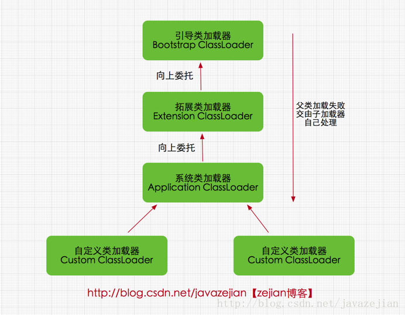
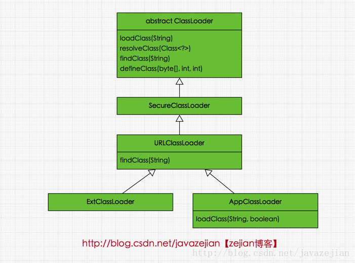
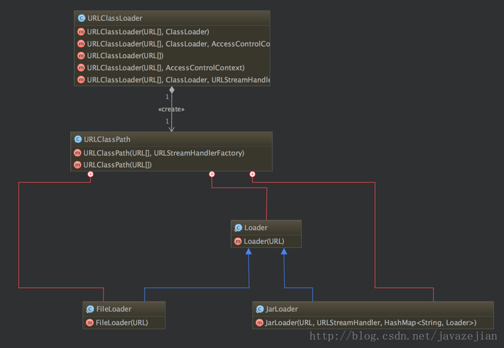
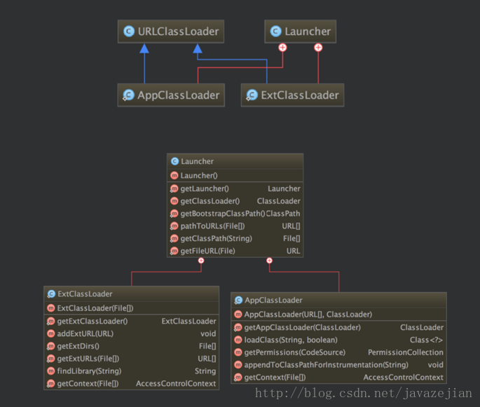
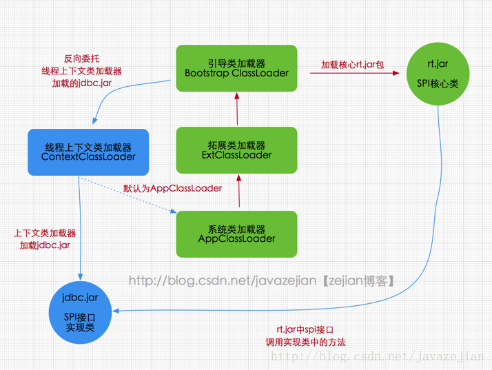
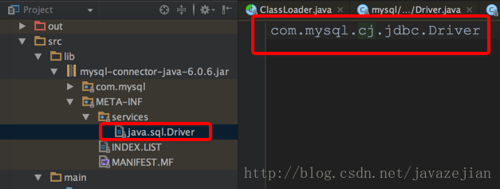

摘自：`https://blog.csdn.net/javazejian/article/details/73413292`

# 类加载的机制的层次结构

每个编写的`”.java”`拓展名类文件都存储着需要执行的程序逻辑，这些`”.java”`文件经过`Java`编译器编译成拓展名为`”.class”`的文件，`”.class”`文件中保存着`Java`代码经转换后的虚拟机指令，当需要使用某个类时，虚拟机将会加载它的`”.class”`文件，并创建对应的`class`对象，将`class`文件加载到虚拟机的内存，这个过程称为类加载，这里我们需要了解一下类加载的过程，如下：


加载：类加载过程的一个阶段：通过一个类的完全限定查找此类字节码文件，并利用字节码文件创建一个`Class`对象

验证：目的在于确保`Class`文件的字节流中包含信息符合当前虚拟机要求，不会危害虚拟机自身安全。主要包括四种验证，文件格式验证，元数据验证，字节码验证，符号引用验证。

准备：为类变量(即`static`修饰的字段变量)分配内存并且设置该类变量的初始值即0(如`static int i=5;`这里只将`i`初始化为0，至于5的值将在初始化时赋值)，这里不包含用`final`修饰的`static`，因为`final`在编译的时候就会分配了，注意这里不会为实例变量分配初始化，类变量会分配在方法区中，而实例变量是会随着对象一起分配到`Java`堆中。

解析：主要将常量池中的符号引用替换为直接引用的过程。符号引用就是一组符号来描述目标，可以是任何字面量，而直接引用就是直接指向目标的指针、相对偏移量或一个间接定位到目标的句柄。有类或接口的解析，字段解析，类方法解析，接口方法解析(这里涉及到字节码变量的引用，如需更详细了解，可参考《深入Java虚拟机》)。

初始化：类加载最后阶段，若该类具有超类，则对其进行初始化，执行静态初始化器和静态初始化成员变量(如前面只初始化了默认值的`static`变量将会在这个阶段赋值，成员变量也将被初始化)。

这便是类加载的5个过程，而类加载器的任务是根据一个类的全限定名来读取此类的二进制字节流到`JVM`中，然后转换为一个与目标类对应的`java.lang.Class`对象实例，在虚拟机提供了3种类加载器，引导（`Bootstrap`）类加载器、扩展（`Extension`）类加载器、系统（`System`）类加载器（也称应用类加载器），下面分别介绍


## 启动（`Bootstrap`）类加载器

**启动类加载器主要加载的是`JVM`自身需要的类，这个类加载使用`C++`语言实现的，是虚拟机自身的一部分**，它负责将 `<JAVA_HOME>/lib`路径下的核心类库或`-Xbootclasspath`参数指定的路径下的`jar`包加载到内存中，注意由于虚拟机是按照文件名识别加载`jar`包的，如`rt.jar`，如果文件名不被虚拟机识别，即使把`jar`包丢到`lib`目录下也是没有作用的(出于安全考虑，`Bootstrap`启动类加载器只加载包名为`java、javax、sun`等开头的类)。

## 扩展（`Extension`）类加载器

扩展类加载器是指`Sun`公司实现的`sun.misc.Launcher$ExtClassLoader`类，由`Java`语言实现的，是`Launcher`的静态内部类，它负责加载`<JAVA_HOME>/lib/ext`目录下或者由系统变量`-Djava.ext.dir`指定位路径中的类库，开发者可以直接使用标准扩展类加载器。

```java
//ExtClassLoader类中获取路径的代码
private static File[] getExtDirs() {
     //加载<JAVA_HOME>/lib/ext目录中的类库
     String s = System.getProperty("java.ext.dirs");
     File[] dirs;
     if (s != null) {
         StringTokenizer st =
             new StringTokenizer(s, File.pathSeparator);
         int count = st.countTokens();
         dirs = new File[count];
         for (int i = 0; i < count; i++) {
             dirs[i] = new File(st.nextToken());
         }
     } else {
         dirs = new File[0];
     }
     return dirs;
 }
```

## 系统（`System`）类加载器

也称应用程序加载器是指` Sun`公司实现的`sun.misc.Launcher$AppClassLoader`。它负责加载系统类路径`java -classpath`或`-D java.class.path `指定路径下的类库，也就是我们经常用到的`classpath`路径，开发者可以直接使用系统类加载器，一般情况下该类加载是程序中默认的类加载器，通过`ClassLoader#getSystemClassLoader()`方法可以获取到该类加载器。 

在`Java`的日常应用程序开发中，类的加载几乎是由上述3种类加载器相互配合执行的，在必要时，我们还可以自定义类加载器，需要注意的是，`Java`虚拟机对`class`文件采用的是按需加载的方式，也就是说当需要使用该类时才会将它的`class`文件加载到内存生成`class`对象，而且加载某个类的`class`文件时，`Java`虚拟机采用的是双亲委派模式即把请求交由父类处理，它一种任务委派模式，下面我们进一步了解它。


# 理解双亲委派模式

双亲委派模式工作原理
双亲委派模式要求除了顶层的启动类加载器外，其余的类加载器都应当有自己的父类加载器，请注意双亲委派模式中的父子关系并非通常所说的类继承关系，而是采用组合关系来复用父类加载器的相关代码，类加载器间的关系如下：



双亲委派模式工作原理的是，如果一个类加载器收到了类加载请求，它并不会自己先去加载，而是把这个请求委托给父类的加载器去执行，如果父类加载器还存在其父类加载器，则进一步向上委托，依次递归，请求最终将到达顶层的启动类加载器，如果父类加载器可以完成类加载任务，就成功返回，倘若父类加载器无法完成此加载任务，子加载器才会尝试自己去加载，这就是双亲委派模式，即每个儿子都很懒，每次有活就丢给父亲去干，直到父亲说这件事我也干不了时，儿子自己想办法去完成，这不就是传说中的实力坑爹啊？那么采用这种模式有啥用呢?

# 双亲委派模式优势

采用双亲委派模式的是好处是`Java`类随着它的类加载器一起具备了一种带有优先级的层次关系，通过这种层级关可以避免类的重复加载，当父亲已经加载了该类时，就没有必要子`ClassLoader`再加载一次。其次是考虑到安全因素，`java`核心`api`中定义类型不会被随意替换，假设通过网络传递一个名为`java.lang.Integer`的类，通过双亲委托模式传递到启动类加载器，而启动类加载器在核心`Java API`发现这个名字的类，发现该类已被加载，并不会重新加载网络传递的过来的`java.lang.Integer`，而直接返回已加载过的`Integer.class`，这样便可以防止核心`API`库被随意篡改。可能你会想，如果我们在`classpath`路径下自定义一个名为`java.lang.SingleInterge`类(该类是胡编的)呢？该类并不存在`java.lang`中，经过双亲委托模式，传递到启动类加载器中，由于父类加载器路径下并没有该类，所以不会加载，将反向委托给子类加载器加载，最终会通过系统类加载器加载该类。但是这样做是不允许，因为`java.lang`是核心`API`包，需要访问权限，强制加载将会报出如下异常

```java
java.lang.SecurityException: Prohibited package name: java.lang
```

所以无论如何都无法加载成功的。下面我们从代码层面了解几个`Java`中定义的类加载器及其双亲委派模式的实现，它们类图关系如下



从图可以看出顶层的类加载器是`ClassLoader`类，它是一个抽象类，其后所有的类加载器都继承自`ClassLoader`（不包括启动类加载器），这里我们主要介绍`ClassLoader`中几个比较重要的方法。

`loadClass(String)`

该方法加载指定名称（包括包名）的二进制类型，该方法在`JDK1.2`之后不再建议用户重写但用户可以直接调用该方法，`loadClass()`方法是`ClassLoader`类自己实现的，该方法中的逻辑就是双亲委派模式的实现，其源码如下，`loadClass(String name, boolean resolve)`是一个重载方法，`resolve`参数代表是否生成`class`对象的同时进行解析相关操作。

```java
protected Class<?> loadClass(String name, boolean resolve)
      throws ClassNotFoundException
  {
      synchronized (getClassLoadingLock(name)) {
          // 先从缓存查找该class对象，找到就不用重新加载
          Class<?> c = findLoadedClass(name);
          if (c == null) {
              long t0 = System.nanoTime();
              try {
                  if (parent != null) {
                      //如果找不到，则委托给父类加载器去加载
                      c = parent.loadClass(name, false);
                  } else {
                  //如果没有父类，则委托给启动加载器去加载
                      c = findBootstrapClassOrNull(name);
                  }
              } catch (ClassNotFoundException e) {
                  // ClassNotFoundException thrown if class not found
                  // from the non-null parent class loader
              }

              if (c == null) {
                  // If still not found, then invoke findClass in order
                  // 如果都没有找到，则通过自定义实现的findClass去查找并加载
                  c = findClass(name);

                  // this is the defining class loader; record the stats
                  sun.misc.PerfCounter.getParentDelegationTime().addTime(t1 - t0);
                  sun.misc.PerfCounter.getFindClassTime().addElapsedTimeFrom(t1);
                  sun.misc.PerfCounter.getFindClasses().increment();
              }
          }
          if (resolve) {//是否需要在加载时进行解析
              resolveClass(c);
          }
          return c;
      }
  }
```

正如`loadClass`方法所展示的，当类加载请求到来时，先从缓存中查找该类对象，如果存在直接返回，如果不存在则交给该类加载去的父加载器去加载，倘若没有父加载则交给顶级启动类加载器去加载，最后倘若仍没有找到，则使用`findClass()`方法去加载（关于`findClass()`稍后会进一步介绍）。从`loadClass`实现也可以知道如果不想重新定义加载类的规则，也没有复杂的逻辑，只想在运行时加载自己指定的类，那么我们可以直接使用`this.getClass().getClassLoder.loadClass("className")`，这样就可以直接调用`ClassLoader`的`loadClass`方法获取到`class`对象。

`findClass(String) `
在`JDK1.2`之前，在自定义类加载时，总会去继承`ClassLoader`类并重写`loadClass`方法，从而实现自定义的类加载类，但是在`JDK1.2`之后已不再建议用户去覆盖`loadClass()`方法，而是建议把自定义的类加载逻辑写在`findClass()`方法中，从前面的分析可知，`findClass()`方法是在`loadClass()`方法中被调用的，当`loadClass()`方法中父加载器加载失败后，则会调用自己的`findClass()`方法来完成类加载，这样就可以保证自定义的类加载器也符合双亲委托模式。需要注意的是`ClassLoader`类中并没有实现`findClass()`方法的具体代码逻辑，取而代之的是抛出`ClassNotFoundException`异常，同时应该知道的是`findClass`方法通常是和`defineClass`方法一起使用的(稍后会分析)，`ClassLoader`类中`findClass()`方法源码如下：

```java
//直接抛出异常
protected Class<?> findClass(String name) throws ClassNotFoundException {
        throw new ClassNotFoundException(name);
}
```

`defineClass(byte[] b, int off, int len) `
`defineClass()`方法是用来将`byte`字节流解析成`JVM`能够识别的`Class`对象(`ClassLoader`中已实现该方法逻辑)，通过这个方法不仅能够通过`class`文件实例化`class`对象，也可以通过其他方式实例化`class`对象，如通过网络接收一个类的字节码，然后转换为`byte`字节流创建对应的`Class`对象，`defineClass()`方法通常与`findClass()`方法一起使用，一般情况下，在自定义类加载器时，会直接覆盖`ClassLoader`的`findClass()`方法并编写加载规则，取得要加载类的字节码后转换成流，然后调用`defineClass()`方法生成类的`Class`对象，简单例子如下：

```java
protected Class<?> findClass(String name) throws ClassNotFoundException {
      // 获取类的字节数组
      byte[] classData = getClassData(name);  
      if (classData == null) {
          throw new ClassNotFoundException();
      } else {
          //使用defineClass生成class对象
          return defineClass(name, classData, 0, classData.length);
      }
  }
```

需要注意的是，如果直接调用`defineClass()`方法生成类的`Class`对象，这个类的`Class`对象并没有解析(也可以理解为链接阶段，毕竟解析是链接的最后一步)，其解析操作需要等待初始化阶段进行。

`resolveClass(Class≺?≻ c) `
使用该方法可以使用类的`Class`对象创建完成也同时被解析。前面我们说链接阶段主要是对字节码进行验证，为类变量分配内存并设置初始值同时将字节码文件中的符号引用转换为直接引用。

上述4个方法是`ClassLoader`类中的比较重要的方法，也是我们可能会经常用到的方法。接看`SercureClassLoader`扩展了` ClassLoader`，新增了几个与使用相关的代码源(对代码源的位置及其证书的验证)和权限定义类验证(主要指对`class`源码的访问权限)的方法，一般我们不会直接跟这个类打交道，更多是与它的子类`URLClassLoader`有所关联，前面说过，`ClassLoader`是一个抽象类，很多方法是空的没有实现，比如 `findClass()、findResource()`等。而`URLClassLoader`这个实现类为这些方法提供了具体的实现，并新增了`URLClassPath`类协助取得`Class`字节码流等功能，在编写自定义类加载器时，如果没有太过于复杂的需求，可以直接继承`URLClassLoader`类，这样就可以避免自己去编写`findClass()`方法及其获取字节码流的方式，使自定义类加载器编写更加简洁，下面是`URLClassLoader`的类图(利用`IDEA`生成的类图)



从类图结构看出`URLClassLoader`中存在一个`URLClassPath`类，通过这个类就可以找到要加载的字节码流，也就是说`URLClassPath`类负责找到要加载的字节码，再读取成字节流，最后通过`defineClass()`方法创建类的`Class`对象。从`URLClassLoader`类的结构图可以看出其构造方法都有一个必须传递的参数`URL[]`，该参数的元素是代表字节码文件的路径,换句话说在创建`URLClassLoader`对象时必须要指定这个类加载器的到那个目录下找`class`文件。同时也应该注意`URL[]`也是`URLClassPath`类的必传参数，在创建`URLClassPath`对象时，会根据传递过来的`URL`数组中的路径判断是文件还是`jar`包，然后根据不同的路径创建`FileLoader`或者`JarLoader`或默认`Loader`类去加载相应路径下的`class`文件，而当`JVM`调用`findClass()`方法时，就由这3个加载器中的一个将`class`文件的字节码流加载到内存中，最后利用字节码流创建类的`class`对象。请记住，如果我们在定义类加载器时选择继承`ClassLoader`类而非`URLClassLoader`，必须手动编写`findclass()`方法的加载逻辑以及获取字节码流的逻辑。了解完`URLClassLoader`后接着看看剩余的两个类加载器，即拓展类加载器`ExtClassLoader`和系统类加载器`AppClassLoader`，这两个类都继承自`URLClassLoader`，是`sun.misc.Launcher`的静态内部类。`sun.misc.Launcher`主要被系统用于启动主应用程序，`ExtClassLoader`和`AppClassLoader`都是由`sun.misc.Launcher`创建的，其类主要类结构如下：



它们间的关系正如前面所阐述的那样，同时我们发现`ExtClassLoader`并没有重写`loadClass()`方法，这足矣说明其遵循双亲委派模式，而`AppClassLoader`重载了`loadCass()`方法，但最终调用的还是父类`loadClass()`方法，因此依然遵守双亲委派模式，重载方法源码如下：

```java
/**
 * Override loadClass 方法，新增包权限检测功能
 */
public Class loadClass(String name, boolean resolve)
    throws ClassNotFoundException
{
    int i = name.lastIndexOf('.');
    if (i != -1) {
        SecurityManager sm = System.getSecurityManager();
        if (sm != null) {
            sm.checkPackageAccess(name.substring(0, i));
        }
    }
    //依然调用父类的方法
    return (super.loadClass(name, resolve));
}

```

其实无论是`ExtClassLoader`还是`AppClassLoader`都继承`URLClassLoader`类，因此它们都遵守双亲委托模型，这点是毋庸置疑的。到此我们对`ClassLoader、URLClassLoader、ExtClassLoader、AppClassLoader`以及`Launcher`类间的关系有了比较清晰的了解，同时对一些主要的方法也有一定的认识，这里并没有对这些类的源码进行详细的分析，毕竟没有那个必要，因为我们主要弄得类与类间的关系和常用的方法同时搞清楚双亲委托模式的实现过程，为编写自定义类加载器做铺垫就足够了。前面出现了很多父类加载器的说法，但每个类加载器的父类到底是谁，一直没有阐明，下面我们就通过代码验证的方式来阐明这答案。

# 类加载器间的关系

我们进一步了解类加载器间的关系(并非指继承关系)，主要可以分为以下4点

启动类加载器，由`C++`实现，没有父类。

拓展类加载器(`ExtClassLoader`)，由`Java`语言实现，父类加载器为`null`

系统类加载器(`AppClassLoader`)，由`Java`语言实现，父类加载器为`ExtClassLoader`

自定义类加载器，父类加载器肯定为`AppClassLoader`。

下面我们通过程序来验证上述阐述的观点

```java
/**
 * Created by zejian on 2017/6/18.
 * Blog : http://blog.csdn.net/javazejian [原文地址,请尊重原创]
 */
//自定义ClassLoader，完整代码稍后分析
class FileClassLoader extends  ClassLoader{
    private String rootDir;

    public FileClassLoader(String rootDir) {
        this.rootDir = rootDir;
    }
    // 编写获取类的字节码并创建class对象的逻辑
    @Override
    protected Class<?> findClass(String name) throws ClassNotFoundException {
       //...省略逻辑代码
    }
    //编写读取字节流的方法
    private byte[] getClassData(String className) {
        // 读取类文件的字节
        //省略代码....
    }
}

public class ClassLoaderTest {
    public static void main(String[] args) throws ClassNotFoundException {
             FileClassLoader loader1 = new FileClassLoader(rootDir);

              System.out.println("自定义类加载器的父加载器: "+loader1.getParent());
              System.out.println("系统默认的AppClassLoader: "+ClassLoader.getSystemClassLoader());
              System.out.println("AppClassLoader的父类加载器: "+ClassLoader.getSystemClassLoader().getParent());
              System.out.println("ExtClassLoader的父类加载器: "+ClassLoader.getSystemClassLoader().getParent().getParent());

            /**
            输出结果:
                自定义类加载器的父加载器: sun.misc.Launcher$AppClassLoader@29453f44
                系统默认的AppClassLoader: sun.misc.Launcher$AppClassLoader@29453f44
                AppClassLoader的父类加载器: sun.misc.Launcher$ExtClassLoader@6f94fa3e
                ExtClassLoader的父类加载器: null
            */

    }
}
```

代码中，我们自定义了一个`FileClassLoader`，这里我们继承了`ClassLoader`而非`URLClassLoader`,因此需要自己编写`findClass()`方法逻辑以及加载字节码的逻辑，关于自定义类加载器我们稍后会分析，这里仅需要知道`FileClassLoader`是自定义加载器即可，接着在`main`方法中，通过`ClassLoader.getSystemClassLoader()`获取到系统默认类加载器，通过获取其父类加载器及其父父类加载器，同时还获取了自定义类加载器的父类加载器,最终输出结果正如我们所预料的，`AppClassLoader`的父类加载器为`ExtClassLoader`，而`ExtClassLoader`没有父类加载器。如果我们实现自己的类加载器，它的父加载器都只会是`AppClassLoader`。这里我们不妨看看`Lancher`的构造器源码

```java
public Launcher() {
    // 首先创建拓展类加载器
    ClassLoader extcl;
    try {
        extcl = ExtClassLoader.getExtClassLoader();
    } catch (IOException e) {
        throw new InternalError(
            "Could not create extension class loader");
    }

    // Now create the class loader to use to launch the application
    try {
        //再创建AppClassLoader并把extcl作为父加载器传递给AppClassLoader
        loader = AppClassLoader.getAppClassLoader(extcl);
    } catch (IOException e) {
        throw new InternalError(
            "Could not create application class loader");
    }

    //设置线程上下文类加载器，稍后分析
    Thread.currentThread().setContextClassLoader(loader);
	//省略其他没必要的代码......
    }
}
```

显然`Lancher`初始化时首先会创建`ExtClassLoader`类加载器，然后再创建`AppClassLoader`并把`ExtClassLoader`传递给它作为父类加载器，这里还把`AppClassLoader`默认设置为线程上下文类加载器，关于线程上下文类加载器稍后会分析。那`ExtClassLoader`类加载器为什么是`null`呢？看下面的源码创建过程就明白，在创建`ExtClassLoader`强制设置了其父加载器为`null`。

```java
//Lancher中创建ExtClassLoader
extcl = ExtClassLoader.getExtClassLoader();

//getExtClassLoader()方法
public static ExtClassLoader getExtClassLoader() throws IOException{

  //........省略其他代码 
  return new ExtClassLoader(dirs);                     
  // .........
}

//构造方法
public ExtClassLoader(File[] dirs) throws IOException {
   //调用父类构造URLClassLoader传递null作为parent
   super(getExtURLs(dirs), null, factory);
}

//URLClassLoader构造
public URLClassLoader(URL[] urls, ClassLoader parent,
                          URLStreamHandlerFactory factory) {}
```

显然`ExtClassLoader`的父类为`null`，而`AppClassLoader`的父加载器为`ExtClassLoader`，**所有自定义的类加载器其父加载器只会是`AppClassLoader`，注意这里所指的父类并不是Java继承关系中的那种父子关系。**

# 类与类加载器

在`JVM`中表示两个`class`对象是否为同一个类对象存在两个必要条件

类的完整类名必须一致，包括包名。
加载这个类的`ClassLoader`(指`ClassLoader`实例对象)必须相同。

也就是说，在`JVM`中，即使这个两个类对象(`class`对象)来源同一个`Class`文件，被同一个虚拟机所加载，但只要加载它们的`ClassLoader`实例对象不同，那么这两个类对象也是不相等的，这是因为不同的`ClassLoader`实例对象都拥有不同的独立的类名称空间，所以加载的`class`对象也会存在不同的类名空间中，但前提是覆写`loadclass`方法，从前面双亲委派模式对`loadClass()`方法的源码分析中可以知，在方法第一步会通过`Class<?> c = findLoadedClass(name);`从缓存查找，类名完整名称相同则不会再次被加载，因此我们必须绕过缓存查询才能重新加载`class`对象。当然也可直接调用`findClass()`方法，这样也避免从缓存查找，如下

```java
String rootDir="/Users/zejian/Downloads/Java8_Action/src/main/java/";
//创建两个不同的自定义类加载器实例
FileClassLoader loader1 = new FileClassLoader(rootDir);
FileClassLoader loader2 = new FileClassLoader(rootDir);
//通过findClass创建类的Class对象
Class<?> object1=loader1.findClass("com.zejian.classloader.DemoObj");
Class<?> object2=loader2.findClass("com.zejian.classloader.DemoObj");

System.out.println("findClass->obj1:"+object1.hashCode());
System.out.println("findClass->obj2:"+object2.hashCode());

/**
  * 直接调用findClass方法输出结果:
  * findClass->obj1:723074861
    findClass->obj2:895328852
    生成不同的实例
  */
```

如果调用父类的`loadClass`方法，结果如下，除非重写`loadClass()`方法去掉缓存查找步骤，不过现在一般都不建议重写`loadClass()`方法。

```java
//直接调用父类的loadClass()方法
Class<?> obj1 =loader1.loadClass("com.zejian.classloader.DemoObj");
Class<?> obj2 =loader2.loadClass("com.zejian.classloader.DemoObj");

//不同实例对象的自定义类加载器
System.out.println("loadClass->obj1:"+obj1.hashCode());
System.out.println("loadClass->obj2:"+obj2.hashCode());
//系统类加载器
System.out.println("Class->obj3:"+DemoObj.class.hashCode());

/**
* 直接调用loadClass方法的输出结果,注意并没有重写loadClass方法
* loadClass->obj1:1872034366
  loadClass->obj2:1872034366
  Class->    obj3:1872034366
  都是同一个实例
*/
```

所以如果不从缓存查询相同完全类名的`class`对象，那么只有`ClassLoader`的实例对象不同，同一字节码文件创建的`class`对象自然也不会相同。

了解`class`文件的显示加载与隐式加载的概念
所谓`class`文件的显示加载与隐式加载的方式是指`JVM`加载`class`文件到内存的方式，显示加载指的是在代码中通过调用`ClassLoader`加载`class`对象，如直接使用`Class.forName(name)`或`this.getClass().getClassLoader().loadClass()`加载`class`对象。而隐式加载则是不直接在代码中调用`ClassLoader`的方法加载`class`对象，而是通过虚拟机自动加载到内存中，如在加载某个类的`class`文件时，该类的`class`文件中引用了另外一个类的对象，此时额外引用的类将通过`JVM`自动加载到内存中。在日常开发以上两种方式一般会混合使用，这里我们知道有这么回事即可。

# 编写自己的类加载器

通过前面的分析可知，实现自定义类加载器需要继承`ClassLoader`或者`URLClassLoader`，继承`ClassLoader`则需要自己重写`findClass()`方法并编写加载逻辑，继承`URLClassLoader`则可以省去编写`findClass()`方法以及`class`文件加载转换成字节码流的代码。那么编写自定义类加载器的意义何在呢？

当`class`文件不在`ClassPath`路径下，默认系统类加载器无法找到该`class`文件，在这种情况下我们需要实现一个自定义的`ClassLoader`来加载特定路径下的`class`文件生成`class`对象。

当一个`class`文件是通过网络传输并且可能会进行相应的加密操作时，需要先对`class`文件进行相应的解密后再加载到`JVM`内存中，这种情况下也需要编写自定义的`ClassLoader`并实现相应的逻辑。

当需要实现热部署功能时(一个`class`文件通过不同的类加载器产生不同`class`对象从而实现热部署功能)，需要实现自定义`ClassLoader`的逻辑。

## 自定义`File`类加载器

这里我们继承`ClassLoader`实现自定义的特定路径下的文件类加载器并加载编译后`DemoObj.class`，源码代码如下

```java
public class DemoObj {
    @Override
    public String toString() {
        return "I am DemoObj";
    }
}

package com.zejian.classloader;
import java.io.*;

/**
 * Created by zejian on 2017/6/21.
 * Blog : http://blog.csdn.net/javazejian [原文地址,请尊重原创]
 */
public class FileClassLoader extends ClassLoader {
    private String rootDir;

    public FileClassLoader(String rootDir) {
        this.rootDir = rootDir;
    }

    /**
     * 编写findClass方法的逻辑
     * @param name
     * @return
     * @throws ClassNotFoundException
     */
    @Override
    protected Class<?> findClass(String name) throws ClassNotFoundException {
        // 获取类的class文件字节数组
        byte[] classData = getClassData(name);
        if (classData == null) {
            throw new ClassNotFoundException();
        } else {
            //直接生成class对象
            return defineClass(name, classData, 0, classData.length);
        }
    }

    /**
     * 编写获取class文件并转换为字节码流的逻辑
     * @param className
     * @return
     */
    private byte[] getClassData(String className) {
        // 读取类文件的字节
        String path = classNameToPath(className);
        try {
            InputStream ins = new FileInputStream(path);
            ByteArrayOutputStream baos = new ByteArrayOutputStream();
            int bufferSize = 4096;
            byte[] buffer = new byte[bufferSize];
            int bytesNumRead = 0;
            // 读取类文件的字节码
            while ((bytesNumRead = ins.read(buffer)) != -1) {
                baos.write(buffer, 0, bytesNumRead);
            }
            return baos.toByteArray();
        } catch (IOException e) {
            e.printStackTrace();
        }
        return null;
    }

    /**
     * 类文件的完全路径
     * @param className
     * @return
     */
    private String classNameToPath(String className) {
        return rootDir + File.separatorChar
                + className.replace('.', File.separatorChar) + ".class";
    }

    public static void main(String[] args) throws ClassNotFoundException {
        String rootDir="/Users/zejian/Downloads/Java8_Action/src/main/java/";
        //创建自定义文件类加载器
        FileClassLoader loader = new FileClassLoader(rootDir);

        try {
            //加载指定的class文件
            Class<?> object1=loader.loadClass("com.zejian.classloader.DemoObj");
            System.out.println(object1.newInstance().toString());

            //输出结果:I am DemoObj
        } catch (Exception e) {
            e.printStackTrace();
        }
    }
}
```

显然我们通过`getClassData()`方法找到`class`文件并转换为字节流，并重写`findClass()`方法，利用`defineClass()`方法创建了类的`class`对象。在`main`方法中调用了`loadClass()`方法加载指定路径下的`class`文件，由于启动类加载器、拓展类加载器以及系统类加载器都无法在其路径下找到该类，因此最终将有自定义类加载器加载，即调用`findClass()`方法进行加载。如果继承`URLClassLoader`实现，那代码就更简洁了，如下：

```java
/**
 * Created by zejian on 2017/6/21.
 * Blog : http://blog.csdn.net/javazejian [原文地址,请尊重原创]
 */
public class FileUrlClassLoader extends URLClassLoader {

    public FileUrlClassLoader(URL[] urls, ClassLoader parent) {
        super(urls, parent);
    }

    public FileUrlClassLoader(URL[] urls) {
        super(urls);
    }

    public FileUrlClassLoader(URL[] urls, ClassLoader parent, URLStreamHandlerFactory factory) {
        super(urls, parent, factory);
    }


    public static void main(String[] args) throws ClassNotFoundException, MalformedURLException {
        String rootDir="/Users/zejian/Downloads/Java8_Action/src/main/java/";
        //创建自定义文件类加载器
        File file = new File(rootDir);
        //File to URI
        URI uri=file.toURI();
        URL[] urls={uri.toURL()};

        FileUrlClassLoader loader = new FileUrlClassLoader(urls);

        try {
            //加载指定的class文件
            Class<?> object1=loader.loadClass("com.zejian.classloader.DemoObj");
            System.out.println(object1.newInstance().toString());

            //输出结果:I am DemoObj
        } catch (Exception e) {
            e.printStackTrace();
        }
    }
}
```

非常简洁除了需要重写构造器外无需编写`findClass()`方法及其`class`文件的字节流转换逻辑。

## 自定义网络类加载器

自定义网络类加载器，主要用于读取通过网络传递的`class`文件（在这里我们省略`class`文件的解密过程），并将其转换成字节流生成对应的`class`对象，如下

```java
/**
 * Created by zejian on 2017/6/21.
 * Blog : http://blog.csdn.net/javazejian [原文地址,请尊重原创]
 */
public class NetClassLoader extends ClassLoader {

    private String url;//class文件的URL

    public NetClassLoader(String url) {
        this.url = url;
    }

    @Override
    protected Class<?> findClass(String name) throws ClassNotFoundException {
        byte[] classData = getClassDataFromNet(name);
        if (classData == null) {
            throw new ClassNotFoundException();
        } else {
            return defineClass(name, classData, 0, classData.length);
        }
    }

    /**
     * 从网络获取class文件
     * @param className
     * @return
     */
    private byte[] getClassDataFromNet(String className) {
        String path = classNameToPath(className);
        try {
            URL url = new URL(path);
            InputStream ins = url.openStream();
            ByteArrayOutputStream baos = new ByteArrayOutputStream();
            int bufferSize = 4096;
            byte[] buffer = new byte[bufferSize];
            int bytesNumRead = 0;
            // 读取类文件的字节
            while ((bytesNumRead = ins.read(buffer)) != -1) {
                baos.write(buffer, 0, bytesNumRead);
            }
            //这里省略解密的过程.......
            return baos.toByteArray();
        } catch (Exception e) {
            e.printStackTrace();
        }
        return null;
    }

    private String classNameToPath(String className) {
        // 得到类文件的URL
        return url + "/" + className.replace('.', '/') + ".class";
    }
}
```

比较简单，主要是在获取字节码流时的区别，从网络直接获取到字节流再转车字节数组然后利用`defineClass`方法创建`class`对象，如果继承`URLClassLoader`类则和前面文件路径的实现是类似的，无需担心路径是`filePath`还是`Url`，因为`URLClassLoader`内的`URLClassPath`对象会根据传递过来的URL数组中的路径判断是文件还是`jar`包，然后根据不同的路径创建`FileLoader`或者`JarLoader`或默认类`Loader`去读取对于的路径或者`url`下的`class`文件。

## 热部署类加载器

所谓的热部署就是利用同一个`class`文件不同的类加载器在内存创建出两个不同的`class`对象(关于这点的原因前面已分析过，即利用不同的类加载实例)，由于`JVM`在加载类之前会检测请求的类是否已加载过(即在`loadClass()`方法中调用`findLoadedClass()`方法)，如果被加载过，则直接从缓存获取，不会重新加载。注意同一个类加载器的实例和同一个`class`文件只能被加载器一次，多次加载将报错，因此我们实现的热部署必须让同一个`class`文件可以根据不同的类加载器重复加载，以实现所谓的热部署。实际上前面的实现的`FileClassLoader`和`FileUrlClassLoader`已具备这个功能，但前提是直接调用`findClass()`方法，而不是调用`loadClass()`方法，**因为`ClassLoader`中`loadClass()`方法体中调用`findLoadedClass()`方法进行了检测是否已被加载**，因此我们直接调用`findClass()`方法就可以绕过这个问题，当然也可以重新`loadClass`方法，但强烈不建议这么干。利用`FileClassLoader`类测试代码如下：

```java
public static void main(String[] args) throws ClassNotFoundException {
    String rootDir="/Users/zejian/Downloads/Java8_Action/src/main/java/";
    //创建自定义文件类加载器
    FileClassLoader loader = new FileClassLoader(rootDir);
    FileClassLoader loader2 = new FileClassLoader(rootDir);

    try {
        //加载指定的class文件,调用loadClass()
        Class<?> object1=loader.loadClass("com.zejian.classloader.DemoObj");
        Class<?> object2=loader2.loadClass("com.zejian.classloader.DemoObj");

        System.out.println("loadClass->obj1:"+object1.hashCode());
        System.out.println("loadClass->obj2:"+object2.hashCode());

        //加载指定的class文件,直接调用findClass(),绕过检测机制，创建不同class对象。
        Class<?> object3=loader.findClass("com.zejian.classloader.DemoObj");
        Class<?> object4=loader2.findClass("com.zejian.classloader.DemoObj");

        System.out.println("loadClass->obj3:"+object3.hashCode());
        System.out.println("loadClass->obj4:"+object4.hashCode());

        /**
         * 输出结果:
         * loadClass->obj1:644117698
           loadClass->obj2:644117698
           findClass->obj3:723074861
           findClass->obj4:895328852
         */

    } catch (Exception e) {
        e.printStackTrace();
    }
}
```

## 双亲委派模型的破坏者-线程上下文类加载器

在`Java`应用中存在着很多服务提供者接口（`Service Provider Interface，SPI`），这些接口允许第三方为它们提供实现，如常见的` SPI `有` JDBC、JNDI`等，这些` SPI` 的接口属于` Java `核心库，一般存在`rt.jar`包中，由`Bootstrap`类加载器加载，而` SPI `的第三方实现代码则是作为`Java`应用所依赖的` jar `包被存放在`classpath`路径下，由于`SPI`接口中的代码经常需要加载具体的第三方实现类并调用其相关方法，但`SPI`的核心接口类是由引导类加载器来加载的，而`Bootstrap`类加载器无法直接加载`SPI`的实现类，同时由于双亲委派模式的存在，`Bootstrap`类加载器也无法反向委托`AppClassLoader`加载器`SPI`的实现类。在这种情况下，我们就需要一种特殊的类加载器来加载第三方的类库，而线程上下文类加载器就是很好的选择。 
线程上下文类加载器（`contextClassLoader`）是从` JDK 1.2 `开始引入的，我们可以通过`java.lang.Thread`类中的`getContextClassLoader()`和 `setContextClassLoader(ClassLoader cl)`方法来获取和设置线程的上下文类加载器。如果没有手动设置上下文类加载器，线程将继承其父线程的上下文类加载器，初始线程的上下文类加载器是系统类加载器（`AppClassLoader`）,在线程中运行的代码可以通过此类加载器来加载类和资源，如下图所示，以`jdbc.jar`加载为例



从图可知`rt.jar`核心包是有`Bootstrap`类加载器加载的，其内包含`SPI`核心接口类，由于`SPI`中的类经常需要调用外部实现类的方法，而`jdbc.jar`包含外部实现类(`jdbc.jar`存在于`classpath`路径)无法通过`Bootstrap`类加载器加载，因此只能委派线程上下文类加载器把`jdbc.jar`中的实现类加载到内存以便`SPI`相关类使用。显然这种线程上下文类加载器的加载方式破坏了“双亲委派模型”，它在执行过程中抛弃双亲委派加载链模式，使程序可以逆向使用类加载器，当然这也使得`Java`类加载器变得更加灵活。为了进一步证实这种场景，不妨看看`DriverManager`类的源码，`DriverManager`是`Java`核心`rt.jar`包中的类，该类用来管理不同数据库的实现驱动即`Driver`，它们都实现了`Java`核心包中的`java.sql.Driver`接口，如`mysql`驱动包中的`com.mysql.jdbc.Driver`，这里主要看看如何加载外部实现类，在`DriverManager`初始化时会执行如下代码

```java
//DriverManager是Java核心包rt.jar的类
public class DriverManager {
    //省略不必要的代码
    static {
        loadInitialDrivers();//执行该方法
        println("JDBC DriverManager initialized");
    }

//loadInitialDrivers方法
 private static void loadInitialDrivers() {
     sun.misc.Providers()
     AccessController.doPrivileged(new PrivilegedAction<Void>() {
            public Void run() {
                //加载外部的Driver的实现类
                ServiceLoader<Driver> loadedDrivers = ServiceLoader.load(Driver.class);
              //省略不必要的代码......
            }
        });
    }
```

在`DriverManager`类初始化时执行了`loadInitialDrivers()`方法,在该方法中通过`ServiceLoader.load(Driver.class);`去加载外部实现的驱动类，`ServiceLoader`类会去读取`mysql`的`jdbc.jar`下`META-INF`文件的内容，如下所示



而`com.mysql.jdbc.Driver`继承类如下：

```java
public class Driver extends com.mysql.cj.jdbc.Driver {
    public Driver() throws SQLException {
        super();
    }

    static {
        System.err.println("Loading class `com.mysql.jdbc.Driver'. This is deprecated. The new driver class is `com.mysql.cj.jdbc.Driver'. "
                + "The driver is automatically registered via the SPI and manual loading of the driver class is generally unnecessary.");
    }
}
```

从注释可以看出平常我们使用`com.mysql.jdbc.Driver`已被丢弃了，取而代之的是`com.mysql.cj.jdbc.Driver`，也就是说官方不再建议我们使用如下代码注册`mysql`驱动

```java
//不建议使用该方式注册驱动类
Class.forName("com.mysql.jdbc.Driver");
String url = "jdbc:mysql://localhost:3306/cm-storylocker?characterEncoding=UTF-8";
// 通过java库获取数据库连接
Connection conn = java.sql.DriverManager.getConnection(url, "root", "root@555");
```

而是直接去掉注册步骤，如下即可

```java
String url = "jdbc:mysql://localhost:3306/cm-storylocker?characterEncoding=UTF-8";
// 通过java库获取数据库连接
Connection conn = java.sql.DriverManager.getConnection(url, "root", "root@555");
```

这样`ServiceLoader`会帮助我们处理一切，并最终通过`load()`方法加载，看看`load()`方法实现

```java
public static <S> ServiceLoader<S> load(Class<S> service) {
   //通过线程上下文类加载器加载
    ClassLoader cl = Thread.currentThread().getContextClassLoader();
    return ServiceLoader.load(service, cl);
}
```

很明显了确实通过线程上下文类加载器加载的，实际上核心包的`SPI`类对外部实现类的加载都是基于线程上下文类加载器执行的，通过这种方式实现了`Java`核心代码内部去调用外部实现类。我们知道线程上下文类加载器默认情况下就是`AppClassLoader`，那为什么不直接通过`getSystemClassLoader()`获取类加载器来加载`classpath`路径下的类的呢？其实是可行的，但这种直接使用`getSystemClassLoader()`方法获取`AppClassLoader`加载类有一个缺点，那就是代码部署到不同服务时会出现问题，如把代码部署到`Java Web`应用服务或者`EJB`之类的服务将会出问题，因为这些服务使用的线程上下文类加载器并非`AppClassLoader`，而是`Java Web`应用服自家的类加载器，类加载器不同。，所以我们应用该少用`getSystemClassLoader()`。总之不同的服务使用的可能默认`ClassLoader`是不同的，但使用线程上下文类加载器总能获取到与当前程序执行相同的`ClassLoader`，从而避免不必要的问题。关于线程上下文类加载器暂且聊到这，前面阐述的`DriverManager`类，大家可以自行看看源码，相信会有更多的体会，另外关于`ServiceLoader`本篇并没有过多的阐述，毕竟我们主题是类加载器，但`ServiceLoader`是个很不错的解耦机制，大家可以自行查阅其相关用法。

## 自定义java.lang.String类能否被加载

如果直接写一个java.lang.String类，并写一个main方法，即

```java
package java.lang;
 
public class String {
 
    public static void main(String[] args) {
        System.out.println("Hello String");
    }
 
}
```

运行之后会抛一个异常：

```
错误: 在类 java.lang.String 中找不到主方法, 请将主方法定义为:
   public static void main(String[] args)
```


这是什么原因呢？

`Java`类加载机制为代理模式，先交给其父加载器去加载，如果父加载器加载不了，则由自己加载。我们自定义的类是由系统类加载器进行加载，而它的父加载器为扩展类加载器，扩展类加载器为引导类加载器。我们定义的`java.lang.String`最先由引导加载器加载，而它负责加载Java核心库，但`java.lang.String`正是系统中的类，已经被引导加载器记载过了，所以不再加载自定义的`java.lang.String`。但是系统的`java.lang.String`没有`main`方法，所以出现了上面的这个异常。

另外，自定义包不能以 `java.xxx.xxx` 开头，这是一种安全机制，，如果以` java` 开头，系统直接抛异常。再来看以下两段代码：

片段1：

```java
package com.test;
public class String{
    public static void main(String[] args){
        System.out.println("test");
    }
}

错误：在类 com.test.String 中找不到主方法，请将主方法定义为：
public static void main(String[] args)
```

片段2：

```java
package com.test;
public class String{
    public static void main(java.lang.String[] args){
        System.out.println("test");
    }
}
```

对于代码片段1，虽然能加载自定义的`com.test.String`类，但是`main`方法中的`String`对象也是自定义的，不符合`main`方法的定义方式，故系统抛找不到`mian`方法。对于代码片段2，在`main`方法的定义中把`String`类的路径写全了，明确了，故能正常执行。

这里必须要提到` java `在加载类的过程。`Java`在加载类时，采用的是代理模式，即，类加载器在尝试自己去查找某个类的字节代码并定义它时，会先代理给其父类加载器，由父类加载器先去尝试加载这个类，以此类推。在说明代理模式背后的原因之前，首先需要说明一下`Java`虚拟机是如何判定两个`java`类是相同的。`Java`虚拟机不仅要看类的全名是否相同，还要看加载此类的类加载器是否一样。只有两者都相同，才认为两个类时相同的。即便是同样的字节代码，被不同的类加载器加载之后所得到的类，也是不同的，如果此时试图对这两个类的对象进行相互赋值，会抛出运行时异常 `ClassCastException`。

代理模式是为了保证`Java`核心库的类型安全，所有的`Java`应用都至少需要引用` java.lang.Object`类，也就是说在运行时，`java.lang.Object `这个类需要被加载到`Java`虚拟机中。如果这个过程由`Java`应用自己的类加载器来完成的话，很可能就存在多个版本的 `java.lang.Object` 类，可是这些类之间是不兼容的。通过代理模式，对于`Java`核心库的类的加载工作由引导类加载器统一完成，保证了 `Java` 应用所使用的都是同一个版本的`Java`核心库的类，是相互兼容的。


