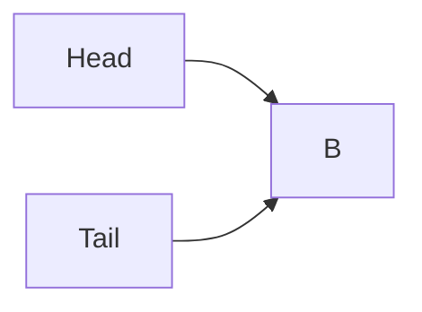

# 原子类

## `AtomicInteger`

一个简单的测试

```java
package concurrent.phase3;

import java.util.HashSet;
import java.util.Set;
import java.util.concurrent.atomic.AtomicInteger;

public class AtomicIntegerTest {

    private static Set<Integer> set = new HashSet<>();

    public static void main(String[] args) throws InterruptedException {
        AtomicInteger value = new AtomicInteger(0);
        Thread t1 = new Thread(() -> {
            int x = 0;
            while (x < 500) {
                int v = value.getAndIncrement();
                set.add(v);
                System.out.println(Thread.currentThread().getName() + ":" + v);
                x++;
            }
        });

        Thread t2 = new Thread(() -> {
            int x = 0;
            while (x < 500) {
                int v = value.getAndIncrement();
                set.add(v);
                System.out.println(Thread.currentThread().getName() + ":" + v);
                x++;
            }
        });

        t1.start();
        t2.start();
        t1.join();
        t2.join();
        System.out.println(set.size());
    }
}
```

作为对比，我们可以将`value`换成普通类型，或者使用`volatile`修饰，会出现并发问题。

**`CAS`**

其实就是快速失败的作用，在`jdk6`中可以看到`getAndSet`方法实现为

```java
public final int getAndSet(int newValue) {
    for (; ; ) {
        int current = get();
        if (compareAndSet(current, newValue)) {
            return current;
        }
    }
}
------
//jdk8已经改成这样了
    public final int getAndSet(int var1) {
    return unsafe.getAndSetInt(this, valueOffset, var1);
}
```

通过代码很好理解，就是在返回值的时候先比较下当前值`current`是否已经被改变，这个`compareAndSet`是在`CPU`层面加锁，会很快，相当于一种无锁的状态。如果当前值一被改变就立即失败重来。

这里实现一个简单的无锁控制

```java
package concurrent.phase3;
import java.util.concurrent.atomic.AtomicInteger;

public class AtomicIntegerTest1 {

    private final AtomicInteger value = new AtomicInteger(0);

    private static final AtomicIntegerTest1 lock = new AtomicIntegerTest1();

    private Thread lockedThread;

    public static void main(String[] args) {
        for (int i = 0; i < 2; i++) {
            new Thread(() -> {
                try {
                    doSomething();
                } catch (Exception e) {
                    e.printStackTrace();
                }
            }).start();
        }
    }

    public static void doSomething() throws Exception {
        try {
            lock.tryLock();
            System.out.println(Thread.currentThread().getName() + " get the lock");
            Thread.sleep(100_000);
        } finally {
            lock.unlock();
        }
    }

    public void tryLock() throws Exception {
        //如果是0，表示锁为释放状态，否则为关闭状态
        boolean success = value.compareAndSet(0, 1);
        if (!success) {
            throw new RuntimeException("Get the lock failed");
        } else {
            lockedThread = Thread.currentThread();
        }
    }

    public void unlock() {
        if (0 == value.get()) {
            return;
        }
        if (lockedThread == Thread.currentThread()) {
            value.compareAndSet(1, 0);
        }
    }
}
```

这里首先会去获取锁，如果获取不到就释放掉当前线程。其他基本类型的原子类基本类似。


## `AtomicReference`

这个类可以让我们自定义的类变成原子类型的

```java
package concurrent.phase3;

import java.util.concurrent.atomic.AtomicReference;

public class AtomicReferenceTest {

    public static void main(String[] args) {
        AtomicReference<Simple> atomic = new AtomicReference<>(new Simple("Alext", 12));
        System.out.println(atomic.get());

        boolean res = atomic.compareAndSet(new Simple("aa", 13), new Simple("bb", 13));
        System.out.println(res);
    }

    static class Simple {

        private String name;
        private int age;

        public Simple() {
        }

        public Simple(String name, int age) {
            this.name = name;
            this.age = age;
        }

        public String getName() {
            return name;
        }

        public void setName(String name) {
            this.name = name;
        }

        public int getAge() {
            return age;
        }

        public void setAge(int age) {
            this.age = age;
        }

        @Override
        public String toString() {
            return "Simple{" +
                "name='" + name + '\'' +
                ", age=" + age +
                '}';
        }
    }
}
```


## `ABA` 问题

本来`CAS`通过检查当前值是否有改变来解决并发问题，但是当一个值变化为 `A->B->A`的时候其实变量值是有变化的，但是此时`CAS`是无法判断出来的，这就会导致问题。


## `AtomicStampedReference`

通过此对象可以解决上面的问题，其中有一个对象`Pair`，其中不仅保存了当前变量的值，还保存了一个时间戳，就算值相同，而时间戳不同也表明变量发生了变化。


## 原子类数组

```
AtomicIntegerArray
AtomicLongArray
AtomicReferenceArray
```

```java
package concurrent.phase3;

import java.util.concurrent.atomic.AtomicIntegerArray;

public class AtomicIntegerArrayTest {

    public static void main(String[] args) {
        AtomicIntegerArray arr = new AtomicIntegerArray(10);
        arr.set(0, 10);
        System.out.println(arr.get(0));
        System.out.println(arr.get(1));
    }
}
```

相关源码分析：`https://www.cnblogs.com/zyy1688/p/10654943.html`

```java
//获取int[]在内存中的初始地址。
private static final int base = unsafe.arrayBaseOffset(int[].class);
//用来存储移位个数
private static final int shift;
private final int[] array;

//初始化变量。
static {
    int scale = unsafe.arrayIndexScale(int[].class);
    if ((scale & (scale - 1)) != 0)
        throw new Error("data type scale not a power of two");
    //得出scale为2的几次方，即需要移位个数
    shift = 31 - Integer.numberOfLeadingZeros(scale);
}
//检查第i个元素的地址值。
private long checkedByteOffset(int i) {
    if (i < 0 || i >= array.length)
        throw new IndexOutOfBoundsException("index " + i);
    return byteOffset(i);
}
//当前索引i*shift(偏移位置) + base(基础位置)
private static long byteOffset(int i) {
    return ((long) i << shift) + base;
}
//获取第i个元素的值
public final int get(int i) {
    return getRaw(checkedByteOffset(i));
}
//通过地址值来获取偏移量的元素值。
private int getRaw(long offset) {
    return unsafe.getIntVolatile(array, offset);
}
//用cas方式，在元素i的位置设置新值
public final void set(int i, int newValue) {
    unsafe.putIntVolatile(array, checkedByteOffset(i), newValue);
}
```

并且数组里面各个元素类别都是相同的，所以占有的空间也都是一样大的，假设上面数组为`int`类型的`array`，并且`array`的地址为`n`，所以可以计算出`array[1]`为`base+4`，`array[2]`为 
`base+4*2`，`array[3]`为`base+4*3` 。 

所以这样在`AtomicIntegerArray`里面，我们可以通过`base，i，scale`和`shift`，能够计算出数组中任意元素的位置以及获取值，这样一来，对数组的操作就可以转化为对单个元素的操作。 
开始被一个问题困扰了一会儿，`array`数组是`final`类型，保证了：

- `array`在使用的时候，已经初始化了
- `array`不能再重新指向其他对象

但是，`array`数组里面并不是`volatile`类型的，能确保可见性么？

我们再来看看它的`get`方法和`set`方法： 

```java
public final int get(int i) {
    return getRaw(checkedByteOffset(i));
}
//volatile的get
private int getRaw(long offset) {
    return unsafe.getIntVolatile(array, offset);
}

//volatile的set
public final void set(int i, int newValue) {
    unsafe.putIntVolatile(array, checkedByteOffset(i), newValue);
}

//lazySet，即普通set，性能高
public final void lazySet(int i, int newValue) {
    unsafe.putOrderedInt(array, checkedByteOffset(i), newValue);
}

//原子性的获取并且set
public int getAndSet(int i, int newValue) {
    return unsafe.getAndSetInt(array, checkedByteOffset(i), newValue);
}
```

如上我们可以看到，调用的都是`unsafe`里面具有`volatile`语义的方法，也就是整个通过内存地址对数组元素的操作，也是有`volatile`语义的，即具有可见性。


## `AtomicIntegerFieldUpdater`

比如有一个类，其中有很多属性，但是我们不想对这个类使用`AtomicStampedReference`来封装，只是想对其中一个属性字段进行原子操作，此时就可以使用此类来完成。

```java
package concurrent.phase3;

import java.util.concurrent.atomic.AtomicIntegerFieldUpdater;

public class Demo01 {

    public static void main(String[] args) {
        final AtomicIntegerFieldUpdater<TestMe> updater =
            AtomicIntegerFieldUpdater.newUpdater(TestMe.class, "i");
        final TestMe me = new TestMe();
        for (int i = 0; i < 2; i++) {
            new Thread(() -> {
                for (int j = 0; j < 20; j++) {
                    int v = updater.getAndIncrement(me);
                    System.out.println(Thread.currentThread().getName() + "->" + v);
                }
            }).start();
        }
    }

    static class TestMe{
        volatile int i ;
    }
}
```

这里要注意，如果属性 `i` 是 `private`(当前类不受此限制)，或者说实例 `me` 为 `null` ，则会报错。当然属性类型和名字如果不对，也会报错，同时要注意，属性字段需要使用 `volatile` 修饰。类似的还有`AtomicLongFieldUpdater、AtomicReferenceFieldUpdater`。**主要使用场景就是比如在对链表等数据结构中使用的时候，在多线程中如果我们直接对整个链表加锁，显然效率是很慢的，此时使用`AtomicIntegerFieldUpdater`就会好很多。**这在`ConcurrentHashMap`中是有用到的。

```java
package concurrent.phase3;

import java.util.concurrent.atomic.AtomicIntegerFieldUpdater;

public class Demo02 {

    private volatile int i ;
    private AtomicIntegerFieldUpdater<Demo02> updater =
        AtomicIntegerFieldUpdater.newUpdater(Demo02.class, "i");

    public void update(int newValue) {
        updater.compareAndSet(this, i, newValue);
    }

    public int get() {
        return i;
    }

    public static void main(String[] args) {
        Demo02 demo02 = new Demo02();
        demo02.update(10);
        System.out.println(demo02.get());
    }
}
```


## `Unsafe`

```java
package concurrent.phase3;

import java.util.concurrent.ExecutorService;
import java.util.concurrent.Executors;
import java.util.concurrent.TimeUnit;
import sun.misc.Unsafe;

public class Demo03 {

    public static void main(String[] args) throws Exception {
        ExecutorService service = Executors.newFixedThreadPool(1000);
//        Counter counter = new StupidCounter();
        Counter counter = new CasCounter();
        long start = System.currentTimeMillis();
        for (int i = 0; i < 1000; i++) {
            service.submit(new CounterRunnable(counter, 10000));
        }
        service.shutdown();
        service.awaitTermination(1, TimeUnit.HOURS);
        long end = System.currentTimeMillis();
        System.out.println("Counter result:" + counter.getCounter());
        System.out.println("cost: " + (end - start));
    }

    interface Counter {

        void increment();

        long getCounter();
    }

    private static class CasCounter implements Counter {

        private volatile long counter = 0;

        private Unsafe unsafe;

        private long offset;

        public CasCounter() throws Exception {
            this.unsafe = Unsafe.getUnsafe();
            this.offset = unsafe.objectFieldOffset(CasCounter.class.getDeclaredField("counter"));
        }

        @Override
        public void increment() {
            long current = counter;
            while (!unsafe.compareAndSwapLong(this, offset, current, current + 1)) {
                current = counter;
            }
        }

        @Override
        public long getCounter() {
            return counter;
        }
    }

    private static class StupidCounter implements Counter {

        private long counter = 0;

        @Override
        public void increment() {
            counter++;
        }

        @Override
        public long getCounter() {
            return counter;
        }
    }

    private static class CounterRunnable implements Runnable {

        private final Counter counter;
        private final int num;

        public CounterRunnable(Counter counter, int num) {
            this.counter = counter;
            this.num = num;
        }

        @Override
        public void run() {
            for (int i = 0; i < num; i++) {
                counter.increment();
            }
        }
    }
}
```

这里有两个实现，对于`StupidCounter`我们还可以在其方法上加锁来进行测试，另外一个实现是使用`Unsafe`类来实现无锁，但是在`jdk8`中无法使用，可以切换到低版本。或者使用反射来获取`Unsafe`。

```java
private static Unsafe getUnsafe() {
    try {
        Field f = Unsafe.class.getDeclaredField("theUnsafe");
        f.setAccessible(true);
        return (Unsafe) f.get(null);
    } catch (Exception e) {
        throw new RuntimeException(e);
    }
}
```

还有一些不推荐的用法

```java
package concurrent.phase3;

import java.io.File;
import java.io.FileInputStream;
import java.lang.reflect.Field;
import sun.misc.Unsafe;

public class Demo04 {

    public static void main(String[] args) throws Exception {
        //此种情况下类会被初始化
        // Simple simple = Simple.class.newInstance();

        //这样则不会被初始化
        //Class.forName("concurrent.phase3.Demo04$Simple");

        //这样也可以绕过初始化
        Unsafe unsafe = getUnsafe();
        //直接开辟了一块内存
        Simple simple = (Simple) unsafe.allocateInstance(Simple.class);
        System.out.println(simple.getI());
        System.out.println("Simple类加载器： " + simple.getClass().getClassLoader());

        System.out.println("-----------------");

        Guard guard = new Guard();
        //此时是不会输出的
        guard.work();
        //这里通过Unsafe改变内存中ACCESS_ALLOWED的值
        Field field = guard.getClass().getDeclaredField("ACCESS_ALLOWED");
        //这里第一个参数是guard类实例，然后第二个参数是字段属性的偏移量，这样就可以找到
        //该属性所在内存中的位置，然后将值设置进去
        unsafe.putInt(guard, unsafe.objectFieldOffset(field), 42);
        guard.work();

        System.out.println("-----------------");

        //使用Unsafe跳过类加载器加载一个类，不过会初始化
        byte[] bytes = loadClassContent();
        Class<?> clazz = unsafe.defineClass(null, bytes, 0, bytes.length, null, null);
        Integer value = (Integer) clazz.getMethod("getI").invoke(clazz.newInstance(), null);
        System.out.println(value);

        System.out.println("-----------------");
    }

    private static byte[] loadClassContent() throws Exception{
        File file = new File("D:\\Simple.class");
        FileInputStream fis = new FileInputStream(file);
        byte[] content = new byte[(int) file.length()];
        fis.read(content);
        fis.close();
        return content;
    }

    private static Unsafe getUnsafe() {
        try {
            Field f = Unsafe.class.getDeclaredField("theUnsafe");
            f.setAccessible(true);
            return (Unsafe) f.get(null);
        } catch (Exception e) {
            throw new RuntimeException(e);
        }
    }

    private static class Simple {

        private long i = 0;

        public Simple() {
            this.i = 1;
            System.out.println("初始化: " + i);
        }

        public long getI() {
            return i;
        }
    }

    private static class Guard {

        private int ACCESS_ALLOWED = 1;

        private boolean allow() {
            return 42 == ACCESS_ALLOWED;
        }

        public void work() {
            if (allow()) {
                System.out.println("允许执行");
            }
        }

    }
}
```

这里相关方法不推荐使用，但是需要理解，因为在后面的`AQS`中有用到，特别是获取到一个实例对象的某个字段在内存中的偏移量，通过这个偏移量我们可以拿到该字段在内存中的位置。


# `AQS`

并发包基本都是基于`AQS`，这里先看下`AQS`的基本实现

| 属性              | 解释                                                         |
| ----------------- | ------------------------------------------------------------ |
| `int waitStatus`  | 1）`CANCELLED = 1`，表示当前结点已取消调度。当`timeout`或被中断（响应中断的情况下），<br/>会触发变更为此状态，进入该状态后的结点将不会再变化。<br/>2）`SIGNAL = -1`，表示后继结点在等待当前结点唤醒。后继结点入队时，会将前继结点的状态更新为`SIGNAL`。<br/>3）`CONDITION = -2`，表示结点等待在`Condition`上，当其他线程调用了`Condition`的`signal()`方法后，<br/>`CONDITION`状态的结点将从等待队列转移到同步队列中，等待获取同步锁；<br/>4）`PROPAGATE = -3`，共享模式下，前继结点不仅会唤醒其后继结点，同时也可能会唤醒后继的后继结点，一直往后；<br/>5）`INITIAL = 0`，初始状态 |
| `Node prev`       | 前驱节点(`predecessor`)                                      |
| `Node next`       | 后继节点(`successor`)                                        |
| `Node nextWaiter` | 等待队列中的后继节点，如果当前节点是共享的，就是`SHARED`，否则是独享的`EXCLUSIVE` |
| `Thread thread`   | 获取同步状态的线程                                           |


`AQS`的实现依赖内部的同步队列（`FIFO`双向队列），如果当前线程获取同步状态失败，`AQS`会将该线程以及等待状态等信息构造成一个`Node`，将其加入同步队列的尾部，同时阻塞当前线程，当同步状态释放时，唤醒队列的头节点。

上面说的有点抽象，来具体看下，首先来看`AQS`最主要的三个成员变量：

```
    private transient volatile Node head;
    
    private transient volatile Node tail;

    private volatile int state; 
```


上面提到的同步状态就是这个`int`型的变量`state`。`head`和`tail`分别是同步队列的头结点和尾结点。假设`state=0`表示同步状态可用（如果用于锁，则表示锁可用），`state=1`表示同步状态已被占用（锁被占用）。

下面举例说下获取和释放同步状态的过程：

**获取同步状态**

假设线程`A`要获取同步状态（这里想象成锁，方便理解），初始状态下`state=0`,所以线程A可以顺利获取锁，`A`获取锁后将`state`置为1。在`A`没有释放锁期间，线程`B`也来获取锁，此时因为`state=1`，表示锁被占用，所以将`B`的线程信息和等待状态等信息构成出一个`Node`节点对象，放入同步队列，`head`和`tail`分别指向队列的头部和尾部（此时队列中有一个空的`Node`节点作为头点，`head`指向这个空节点，空`Node`的后继节点是`B`对应的`Node`节点，`tail`指向它），同时阻塞线程B(这里的阻塞使用的是`LockSupport.park()`方法)。后续如果再有线程要获取锁，都会加入队列尾部并阻塞。




**释放同步状态**

当线程`A`释放锁时，即将`state`置为`0`，此时A会唤醒头节点的后继节点（所谓唤醒，其实是调用`LockSupport.unpark(B)`方法），即`B`线程从`LockSupport.park()`方法返回，此时`B`发现`state`已经为0，所以B线程可以顺利获取锁，`B`获取锁后`B`的`Node`节点随之出队。


总体逻辑就是：每个节点只关注自己的前驱节点，如果前驱节点是`head`，那就说明当前节点可以去抢锁了，用`tryAcquire`去抢。

要是抢到了，就把这个节点作为`head`，同时移除掉原有的`head`。（`head`节点是没有数据的，就是一个队列起始的标志）。于是下一个节点成为了`head`指向的节点。那要是没抢到呢？那就看看自己是不是可以休息了：`shouldParkAfterFailedAcquire`，如果能休息就`park`进入`waiting`状态,直到被`unpark`。


## 独占锁

（1）获取锁的实现

`AQS`的锁功能齐全，它既可以用来实现独占锁，也可以用来实现共享锁。

* 独占锁：也叫排他锁，即锁只能由一个线程获取，若一个线程获取了锁，则其他想要获取锁的线程只能等待，直到锁被释放。比如说写锁，对于写操作，每次只能由一个线程进行，若多个线程同时进行写操作，将很可能出现线程安全问题；

* 共享锁：锁可以由多个线程同时获取，锁被获取一次，则锁的计数器+1。比较典型的就是读锁，读操作并不会产生副作用，所以可以允许多个线程同时对数据进行读操作，而不会有线程安全问题，当然，前提是这个过程中没有线程在进行写操作；

我们首先分析一下独占锁。在`AQS`中，通过方法`acquire`来获取独占锁，`acquire`方法的代码如下：

```java
public final void acquire(int arg) {
    if (!tryAcquire(arg) &&
        acquireQueued(addWaiter(Node.EXCLUSIVE), arg))
        selfInterrupt();
}
```

* 首先调用`tryAcquire`尝试获取一次锁，若返回`true`，表示获取成功，则`acquire`方法将直接返回；若返回`false`，则会继续向后执行`acquireQueued`方法；

* `tryAcquire`返回`false`后，将执行`acquireQueued`，但是这个方法传入的参数调用了`addWaiter`方法；

* `addWaiter`方法的作用是将当前线封装成同步队列的节点，然后加入到同步队列的尾部进行排队，并返回此节点；

* `addWaiter`方法执行完成后，将它的返回值作为参数，调用`acquireQueued`方法。`acquireQueued`方法的作用是让当前线程在同步队列中阻塞，然后在被其他线程唤醒时去获取锁；

* 若线程被唤醒并成功获取锁后，将从`acquireQueued`方法中退出，同时返回一个boolean值表示当前线程是否被中断，若被中断，则会执行下面的`selfInterrupt`方法，响应中断；

下面我们就来具体分析这个方法中调用的几个方法的执行流程。首先第一个`tryAcquire`方法是一个抽象方法，需要子类来实现，这里应用了模板模式。

```java
// 将线程封装成一个节点，放入同步队列的尾部
private Node addWaiter(Node mode) {
    // 当前线程封装成同步队列的一个节点Node
    Node node = new Node(Thread.currentThread(), mode);
    // 这个节点需要插入到原尾节点的后面，所以我们在这里先记下原来的尾节点
    Node pred = tail;
    // 判断尾节点是否为空，若为空表示队列中还没有节点，则不执行以下步骤
    if (pred != null) {
        // 记录新节点的前一个节点为原尾节点
        node.prev = pred;
        // 将新节点设置为新尾节点，使用CAS操作保证了原子性
        if (compareAndSetTail(pred, node)) {
            // 若设置成功，则让原来的尾节点的next指向新尾节点
            pred.next = node;
            return node;
        }
    }
    // 若以上操作失败，则调用enq方法继续尝试(enq方法见下面)
    enq(node);
    return node;
}

private Node enq(final Node node) {
    // 使用死循环不断尝试
    for (;;) {
        // 记录原尾节点
        Node t = tail;
        // 若原尾节点为空，则必须先初始化同步队列，初始化之后，下一次循环会将新节点加入队列
        if (t == null) { 
            // 使用CAS设置创建一个默认的节点作为首节点
            if (compareAndSetHead(new Node()))
                // 首尾指向同一个节点
                tail = head;
        } else {
            // 以下操作与addWaiter方法中的if语句块内一致
            node.prev = t;
            if (compareAndSetTail(t, node)) {
                t.next = node;
                return t;
            }
        }
    }
}
```

它的执行过程大致可以总结为：将新线程封装成一个节点，加入到同步队列的尾部，若同步队列为空，则先在其中加入一个默认的节点，再进行加入；若加入失败，则使用死循环（也叫自旋）不断尝试，直到成功为止。这个过程中使用`CAS`保证了添加节点的原子性。下面看看`acquireQueued`方法的源码：

```java
/**
 * 让线程不间断地获取锁，若线程对应的节点不是头节点的下一个节点，则会进入等待状态
 */
final boolean acquireQueued(final Node node, int arg) {
    // 记录失败标志
    boolean failed = true;
    try {
        // 记录中断标志，初始为true
        boolean interrupted = false;
        // 循环执行，因为线程在被唤醒后，可能再次获取锁失败，需要重写进入等待
        for (;;) {
            // 获取当前线程节点的前一个节点
            final Node p = node.predecessor();
            // 若前一个节点是头节点，则tryAcquire尝试获取锁，若获取成功，则执行if中的代码
            //只有当前线程的前一个节点时头节点时才能去获取锁
            if (p == head && tryAcquire(arg)) {
                // 将当前节点设置为头节点
                setHead(node);
                // 将原来的头节点移出同步队列
                p.next = null; // help GC
                // 失败标志置为false
                failed = false;
                // 返回中断标志，acquire方法可以根据返回的中断标志，判断当前线程是否被中断
                return interrupted;
            }
            // shouldParkAfterFailedAcquire方法判断当前线程是否能够进入等待状态，
            // 若当前线程的节点不是头节点的下一个节点，则需要进入等待状态，
            // 在此方法内部，当前线程会找到它的前驱节点中，第一个还在正常等待或执行的节点，
            // 让其作为自己的直接前驱，然后在需要时将自己唤醒（因为其中有些线程可能被中断），
            // 若找到，则返回true，表示自己可以进入等待状态了；
            
            // 然后继续调用parkAndCheckInterrupt方法，当前线程在这个方法中等待，
            // 直到被其他线程唤醒，或者被中断后返回，返回时将返回一个boolean值，
            // 表示这个线程是否被中断，若为true，则将执行下面一行代码，将中断标志置为true
            if (shouldParkAfterFailedAcquire(p, node) &&
                parkAndCheckInterrupt())
                interrupted = true;
        }
    } finally {
        // 上面代码中只有一个return语句，且return的前一句就是failed = false;
        // 所以只有当异常发生时，failed才会保持true的状态运行到此处；
        // 异常可能是线程被中断，也可能是其他方法中的异常，
        // 比如我们自己实现的tryAcquire方法
        // 此时将取消线程获取锁的动作，将它从同步队列中移除
        if (failed)
            cancelAcquire(node);
    }
}
```

以上就是`acquireQueued`方法的源码分析。这个方法的作用可以概括为：让线程在同步队列中阻塞，直到它成为头节点的下一个节点，被头节点对应的线程唤醒，然后开始获取锁，若获取成功才会从方法中返回。这个方法会返回一个`boolean`值，表示这个正在同步队列中的线程是否被中断。

```java
private static boolean shouldParkAfterFailedAcquire(Node pred, Node node) {
    int ws = pred.waitStatus;
    if (ws == Node.SIGNAL)
        /*
        * 这里就是说，前驱节点的等待状态时SIGNAL，执行完了会通知当前节点，此时当前节点可以休息了
        */
        return true;
    if (ws > 0) {
        /*
         * 前驱节点状态 > 0，回头看看开始的表格，只有CANCELED是1大于0，表示前驱节点取消了，
         * 此时一直往前找，直到找到一个状态<=0（没被取消）的节点，放它后面
        */
        do {
            node.prev = pred = pred.prev;
        } while (pred.waitStatus > 0);
        pred.next = node;
    } else {
        /*
        * ws < 0，就是说前驱节点是正常的，那就把前驱节点状态设置成SIGNAL，让前驱节点执行完后通知当前节点
        */
        compareAndSetWaitStatus(pred, ws, Node.SIGNAL);
    }
    return false;
}
```

后面的`parkAndCheckInterrupt`方法会将线程中断，进入等待状态，这和调用`Thread.interrupted()`不同，此方法只是设置中断状态为`true`，并不一定真的中断线程，而`parkAndCheckInterrupt`是给`CPU`发送指令进行中断，然后会检查中断状态。

（2）释放锁

释放独占锁是通过`release`方法实现的：

```java
public final boolean release(int arg) {
    // 调用tryRelease尝试修改state释放锁，若成功，将返回true，否则false
    //tryRelease需要自己复写
    if (tryRelease(arg)) {
        // 若修改state成功，则表示释放锁成功，需要将当前线程移出同步队列
        // 当前线程在同步队列中的节点就是head，所以此处记录head
        Node h = head;
        // 若head不是null，且waitStatus不为0，表示它是一个装有线程的正常节点，
        // 在之前提到的addWaiter方法中，若同步队列为空，则会创建一个默认的节点放入head
        // 这个默认的节点不包含线程，它的waitStatus就是0，所以不能释放锁
        if (h != null && h.waitStatus != 0)
            // 若head是一个正常的节点，则调用unparkSuccessor唤醒它的下一个节点所对应的线程
            unparkSuccessor(h);
        // 释放成功
        return true;
    }
    // 释放锁失败
    return false;
}
```


```java
private void unparkSuccessor(Node node) {
    int ws = node.waitStatus;
    if (ws < 0)
        //清空当前节点的状态为初始状态0
        compareAndSetWaitStatus(node, ws, 0);

    Node s = node.next;
    //如果后继节点为空，或者已经被取消
    if (s == null || s.waitStatus > 0) {
        s = null;
        //从后向前遍历，找到最前面的一个等待的线程节点，因为这里后继节点为空
        //没法从前向后遍历
        for (Node t = tail; t != null && t != node; t = t.prev)
            if (t.waitStatus <= 0)
                s = t;
    }
    //后继节点不为空就直接唤醒
    if (s != null)
        LockSupport.unpark(s.thread);
}
```


## 共享锁

（1）获取锁

在`AQS`中，定义了`acquireShared`方法用来获取共享锁：

```java
public final void acquireShared(int arg) {
    if (tryAcquireShared(arg) < 0)
        doAcquireShared(arg);
}
```

可以看到，这个方法比较简短。首先调用`tryAcquireShared`方法尝试获取一次共享锁，即修改`state`的值，若返回值`>=0`，则表示获取成功，线程不受影响，继续向下执行；若返回值小于0，表示获取共享锁失败，则线程需要进入到同步队列中等待，调用`doAcquireShared`方法。`acquireShared`方法也是`AQS`的一个模板方法，而其中的`tryAcquireShared`方法就是需要使用者自己实现的方法。下面我们来看看`doAcquireShared`方法的实现：

```java
/**
 * 不间断地获取共享锁，若线程对应的节点不是头节点的下一个节点，将进入等待状态
 * 实现与acquireQueued非常类似
 * @param arg the acquire argument
 */
private void doAcquireShared(int arg) {
    // 往同步队列的尾部添加一个默认节点，Node.SHARED是一个Node常量，
    // 它的值就是一个不带任何参数的Node对象，也就是new Node();
    final Node node = addWaiter(Node.SHARED);
    // 失败标志，默认为true
    boolean failed = true;
    try {
        // 中断标志，用来判断线程在等待的过程中释放被中断
        boolean interrupted = false;
        // 死循环不断尝试获取共享锁
        for (;;) {
            // 获取默认节点的前一个节点
            final Node p = node.predecessor();
            // 判断当前节点的前一个节点是否为head节点
            if (p == head) {
                // 尝试获取共享锁
                int r = tryAcquireShared(arg);
                // 若r>0，表示获取成功
                if (r >= 0) {
                    // 当前线程获取锁成功后，调用setHeadAndPropagate方法将当前线程设置为head
                    // 同时，若共享锁还能被其他线程获取，则在这个方法中也会向后传递，唤醒后面的线程
                    setHeadAndPropagate(node, r);
                    // 将原来的head的next置为null
                    p.next = null; // help GC
                    // 判断当前线程是否中断，若被中断，则调用selfInterrupt方法响应中断
                    if (interrupted)
                        selfInterrupt();
                    // 失败标志置为false
                    failed = false;
                    return;
                }
            }
            // 以下代码和获取独占锁的acquireQueued方法相同，即让当前线程进入等待状态
            // 具体解析可以看上面acquireQueued方法的解析
            if (shouldParkAfterFailedAcquire(p, node) &&
                parkAndCheckInterrupt())
                interrupted = true;
        }
    } finally {
        if (failed)
            cancelAcquire(node);
    }
}
```

`doAcquireShared`方法的实现和获取独占锁中的`acquireQueued`方法很类似，但是主要有一点不同，那就是**线程在被唤醒后，若成功获取到了共享锁，还需要判断共享锁是否还能被其他线程获取，若可以，则继续向后唤醒它的下一个节点对应的线程**。


（2）释放锁

```java
public final boolean releaseShared(int arg) {
    // 尝试修改state的值释放锁
    if (tryReleaseShared(arg)) {
        // 若成功，则调用以下方法唤醒后继节点中的线程
        doReleaseShared();
        return true;
    }
    return false;
}
```

`releaseShared`也是一个模板方法，它通过调用使用者自己实现的`tryReleaseShared`方法尝试释放锁，修改`state`的值，若返回`true`，表示修改成功，则继续向下调用`doReleaseShared`唤醒`head`的下一个节点对应的线程，让它开始尝试获取锁；若修改`state`失败，则返回`false`。

```java
private void doReleaseShared() {
    for (;;) {
        Node h = head;
        if (h != null && h != tail) {
            int ws = h.waitStatus;
            if (ws == Node.SIGNAL) {
                if (!compareAndSetWaitStatus(h, Node.SIGNAL, 0))
                    continue;            // loop to recheck cases
                //释放下一个节点
                unparkSuccessor(h);
            }
            else if (ws == 0 &&
                     !compareAndSetWaitStatus(h, 0, Node.PROPAGATE))
                continue;                // loop on failed CAS
        }
        if (h == head)                   // loop if head changed
            break;
    }
}
```

这里要注意最后的判断，这里是为了防止在新节点加入的过程中头节点发生了变化，所以需要比较，如果没变就直接释放，否则需要再次循环一次。


## `acquireInterruptibly`

同步器提供了 `acquireInterruptibly` 方法来进行**可响应中断的获取锁操作**

```java
public final void acquireInterruptibly(int arg)
    throws InterruptedException {
    if (Thread.interrupted())
        throw new InterruptedException();
    //尝试获取锁
    if (!tryAcquire(arg))
        doAcquireInterruptibly(arg);
}
private void doAcquireInterruptibly(int arg)
    throws InterruptedException {
    //将当前节点计入到同步队列尾
    final Node node = addWaiter(Node.EXCLUSIVE);
    boolean failed = true;
    try {
        for (;;) {
            final Node p = node.predecessor();
            if (p == head && tryAcquire(arg)) {
                setHead(node);
                p.next = null; // help GC
                failed = false;
                return;
            }
            if (shouldParkAfterFailedAcquire(p, node) &&
                parkAndCheckInterrupt())
                //这里直接异常
                throw new InterruptedException();
        }
    } finally {
        if (failed)
            cancelAcquire(node);
    }
}
```

仔细观察可以发现该方法实现源码和上文中 `acquireQueued` 方法的实现基本上类似，只是这里把入队操作 `addWaiter` 放到了方法里面了，还有一个区别就是当在循环体内判断需要进行中断时会直接抛出异常来响应中断

```java
public final void acquire(int arg) {
    if (!tryAcquire(arg) &&
        acquireQueued(addWaiter(Node.EXCLUSIVE), arg))
        selfInterrupt();
}
final boolean acquireQueued(final Node node, int arg) {
    boolean failed = true;
    try {
        boolean interrupted = false;
        for (;;) {
            final Node p = node.predecessor();
            if (p == head && tryAcquire(arg)) {
                setHead(node);
                p.next = null; // help GC
                failed = false;
                return interrupted;
            }
            if (shouldParkAfterFailedAcquire(p, node) &&
                parkAndCheckInterrupt())
                interrupted = true;
        }
    } finally {
        if (failed)
            cancelAcquire(node);
    }
}
```


## `hasQueuedPredecessors`

**此方法是公平锁加锁时判断等待队列中是否存在有效节点（也就是有线程在队列中等待）的方法**。如果返回`False`，说明当前线程可以争取共享资源；如果返回`True`，说明队列中存在有效节点，当前线程必须加入到等待队列中。

注意：此方法相当于一种测试，但是在测试过程中可能情况已变，最终结果取决于最后我们获取锁的实际情况，这里相当于一种快速失败的方式。

```java
public final boolean hasQueuedPredecessors() {
    /*
      需要时刻认为CLH队列一直都在动态的变化中，head和tail随时会发生变化在构建CLH链表时，
      初始化时是先设置head，然后设置tail，那么如果有null的情况则只有 head!=null && tail==null，
      一旦在这个时刻添加尾节点成功，head.next 的值其实已经变化了，但是如果先获取head可能存在null的
      情况，所以先获取tail再获取head
      */
    Node t = tail; // Read fields in reverse initialization order
    Node h = head;
    Node s;
    return h != t &&
        ((s = h.next) == null || s.thread != Thread.currentThread());
}
```

要理解此方法，则先要看入队操作

```java
private Node addWaiter(Node mode) {
    Node node = new Node(Thread.currentThread(), mode);
    // Try the fast path of enq; backup to full enq on failure
    Node pred = tail;
    if (pred != null) {
        node.prev = pred;//这里只是执行一个快速操作，它和enq里的else分支的逻辑一样
        if (compareAndSetTail(pred, node)) {
            pred.next = node;
            return node;
        }
    }
    enq(node);//如果上面快速操作没有成功，再执行enq
    return node;
}

private Node enq(final Node node) {
    for (;;) {
        Node t = tail;
        if (t == null) { // 第一次入队，没有虚拟节点的存在，需先创建它
            if (compareAndSetHead(new Node()))
                tail = head;
        } else { // 至少有一个node，尝试入队
            node.prev = t;
            if (compareAndSetTail(t, node)) {
                t.next = node;
                return t;
            }
        }
    }
}
```


1、分析 `h != t` 返回 `false` 的情况。此时 `hasQueuedPredecessors` 返回 `false`。

* 当 `h` 和 `t` 都为 `null` ，返回 `false` 。此时说明队列为空，还从来没有 `Node`入过队。

* 当 `h` 和 `t` 都指向同一个`Node`，也返回 `false`。此时说明队列中只有一个正在运行的线程节点，那说明没有线程在队列中。


2、分析 `h != t` 返回 `true` ，且 `(s = h.next) == null` 返回 `true`，直接短路后面。此时` hasQueuedPredecessors` 返回 `true`。

* 既然 `h != t `返回 `true `，说明 `h `和 `t `不相等，先考虑特殊情况（上面讲到的出现“ `head不为null，tail为null” `的情况，此时 `head `是空 `node `， `next `成员肯定为 `null `），那么说明有一个线程正在执行 `enq `，且它正好执行到 `if (compareAndSetHead(new Node()))到tail = head; `的间隙。但这个线程肯定不是当前线程，所以不用判断后面短路的 `s.thread != Thread.currentThread() `了，因为当前线程连 `enq `都没开始执行，但另一个线程都开始执行 `enq `了，那不就是说明当前线程排在别人后面了，别的线程马上就要入队了。
* 既然 `h != t `返回 `true `，说明 `h `和 `t `不相等，再考虑二者都不为 `null `。那此时队列中已经至少有一个等待中的线程了，那说明当前线程肯定排在别人后面了。

3、分析 `h != t `返回 `true `，且 `(s = h.next) == null `返回 `false `，且 `s.thread != Thread.currentThread() `返回 `true `。此时 `hasQueuedPredecessors `返回 `true `。如果 `s.thread != Thread.currentThread() `返回 `false `。此时 `hasQueuedPredecessors `返回 `false `。

现在知道 `head `不为 `null `，而且 `head.next `也不为 `null `了（ `(s = h.next) == null返回false `）。我们也知道队列中第一个等待的线程存放在 `head.next `里（注意， `head `为虚拟节点，不存放线程），那么如果 `head.next `的线程不是当前线程，那即说明当前线程已经排在别人线程后面了。


## `ConditionObject`

参考：`https://blog.csdn.net/qq_36582604/article/details/105849161`

此类的主要作用就是对应之前使用` synchronized` 时才能使用的` wait` 和` notify` 方法。

### 属性

```java
/** First node of condition queue. */
private transient Node firstWaiter;
/** Last node of condition queue. */
private transient Node lastWaiter;
```

每个条件变量都维护了一个容器，` ConditionObject` 中的容器就是单向链表队列，上面的属性就是队列的头结点` firstWaiter` 和尾结点` lastWaiter` ，需要注意，条件队列中的头结点不是虚拟头结点，而是包装了等待线程的节点！其类型和同步队列一样，也是使用` AQS` 的内部类` Node` 来构成，但与同步队列不同的是，条件队列是一个单向链表，所以他并没有使用` Node` 类中的` next` 属性来关联后继` Node` ，而使用的` nextWaiter` 

```java
volatile Node prev;
volatile Node next;
Node nextWaiter;
```

这里我们需要注意，` nextWaiter` 是没用` volatile` 修饰的，为什么呢？因为线程在调用` await` 方法进入条件队列时，是已经拥有了锁的，此时是不存在竞争的情况，所以无需通过` volatile` 和` cas` 来保证线程安全。而进入同步队列的都是抢锁失败的，所以肯定是没有锁的，故要考虑线程安全。最后需要注意一点的是，条件队列里面的` Node` 只会存在` CANCELLED` 和` CONDITION` 的状态


### `signal/signalAll`

将条件队列中的所有` Node` 移到同步队列中，然后根据条件再唤醒它们去尝试获得锁

```java
public final void signalAll() {
    if (!isHeldExclusively())
        throw new IllegalMonitorStateException();
    Node first = firstWaiter;
    if (first != null)
        doSignalAll(first);
}
```

首先我们会通过我们子类复写的方法` isHeldExclusively` 来看此时的线程是否已经获得了锁。前面说过只有获得了锁的线程才能够去唤醒条件队列中的` Node` 。如果获得了锁，我们会判断条件队列的头结点是否为` null` ，为` null` 则说明条件队列中没有阻塞的` Node` ；如果不为` null` ，则会通过` doSignalAll` 方法来将条件队列中的所以` Node` 移动到同步队列中

```java
private void doSignalAll(Node first) {
    lastWaiter = firstWaiter = null;
    do {
       // 将next指向first的后继Node
        Node next = first.nextWaiter;
       // 切断first与后继Node的联系
        first.nextWaiter = null;
       // 将此node转移到同步队列中
        transferForSignal(first);
        // 将first指向first的后继Node
        first = next;
    // 在判断此时的first是否为null，不是则继续循环
    } while (first != null);
}
```

因为是移出条件队列中所有的` Node` ，所以一开始我们通过将头结点和尾节点置为` null` 来“清空”条件队列，然后通过` do-while` 循环将条件队列中所有节点通过` transferForSignal` 方法一个一个转移到同步队列中

```java
final boolean transferForSignal(Node node) {
    // 说明此节点状态为CANCELLED,所以跳过该节点（GC会回收）
    if (!compareAndSetWaitStatus(node, Node.CONDITION, 0))
        return false;
    // 入队方法（独占锁获取中详细阐述过）
    Node p = enq(node);
    int ws = p.waitStatus;
    if (ws > 0 || !compareAndSetWaitStatus(p, ws, Node.SIGNAL))
        LockSupport.unpark(node.thread); 
    return true;
}
```

我们首先会通过` CAS` 操作来将` Node` 的状态置为0，如果失败了，说明此时` Node` 状态是` CANCELLED` ，则我们跳过，返回` false` ；如果` Node` 状态成功置为了0，我们就通过` enq` 方法进行入队，这里还是需要提醒一下，` enq` 返回的是` Node` 的前驱节点。然后我们会根据前驱节点的状态来看此时是否要唤醒此节点，如果是下面这两种情况，则会将其唤醒，去尝试获取锁

* 如果前驱节点状态是` CANCELLED` 

* 前驱节点不是` CANCELLED` 状态，但` CAS` 将状态变为` SIGNAL` 失败

如果将前驱节点赋值` SIGNAL` 成功了，则该节点就需要等到前驱节点释放锁之后被唤醒了，我们需要注意，只要节点状态不是` CANCELLED` ，` transferForSignal` 方法最后都是返回` true` 。

` signalAll` 是将条件队列中所有的Node转移到同步队列，**` signal` 则只转移条件队列中的第一个状态不为` CANNCELLED` 的` Node` **


### `await`

**将节点入队并阻塞，等到其他线程唤醒(` signal` )或者自身中断后再重新去获取锁**

```java
public final void await() throws InterruptedException {
    // 如果此线程被中断过，直接抛中断异常
    if (Thread.interrupted())
        throw new InterruptedException();
    // 将当前线程包装成节点放入条件队列
    Node node = addConditionWaiter();
    // 释放当前线程持有的锁
    long savedState = fullyRelease(node);
    // 初始化中断模式参数
    int interruptMode = 0;
    // 检查节点是否在同步队列中
    while (!isOnSyncQueue(node)) {
       // 不在同步队列中则阻塞此线程
        LockSupport.park(this);
        // 上面会被阻塞，之后被唤醒后继续执行
        if ((interruptMode = checkInterruptWhileWaiting(node)) != 0)
            break;
    }
    // 被唤醒后继续执行，再去获取锁
    if (acquireQueued(node, savedState) && interruptMode != THROW_IE)
        interruptMode = REINTERRUPT;
    // 当线程是被中断唤醒时，node和后继节点是没有断开的
    if (node.nextWaiter != null) // clean up if cancelled
        unlinkCancelledWaiters();
    // 根据异常标志位对异常进行处理
    if (interruptMode != 0)
        reportInterruptAfterWait(interruptMode);
}

private Node addConditionWaiter() {
    Node t = lastWaiter;
    // If lastWaiter is cancelled, clean out.
    if (t != null && t.waitStatus != Node.CONDITION) {
        unlinkCancelledWaiters();
        t = lastWaiter;
    }
    Node node = new Node(Thread.currentThread(), Node.CONDITION);
    if (t == null)
        firstWaiter = node;
    else
        t.nextWaiter = node;
    lastWaiter = node;
    return node;
}
```

首先我们会把节点t指向` lastWaiter` ，如果` lastWaiter` 不是` null` 且它的等待状态不是` CONDITION` ，说明` lastWaiter` 的状态是` CANCELLED` ，所以我们会通过` unlinkCancelledWaiters` 方法来移除条件队列中所有` CANCELLED` 的节点，然后将t指向新的` lasterWaiter` ，所以我们可以看到，只要尾结点是` CANCELLED` ，就会将条件队列的所有` CANCELLED` 节点移除。

然后我们会将当前线程包装成一个节点，但是与同步队列初始化节点时不同，条件队列新建节点时会把状态置为` CONDITION` ，而同步队列则是默认值0，所以条件队列中的节点只有` CONDITION` 和` CANCELLED` 两种状态。然后我们再会判断下尾结点是否为` null` ，为` null` 说明条件队列为空，所以我们就将` firstWaiter` 指向新的节点；如果不为` null` ，就将尾结点的后继节点指向新节点，然后再重置` lastWaiter` 。最后将新节点返回。


```java
private void unlinkCancelledWaiters() {
    Node t = firstWaiter;
    Node trail = null;
    while (t != null) {
        Node next = t.nextWaiter;
        if (t.waitStatus != Node.CONDITION) {
            t.nextWaiter = null;
            if (trail == null)
                firstWaiter = next;
           else
                trail.nextWaiter = next;
 
            if (next == null)
                lastWaiter = trail;
         }
           else
            trail = t;
        t = next;
    }
}
```

这个就是从头结点往后遍历，将**所有**` Node` 状态为不为` CONDITION` 的节点移除队列。


```java
final long fullyRelease(Node node) {
    boolean failed = true;
    try {
        long savedState = getState();
        if (release(savedState)) {
            failed = false;
            return savedState;
        } else {
            throw new IllegalMonitorStateException();
        }
    } finally {
        if (failed)
            node.waitStatus = Node.CANCELLED;
    }
}
```

其中释放锁成功调用的是` release` 方法，这个方法在"独占锁的释放"中详述过，需要注意，` release` 除了释放线程的锁外，还会将同步队列中的第一个状态不为` CANCELLED` 的节点中的线程唤醒。最终如果释放锁成功，我们就会将` failed` 状态置为` false` ，然后返回` savedState` 状态，否则我们就会抛出异常。

我们最后看下` finally` ，如果释放锁失败，我们此线程会抛异常终止，那我们这个线程所在的节点状态就被置为` CANCELLED` ，然后等待后面被移出条件队列，所以这也是我们在` addConditonWaiter` 方法中为什么要检查尾结点是否为` CANCELLED` 的原因。

还需要注意的一点是` release` 的入参` savedState` ，这个是获取重入锁的数量，不管之前获得过多少次锁，` release` 方法都会一起释放掉（独占锁最多也就一个锁），这也是为什么这个方法起名为` fullyRelease` 的原因。

```java
final boolean isOnSyncQueue(Node node) {
    //condition装填，或前置节点为null，表明在条件队列中
    if (node.waitStatus == Node.CONDITION || node.prev == null)
        return false;
    if (node.next != null) // If has successor, it must be on queue
        return true;        
    return findNodeFromTail(node);
}
```

先看第一个` if` 语句，如果状态是` CONDITION` 或者` prev` 参数是` null` ，说明此节点是在条件队列中，返回为` false` 。我们知道，` prev` 和` next` 都是同步队列中使用的，所以如果两个属性不为` null` ，说明此节点是在同步队列中，因此第二个if条件成立则需要返回` true` 。如果两个` if` 都不成立，说明这个节点状态是0且` prev` 不为` null` ，即我们在"独占锁获取"中` CAS` 进入同步队列的情况，则我们会通过` findNodeFromTail` 方法来确认是不是这种情况

```java
private boolean findNodeFromTail(Node node) {
    Node t = tail;
    for (;;) {
        if (t == node)
            return true;
        if (t == null)
            return false;
        t = t.prev;
    }
}
```

如果此时` tail` 就是` node` 的话，说明` node` 在同步队列中，如果不是就像前遍历，但是这里大家可能有疑问，这个方法没有考虑到` CAS` 失败的情况，所以可能存在遍历不到的情况，我们看下作者对这个方法的注释。

然后看被唤醒后的操作。线程在这里被唤醒有两种情况，一种是其他线程调用了` doSignal` 或` doSignalAll` ，还有一种就是线程被中断（这两种最终都是调用了` unpark` 方法）。因为在` java` 中，线程被中断后并不是马上就去执行` unpark` 操作，而是先将线程标志位置为` true` 告诉操作系统我需要被中断，至于系统什么时候来执行中断，我们也不清楚，所以在这里，我们需要判断我们被唤醒的原因到底是因为中断还是别的线程唤醒的。这里我们通过` checkInterruptWhileWaiting` 方法来判断，但在讲这个方法前，我们需要先了解这个` interruptMode` 有几种状态

```java
/** Mode meaning to reinterrupt on exit from wait */
private static final int REINTERRUPT =  1;
/** Mode meaning to throw InterruptedException on exit from wait */
private static final int THROW_IE    = -1;
```

除了上面两种，还有一种初始态0，它代表线程没有被中断过，不做任何处理。` REINTERRUPT` 代表` await` 方法退出时，会重新再中断一次；而` THROW_IE` 则代表` await` 方法退出时，会抛出` InterruptedException` 异常。了解了状态后，我们来看方法

```java
private int checkInterruptWhileWaiting(Node node) {
    return Thread.interrupted() ?
        (transferAfterCancelledWait(node) ? THROW_IE : REINTERRUPT) :
        0;
}
```

我们先看到注释，如果中断先于其他线程调用` signal` 等方法唤醒的，则应该返回` THROW_IE` ，而中断是后于其他线程调用` signal` 等方法唤醒，则返回` REINTERRUPT` 。

我们看下代码，代码就是一个嵌套的三元运算符，首先我们会检查中断标志位，如果` interrupted` 方法返回` false` ，说明没发生中断，则返回0；如果返回了` true` ，则说明中断了，则我们需要通过` transferAfterCancelledWait` 方法进一步检查是否发生了其他线程执行了唤醒操作

```java
final boolean transferAfterCancelledWait(Node node) {
    if (compareAndSetWaitStatus(node, Node.CONDITION, 0)) { 
        enq(node);
        return true;
    }
 
    while (!isOnSyncQueue(node))
        Thread.yield();
    return false;
}
```

我们先看第一个if条件，如果条件中的` CAS` 操作成功，说明此时的` Node` 肯定是在条件队列中，则我们调动 ` enq ` 方法将此节点放入到同步队列中，然后返回` true` ，但是这里需要特别注意，这个节点的` nextWaiter` 还没置为` null` 。如果` CAS` 失败了，说明这个节点可能已经在同步队列中或者在入队的过程中，所以我们通过循环等待此节点入队后返回` false` 。我们再回到调用` transferAfterCancelled` 的` checkInterruptWhileWaiting` 方法中，根据` transferAfterCancelledWait` 方法返回值我们最终会返回` REINTERRUPT` 或` THROW_IE` 。

回到` await` 方法

```java
public final void await() throws InterruptedException {
// 代码省略
    int interruptMode = 0;
    while (!isOnSyncQueue(node)) {
        LockSupport.park(this); 
        if ((interruptMode = checkInterruptWhileWaiting(node)) != 0) // 我们现在在这里！！！
            break;
    }
    //这里和之前独占锁的获取锁方式一样
    //让节点去获取锁，并且如果在获取锁的过程中被中断了，且此线程之前没被中断过，则将interruptMode置为REINTERRUPT
    if (acquireQueued(node, savedState) && interruptMode != THROW_IE)
        interruptMode = REINTERRUPT;
    // 还记得开始说的transferAfterCancelledWait方法吗，当线程是被中断唤醒时，
    // node和后继节点是没有断开的，这一步我们的节点中的线程已经获取锁了且从同步队
    // 列中移除了，所以我们在这里将此节点也移除条件队列，unlinkCancelledWaiters
    // 方法前面说过，它会将条件队列中所有不为CONDITION的的节点移除
    if (node.nextWaiter != null) 
        unlinkCancelledWaiters();
    // 如果interruptMode不为0，说明线程是被中断过的，所以需要对中断进行处理
    if (interruptMode != 0)
        reportInterruptAfterWait(interruptMode);
}
// 如果是THROW_IE，就是抛异常，如果是REINTERRUPT，就再自我中断一次，和获取独占锁里面原因一致
private void reportInterruptAfterWait(int interruptMode)
    throws InterruptedException {
    if (interruptMode == THROW_IE)
        throw new InterruptedException();
    else if (interruptMode == REINTERRUPT)
        selfInterrupt();
}
```


# `CountDownLatch`

基本使用在第二阶段中已讲

```java
package concurrent.phase2;

import java.util.Random;
import java.util.concurrent.CountDownLatch;
import java.util.stream.IntStream;

public class Client7 {

    private static final Random random = new Random(1000);

    public static void main(String[] args) {
        CountDownLatch latch = new CountDownLatch(5);
        System.out.println("第一阶段任务多线程处理");
        IntStream.rangeClosed(1, 5).forEach(i -> {
            new Thread(() -> {
                System.out.println(Thread.currentThread().getName() + " is working");
                try {
                    Thread.sleep(random.nextInt(100));
                } catch (InterruptedException e) {
                    e.printStackTrace();
                } finally {
                    latch.countDown();
                }
            }, String.valueOf(i)).start();
        });
        try {
            //注意这里不是wait，而是await
            latch.await();
        } catch (InterruptedException e) {
            e.printStackTrace();
        }
        System.out.println("等待第一阶段多线程全部执行完成，第二阶段任务处理");
        System.out.println("finish");
    }
}
```

上面可以看到当计数器值达到0的时候会不再等待，还有另一种方式可以让其不再等待，就是调用`await`的线程（此处为主线程）中断可以，只是会抛出一个异常。

源码分析：

```java
package java.util.concurrent;
import java.util.concurrent.locks.AbstractQueuedSynchronizer;

public class CountDownLatch {

    private static final class Sync extends AbstractQueuedSynchronizer {
        private static final long serialVersionUID = 4982264981922014374L;

        Sync(int count) {
            setState(count);
        }

        int getCount() {
            return getState();
        }

        protected int tryAcquireShared(int acquires) {
            return (getState() == 0) ? 1 : -1;
        }

        protected boolean tryReleaseShared(int releases) {
            // 这里尝试去设置锁状态，成功后才真正由AQS去执行状态减一操作
            for (;;) {
                int c = getState();
                if (c == 0)
                    return false;
                int nextc = c-1;
                if (compareAndSetState(c, nextc))
                    return nextc == 0;
            }
        }
    }

    private final Sync sync;

    public boolean await(long timeout, TimeUnit unit)
        throws InterruptedException {
        return sync.tryAcquireSharedNanos(1, unit.toNanos(timeout));
    }

    /**
     * Decrements the count of the latch, releasing all waiting threads if
     * the count reaches zero.
     *
     * <p>If the current count is greater than zero then it is decremented.
     * If the new count is zero then all waiting threads are re-enabled for
     * thread scheduling purposes.
     *
     * <p>If the current count equals zero then nothing happens.
     */
    public void countDown() {
        sync.releaseShared(1);
    }
}
```

这里主要注意到是`Sync.tryReleaseShared`，这里是实现了`AQS`中的方法，这里传入值为1，每次释放锁的时候减一，这是使用了`AQS`中的共享锁机制。

下面看一个例子，比如有一个需要更新表字段的操作，这里我们需要更新表的`recordCount`和`clomnSchema`，有目标值和原始值，同时每更新完一个字段会给出一个事件对象来进行通知

```java
package concurrent.phase3;

import java.util.ArrayList;
import java.util.List;
import java.util.concurrent.ExecutorService;
import java.util.concurrent.Executors;

public class Demo05 {

    public static void main(String[] args) {
        Event[] events = new Event[]{new Event(1), new Event(2)};
        ExecutorService pool = Executors.newFixedThreadPool(5);
        for (Event event : events) {
            List<Table> tables = capture(event);
            for (Table table : tables) {
                TrustSourceColumn trustSourceColumn = new TrustSourceColumn(table);
                TrustSourceRecordCount trustSourceRecordCount = new TrustSourceRecordCount(table);
                pool.submit(trustSourceColumn);
                pool.submit(trustSourceRecordCount);
            }
        }
    }

    static class Event {

        int id;

        public Event(int id) {
            this.id = id;
        }
    }

    static class Table {

        String tableName;
        long sourceRecordCount = 10;
        long targetCount;
        String sourceColumnSchema = "<table name = a><column name='coll' type='varchar2'/></table>";
        String targetColumnSchema = "";

        public Table(String tableName, long sourceRecordCount) {
            this.tableName = tableName;
            this.sourceRecordCount = sourceRecordCount;
        }
    }

    private static List<Table> capture(Event event) {
        List<Table> list = new ArrayList<>(10);
        for (int i = 0; i < 10; i++) {
            list.add(new Table("table-" + event.id + "-" + i, i * 1000));
        }
        return list;
    }

    static class TrustSourceColumn implements Runnable {

        private final Table table;

        public TrustSourceColumn(Table table) {
            this.table = table;
        }

        @Override
        public void run() {
            try {
                Thread.sleep(10000);
            } catch (InterruptedException e) {
                e.printStackTrace();
            }
            table.targetColumnSchema = table.sourceColumnSchema;
            System.out.println("The table " + table.tableName + " target columns capture done and update.");
        }
    }

    static class TrustSourceRecordCount implements Runnable {

        private final Table table;

        public TrustSourceRecordCount(Table table) {
            this.table = table;
        }

        @Override
        public void run() {
            try {
                Thread.sleep(10000);
            } catch (InterruptedException e) {
                e.printStackTrace();
            }
            table.targetCount = table.sourceRecordCount;
            System.out.println("The table " + table.tableName + " target record count capture done and update.");
        }
    }
}
```

这里每捕获到一个事件我们就去更新相关字段，但是这里会发现其实一个表的两个字段很显然是可以同时更新的，这样会提高效率。这里进行改造

```java
package concurrent.phase3;

import java.util.ArrayList;
import java.util.List;
import java.util.concurrent.CountDownLatch;
import java.util.concurrent.ExecutorService;
import java.util.concurrent.Executors;

public class Demo05 {

    public static void main(String[] args) {
        Event[] events = new Event[]{new Event(1), new Event(2)};
        ExecutorService pool = Executors.newFixedThreadPool(5);
        for (Event event : events) {
            List<Table> tables = capture(event);
            for (Table table : tables) {
                TaskBatch taskBatch = new TaskBatch(2);
                TrustSourceColumn trustSourceColumn = new TrustSourceColumn(table, taskBatch);
                TrustSourceRecordCount trustSourceRecordCount = new TrustSourceRecordCount(table, taskBatch);
                pool.submit(trustSourceColumn);
                pool.submit(trustSourceRecordCount);
            }
        }
    }

    interface Watcher {

        void done(Table table);
    }

    static class TaskBatch implements Watcher {

        private CountDownLatch latch;

        public TaskBatch(int size) {
            this.latch = new CountDownLatch(size);
        }

        @Override
        public void done(Table table) {
            latch.countDown();
            if (latch.getCount() == 0) {
                System.out.println("The table " + table.tableName + " finished the work,[" + table + "]");
            }
        }
    }

    static class Event {

        int id;

        public Event(int id) {
            this.id = id;
        }
    }

    static class Table {

        String tableName;
        long sourceRecordCount = 10;
        long targetCount;
        String sourceColumnSchema = "<table name = a><column name='coll' type='varchar2'/></table>";
        String targetColumnSchema = "";

        public Table(String tableName, long sourceRecordCount) {
            this.tableName = tableName;
            this.sourceRecordCount = sourceRecordCount;
        }

        @Override
        public String toString() {
            return "Table{" +
                "tableName='" + tableName + '\'' +
                ", sourceRecordCount=" + sourceRecordCount +
                ", targetCount=" + targetCount +
                ", sourceColumnSchema='" + sourceColumnSchema + '\'' +
                ", targetColumnSchema='" + targetColumnSchema + '\'' +
                '}';
        }
    }

    private static List<Table> capture(Event event) {
        List<Table> list = new ArrayList<>(10);
        for (int i = 0; i < 10; i++) {
            list.add(new Table("table-" + event.id + "-" + i, i * 1000));
        }
        return list;
    }

    static class TrustSourceColumn implements Runnable {

        private final Table table;
        private TaskBatch taskBatch;

        public TrustSourceColumn(Table table, TaskBatch taskBatch) {
            this.table = table;
            this.taskBatch = taskBatch;
        }

        @Override
        public void run() {
            try {
                Thread.sleep(10000);
            } catch (InterruptedException e) {
                e.printStackTrace();
            }
            table.targetColumnSchema = table.sourceColumnSchema;
//            System.out.println("The table " + table.tableName + " target columns capture done and update.");
            taskBatch.done(table);
        }
    }

    static class TrustSourceRecordCount implements Runnable {

        private final Table table;
        private TaskBatch taskBatch;

        public TrustSourceRecordCount(Table table, TaskBatch taskBatch) {
            this.table = table;
            this.taskBatch = taskBatch;
        }

        @Override
        public void run() {
            try {
                Thread.sleep(10000);
            } catch (InterruptedException e) {
                e.printStackTrace();
            }
            table.targetCount = table.sourceRecordCount;
//            System.out.println("The table " + table.tableName + " target record count capture done and update.");
            taskBatch.done(table);
        }
    }
}
```


# `CyclicBarrier`

`CyclicBarrier`有两个构造函数

```cpp
public CyclicBarrier(int parties)
public CyclicBarrier(int parties, Runnable barrierAction)
```

第一个参数，表示那个一起执行的线程个数。
第二个参数，表示线程都处于`barrier`时，一起执行之前，先执行的一个线程。


举个报旅行团旅行的例子。出发时，导游会在机场收了护照和签证，办理集体出境手续，所以，要等大家都到齐才能出发，出发前再把护照和签证发到大家手里。对应`CyclicBarrier`使用。每个人到达后进入`barrier`状态。都到达后，唤起大家一起出发去旅行。旅行出发前，导游还会有个发护照和签证的动作。


```java
package concurrent.phase3;

import java.util.concurrent.CyclicBarrier;
import java.util.concurrent.ExecutorService;
import java.util.concurrent.Executors;

public class Demo06 {

    public static void main(String[] args) throws Exception {

        CyclicBarrier cyclicBarrier = new CyclicBarrier(3, new TourGuideTask());
        ExecutorService executor = Executors.newFixedThreadPool(3);
        //登哥最大牌，到的最晚
        executor.submit(new TravelTask(cyclicBarrier, "哈登", 5));
        executor.submit(new TravelTask(cyclicBarrier, "保罗", 3));
        executor.submit(new TravelTask(cyclicBarrier, "戈登", 1));
        executor.shutdown();
    }

    /**
     * 旅行线程
     */
    private static class TravelTask implements Runnable {

        private CyclicBarrier cyclicBarrier;
        private String name;
        private int arriveTime;//赶到的时间

        public TravelTask(CyclicBarrier cyclicBarrier, String name, int arriveTime) {
            this.cyclicBarrier = cyclicBarrier;
            this.name = name;
            this.arriveTime = arriveTime;
        }

        @Override
        public void run() {
            try {
                //模拟达到需要花的时间
                Thread.sleep(arriveTime * 1000);
                System.out.println(name + "到达集合点");
                cyclicBarrier.await();
                System.out.println(name + "开始旅行啦～～");
            } catch (Exception e) {
                e.printStackTrace();
            }
        }
    }

    /**
     * 导游线程，都到达目的地时，发放护照和签证
     */
    private static class TourGuideTask implements Runnable {

        @Override
        public void run() {
            System.out.println("****导游分发护照签证****");
            try {
                //模拟发护照签证需要2秒
                Thread.sleep(2000);
            } catch (InterruptedException e) {
                e.printStackTrace();
            }
        }
    }
}
```

这里要注意，和`CountDownLatch`不同的是，`CyclicBarrier`可以重置，在任务还没有到达同一个目标点的时候就可以使用`reset`方法重置，此时会抛出一个`BrokenBarrierException`异常。源码中主要关注`await`方法

```java
public int await() throws InterruptedException, BrokenBarrierException {
    try {
        return dowait(false, 0L);
    } catch (TimeoutException toe) {
        throw new Error(toe); // cannot happen
    }
}

private int dowait(boolean timed, long nanos)
    throws InterruptedException, BrokenBarrierException,
TimeoutException {
    final ReentrantLock lock = this.lock;
    lock.lock();
    try {
        final Generation g = generation;
        if (g.broken)
            throw new BrokenBarrierException();
        if (Thread.interrupted()) {
            breakBarrier();
            throw new InterruptedException();
        }

        int index = --count;
        //index为0表示所有线程都已到达栅栏，可以释放锁了
        if (index == 0) {  // tripped
            boolean ranAction = false;
            try {
                final Runnable command = barrierCommand;
                //这里就是我们设置的线程，如果有则要先运行
                if (command != null)
                    command.run();
                ranAction = true;
                //唤醒所有线程，释放锁
                nextGeneration();
                return 0;
            } finally {
                if (!ranAction)
                    breakBarrier();
            }
        }

        // 这里要注意：loop until tripped, broken, interrupted, or timed out
        for (;;) {
            try {
                if (!timed)
                    trip.await();
                else if (nanos > 0L)
                    nanos = trip.awaitNanos(nanos);
            } catch (InterruptedException ie) {
                if (g == generation && ! g.broken) {
                    breakBarrier();
                    throw ie;
                } else {
                    Thread.currentThread().interrupt();
                }
            }

            if (g.broken)
                throw new BrokenBarrierException();

            if (g != generation)
                return index;

            if (timed && nanos <= 0L) {
                //打开栅栏
                breakBarrier();
                throw new TimeoutException();
            }
        }
    } finally {
        lock.unlock();
    }
}
```

从这里可以看出，其实也是使用了一个计数，同时使用了可重入锁`Reentrant、Condition`来进行加锁。


# `Exchanger`

这个工具主要用来两个线程之间交换信息，基本用法如下

```java
package concurrent.phase3;

import java.util.concurrent.Exchanger;
import java.util.concurrent.TimeUnit;

public class Demo07 {

    public static void main(String[] args) {
        Exchanger<String> exchanger = new Exchanger<>();
        new Thread(() -> {
            try {
                System.out.println(Thread.currentThread().getName() + " start");
                String exchange = exchanger.exchange(" I come from " + Thread.currentThread().getName());
                System.out.println("Hi " + Thread.currentThread().getName() + exchange);
                System.out.println(Thread.currentThread().getName() + " end");
            } catch (InterruptedException e) {
                e.printStackTrace();
            }
        }, "Thread1").start();

        new Thread(() -> {
            try {
                System.out.println(Thread.currentThread().getName() + " start");
                TimeUnit.SECONDS.sleep(10);
                String exchange = exchanger.exchange(" I come from " + Thread.currentThread().getName());
                System.out.println("Hi " + Thread.currentThread().getName() + exchange);
                System.out.println(Thread.currentThread().getName() + " end");
            } catch (InterruptedException e) {
                e.printStackTrace();
            }
        }, "Thread2").start();
    }

}
```

这里要注意，这里交换的信息是同一个对象（可以通过将信息对象地址打印出来），此时就需要注意线程安全问题，同时此对象也可以多次使用，是同步进行数据交换的。允许原子性的交换两个（多个）对象，但同时只有一对才会成功。通过此对象还可以实现生产者消费者模式

```java
import java.util.concurrent.Exchanger;
import java.util.concurrent.ExecutorService;
import java.util.concurrent.Executors;
import java.util.concurrent.TimeUnit;
import org.apache.log4j.Logger;

public class ExchangerTest {
    protected static final Logger log = Logger.getLogger(ExchangerTest.class);
    private static volatile boolean isDone = false;

    static class ExchangerProducer implements Runnable {
        private Exchanger<Integer> exchanger;
        private static int data = 1;
        ExchangerProducer(Exchanger<Integer> exchanger) {
            this.exchanger = exchanger;
        }

        @Override
        public void run() {
            while (!Thread.interrupted() && !isDone) {
                for (int i = 1; i <= 3; i++) {
                    try {
                        TimeUnit.SECONDS.sleep(1);
                        data = i;
                        System.out.println("producer before: " + data);
                        data = exchanger.exchange(data);
                        System.out.println("producer after: " + data);
                    } catch (InterruptedException e) {
                        log.error(e, e);
                    }
                }
                isDone = true;
            }
        }
    }

    static class ExchangerConsumer implements Runnable {
        private Exchanger<Integer> exchanger;
        private static int data = 0;
        ExchangerConsumer(Exchanger<Integer> exchanger) {
            this.exchanger = exchanger;
        }

        @Override
        public void run() {
            while (!Thread.interrupted() && !isDone) {
                data = 0;
                System.out.println("consumer before : " + data);
                try {
                    TimeUnit.SECONDS.sleep(1);
                    data = exchanger.exchange(data);
                } catch (InterruptedException e) {
                    log.error(e, e);
                }
                System.out.println("consumer after : " + data);
            }
        }
    }

    /**
     * @param args
     */
    public static void main(String[] args) {
        ExecutorService exec = Executors.newCachedThreadPool();
        Exchanger<Integer> exchanger = new Exchanger<Integer>();
        ExchangerProducer producer = new ExchangerProducer(exchanger);
        ExchangerConsumer consumer = new ExchangerConsumer(exchanger);
        exec.execute(producer);
        exec.execute(consumer);
        exec.shutdown();
        try {
            exec.awaitTermination(30, TimeUnit.SECONDS);
        } catch (InterruptedException e) {
            log.error(e, e);
        }
    }
}
```

```java
consumer before : 0
producer before: 1
consumer after : 1
producer after: 0
    
consumer before : 0
producer before: 2
producer after: 0
consumer after : 2
    
consumer before : 0
producer before: 3
producer after: 0
consumer after : 3
```


这要数据结构是

```java
private final Participant participant;
private volatile Node[] arena;
private volatile Node slot;

@sun.misc.Contended static final class Node {
    int index;              // arena的下标；
    int bound;              // 上一次记录的Exchanger.bound；
    int collides;           // 在当前bound下CAS失败的次数；
    int hash;               // 伪随机数，用于自旋；
    Object item;            // 这个线程的当前项，也就是需要交换的数据；
    volatile Object match;  // 做releasing操作的线程传递的项；
    volatile Thread parked; // 挂起时设置线程值，其他情况下为null；
}

/** The corresponding thread local class */
static final class Participant extends ThreadLocal<Node> {
    public Node initialValue() { return new Node(); }
}
```

这里`Contented`注解是用于避免伪共享的，缓存系统中是以缓存行（`cache line`）为单位存储的。缓存行是2的整数幂个连续字节，一般为`32-256`个字节。最常见的缓存行大小是64个字节。当多线程修改互相独立的变量时，如果这些变量共享同一个缓存行，就会无意中影响彼此的性能，这就是伪共享。参考：`https://www.jianshu.com/p/c3c108c3dcfd`。

`participant`的作用是为每个线程保留唯一的一个`Node`节点。

`slot`为单个槽，`arena`为数组槽。他们都是`Node`类型。在这里可能会感觉到疑惑，`slot`作为`Exchanger`交换数据的场景，应该只需要一个就可以了啊？为何还多了一个`Participant` 和数组类型的`arena`呢？一个`slot`交换场所原则上来说应该是可以的，但实际情况却不是如此，多个参与者使用同一个交换场所时，会存在严重伸缩性问题。既然单个交换场所存在问题，那么我们就安排多个，也就是数组`arena`。通过数组`arena`来安排不同的线程使用不同的`slot`来降低竞争问题，并且可以保证最终一定会成对交换数据。但是`Exchanger`不是一来就会生成`arena`数组来降低竞争，只有当产生竞争是才会生成`arena`数组。那么怎么将`Node`与当前线程绑定呢？`Participant` ，`Participant `的作用就是为每个线程保留唯一的一个`Node`节点，它继承`ThreadLocal`，同时在`Node`节点中记录在`arena`中的下标`index`。

在`Node`定义中有两个变量值得思考：`bound`以及`collides`。前面提到了数组`area`是为了避免竞争而产生的，如果系统不存在竞争问题，那么完全没有必要开辟一个高效的`arena`来徒增系统的复杂性。首先通过单个`slot`的`exchanger`来交换数据，当探测到竞争时将安排不同的位置的`slot`来保存线程`Node`，并且可以确保没有`slot`会在同一个缓存行上。如何来判断会有竞争呢？`CAS`替换`slot`失败，如果失败，则通过记录冲突次数来扩展`arena`的尺寸，我们在记录冲突的过程中会跟踪“`bound`”的值，以及在`bound`的值被改变时会重新计算冲突次数。

这里通过将`Node`存入`ThreadLocal`来进行数据交换

```java
public V exchange(V x) throws InterruptedException {
    Object v;
    Object item = (x == null) ? NULL_ITEM : x; // translate null args
    if ((arena != null ||
         (v = slotExchange(item, false, 0L)) == null) &&
        ((Thread.interrupted() || // disambiguates null return
          (v = arenaExchange(item, false, 0L)) == null)))
        throw new InterruptedException();
    return (v == NULL_ITEM) ? null : (V)v;
}
```

此方法传入的对象是要像另外一个线程交换的数据，而返回值是其他线程传过来的。这里有几种情况下直接抛出异常，若`arena`为空、交换过来的数据为空、线程被中断了。否则就返回交换后的数据。大致逻辑就是如果`slotExchange(Object item, boolean timed, long ns)`方法执行失败了就执行`arenaExchange(Object item, boolean timed, long ns)`方法，最后返回结果`V`。

```java
private final Object slotExchange(Object item, boolean timed, long ns) {
    // 获取当前线程的节点 p
    Node p = participant.get();
    // 当前线程
    Thread t = Thread.currentThread();
    // 线程中断，直接返回
    if (t.isInterrupted())
        return null;
    // 自旋
    for (Node q;;) {
        //slot != null
        if ((q = slot) != null) {
            // 尝试CAS替换，这里的SLOT是设置slot偏移量
            if (U.compareAndSwapObject(this, SLOT, q, null)) {
                Object v = q.item;      // 当前线程的项，上面交换成功了，此时这个q.item就是别人给过来的值
                q.match = item;         // 做releasing操作的线程传递的项，就是要给别人的值
                Thread w = q.parked;    // 挂起时设置线程值
                // 挂起线程不为null，线程释放
                if (w != null)
                    U.unpark(w);
                return v;
            }
            //如果失败了，表示有竞争，则创建arena
            //bound 则是上次Exchanger.bound
            if (NCPU > 1 && bound == 0 &&
                U.compareAndSwapInt(this, BOUND, 0, SEQ))
                arena = new Node[(FULL + 2) << ASHIFT];
        }
        //如果arena != null，直接返回null，进入arenaExchange逻辑处理
        else if (arena != null)
            return null;
        // slot和arena都为空，则尝试占领该slot
        else {
            p.item = item;
            if (U.compareAndSwapObject(this, SLOT, null, p))
                break;
            p.item = null;
        }
    }

    /*
     * 等待 release，因为可能另外一个线程还没到达，两个线程不一定是同步的
     * 进入spin+block模式，自旋+阻塞模式
     */
    int h = p.hash;
    long end = timed ? System.nanoTime() + ns : 0L;
    int spins = (NCPU > 1) ? SPINS : 1;
    Object v;
    while ((v = p.match) == null) {
        if (spins > 0) {
            h ^= h << 1; h ^= h >>> 3; h ^= h << 10;
            if (h == 0)
                h = SPINS | (int)t.getId();
            else if (h < 0 && (--spins & ((SPINS >>> 1) - 1)) == 0)
                Thread.yield();
        }
        //slot发生改变，也就是说当前线程发生改变
        else if (slot != p)
            spins = SPINS;
        else if (!t.isInterrupted() && arena == null &&
                 (!timed || (ns = end - System.nanoTime()) > 0L)) {
            U.putObject(t, BLOCKER, this);
            p.parked = t;
            if (slot == p)
                U.park(false, ns);
            p.parked = null;
            U.putObject(t, BLOCKER, null);
        }
        else if (U.compareAndSwapObject(this, SLOT, p, null)) {
            v = timed && ns <= 0L && !t.isInterrupted() ? TIMED_OUT : null;
            break;
        }
    }
    U.putOrderedObject(p, MATCH, null);
    p.item = null;
    p.hash = h;
    return v;
}
```

```java
private final Object arenaExchange(Object item, boolean timed, long ns) {
    Node[] a = arena;
    //取得当前线程所在节点
    Node p = participant.get();
    for (int i = p.index;;) {                      // access slot at i
        int b, m, c; long j;                       // j is raw array offset
        //找到对应位置线程节点
        Node q = (Node)U.getObjectVolatile(a, j = (i << ASHIFT) + ABASE);
        if (q != null && U.compareAndSwapObject(a, j, q, null)) {
            Object v = q.item;                     // release
            q.match = item;
            Thread w = q.parked;
            if (w != null)
                U.unpark(w);
            return v;
        }
        else if (i <= (m = (b = bound) & MMASK) && q == null) {
            p.item = item;                         // offer
            if (U.compareAndSwapObject(a, j, null, p)) {
                long end = (timed && m == 0) ? System.nanoTime() + ns : 0L;
                Thread t = Thread.currentThread(); // wait
                for (int h = p.hash, spins = SPINS;;) {
                    Object v = p.match;
                    if (v != null) {
                        U.putOrderedObject(p, MATCH, null);
                        p.item = null;             // clear for next use
                        p.hash = h;
                        return v;
                    }
                    else if (spins > 0) {
                        h ^= h << 1; h ^= h >>> 3; h ^= h << 10; // xorshift
                        if (h == 0)                // initialize hash
                            h = SPINS | (int)t.getId();
                        else if (h < 0 &&          // approx 50% true
                                 (--spins & ((SPINS >>> 1) - 1)) == 0)
                            Thread.yield();        // two yields per wait
                    }
                    else if (U.getObjectVolatile(a, j) != p)
                        spins = SPINS;       // releaser hasn't set match yet
                    else if (!t.isInterrupted() && m == 0 &&
                             (!timed ||
                              (ns = end - System.nanoTime()) > 0L)) {
                        U.putObject(t, BLOCKER, this); // emulate LockSupport
                        p.parked = t;              // minimize window
                        if (U.getObjectVolatile(a, j) == p)
                            U.park(false, ns);
                        p.parked = null;
                        U.putObject(t, BLOCKER, null);
                    }
                    else if (U.getObjectVolatile(a, j) == p &&
                             U.compareAndSwapObject(a, j, p, null)) {
                        if (m != 0)                // try to shrink
                            U.compareAndSwapInt(this, BOUND, b, b + SEQ - 1);
                        p.item = null;
                        p.hash = h;
                        i = p.index >>>= 1;        // descend
                        if (Thread.interrupted())
                            return null;
                        if (timed && m == 0 && ns <= 0L)
                            return TIMED_OUT;
                        break;                     // expired; restart
                    }
                }
            }
            else
                p.item = null;                     // clear offer
        }
        else {
            if (p.bound != b) {                    // stale; reset
                p.bound = b;
                p.collides = 0;
                i = (i != m || m == 0) ? m : m - 1;
            }
            else if ((c = p.collides) < m || m == FULL ||
                     !U.compareAndSwapInt(this, BOUND, b, b + SEQ + 1)) {
                p.collides = c + 1;
                i = (i == 0) ? m : i - 1;          // cyclically traverse
            }
            else
                i = m + 1;                         // grow
            p.index = i;
        }
    }
}
```

参考：`https://www.jianshu.com/p/c523826b2c94`。这个是真的难懂，而且对于两个线程的数据交换很好用，但是对于多个线程的交换则存在随机性，所以比较适合在两个线程交换的场景。


# `Semaphore`

其实就是一个信号量，每次获取之后减一，释放之后加一，当达到0的时候无法再次获取，下面看一个基本使用

```java
package concurrent.phase3;

import java.util.concurrent.Semaphore;
import java.util.concurrent.TimeUnit;

public class Demo09 {

    public static void main(String[] args) {
        final SemaphoreLock lock = new SemaphoreLock();
        for (int i = 0; i < 2; i++) {
            new Thread(() -> {
                try {
                    System.out.println(Thread.currentThread().getName() + " running");
                    lock.lock();
                    System.out.println(Thread.currentThread().getName() + " get the lock");
                    TimeUnit.SECONDS.sleep(10);
                } catch (Exception e) {
                    e.printStackTrace();
                } finally {
                    lock.unlock();
                }
                System.out.println(Thread.currentThread().getName() + " release the lock");
            }).start();
        }
    }

    private static class SemaphoreLock {

        //只允许一个线程过去，修改为2则会发现两个线程可以同时获取到锁
        private final Semaphore semaphore = new Semaphore(1);

        private void lock() throws Exception {
            semaphore.acquire();
        }

        public void unlock() {
            semaphore.release();
        }
    }
}
```

当我们获取的时候使用`acquire`方法，若此时信号量值为0，那么会一直阻塞在这里。出去旅游的时候经常会遇到排队上洗手间的场景，这里参考网上例子：

```java
package concurrent.phase3;

import java.util.Arrays;
import java.util.concurrent.Semaphore;
import java.util.concurrent.TimeUnit;
import java.util.concurrent.locks.ReentrantLock;

public class Demo08 {

    public static void main(String[] args) {
        ResourceManage resourceManage = new ResourceManage();
        Thread[] threads = new Thread[100];
        for (int i = 0; i < 100; i++) {
            threads[i] = new Thread(new ResourceUser(resourceManage, i));
        }
        Arrays.asList(threads).forEach(Thread::start);
    }

    private static class ResourceUser implements Runnable {

        private ResourceManage resourceManage;
        private int userId;

        public ResourceUser(ResourceManage resourceManage, int userId) {
            this.resourceManage = resourceManage;
            this.userId = userId;
        }

        @Override
        public void run() {
            System.out.println(Thread.currentThread().getName() + ", 准备使用资源...");
            resourceManage.useResource(userId);
            System.out.println(Thread.currentThread().getName() + ", 使用资源完毕...");
        }
    }

    private static class ResourceManage {

        private boolean resources[];
        private final ReentrantLock lock;
        private final Semaphore semaphore;

        public ResourceManage() {
            this.resources = new boolean[10];
            Arrays.fill(this.resources, true);
            //公平锁，先来先进
            this.lock = new ReentrantLock(true);
            //控制10个共享资源使用，FIFO
            this.semaphore = new Semaphore(10, true);
        }

        public void useResource(int userId) {
            try {
                semaphore.acquire();
                //抢占资源
                int id = getResourceId();
                System.out.println(Thread.currentThread().getName() + ", userId:" + userId + " 正在使用资源，资源id: " + id);
                TimeUnit.SECONDS.sleep(10);
                resources[id] = true;
            } catch (Exception e) {
                e.printStackTrace();
            } finally {
                semaphore.release();
            }
        }

        private int getResourceId() {
            int id = -1;
            lock.lock();
            try {
                for (int i = 0; i < 10; i++) {
                    if (resources[i]) {
                        resources[i] = false;
                        id = i;
                        break;
                    }
                }
            } catch (Exception e) {
                e.printStackTrace();
            } finally {
                lock.unlock();
            }
            return id;
        }
    }
}
```

资源数量是有限的，其他人在坑满的情况下只能等待。

信号量也是在类中使用了`AQS`实现了公平锁和非公平锁（默认）两种锁。在构造方法中我们可以设置信号量的值和公平锁标志。


## `acquire`

```java
public void acquire() throws InterruptedException {
    sync.acquireSharedInterruptibly(1);
}

public final void acquireSharedInterruptibly(int arg)
    throws InterruptedException {
    if (Thread.interrupted())
        throw new InterruptedException();
    if (tryAcquireShared(arg) < 0)
        doAcquireSharedInterruptibly(arg);
}
```

这里其实就是获取一个信号量（信号量值减一），首先看`tryAcquireShared`方法

### 公平锁方式

```java
protected int tryAcquireShared(int acquires) {
    for (;;) {
        //这里参考AQS中说明，就是用来判断队列中是否有等待的线程了，如果有则直接入队
        if (hasQueuedPredecessors())
            return -1;
        //当前信号量的值
        int available = getState();
        // 减一
        int remaining = available - acquires;
        // 使用CAS方式设置值
        if (remaining < 0 ||
            compareAndSetState(available, remaining))
            return remaining;
    }
}
```

于是可以看到如果获取成功直接就返回了，若获取失败，则执行`doAcquireSharedInterruptibly`方法，在此方法中会阻塞（循环）获取

```java
private void doAcquireSharedInterruptibly(int arg)
    throws InterruptedException {
    // 创建”当前线程“的Node节点，且Node中记录的锁是”共享锁“类型；并将该节点添加到CLH队列末尾。
    final Node node = addWaiter(Node.SHARED);
    boolean failed = true;
    try {
        for (;;) {
            // 如果上一节点是CLH队列的表头，则”尝试获取共享锁“。
            final Node p = node.predecessor();
            if (p == head) {
                //这里可以看到又开始获取锁了，验证了之前的调用就是一种快速失败的方式
                int r = tryAcquireShared(arg);
                //大于0表示获取到了
                if (r >= 0) {
                    //将当前线程设置为头节点，并传递唤醒后面线程
                    setHeadAndPropagate(node, r);
                    p.next = null; // help GC
                    failed = false;
                    return;
                }
            }
            // 如果线程在等待过程中被中断过，则再次中断该线程(还原之前的中断状态)。
            if (shouldParkAfterFailedAcquire(p, node) &&
                parkAndCheckInterrupt())
                throw new InterruptedException();
        }
    } finally {
        //发生异常或取消获取锁
        if (failed)
            cancelAcquire(node);
    }
}
```


### 非公平方式

```java
protected int tryAcquireShared(int acquires) {
    return nonfairTryAcquireShared(acquires);
}
final int nonfairTryAcquireShared(int acquires) {
    for (;;) {
        int available = getState();
        int remaining = available - acquires;
        if (remaining < 0 ||
            compareAndSetState(available, remaining))
            return remaining;
    }
}
```

非公平方式就是直接循环获取，谁快谁就能先取到。


# `release`

```java
public void release() {
    sync.releaseShared(1);
}
public final boolean releaseShared(int arg) {
    if (tryReleaseShared(arg)) {
        doReleaseShared();
        return true;
    }
    return false;
}
protected final boolean tryReleaseShared(int releases) {
    for (;;) {
        int current = getState();
        int next = current + releases;
        if (next < current) // overflow
            throw new Error("Maximum permit count exceeded");
        if (compareAndSetState(current, next))
            return true;
    }
}
private void doReleaseShared() {
    for (;;) {
        Node h = head;
        if (h != null && h != tail) {
            int ws = h.waitStatus;
            if (ws == Node.SIGNAL) {
                if (!compareAndSetWaitStatus(h, Node.SIGNAL, 0))
                    continue;            // loop to recheck cases
                unparkSuccessor(h);
            }
            else if (ws == 0 &&
                     !compareAndSetWaitStatus(h, 0, Node.PROPAGATE))
                continue;                // loop on failed CAS
        }
        if (h == head)                   // loop if head changed
            break;
    }
}
```

这里就是计数加一。然后将其队列后面的节点全部唤醒。


# `ReentrantLock`

参考：`https://tech.meituan.com/2019/12/05/aqs-theory-and-apply.html`

重入锁和之前的信号量锁有点类似，其实现也是使用了`AQS`，初始情况下默认为锁未被获取（值为0），获取到后值为一。基本用法如下

```java
package concurrent.phase3;

import java.util.concurrent.locks.Lock;
import java.util.concurrent.locks.ReentrantLock;

public class Demo10 {

    private static final Lock lock = new ReentrantLock();

    public static void main(String[] args) {
        for (int i = 0; i < 2; i++) {
            new Thread(() -> {
                System.out.println(Thread.currentThread() + " start...");
                method1();
            }).start();
        }
    }

    public static void method1() {
        //一般时把lock方法调用放在try外面
        lock.lock();
        try {
            System.out.println(Thread.currentThread() + " start running");
            Thread.sleep(5000);
            System.out.println(Thread.currentThread() + " end");
        } catch (InterruptedException e) {
            e.printStackTrace();
        } finally {
            lock.unlock();
        }
    }
}
```

 ## `lock`

```java
public void lock() {
    sync.lock();
}
```


### 公平锁方式

```java
final void lock() {
    acquire(1);
}
public final void acquire(int arg) {
    if (!tryAcquire(arg) &&
        acquireQueued(addWaiter(Node.EXCLUSIVE), arg))
        selfInterrupt();
}
```

这里首先尝试获取锁

```java
protected final boolean tryAcquire(int acquires) {
    final Thread current = Thread.currentThread();
    int c = getState();
    //0表示锁还没有被获取
    if (c == 0) {
        //若等待队列中无等待线程，且使用CAS将值设置成功，则表明获取锁成功
        if (!hasQueuedPredecessors() &&
            compareAndSetState(0, acquires)) {
            //将当前线程设置为独占
            setExclusiveOwnerThread(current);
            return true;
        }
    }
    //锁已被获取，若获取锁的线程就是当前线程
    else if (current == getExclusiveOwnerThread()) {
        int nextc = c + acquires;
        if (nextc < 0)
            throw new Error("Maximum lock count exceeded");
        setState(nextc);
        return true;
    }
    return false;
}
```

若尝试获取锁失败了，然后开启自旋获取，这和之前信号量是类似的

```java
final boolean acquireQueued(final Node node, int arg) {
    boolean failed = true;
    try {
        boolean interrupted = false;
        for (;;) {
            final Node p = node.predecessor();
            if (p == head && tryAcquire(arg)) {
                setHead(node);
                p.next = null; // help GC
                failed = false;
                return interrupted;
            }
            if (shouldParkAfterFailedAcquire(p, node) &&
                parkAndCheckInterrupt())
                interrupted = true;
        }
    } finally {
        if (failed)
            cancelAcquire(node);
    }
}
```

如果失败了，则需要将自己中断掉。


### 非公平锁方式

```java
final void lock() {
    if (compareAndSetState(0, 1))
        setExclusiveOwnerThread(Thread.currentThread());
    else
        acquire(1);
}
public final void acquire(int arg) {
    if (!tryAcquire(arg) &&
        acquireQueued(addWaiter(Node.EXCLUSIVE), arg))
        selfInterrupt();
}
```

非公平方式就是直接获取了。


## `unlock`

```java
public void unlock() {
    sync.release(1);
}
public final boolean release(int arg) {
    if (tryRelease(arg)) {
        Node h = head;
        //头节点不为空，且状态不是初始状态，则唤醒队列中后面的线程
        if (h != null && h.waitStatus != 0)
            unparkSuccessor(h);
        return true;
    }
    return false;
}
protected final boolean tryRelease(int releases) {
    int c = getState() - releases;
    //当前线程不是占有锁的线程，异常返回
    if (Thread.currentThread() != getExclusiveOwnerThread())
        throw new IllegalMonitorStateException();
    boolean free = false;
    //释放锁
    if (c == 0) {
        free = true;
        setExclusiveOwnerThread(null);
    }
    setState(c);
    return free;
}
```


## `newCondition`

这里的`condition`类似于`wait`和`notify`方法，因为之前需要在`synchronize`中使用（因为`wait`是释放锁，先决条件是要获取锁才能释放，而`notify`是将锁交给`wait`的线程，也是必须要自己有锁才能交出去），而我们使用重入锁的时候可以使用`condition`达到相同目的。

```java
package concurrent.phase3;

import java.util.concurrent.locks.Condition;
import java.util.concurrent.locks.Lock;
import java.util.concurrent.locks.ReentrantLock;

public class Demo11 {

    public static void main(String[] args) {
        Lock lock = new ReentrantLock();
        Condition condition = lock.newCondition();
        ReentrantLockThread1 t1 = new ReentrantLockThread1(lock, condition);
        ReentrantLockThread2 t2 = new ReentrantLockThread2(lock, condition);

        new Thread(t1).start();
        new Thread(t2).start();
    }

    private static class ReentrantLockThread1 implements Runnable {

        private Lock lock;
        private Condition condition;

        public ReentrantLockThread1(Lock lock, Condition condition) {
            this.lock = lock;
            this.condition = condition;
        }

        @Override
        public void run() {
            try {
                this.lock.lock();
                System.out.println("RUN THREAD 1-1");
                this.condition.await();
                System.out.println("RUN THREAD 1-2");
            } catch (Exception e) {
                e.printStackTrace();
            } finally {
                this.lock.unlock();
            }
        }
    }

    private static class ReentrantLockThread2 implements Runnable {

        private Lock lock;
        private Condition condition;

        public ReentrantLockThread2(Lock lock, Condition condition) {
            this.lock = lock;
            this.condition = condition;
        }

        @Override
        public void run() {
            try {
                this.lock.lock();
                System.out.println("RUN THREAD 2");
                this.condition.signal();
            } catch (Exception e) {
                throw new RuntimeException(e);
            } finally {
                this.lock.unlock();
            }
        }
    }
}
```

具体原理参考`AQS`。


## `lockInterruptibly`

1）如果当前线程未被中断，则获取锁。  

2）如果该锁没有被另一个线程保持，则获取该锁并立即返回，将锁的保持计数设置为 1。  

3）如果当前线程已经保持此锁，则将保持计数加 1，并且该方法立即返回。  

4）如果锁被另一个线程保持，则出于线程调度目的，禁用当前线程，并且在发生以下两种情况之一以 前，该线程将一直处于休眠状态：      

* 锁由当前线程获得；或者
* 其他某个线程中断当前线程。  

5）如果当前线程获得该锁，则将锁保持计数设置为 1。    如果当前线程：        

* 在进入此方法时已经设置了该线程的中断状态；或者
* 在等待获取锁的同时被中断。     则抛出 `InterruptedException`，并且清除当前线程的已中断状态。   

6）在此实现中，因为此方法是一个显式中断点，所以要优先考虑响应中断，而不是响应锁的普通获取或 重入获取。 

此方法其实就是一个可以响应中断的获取锁方法，具体原理参考`AQS`


# `ReadWriteLock:ReentrantReadWriteLock`

`ReentrantReadWriteLock`是`Lock`的另一种实现方式，我们已经知道了`ReentrantLock`是一个排他锁，同一时间只允许一个线程访问，而`ReentrantReadWriteLock`允许多个读线程同时访问，但不允许写线程和读线程、写线程和写线程同时访问。相对于排他锁，提高了并发性。在实际应用中，大部分情况下对共享数据（如缓存）的访问都是读操作远多于写操作，这时`ReentrantReadWriteLock`能够提供比排他锁更好的并发性和吞吐量。

`ReentrantReadWriteLock`支持以下功能：

1）支持公平和非公平的获取锁的方式；

2）支持可重入。读线程在获取了读锁后还可以获取读锁；写线程在获取了写锁之后既可以再次获取写锁又可以获取读锁；

3）还允许从写入锁降级为读取锁，其实现方式是：先获取写入锁，然后获取读取锁，最后释放写入锁。但是，从读取锁升级到写入锁是不允许的；

4）读取锁和写入锁都支持锁获取期间的中断；

5）`Condition`支持。仅写入锁提供了一个 `Conditon `实现；读取锁不支持 `Conditon `，`readLock().newCondition() `会抛出 `UnsupportedOperationException`。 

一个基本的例子，从这个例子中可以看到如何进行读写锁切换

```java
class CachedData {
    Object data;
    volatile boolean cacheValid;    //缓存是否有效
    ReentrantReadWriteLock rwl = new ReentrantReadWriteLock();

    void processCachedData() {
        rwl.readLock().lock();    //获取读锁
        //如果缓存无效，更新cache;否则直接使用data
        if (!cacheValid) {
            // Must release read lock before acquiring write lock
            //获取写锁前须释放读锁
            rwl.readLock().unlock();
            rwl.writeLock().lock();
            // Recheck state because another thread might have acquired
            //   write lock and changed state before we did.
            if (!cacheValid) {
                data = ...
                cacheValid = true;
            }
            // Downgrade by acquiring read lock before releasing write lock
            //锁降级，在释放写锁前获取读锁
            rwl.readLock().lock();
            rwl.writeLock().unlock(); // Unlock write, still hold read
        }

        use(data);
        rwl.readLock().unlock();    //释放读锁
    }
}
```

```java
package concurrent.phase3;

import java.util.HashMap;
import java.util.Map;
import java.util.concurrent.TimeUnit;
import java.util.concurrent.locks.Lock;
import java.util.concurrent.locks.ReentrantReadWriteLock;

public class Demo12 {

    static Map<String, Object> datas = new HashMap<>();
    static ReentrantReadWriteLock lock = new ReentrantReadWriteLock();
    static Lock r = lock.readLock();
    static Lock w = lock.writeLock();

    public static void main(String[] args) {
        new Thread(() -> {
            for (int i = 0; i < 100; i++) {
                setData(i + "", i + "");
            }
        }).start();

        new Thread(() -> {
            for (int i = 0; i < 100; i++) {
                getData(i + "");
            }
        }).start();
    }

    public static void setData(String key, String value) {
        w.lock();
        try {
            datas.put(key, value);
            TimeUnit.SECONDS.sleep(1);
            System.out.println("写入的值是:" + key + "<->" + value);
        } catch (InterruptedException e) {
            e.printStackTrace();
        } finally {
            w.unlock();
        }
    }

    public static void getData(String key) {
        r.lock();
        try {
            TimeUnit.SECONDS.sleep(1);
            System.out.println("读取的值是：" + key + "<->" + datas.get(key));
        } catch (InterruptedException e) {
            e.printStackTrace();
        } finally {
            r.unlock();
        }
    }

}
```

其实基本使用和之前的锁是一样的，只是进行了读写分离，我们要注意读锁和写锁的切换即可。下面分析下相关原理。

`ReentrantReadWriteLock `也是基于 `AQS` 实现的，它的自定义同步器（继承` AQS`）需要在同步状态（一个整型变量`state`）上维护多个读线程和一个写线程的状态，使得该状态的设计成为读写锁实现的关键。如果在一个整型变量上维护多种状态，就一定需要“按位切割使用”这个变量，读写锁将变量切分成了两个部分，高16位表示读，低16位表示写。

```java
public class ReentrantReadWriteLock
        implements ReadWriteLock, java.io.Serializable {
    private static final long serialVersionUID = -6992448646407690164L;
    /** Inner class providing readlock */
    private final ReentrantReadWriteLock.ReadLock readerLock;
    /** Inner class providing writelock */
    private final ReentrantReadWriteLock.WriteLock writerLock;
    /** Performs all synchronization mechanics */
    final Sync sync;
}
```

这里也分为公平与非公平方式。


## 读锁

下面都通过公平锁进行说明

### 1、加锁

```java
public void lock() {
    sync.acquireShared(1);
}
//AQS中
public final void acquireShared(int arg) {
    //若尝试未成功（结果小于0），则进入自旋继续获取锁
    if (tryAcquireShared(arg) < 0)
        doAcquireShared(arg);
}
// 实现此方法
protected final int tryAcquireShared(int unused) {
    Thread current = Thread.currentThread();
    int c = getState();
    // 取低16位写锁。存在写锁且当前线程不是获取写锁的线程，返回-1，获取读锁失败
    if (exclusiveCount(c) != 0 &&
        getExclusiveOwnerThread() != current)
        return -1;
    // 获取当前读锁的值
    int r = sharedCount(c);
    // 若判断不需要阻塞同时读锁也小于最大值的时候，进入读锁的获取中
    if (!readerShouldBlock() && r < MAX_COUNT &&
        //修改高16位的状态
        compareAndSetState(c, c + SHARED_UNIT)) {
        // 若读锁的值为0，即当前没有其他线程获取读锁
        if (r == 0) {
            //第一个读锁设置为当前线程
            firstReader = current;
            //读锁线程数量
            firstReaderHoldCount = 1;
        } else if (firstReader == current) {
            //若读锁线程就是当前线程，那么这里就是说再次获取读锁
            firstReaderHoldCount++;
        } else {
            //上一个读锁值
            HoldCounter rh = cachedHoldCounter;
            //若为空，或者当前线程不是这个缓存的线程
            if (rh == null || rh.tid != getThreadId(current))
                //则将当前占有读锁的线程设置为当前线程，读锁可以共享
                cachedHoldCounter = rh = readHolds.get();
            else if (rh.count == 0)
                readHolds.set(rh);
            rh.count++;
        }
        return 1;
    }
    return fullTryAcquireShared(current);
}

// Sync.java
static final int SHARED_SHIFT   = 16; // 位数
static final int SHARED_UNIT    = (1 << SHARED_SHIFT);//这里是2的16次方
static final int MAX_COUNT      = (1 << SHARED_SHIFT) - 1; // 每个锁的最大重入次数，65535
static final int EXCLUSIVE_MASK = (1 << SHARED_SHIFT) - 1;
//也就是 c >>> 16(无符号补0右移16位)，也就是获取读锁的状态
static int sharedCount(int c)    { return c >>> SHARED_SHIFT; }
// c & 0x0000ffff，也就是将高16位全部抹去，获取到写锁的状态，不为0表示没有其他线程获取写锁
static int exclusiveCount(int c) { return c & EXCLUSIVE_MASK; }

```

下面看尝试获取锁

```java
final boolean readerShouldBlock() {
    return hasQueuedPredecessors();
}
//AQS
public final boolean hasQueuedPredecessors() {
    // The correctness of this depends on head being initialized
    // before tail and on head.next being accurate if the current
    // thread is first in queue.
    Node t = tail; // Read fields in reverse initialization order
    Node h = head;
    Node s;
    return h != t &&
        ((s = h.next) == null || s.thread != Thread.currentThread());
}
```

这里判断同步队列中是否有等待的线程，若存在则返回`true`，表明当前线程应该阻塞。

读锁获取的过程相对于独占锁而言会稍微复杂下，整个过程如下：

1. 因为存在锁降级情况，如果存在写锁且锁的持有者不是当前线程，则直接返回失败，否则继续。
2. 依据公平性原则，调用 `readerShouldBlock()` 方法来判断读锁是否不需要阻塞，读锁持有线程数小于最大值（`65535`），且 `CAS` 设置锁状态成


#### `HoldCounter`

在读锁获取锁和释放锁的过程中，我们一直都可以看到一个变量 `rh （HoldCounter ）`，该变量在读锁中扮演着非常重要的作用。

我们了解读锁的内在机制其实就是一个共享锁，为了更好理解` HoldCounter` ，我们暂且认为它不是一个锁的概念，而相当于一个计数器。一次共享锁的操作就相当于在该计数器的操作。获取共享锁，则该计数器 + 1，释放共享锁，该计数器 - 1。只有当线程获取共享锁后才能对共享锁进行释放、重入操作。所以 `HoldCounter` 的作用就是当前线程持有共享锁的数量，这个数量必须要与线程绑定在一起，否则操作其他线程锁就会抛出异常。

`HoldCounter` 是 `Sync` 的内部静态类。`ThreadLocalHoldCounter` 是 `Sync` 的内部静态类。

```java
static final class HoldCounter {
    int count = 0; // 计数器
    final long tid = getThreadId(Thread.currentThread()); // 线程编号
}
static final class ThreadLocalHoldCounter extends ThreadLocal<HoldCounter> {
    
    @Override
    public HoldCounter initialValue() {
        return new HoldCounter();
    }
    
}
```

通过 `ThreadLocalHoldCounter` 类，`HoldCounter` 就可以与线程进行绑定了。故而，`HoldCounter` 应该就是绑定线程上的一个计数器，而 `ThreadLocalHoldCounter `则是线程绑定的 `ThreadLocal`。

从上面我们可以看到 `ThreadLocal `将 `HoldCounter `绑定到当前线程上，同时 `HoldCounter `也持有线程编号，这样在释放锁的时候才能知道 `ReadWriteLock` 里面缓存的上一个读取线程（`cachedHoldCounter`）是否是当前线程。这样做的好处是可以减少`ThreadLocal.get() `方法的次调用数，因为这也是一个耗时操作。

需要说明的是这样 `HoldCounter` 绑定线程编号而不绑定线程对象的原因是，避免` HoldCounter `和 `ThreadLocal `互相绑定而导致 `GC` 难以释放它们（尽管 `GC` 能够智能的发现这种引用而回收它们，但是这需要一定的代价），所以其实这样做只是为了帮助 `GC` 快速回收对象而已。

这里解释下为何要引入` firstReader、firstReaderHoldCount` 变量。这是为了一个效率问题，`firstReader` 是不会放入到 `readHolds` 中的，如果读锁仅有一个的情况下，就会避免查找 `readHolds` 。


#### `fullTryAcquireShared`

```java
final int fullTryAcquireShared(Thread current) {
    HoldCounter rh = null;
    for (;;) {
        int c = getState();
        //若写锁不为0，并且不是当前线程占有的，直接返回-1
        if (exclusiveCount(c) != 0) {
            if (getExclusiveOwnerThread() != current)
                return -1;
            // else we hold the exclusive lock; blocking here
            // 是否需要阻塞等待
        } else if (readerShouldBlock()) {
            // Make sure we're not acquiring read lock reentrantly
            if (firstReader == current) {
                // assert firstReaderHoldCount > 0;
            } else {
                if (rh == null) {
                    rh = cachedHoldCounter;
                    //读锁不是当前线程，若其值为0，说明没有获取到读锁
                    if (rh == null || rh.tid != getThreadId(current)) {
                        //获取当前线程的HolderCounter
                        rh = readHolds.get();
                        if (rh.count == 0)
                            readHolds.remove();
                    }
                }
                //说明没得到锁
                if (rh.count == 0)
                    return -1;
            }
        }
        if (sharedCount(c) == MAX_COUNT)
            throw new Error("Maximum lock count exceeded");
        //修改高16位的状态
        if (compareAndSetState(c, c + SHARED_UNIT)) {
            if (sharedCount(c) == 0) {
                firstReader = current;
                firstReaderHoldCount = 1;
            } else if (firstReader == current) {
                firstReaderHoldCount++;
            } else {
                if (rh == null)
                    rh = cachedHoldCounter;
                if (rh == null || rh.tid != getThreadId(current))
                    rh = readHolds.get();
                else if (rh.count == 0)
                    readHolds.set(rh);
                rh.count++;
                cachedHoldCounter = rh; // cache for release
            }
            return 1;
        }
    }
}
```

该方法会根据“是否需要阻塞等待”，“读取锁的共享计数是否超过限制”等等进行处理。如果不需要阻塞等待，并且锁的共享计数没有超过限制，则通过 `CAS` 尝试获取锁，并返回 1 。所以，**`fullTryAcquireShared(Thread)` 方法，是 `#tryAcquireShared(int unused)` 方法的自旋重试的逻辑。**此方法我们可以看到和`tryAcquireShared`方法中的部分大致相同，其实是一种效率写法，如果第一次就可以获取到了，那么就必须要进入此方法进行自旋了。


### 2、解锁

```java
public void unlock() {
    sync.releaseShared(1);
}
public final boolean releaseShared(int arg) {
    if (tryReleaseShared(arg)) {
        //参考AQS中的分析
        doReleaseShared();
        return true;
    }
    return false;
}
protected final boolean tryReleaseShared(int unused) {
    Thread current = Thread.currentThread();
    if (firstReader == current) {
        // 仅获取了一次，则需要将firstReader 设置null，否则 firstReaderHoldCount - 1
        if (firstReaderHoldCount == 1)
            firstReader = null;
        else
            firstReaderHoldCount--;
    } else {
        HoldCounter rh = cachedHoldCounter;
        //若当前缓存的锁，若为空或者不是当前线程，则设置为当前线程
        if (rh == null || rh.tid != getThreadId(current))
            rh = readHolds.get();
        int count = rh.count;
        if (count <= 1) {
            //值小于等于1，直接移除当前线程
            readHolds.remove();
            if (count <= 0)
                throw unmatchedUnlockException();
        }
        --rh.count;
    }
    for (;;) {
        int c = getState();
        int nextc = c - SHARED_UNIT;
        if (compareAndSetState(c, nextc))
            // 读锁成功释放，但是值不为0，表明读锁是写锁降级过来的，未完全释放
            return nextc == 0;
    }
}
```


## 写锁

### 1、加锁

```java
public void lock() {
    sync.acquire(1);
}
public final void acquire(int arg) {
    //acquireQueued参考AQS中分析，其实就是在阻塞队列中等待
    if (!tryAcquire(arg) && acquireQueued(addWaiter(Node.EXCLUSIVE), arg))
        selfInterrupt();
}
protected final boolean tryAcquire(int acquires) {
    Thread current = Thread.currentThread();
    int c = getState();
    int w = exclusiveCount(c);
    if (c != 0) {
        //c != 0 && w == 0 表示存在读锁
        //或者说有写锁，但是占用锁的不是当前线程，直接返回false，获取写锁失败
        if (w == 0 || current != getExclusiveOwnerThread())
            return false;
        if (w + exclusiveCount(acquires) > MAX_COUNT)
            //超过写锁最大值，异常返回
            throw new Error("Maximum lock count exceeded");
        // 设置写锁
        setState(c + acquires);
        return true;
    }
    //判断是否需要阻塞，其实就是判断AQS中阻塞队列中是否有等待线程，公平锁方式
    if (writerShouldBlock() ||
        !compareAndSetState(c, c + acquires))
        return false;
    setExclusiveOwnerThread(current);
    return true;
}
```

### 2、解锁

```java
public void unlock() {
    sync.release(1);
}
public final boolean release(int arg) {
    // 尝试释放锁，释放成功，则唤醒阻塞队列中后继节点
    if (tryRelease(arg)) {
        Node h = head;
        if (h != null && h.waitStatus != 0)
            unparkSuccessor(h);
        return true;
    }
    return false;
}
protected final boolean tryRelease(int releases) {
    //当前线程未占有写锁，异常返回
    if (!isHeldExclusively())
        throw new IllegalMonitorStateException();
    int nextc = getState() - releases;
    //获取写锁值
    boolean free = exclusiveCount(nextc) == 0;
    //写锁已被释放
    if (free)
        setExclusiveOwnerThread(null);
    setState(nextc);
    return free;
}
```


# `StampedLock`

参考：`https://juejin.im/post/5d00a6c8e51d45105d63a4ed`

`StampedLock`是`JDK1.8` 版本新增的一个锁，该锁提供了三种模式的读写控制，当调用获取锁的系列函数的时候，会返回一个`long ` 型的变量，该变量被称为戳记（`stamp`), 这个戳记代表了锁的状态。

我们知道“读写锁允许多个线程同时读共享变量，适用于读多写少的场景”。那在读多写少的场景中，`StampedLock` 的性能就比读写锁还要好。`ReadWriteLock `支持两种模式：一种是读锁，一种是写锁。而 `StampedLock` 支持三种模式，分别是：写锁、悲观读锁和乐观读。其中，写锁、悲观读锁的语义和 `ReadWriteLock` 的写锁、读锁的语义非常类似，允许多个线程同时获取悲观读锁，但是只允许一个线程获取写锁，写锁和悲观读锁是互斥的。不同的是：`StampedLock` 里的写锁和悲观读锁加锁成功之后，都会返回一个 `stamp`；然后解锁的时候，需要传入这个 `stamp`。`try`系列获取锁的函数，当获取锁失败后会返回为0的`stamp`值。当调用释放锁和转换锁的方法时候需要传入获取锁时候返回的`stamp`值。

`StampedLock`的内部实现是基于`CLH`锁的（类似于`AQS`），`CLH`锁原理：锁维护着一个等待线程队列，所有申请锁且失败的线程都记录在队列。一个节点代表一个线程，保存着一个标记位`locked`,用以判断当前线程是否已经释放锁。当一个线程试图获取锁时，从队列尾节点作为前序节点，循环判断所有的前序节点是否已经成功释放锁。它的核心思想在于，在乐观读的时候如果发生了写，应该通过重试的方式来获取新的值，而不应该阻塞写操作。这种模式也就是典型的无锁编程思想，和`CAS`自旋的思想一样。这种操作方式决定了`StampedLock`在**读线程非常多而写线程非常少的场景**下非常适用，同时还避免了写饥饿情况的发生。并且`StampedLock`不支持可重入，并且不支持`Condition`。

有这样的场景，就是当有大量的读操作，但是只是少量的写操作，在运行过程中，发现写锁一直获取不到，造成了写饥饿，此时这种读锁就是一种悲观的。而`StampedLock`的乐观读锁是这样的，允许写锁获取，然后当数据被写操作修改后，`StampedLock`读操作会去判断数据是否有发生改变，若改变则再次读取，这就是一种乐观锁模式，效率会有较大提升，相比`ReadWriteLock `会更好。

看一个与 `ReadWriteLock` 类似的例子

```java
package concurrent.phase3;

import java.util.ArrayList;
import java.util.List;
import java.util.Optional;
import java.util.concurrent.ExecutorService;
import java.util.concurrent.Executors;
import java.util.concurrent.TimeUnit;
import java.util.concurrent.locks.StampedLock;
import java.util.stream.Collectors;

public class Demo13 {

    private final static StampedLock lock = new StampedLock();
    private final static List<Long> data = new ArrayList<>();

    public static void main(String[] args) {
        ExecutorService service = Executors.newFixedThreadPool(10);
        Runnable readTask = () -> {
            for (; ; ) {
                read();
            }
        };

        Runnable writeTask = () -> {
            for (; ; ) {
                write();
            }
        };

        for (int i = 0; i < 10; i++) {
            service.submit(readTask);
        }
        service.submit(writeTask);
    }

    private static void write() {
        long stamped = -1;
        try {
            stamped = lock.writeLock();
            data.add(System.currentTimeMillis());
            System.out.println("W-");
            TimeUnit.SECONDS.sleep(1);
        } catch (InterruptedException e) {
            e.printStackTrace();
        } finally {
            lock.unlock(stamped);
        }
    }

    private static void read() {
        long stamped = -1;
        try {
            stamped = lock.readLock();
            Optional.of(
                data.stream().map(String::valueOf).collect(Collectors.joining("#", "R-", ""))
            ).ifPresent(System.out::println);
            TimeUnit.SECONDS.sleep(1);
        } catch (InterruptedException e) {
            e.printStackTrace();
        } finally {
            lock.unlock(stamped);
        }
    }
}
```

这里可以发现如果换成`ReadWriteLock`也是一样的使用方式。下面看其乐观锁方式

```java
package concurrent.phase3;

import java.util.ArrayList;
import java.util.List;
import java.util.Optional;
import java.util.concurrent.ExecutorService;
import java.util.concurrent.Executors;
import java.util.concurrent.TimeUnit;
import java.util.concurrent.locks.StampedLock;
import java.util.stream.Collectors;

public class Demo14 {

    private final static StampedLock lock = new StampedLock();
    private final static List<Long> data = new ArrayList<>();

    public static void main(String[] args) {
        ExecutorService service = Executors.newFixedThreadPool(10);
        Runnable readTask = () -> {
            for (; ; ) {
                read();
            }
        };

        Runnable writeTask = () -> {
            for (; ; ) {
                write();
            }
        };

        for (int i = 0; i < 8; i++) {
            service.submit(readTask);
        }
        for (int i = 0; i < 1; i++) {
            service.submit(writeTask);
        }
    }

    private static void write() {
        long stamped = -1;
        try {
            stamped = lock.writeLock();
            data.add(System.currentTimeMillis());
            System.out.println("W-");
            TimeUnit.SECONDS.sleep(1);
        } catch (InterruptedException e) {
            e.printStackTrace();
        } finally {
            lock.unlock(stamped);
        }
    }

    private static void read() {
        long stamped = lock.tryOptimisticRead();
        // 若校验不通过，表明有写锁，则去获取悲观读锁
        if (!lock.validate(stamped)) {
            try {
                stamped = lock.readLock();
                Optional.of(
                    data.stream().map(String::valueOf).collect(Collectors.joining("#", "R-", ""))
                ).ifPresent(System.out::println);
                TimeUnit.SECONDS.sleep(2);
            } catch (InterruptedException e) {
                e.printStackTrace();
            } finally {
                lock.unlock(stamped);
            }
        }
    }
}
```

这里先去获取乐观读锁，如果没有获取到，表明可能有写锁，此时我们再去获取悲观读锁，这样在相关场景下可以提高效率，同时这里我们也可以多获取几次乐观读锁。


基本变量说明

```java
//处理器数量
private static final int NCPU = Runtime.getRuntime().availableProcessors();
//在当前节点加入队列前，如果队列头尾节点相等，即属性whead和wtail相等，先让其自旋一定的大小，自旋的值
private static final int SPINS = (NCPU > 1) ? 1 << 6 : 0;
//在阻塞当前线程前，如果队列头尾节点相等，即属性whead和wtail相等，先让其自旋一定的大小，自旋的值
private static final int HEAD_SPINS = (NCPU > 1) ? 1 << 10 : 0;
//HEAD_SPINS的最大值
private static final int MAX_HEAD_SPINS = (NCPU > 1) ? 1 << 16 : 0;
//读锁大小溢出时，超过126，线程自增的随机数&上OVERFLOW_YIELD_RATE时会yeild，下面具体实现中会解释道
private static final int OVERFLOW_YIELD_RATE = 7; // must be power 2 - 1
//读锁最大的bit位
private static final int LG_READERS = 7;
//获取悲观读成功时，state增加的值
private static final long RUNIT = 1L;
//写锁获取成功，state增加的值，写锁标志位（10000000）128
private static final long WBIT  = 1L << LG_READERS;
//在获取当前读锁的个数，判断当前stampedLock是属于读锁的状态，127
private static final long RBITS = WBIT - 1L;
//最大的读锁大小，126
private static final long RFULL = RBITS - 1L;
//包含读锁标志位和写锁标志位和起来，在获取锁和释放锁中使用，比如用于判断state是否处于读锁还是写锁，还是无锁状态
private static final long ABITS = RBITS | WBIT;
//用于在乐观锁和释放锁使用
private static final long SBITS = ~RBITS; // note overlap with ABITS
//StampedLock初始化,state的初始值100000000，256
private static final long ORIGIN = WBIT << 1;
//如果当前线程被中断，获取读写锁时，返回的值
private static final long INTERRUPTED = 1L;
//节点的等待状态
private static final int WAITING   = -1;
//节点的取消状态
private static final int CANCELLED =  1;
//节点属于读模式
private static final int RMODE = 0;
//节点属于写模式
private static final int WMODE = 1;
//stampedLock队列中的头节点
private transient volatile WNode whead;
//stampedLock队列中的尾节点
private transient volatile WNode wtail;
//读锁的视图，不可重入，并且不支持condition
transient ReadLockView readLockView;
//写锁的视图，不可重入并且不支持condition
transient WriteLockView writeLockView;
//读写锁的视图
transient ReadWriteLockView readWriteLockView;
//stampedLock的状态，用于判断当前stampedLock是属于读锁还是写锁还是乐观锁
private transient volatile long state;
//读锁溢出时，记录额外的读锁大小private transient int readerOverflow;
//UnSafe的使用，如果不清楚的话，可以看我分享的美团的UnSafe介绍
private static final sun.misc.Unsafe U;
//属性state的偏移量，定义成静态的原因是所有的实例的内存布局是一样的，偏移量大小都是相等的
private static final long STATE;
//属性whead的偏移量
private static final long WHEAD;
//属性wtail的偏移量
private static final long WTAIL;
//内部类WNode的next属性偏移量
private static final long WNEXT;
//内部类WNode的status的属性偏移量
private static final long WSTATUS;
//内部类WNode的cowait属性偏移量，读模式的节点队列
private static final long WCOWAIT;
//Thread类中的parkBlocker属性偏移量，记录当前线程被那个对象阻塞起来
private static final long PARKBLOCKER;
static {    
     try {        
        U = sun.misc.Unsafe.getUnsafe();        
        Class<?> k = StampedLock.class;        
        Class<?> wk = WNode.class;        
        STATE = U.objectFieldOffset(k.getDeclaredField("state"));        
        WHEAD = U.objectFieldOffset(k.getDeclaredField("whead"));        
        WTAIL = U.objectFieldOffset(k.getDeclaredField("wtail"));        
        WSTATUS = U.objectFieldOffset(wk.getDeclaredField("status"));        
        WNEXT = U.objectFieldOffset(wk.getDeclaredField("next"));        
        WCOWAIT = U.objectFieldOffset(wk.getDeclaredField("cowait"));        
        Class<?> tk = Thread.class;        
        PARKBLOCKER = U.objectFieldOffset(tk.getDeclaredField("parkBlocker"));    
} catch (Exception e) {        throw new Error(e);    }}
// 用于操作state后获取stamp的值
private static final int LG_READERS = 7;
private static final long RUNIT = 1L;               //0000 0000 0001
private static final long WBIT  = 1L << LG_READERS; //0000 1000 0000
private static final long RBITS = WBIT - 1L;        //0000 0111 1111
private static final long RFULL = RBITS - 1L;       //0000 0111 1110
private static final long ABITS = RBITS | WBIT;     //0000 1111 1111
private static final long SBITS = ~RBITS;           //1111 1000 0000

//初始化时state的值
private static final long ORIGIN = WBIT << 1;       //0001 0000 0000

//锁共享变量state
private transient volatile long state;
//读锁溢出时用来存储多出的毒素哦
private transient int readerOverflow;

//state被初始化为256（0001 0000 0000），
public StampedLock() {    state = ORIGIN;}
```

这里先说明两点结论：**读锁通过前7位来表示，每获取一个读锁，则加1。写锁通过除前7位后剩下的位来表示，每获取一次写锁，则加`1000 0000`，这两点在后面的源码中都可以得倒证明**。 初始化时将`state`变量设置为`0001 0000 0000`。写锁获取通过`((s = state) & ABITS)`操作等于0时默认没有读锁和写锁。


## 悲观读锁

```java
//获取非排它性锁，读锁，如果获取不到读锁，阻塞直到可用，并且该方法不支持中断操作
public long readLock() {
    long s = state, next;
    // 如果头结点和尾节点相等（因为如果StampedLock只有非排他性锁，读锁或者乐观读，队列中只存在一个相同的节点），
    // 并且目前的读锁个数小于126，然后cas进行state的加1操作，如果获取成功直接退出，否则执行acquireRead方法
    return ((whead == wtail && (s & ABITS) < RFULL &&
                U.compareAndSwapLong(this, STATE, s, next = s + RUNIT)) ?
            next : acquireRead(false, 0L));//acquireRead方法会在下面进行介绍
}

//非阻塞的获取非排他性锁，读锁，如果获取成功直接返回stamp的long值，否则返回0
public long tryReadLock() {
    for (;;) {
        long s, m, next;
        //如果目前StampedLock的状态为写锁状态，直接返回0，获取读锁失败
        if ((m = (s = state) & ABITS) == WBIT)
            return 0L;
        //如果当前状态处于读锁状态，并且读锁没有溢出 
        else if (m < RFULL) {
            //使用cas操作使state进行加1操作，如果cas成功，直接返回next，否则重新进行循环 
            if (U.compareAndSwapLong(this, STATE, s, next = s + RUNIT))
                return next;
        }
        //如果读锁溢出，调用下面介绍的tryIncReaderOverflow方法，如果操作成功，直接返回，否则重新进行循环操作
        else if ((next = tryIncReaderOverflow(s)) != 0L)
            return next;
    }
}

//记录溢出读锁的个数
private long tryIncReaderOverflow(long s) {
    //如果state&上255等于126 
    if ((s & ABITS) == RFULL) {
        // 使用cas操作将其state设置为127
        if (U.compareAndSwapLong(this, STATE, s, s | RBITS)) {
            //将其记录额外溢出的读锁个数进行加1操作
            ++readerOverflow;
            //将其state重新置为原来的值
            state = s;
            //返回传进来的值
            return s;
        }
    }
    //如果当前线程的随机数增加操作&上7等于0，将其线程进行让步操作
    else if ((LockSupport.nextSecondarySeed() &
                OVERFLOW_YIELD_RATE) == 0)
        Thread.yield();
    //否则直接返回0失败
    return 0L;
}

//超时的获取非排他性锁，读锁，并且支持中断操作
public long tryReadLock(long time, TimeUnit unit) throws InterruptedException {
    long s, m, next, deadline;
    long nanos = unit.toNanos(time);
    //如果当前线程没有被中断
    if (!Thread.interrupted()) {
        //并且当前StampedLock的状态不处于写锁状态 
        if ((m = (s = state) & ABITS) != WBIT) {
            //并且读锁没有溢出，使用cas操作state加1，如果成功直接返回
            if (m < RFULL) {
                if (U.compareAndSwapLong(this, STATE, s, next = s + RUNIT))
                    return next;
            }
            //如果读锁溢出，调用tryIncReaderOverflow方法，看上面的介绍 
            else if ((next = tryIncReaderOverflow(s)) != 0L)
                return next;
        }
        //如果超时时间小于等于0，直接返回0，获取读锁失败
        if (nanos <= 0L)
            return 0L;
        //如果System.nanoTime加上nanos等于0，将其deadline时间设置为1，因为System.nanoTime可能为负数
        if ((deadline = System.nanoTime() + nanos) == 0L)
            deadline = 1L;
        //如果调用acquireRead方法返回不是中断的标志位INTERRUPTED,直接返回，next不等于0获取读锁成功，否则获取读锁失败
        if ((next = acquireRead(true, deadline)) != INTERRUPTED)
            return next;
    }
//抛出中断异常            throw new InterruptedException();
}

//获取非排它性锁，读锁，如果获取不到读锁，阻塞直到可用，并且该方法支持中断操作       
public long readLockInterruptibly() throws InterruptedException {
    long next;
    //如果当前线程没有被中断，并且调用acquireRead方法没有返回被中断的标志位INTERRUPTED回来,直接退出，next值不等于0获取读锁成功
    if (!Thread.interrupted() &&
        (next = acquireRead(true, 0L)) != INTERRUPTED)
        return next;
    //抛出被中断异常
    throw new InterruptedException();
}    

//支持中断和超时的获取读锁，这个方法主要做的事情包括，如果头结点和尾节点相等，自旋一段时间，获取读锁，否则的话，如果队列为空，构建头尾节点，如果当前队列头节点和尾节点相等或者是当前StampedLock处于写锁状态，初始化当前节点，将其设置成尾节点。如果头结点的cwait队列不为空，唤醒cwait队列的线程，将其当前节点阻塞，直到被唤醒可用
private long acquireRead(boolean interruptible, long deadline) {
    WNode node = null, p;
    //如果头结点和尾节点相等，先让其线程自旋一段时间，如果队列为空初始化队列，生成头结点和尾节点。如果自旋操作没有获取到锁，并且头结点和尾节点相等，或者当前stampedLock的状态为写锁状态，将其当前节点加入队列中，如果加入当前队列失败，或者头结点和尾节点不相等，或者当前处于读锁状态，将其加入尾节点的cwait中，如果头结点的cwait节点不为空，并且线程也不为空，唤醒其cwait队列，阻塞当前节点
    for (int spins = -1;;) {
        WNode h;
        //如果头尾节点相等，先让其自旋一段时间
        if ((h = whead) == (p = wtail)) {
            for (long m, s, ns;;) {
                //如果当前StampedLock的state状态为读锁状态，并且读锁没有溢出，使用cas操作state进行加1操作 
                if ((m = (s = state) & ABITS) < RFULL ?
                    U.compareAndSwapLong(this, STATE, s, ns = s + RUNIT) :
                    (m < WBIT && (ns = tryIncReaderOverflow(s)) != 0L))//否则当前处于读锁，并且读锁溢出，调用tryIncReaderOverflow方法，看上面的此方法的介绍
                    return ns;
                //如果当前状态处于写锁状态，或者大于写锁的状态
                else if (m >= WBIT) {
                    //spins大于0，让其做自减操作
                    if (spins > 0) {
                        if (LockSupport.nextSecondarySeed() >= 0)
                            --spins;
                    }
                    else {
                        //如果自旋操作spins减到0
                        if (spins == 0) {
                            WNode nh = whead, np = wtail;
                            //如果头尾结点没有改变，或者新的头尾节点不相等，退出自旋 
                            if ((nh == h && np == p) || (h = nh) != (p = np))
                                break;
                        }
                        //赋予自旋的初始值
                        spins = SPINS;
                    }
                }
            }
        }
        //如果尾节点为空，初始化队列
        if (p == null) { // initialize queue
            //构造头结点
            WNode hd = new WNode(WMODE, null);
            //使用cas构造队列的头结点，如果成功，将其尾节点设置为头结点
            if (U.compareAndSwapObject(this, WHEAD, null, hd))
                wtail = hd;
        }
        //如果当前节点为空，构造当前节点
        else if (node == null)
            node = new WNode(RMODE, p);
        //如果头结点和尾节点相等，或者当前StampedLock的state状态不为读锁状态
        else if (h == p || p.mode != RMODE) {
            //如果当前节点的前驱节点不是尾节点，重新设置当前节点的前驱节点
            if (node.prev != p)
                node.prev = p;
            //将其当前节点加入队列中，并且当前节点做为尾节点，如果成功，直接退出循环操作
            else if (U.compareAndSwapObject(this, WTAIL, p, node)) {
                p.next = node;
                break;
            }
        }
        //将其当前节点加入尾节点的cowait队列中，如果失败，将其当前节点的cowait置为null
        else if (!U.compareAndSwapObject(p, WCOWAIT,
                                            node.cowait = p.cowait, node))
            node.cowait = null;
        //如果当前队列不为空，当前节点不为空，并且头结点和尾节点不相等，并且当前StampedLock的状态为读锁状态，并且当前节点cas加入尾节点的cowait队列中失败
        else {
            for (;;) {
                WNode pp, c; Thread w;
                //如果头结点的cowait队列不为空，并且其线程也不为null，将其cowait队列唤醒
                if ((h = whead) != null && (c = h.cowait) != null &&
                    U.compareAndSwapObject(h, WCOWAIT, c, c.cowait) &&
                    (w = c.thread) != null) // help release
                    //唤醒cowait队列中的节点线程
                    U.unpark(w);
                //如果当前头结点为尾节点的前驱节点，或者头尾节点相等，或者尾节点的前驱节点为空
                if (h == (pp = p.prev) || h == p || pp == null) {
                    long m, s, ns;
                    do {
                        //判断当前状态是否处于读锁状态，如果是，并且读锁没有溢出，state进行cas加1操作
                        if ((m = (s = state) & ABITS) < RFULL ?
                            U.compareAndSwapLong(this, STATE, s,
                                                    ns = s + RUNIT) :
                            (m < WBIT &&
                                (ns = tryIncReaderOverflow(s)) != 0L))//否则进行溢出操作，看上面tryIncReaderOverflow方法介绍
                            return ns;
                    } while (m < WBIT);//当前StampedLock的state状态不是写模式，才能进行循环操作
                }
                //如果头结点没有改变，并且尾节点的前驱节点不变
                if (whead == h && p.prev == pp) {
                    long time;
                    //如果尾节点的前驱节点为空，或者头尾节点相等，或者尾节点的状态为取消
                    if (pp == null || h == p || p.status > 0) {
                        //将其当前节点设置为空，退出循环
                        node = null; // throw away
                        break;
                    }
                    //如果超时时间为0，会一直阻塞，直到调用UnSafe的unpark方法
                    if (deadline == 0L)
                        time = 0L;
                    //如果传入的超时时间已经过期，将当前节点取消，看上面cancelWaiter方法的介绍
                    else if ((time = deadline - System.nanoTime()) <= 0L)
                        return cancelWaiter(node, p, false);
                    //获取当前线程 
                    Thread wt = Thread.currentThread();
                    //设置当前线程被谁阻塞的监控对象
                    U.putObject(wt, PARKBLOCKER, this);
                    //将其当前节点的线程设置为当前线程
                    node.thread = wt;
                    //如果头节点和尾节点的前驱节点不相等，或者当前StampedLock的state状态为写锁，并且头结点不变，尾节点的前驱节点不变
                    if ((h != pp || (state & ABITS) == WBIT) &&
                        whead == h && p.prev == pp)
                        //调用UnSafe的park来进行阻塞当前线程 
                        U.park(false, time);
                    //将其当前节点的线程置为空
                    node.thread = null;
                    //将其当前线程的监控对象置为空
                    U.putObject(wt, PARKBLOCKER, null);
                    //如果传入进来的interruptible是要求中断的，并且当前线程被中断
                    if (interruptible && Thread.interrupted())
                        //看上面cancelWaiter方法的介绍 
                        return cancelWaiter(node, p, true);
                }
            }
        }
    }
    //阻塞当前线程，再阻塞当前线程之前，如果头节点和尾节点相等，让其自旋一段时间获取写锁。如果头结点不为空，释放头节点的cowait队列    
    for (int spins = -1;;) {
        WNode h, np, pp; int ps;
        //如果头节点和尾节点相等
        if ((h = whead) == p) {
            //自旋的初始值 
            if (spins < 0)
                spins = HEAD_SPINS;
            //如果spins小于MAX_HEAD_SPINS
            else if (spins < MAX_HEAD_SPINS)
                //将其spins进行扩大两倍
                spins <<= 1;
            //自旋一段时间获取读锁
            for (int k = spins;;) { // spin at head
                long m, s, ns;
                //如果当前状态为无锁或者读锁模式 
                if ((m = (s = state) & ABITS) < RFULL ?
                    //state进行cas加1操作
                    U.compareAndSwapLong(this, STATE, s, ns = s + RUNIT) :
                    //如果当前state状态为读锁状态，并且读锁溢出，使用tryIncReaderOverflows方法进行溢出的读锁数累加
                    (m < WBIT && (ns = tryIncReaderOverflow(s)) != 0L)) {
                    WNode c; Thread w;
                    //将其节点设置为头结点
                    whead = node;
                    //将其当前节点的前驱节点设置为空
                    node.prev = null;
                    //如果当前节点的cowait队列不为空，循环的唤醒cowait队列中，线程不为空的线程
                    while ((c = node.cowait) != null) {
                        if (U.compareAndSwapObject(node, WCOWAIT,
                                                    c, c.cowait) &&
                            (w = c.thread) != null)
                            U.unpark(w);
                    }
                    return ns;
                }
                //如果当前状态为写状态，采取自减操作
                else if (m >= WBIT &&
                            LockSupport.nextSecondarySeed() >= 0 && --k <= 0)
                    break;
            }
        }
        //如果头结点不为空 
        else if (h != null) {
            WNode c; Thread w;
            //头结点的cowait队列不为空，循环的唤醒的cowait队列中，线程不为空的节点的线程
            while ((c = h.cowait) != null) {
                if (U.compareAndSwapObject(h, WCOWAIT, c, c.cowait) &&
                    (w = c.thread) != null)
                    //使用UnSafe进行唤醒
                    U.unpark(w);
            }
        }
        //如果头结点没改变
        if (whead == h) {
            //如果当前节点的前驱节点不等于尾节点
            if ((np = node.prev) != p) {
                //当前节点的前驱节点不为空 
                if (np != null)
                    //将其p设置为当前节点的前驱节点，如果前面的节点已经被唤醒，将p设置为当前节点的前驱节点，有可能其前驱节点就是头结点，重新进行循环操作
                    (p = np).next = node;   // stale
            }
            //如果当前节点的前驱节点的状态为0 
            else if ((ps = p.status) == 0)
                //将其当前节点的状态使用cas操作将其0替换为等待状态
                U.compareAndSwapInt(p, WSTATUS, 0, WAITING); 
            //如果当前节点的前驱节点已经取消，重新设置当前节点的前驱节点
            else if (ps == CANCELLED) {
                if ((pp = p.prev) != null) {
                    node.prev = pp;
                    pp.next = node;
                }
            }
            else {
                long time;
                //如果超时时间为0，永久阻塞，直到调用UnSafe的unpark()方法
                if (deadline == 0L)
                    time = 0L;
                //如果当前时间已经过期，取消当前节点
                else if ((time = deadline - System.nanoTime()) <= 0L)
                    //cancelWaiter方法可以看上面对此方法的介绍
                    return cancelWaiter(node, node, false);
                //获取当前线程
                Thread wt = Thread.currentThread();
                //将其当前线程的监控对象设置为当前StampedLock，监控此线程被那个对象阻塞
                U.putObject(wt, PARKBLOCKER, this);
                //将其当前线程设置为当前队列中的线程
                node.thread = wt;
                //如果当前节点的前驱节点为等待状态，并且头尾节点不相等或者当前StampedLock的状态为写锁状态，并且头结点不变，当前节点的前驱节点不变
                if (p.status < 0 &&
                    (p != h || (state & ABITS) == WBIT) &&
                    whead == h && node.prev == p)
                    //调用UnSafe的park方法阻塞当前线程
                    U.park(false, time);
                //将其当前节点对应的线程置为空
                node.thread = null;
                //将其当前线程的监控对象置为空
                U.putObject(wt, PARKBLOCKER, null);
                //如果传入进来的参数interruptible为true，并且当前线程被中断 
                if (interruptible && Thread.interrupted())
                    //取消当前节点，cancelWaiter方法可以看上面对此方法的介绍
                    return cancelWaiter(node, node, true);
            }
        }
    }
}
```


## 乐观读锁

```java
// 获取
public long tryOptimisticRead() {
    long s;
    //如果当前state不处于写模式返回s&SBITS,否则返回0失败
    return (((s = state) & WBIT) == 0L) ? (s & SBITS) : 0L;
}
//校验
public boolean validate(long stamp) {
    //在校验逻辑之前，会通过Unsafe的loadFence方法加入一个load内存屏障，目的是避免copy变量到工作
    //内存中和StampedLock.validate中锁状态校验运算发生重排序导致锁状态校验不准确的问题，不清楚的话可以看下我分享的UnSafe使用的内存屏障介绍
    U.loadFence();
    //如果传入进来的stamp & SBITS和state & SBITS相等
    return (stamp & SBITS) == (state & SBITS);
}
```


## 写锁

### 1、加锁

```java
public long writeLock() {
    long s, next;  // bypass acquireWrite in fully unlocked case only
    // 如果当前StampedLock的状态state为初始状态即256（100000000）,&上255等于0，表明当前属于无锁状态，写锁可以获取成功，由于是对共享变量的操作，
    // 使用cas，进行变量的更新。否则&255不等于0表明当前处于有锁状态，调用acquireWrite方法
    return ((((s = state) & ABITS) == 0L && U.compareAndSwapLong(this, STATE, s, next = s + WBIT)) ?
            next : acquireWrite(false, 0L));
}
```

获取到写锁，需要将`s + WBIT`设置到`state`，也就是说每次获取写锁，都需要加`0000 1000 0000`。同时返回`s + WBIT`的值` 0001 0000 0000 + 0000 1000 0000 = 0001 1000 0000`。如果失败，则通过方法`acquireWrite`去获取锁

```java
// 将其当前节点，作为队列的尾节点，如果当前队列头结点和尾节点相等，并且StampedLock的状态属性state为WBIT,
// 先自旋一段时间，如果自旋还是没有获取写锁成功，再将其作为队列的尾节点加入
//获取排他锁，如果不能马上获取到，必要的时候会将其阻塞，writeLock方法不支持中断操作
public long writeLock() {    
    long s, next;  // bypass acquireWrite in fully unlocked case only    
    //如果当前StampedLock的状态state为初始状态即256（100000000）,&上255等于0，表明当前属于无锁状态，写锁可以获取成功，由于是对共享变量的操作，使用cas，进行变量的更新。否则&255不等于0表明当前处于有锁状态，调用acquireWrite方法，下面会介绍  
    return ((((s = state) & ABITS) == 0L && U.compareAndSwapLong(this, STATE, s, next = s + WBIT)) ? next : acquireWrite(false, 0L));
}

//非阻塞的获取写锁，如果获取写锁失败返回stamp为0，如果当前处于无锁状态并且cas更新StampedLock的state属性成功，返回s+WBIT的stamp
public long tryWriteLock() {
    long s, next;
    return ((((s = state) & ABITS) == 0L &&
             U.compareAndSwapLong(this, STATE, s, next = s + WBIT)) ?
            next : 0L);
}

//超时的获取写锁，并且支持中断操作
public long tryWriteLock(long time, TimeUnit unit)
    throws InterruptedException {
    //将其时间转成纳秒  
    long nanos = unit.toNanos(time);
    if (!Thread.interrupted()) {
        long next, deadline;
        //先调用上面介绍的非阻塞tryWriteLock获取写锁，如果能加锁成功直接返回
        if ((next = tryWriteLock()) != 0L)
            return next;
        //如果时间小于等于0直接返回，加写锁失败  
        if (nanos <= 0L)
            return 0L;
        //System.nanoTime（）可能返回负，如果和传入的时间相加等于0，deadline等于1
        if ((deadline = System.nanoTime() + nanos) == 0L)
            deadline = 1L;
        //调用下面介绍的acquireWrite方法，如果超时，返回的结果不是中断的值INTERRUPTED,加锁成功，返回对应的Stamp值（state+WBIT）
        if ((next = acquireWrite(true, deadline)) != INTERRUPTED)
            return next;
    }
    //否则抛出中断异常
    throw new InterruptedException();
}

//中断的获取写锁，获取不到写锁抛出中断异常
public long writeLockInterruptibly() throws InterruptedException {
    long next;
    //当前线程没有被中断，并且调用acquireWrite方法不是返回INTERRUPTED中断标志位，否则抛出中断异常，如果返回的标志位是0，也表示获取写锁失败 
    if (!Thread.interrupted() &&
        (next = acquireWrite(true, 0L)) != INTERRUPTED)
        return next;
    //抛出中断异常
    throw new InterruptedException();
}


private long acquireWrite(boolean interruptible, long deadline) {    
    WNode node = null, p;    
    //将其当前节点，作为队列的尾节点，如果当前队列头结点和尾节点相等，并且StampedLock的状态属性state为WBIT,先自旋一段时间，如果自旋还是没有获取写锁成功，再将其作为队列的尾节点加入
    for (int spins = -1;;) { // spin while enqueuing        
        long m, s, ns;
        //如果当前state等于256，属于无锁状态，直接加写锁，如果加锁成功直接返回         
        if ((m = (s = state) & ABITS) == 0L) {            
            if (U.compareAndSwapLong(this, STATE, s, ns = s + WBIT))                
                return ns;        
        } 
        //如果spins小于0，并且当前的StampedLock属于写锁状态，以及头尾节点相等，spins赋值SPINS,让其当前线程自旋一段时间获取写锁 
        else if (spins < 0)            
            spins = (m == WBIT && wtail == whead) ? SPINS : 0; 
        else if (spins > 0) {
            // LockSupport.nextSecondarySeed() >= 0永真             
            if (LockSupport.nextSecondarySeed() >= 0)                
                --spins;        
        }
        //如果当前队列为空队列，即尾节点为空，初始化队列         
        else if ((p = wtail) == null) { // initialize queue
            //构造写模式的头节点             
            WNode hd = new WNode(WMODE, null);
            //如果当前头结点设置成功，将其尾节点设置为头结点            
            if (U.compareAndSwapObject(this, WHEAD, null, hd))                
                wtail = hd;        
        }
        //如果当前节点为空，初始化当前节点，前驱节点为上一次的尾节点        
        else if (node == null)            
            node = new WNode(WMODE, p);
        //如果尾节点已经改变，重新设置当前节点的前驱节点         
        else if (node.prev != p)            
            node.prev = p;
        //将其当前节点设置为尾节点，如果写锁获取成功，直接退出        
        else if (U.compareAndSwapObject(this, WTAIL, p, node)) {            
            p.next = node;            
            break;        
        }    
  }
   
  //阻塞当前线程，再阻塞当前线程之前，如果头节点和尾节点相等，让其自旋一段时间获取写锁。如果头结点不为空，释放头节点的cowait队列    
  for (int spins = -1;;) {
      WNode h, np, pp; int ps;
      //头尾节点相等
      if ((h = whead) == p) {
          //设置初始自旋的值
          if (spins < 0)
              spins = HEAD_SPINS;
          //如果spins还是小于MAX_HEAD_SPINS,将其扩大2倍
          else if (spins < MAX_HEAD_SPINS)
              spins <<= 1;
          //自旋获取写锁
          for (int k = spins;;) { // spin at head
              long s, ns;
              //如果写锁设置成功，将其当前节点的前驱节点设置为空，并且将其节点设置为头节点 
              if (((s = state) & ABITS) == 0L) {
                  if (U.compareAndSwapLong(this, STATE, s,
                                           ns = s + WBIT)) {
                      whead = node;
                      node.prev = null;
                      return ns;
                  }
              }
              //LockSupport.nextSecondarySeed() >= 0永真，k做自减操作    
              else if (LockSupport.nextSecondarySeed() >= 0 &&
                       --k <= 0)
                  break;
          }
      }
      //如果头结点不为空
      else if (h != null) {
          WNode c; Thread w;
          //如果头结点的cowait队列（RMODE的节点）不为空，唤醒cowait队列
          while ((c = h.cowait) != null) {
              //cowait节点和对应的节点都不为空唤醒其线程，循环的唤醒cowait节点队列中Thread不为空的线程
              if (U.compareAndSwapObject(h, WCOWAIT, c, c.cowait) &&
                  (w = c.thread) != null)
                  //UnSafe的使用不了解的，可以看我的分享
                  U.unpark(w);
          }
      }
      //如果头结点不变
      if (whead == h) {
          //如果当前节点的前驱节点和尾节点不一致，将p设置为当前节点的前驱节点，可以使节点往头节点移动，如果当前节点的前驱节点已经是头结点
          if ((np = node.prev) != p) {
              if (np != null)
                  //将其p设置为当前节点的前驱节点
                  (p = np).next = node;
          }
          //如果当前节点的前驱节点状态为0，将其前驱节点设置为等待状态
          else if ((ps = p.status) == 0)
              U.compareAndSwapInt(p, WSTATUS, 0, WAITING);
          //如果当前节点的前驱节点状态为取消 
          else if (ps == CANCELLED) {
              //重新设置当前节点的前驱节点
              if ((pp = p.prev) != null) {
                  node.prev = pp;
                  pp.next = node;
              }
          }
          else {
              long time; 
              //如果传入的时间为0，阻塞直到UnSafe.unpark唤醒
              if (deadline == 0L)
                  time = 0L;
              //如果时间已经超时，取消当前的等待节点
              else if ((time = deadline - System.nanoTime()) <= 0L)
                  //取消节点的cancelWaiter方法下面会介绍
                  return cancelWaiter(node, node, false);
              //获取当前线程
              Thread wt = Thread.currentThread();
              //设置线程Thread的parkblocker属性，表示当前线程被谁阻塞，用于监控线程使用
              U.putObject(wt, PARKBLOCKER, this);
              //将其当前线程设置为当前节点
              node.thread = wt;
              //当前节点的前驱节点为等待状态，并且队列的头节点和尾节点不相等或者StampedLock当前状态为有锁状态，队列头节点不变，当前节点的前驱节点不变，阻塞当前线程
              if (p.status < 0 && (p != h || (state & ABITS) != 0L) &&
                  whead == h && node.prev == p)
                  //模拟阻塞当前线程，只有调用UnSafe.unpark()唤醒，如果time不等于0，时间到也会自动唤醒
                  U.park(false, time);
              //当前节点的线程置为空  
              node.thread = null;
              //当前线程的监控对象也置为空
              U.putObject(wt, PARKBLOCKER, null);
              //如果传入的参数interruptible为true，并且当前线程中断，取消当前节点
              if (interruptible && Thread.interrupted())
                  //取消节点的cancelWaiter方法下面会介绍
                  return cancelWaiter(node, node, true);
          }
      }
  }


//取消等待节点
private long cancelWaiter(WNode node, WNode group, boolean interrupted) {
       //node和group为同一节点，要取消的节点，都不为空时  
       if (node != null && group != null) {
            Thread w;
            //将其当前节点的状态设置为取消状态
            node.status = CANCELLED;
            //如果当前要取消节点的cowait队列不为空，将其cowait队列中取消的节点去除
            for (WNode p = group, q; (q = p.cowait) != null;) {
                if (q.status == CANCELLED) {
                    U.compareAndSwapObject(p, WCOWAIT, q, q.cowait);
                    p = group; 
                }
                else
                    p = q;
            }
            
            //group和node为同一节点
            if (group == node) {
                //唤醒状态没有取消的cowait队列中的节点
                for (WNode r = group.cowait; r != null; r = r.cowait) {
                    if ((w = r.thread) != null)
                        U.unpark(w); 
                }
                //将其当前取消节点的前驱节点的下一个节点设置为当前取消节点的next节点
                for (WNode pred = node.prev; pred != null; ) { // unsplice
                    WNode succ, pp;
                    //如果当前取消节点的下一个节点为空或者是取消状态，从尾节点开始，寻找有效的节点 
                    while ((succ = node.next) == null ||
                           succ.status == CANCELLED) {
                        WNode q = null;    // find successor the slow way
                        //从尾节点开始寻找当前取消节点的下一个节点
                        for (WNode t = wtail; t != null && t != node; t = t.prev)
                            if (t.status != CANCELLED)
                                q = t;     
                        //如果当前取消节点的next节点和从尾节点寻找的节点相等，或者将其寻找的节点q设置为下一个节点成功
                        if (succ == q ||   
                            U.compareAndSwapObject(node, WNEXT,
                                                   succ, succ = q)) {
                            //判断当前取消节点的曾经的下一个节点为空并且当前取消节点为尾节点
                            if (succ == null && node == wtail)
                                //将其尾节点设置为当前取消节点的前驱节点
                                U.compareAndSwapObject(this, WTAIL, node, pred);
                            break;
                        }
                    }
                    //如果当前取消节点的前驱节点的下一节点为当前取消节点
                    if (pred.next == node) // unsplice pred link
                        //将其前驱节点的下一节点设置为当前取消节点的next有效节点
                        U.compareAndSwapObject(pred, WNEXT, node, succ);
                    //唤醒当前取消节点的下一节点，观察其新的前驱节点 
                    if (succ != null && (w = succ.thread) != null) {
                        succ.thread = null;
                        U.unpark(w);       
                    }
                    //如果当前取消节点的前驱节点状态不是取消状态，或者其前驱节点的前驱节点为空，直接退出循环 
                    if (pred.status != CANCELLED || (pp = pred.prev) == null)
                        break;
                    //重新设置当前取消节点的前驱节点
                    node.prev = pp;
                    //重新设置pp的下一节点  
                    U.compareAndSwapObject(pp, WNEXT, pred, succ);
                    //将其前驱节点设置为pp，重新循环
                    pred = pp;
                }
            }
        }
        WNode h; // Possibly release first waiter
        //头节点不为空
        while ((h = whead) != null) {
            long s; WNode q; // similar to release() but check eligibility
            //头节点的下一节点为空或者是取消状态，从尾节点开始寻找有效的节点（包括等待状态，和运行状态）
            if ((q = h.next) == null || q.status == CANCELLED) {
                for (WNode t = wtail; t != null && t != h; t = t.prev)
                    if (t.status <= 0)
                        q = t;
            }
            //如果头节点没有改变
            if (h == whead) {
                //头节点的下一有效节点不为空，并且头节点的状态为0，并且当前StampedLock的不为写锁状态，并且头节点的下一节点为读模式，唤醒头结点的下一节点
                if (q != null && h.status == 0 &&
                    ((s = state) & ABITS) != WBIT && // waiter is eligible
                    (s == 0L || q.mode == RMODE))
                    //唤醒头结点的下一有效节点，下面会介绍release方法
                    release(h);
                break;
            }
        }
        //如果当前线程被中断或者传入进来的interrupted为true，直接返回中断标志位，否则返回0 
        return (interrupted || Thread.interrupted()) ? INTERRUPTED : 0L;
    }
}


//唤醒头结点的下一有效节点
private void release(WNode h) {
    //头结点不为空
    if (h != null) {
        WNode q; Thread w;
        //如果头结点的状态为等待状态，将其状态设置为0
        U.compareAndSwapInt(h, WSTATUS, WAITING, 0);
        //从尾节点开始，到头节点结束，寻找状态为等待或者0的有效节点
        if ((q = h.next) == null || q.status == CANCELLED) {
            for (WNode t = wtail; t != null && t != h; t = t.prev)
                if (t.status <= 0)
                    q = t;
        }
        //如果寻找到有效节点不为空，并且其对应的线程也不为空，唤醒其线程
        if (q != null && (w = q.thread) != null)
            U.unpark(w);
    }
}
```


### 2、解锁

```java
//根据传入的stamp释放写锁
public void unlockWrite(long stamp) {
    WNode h;
    //如果当前StampedLock的锁状态state和传入进来的stamp不匹配或者传入进来的不是写锁标志位，往外抛出IllegalMonitorStateException异常
    if (state != stamp || (stamp & WBIT) == 0L)
        throw new IllegalMonitorStateException();
    /** * 释放写锁为什么不直接减去stamp，再加上ORIGIN，而是(stamp += WBIT) == 0L ? ORIGIN : stamp来释放写锁，位操作表示如下： * stamp += WBIT 即0010 0000 0000 = 0001 1000 0000 + 0000 1000 0000 * 这一步操作是重点！！！写锁的释放并不是像ReentrantReadWriteLock一样+1然后-1，而是通过再次加0000 1000 0000来使高位每次都产生变化，为什么要这样做？直接减掉0000 1000 0000不就可以了吗？这就是为了后面乐观锁做铺垫，让每次写锁都留下痕迹。 * 大家知道cas ABA的问题，字母A变化为B能看到变化，如果在一段时间内从A变到B然后又变到A，在内存中自会显示A，而不能记录变化的过程。在StampedLock中就是通过每次对高位加0000 1000 0000来达到记录写锁操作的过程，可以通过下面的步骤理解： * * 第一次获取写锁： * 0001 0000 0000 + 0000 1000 0000 = 0001 1000 0000 * 第一次释放写锁： * 0001 1000 0000 + 0000 1000 0000 = 0010 0000 0000 * 第二次获取写锁： * 0010 0000 0000 + 0000 1000 0000 = 0010 1000 0000 * 第二次释放写锁： * 0010 1000 0000 + 0000 1000 0000 = 0011 0000 0000 * 第n次获取写锁： * 1110 0000 0000 + 0000 1000 0000 = 1110 1000 0000 * 第n次释放写锁： * 1110 1000 0000 + 0000 1000 0000 = 1111 0000 0000 * * 可以看到第8位在获取和释放写锁时会产生变化，也就是说第8位是用来表示写锁状态的，前7位是用来表示读锁状态的，8位之后是用来表示写锁的获取次数的。这样就有效的解决了ABA问题，留下了每次写锁的记录，也为后面乐观锁检查变化提供了基础。 */
    state = (stamp += WBIT) == 0L ? ORIGIN : stamp;
    //头结点不为空，并且头结点的状态不为0
    if ((h = whead) != null && h.status != 0)
        //看上面release方法的介绍 
        release(h);
}

//无需传入stamp释放写锁
public boolean tryUnlockWrite() {
    long s; WNode h;
    //如果当前StampedLock的锁状态state不是写锁状态，直接返回释放失败
    if (((s = state) & WBIT) != 0L) {
        //看上面解释 释放写锁为什么不直接减去stamp，再加上ORIGIN           
        state = (s += WBIT) == 0L ? ORIGIN : s;
        //头结点不为空，并且头结点的状态不为0           
        if ((h = whead) != null && h.status != 0)
            //看上面release方法的介绍
            release(h);
        return true;
    }
    return false;
}

//读写锁都可以释放，如果锁状态匹配给定的邮票,释放锁的相应模式，StampedLock的state处于乐观读时，不能调用此方法，因为乐观读不是锁
public void unlock(long stamp) {
    long a = stamp & ABITS, m, s; WNode h;
    //
    while (((s = state) & SBITS) == (stamp & SBITS)) {
        //如果当前处于无锁状态，或者乐观读状态，直接退出，抛出异常
        if ((m = s & ABITS) == 0L)
            break;
        //如果当前StampedLock的状态为写模式
        else if (m == WBIT) {
            //传入进来的stamp不是写模式，直接退出，抛出异常
            if (a != m)
                break;
            //否则的话释放写锁，看上面解释为什么不是直接减去WBIT，再加上ORIGIN
            state = (s += WBIT) == 0L ? ORIGIN : s;
            //头结点不为空，并且头结点的状态不为0   
            if ((h = whead) != null && h.status != 0)
                //看看上面release方法的介绍 
                release(h);
            return;
        }
        //如果传入进来的状态是无锁模式，或者是乐观读模式，直接退出，抛出异常
        else if (a == 0L || a >= WBIT)
            break;
        //如果处于读锁模式，并且读锁没有溢出
        else if (m < RFULL) {
            //cas操作使StampedLock的state状态减1，释放一个读锁，失败时，重新循环
            if (U.compareAndSwapLong(this, STATE, s, s - RUNIT)) {
                //如果当前读锁只有一个，并且头结点不为空，并且头结点的状态不为0
                if (m == RUNIT && (h = whead) != null && h.status != 0)
                    //看上面的release方法介绍
                    release(h);
                return;
            }
        }
        //tryDecReaderOverflow方法看下面介绍
        else if (tryDecReaderOverflow(s) != 0L)
            return;
    }
    //抛出异常
    throw new IllegalMonitorStateException();
}

private long tryDecReaderOverflow(long s) {
    //如果当前StampedLock的state的读模式已满，s&ABITS为126
    if ((s & ABITS) == RFULL) {
        //先将其state设置为127
        if (U.compareAndSwapLong(this, STATE, s, s | RBITS)) {
            int r; long next;
            //如果当前readerOverflow（记录溢出的读锁个数）大于0
            if ((r = readerOverflow) > 0) {
                //readerOverflow做减1操作
                readerOverflow = r - 1;
                //将其next设置为原来的state
                next = s;
            }
            else
                //否则的话，将其当前的state做减1操作 
                next = s - RUNIT;
                //将其state设置为next
                state = next;
                return next;
        }
    }
    //如果当前线程随机数&上7要是等于0，线程让步
    else if ((LockSupport.nextSecondarySeed() &
                OVERFLOW_YIELD_RATE) == 0)
        Thread.yield();
    return 0L;
}
```


## 锁升级

### 升级为写锁

```java
//升级为写锁
public long tryConvertToWriteLock(long stamp) {
    long a = stamp & ABITS, m, s, next;
    //如果传入进来的stamp和当前StampedLock的状态相同
    while (((s = state) & SBITS) == (stamp & SBITS)) {
        //如果当前处于无锁状态，或者乐观读状态
        if ((m = s & ABITS) == 0L) {
            //传入进来的stamp不处于无锁或者乐观读状态，直接退出，升级失败
            if (a != 0L)
                break;
            //获取state使用cas进行写锁的获取，如果获取写锁成功直接退出
            if (U.compareAndSwapLong(this, STATE, s, next = s + WBIT))
                return next;
        }
        //如果当前stampedLock处于写锁状态
        else if (m == WBIT) {
            //传入进来的stamp不处于写锁状态，直接退出
            if (a != m)
                break;
            //否则直接返回当前处于写锁状态的stamp
            return stamp;
        }
        //如果当前只有一个读锁，当前状态state使用cas进行减1加WBIT操作，将其读锁升级为写锁状态
        else if (m == RUNIT && a != 0L) {
            if (U.compareAndSwapLong(this, STATE, s,
                                     next = s - RUNIT + WBIT))
                return next;
        }
        //否则直接退出
        else
            break;
    }
    return 0L;
}
```


### 升级为读锁

```java
public long tryConvertToReadLock(long stamp) {
    long a = stamp & ABITS, m, s, next; WNode h;
    //如果传入进来的stamp和当前StampedLock的状态相同
    while (((s = state) & SBITS) == (stamp & SBITS)) {
        //如果当前StampedLock处于无锁状态或者乐观读状态
        if ((m = s & ABITS) == 0L) {
            //如果传入进来的stamp不处于无锁或者乐观读状态，直接退出，升级读锁失败
            if (a != 0L)
                break;
            //如果当前StampedLock处于读锁、无锁或者乐观读状态，并且读锁数没有溢出
            else if (m < RFULL) {
                //state使用cas操作进行加1操作，如果操作成功直接退出
                if (U.compareAndSwapLong(this, STATE, s, next = s + RUNIT))
                    return next;
            }
            //如果读锁溢出，调用tryIncReaderOverflow方法的溢出操作，此方法可以看上面的介绍，如果返回非0，表明升级读锁成功，直接退出
            else if ((next = tryIncReaderOverflow(s)) != 0L)
                return next;
        }
        //如果当前StampedLock的state处于写锁状态，如果锁升级成功，直接返回，否则重新循环
        else if (m == WBIT) {
            //传入进来的stamp不处于写锁状态
            if (a != m)
                break;
            //释放写锁，上面在写锁的释放有解释，为什么不直接减去WBIT，再加上ORIGIN，释放写锁加读锁
            state = next = s + (WBIT + RUNIT);
            //如果头结点不为空，并且头结点的状态不等于0 
            if ((h = whead) != null && h.status != 0)
                //释放头结点的下一个有效节点，在上面release方法时有介绍
                release(h);
            return next;
        }
        //如果传进来的stamp是读锁状态，直接返回传进来的stamp
        else if (a != 0L && a < WBIT)
            return stamp;
        //否则直接退出
        else
            break;
    }
    return 0L;
}
```


### 升级为乐观锁

```java
//升级为乐观读
public long tryConvertToOptimisticRead(long stamp) {
    long a = stamp & ABITS, m, s, next; WNode h;
    //通过Unsafe的loadFence方法加入一个load内存屏障，目的是避免copy变量到工作内存中和升级乐观读的
    // 中锁状态校验运算发生重排序导致锁状态校验不准确的问题，不清楚的话可以看下我分享的UnSafe使用的内存屏障介绍       
    U.loadFence();
    for (;;) {
        //如果传入进来的stamp和当前的StampedLock的状态state不一致的话直接退出
        if (((s = state) & SBITS) != (stamp & SBITS))
            break;
        //如果当前处于无锁状态，或者乐观读状态
        if ((m = s & ABITS) == 0L) {
            //如果传入进来的stamp不是无锁或者乐观读状态直接退出
            if (a != 0L)
                break;
            return s;
        }
        //如果当前处于写锁状态
        else if (m == WBIT) {
            //传入进来的stamp不是写锁状态，直接退出
            if (a != m)
                break;
            //释放写锁，上面有解释为什么释放写锁的时候不是直接减去1再加上ORIGIN
            state = next = (s += WBIT) == 0L ? ORIGIN : s;
            //如果头结点不为空，并且头结点的状态不为0
            if ((h = whead) != null && h.status != 0)
                //看上面release方法的介绍
                release(h);
            return next;
        }
        //如果传入的进来stamp&上255等于0，或者大于写锁状态，直接退出
        else if (a == 0L || a >= WBIT)
            break;
        //如果读锁没有溢出，StampedLock的状态state使用cas进行-1操作
        else if (m < RFULL) {
            if (U.compareAndSwapLong(this, STATE, s, next = s - RUNIT)) {
                //如果状态cas操作完，变为无锁，并且头结点不为空，以及头结点的状态不为0
                if (m == RUNIT && (h = whead) != null && h.status != 0)
                    //看上面release方法的介绍
                    release(h);
                return next & SBITS;
            }
        }
        //如果读锁溢出，看上面对tryDecReaderOverflow方法的介绍
        else if ((next = tryDecReaderOverflow(s)) != 0L)
            return next & SBITS;
    }
    return 0L;
}
```


# `ForkJoin`

此框架一般有两个工具是我们经常使用的，一个是有返回值的`RecursiveTask`，另一个是无返回值的`RecursiveAction`。下面看一个累加的基本例子

```java
package concurrent.phase3;

import java.util.concurrent.ForkJoinPool;
import java.util.concurrent.ForkJoinTask;
import java.util.concurrent.RecursiveTask;
import java.util.stream.IntStream;

public class Demo15 {

    private final static int MAX_THRESHOLD = 3;

    private static class CalculatedRecursiveTask extends RecursiveTask<Integer> {

        private final int start;

        private final int end;

        public CalculatedRecursiveTask(int start, int end) {
            this.start = start;
            this.end = end;
        }

        @Override
        protected Integer compute() {
            if (end - start <= MAX_THRESHOLD) {
                return IntStream.rangeClosed(start, end).sum();
            } else {
                int middle = start + (end - start) / 2;
                CalculatedRecursiveTask left = new CalculatedRecursiveTask(start, middle);
                CalculatedRecursiveTask right = new CalculatedRecursiveTask(middle + 1, end);
                left.fork();
                right.fork();
                return left.join() + right.join();
            }
        }
    }

    public static void main(String[] args) {
        final ForkJoinPool forkJoinPool = new ForkJoinPool();
        ForkJoinTask<Integer> future = forkJoinPool.submit(new CalculatedRecursiveTask(1, 10));
        try {
            Integer result = future.get();
            System.out.println(result);
        } catch (Exception e) {
            e.printStackTrace();
        }
    }
}
```

```java
package concurrent.phase3;

import java.util.Optional;
import java.util.concurrent.ForkJoinPool;
import java.util.concurrent.RecursiveAction;
import java.util.concurrent.TimeUnit;
import java.util.concurrent.atomic.AtomicInteger;
import java.util.stream.IntStream;

public class Demo16 {

    private final static int MAX_THRESHOLD = 3;

    private final static AtomicInteger SUM = new AtomicInteger(0);

    public static void main(String[] args) {
        final ForkJoinPool pool = new ForkJoinPool();
        pool.submit(new CalculatedRecursiveAction(0, 10));
        try {
            pool.awaitTermination(10, TimeUnit.SECONDS);
            Optional.of(SUM).ifPresent(System.out::println);
        } catch (InterruptedException e) {
            e.printStackTrace();
        }
    }

    private static class CalculatedRecursiveAction extends RecursiveAction {

        private final int start;

        private final int end;

        public CalculatedRecursiveAction(int start, int end) {
            this.start = start;
            this.end = end;
        }

        @Override
        protected void compute() {
            if (end - start <= MAX_THRESHOLD) {
                SUM.addAndGet(IntStream.rangeClosed(start, end).sum());
            } else {
                int middle = start + (end - start) / 2;
                CalculatedRecursiveAction left = new CalculatedRecursiveAction(start, middle);
                CalculatedRecursiveAction right = new CalculatedRecursiveAction(middle + 1, end);
                left.fork();
                right.fork();
                left.join();
                right.join();
            }
        }
    }
}
```

整体思路就是分治累加+任务窃取。

`Fork/Join` 使用两个类来完成以上两件事情：

* `ForkJoinTask`：我们要使用 `ForkJoin` 框架，必须首先创建一个` ForkJoin` 任务。它提供在任务中执行 `fork()` 和 `join()` 操作的机制，通常情况下我们不需要直接继承 `ForkJoinTask` 类，而只需要继承它的子类，`Fork/Join` 框架提供了以下两个子类：
  * `RecursiveAction`：用于没有返回结果的任务。
  * `RecursiveTask` ：用于有返回结果的任务。
* `ForkJoinPool` ：`ForkJoinTask` 需要通过 `ForkJoinPool` 来执行，任务分割出的子任务会添加到当前工作线程所维护的双端队列中，进入队列的头部。当一个工作线程的队列里暂时没有任务时，它会随机从其他工作线程的队列的尾部获取一个任务。


## 构造函数

```java
public ForkJoinPool(int parallelism, ForkJoinWorkerThreadFactory factory, UncaughtExceptionHandler handler, boolean asyncMode)
```

* `parallelism`：可并行级别，`Fork/Join`框架将依据这个并行级别的设定，决定框架内并行执行的线程数量。并行的每一个任务都会有一个线程进行处理，但是千万不要将这个属性理解成`Fork/Join`框架中最多存在的线程数量，也不要将这个属性和`ThreadPoolExecutor`线程池中的`corePoolSize、maximumPoolSize`属性进行比较，因为`ForkJoinPool`的组织结构和工作方式与后者完全不一样。而后续的讨论中，读者还可以发现`Fork/Join`框架中可存在的线程数量和这个参数值的关系并不是绝对的关联（有依据但并不全由它决定）。

* `factory`：当`Fork/Join`框架创建一个新的线程时，同样会用到线程创建工厂。只不过这个线程工厂不再需要实现`ThreadFactory`接口，而是需要实现`ForkJoinWorkerThreadFactory`接口。后者是一个函数式接口，只需要实现一个名叫`newThread`的方法。在`Fork/Join`框架中有一个默认的`ForkJoinWorkerThreadFactory`接口实现：`DefaultForkJoinWorkerThreadFactory`。

* `handler`：异常捕获处理器。当执行的任务中出现异常，并从任务中被抛出时，就会被`handler`捕获。

* `asyncMode`：这个参数也非常重要，从字面意思来看是指的异步模式，它并不是说`Fork/Join`框架是采用同步模式还是采用异步模式工作。`Fork/Join`框架中为每一个独立工作的线程准备了对应的待执行任务队列，这个任务队列是使用数组进行组合的双向队列。即是说存在于队列中的待执行任务，即可以使用先进先出的工作模式，也可以使用后进先出的工作模式。当`asyncMode`设置为`ture`的时候，队列采用先进先出方式工作；反之则是采用后进先出的方式工作，该值默认为`false`。如果你对`Fork/Join`框架没有特定的执行要求，可以直接使用不带有任何参数的构造函数。也就是说推荐基于当前操作系统可以使用的`CPU`内核数作为`Fork/Join`框架内最大并行任务数量，这样可以保证`CPU`在处理并行任务时，尽量少发生任务线程间的运行状态切换


实例化`ForkJoinPool`一般不推荐使用`new`，而是使用

```java
ForkJoinPool commonPool =  ForkJoinPool.commonPool();
```

这个静态方法所获得的`ForkJoinPools`实例是由整个应用进程共享的，并且它适合绝大多数的应用系统场景。使用`commonPool`通常可以帮助应用程序中多种需要进行归并计算的任务共享计算资源，从而使后者发挥最大作用（`ForkJoinPools`中的工作线程在闲置时会被缓慢回收，并在随后需要使用时被恢复），而这种获取`ForkJoinPools`实例的方式，才是`Doug Lea`推荐的使用方式。


# `Phaser`


# `Condition`


