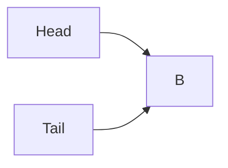
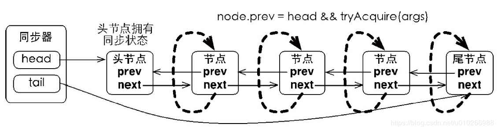

# 原子类

## `AtomicInteger`

一个简单的测试

```java
package concurrent.phase3;

import java.util.HashSet;
import java.util.Set;
import java.util.concurrent.atomic.AtomicInteger;

public class AtomicIntegerTest {

    private static Set<Integer> set = new HashSet<>();

    public static void main(String[] args) throws InterruptedException {
        AtomicInteger value = new AtomicInteger(0);
        Thread t1 = new Thread(() -> {
            int x = 0;
            while (x < 500) {
                int v = value.getAndIncrement();
                set.add(v);
                System.out.println(Thread.currentThread().getName() + ":" + v);
                x++;
            }
        });

        Thread t2 = new Thread(() -> {
            int x = 0;
            while (x < 500) {
                int v = value.getAndIncrement();
                set.add(v);
                System.out.println(Thread.currentThread().getName() + ":" + v);
                x++;
            }
        });

        t1.start();
        t2.start();
        t1.join();
        t2.join();
        System.out.println(set.size());
    }
}
```

作为对比，我们可以将`value`换成普通类型，或者使用`volatile`修饰，会出现并发问题。

**`CAS`**

其实就是快速失败的作用，在`jdk6`中可以看到`getAndSet`方法实现为

```java
public final int getAndSet(int newValue) {
    for (; ; ) {
        int current = get();
        if (compareAndSet(current, newValue)) {
            return current;
        }
    }
}
------
//jdk8已经改成这样了
    public final int getAndSet(int var1) {
    return unsafe.getAndSetInt(this, valueOffset, var1);
}
```

通过代码很好理解，就是在返回值的时候先比较下当前值`current`是否已经被改变，这个`compareAndSet`是在`CPU`层面加锁，会很快，相当于一种无锁的状态。如果当前值一被改变就立即失败重来。

这里实现一个简单的无锁控制

```java
package concurrent.phase3;
import java.util.concurrent.atomic.AtomicInteger;

public class AtomicIntegerTest1 {

    private final AtomicInteger value = new AtomicInteger(0);

    private static final AtomicIntegerTest1 lock = new AtomicIntegerTest1();

    private Thread lockedThread;

    public static void main(String[] args) {
        for (int i = 0; i < 2; i++) {
            new Thread(() -> {
                try {
                    doSomething();
                } catch (Exception e) {
                    e.printStackTrace();
                }
            }).start();
        }
    }

    public static void doSomething() throws Exception {
        try {
            lock.tryLock();
            System.out.println(Thread.currentThread().getName() + " get the lock");
            Thread.sleep(100_000);
        } finally {
            lock.unlock();
        }
    }

    public void tryLock() throws Exception {
        //如果是0，表示锁为释放状态，否则为关闭状态
        boolean success = value.compareAndSet(0, 1);
        if (!success) {
            throw new RuntimeException("Get the lock failed");
        } else {
            lockedThread = Thread.currentThread();
        }
    }

    public void unlock() {
        if (0 == value.get()) {
            return;
        }
        if (lockedThread == Thread.currentThread()) {
            value.compareAndSet(1, 0);
        }
    }
}
```

这里首先会去获取锁，如果获取不到就释放掉当前线程。其他基本类型的原子类基本类似。


## `AtomicReference`

这个类可以让我们自定义的类变成原子类型的

```java
package concurrent.phase3;

import java.util.concurrent.atomic.AtomicReference;

public class AtomicReferenceTest {

    public static void main(String[] args) {
        AtomicReference<Simple> atomic = new AtomicReference<>(new Simple("Alext", 12));
        System.out.println(atomic.get());

        boolean res = atomic.compareAndSet(new Simple("aa", 13), new Simple("bb", 13));
        System.out.println(res);
    }

    static class Simple {

        private String name;
        private int age;

        public Simple() {
        }

        public Simple(String name, int age) {
            this.name = name;
            this.age = age;
        }

        public String getName() {
            return name;
        }

        public void setName(String name) {
            this.name = name;
        }

        public int getAge() {
            return age;
        }

        public void setAge(int age) {
            this.age = age;
        }

        @Override
        public String toString() {
            return "Simple{" +
                "name='" + name + '\'' +
                ", age=" + age +
                '}';
        }
    }
}
```


## `ABA` 问题

本来`CAS`通过检查当前值是否有改变来解决并发问题，但是当一个值变化为 `A->B->A`的时候其实变量值是有变化的，但是此时`CAS`是无法判断出来的，这就会导致问题。


## `AtomicStampedReference`

通过此对象可以解决上面的问题，其中有一个对象`Pair`，其中不仅保存了当前变量的值，还保存了一个时间戳，就算值相同，而时间戳不同也表明变量发生了变化。


## 原子类数组

```
AtomicIntegerArray
AtomicLongArray
AtomicReferenceArray
```

```java
package concurrent.phase3;

import java.util.concurrent.atomic.AtomicIntegerArray;

public class AtomicIntegerArrayTest {

    public static void main(String[] args) {
        AtomicIntegerArray arr = new AtomicIntegerArray(10);
        arr.set(0, 10);
        System.out.println(arr.get(0));
        System.out.println(arr.get(1));
    }
}
```

相关源码分析：`https://www.cnblogs.com/zyy1688/p/10654943.html`

```java
//获取int[]在内存中的初始地址。
private static final int base = unsafe.arrayBaseOffset(int[].class);
//用来存储移位个数
private static final int shift;
private final int[] array;

//初始化变量。
static {
    int scale = unsafe.arrayIndexScale(int[].class);
    if ((scale & (scale - 1)) != 0)
        throw new Error("data type scale not a power of two");
    //得出scale为2的几次方，即需要移位个数
    shift = 31 - Integer.numberOfLeadingZeros(scale);
}
//检查第i个元素的地址值。
private long checkedByteOffset(int i) {
    if (i < 0 || i >= array.length)
        throw new IndexOutOfBoundsException("index " + i);
    return byteOffset(i);
}
//当前索引i*shift(偏移位置) + base(基础位置)
private static long byteOffset(int i) {
    return ((long) i << shift) + base;
}
//获取第i个元素的值
public final int get(int i) {
    return getRaw(checkedByteOffset(i));
}
//通过地址值来获取偏移量的元素值。
private int getRaw(long offset) {
    return unsafe.getIntVolatile(array, offset);
}
//用cas方式，在元素i的位置设置新值
public final void set(int i, int newValue) {
    unsafe.putIntVolatile(array, checkedByteOffset(i), newValue);
}
```

并且数组里面各个元素类别都是相同的，所以占有的空间也都是一样大的，假设上面数组为`int`类型的`array`，并且`array`的地址为`n`，所以可以计算出`array[1]`为`base+4`，`array[2]`为 
`base+4*2`，`array[3]`为`base+4*3` 。 

所以这样在`AtomicIntegerArray`里面，我们可以通过`base，i，scale`和`shift`，能够计算出数组中任意元素的位置以及获取值，这样一来，对数组的操作就可以转化为对单个元素的操作。 
开始被一个问题困扰了一会儿，`array`数组是`final`类型，保证了：

- `array`在使用的时候，已经初始化了
- `array`不能再重新指向其他对象

但是，`array`数组里面并不是`volatile`类型的，能确保可见性么？

我们再来看看它的`get`方法和`set`方法： 

```java
public final int get(int i) {
    return getRaw(checkedByteOffset(i));
}
//volatile的get
private int getRaw(long offset) {
    return unsafe.getIntVolatile(array, offset);
}

//volatile的set
public final void set(int i, int newValue) {
    unsafe.putIntVolatile(array, checkedByteOffset(i), newValue);
}

//lazySet，即普通set，性能高
public final void lazySet(int i, int newValue) {
    unsafe.putOrderedInt(array, checkedByteOffset(i), newValue);
}

//原子性的获取并且set
public int getAndSet(int i, int newValue) {
    return unsafe.getAndSetInt(array, checkedByteOffset(i), newValue);
}
```

如上我们可以看到，调用的都是`unsafe`里面具有`volatile`语义的方法，也就是整个通过内存地址对数组元素的操作，也是有`volatile`语义的，即具有可见性。


## `AtomicIntegerFieldUpdater`

比如有一个类，其中有很多属性，但是我们不想对这个类使用`AtomicStampedReference`来封装，只是想对其中一个属性字段进行原子操作，此时就可以使用此类来完成。

```java
package concurrent.phase3;

import java.util.concurrent.atomic.AtomicIntegerFieldUpdater;

public class Demo01 {

    public static void main(String[] args) {
        final AtomicIntegerFieldUpdater<TestMe> updater =
            AtomicIntegerFieldUpdater.newUpdater(TestMe.class, "i");
        final TestMe me = new TestMe();
        for (int i = 0; i < 2; i++) {
            new Thread(() -> {
                for (int j = 0; j < 20; j++) {
                    int v = updater.getAndIncrement(me);
                    System.out.println(Thread.currentThread().getName() + "->" + v);
                }
            }).start();
        }
    }

    static class TestMe{
        volatile int i ;
    }
}
```

这里要注意，如果属性 `i` 是 `private`(当前类不受此限制)，或者说实例 `me` 为 `null` ，则会报错。当然属性类型和名字如果不对，也会报错，同时要注意，属性字段需要使用 `volatile` 修饰。类似的还有`AtomicLongFieldUpdater、AtomicReferenceFieldUpdater`。**主要使用场景就是比如在对链表等数据结构中使用的时候，在多线程中如果我们直接对整个链表加锁，显然效率是很慢的，此时使用`AtomicIntegerFieldUpdater`就会好很多。**这在`ConcurrentHashMap`中是有用到的。

```java
package concurrent.phase3;

import java.util.concurrent.atomic.AtomicIntegerFieldUpdater;

public class Demo02 {

    private volatile int i ;
    private AtomicIntegerFieldUpdater<Demo02> updater =
        AtomicIntegerFieldUpdater.newUpdater(Demo02.class, "i");

    public void update(int newValue) {
        updater.compareAndSet(this, i, newValue);
    }

    public int get() {
        return i;
    }

    public static void main(String[] args) {
        Demo02 demo02 = new Demo02();
        demo02.update(10);
        System.out.println(demo02.get());
    }
}
```


## `Unsafe`

```java
package concurrent.phase3;

import java.util.concurrent.ExecutorService;
import java.util.concurrent.Executors;
import java.util.concurrent.TimeUnit;
import sun.misc.Unsafe;

public class Demo03 {

    public static void main(String[] args) throws Exception {
        ExecutorService service = Executors.newFixedThreadPool(1000);
//        Counter counter = new StupidCounter();
        Counter counter = new CasCounter();
        long start = System.currentTimeMillis();
        for (int i = 0; i < 1000; i++) {
            service.submit(new CounterRunnable(counter, 10000));
        }
        service.shutdown();
        service.awaitTermination(1, TimeUnit.HOURS);
        long end = System.currentTimeMillis();
        System.out.println("Counter result:" + counter.getCounter());
        System.out.println("cost: " + (end - start));
    }

    interface Counter {

        void increment();

        long getCounter();
    }

    private static class CasCounter implements Counter {

        private volatile long counter = 0;

        private Unsafe unsafe;

        private long offset;

        public CasCounter() throws Exception {
            this.unsafe = Unsafe.getUnsafe();
            this.offset = unsafe.objectFieldOffset(CasCounter.class.getDeclaredField("counter"));
        }

        @Override
        public void increment() {
            long current = counter;
            while (!unsafe.compareAndSwapLong(this, offset, current, current + 1)) {
                current = counter;
            }
        }

        @Override
        public long getCounter() {
            return counter;
        }
    }

    private static class StupidCounter implements Counter {

        private long counter = 0;

        @Override
        public void increment() {
            counter++;
        }

        @Override
        public long getCounter() {
            return counter;
        }
    }

    private static class CounterRunnable implements Runnable {

        private final Counter counter;
        private final int num;

        public CounterRunnable(Counter counter, int num) {
            this.counter = counter;
            this.num = num;
        }

        @Override
        public void run() {
            for (int i = 0; i < num; i++) {
                counter.increment();
            }
        }
    }
}
```

这里有两个实现，对于`StupidCounter`我们还可以在其方法上加锁来进行测试，另外一个实现是使用`Unsafe`类来实现无锁，但是在`jdk8`中无法使用，可以切换到低版本。或者使用反射来获取`Unsafe`。

```java
private static Unsafe getUnsafe() {
    try {
        Field f = Unsafe.class.getDeclaredField("theUnsafe");
        f.setAccessible(true);
        return (Unsafe) f.get(null);
    } catch (Exception e) {
        throw new RuntimeException(e);
    }
}
```

还有一些不推荐的用法

```java
package concurrent.phase3;

import java.io.File;
import java.io.FileInputStream;
import java.lang.reflect.Field;
import sun.misc.Unsafe;

public class Demo04 {

    public static void main(String[] args) throws Exception {
        //此种情况下类会被初始化
        // Simple simple = Simple.class.newInstance();

        //这样则不会被初始化
        //Class.forName("concurrent.phase3.Demo04$Simple");

        //这样也可以绕过初始化
        Unsafe unsafe = getUnsafe();
        //直接开辟了一块内存
        Simple simple = (Simple) unsafe.allocateInstance(Simple.class);
        System.out.println(simple.getI());
        System.out.println("Simple类加载器： " + simple.getClass().getClassLoader());

        System.out.println("-----------------");

        Guard guard = new Guard();
        //此时是不会输出的
        guard.work();
        //这里通过Unsafe改变内存中ACCESS_ALLOWED的值
        Field field = guard.getClass().getDeclaredField("ACCESS_ALLOWED");
        //这里第一个参数是guard类实例，然后第二个参数是字段属性的偏移量，这样就可以找到
        //该属性所在内存中的位置，然后将值设置进去
        unsafe.putInt(guard, unsafe.objectFieldOffset(field), 42);
        guard.work();

        System.out.println("-----------------");

        //使用Unsafe跳过类加载器加载一个类，不过会初始化
        byte[] bytes = loadClassContent();
        Class<?> clazz = unsafe.defineClass(null, bytes, 0, bytes.length, null, null);
        Integer value = (Integer) clazz.getMethod("getI").invoke(clazz.newInstance(), null);
        System.out.println(value);

        System.out.println("-----------------");
    }

    private static byte[] loadClassContent() throws Exception{
        File file = new File("D:\\Simple.class");
        FileInputStream fis = new FileInputStream(file);
        byte[] content = new byte[(int) file.length()];
        fis.read(content);
        fis.close();
        return content;
    }

    private static Unsafe getUnsafe() {
        try {
            Field f = Unsafe.class.getDeclaredField("theUnsafe");
            f.setAccessible(true);
            return (Unsafe) f.get(null);
        } catch (Exception e) {
            throw new RuntimeException(e);
        }
    }

    private static class Simple {

        private long i = 0;

        public Simple() {
            this.i = 1;
            System.out.println("初始化: " + i);
        }

        public long getI() {
            return i;
        }
    }

    private static class Guard {

        private int ACCESS_ALLOWED = 1;

        private boolean allow() {
            return 42 == ACCESS_ALLOWED;
        }

        public void work() {
            if (allow()) {
                System.out.println("允许执行");
            }
        }

    }
}
```

这里相关方法不推荐使用，但是需要理解，因为在后面的`AQS`中有用到，特别是获取到一个实例对象的某个字段在内存中的偏移量，通过这个偏移量我们可以拿到该字段在内存中的位置。


# `AQS`

并发包基本都是基于`AQS`，这里先看下`AQS`的基本实现

| 属性              | 解释                                                         |
| ----------------- | ------------------------------------------------------------ |
| `int waitStatus`  | 1）`CANCELLED = 1`，表示当前结点已取消调度。当`timeout`或被中断（响应中断的情况下），<br/>会触发变更为此状态，进入该状态后的结点将不会再变化。<br/>2）`SIGNAL = -1`，表示后继结点在等待当前结点唤醒。后继结点入队时，会将前继结点的状态更新为`SIGNAL`。<br/>3）`CONDITION = -2`，表示结点等待在`Condition`上，当其他线程调用了`Condition`的`signal()`方法后，<br/>`CONDITION`状态的结点将从等待队列转移到同步队列中，等待获取同步锁；<br/>4）`PROPAGATE = -3`，共享模式下，前继结点不仅会唤醒其后继结点，同时也可能会唤醒后继的后继结点，一直往后；<br/>5）`INITIAL = 0`，初始状态 |
| `Node prev`       | 前驱节点(`predecessor`)                                      |
| `Node next`       | 后继节点(`successor`)                                        |
| `Node nextWaiter` | 等待队列中的后继节点，如果当前节点是共享的，就是`SHARED`，否则是独享的`EXCLUSIVE` |
| `Thread thread`   | 获取同步状态的线程                                           |


`AQS`的实现依赖内部的同步队列（`FIFO`双向队列），如果当前线程获取同步状态失败，`AQS`会将该线程以及等待状态等信息构造成一个`Node`，将其加入同步队列的尾部，同时阻塞当前线程，当同步状态释放时，唤醒队列的头节点。

上面说的有点抽象，来具体看下，首先来看`AQS`最主要的三个成员变量：

```
    private transient volatile Node head;
    
    private transient volatile Node tail;

    private volatile int state; 
```


上面提到的同步状态就是这个`int`型的变量`state`。`head`和`tail`分别是同步队列的头结点和尾结点。假设`state=0`表示同步状态可用（如果用于锁，则表示锁可用），`state=1`表示同步状态已被占用（锁被占用）。

下面举例说下获取和释放同步状态的过程：

**获取同步状态**

假设线程`A`要获取同步状态（这里想象成锁，方便理解），初始状态下`state=0`,所以线程A可以顺利获取锁，`A`获取锁后将`state`置为1。在`A`没有释放锁期间，线程`B`也来获取锁，此时因为`state=1`，表示锁被占用，所以将`B`的线程信息和等待状态等信息构成出一个`Node`节点对象，放入同步队列，`head`和`tail`分别指向队列的头部和尾部（此时队列中有一个空的`Node`节点作为头点，`head`指向这个空节点，空`Node`的后继节点是`B`对应的`Node`节点，`tail`指向它），同时阻塞线程B(这里的阻塞使用的是`LockSupport.park()`方法)。后续如果再有线程要获取锁，都会加入队列尾部并阻塞。




**释放同步状态**

当线程`A`释放锁时，即将`state`置为`0`，此时A会唤醒头节点的后继节点（所谓唤醒，其实是调用`LockSupport.unpark(B)`方法），即`B`线程从`LockSupport.park()`方法返回，此时`B`发现`state`已经为0，所以B线程可以顺利获取锁，`B`获取锁后`B`的`Node`节点随之出队。




总体逻辑就是：每个节点只关注自己的前驱节点，如果前驱节点是`head`，那就说明当前节点可以去抢锁了，用`tryAcquire`去抢。

要是抢到了，就把这个节点作为`head`，同时移除掉原有的`head`。（`head`节点是没有数据的，就是一个队列起始的标志）。于是下一个节点成为了`head`指向的节点。那要是没抢到呢？那就看看自己是不是可以休息了：`shouldParkAfterFailedAcquire`，如果能休息就`park`进入`waiting`状态,直到被`unpark`。


## 独占锁

（1）获取锁的实现

`AQS`的锁功能齐全，它既可以用来实现独占锁，也可以用来实现共享锁。

* 独占锁：也叫排他锁，即锁只能由一个线程获取，若一个线程获取了锁，则其他想要获取锁的线程只能等待，直到锁被释放。比如说写锁，对于写操作，每次只能由一个线程进行，若多个线程同时进行写操作，将很可能出现线程安全问题；

* 共享锁：锁可以由多个线程同时获取，锁被获取一次，则锁的计数器+1。比较典型的就是读锁，读操作并不会产生副作用，所以可以允许多个线程同时对数据进行读操作，而不会有线程安全问题，当然，前提是这个过程中没有线程在进行写操作；

我们首先分析一下独占锁。在`AQS`中，通过方法`acquire`来获取独占锁，`acquire`方法的代码如下：

```java
public final void acquire(int arg) {
    if (!tryAcquire(arg) &&
        acquireQueued(addWaiter(Node.EXCLUSIVE), arg))
        selfInterrupt();
}
```

* 首先调用`tryAcquire`尝试获取一次锁，若返回`true`，表示获取成功，则`acquire`方法将直接返回；若返回`false`，则会继续向后执行`acquireQueued`方法；

* `tryAcquire`返回`false`后，将执行`acquireQueued`，但是这个方法传入的参数调用了`addWaiter`方法；

* `addWaiter`方法的作用是将当前线封装成同步队列的节点，然后加入到同步队列的尾部进行排队，并返回此节点；

* `addWaiter`方法执行完成后，将它的返回值作为参数，调用`acquireQueued`方法。`acquireQueued`方法的作用是让当前线程在同步队列中阻塞，然后在被其他线程唤醒时去获取锁；

* 若线程被唤醒并成功获取锁后，将从`acquireQueued`方法中退出，同时返回一个boolean值表示当前线程是否被中断，若被中断，则会执行下面的`selfInterrupt`方法，响应中断；

下面我们就来具体分析这个方法中调用的几个方法的执行流程。首先第一个`tryAcquire`方法是一个抽象方法，需要子类来实现，这里应用了模板模式。

```java
// 将线程封装成一个节点，放入同步队列的尾部
private Node addWaiter(Node mode) {
    // 当前线程封装成同步队列的一个节点Node
    Node node = new Node(Thread.currentThread(), mode);
    // 这个节点需要插入到原尾节点的后面，所以我们在这里先记下原来的尾节点
    Node pred = tail;
    // 判断尾节点是否为空，若为空表示队列中还没有节点，则不执行以下步骤
    if (pred != null) {
        // 记录新节点的前一个节点为原尾节点
        node.prev = pred;
        // 将新节点设置为新尾节点，使用CAS操作保证了原子性
        if (compareAndSetTail(pred, node)) {
            // 若设置成功，则让原来的尾节点的next指向新尾节点
            pred.next = node;
            return node;
        }
    }
    // 若以上操作失败，则调用enq方法继续尝试(enq方法见下面)
    enq(node);
    return node;
}

private Node enq(final Node node) {
    // 使用死循环不断尝试
    for (;;) {
        // 记录原尾节点
        Node t = tail;
        // 若原尾节点为空，则必须先初始化同步队列，初始化之后，下一次循环会将新节点加入队列
        if (t == null) { 
            // 使用CAS设置创建一个默认的节点作为首节点
            if (compareAndSetHead(new Node()))
                // 首尾指向同一个节点
                tail = head;
        } else {
            // 以下操作与addWaiter方法中的if语句块内一致
            node.prev = t;
            if (compareAndSetTail(t, node)) {
                t.next = node;
                return t;
            }
        }
    }
}
```

它的执行过程大致可以总结为：将新线程封装成一个节点，加入到同步队列的尾部，若同步队列为空，则先在其中加入一个默认的节点，再进行加入；若加入失败，则使用死循环（也叫自旋）不断尝试，直到成功为止。这个过程中使用`CAS`保证了添加节点的原子性。下面看看`acquireQueued`方法的源码：

```java
/**
 * 让线程不间断地获取锁，若线程对应的节点不是头节点的下一个节点，则会进入等待状态
 */
final boolean acquireQueued(final Node node, int arg) {
    // 记录失败标志
    boolean failed = true;
    try {
        // 记录中断标志，初始为true
        boolean interrupted = false;
        // 循环执行，因为线程在被唤醒后，可能再次获取锁失败，需要重写进入等待
        for (;;) {
            // 获取当前线程节点的前一个节点
            final Node p = node.predecessor();
            // 若前一个节点是头节点，则tryAcquire尝试获取锁，若获取成功，则执行if中的代码
            //只有当前线程的前一个节点时头节点时才能去获取锁
            if (p == head && tryAcquire(arg)) {
                // 将当前节点设置为头节点
                setHead(node);
                // 将原来的头节点移出同步队列
                p.next = null; // help GC
                // 失败标志置为false
                failed = false;
                // 返回中断标志，acquire方法可以根据返回的中断标志，判断当前线程是否被中断
                return interrupted;
            }
            // shouldParkAfterFailedAcquire方法判断当前线程是否能够进入等待状态，
            // 若当前线程的节点不是头节点的下一个节点，则需要进入等待状态，
            // 在此方法内部，当前线程会找到它的前驱节点中，第一个还在正常等待或执行的节点，
            // 让其作为自己的直接前驱，然后在需要时将自己唤醒（因为其中有些线程可能被中断），
            // 若找到，则返回true，表示自己可以进入等待状态了；
            
            // 然后继续调用parkAndCheckInterrupt方法，当前线程在这个方法中等待，
            // 直到被其他线程唤醒，或者被中断后返回，返回时将返回一个boolean值，
            // 表示这个线程是否被中断，若为true，则将执行下面一行代码，将中断标志置为true
            if (shouldParkAfterFailedAcquire(p, node) &&
                parkAndCheckInterrupt())
                interrupted = true;
        }
    } finally {
        // 上面代码中只有一个return语句，且return的前一句就是failed = false;
        // 所以只有当异常发生时，failed才会保持true的状态运行到此处；
        // 异常可能是线程被中断，也可能是其他方法中的异常，
        // 比如我们自己实现的tryAcquire方法
        // 此时将取消线程获取锁的动作，将它从同步队列中移除
        if (failed)
            cancelAcquire(node);
    }
}
```

以上就是`acquireQueued`方法的源码分析。这个方法的作用可以概括为：让线程在同步队列中阻塞，直到它成为头节点的下一个节点，被头节点对应的线程唤醒，然后开始获取锁，若获取成功才会从方法中返回。这个方法会返回一个`boolean`值，表示这个正在同步队列中的线程是否被中断。

```java
private static boolean shouldParkAfterFailedAcquire(Node pred, Node node) {
    int ws = pred.waitStatus;
    if (ws == Node.SIGNAL)
        /*
        * 这里就是说，前驱节点的等待状态时SIGNAL，执行完了会通知当前节点，此时当前节点可以休息了
        */
        return true;
    if (ws > 0) {
        /*
         * 前驱节点状态 > 0，回头看看开始的表格，只有CANCELED是1大于0，表示前驱节点取消了，
         * 此时一直往前找，直到找到一个状态<=0（没被取消）的节点，放它后面
        */
        do {
            node.prev = pred = pred.prev;
        } while (pred.waitStatus > 0);
        pred.next = node;
    } else {
        /*
        * ws < 0，就是说前驱节点是正常的，那就把前驱节点状态设置成SIGNAL，让前驱节点执行完后通知当前节点
        */
        compareAndSetWaitStatus(pred, ws, Node.SIGNAL);
    }
    return false;
}
```

后面的`parkAndCheckInterrupt`方法会将线程中断，进入等待状态，这和调用`Thread.interrupted()`不同，此方法只是设置中断状态为`true`，并不一定真的中断线程，而`parkAndCheckInterrupt`是给`CPU`发送指令进行中断，然后会检查中断状态。

（2）释放锁

释放独占锁是通过release方法实现的：

```java
public final boolean release(int arg) {
    // 调用tryRelease尝试修改state释放锁，若成功，将返回true，否则false
    if (tryRelease(arg)) {
        // 若修改state成功，则表示释放锁成功，需要将当前线程移出同步队列
        // 当前线程在同步队列中的节点就是head，所以此处记录head
        Node h = head;
        // 若head不是null，且waitStatus不为0，表示它是一个装有线程的正常节点，
        // 在之前提到的addWaiter方法中，若同步队列为空，则会创建一个默认的节点放入head
        // 这个默认的节点不包含线程，它的waitStatus就是0，所以不能释放锁
        if (h != null && h.waitStatus != 0)
            // 若head是一个正常的节点，则调用unparkSuccessor唤醒它的下一个节点所对应的线程
            unparkSuccessor(h);
        // 释放成功
        return true;
    }
    // 释放锁失败
    return false;
}
```


```java
private void unparkSuccessor(Node node) {
    int ws = node.waitStatus;
    if (ws < 0)
        //清空当前节点的状态为初始状态0
        compareAndSetWaitStatus(node, ws, 0);

    Node s = node.next;
    //如果后继节点为空，或者已经被取消
    if (s == null || s.waitStatus > 0) {
        s = null;
        //从后向前遍历，找到最前面的一个等待的线程节点，因为这里后继节点为空
        //没法从前向后遍历
        for (Node t = tail; t != null && t != node; t = t.prev)
            if (t.waitStatus <= 0)
                s = t;
    }
    //后继节点不为空就直接唤醒
    if (s != null)
        LockSupport.unpark(s.thread);
}
```


## 共享锁

（1）获取锁

在`AQS`中，定义了`acquireShared`方法用来获取共享锁：

```java
public final void acquireShared(int arg) {
    if (tryAcquireShared(arg) < 0)
        doAcquireShared(arg);
}
```

可以看到，这个方法比较简短。首先调用`tryAcquireShared`方法尝试获取一次共享锁，即修改`state`的值，若返回值`>=0`，则表示获取成功，线程不受影响，继续向下执行；若返回值小于0，表示获取共享锁失败，则线程需要进入到同步队列中等待，调用`doAcquireShared`方法。`acquireShared`方法也是`AQS`的一个模板方法，而其中的`tryAcquireShared`方法就是需要使用者自己实现的方法。下面我们来看看`doAcquireShared`方法的实现：

```java
/**
 * 不间断地获取共享锁，若线程对应的节点不是头节点的下一个节点，将进入等待状态
 * 实现与acquireQueued非常类似
 * @param arg the acquire argument
 */
private void doAcquireShared(int arg) {
    // 往同步队列的尾部添加一个默认节点，Node.SHARED是一个Node常量，
    // 它的值就是一个不带任何参数的Node对象，也就是new Node();
    final Node node = addWaiter(Node.SHARED);
    // 失败标志，默认为true
    boolean failed = true;
    try {
        // 中断标志，用来判断线程在等待的过程中释放被中断
        boolean interrupted = false;
        // 死循环不断尝试获取共享锁
        for (;;) {
            // 获取默认节点的前一个节点
            final Node p = node.predecessor();
            // 判断当前节点的前一个节点是否为head节点
            if (p == head) {
                // 尝试获取共享锁
                int r = tryAcquireShared(arg);
                // 若r>0，表示获取成功
                if (r >= 0) {
                    // 当前线程获取锁成功后，调用setHeadAndPropagate方法将当前线程设置为head
                    // 同时，若共享锁还能被其他线程获取，则在这个方法中也会向后传递，唤醒后面的线程
                    setHeadAndPropagate(node, r);
                    // 将原来的head的next置为null
                    p.next = null; // help GC
                    // 判断当前线程是否中断，若被中断，则调用selfInterrupt方法响应中断
                    if (interrupted)
                        selfInterrupt();
                    // 失败标志置为false
                    failed = false;
                    return;
                }
            }
            // 以下代码和获取独占锁的acquireQueued方法相同，即让当前线程进入等待状态
            // 具体解析可以看上面acquireQueued方法的解析
            if (shouldParkAfterFailedAcquire(p, node) &&
                parkAndCheckInterrupt())
                interrupted = true;
        }
    } finally {
        if (failed)
            cancelAcquire(node);
    }
}
```

`doAcquireShared`方法的实现和获取独占锁中的`acquireQueued`方法很类似，但是主要有一点不同，那就是**线程在被唤醒后，若成功获取到了共享锁，还需要判断共享锁是否还能被其他线程获取，若可以，则继续向后唤醒它的下一个节点对应的线程**。


（2）释放锁

```java
public final boolean releaseShared(int arg) {
    // 尝试修改state的值释放锁
    if (tryReleaseShared(arg)) {
        // 若成功，则调用以下方法唤醒后继节点中的线程
        doReleaseShared();
        return true;
    }
    return false;
}
```

`releaseShared`也是一个模板方法，它通过调用使用者自己实现的`tryReleaseShared`方法尝试释放锁，修改`state`的值，若返回`true`，表示修改成功，则继续向下调用`doReleaseShared`唤醒`head`的下一个节点对应的线程，让它开始尝试获取锁；若修改`state`失败，则返回`false`。

```java
private void doReleaseShared() {
    for (;;) {
        Node h = head;
        if (h != null && h != tail) {
            int ws = h.waitStatus;
            if (ws == Node.SIGNAL) {
                if (!compareAndSetWaitStatus(h, Node.SIGNAL, 0))
                    continue;            // loop to recheck cases
                //释放下一个节点
                unparkSuccessor(h);
            }
            else if (ws == 0 &&
                     !compareAndSetWaitStatus(h, 0, Node.PROPAGATE))
                continue;                // loop on failed CAS
        }
        if (h == head)                   // loop if head changed
            break;
    }
}
```

这里要注意最后的判断，这里是为了防止在新节点加入的过程中头节点发生了变化，所以需要比较，如果没变就直接释放，否则需要再次循环一次。


# `CountDownLatch`

基本使用在第二阶段中已讲

```java
package concurrent.phase2;

import java.util.Random;
import java.util.concurrent.CountDownLatch;
import java.util.stream.IntStream;

public class Client7 {

    private static final Random random = new Random(1000);

    public static void main(String[] args) {
        CountDownLatch latch = new CountDownLatch(5);
        System.out.println("第一阶段任务多线程处理");
        IntStream.rangeClosed(1, 5).forEach(i -> {
            new Thread(() -> {
                System.out.println(Thread.currentThread().getName() + " is working");
                try {
                    Thread.sleep(random.nextInt(100));
                } catch (InterruptedException e) {
                    e.printStackTrace();
                } finally {
                    latch.countDown();
                }
            }, String.valueOf(i)).start();
        });
        try {
            //注意这里不是wait，而是await
            latch.await();
        } catch (InterruptedException e) {
            e.printStackTrace();
        }
        System.out.println("等待第一阶段多线程全部执行完成，第二阶段任务处理");
        System.out.println("finish");
    }
}
```

上面可以看到当计数器值达到0的时候会不再等待，还有另一种方式可以让其不再等待，就是调用`await`的线程（此处为主线程）中断可以，只是会抛出一个异常。

源码分析：

```java
package java.util.concurrent;
import java.util.concurrent.locks.AbstractQueuedSynchronizer;

public class CountDownLatch {

    private static final class Sync extends AbstractQueuedSynchronizer {
        private static final long serialVersionUID = 4982264981922014374L;

        Sync(int count) {
            setState(count);
        }

        int getCount() {
            return getState();
        }

        protected int tryAcquireShared(int acquires) {
            return (getState() == 0) ? 1 : -1;
        }

        protected boolean tryReleaseShared(int releases) {
            // 这里尝试去设置锁状态，成功后才真正由AQS去执行状态减一操作
            for (;;) {
                int c = getState();
                if (c == 0)
                    return false;
                int nextc = c-1;
                if (compareAndSetState(c, nextc))
                    return nextc == 0;
            }
        }
    }

    private final Sync sync;

    public boolean await(long timeout, TimeUnit unit)
        throws InterruptedException {
        return sync.tryAcquireSharedNanos(1, unit.toNanos(timeout));
    }

    /**
     * Decrements the count of the latch, releasing all waiting threads if
     * the count reaches zero.
     *
     * <p>If the current count is greater than zero then it is decremented.
     * If the new count is zero then all waiting threads are re-enabled for
     * thread scheduling purposes.
     *
     * <p>If the current count equals zero then nothing happens.
     */
    public void countDown() {
        sync.releaseShared(1);
    }
}
```

这里主要注意到是`Sync.tryReleaseShared`，这里是实现了`AQS`中的方法，这里传入值为1，每次释放锁的时候减一，这是使用了`AQS`中的共享锁机制。

下面看一个例子，比如有一个需要更新表字段的操作，这里我们需要更新表的`recordCount`和`clomnSchema`，有目标值和原始值，同时每更新完一个字段会给出一个事件对象来进行通知

```java
package concurrent.phase3;

import java.util.ArrayList;
import java.util.List;
import java.util.concurrent.ExecutorService;
import java.util.concurrent.Executors;

public class Demo05 {

    public static void main(String[] args) {
        Event[] events = new Event[]{new Event(1), new Event(2)};
        ExecutorService pool = Executors.newFixedThreadPool(5);
        for (Event event : events) {
            List<Table> tables = capture(event);
            for (Table table : tables) {
                TrustSourceColumn trustSourceColumn = new TrustSourceColumn(table);
                TrustSourceRecordCount trustSourceRecordCount = new TrustSourceRecordCount(table);
                pool.submit(trustSourceColumn);
                pool.submit(trustSourceRecordCount);
            }
        }
    }

    static class Event {

        int id;

        public Event(int id) {
            this.id = id;
        }
    }

    static class Table {

        String tableName;
        long sourceRecordCount = 10;
        long targetCount;
        String sourceColumnSchema = "<table name = a><column name='coll' type='varchar2'/></table>";
        String targetColumnSchema = "";

        public Table(String tableName, long sourceRecordCount) {
            this.tableName = tableName;
            this.sourceRecordCount = sourceRecordCount;
        }
    }

    private static List<Table> capture(Event event) {
        List<Table> list = new ArrayList<>(10);
        for (int i = 0; i < 10; i++) {
            list.add(new Table("table-" + event.id + "-" + i, i * 1000));
        }
        return list;
    }

    static class TrustSourceColumn implements Runnable {

        private final Table table;

        public TrustSourceColumn(Table table) {
            this.table = table;
        }

        @Override
        public void run() {
            try {
                Thread.sleep(10000);
            } catch (InterruptedException e) {
                e.printStackTrace();
            }
            table.targetColumnSchema = table.sourceColumnSchema;
            System.out.println("The table " + table.tableName + " target columns capture done and update.");
        }
    }

    static class TrustSourceRecordCount implements Runnable {

        private final Table table;

        public TrustSourceRecordCount(Table table) {
            this.table = table;
        }

        @Override
        public void run() {
            try {
                Thread.sleep(10000);
            } catch (InterruptedException e) {
                e.printStackTrace();
            }
            table.targetCount = table.sourceRecordCount;
            System.out.println("The table " + table.tableName + " target record count capture done and update.");
        }
    }
}
```

这里每捕获到一个事件我们就去更新相关字段，但是这里会发现其实一个表的两个字段很显然是可以同时更新的，这样会提高效率。这里进行改造

```java
package concurrent.phase3;

import java.util.ArrayList;
import java.util.List;
import java.util.concurrent.CountDownLatch;
import java.util.concurrent.ExecutorService;
import java.util.concurrent.Executors;

public class Demo05 {

    public static void main(String[] args) {
        Event[] events = new Event[]{new Event(1), new Event(2)};
        ExecutorService pool = Executors.newFixedThreadPool(5);
        for (Event event : events) {
            List<Table> tables = capture(event);
            for (Table table : tables) {
                TaskBatch taskBatch = new TaskBatch(2);
                TrustSourceColumn trustSourceColumn = new TrustSourceColumn(table, taskBatch);
                TrustSourceRecordCount trustSourceRecordCount = new TrustSourceRecordCount(table, taskBatch);
                pool.submit(trustSourceColumn);
                pool.submit(trustSourceRecordCount);
            }
        }
    }

    interface Watcher {

        void done(Table table);
    }

    static class TaskBatch implements Watcher {

        private CountDownLatch latch;

        public TaskBatch(int size) {
            this.latch = new CountDownLatch(size);
        }

        @Override
        public void done(Table table) {
            latch.countDown();
            if (latch.getCount() == 0) {
                System.out.println("The table " + table.tableName + " finished the work,[" + table + "]");
            }
        }
    }

    static class Event {

        int id;

        public Event(int id) {
            this.id = id;
        }
    }

    static class Table {

        String tableName;
        long sourceRecordCount = 10;
        long targetCount;
        String sourceColumnSchema = "<table name = a><column name='coll' type='varchar2'/></table>";
        String targetColumnSchema = "";

        public Table(String tableName, long sourceRecordCount) {
            this.tableName = tableName;
            this.sourceRecordCount = sourceRecordCount;
        }

        @Override
        public String toString() {
            return "Table{" +
                "tableName='" + tableName + '\'' +
                ", sourceRecordCount=" + sourceRecordCount +
                ", targetCount=" + targetCount +
                ", sourceColumnSchema='" + sourceColumnSchema + '\'' +
                ", targetColumnSchema='" + targetColumnSchema + '\'' +
                '}';
        }
    }

    private static List<Table> capture(Event event) {
        List<Table> list = new ArrayList<>(10);
        for (int i = 0; i < 10; i++) {
            list.add(new Table("table-" + event.id + "-" + i, i * 1000));
        }
        return list;
    }

    static class TrustSourceColumn implements Runnable {

        private final Table table;
        private TaskBatch taskBatch;

        public TrustSourceColumn(Table table, TaskBatch taskBatch) {
            this.table = table;
            this.taskBatch = taskBatch;
        }

        @Override
        public void run() {
            try {
                Thread.sleep(10000);
            } catch (InterruptedException e) {
                e.printStackTrace();
            }
            table.targetColumnSchema = table.sourceColumnSchema;
//            System.out.println("The table " + table.tableName + " target columns capture done and update.");
            taskBatch.done(table);
        }
    }

    static class TrustSourceRecordCount implements Runnable {

        private final Table table;
        private TaskBatch taskBatch;

        public TrustSourceRecordCount(Table table, TaskBatch taskBatch) {
            this.table = table;
            this.taskBatch = taskBatch;
        }

        @Override
        public void run() {
            try {
                Thread.sleep(10000);
            } catch (InterruptedException e) {
                e.printStackTrace();
            }
            table.targetCount = table.sourceRecordCount;
//            System.out.println("The table " + table.tableName + " target record count capture done and update.");
            taskBatch.done(table);
        }
    }
}
```


# `CyclicBarrier`

`CyclicBarrier`有两个构造函数

```cpp
public CyclicBarrier(int parties)
public CyclicBarrier(int parties, Runnable barrierAction)
```

第一个参数，表示那个一起执行的线程个数。
第二个参数，表示线程都处于`barrier`时，一起执行之前，先执行的一个线程。


举个报旅行团旅行的例子。出发时，导游会在机场收了护照和签证，办理集体出境手续，所以，要等大家都到齐才能出发，出发前再把护照和签证发到大家手里。对应`CyclicBarrier`使用。每个人到达后进入`barrier`状态。都到达后，唤起大家一起出发去旅行。旅行出发前，导游还会有个发护照和签证的动作。


```java
package concurrent.phase3;

import java.util.concurrent.CyclicBarrier;
import java.util.concurrent.ExecutorService;
import java.util.concurrent.Executors;

public class Demo06 {

    public static void main(String[] args) throws Exception {

        CyclicBarrier cyclicBarrier = new CyclicBarrier(3, new TourGuideTask());
        ExecutorService executor = Executors.newFixedThreadPool(3);
        //登哥最大牌，到的最晚
        executor.submit(new TravelTask(cyclicBarrier, "哈登", 5));
        executor.submit(new TravelTask(cyclicBarrier, "保罗", 3));
        executor.submit(new TravelTask(cyclicBarrier, "戈登", 1));
        executor.shutdown();
    }

    /**
     * 旅行线程
     */
    private static class TravelTask implements Runnable {

        private CyclicBarrier cyclicBarrier;
        private String name;
        private int arriveTime;//赶到的时间

        public TravelTask(CyclicBarrier cyclicBarrier, String name, int arriveTime) {
            this.cyclicBarrier = cyclicBarrier;
            this.name = name;
            this.arriveTime = arriveTime;
        }

        @Override
        public void run() {
            try {
                //模拟达到需要花的时间
                Thread.sleep(arriveTime * 1000);
                System.out.println(name + "到达集合点");
                cyclicBarrier.await();
                System.out.println(name + "开始旅行啦～～");
            } catch (Exception e) {
                e.printStackTrace();
            }
        }
    }

    /**
     * 导游线程，都到达目的地时，发放护照和签证
     */
    private static class TourGuideTask implements Runnable {

        @Override
        public void run() {
            System.out.println("****导游分发护照签证****");
            try {
                //模拟发护照签证需要2秒
                Thread.sleep(2000);
            } catch (InterruptedException e) {
                e.printStackTrace();
            }
        }
    }
}
```

这里要注意，和`CountDownLatch`不同的是，`CyclicBarrier`可以重置，在任务还没有到达同一个目标点的时候就可以使用`reset`方法重置，此时会抛出一个`BrokenBarrierException`异常。源码中主要关注`await`方法

```java
public int await() throws InterruptedException, BrokenBarrierException {
    try {
        return dowait(false, 0L);
    } catch (TimeoutException toe) {
        throw new Error(toe); // cannot happen
    }
}

private int dowait(boolean timed, long nanos)
    throws InterruptedException, BrokenBarrierException,
TimeoutException {
    final ReentrantLock lock = this.lock;
    lock.lock();
    try {
        final Generation g = generation;

        if (g.broken)
            throw new BrokenBarrierException();

        if (Thread.interrupted()) {
            breakBarrier();
            throw new InterruptedException();
        }

        int index = --count;
        //index为0表示所有线程都已到达栅栏，可以释放锁了
        if (index == 0) {  // tripped
            boolean ranAction = false;
            try {
                final Runnable command = barrierCommand;
                //这里就是我们设置的线程，如果有则要先运行
                if (command != null)
                    command.run();
                ranAction = true;
                //唤醒所有线程，释放锁
                nextGeneration();
                return 0;
            } finally {
                if (!ranAction)
                    breakBarrier();
            }
        }

        // 这里要注意：loop until tripped, broken, interrupted, or timed out
        for (;;) {
            try {
                if (!timed)
                    trip.await();
                else if (nanos > 0L)
                    nanos = trip.awaitNanos(nanos);
            } catch (InterruptedException ie) {
                if (g == generation && ! g.broken) {
                    breakBarrier();
                    throw ie;
                } else {
                    Thread.currentThread().interrupt();
                }
            }

            if (g.broken)
                throw new BrokenBarrierException();

            if (g != generation)
                return index;

            if (timed && nanos <= 0L) {
                //打开栅栏
                breakBarrier();
                throw new TimeoutException();
            }
        }
    } finally {
        lock.unlock();
    }
}
```

从这里可以看出，其实也是使用了一个计数，同时使用了可重入锁`Reentrant、Condition`来进行加锁。


# `Exchanger`

这个工具主要用来两个线程之间交换信息，基本用法如下

```java
package concurrent.phase3;

import java.util.concurrent.Exchanger;
import java.util.concurrent.TimeUnit;

public class Demo07 {

    public static void main(String[] args) {
        Exchanger<String> exchanger = new Exchanger<>();
        new Thread(() -> {
            try {
                System.out.println(Thread.currentThread().getName() + " start");
                String exchange = exchanger.exchange(" I come from " + Thread.currentThread().getName());
                System.out.println("Hi " + Thread.currentThread().getName() + exchange);
                System.out.println(Thread.currentThread().getName() + " end");
            } catch (InterruptedException e) {
                e.printStackTrace();
            }
        }, "Thread1").start();

        new Thread(() -> {
            try {
                System.out.println(Thread.currentThread().getName() + " start");
                TimeUnit.SECONDS.sleep(10);
                String exchange = exchanger.exchange(" I come from " + Thread.currentThread().getName());
                System.out.println("Hi " + Thread.currentThread().getName() + exchange);
                System.out.println(Thread.currentThread().getName() + " end");
            } catch (InterruptedException e) {
                e.printStackTrace();
            }
        }, "Thread2").start();
    }

}
```


# `Semaphore`


# `Lock`


# `ReadWriteLock`


# `ForkJoin`


# `Phaser`


# `Condition`


# `ReentrantLock`

