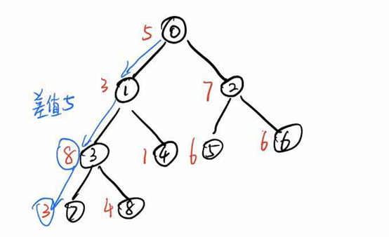

# 1、题一

`shopee`的办公室非常大，小虾同学的位置坐落在右上角，而大门却在左下角，可以把所有位置抽象为一个网格（门口的坐标为`0，0`），小虾同学很聪明，每次只向上，或者向右走，因为这样最容易接近目的地，但是小虾同学不想让自己的`boss`们看到自己经常在他们面前出没，或者迟到被发现。他决定研究一下如果他不通过`boss`们的位置，他可以有多少种走法？

**输入描述:**

```
第一行 x,y,n (0<x<=30, 0<y<=30, 0<=n<= 20) 表示x,y小虾的座位坐标,n 表示boss的数量（ n <= 20）

接下来有n行, 表示boss们的坐标(0<xi<= x, 0<yi<=y，不会和小虾位置重合)

x1, y1
x2, y2

……

xn, yn
```


**输出描述:**

```
输出小虾有多少种走法

输入例子1:
3 3 2
1 1
2 2

输出例子1:
4
```


# 2、题二

`shopee`的零食柜，有着各式各样的零食，但是因为贪吃，小虾同学体重日益增加，终于被人叫为小胖了，他终于下定决心减肥了，他决定每天晚上去操场跑两圈，但是跑步太累人了，他想转移注意力，忘记痛苦，正在听着音乐的他，突然有个想法，他想跟着音乐的节奏来跑步，音乐有7种音符，对应的是1到7，那么他对应的步长就可以是1-7分米，这样的话他就可以转移注意力了，但是他想保持自己跑步的速度，在规定时间m分钟跑完。为了避免被累死，他需要规划他每分钟需要跑过的音符，这些音符的步长总和要尽量小。下面是小虾同学听的歌曲的音符，以及规定的时间，你能告诉他每分钟他应该跑多少步长？


**输入描述:**

```
输入的第一行输入 n（1 ≤ n ≤ 1000000，表示音符数），m（1<=m< 1000000, m <= n）组成，
第二行有 n 个数，表示每个音符（1<= f <= 7）
```


**输出描述:**

```
输出每分钟应该跑的步长

输入例子1:
8 5
6 5 6 7 6 6 3 1

输出例子1:
11

例子说明1:
6 | 5 6 | 7 | 6 | 6 3 1  为最优解

如果小于11，必然分段大于5
```


# 3、题三

在`Linux Shell`命令下通配符'*'表示0个或多个字符, 现编写一段代码实现通配符'*'的功能，注意只需要实现'*', 不用实现其他通配符。

**输入描述:**

```
第一行输入通配字符串
第二行输入要匹配查找的字符串
```


**输出描述:**

```
输出所有匹配的字串起始位置和长度，每行一个匹配输出
如果不匹配，则输出 -1 0
如果有多个按照起始位置和长度的正序输出。

输入例子1:
shopee*.com
shopeemobile.com

输出例子1:
0 16

例子说明1:
0 起始位置，16长度

输入例子2:
*.com
shopeemobile.com

输出例子2:
0 16
1 15
2 14
3 13
4 12
5 11
6 10
7 9
8 8
9 7
10 6
11 5
12 4

输入例子3:
o*m
shopeemobile.com

输出例子3:
2 5
2 14
7 9
14 2
```


# 4、题四

`Shopee`物流会有很多个中转站。在选址的过程中，会选择离用户最近的地方建一个物流中转站。

假设给你一个二维平面网格，每个格子是房子则为1，或者是空地则为0。找到一个空地修建一个物流中转站，使得这个物流中转站到所有的房子的距离之和最小。 能修建，则返回最小的距离和。如果无法修建，则返回 -1。


若范围限制在`100*100`以内的网格，如何计算出最小的距离和？

当平面网格非常大的情况下，如何避免不必要的计算？

**输入描述:**

```
4
0 1 1 0
1 1 0 1
0 0 1 0
0 0 0 0

先输入方阵阶数，然后逐行输入房子和空地的数据，以空格分隔。
```


**输出描述:**

```
8

能修建，则返回最小的距离和。如果无法修建，则返回 -1。

输入例子1:
4
0 1 1 0
1 1 0 1
0 0 1 0
0 0 0 0

输出例子1:
8

输入例子2:
4
1 1 1 1
1 1 1 1
1 1 1 1
1 1 1 1

输出例子2:
-1
```


# 5、题五

题目描述
`Shopee的Orange Day`
`Shopee`每个月都有属于大家的节日，每到这个时候，大家都会穿着橙色的T恤，吃着水果蛋糕，做着游戏。瞧，今天又是`Orange Day`了，吃货小虾同学早早的来到现场，看看有没有什么吃的，刚刚走进去就发现我们的前台mm愁眉苦脸的看着挂满礼物的发财树，细看发现，发财树的树枝因为承重不均，东倒西歪。是时候展现真正的技术啦，小虾同学，马上走上去，让前台mm把挂礼物的方案拿出来，前台mm拿出一大叠方案，小虾同学顿时傻眼了，但是他马上想到了一个方法，写一个程序判断每种方案的承重误差，把不合格的都干掉就行了。经过分析，把发财树抽象为一颗树。只要发财树的从顶部到各个叶子的各个路径上面的最大最小重量的差值在方案的误差范围内，就可以正常承重。



输入第一行表示数据样例数T，表示接下来会有T个相同格式的样例输入
每个样例输入如下
输入的第一行输入 n,（2 ≤ n ≤ 100000，节点的编号为0到n-1,0为根节点）组成，
第二行有 n 个数，表示每个节点挂的礼物的重量 w（1<= w<= 1000）
下面是n-1行，每行有两个整数，第一个数表示父节点的编号，第二个数表示子节点的编号
输出最大差值。
本题暂不支持系统判断，可在交卷后查看参考答案。