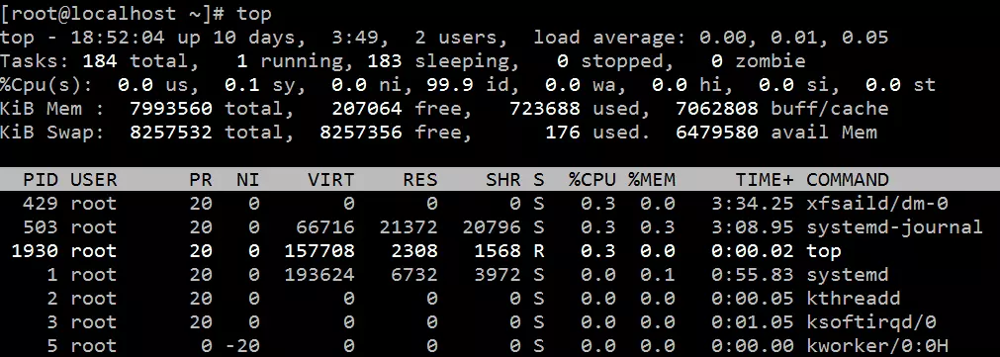

# tail

**tail命令**用于输入文件中的尾部内容。tail命令默认在屏幕上显示指定文件的末尾10行。如果给定的文件不止一个，则在显示的每个文件前面加一个文件名标题。如果没有指定文件或者文件名为“-”，则读取标准输入。

注意：如果表示字节或行数的N值之前有一个”+”号，则从文件开头的第N项开始显示，而不是显示文件的最后N项。N值后面可以有后缀：b表示512，k表示1024，m表示1 048576(1M)。


```shell
语法：
tail(选项)(参数)

参数:
--retry：即是在tail命令启动时，文件不可访问或者文件稍后变得不可访问，都始终尝试打开文件。使用此选项时需要与选项“——follow=name”连用；
-c<N>或——bytes=<N>：输出文件尾部的N（N为整数）个字节内容；
-f<name/descriptor>或；--follow<nameldescript>：显示文件最新追加的内容。“name”表示以文件名的方式监视文件的变化。“-f”与“-fdescriptor”等效；
-F：与选项“-follow=name”和“--retry"连用时功能相同；
-n<N>或——line=<N>：输出文件的尾部N（N位数字）行内容。
--pid=<进程号>：与“-f”选项连用，当指定的进程号的进程终止后，自动退出tail命令；
-q或——quiet或——silent：当有多个文件参数时，不输出各个文件名；
-s<秒数>或——sleep-interal=<秒数>：与“-f”选项连用，指定监视文件变化时间隔的秒数；
-v或——verbose：当有多个文件参数时，总是输出各个文件名；
--help：显示指令的帮助信息；
--version：显示指令的版本信息。

例子：
tail file （显示文件file的最后10行）
tail +20 file （显示文件file的内容，从第20行至文件末尾）
tail -c 10 file （显示文件file的最后10个字符）
```


# 查找进程

在linux下运行了5个java程序： A,B,C,D,E。由于java程序的运行，是通过java虚拟机解释字节码而执行的，所以通过top命令，只能看到运行的java虚拟机，无法真正分清楚哪个进程是哪个特定的java程序。

```shell
$ top
  PID USER      PR  NI  VIRT  RES  SHR S %CPU %MEM    TIME+  COMMAND
74630 user      20   0 5418m 1.2g 8912 S 72.4  8.0   1288:55 java
35573 user      20   0 5972m  68m 4952 S  6.0  0.4 889:01.43 java
25454 user      20   0 5907m 146m 5096 S  2.7  0.9   1533:30 java
75423 user      20   0 6397m 152m 4944 S  2.0  1.0   2758:36 java
53166 user      20   0 5907m 279m 5128 S  1.7  1.8  27:11.51 java
```

top命令用于查看最活跃进程的实时信息，而ps提供的是进程的快照。要查看具体某个进程是用什么命令启动的，可以通过ps命令来查看。

```shell
$ ps -ef

UID        PID  PPID  C STIME TTY          TIME CMD
root      2061     2  0  2015 ?        00:48:43 [nfsiod]
root      2062     2  0  2015 ?        00:00:00 [nfsv4.0-svc]
root      2082     1  0  2015 tty1     00:00:00 /sbin/mingetty /dev/tty1
user     74630     1  0 Mar18 ?        00:11:37 java -cp conf:lib/*;A.jar  
...
```

可以看到输出中用java命令启动java程序A的记录。将ps的输出用grep继续过滤，就能看到所有java进程的信息了。

```shell
$ ps -ef | grep java
```


# top

摘自：`https://www.jianshu.com/p/7ecdb31f783f`

## 简介

top命令是Linux下常用的性能分析工具，能够实时显示系统中各个进程的资源占用状况，类似于Windows的任务管理器。top显示系统当前的进程和其他状况，是一个动态显示过程，可以自动或者通过用户按键来不断刷新当前状态。如果在前台执行该命令，它将独占前台,直到用户终止该程序为止.。比较准确的说，top命令提供了实时的对系统处理器的状态监控，显示系统中CPU最“敏感”的任务列表。top命令可以按CPU使用、内存使用和执行时间对任务进行排序。而且该命令的很多特性都可以通过交互式命令或者在个人定制文件中进行设定.。

## 使用

下面详细介绍top命令的使用方法。
对于一个新手来说，如果从来没有使用过top命令，在命令行模式下直接输入top，可以查看到当前所有进程的信息。




然而，大多时候，我们需要按需筛选出最有效的信息。如何通过top命令指定参数来获取自己想要的信息呢？

- 查看top命令的可用参数

```ruby
[root@localhost ~]# top -h
  procps-ng version 3.3.10
Usage:
  top -hv | -bcHiOSs -d secs -n max -u|U user -p pid(s) -o field -w [cols]
```

通过top的帮助命令，可以指定很多参数。这些参数都是什么意思呢？

- 通过man命令查看top命令的用法

```csharp
[root@localhost ~]#  man top
TOP(1)                        User Commands                        TOP(1)

NAME
       top - display Linux processes

SYNOPSIS
       top -hv|-bcHiOSs -d secs -n max -u|U user -p pid -o fld -w [cols]

       The traditional switches `-' and whitespace are optional.

DESCRIPTION
       The  top  program  provides  a dynamic real-time view of a running
       system.  It can display system summary information as  well  as  a
       list  of processes or threads currently being managed by the Linux
       kernel.  The types of system summary  information  shown  and  the
       types,  order  and size of information displayed for processes are
       all user configurable and that configuration can be  made  persis‐
       tent across restarts.

       The  program  provides a limited interactive interface for process
       manipulation as well as a much more extensive interface  for  per‐
       sonal  configuration   --  encompassing every aspect of its opera‐
       tion.  And while top is referred to throughout this document,  you
       are  free  to  name the program anything you wish.  That new name,
       possibly an alias, will then be reflected  on  top's  display  and
       used when reading and writing a configuration file.

OVERVIEW
   Documentation
       The remaining Table of Contents

           1. COMMAND-LINE Options
           2. SUMMARY Display
              a. UPTIME and LOAD Averages
              b. TASK and CPU States
              c. MEMORY Usage
           3. FIELDS / Columns Display
              a. DESCRIPTIONS of Fields
              b. MANAGING Fields
           4. INTERACTIVE Commands
              a. GLOBAL Commands
 Manual page top(1) line 1 (press h for help or q to quit)
```

这就是top命令帮助文档的首页，包括top命令的作用，参数，描述，和帮助文档目录。
通过帮助文档的目录，可以看到，第一部分是COMMAND-LINE Options(命令行选项)，具体内容就是讲解top命令各个参数选项的功能和用法。持续按下键盘的【向下箭头】，来到帮助文档的第一部分，下面对命令行参数选项的内容进行讲解。man帮助文档原文为英文，会在文章结尾附上。

- top命令启动参数选项说明

```ruby
top -hv|-bcHiOSs -d secs -n max -u|U user -p pid -o fld -w [cols]
```

| 参数选项名称 | 含义                                                         |
| :----------- | :----------------------------------------------------------- |
| h            | 帮助                                                         |
| v            | 版本                                                         |
| b            | 批处理模式。可以将结果输出到其他程序或者文件。在该模式下，top不接收交互命令，直到top命令被停止，或者执行次数达到-n选项指定的值 |
| c            | 显示整个命令行而不只是显示命令名                             |
| d            | 指定每两次屏幕信息刷新之间的时间间隔（单位为秒）。当然用户可以使用d或者s交互命令来改变之。 |
| H            | 显示所有线程的运行状态指标。如果没有该参数，会显示一个进程中所有线程的总和。在运行过程中，可以通过H命令进行交互控制。 |
| i            | 使top不显示任何闲置或者僵死进程。                            |
| n            | top命令执行的最大次数                                        |
| o            | 指定排序的字段。+fieldName，按照filedName字段降序排序；-fieldName，按照filedName字段升序排序 |
| O            | 是o参数的辅助，打印所有可以获取到的字段名称，每行一个。然后退出top执行 |
| p            | 通过指定监控进程ID来仅仅监控某个进程的状态。可以指定多个，-pN1 -pN2 ... 或者 -pN1,N2,N3 ... |
| q            | 该选项将使top没有任何延迟的进行刷新。如果调用程序有超级用户权限，那么top将以尽可能高的优先级运行。 |
| s            | 使top命令在安全模式中运行。这将去除交互命令所带来的潜在危险。 |
| S            | 显示每个进程累计占用CPU时间模式。当指定该参数，每个进程的CPU时间会包含该进程和该进程已经死掉的子进程的时间。可以在top运行窗口通过S交互命令进行启用和关闭。 |
| u/U          | -u userName/userId，匹配【当前活跃用户（effective）】的进程指标信息；-U userName/userId，匹配【所有用户】，包括real, effective, saved, or filesystem |
| w            | -w[number] 指定显示宽度。**官方建议不要使用该参数，输出宽度会和terminal自动适配。** |

**注意** ** *p选项和u/U选项互斥，不能同时指定* **

- top命令运行中交互命令
    top命令执行过程中，可以使用的一些交互命令。从使用角度来看，熟练的掌握这些命令比掌握选项还重要一些。这些命令都是单字母的，使用方便。**如果在命令行选项中使用了【s】选项，则可能其中一些命令会被屏蔽掉**。

| 参数选项名称 | 含义                                                         |
| :----------- | :----------------------------------------------------------- |
| Ctrl+L       | 擦除并且重写屏幕。                                           |
| h或者?       | 显示帮助画面，给出一些简短的命令总结说明。                   |
| k            | 终止一个进程。系统将提示用户输入需要终止的进程PID，以及需要发送给该进程什么样的信号。一般的终止进程可以使用15信号；如果不能正常结束那就使用信号9强制结束该进程。默认值是信号15。在安全模式中此命令被屏蔽。 |
| i            | 忽略闲置和僵死进程。这是一个开关式命令。                     |
| q            | 退出程序。                                                   |
| r            | 重新安排一个进程的优先级别。系统提示用户输入需要改变的进程PID以及需要设置的进程优先级值。输入一个正值将使优先级降低，反之则可以使该进程拥有更高的优先权。默认值是10。 |
| S            | 切换到累计模式。                                             |
| s            | 改变两次刷新之间的延迟时间。系统将提示用户输入新的时间，单位为s。如果有小数，就换算成m s。输入0值则系统将不断刷新，默认值是5 s。需要注意的是如果设置太小的时间，很可能会引起不断刷新，从而根本来不及看清显示的情况，而且系统负载也会大大增加。 |
| f或者F       | 从当前显示中添加或者删除项目。                               |
| o或者O       | 改变显示项目的顺序。                                         |
| H            | 在【显示所有线程的运行状态指标】和【显示一个进程中所有线程的总和】之间进行切换 |
| l            | 切换显示平均负载和启动时间信息。                             |
| m            | 切换显示内存信息。                                           |
| t            | 切换显示进程和CPU状态信息。                                  |
| c            | 切换显示命令名称和完整命令行。                               |
| M            | 根据驻留内存大小进行排序。                                   |
| P            | 根据CPU使用百分比大小进行排序。                              |
| T            | 根据时间/累计时间进行排序。                                  |
| W            | 将当前设置写入~/.toprc文件中。这是写top配置文件的推荐方法。  |

## 示例

| top命令             | 解释                                                         |
| :------------------ | :----------------------------------------------------------- |
| top                 | 每隔3秒显式所有进程的资源占用情况                            |
| top -d 10           | 每隔10秒显式所有进程的资源占用情况                           |
| top -c              | 每隔3秒显式进程的资源占用情况，并显示进程的命令行参数(默认只有进程名) |
| top -p 1111 -p 2222 | 每隔3秒显示pid是1111 和2222的两个进程的资源占用情况          |
| top -d 5 -c -p 3333 | 每隔5秒显示pid是3333 的进程的资源使用情况，并显式该进程启动的命令行参数 |

参考：
[1 linux的top命令参数详解](https://link.jianshu.com/?t=http%3A%2F%2Fwww.cnblogs.com%2Fggjucheng%2Farchive%2F2012%2F01%2F08%2F2316399.html)
2 top启动选项的英文原文解释

- 可以通过下面命令查看

```undefined
man top
```

