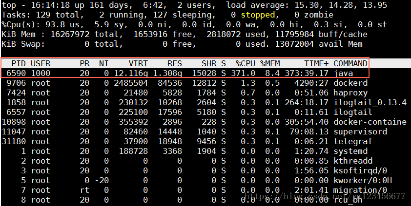
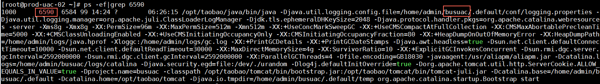
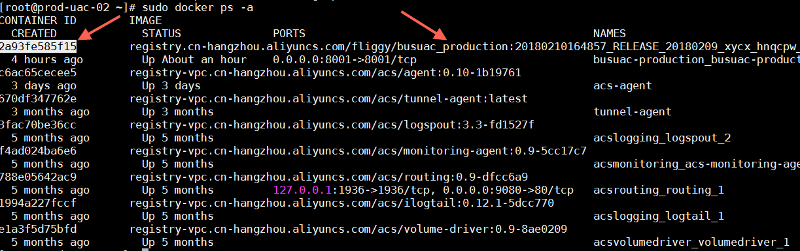
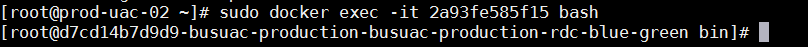
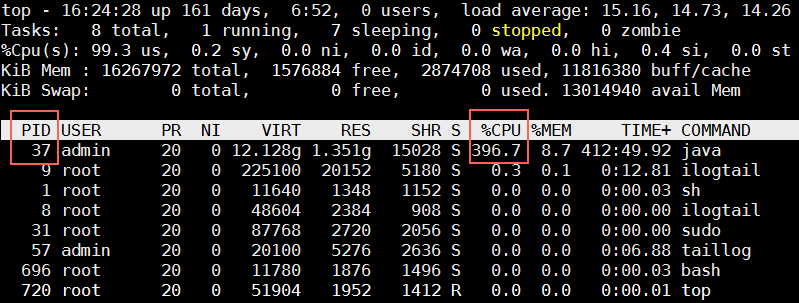
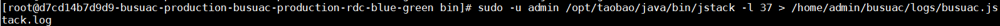
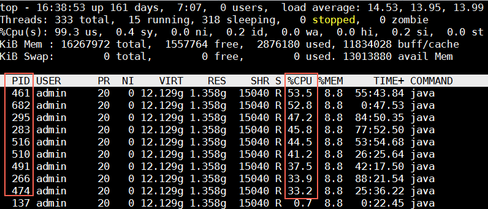
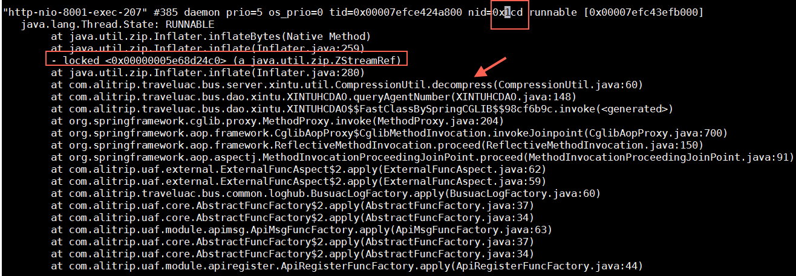

摘自：`https://blog.csdn.net/ym123456677/article/details/80527821`

# 确认目标进程

- 执行top命令查看CPU占用情况，找出CPU占用高的进程ID。

PS：输入大写P即可按照CPU占比排序进程（即 Shift + p）




* 找出对应进程信息




# 登录容器

- 查看容器ID




* 进入容器




# 打印堆栈信息

- top命令查看容器内进程ID



打印线程堆栈

- 必须切换至admin用户（进程是admin启动的）
- jstack需要绝对路径（容器admin用户的PATH没有包含JAVA路径）
- 输出的日志文件需要放在 /home/admin/${应用名}/logs 目录下，方便后面拷贝

```
# sudo -u admin /opt/taobao/java/bin/jstack -l 37 > /home/admin/busuac/logs/busuac.jstack.log
```



# 拷贝文件

退出容器，在宿主机ECS上执行mv命令将文件拷贝至个人家目录，再sftp从家目录下载文件即可

- 源文件就是上一步生成的
- 目标路径是个人的家目录（即命令中的~）

```
# cp /home/admin/busuac/logs/busuac.jstack.log ~
```

# 如何分析jstack

jstack文件就是一堆线程信息，如何确定哪个线程占比高？

- 在容器里使用top命令看进程对应的线程堆栈

    ```
    # top -H p 进程I
    ```

    


* 在jstack文件里找占比高的线程
    * 将第一步的PID换算成16进程，如 461 换算出16进制是 0x1cd（小写）
    * 在生成的jstack文件里查找 0x1cd对应的线程再分析原因



