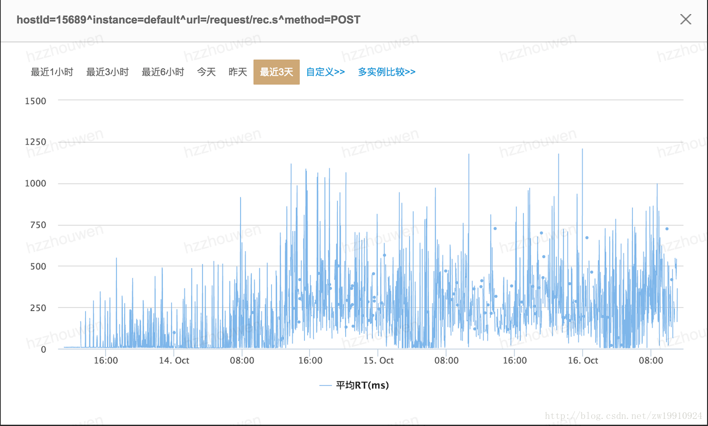
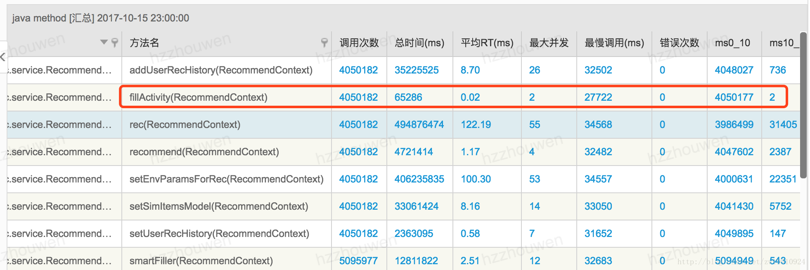
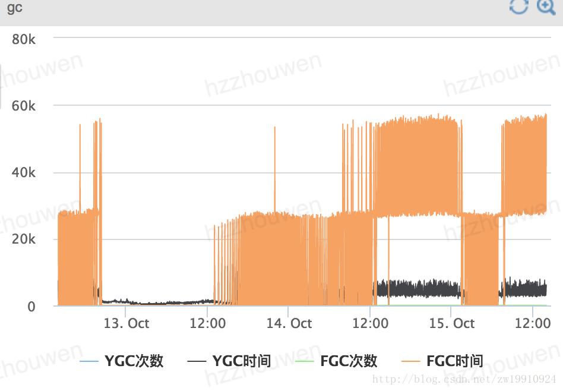
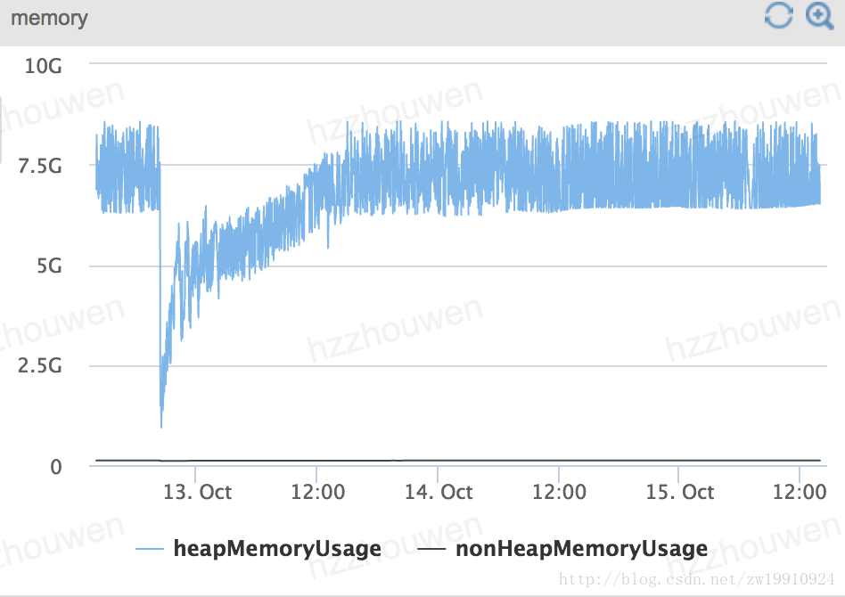
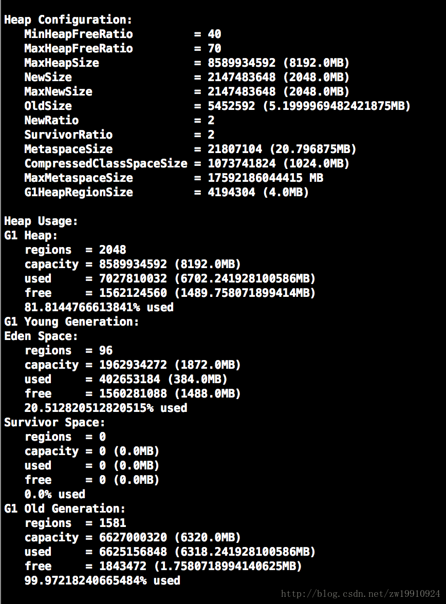
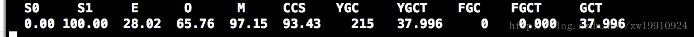

摘自：`https://blog.csdn.net/zw19910924/article/details/78254267`

# 问题

最近线上有一个服务，运行个一两天，就会变得很慢。这里很慢指的是经常对于请求的响应时间很大，有时甚至有二三十秒，导致别人调接口，经常出现超时问题。这里简单介绍些这个问题的定位方法过程以及最后怎么解决的。 
很多时候，我们更应该积累分析问题、解决问题的方法，这也是一个人工作能力的表现吧。当然专业知识的积累也是必不可少的，这是基础。就像本文的分析，要是没有点JVM的知识基础，这个问题肯定是解决不了的。

# 分析与解决

1. 看日志
这是最基本的，一般线上服务出现问题，第一反应应该就是看日志。看看是不是程序抛出了异常。当然这里是服务响应比较慢，并不是不返回，也不是http返回500。果不其然，线上服务是没有异常程序日志的。因为程序是部署在tomcat上的，再看看tomcat的日志，发现也是正常的，没有异常日志。

2. 看服务监控
现在好多的公司都有服务监控系统，有cpu、内存、网卡、磁盘、url请求的响应时间请求并发、jvm相关等等的监控。当然公司没有监控系统也不用慌，监控系统只是看起来直观一点。就算没有监控系统，还是可以通过linux命令以及jdk里面带的JVM调试工具来看。可能url请求响应时间和请求并发量没有现成的命令工具，其他的都有，最基本的top命令看cpu、内存，JVM相关的就是用jdk自带的工具，像jps，jmap，jstat，jstack等。

看了监控，发现cpu、网卡啥的都没问题，线上机器内存16G，内存也完全够。看Url响应时间发现有问题，最大调用时间很大，平均响应时间也偏大：


点开平均响应时间： 



发现层次不齐，有时候快有时候慢。说明服务并不是所有的请求都很慢。 
再看看监控的程序的一些方法，发现没有io的方法，纯内存计算的有时候也很慢，最慢调用都达到了27秒： 




这里就可以猜测是服务本身有问题了。这里首先想到的就是服务在某个时间点卡住了，能想到的一个就是JVM在fullGC的时候stop the world。因此去看下jvm监控： 
垃圾回收： 



这里能看到的是fullGC太频繁了，而且点在上面还可以看到fullGC的时间很长，一次fullGC平均都用了27S的样子。这也跟上面监控的url和方法监控的最慢调用时间相吻合。因为JVM在进行fullGC的时候，用户线程都会被暂停等到fullGC完成再回来继续执行。 
看下虚拟机内存： 



发现内存一直趋于饱和，发现就算fullGC，虚拟机堆内存并没有得到有效的回收压缩。 
到这里基本可以定位到，线上服务变慢的问题是由于JVM频繁的fullGC导致的，而fullGC很频繁的原因是每一次fullGC并没有实现内存的大量回收。所以过不了多久，内存又会满，满了又会进行fullGC一直循环。

那么接下来就要分析为什么fullGC不能实现内存的有效回收呢。

首先服务运行的虚拟机参数：

```
-Xmn2048M 
-XX:ParallelGCThreads=6 
-XX:SurvivorRatio=2 
-XX:CMSFullGCsBeforeCompaction=0 
-XX:CMSInitiatingOccupancyFraction=75 
-XX:InitiatingHeapOccupancyPercent=50 
-XX:MaxGCPauseMillis=200 
-XX:+UseG1GC 
-XX:+PrintGCApplicationConcurrentTime 
-XX:+PrintGCApplicationStoppedTime 
-XX:+PrintGCDateStamps
```


从这上面好像也看不出有什么问题。那我们用jdk工具看看线上服务运行的内存信息：

```
jmap -heap <pid>
```

其中上面的pid可以使用jps查看，是java进程的一个进程id。堆内存信息如下： 




可以看到很奇怪的一点就是老年代满的，这个跟刚刚监控看到的也是符合的。如果没有监控看堆内存的垃圾回收信息，可以使用jdk的工具：

```
jstat -gcutil <pid> 10000
```


表示的是每10秒输出一次内存回收信息，对gc进行统计。 



这里解释下： 
S0:新生代的susvivor0区，空间使用率为0% 
S1:新生代的susvivor1区，空间使用率为100%(因为还没有执行第二次minor收集) 
E:eden区，空间使用率28.02% 
O:老年代，空间使用率65.76% 
YGC:minor gc执行次数215次 
YGCT:minor gc耗费的时间37.996毫秒 
FGC:full gc执行次数0 
FGCT:full gc耗费的时间0毫秒 
GCT:gc耗费的总时间37.996毫秒

当然这个并不是那个服务线上的环境的输出，这里只是做一下解释这些参数表示什么意思。

回归正题，这里为什么老年代一直都是满的，fullGC对于老年代的回收基本起不到作用，而且上面看到的Survivor空间一直都是0，没有分配空间。能想到两种可能：1. 代码问题，代码里面有大对象，而且是分配的时候直接进入老年代，而且这些对象被一直引用着没有释放，所以fullGC的作用不是很明显。2. 虚拟机参数有问题，是参数的设置导致的。

先说第一种可能，结合上面的输出，Eden空间的大小是1872M，大对象在这里面肯定是能得到分配的，而且看虚拟机参数的设置，-XX:SurvivorRatio=2 表示Eden和Survivor的比例为2，但是上面的jmap看到的对内存信息里面Survivor空间为0，这显然跟设置的参数是矛盾的。然后再去看代码，也不存在大对象一直引用没有释放的情况，所以基本排除第一种情况。

第二种情况，我上网去吧那些参数基本都查了一遍，好像也看不出啥问题。有个参数-XX:+UseG1GC ，这个指定的收集器为G1收集器。因此我详细的去查了下这个收集器：下面是我查找的资料的链接： 

```
1. Getting Started with the G1 Garbage Collector 
http://www.oracle.com/webfolder/technetwork/tutorials/obe/java/G1GettingStarted/index.html
2. G1垃圾收集器入门 
http://blog.csdn.net/renfufei/article/details/41897113
3. 神奇的 G1：Java 全新垃圾回收机制 
https://toutiao.io/posts/9a1emp/preview
4. Java Hotspot G1 GC的一些关键技术
https://tech.meituan.com/g1.html
```


其中第一篇是java 的官方文档，里面提到不要设置年轻代大小：

假若通过 -Xmn 显式地指定了年轻代的大小, 则会干扰到 G1收集器的默认行为. 
G1在垃圾收集时将不再关心暂停时间指标.所以从本质上说,设置年轻代的大小将禁用暂停时间目标. G1在必要时也不能够增加或者缩小年轻代的空间. 
因为大小是固定的,所以对更改大小无能为力.

而我们的程序虚拟机参数刚好就设置了新生代大小：-Xmn2048M。会不会就是这个原因导致的。我先把这个参数和-XX:SurvivorRatio=2 这个参数去掉，然后再部署服务，发现现在垃圾回收变得很正常，已经一天了，服务并没有变慢。问题得到解决。中午吃饭的时候还跟同事讨论是不是G1收集器的问题，读了其他几篇关于介绍G1收集器的博客后，完全否定了这种想法。

后面jstat -gcutil 10000 观察垃圾收集很正常，而且G1收集器fullGC真的很少。

以上就是解决这个线上服务运行时间长变慢问题的一个过程。

# 总结

我们在定位问题的时候，要根据自己已有的知识和经验进行猜想和判断，然后对猜想和判断就行验证，一步一步的去接近真相。

ps. G1收集器是一个不错的收集器，能够很大程度减少fullGC的次数，分配空间时不需要一个连续的内存区间，老年代新生代的区间（region）是不固定的，新生代回收过后空间可用下次可以作为老年代空间来存储。但是在使用的时候，如果不理解原理机制，还是可能会出现问题的。其他的收集器也是一样的，其实对于技术知识点都是这样的，不仅要会用，还要理解。
