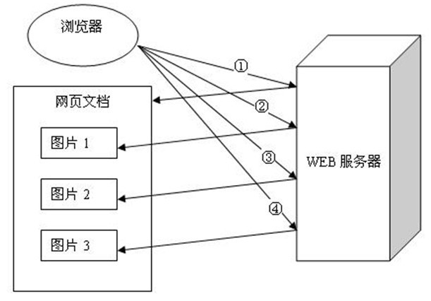
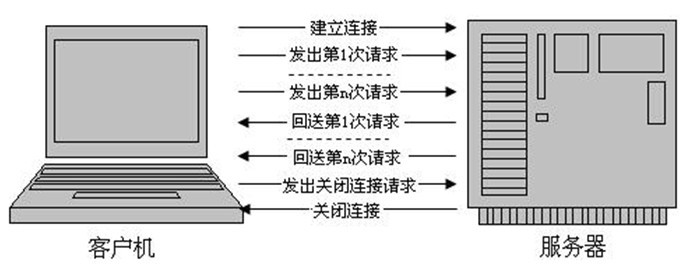

摘自：`https://blog.csdn.net/hguisu/article/details/8608888`

# Persistent Connection持久连接

在HTTP1.0中，每对Request/Response都使用一个新的连接。

  HTTP 1.1则支持持久连接Persistent Connection, 并且默认使用persistent  connection. 在同一个tcp的连接中可以传送多个HTTP请求和响应. 多个请求和响应可以重叠，多个请求和响应可以同时进行. 更加多的请求头和响应头(比如HTTP1.0没有host的字段).

  HTTP 1.1的持续连接，也需要增加新的请求头来帮助实现，例如，Connection请求头的值为Keep-Alive时，客户端通知服务器返回本次请求结果后保持连接；Connection请求头的值为close时，客户端通知服务器返回本次请求结果后关闭连接。HTTP 1.1还提供了与身份认证、状态管理和Cache缓存等机制相关的请求头和响应头。

  HTTP 1.0规定浏览器与服务器只保持短暂的连接，浏览器的每次请求都需要与服务器建立一个TCP连接，服务器完成请求处理后立即断开TCP连接，服务器不跟踪每个客户也不记录过去的请求。此外，由于大多数网页的流量都比较小，一次TCP连接很少能通过slow-start区，不利于提高带宽利用率。

  在1.0时的会话方式：
 1. 建立连接
 2. 发出请求信息
 3. 回送响应信息
 4. 关掉连接

 小结:浏览器和web服务器连接很短，每次连接只处理一个请求和响应。对每一个页的请求,浏览器与web服务器都要建立一次单独的连接.浏览器没有 关掉前,连接就断开了.浏览器和服务器之间的通信是完全独立分开的请求和响应对.因为这样没法断点浏览器是否断开,没法做连接状态控制。建立和关掉连接会很占用连接时间.

在一个网页中,在http头中的Connection中有多少个close的头,就相当有多少个http的连接.

HTTP 1.1支持长连接（PersistentConnection）和请求的流水线（Pipelining）处理，在一个TCP连接上可以传送多个HTTP请求和响应，减少了建立和关闭连接的消耗和延迟。例如：一个包含有许多图像的网页文件的多个请求和应答可以在一个连接中传输，但每个单独的网页文件的请求和应答仍然需要使用各自的连接。

   HTTP 1.1还允许客户端不用等待上一次请求结果返回，就可以发出下一次请求，但服务器端必须按照接收到客户端请求的先后顺序依次回送响应结果，以保证客户端能够区分出每次请求的响应内容，这样也显著地减少了整个下载过程所需要的时间。

   在HTTP/1.0中，要建立长连接，可以在请求消息中包含Connection: Keep-Alive头域，如果服务器愿意维持这条连接，在响应消息中也会包含一个Connection: Keep-Alive的头域。同时，可以加入一些指令描述该长连接的属性，如max，timeout等。

   事实上，Connection头域可以携带三种不同类型的符号：

1、一个包含若干个头域名的列表，声明仅限于一次hop连接的头域信息；

2、任意值，本次连接的非标准选项，如Keep-Alive等；

3、close值，表示消息传送完成之后关闭长连接；

 客户端和源服务器之间的消息传递可能要经过很多中间节点的转发，这是一种逐跳传递（hop-by-hop）。HTTP/1.1相应地引入了hop-by-hop头域，这种头域仅作用于一次hop，而非整个传递路径。每一个中间节点（如Proxy，Gateway）接收到的消息中如果包含Connection头域，会查找Connection头域中的一个头域名列表，并在将消息转发给下一个节点之前先删除消息中这些头域。

通常，HTTP/1.0的Proxy不支持Connection头域，为了不让它们转发可能误导接收者的头域，协议规定所有出现在Connection头域中的头域名都将被忽略。

# Host域

在HTTP1.0中认为每台服务器都绑定一个唯一的IP地址，因此，请求消息中的URL并没有传递主机名（hostname）。但随着虚拟主机技术的发展，在一台物理服务器上可以存在多个虚拟主机（Multi-homed Web Servers），并且它们共享一个IP地址。

  HTTP1.1的请求消息和响应消息都应支持Host头域，且请求消息中如果没有Host头域会报告一个错误（400 Bad Request）。此外，服务器应该接受以绝对路径标记的资源请求。

  HTTP1.1在Request消息头里头多了一个Host域，比如：

 GET /pub/WWW/TheProject.html HTTP/1.1

 Host: www.w3.org

 HTTP1.0则没有这个域。

 可能HTTP1.0的时候认为，建立TCP连接的时候已经指定了IP地址，这个IP地址上只有一个host。

 由于HTTP 1.0不支持Host请求头字段，WEB浏览器无法使用主机头名来明确表示要访问服务器上的哪个WEB站点，这样就无法使用WEB服务器在同一个IP地址和端口号上配置多个虚拟WEB站点。在HTTP 1.1中增加Host请求头字段后，WEB浏览器可以使用主机头名来明确表示要访问服务器上的哪个WEB站点，这才实现了在一台WEB服务器上可以在同一个IP地址和端口号上使用不同的主机名来创建多个虚拟WEB站点。

 

# date/timestamp (日期时间戳)

(接收方向)

无论是HTTP1.0还是HTTP1.1，都要能解析下面三种date/time stamp：

      Sun, 06 Nov 1994 08:49:37GMT  ; RFC 822, updated by RFC 1123
    
      Sunday, 06-Nov-94 08:49:37GMT ; RFC 850, obsoleted by RFC 1036
    
      Sun Nov  6 08:49:371994       ; ANSI C's asctime() format

(发送方向)
   HTTP1.0要求不能生成第三种asctime格式的date/time stamp；

    HTTP1.1则要求只生成RFC 1123(第一种)格式的date/time stamp。

# Transfer Codings

HTTP1.1支持chunked transfer，所以可以有Transfer-Encoding头部域:

Transfer-Encoding:chunked

 HTTP1.0则没有。

HTTP消息中可以包含任意长度的实体，通常它们使用Content-Length来给出消息结束标志。但是，对于很多动态产生的响应，只能通过缓冲完整的消息来判断消息的大小，但这样做会加大延迟。如果不使用长连接，还可以通过连接关闭的信号来判定一个消息的结束。

HTTP/1.1中引入了Chunked transfer-coding来解决上面这个问题，发送方将消息分割成若干个任意大小的数据块，每个数据块在发送时都会附上块的长度，最后用一个零长度的块作为消息结束的标志。这种方法允许发送方只缓冲消息的一个片段，避免缓冲整个消息带来的过载。

在HTTP/1.0中，有一个Content-MD5的头域，要计算这个头域需要发送方缓冲完整个消息后才能进行。而HTTP/1.1中，采用chunked分块传递的消息在最后一个块（零长度）结束之后会再传递一个拖尾（trailer），它包含一个或多个头域，这些头域是发送方在传递完所有块之后再计算出值的。发送方会在消息中包含一个Trailer头域告诉接收方这个拖尾的存在。

# Quality Values

 HTTP1.1多了个qvalue域：

      qvalue         = ( "0" ["." 0*3DIGIT ] )
    
                     | ( "1" [ "." 0*3("0") ] )

 

# Entity Tags

用于Cache。

 

# Range 和 Content-Range(节约优化)

HTTP1.1支持传送内容的一部分。比方说，当客户端已经有内容的一部分，为了节省带宽，可以只向服务器请求一部分。

  HTTP/1.0中，存在一些浪费带宽的现象，例如客户端只是需要某个对象的一部分，而服务器却将整个对象送过来了。例如，客户端只需要显示一个文档的部分内容，又比如下载大文件时需要支持断点续传功能，而不是在发生断连后不得不重新下载完整的包。

  HTTP/1.1中在请求消息中引入了range头域，它允许只请求资源的某个部分。在响应消息中Content-Range头域声明了返回的这部分对象的偏移值和长度。如果服务器相应地返回了对象所请求范围的内容，则响应码为206（Partial Content），它可以防止Cache将响应误以为是完整的一个对象。

  

节省带宽资源的一个非常有效的做法就是压缩要传送的数据。Content-Encoding是对消息进行端到端（end-to-end）的编码，它可能是资源在服务器上保存的固有格式（如jpeg图片格式）；在请求消息中加入Accept-Encoding头域，它可以告诉服务器客户端能够解码的编码方式。

 而Transfer-Encoding是逐段式（hop-by-hop）的编码，如Chunked编码。在请求消息中加入TE头域用来告诉服务器能够接收的transfer-coding方式，


# 100(Continue) Status(节约带宽)

另外一种浪费带宽的情况是请求消息中如果包含比较大的实体内容，但不确定服务器是否能够接收该请求（如是否有权限），此时若贸然发出带实体的请求，如果被拒绝也会浪费带宽。

  HTTP/1.1加入了一个新的状态码100（Continue）。客户端事先发送一个只带头域的请求，如果服务器因为权限拒绝了请求，就回送响应码401（Unauthorized）；如果服务器接收此请求就回送响应码100，客户端就可以继续发送带实体的完整请求了。注意，HTTP/1.0的客户端不支持100响应码。但可以让客户端在请求消息中加入Expect头域，并将它的值设置为100-continue。

100 (Continue) 状态代码的使用，允许客户端在发request消息body之前先用request header试探一下server，看server要不要接收request body，再决定要不要发request body。

客户端在Request头部中包含

Expect: 100-continue

Server看到之后呢如果回100 (Continue) 这个状态代码，客户端就继续发requestbody。

这个是HTTP1.1才有的。


# Request method

HTTP1.1增加了OPTIONS,PUT, DELETE, TRACE, CONNECT这些Request方法.

```
Method   ="OPTIONS"               ;Section 9.2

                     |"GET"                   ; Section 9.3

                     |"HEAD"                  ; Section 9.4

                     |"POST"                  ; Section 9.5

                     | "PUT"                   ;Section 9.6

                     | "DELETE"                ;Section 9.7

                     |"TRACE"                 ; Section 9.8

                     | "CONNECT"               ;Section 9.9

                     | extension-method

       extension-method =token
```

# Status code

HTTP1.1 增加的新的status code：

 

(HTTP1.0没有定义任何具体的1xx status code, HTTP1.1有2个)

100 Continue

101 Switching Protocols

 

203 Non-Authoritative Information

205 Reset Content

206 Partial Content

 

302 Found (在HTTP1.0中有个 302 Moved Temporarily)

303 See Other

305 Use Proxy

307 Temporary Redirect

 

405 Method Not Allowed

406 Not Acceptable

407 Proxy Authentication Required

408 Request Timeout

409 Conflict

410 Gone

411 Length Required

412 Precondition Failed

413 Request Entity Too Large

414 Request-URI Too Long

415 Unsupported Media Type

416 Requested Range Not Satisfiable

417 Expectation Failed

 

504 Gateway Timeout

505 HTTP Version Not Supported


# Cache (缓存)

在HTTP/1.0中，使用Expire头域来判断资源的fresh或stale，并使用条件请求（conditional request）来判断资源是否仍有效。例如，cache服务器通过If-Modified-Since头域向服务器验证资源的Last-Modefied头域是否有更新，源服务器可能返回304（Not Modified），则表明该对象仍有效；也可能返回200（OK）替换请求的Cache对象。

此外，HTTP/1.0中还定义了Pragma:no-cache头域，客户端使用该头域说明请求资源不能从cache中获取，而必须回源获取。

HTTP/1.1在1.0的基础上加入了一些cache的新特性，当缓存对象的Age超过Expire时变为stale对象，cache不需要直接抛弃stale对象，而是与源服务器进行重新激活（revalidation）。

HTTP/1.0中，If-Modified-Since头域使用的是绝对时间戳，精确到秒，但使用绝对时间会带来不同机器上的时钟同步问题。而HTTP/1.1中引入了一个ETag头域用于重激活机制，它的值entity tag可以用来唯一的描述一个资源。请求消息中可以使用If-None-Match头域来匹配资源的entitytag是否有变化。

为了使caching机制更加灵活，HTTP/1.1增加了Cache-Control头域（请求消息和响应消息都可使用），它支持一个可扩展的指令子集：例如max-age指令支持相对时间戳；private和no-store指令禁止对象被缓存；no-transform阻止Proxy进行任何改变响应的行为。

Cache使用关键字索引在磁盘中缓存的对象，在HTTP/1.0中使用资源的URL作为关键字。但可能存在不同的资源基于同一个URL的情况，要区别它们还需要客户端提供更多的信息，如Accept-Language和Accept-Charset头域。为了支持这种内容协商机制(content negotiation mechanism)，HTTP/1.1在响应消息中引入了Vary头域，该头域列出了请求消息中需要包含哪些头域用于内容协商。


依据：

rfc2616Hypertext Transfer Protocol -- HTTP-1.1.txt(https://www.ietf.org/rfc/rfc2616.txt)

rfc1945Hypertext Transfer Protocol -- HTTP 1.0.txt(http://www.ietf.org/rfc/rfc1945.txt)

求消息中需要包含哪些头域用于内容协商。


# HTTP 1.1持久连接的好处

 一个WEB站点每天可能要接收到上百万的用户请求，为了提高系统的效率，HTTP 1.0规定浏览器与服务器只保持短暂的连接，浏览器的每次请求都需要与服务器建立一个TCP连接，服务器完成请求处理后立即断开TCP连接，服务器不跟踪每个客户也不记录过去的请求。但是，这也造成了一些性能上的缺陷，例如，一个包含有许多图像的网页文件中并没有包含真正的图像数据内容，而只是指明了这些图像的URL地址，当WEB浏览器访问这个网页文件时，浏览器首先要发出针对该网页文件的请求，当浏览器解析WEB服务器返回的该网页文档中的HTML内容时，发现其中的图像标签后，浏览器将根据标签中的src属性所指定的URL地址再次向服务器发出下载图像数据的请求，如图所示。




显然，访问一个包含有许多图像的网页文件的整个过程包含了多次请求和响应，每次请求和响应都需要建立一个单独的连接，每次连接只是传输一个文档和图像，上一 次和下一次请求完全分离。即使图像文件都很小，但是客户端和服务器端每次建立和关闭连接却是一个相对比较费时的过程，并且会严重影响客户机和服务器的性 能。当一个网页文件中包含Applet，JavaScript文件，CSS文件等内容时，也会出现类似上述的情况。

为了克服HTTP 1.0的这个缺陷，HTTP1.1支持持久连接，在一个TCP连接上可以传送多个HTTP请求和响应，减少了建立和关闭连接的消耗和延迟。一个包含有许多图像的网页文件的多个请求和应答可以在一个连接中传输，但每个单独的网页文件的请求和应答仍然需要使用各自的连接。HTTP 1.1还允许客户端不用等待上一次请求结果返回，就可以发出下一次请求，但服务器端必须按照接收到客户端请求的先后顺序依次回送响应结果，以保证客户端能够区分出每次请求的响应内容，这样也显著地减少了整个下载过程所需要的时间。基于HTTP 1.1协议的客户机与服务器的信息交换过程，如图所示。

