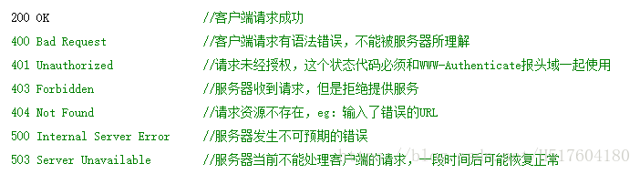

摘自：`https://itbilu.com/other/relate/EkwKysXIl.html`

### HTTP版本与HTTP请求方法

在HTTP的发展过程中，出现了很多HTTP版本，其中的大部分协议都是向下兼容的。在进行HTTP请求时，客户端在请求时会告诉服务器它采用的协议版本号，而服务器则会在使用相同或者更早的协议版本进行响应。


#### HTTP/0.9

这是HTTP最早大规模使用的版，现已过时。在这个版本中 只有`GET`一种请求方法，在HTTP通讯也没有指定版本号，也不支持请求头信息。该版本不支持`POST`等方法，因此客户端向服务器传递信息的能力非常有限。`HTTP/0.9`的请求只有如下一行：

```
GET www.itbilu.com
```

#### HTTP/1.0

这个版本是第一个在HTTP通讯中指定版本号的协议版本，`HTTP/1.0`至今仍被广泛采用，特别是在代理服务器中。

`HTTP/1.0`支持：`GET`、`POST`、`HEAD`三种HTTP请求方法。


#### HTTP/1.1

`HTTP/1.1`是当前正在使用的版本。该版本默认采用持久连接，并能很好地配合代理服务器工作。还支持以管道方式同时发送多个请求，以便降低线路负载，提高传输速度。

`HTTP/1.1`新增了：`OPTIONS`、`PUT`、`DELETE`、`TRACE`、`CONNECT`五种HTTP请求方法。


#### HTTP/2

这个版本是最新发布的版本，于今年5月（2015年5月）做HTTP标准正式发布。`HTTP/2`通过支持请求与相应的多路重用来减少延迟，通过压缩HTTP头字段将协议开销降到最低，同时增加了对请求优先级和服务器端推送的支持。


### HTTP请求方法介绍

`HTTP/1.1`协议中共定义了8种HTTP请求方法，HTTP请求方法也被叫做“请求动作”，不同的方法规定了不同的操作指定的资源方式。服务端也会根据不同的请求方法做不同的响应。


#### `GET`

`GET`请求会显示请求指定的资源。一般来说`GET`方法应该只用于数据的读取，而不应当用于会产生副作用的*`*非幂等*`*的操作中。

`GET`会方法请求指定的页面信息，并返回响应主体，`GET`被认为是不安全的方法，因为`GET`方法会被网络蜘蛛等任意的访问。


#### `HEAD`

`HEAD`方法与`GET`方法一样，都是向服务器发出指定资源的请求。但是，服务器在响应`HEAD`请求时不会回传资源的内容部分，即：响应主体。这样，我们可以不传输全部内容的情况下，就可以获取服务器的响应头信息。`HEAD`方法常被用于客户端查看服务器的性能。


#### `POST`

`POST`请求会 向指定资源提交数据，请求服务器进行处理，如：表单数据提交、文件上传等，请求数据会被包含在请求体中。`POST`方法是`非幂等`的方法，因为这个请求可能会创建新的资源或/和修改现有资源。


#### `PUT`

`PUT`请求会身向指定资源位置上传其最新内容，`PUT`方法是`幂等`的方法。通过该方法客户端可以将指定资源的最新数据传送给服务器取代指定的资源的内容。


#### `DELETE`

`DELETE`请求用于请求服务器删除所请求`URI`（统一资源标识符，Uniform Resource Identifier）所标识的资源。`DELETE`请求后指定资源会被删除，`DELETE`方法也是`幂等`的。


#### `CONNECT`

`CONNECT`方法是`HTTP/1.1`协议预留的，能够将连接改为管道方式的代理服务器。通常用于[SSL](http://itbilu.com/other/relate/N16Uaoyp.html)加密服务器的链接与非加密的HTTP代理服务器的通信。


#### `OPTIONS`

`OPTIONS`请求与`HEAD`类似，一般也是用于客户端查看服务器的性能。 这个方法会请求服务器返回该资源所支持的所有HTTP请求方法，该方法会用'*'来代替资源名称，向服务器发送`OPTIONS`请求，可以测试服务器功能是否正常。JavaScript的[XMLHttpRequest](http://itbilu.com/javascript/js/VkiXuUcC.html)对象进行`CORS`跨域资源共享时，就是使用`OPTIONS`方法发送嗅探请求，以判断是否有对指定资源的访问权限。 允许


#### `TRACE`

`TRACE`请求服务器回显其收到的请求信息，该方法主要用于HTTP请求的测试或诊断。


**HTTP/1.1之后增加的方法**

在`HTTP/1.1`标准制定之后，又陆续扩展了一些方法。其中使用中较多的是	`PATCH` 方法：

#### `PATCH`

`PATCH`方法出现的较晚，它在2010年的[RFC 5789](http://tools.ietf.org/html/rfc5789)标准中被定义。`PATCH`请求与`PUT`请求类似，同样用于资源的更新。二者有以下两点不同：

- 但`PATCH`一般用于资源的部分更新，而`PUT`一般用于资源的整体更新。
- 当资源不存在时，`PATCH`会创建一个新的资源，而`PUT`只会对已在资源进行更新。

### 无状态的理解

http的无状态是指请求与请求之间不保存状态，即服务器端不会主动记住上一次请求是谁发的，和这次请求有没有连系。如果服务器要记住上一次请求的相关信息，必然需要将这些信息保存在服务器端，增大了服务器压力。要知道web应用的一个主要目标是要同时为大量的客户端提供服务，因此让服务器端无状态，意味着对所有客户端的处理一视同仁，提高了服务器的并发能力。（如果需要保存状态，可以利用cookie,session等技术来实现）


### GET 与 POST 的区别

* 参数传递：Get请求相关参数直接可以放置在url中，而Post请求相关参数则封装到http包体中；

* 传输数据大小：HTTP协议对Get和Post没有明确限定，对于Get url长度的限制取决于服务器和浏览器，对于Post数据包的大小取决于服务器；Get传输的数据量小，这主要是因为受URL长度限制；而Post可以传输大量的数据，所以在上传文件只能使用Post。

* 数据包：GET产生一个TCP数据包;POST产生两个TCP数据包。对于GET方式的请求，浏览器会把http header和data一并发送出去，服务器响应200(返回数据);而对于POST，浏览器先发送header，服务器响应100 continue，浏览器再发送data，服务器响应200 ok(返回数据)。
* **Get是用来从服务器上获得数据，而Post是用来向服务器上传递数据**
* **Get是不安全的，因为在传输过程，数据被放在请求的URL中，而如今现有的很多服务器、代理服务器或者用户代理都会将请求URL记录到日志文件中，然后放在某个地方，这样就可能会有一些隐私的信息被第三方看到。另外，用户也可以在浏览器上直接看到提交的数据，一些系统内部消息将会一同显示在用户面前。Post的所有操作对用户来说都是不可见的。**
* Get限制Form表单的数据集的值必须为ASCII字符；而Post支持整个ISO10646字符集。


### 响应码

状态代码有三位数字组成，第一个数字定义了响应的类别，共分五种类别:
1xx：指示信息–表示请求已接收，继续处理
2xx：成功–表示请求已被成功接收、理解、接受
3xx：重定向–要完成请求必须进行更进一步的操作
4xx：客户端错误–请求有语法错误或请求无法实现
5xx：服务器端错误–服务器未能实现合法的请求




