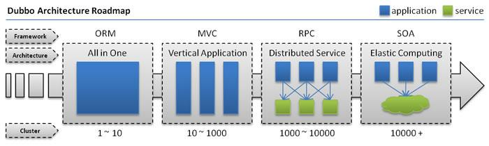

摘自：`https://youzhixueyuan.com/the-difference-between-restful-soap-rpc-soa-and-micro-service.html`

## 什么是Restful 

Restful是一种架构设计风格，提供了设计原则和约束条件，而不是架构，而满足这些约束条件和原则的应用程序或设计就是 Restful架构或服务。

**主要的设计原则**：

-  资源与URI
-  统一资源接口(HTTP方法如GET，PUT和POST)
-  资源的表述
-  资源的链接
-  状态的转移

总之，RESTful的核心就是后端将**资源**发布为**URI**，前端通过URI访问资源，并通过HTTP动词表示要对资源进行的操作。

## 什么是SOAP 

简单对象访问协议是一种数据交换协议规范，是一种轻量的、简单的、基于XML的协议的规范。SOAP协议和HTTP协议一样，都是底层的通信协议，只是请求包的格式不同而已，SOAP包是XML格式的。

SOAP的消息是基于xml并封装成了符合http协议，因此，它符合任何路由器、 防火墙或代理服务器的要求。

SOAP可以使用任何语言来完成，只要发送正确的soap请求即可，基于soap的服务可以在任何平台无需修改即可正常使用。

## RPC 

*RPC就是从一台机器（客户端）上通过参数传递的方式调用另一台机器（服务器）上的一个函数或方法（可以统称为服务）并得到返回的结果。*

*RPC 会隐藏底层的通讯细节（不需要直接处理Socket通讯或Http通讯）*

*RPC 是一个请求响应模型。客户端发起请求，服务器返回响应（类似于Http的工作方式）*

*RPC 在使用形式上像调用本地函数（或方法）一样去调用远程的函数（或方法）。*

## 4种典型RPC远程调用框架 

（1）RMI实现，利用java.rmi包实现，基于Java远程方法协议(Java Remote Method Protocol)和java的原生序列化。

（2）Hessian，是一个轻量级的remoting onhttp工具，使用简单的方法提供了RMI的功能。 基于HTTP协议，采用二进制编解码。

（3）thrift是一种可伸缩的跨语言服务的软件框架。thrift允许你定义一个描述文件，描述数据类型和服务接口。依据该文件，编译器方便地生成RPC客户端和服务器通信代码。

（4）dubbo，阿里的RPC框架。

（5）还有SpringCloud框架，微服务全家桶。为开发人员提供了快速构建分布式系统的一些工具，包括配置管理、服务发现、断路器、路由、微代理、事件总线、全局锁、决策竞选、分布式会话等等。

**微服务在本质上，就是rpc。rpc有基于tcp的，http的，mq的等等。spring cloud是基于spring boot的，spring boot 实现的是http协议的rpc，算是rpc的一个子集。**

## 什么是SOA 

SOA（Service-Oriented Architecture），中文全称：面向服务的架构。

通俗点来讲，SOA提倡将不同应用程序的业务功能封装成“服务”并宿主起来，通常以接口和契约的形式暴露并提供给外界应用访问（通过交换消息），达到不同系统可重用的目的。

SOA是一个组件模型，它能将不同的服务通过定义良好的接口和契约联系起来。服务是SOA的基石。

## 微服务和SOA的区别 

微服务是SOA架构演进的结果。两者说到底都是对外提供接口的一种架构设计方式,随着互联网的发展，复杂的平台、业务的出现，导致SOA架构向更细粒度、更通过化程度发展，就成了所谓的微服务了。

**总之，微服务是SOA发展出来的产物，它是一种比较现代化的细粒度的SOA实现方式。**

**SOA与微服务的区别在于如下几个方面：**

1.  微服务相比于SOA更加精细，微服务更多的以独立的进程的方式存在，互相之间并无影响；
2.  微服务提供的接口方式更加通用化，例如HTTP RESTful方式，各种终端都可以调用，无关语言、平台限制；
3.  微服务更倾向于分布式去中心化的部署方式，在互联网业务场景下更适合。

# 为什么要使用微服务？ 

技术为业务而生，架构也为业务而出现，当然SOA和微服务也是因为业务的发展而出现。出现SOA和微服务框架与业务的发展、平台的壮大密不可分，下面借用dubbo的网站架构发展图和说明：

- **单一应用架构**
-  当网站流量很小时，只需一个应用，将所有功能都部署在一起，以减少部署节点和成本。
-  此时，用于简化增删改查工作量的 **数据访问框架(ORM)** 是关键。
-  **垂直应用架构**
-  当访问量逐渐增大，单一应用增加机器带来的加速度越来越小，将应用拆成互不相干的几个应用，以提升效率。
-  此时，用于加速前端页面开发的 **Web框架(MVC)** 是关键。
-  **分布式服务架构**
-  当垂直应用越来越多，应用之间交互不可避免，将核心业务抽取出来，作为独立的服务，逐渐形成稳定的服务中心，使前端应用能更快速的响应多变的市场需求。
-  此时，用于提高业务复用及整合的 **分布式服务框架(RPC)** 是关键。
-  **流动计算架构**
-  当服务越来越多，容量的评估，小服务资源的浪费等问题逐渐显现，此时需增加一个调度中心基于访问压力实时管理集群容量，提高集群利用率。
-  此时，用于提高机器利用率的 **资源调度和治理中心(SOA)** 是关键。

平台随着业务的发展从 All in One 环境就可以满足业务需求（以Java来说，可能只是一两个war包就解决了）。

发展到需要拆分多个应用，并且采用MVC的方式分离前后端，加快开发效率；在发展到服务越来越多，不得不将一些核心或共用的服务拆分出来，其实发展到此阶段，如果服务拆分的足够精细，并且独立运行，我觉得就可以将之理解为一个微服务了。