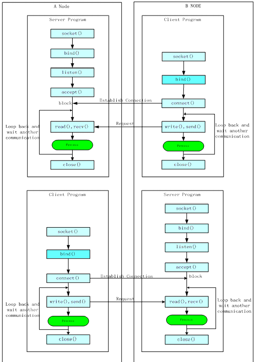
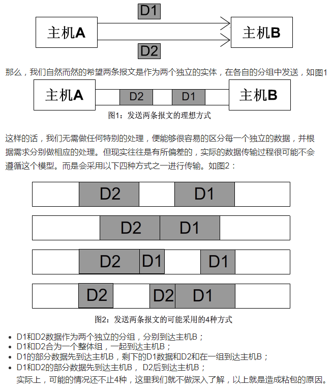
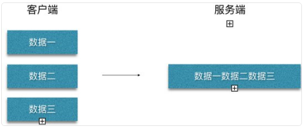
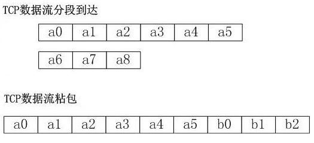
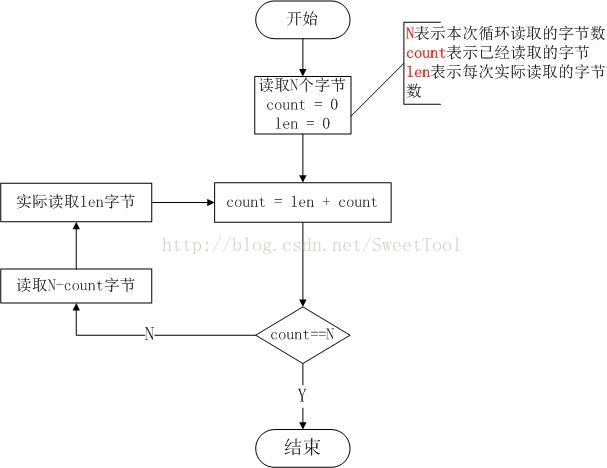
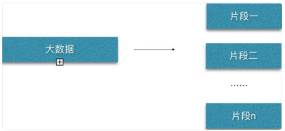
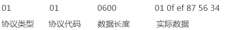
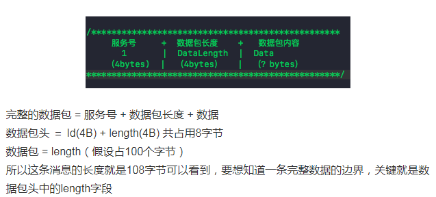

摘自：`https://blog.csdn.net/freeking101/article/details/78922846`

# 长连接和短连接


长短连接只是一个概念问题，长短连接的socket都是使用普通的socket函数，没有什么特殊的。
长连接是客户和服务器建立连接后不断开，持续用这个连接通信，持续过程中一般需要连接侦测，客户探测服务，或者服务心跳告知客户，应用层的保活机制。
短连接是通信一次后就关闭连接。长短连接是一种通信约定，需要双方一起遵守。比如在长连接时，两端都不close，客户端/服务端协议保活；短连接时两端都要主动或被动close，以完成四路释放。

如果恶意客户端就是不close怎么办？
例如服务器主动关闭，进入FIN_WAIT_1状态，这时客户端有三种情况：

① 如果客户端机器崩溃导致没有ACK响应，重传一定次数后直接回收连接。
② 如果客户端进程崩溃，客户端回送RST分节，服务器端收到RST分节后直接回收连接③ 如果客户端正常，则客户端回送ACK，服务器进入FIN_WAIT_2状态，等待客户端close，如果服务器执行了close全关闭，而客户端一直不发送FIN，则服务器等待10分75秒将进入CLOSED状态，连接被完全释放，此后客户端再close将收到RST响应。

最好的解决方案是服务器端设置SO_LINGER，当服务器执行close时就直接回收连接，发送RST分节给客户端。
什么情况下发送RST分节（复位报文段）
收到RST的连接将被系统回收，再次读写套接字端口则触发信号SIGPIPE，默认操作是终止进程。
① 客户端请求一个未监听的服务器端口，则服务器返回RST分节
② 主动异常终止一个连接。（不用4路握手释放），设置SO_LINGER选项
③ 检测半打开连接，当连接一端的主机崩溃并重启后，如果另一端发送数据，以RST响应。
④ 当监听套接字关闭时，对监听已完成队列中的连接的对端都发送RST


# 什么是半连接和半关闭

半连接是指已经建立好的连接的一端已经关闭或异常终止，而另一端却不知道（依然显示连接ESTABLISHED）的状况；半关闭是指已建立连接的一端执行半关闭，终止某个方向的数据传送，这时连接处于半关闭状态（主动关闭端FIN_WAIT_2，另一端CLOSE_WAIT）。


# 长连接和短连接概念：  

## 短连接

短连接：顾名思义，与长连接的区别就是，客户端收到服务端的响应后，立刻发送FIN消息，主动释放连接。也有服务端主动断连的情况，凡是在一次消息交互（发请求-收响应）之后立刻断开连接的情况都称为短连接。注：短连接是建立在TCP协议上的，有完整的握手挥手流程，区别于UDP协议。

短连接过程：连接->传输数据->关闭连接-> ...... -> 连接->传输数据->关闭连接 -> ...... ->连接->传输数据->关闭连接 。
也可以这样说：短连接是指SOCKET连接后发送后接收完数据后马上断开连接。
HTTP是无状态的，浏览器和服务器每进行一次HTTP操作，就建立一次连接，但任务结束就中断连接。 

HTTP协议是基于请求/响应模式的，因此只要服务端给了响应，本次HTTP连接就结束了。或者更准确的说，是本次HTTP请求就结束了，根本没有长连接这一说。那么自然也就没有短连接这一说了。之所以说HTTP分为长连接和短连接，其实本质上是说的TCP连接。TCP连接是一个双向的通道，它是可以保持一段时间不关闭的，因此TCP连接才有真正的长连接和短连接这一说。

TCP短连接的情况:

```
client 向 server 发起连接请求
server 接到请求予以相应和确认，双方建立连接
client 向 server 发送消息
server 回应 client
一次读写完成，此时双方任何一个都可以发起 close 操作，一般都是 client 先发起 close
```


## 长连接


长连接：系统通讯连接建立后就一直保持。长连接也叫持久连接，在TCP层握手成功后，不立即断开连接，并在此连接的基础上进行多次消息（包括心跳）交互，直至连接的任意一方（客户端OR服务端）主动断开连接，此过程称为一次完整的长连接。长连接意味着连接会被复用。既然长连接是指的TCP连接，也就是说复用的是TCP连接。当多个HTTP请求可以复用同一个TCP连接，这就节省了很多TCP连接建立和断开的消耗。HTTP 1.1相对于1.0最重要的新特性就是引入了长连接。

长连接过程：连接(只建立一次连接) -> 传输数据 -> 保持连接 -> ...... -> 传输数据 -> 保持连接 -> 关闭连接(只有一次关闭)。
长连接指建立SOCKET连接后不管是否使用都保持连接，但安全性较差。其实长连接是相对于通常的短连接而说的，也就是长时间保持客户端与服务端的连接状态。这就要求长连接在没有数据通信时，定时发送数据包，以维持连接状态，这就是心跳机制。短连接在没有数据传输时直接关闭就行了。

场景：比如你请求了CSDN的一个网页，这个网页里肯定还包含了CSS、JS等等一系列资源，如果你是短连接（也就是每次都要重新建立TCP连接）的话，那你每打开一个网页，基本要建立几个甚至几十个TCP连接，这就浪费了很多资源。但如果是长连接的话，那么这么多次HTTP请求（这些请求包括请求网页内容，CSS文件，JS文件，图片等等），其实使用的都是一个TCP连接，很显然是可以节省很多资源。最后关于长连接还要多提一句，那就是，长连接并不是永久连接的。如果一段时间内（具体的时间长短，是可以在header当中进行设置的，也就是所谓的超时时间），这个连接没有HTTP请求发出的话，那么这个长连接就会被断掉。这一点其实很容易理解，否则的话，TCP连接将会越来越多，直到把服务器的TCP连接数量撑爆到上限为止。现在想想，对于服务器来说，服务器里的这些个长连接其实很有数据库连接池的味道，都是为了节省连接并重复利用。


TCP长连接的操作流程:

```
client 向 server 发起连接
一次读写完成，连接不关闭
后续读写操作...
```


长连接：client方与server方先建立连接，连接建立后不断开，然后再进行报文发送和接收。这种方式下由于通讯连接一直存在。此种方式常用于P2P通信。
短连接：Client方与server每进行一次报文收发交易时才进行通讯连接，交易完毕后立即断开连接。此方式常用于一点对多点通讯。C/S通信。


如何快速区分当前连接使用的是长连接还是短连接

凡是在一次完整的消息交互（发请求-收响应）之后，立刻断开连接（有一方发送FIN消息）的情况都称为短连接；
长连接的一个明显特征是会有心跳消息（也有没有心跳的情况），且一般心跳间隔都在30S或者1MIN左右，用wireshark抓包可以看到有规律的心跳消息交互（可能会存在毫秒级别的误差）。

## 长连接与短连接的使用时机

长连接多用于操作频繁，点对点的通讯，而且连接数不能太多的情况。每个TCP连接的建立都需要三次握手，每个TCP连接的断开要四次握手。如果每次操作都要建立连接然后再操作的话处理速度会降低，所以每次操作下次操作时直接发送数据就可以了，不用再建立TCP连接。例如：数据库的连接用长连接，如果用短连接频繁的通信会造成socket错误，频繁的socket创建也是对资源的浪费。

短连接：web网站的http服务一般都用短连接。因为长连接对于服务器来说要耗费一定的资源。像web网站这么频繁的成千上万甚至上亿客户端的连接用短连接更省一些资源。试想如果都用长连接，而且同时用成千上万的用户，每个用户都占有一个连接的话，可想而知服务器的压力有多大。所以并发量大，但是每个用户又不需频繁操作的情况下需要短连接。

总之：长连接和短连接的选择要视需求而定。

## 长连接的心跳机制

通讯实体间使用长连接时，一般还需要定义心跳消息，定期发送来检测系统间链路是否异常，每隔一定时间发送一次心跳，如果一定次数没有收到心跳消息，这认为此连接出现问题，需要断开连接重新建立。具体心跳消息的格式，以及发送间隔，以及多少次没有收到心跳就认为链路异常，以及数据部是否算作心跳消息（有的系统如果接收到数据包则会清除心跳计时器也就相当于系统中的数据包也算作心跳消息）；这个需要两端进行协商。比如GSM常用的短消息中心和其他网络实体互连的SMPP协议，要求建立的就是长连接.

心跳包之所以叫心跳包是因为：它像心跳一样每隔固定时间发一次，以此来告诉服务器，这个客户端还活着。事实上这是为了保持长连接，至于这个包的内容，是没有什么特别规定的，不过一般都是很小的包，或者只包含包头的一个空包。

在TCP的机制里面，本身是存在有心跳包的机制的，也就是TCP的选项：SO_KEEPALIVE。系统默认是设置的2小时的心跳频率。但是它检查不到机器断电、网线拔出、防火墙这些断线。而且逻辑层处理断线可能也不是那么好处理。一般，如果只是用于保活还是可以的。

心跳包一般来说都是在逻辑层发送空的echo包来实现的。下一个定时器，在一定时间间隔下发送一个空包给客户端，然后客户端反馈一个同样的空包回来，服务器如果在一定时间内收不到客户端发送过来的反馈包，那就只有认定说掉线了。

其实，要判定掉线，只需要send或者recv一下，如果结果为零，则为掉线。但是，在长连接下，有可能很长一段时间都没有数据往来。理论上说，这个连接是一直保持连接的，但是实际情况中，如果中间节点出现什么故障是难以知道的。更要命的是，有的节点（防火墙）会自动把一定时间之内没有数据交互的连接给断掉。在这个时候，就需要我们的心跳包了，用于维持长连接，保活。

在获知了断线之后，服务器逻辑可能需要做一些事情，比如断线后的数据清理呀，重新连接呀……当然，这个自然是要由逻辑层根据需求去做了。


TCP的socket本身就是长连接，为什么还需要心跳包?

内网机器如果不主动向外发起连接，外网机没法直接连接内网的，这也是内网机安全的原因之一，又因为路由器会把这个关系记录下来，但是过一段时间这个纪录可能会丢失，所以每一个客户端每个一定时间就会向服务器发送消息，以确保服务器可以随时找到你，这个东西被称为心跳包。
理论上说，这个连接事一直保持连接的，但实际情况中，如果中间出现什么情况是难以想象的。更要命的是，有的节点（防火墙）会自动把一定时间之内没有数据交互的连接给断掉。这个时候我们就需要心跳包了，用于维持长连接，保活。
总之：心跳包主要也就是用于长连接的保活和断线处理。一般的应用下，判定时间在30-40秒比较不错。如果实在要求高，那就在6-9秒。在TCP socket心跳机制中，心跳包可以由服务器发送给客户端，也可以由客户端发送给服务器，不过比较起来，前者开销可能更大。


一个由客户端给服务器发送心跳包，基本思路是：

服务器为每个客户端保存了IP和计数器count，即map<fd, pair<ip, count>>。服务端主线程采用 select 实现多路IO复用监听新连接以及接受数据包（心跳包），子线程用于检测心跳：
如果主线程接收到的是心跳包，将该客户端对应的计数器 count 清零；
在子线程中，每隔3秒遍历一次所有客户端的计数器 count： 
若 count 小于 5，将 count 计数器加 1；
若 count 等于 5，说明已经15秒未收到该用户心跳包，判定该用户已经掉线；
客户端则只是开辟子线程，定时给服务器发送心跳包（本示例中定时时间为3秒）。

# 长轮询和短轮询

HTTP协议中的短轮询、长轮询、长连接和短连接：http://web.jobbole.com/85541/


**保护消息边界和流**

保护消息边界，就是指传输协议把数据当作一条独立的消息在网上传输，接收端只能接收独立的消息。也就是说存在保护消息边界，接收端一次只能接收发送端发出的一个数据包。而面向流则是指无保护消息保护边界的，如果发送端连续发送数据，接收端有可能在一次接收动作中，会接收两个或者更多的数据包。
例如，我们连续发送三个数据包，大小分别是2k，4k ，8k,这三个数据包，都已经到达了接收端的网络堆栈中，如果使用UDP协议，不管我们使用多大的接收缓冲区去接收数据，我们必须有三次接收动作，才能够把所有的数据包接收完.而使用TCP协议，我们只要把接收的缓冲区大小设置在14k以上，我们就能够一次把所有的数据包接收下来，只需要有一次接收动作。

注意：这就是因为UDP协议的保护消息边界使得每一个消息都是独立的。而流传输却把数据当作一串数据流，他不认为数据是一个一个的消息。所以有很多人在使用tcp协议通讯的时候，并不清楚tcp是基于流的传输，当连续发送数据的时候，他们时常会认识tcp会丢包。其实不然，因为当他们使用的缓冲区足够大时，他们有可能会一次接收到两个甚至更多的数据包，而很多人往往会忽视这一点，只解析检查了第一个数据包，而已经接收的其他数据包却被忽略了。所以大家如果要作这类的网络编程的时候,必须要注意这一点。

# Client 和 Server 通信发送与接收方式设计


在长连接中一般是没有条件能够判断读写什么时候结束，所以必须要加长度报文头。读函数先是读取报文头的长度，再根据这个长度去读相应长度的报文。

在通信数据发送与接收之间也存在不同的方式，即同步和异步两种方式。这里的同步和异步与 I/O 层次的同异步概念不同。主要涉及 socket APIs recv() 和 send() 的不同组合方式。


**同步发送与接收**

从应用程序设计的角度讲，报文发送和接收是同步进行的，既报文发送后，发送方等待接收方返回消息报文。同步方式一般需要考虑超时问题，即报文发出去后发送 方不能无限等待，需要设定超时时间，超过该时间后发送方不再处于等待状态中，而直接被通知超时返回。同步发送与接收经常与短连接通信方式结合使用，称为同 步短连接通信方式，其 socket 事件流程可如上面的图 １２ 所示。


**异步发送与接收**

从应用程序设计的角度讲，发送方只管发送数据，不需要等待接收任何返回数据，而接收方只管接收数据，这就是应用层的异步发送与接收方式。要实现异步方式， 通常情况下报文发送和接收是用两个不同的进程来分别处理的，即发送与接收是分开的，相互独立的，互不影响。异步发送与接收经常与长连接通信方式结合使用， 称为异步长连接通信方式。从应用逻辑角度讲，这种方式又可分双工和单工两种情况。


**异步双工**

异步双工是指应用通信的接收和发送在同一个程序中，而有两个不同的子进程分别负责发送和接收，异步双工模式是比较复杂的一种通信方式，有时候经常会出现在 不同机构之间的两套系统之间的通信。比如银行与银行之间的信息交流。它也可以适用在现代 P2P 程序中。如图 １４ 所示，Server 和 Client 端分别 fork 出两个子进程，形成两对子进程之间的连接，两个连接都是单向的，一个连接是用于发送，另一个连接用于接收，这样方式的连接就被称为异步双工方式连接。


**异步单工**
应用通信的接收和发送是用两个不同的程序来完成，这种异步是利用两对不同程序依靠应用逻辑来实现的。下面图显示了长连接方式下的异步单工模式，在通信的 A 和 B 端，分别有两套 Server 和 Client 程序，B 端的 Client 连接 A 端的 Server，A 端的 Server 只负责接收 B 端 Client 发送的报文。A 端的 Client 连接 B 端的 Server，A 端 Client 只负责向 B 端 Server 发送报文。



# 粘包和拆包


**之所以出现粘包和半包现象,是因为TCP当中，只有流的概念，没有包的概念 。**

TCP是一种流协议（stream protocol）。这就意味着数据是以字节流的形式传递给接收者的，没有固有的"报文"或"报文边界"的概念。从这方面来说，读取TCP数据就像从串行端口读取数据一样--无法预先得知在一次指定的读调用中会返回多少字节（也就是说能知道总共要读多少，但是不知道具体某一次读多少）

看一个例子:我们假设在主机A和主机B的应用程序之间有一条TCP连接，主机A有两条报文D1,D2要发送到B主机，并两次调用send来发送，每条报文调用一次。



 **半包**
指接受方没有接受到一个完整的包，只接受了部分，这种情况主要是由于TCP为提高传输效率，将一个包分配的足够大，导致接受方并不能一次接受完。（ 在长连接和短连接中都会出现）。  

**粘包与分包**
指发送方发送的若干个包数据到接收方接收时粘成一个完整的包数据，从接收缓冲区看，后一包数据的头紧接着前一包数据的尾。如下图：客户端同一时间发送几条数据，而服务端只能收到一大条数据，  



由于传输的过程为数据流，经过 TCP 传输后，**三条数据被合并成了一条，这就是数据粘包了**。

出现粘包现象的原因是多方面的，它既可能由发送方造成，也可能由接收方造成。

​        发送方引起的粘包是由TCP协议本身造成的，TCP为提高传输效率，发送方往往要收集到足够多的数据后才发送一包数据。若连续几次发送的数据都很少，通常TCP会根据优化算法把这些数据合成一包后一次发送出去，这样接收方就收到了粘包数据。这么做优点也很明显，就是为了减少广域网的小分组数目，从而减小网络拥塞的出现。总的来说就是：发送端发送了几次数据，接收端一次性读取了所有数据，造成多次发送一次读取；通常是网络流量优化，把多个小的数据段集满达到一定的数据量，从而减少网络链路中的传输次数。

​        接收方引起的粘包是由于接收方用户进程不及时接收数据，从而导致粘包现象。这是因为接收方先把收到的数据放在系统接收缓冲区，用户进程从该缓冲区取数据，若下一包数据到达时前一包数据尚未被用户进程取走，则下一包数据放到系统接收缓冲区时就接到前一包数据之后，而用户进程根据预先设定的缓冲区大小从系统接收缓冲区取数据，这样就一次取到了多包数据。分包是指在出现粘包的时候我们的接收方要进行分包处理。（在长连接中都会出现）。总的来说就是：发送端发送了数量比较多的数据，接收端读取数据时候数据分批到达，造成一次发送多次读取；通常和网络路由的缓存大小有关系，一个数据段大小超过缓存大小，那么就要拆包发送。

如图所示：



TCP粘包的解决方案有很多种方法，最简单的一种就是发送的数据协议定义发送的数据包的结构：

1. 数据头：数据包的大小，固定长度。
2. 数据内容：数据内容，长度为数据头定义的长度大小。

实际操作如下：

- 发送端：先发送数据包的大小，再发送数据内容。
- 接收端：先解析本次数据包的大小N，在读取N个字节，这N个字节就是一个完整的数据内容。

具体流程如下：



初涉socket编程的朋友经常有下面一些疑惑：
\1. 为什么我发了3次，另一端只收到2次？
\2. 我每次发送都成功了，为什么对方收到的信息不完整？
这些疑惑往往是对send和recv这两个函数理解不准确所致。send和recv都提供了一个长度参数。对于send而言，这是你希望发送的字节数，而对于recv而言，则是希望收到的最大字节数。

tcp粘包、半包的处理方式：一是采用分隔符的方式，采用特殊的分隔符作为一个数据包的结尾；二是采用给每个包的特定位置（如包头两个字节）加上数据包的长度信息，另一端收到数据后根据数据包的长度截取特定长度的数据解析，假设包头信息的数据长度为infoLen，接收到的数据包真实长度为trueLen，那么有如下几种情况：

- 1： infoLen>trueLen，半包。

- 2： infoLen<trueLen，粘包。

- 3： infoLen=trueLen，正常。

    

```cpp
/**  
 * read size of len from sock into buf.  
 */    
bool readPack(int sock, char* buf, size_t len) 
{    
    if (NULL == buf || len < 1) 
    {
        return false;    
    }    
    memset(buf, 0, len); // only reset buffer len.    
    ssize_t read_len = 0, readsum = 0;    
    do 
    {    
        read_len = read(sock, buf + readsum, len - readsum);    
        if (-1 == read_len) // ignore error case    
        { 
            return false;    
        }    
        printf("receive data: %s\n", buf + readsum);    
        readsum += read_len;    
    } while (readsum < len && 0 != read_len);    
    return true;    
} 
```

  测试用例介绍：提供的demo主要流程如下：

1. 客户端负责模拟发送数据，服务端负责接受数据，处理粘包问题
    a）emulate_subpackage
            模拟情况1，一个长数据经过多次才到达目的地，
            在客户端字符串“This is a test case for client send subpackage data. data is not send complete at once.”每次只发送6个字节长度。服务端要把字符串集满才能处理数据（打印字符串）

b）emulate_adheringpackage
        模拟情况2，多个数据在一次性到达目的地
        在客户端将字符串“Hello I'm lucky. Nice too me you”切成三个数据段（都包含数据头和数据内容），然后一次性发送，服务端读取数据时对三个数据段逐个处理。  


```cpp
server.cpp

#include <cstdio>
#include <cstdlib>
#include <cstring>
#include <errno.h>
#include <sys/socket.h>
#include <sys/types.h>
#include <arpa/inet.h>
#include <unistd.h>
 
#define PORT 12345  // 端口
#define CONN 5      // 接收连接数
 
void newClient(int sockfd);                        
bool readPack(int sockfd, char* buf, size_t len);  // 读取数据
void safeAndClose(int &sockfd);
 
int main()
{
    int sockfd = -1, newsockfd = -1;
    socklen_t len = 0;
    struct sockaddr_in server_addr, client_addr;
 
    //creat socket
    if((sockfd = socket(AF_INET, SOCK_STREAM, 0))<0)
    {
        printf("Creat socket fail and errno: %d\n", errno);
        exit(errno);
    }
    printf("sockfd : %d\n", sockfd);
    
    bzero(&server_addr, sizeof(sockaddr_in));
    server_addr.sin_family=AF_INET;
    server_addr.sin_addr.s_addr=INADDR_ANY;
    server_addr.sin_port=htons(PORT);
    
    if((bind(sockfd, (sockaddr*)&server_addr, sizeof(server_addr)))<0)
    {
        printf("Bind fail and errno: %d\n", errno);
        exit(errno);
    }
 
    if((listen(sockfd, CONN))<0)
    {
        printf("Listen fail and errno: %d\n",errno);
        exit(errno);
    }
    printf("start listening...\n");
    len = sizeof(sockaddr_in);
    int i = 0;
    while(i++ < 3)
    {
        printf("start accept\n");
        newsockfd = accept(sockfd, (sockaddr*)&client_addr,&len);
        if(newsockfd<0)
        {
            printf("accept fail and errno: %d\n", errno);
            exit(errno);
        }
 
        pid_t pid = fork();
        if(0==pid) //子进程
        {
            safeAndClose(sockfd); //子进程关闭监听的描述符
            newClient(newsockfd);
            break;            
        }
        else if(pid >0) //父进程只接收客户端连接
        {
            safeAndClose(newsockfd); //父进程关闭和客户端通信的描述符
        }
    }
    safeAndClose(sockfd);
    return 0;
}
 
void newClient(int sockfd)
{
    printf("new client socket fd: %d\n", sockfd);
    int dataSize=0;
    const int HEAD_SIZE=9; //头部大小
    char buf[512] = {0};
    for(;;)
    {
        memset(buf, 0, sizeof(buf));
 
        //read head 
        if(!readPack(sockfd, buf, HEAD_SIZE))
        {
            printf("read head buf fail\n");
            safeAndClose(sockfd);
            return;
        }
        dataSize = atoi(buf);//头部数据里面保存要接收收据长度
        printf("data size: %s, value:%d\n", buf, dataSize);
        memset(buf, 0, sizeof(buf));
        if(!readPack(sockfd, buf, dataSize))
        {
            printf("read data buf fail\n");
            safeAndClose(sockfd);
            return ;
        }
        printf("data size: %d, Text: %s\n", dataSize, buf);
        if(0==strcmp(buf, "exit")) break;
    }
    memset(buf, 0, sizeof(buf));
    snprintf(buf, sizeof(buf), "server -> client : from server read complete.");
    write(sockfd, buf, strlen(buf)+1);
    printf("new client socket fd: %d finish\n", sockfd);
    safeAndClose(sockfd);
}
 
 
bool readPack(int sockfd, char* buf, size_t len)
{
    if(NULL==buf || len<1)
    {
        return false;
    }
    memset(buf, 0, len);
    ssize_t read_len = 0, read_sum = 0;
    do{
        read_len = read(sockfd, buf+read_sum, len-read_sum);
        if(read_len == -1) return false;
        printf("receive data : %s\n",buf+read_sum);
        read_sum += read_len;
    }while(read_sum<len && 0 !=read_len);
    return true;
}
 
void safeAndClose(int &sockfd)
{
    if(sockfd > 0)
    {
        close(sockfd);
        sockfd = -1;
    }
}
```


```cpp
client.cpp

#include <cstdio>    
#include <cstdlib>    
#include <cstring>    
#include <time.h>    
#include <errno.h>    
#include <sys/socket.h>    
#include <arpa/inet.h>    
#include <unistd.h>    
 
#define PORT 12345
    
void safe_close(int &sock);    
void emulate_subpackage(int sock);    
void emulate_adheringpackage(int sock);    
    
int main(int argc, char *argv[])   
{    
    char buf[128] = {0};    
    int sockfd = -1;    
    struct sockaddr_in serv_addr;    
    
    // Create sock    
    sockfd = socket(AF_INET, SOCK_STREAM, 0);    
    if (-1 == sockfd)   
    {    
        printf("new socket failed. errno: %d, error: %s\n", errno, strerror(errno));    
        exit(-1);    
    }    
    
    serv_addr.sin_addr.s_addr = inet_addr("127.0.0.1");    
    serv_addr.sin_family = AF_INET;    
    serv_addr.sin_port = htons(PORT);    
    
    // Connect to remote server    
    if (connect(sockfd, (sockaddr *)&serv_addr, sizeof(serv_addr)) < 0)   
    {    
        printf("connection failed. errno: %d, error: %s\n", errno, strerror(errno));    
        exit(-1);    
    }    
    emulate_subpackage(sockfd);    
    emulate_adheringpackage(sockfd);    
    
    const int HEAD_SIZE = 9;    
    const char temp[] = "exit";    
    memset(buf, 0, sizeof(buf));    
    snprintf(buf, sizeof(buf), "%0.*zu", HEAD_SIZE - 1, sizeof(temp));    
    write(sockfd, buf, HEAD_SIZE);    
    write(sockfd, temp, sizeof(temp));    
    
    printf("send complete.\n");    
    memset(buf, 0, sizeof(buf));    
    read(sockfd, buf, sizeof(buf));    
    printf("receive data: %s\n", buf);    
    printf("client finish.\n");    
    
    safe_close(sockfd);    
    return 0;    
}    
    
void safe_close(int &sock)   
{    
    if (sock > 0) {    
        close(sock);    
        sock = -1;    
    }    
}    
    
/**  
 * emulate socket data write multi part.  
 */    
void emulate_subpackage(int sock)   
{    
    printf("emulate_subpackage...\n");    
    char text[] = "This is a test case for client send subpackage data. data is not send complete at once.";    
    const size_t TEXTSIZE = sizeof(text);    
    ssize_t len = 0;    
    size_t sendsize = 0, sendsum = 0;    
    
    const int HEAD_SIZE = 9;    
    char buf[64] = {0};    
    snprintf(buf, HEAD_SIZE, "%08zu", TEXTSIZE);    
    write(sock, buf, HEAD_SIZE);    
    printf("send data size: %s\n", buf);    
    
    do   
    {    
        sendsize = 6;    
        if (sendsum + sendsize > TEXTSIZE)   
        {    
            sendsize = TEXTSIZE - sendsum;    
        }    
        len = write(sock, text + sendsum, sendsize);    
        if (-1 == len)   
        {    
            printf("send data failed. errno: %d, error: %s\n", errno, strerror(errno));    
            return;    
        }    
        memset(buf, 0, sizeof(buf));    
        snprintf(buf, len + 1, text + sendsum);    
        printf("send data: %s\n", buf);    
        sendsum += len;    
        sleep(1);    
    } while (sendsum < TEXTSIZE && 0 != len);    
}    
    
/**  
 * emualte socket data write adhering.  
 */    
void emulate_adheringpackage(int sock)   
{    
    printf("emulate_adheringpackage...\n");    
    const int HEAD_SIZE = 9;    
    char buf[1024] = {0};    
    char text[128] = {0};    
    char *pstart = buf;    
    
    // append text    
    memset(text, 0, sizeof(text));    
    snprintf(text, sizeof(text), "Hello ");    
    snprintf(pstart, HEAD_SIZE, "%08zu", strlen(text) + 1);    
    pstart += HEAD_SIZE;    
    snprintf(pstart, strlen(text) + 1, "%s", text);    
    pstart += strlen(text) + 1;    
    
    // append text    
    memset(text, 0, sizeof(text));    
    snprintf(text, sizeof(text), "I'm lucky.");    
    snprintf(pstart, HEAD_SIZE, "%08zu", strlen(text) + 1);    
    pstart += HEAD_SIZE;    
    snprintf(pstart, strlen(text) + 1, "%s", text);    
    pstart += strlen(text) + 1;    
    
    // append text    
    memset(text, 0, sizeof(text));    
    snprintf(text, sizeof(text), "Nice too me you");    
    snprintf(pstart, HEAD_SIZE, "%08zu", strlen(text) + 1);    
    pstart += HEAD_SIZE;    
    snprintf(pstart, strlen(text) + 1, "%s", text);    
    pstart += strlen(text) + 1;    
    write(sock, buf, pstart - buf);    
} 
```


```makefile
CC=g++  
CFLAGS=-I  
  
all: server.o client.o  
  
server.o: server.cpp  
    $(CC) -o server.o server.cpp  
  
client.o: client.cpp  
    $(CC) -o client.o client.cpp  
  
clean:  
    rm *.o  
```


```
结果：
编译及运行
$ make
g++ -o server.o server.cpp
g++ -o client.o client.cpp
客户端模拟发送数据
$ ./client.o 
emulate_subpackage...
send data size: 00000088
send data: This i
send data: s a te
send data: st cas
send data: e for
send data: client
send data: send
send data: subpac
send data: kage d
send data: ata. d
send data: ata is
send data: not s
send data: end co
send data: mplete
send data: at on
send data: ce.
emulate_adheringpackage...
send complete.
receive data: from server read complete.
client finish.
 
服务端模拟接受数据
$ ./server.o 
listening...
waiting for new socket accept.
waiting for new socket accept.
newclient sock fd: 4
receive data: 00000088
data size: 00000088, value:88
receive data: This i
receive data: s a te
receive data: st cas
receive data: e for
receive data: client
receive data: send
receive data: subpac
receive data: kage d
receive data: ata. d
receive data: ata is
receive data: not s
receive data: end co
receive data: mplete
receive data: at on
receive data: ce.
data size: 88, text: This is a test case for client send subpackage data. data is not send complete at once.
receive data: 00000007
data size: 00000007, value:7
receive data: Hello
data size: 7, text: Hello
receive data: 00000011
data size: 00000011, value:11
receive data: I'm lucky.
data size: 11, text: I'm lucky.
receive data: 00000016
data size: 00000016, value:16
receive data: Nice too me you
data size: 16, text: Nice too me you
receive data: 00000005
data size: 00000005, value:5
receive data: exit
data size: 5, text: exit
newclient sockfd: 4, finish.
```

**示例程序2：**

发送消息端，即服务器端：

```cpp
using System;
using System.Collections.Generic;
using System.Linq;
using System.Text;
using System.Net;
using System.Net.Sockets;
using System.Collections;
using System.Diagnostics;
 
namespace _07发送变长消息的方法
{
    class Program
    {
        static void Main(string[] args)
        {
            #region 先将发送的消息带上首尾标记< > 再将要发送的所有消息，放在一个字符串中 然后一次性发送给客户端
            DateTime start = DateTime.Now;//记录程序的运行时间
            string str = null;
            double[] test = { 10.3, 15.2, 25.3, 13.338, 25.41, 0.99, 2017, 20000, 1, 3, 2, 5, 8, 90, 87, 33, 55, 99, 100 };
            IPEndPoint IPep2 = new IPEndPoint(IPAddress.Any, 127);
            Socket newsock2 = new Socket(AddressFamily.InterNetwork, SocketType.Stream, ProtocolType.Tcp);
            newsock2.Bind(IPep2);
            newsock2.Listen(10);
            Console.WriteLine("等待新客户端的连接");
            Socket client2 = newsock2.Accept();//等待客户端的连接
            IPEndPoint clientep2 = (IPEndPoint)client2.RemoteEndPoint;
            Console.WriteLine("与{0}连接在{1}端口", clientep2.Address, clientep2.Port);
            string welcome2 = "welcome to the new server";
            byte[] data;
            str += SpecialMessage(welcome2);//将要发送的消息，都放在字符串str中
 
            //发送数组的长度信息 给字符串str
            str += SpecialMessage(test.Length.ToString());
 
            //用循环的形式 依次将数组中的元素给str
            string[] strvalue = new string[test.Length];
            for (int j = 0; j < test.Length; j++)
            {
                strvalue[j] = test[j].ToString();//将实际速度集合转换为string数组
                str += SpecialMessage(strvalue[j]);
            }
 
            //将所有发送的信息，都放在了str中，然后一次性的发送过去 注意都是有首尾标记的消息< >
            data = System.Text.Encoding.ASCII.GetBytes(str);
            client2.Send(data);
 
            DateTime end = DateTime.Now;
            TimeSpan span = end - start;
            double seconds = span.TotalSeconds;
            Console.WriteLine("程序运行的时间是{0}s", seconds);
 
 
            Console.WriteLine("传送数据成功！");
            client2.Close();//释放资源
            newsock2.Close();
            Console.ReadKey();
            #endregion
 
 
            #region 采用变长的消息 即发送时先告诉客户端 消息的长度是多少
            //DateTime start = DateTime.Now;
            //double[] test = { 10.3, 15.2, 25.3, 13.338, 25.41, 0.99, 2017, 20000, 1, 3, 2, 5, 8, 90, 87, 33, 55, 99, 100 };
            //IPEndPoint IPep2 = new IPEndPoint(IPAddress.Any, 127);
            //Socket newsock2 = new Socket(AddressFamily.InterNetwork, SocketType.Stream, ProtocolType.Tcp);
            //newsock2.Bind(IPep2);
            //newsock2.Listen(10);
            //Console.WriteLine("等待新客户端的连接");
            //Socket client2 = newsock2.Accept();//等待客户端的连接
            //IPEndPoint clientep2 = (IPEndPoint)client2.RemoteEndPoint;
            //Console.WriteLine("与{0}连接在{1}端口", clientep2.Address, clientep2.Port);
            //string welcome2 = "welcome to the new server";
            //byte[] date = Encoding.ASCII.GetBytes(welcome2);//字符串转换为字节数组  传送给客户端
            //SendVarMessage(client2, date);
 
 
            ////发送数组的长度信息 给客户端
            //date = Encoding.ASCII.GetBytes(test.Length.ToString());
            //SendVarMessage(client2, date);
 
            ////用循环的形式 依次将数组中的元素发送给客户端
            //string[] strvalue = new string[test.Length];
            //for (int j = 0; j < test.Length; j++)
            //{
            //    strvalue[j] = test[j].ToString();//将实际速度集合转换为string数组
            //    date = Encoding.ASCII.GetBytes(strvalue[j]);//string数组中的每个元素一次转换为字节 发送给客户端
            //    SendVarMessage(client2, date);
            //}
 
            //DateTime end = DateTime.Now;
            //TimeSpan span = end - start;
            //double seconds = span.TotalSeconds;
            //Console.WriteLine("程序运行的时间是{0}s", seconds);
 
            //Console.WriteLine("传送数据成功！");
            //client2.Close();//释放资源
            //newsock2.Close();
            //Console.ReadKey();
            #endregion
        }
 
        /// <summary>
        /// 发送变长消息方法
        /// </summary>
        /// <param name="s"></param>
        /// <param name="msg"></param>
        /// <returns>不需要返回值</returns>
        private static void SendVarMessage(Socket s, byte[] msg)
        {
            int offset = 0;
            int sent;
            int size = msg.Length;
            int dataleft = size;
            byte[] msgsize = new byte[2];
 
            //将消息的尺寸从整型转换成可以发送的字节型
            //因为int型是占4个字节 所以msgsize是4个字节 后边是空字节
            msgsize = BitConverter.GetBytes(size);
 
            //发送消息的长度信息
            //之前总是乱码出错 客户端接收到的欢迎消息前两个字节是空 后边的两个字符er传送到第二次接收的字节数组中
            //因此将er字符转换为int出错  这是因为之前在Send代码中，是将msgsize整个字节数组发送给客户端 所以导致第3 4个空格也发送
            //导致发送的信息混乱 这两个空格使发送的信息都往后挪了两个位置  从而乱码
            sent = s.Send(msgsize, 0, 2, SocketFlags.None);
            while (dataleft > 0)
            {
                int sent2 = s.Send(msg, offset, dataleft, SocketFlags.None);
                //设置偏移量
                offset += sent2;
                dataleft -= sent2;
            }
        }
 
 
 
        /// <summary>
        /// 给发送的消息 加特殊结束标记 头尾分别加"<" ">"
        /// </summary>
        /// <param name="s"></param>
        /// <param name="msg"></param>
        private static string SpecialMessage(string str)
        {
            string strNew = "<";
            strNew += str;
            strNew += ">";
            return strNew;
        }
    }
}
```

接收消息端，即客户端：

```cpp
using System;
using System.Collections.Generic;
using System.Linq;
using System.Text;
using System.Net;
using System.Net.Sockets;
using System.Collections;
 
namespace _08接收变长消息的方法
{
    class Program
    {
        static void Main(string[] args)
        {
            #region 接收带有首尾特殊标记符的消息
            DateTime start = DateTime.Now;
            byte[] data = new byte[1024];
            IPEndPoint IPep2 = new IPEndPoint(IPAddress.Parse("127.0.0.1"), 127);
            Socket server2 = new Socket(AddressFamily.InterNetwork, SocketType.Stream, ProtocolType.Tcp);
            try
            {
                server2.Connect(IPep2);
                Console.WriteLine("连接成功");
            }
            catch (SocketException e)
            {
                Console.WriteLine("连接服务器失败");
                Console.WriteLine(e.ToString());
                Console.ReadKey();
                return;
            }
            finally
            { }
            //接收来自服务器的数据
            server2.Receive(data);
 
            //一次性接收了服务器端发来的数据 利用ReceiveSpecialMessage方法接收并根据特殊标记
            //将消息一条一条的放在字符串数组strs中
            string[] strs = ReceiveSpecialMessage(data);
            string stringData = strs[0];
            Console.WriteLine(stringData);//接收并显示欢迎消息    成功！
 
            string length = strs[1];
            Console.WriteLine("共接收到{0}个数据", length);
            int n = Convert.ToInt32(length);
 
            //依次接收来自服务器端传送的实际速度值 成功！
            string[] speed = new string[n];
            for (int i = 0; i < n; i++)
            {
                speed[i] = strs[i + 2];
                Console.WriteLine("第{0}次的实际速度是{1}", i + 1, speed[i]);
            }
 
            DateTime end = DateTime.Now;
            TimeSpan span = end - start;
            double seconds = span.TotalSeconds;
            Console.WriteLine("程序运行的时间是{0}s", seconds);
            server2.Shutdown(SocketShutdown.Both);
            server2.Close();
            Console.ReadKey();
            #endregion
 
            #region 接收变长的消息 无特殊标记符
            //DateTime start = DateTime.Now;
            //byte[] data = new byte[1024];
            //IPEndPoint IPep2 = new IPEndPoint(IPAddress.Parse("127.0.0.1"), 127);
            //Socket server2 = new Socket(AddressFamily.InterNetwork, SocketType.Stream, ProtocolType.Tcp);
            //try
            //{
            //    server2.Connect(IPep2);
            //    Console.WriteLine("连接服务器成功");
            //}
            //catch (SocketException e)
            //{
            //    Console.WriteLine("连接服务器失败");
            //    Console.WriteLine(e.ToString());
            //    Console.ReadKey();
            //    return;
            //}
            //finally
            //{ }
            ////接收来自服务器的数据
            //data = ReceiveVarMessage(server2);
            //string stringData = Encoding.ASCII.GetString(data, 0, data.Length);
            //Console.WriteLine(stringData);//接收并显示欢迎消息    成功！
 
            //data = ReceiveVarMessage(server2);
            //string length = Encoding.ASCII.GetString(data);
            //Console.WriteLine("共接收到{0}个数据", length);
            //int n = Convert.ToInt32(length);
 
            ////依次接收来自服务器端传送的实际速度值 成功！
            //string[] speed = new string[n];
            //for (int i = 0; i < n; i++)
            //{
            //    data = ReceiveVarMessage(server2);
            //    speed[i] = Encoding.ASCII.GetString(data, 0, data.Length);
            //    Console.WriteLine("第{0}次的实际速度是{1}", i + 1, speed[i]);
            //}
 
            //DateTime end = DateTime.Now;
            //TimeSpan span = end - start;
            //double seconds = span.TotalSeconds;
            //Console.WriteLine("程序运行的时间是{0}s", seconds);
 
            //server2.Shutdown(SocketShutdown.Both);
            //server2.Close();
            //Console.ReadKey();
            #endregion
        }//Main函数
 
 
        /// <summary>
        /// 接收变长消息方法
        /// </summary>
        /// <param name="s"></param>
        /// <returns>接收到的信息</returns>
        private static byte[] ReceiveVarMessage(Socket s)//方法的返回值是字节数组 byte[] 存放的是接受到的信息
        {
            int offset = 0;
            int recv;
            byte[] msgsize = new byte[2];
 
            //接收2个字节大小的长度信息
            recv = s.Receive(msgsize, 0, 2, 0);
 
            //将字节数组的消息长度转换为整型
            int size = BitConverter.ToInt16(msgsize, 0);
            int dataleft = size;
            byte[] msg = new byte[size];
            while (dataleft > 0)
            {
                //接收数据
                recv = s.Receive(msg, offset, dataleft, 0);
                if (recv == 0)
                {
                    break;
                }
                offset += recv;
                dataleft -= recv;
            }
            return msg;
        }
 
 
        /// <summary>
        /// 接收结尾带有特殊标记的消息   哈哈
        /// </summary>
        /// <param name="s"></param>
        /// <returns></returns>
        private static string[] ReceiveSpecialMessage(byte[] data)
        {
            string str = Encoding.ASCII.GetString(data);
            int i = 0;
            int j = 1;
            List<int> list_i = new List<int>();
            List<int> list_j = new List<int>();
            while (i < str.Length)  //找到特殊标记符 < 所在位置
            {
                if (str[i].ToString() == "<")
                {
                    list_i.Add(i);
                    i++;
                }
                else
                {
                    i++;
                    continue;
                }
            }
            while (j < str.Length)  //找到特殊标记符 > 所在的位置
            {
 
                if (str[j].ToString() == ">")
                {
                    list_j.Add(j);
                    j++;
                }
                else
                {
                    j++;
                    continue;
                }
            }
            string[] strs = new string[list_i.Count];
            for (int i1 = 0; i1 < strs.Length; i1++)
            {
                strs[i1] = str.Substring(list_i[i1] + 1, list_j[i1] - list_i[i1] - 1); //截取 < > 之间的字符串，是我们要的消息
            }
            return strs;
        }
    }
}
```

UDP 就不会有上面这种情况，它不会使用块的合并优化算法。当然除了优化算法，TCP 和 UDP 都会因为下面两种情况造成粘包：断包

断包比较好理解的，比如我们发送一条很大的数据包，类似图片和录音等等，很显然一次发送或者读取数据的缓冲区大小是有限的，所以我们会分段去发送或者读取数据。




无论是粘包还是断包，如果我们要正确解析数据，那么必须要使用一种合理的机制去解包。

这个机制的思路其实很简单：我们在封包的时候给每个数据包加一个长度或者一个开始结束标记。然后我们拆包的时候就能区分每个数据包了，再按照长度或者分解符去分拆成各个数据包。


什么时候需要考虑半包的情况?  
Socket内部默认的收发缓冲区大小大概是8K，但是我们在实际中往往需要考虑效率问题，重新配置了这个值，来达到系统的最佳状态。  
一个实际中的例子：用mina作为服务器端，使用的缓存大小为10k，这里使用的是短连接，所有不用考虑粘包的问题。  
问题描述：在并发量比较大的情况下，就会出现一次接受并不能完整的获取所有的数据。  
处理方式：  
1.通过包头 包长 包体的协议形式，当服务器端获取到指定的包长时才说明获取完整。  
2.指定包的结束标识，这样当我们获取到指定的标识时，说明包获取完整。  

什么时候需要考虑粘包的情况?  

- 1.当时短连接的情况下，不用考虑粘包的情况  
- 2.如果发送数据无结构，如文件传输，这样发送方只管发送，接收方只管接收存储就ok，也不用考虑粘包  
- 3.如果双方建立连接，需要在连接后一段时间内发送不同结构数据  

处理方式：  

接收方创建一预处理线程，对接收到的数据包进行预处理，将粘连的包分开  

注：粘包情况有两种，一种是粘在一起的包都是完整的数据包，另一种情况是粘在一起的包有不完整的包 

 


备注:  
一个包没有固定长度，以太网限制在46－1500字节，1500就是以太网的MTU，超过这个量，TCP会为IP数据报设置偏移量进行分片传输，现在一般可允许应用层设置8k（NTFS系）的缓冲区，8k的数据由底层分片，而应用看来只是一次发送。windows的缓冲区经验值是4k，Socket本身分为两种，流(TCP)和数据报(UDP)，你的问题针对这两种不同使用而结论不一样。甚至还和你是用阻塞、还是非阻塞Socket来编程有关。  
1、通信长度，这个是你自己决定的，没有系统强迫你要发多大的包，实际应该根据需求和网络状况来决定。对于TCP，这个长度可以大点，但要知道，Socket内部默认的收发缓冲区大小大概是8K，你可以用SetSockOpt来改变。但对于UDP，就不要太大，一般在1024至10K。注意一点，你无论发多大的包，IP层和链路层都会把你的包进行分片发送，一般局域网就是1500左右，广域网就只有几十字节。分片后的包将经过不同的路由到达接收方，对于UDP而言，要是其中一个分片丢失，那么接收方的IP层将把整个发送包丢弃，这就形成丢包。显然，要是一个UDP发包佷大，它被分片后，链路层丢失分片的几率就佷大，你这个UDP包，就佷容易丢失，但是太小又影响效率。最好可以配置这个值，以根据不同的环境来调整到最佳状态。  

send()函数返回了实际发送的长度，在网络不断的情况下，它绝不会返回(发送失败的)错误，最多就是返回0。对于TCP你可以字节写一个循环发送。当send函数返回SOCKET_ERROR时，才标志着有错误。但对于UDP，你不要写循环发送，否则将给你的接收带来极大的麻烦。所以UDP需要用SetSockOpt来改变Socket内部Buffer的大小，以能容纳你的发包。明确一点，TCP作为流，发包是不会整包到达的，而是源源不断的到，那接收方就必须组包。而UDP作为消息或数据报，它一定是整包到达接收方。 


2、关于接收，一般的发包都有包边界，首要的就是你这个包的长度要让接收方知道，于是就有个包头信息，对于TCP，接收方先收这个包头信息，然后再收包数据。一次收齐整个包也可以，可要对结果是否收齐进行验证。这也就完成了组包过程。UDP，那你只能整包接收了。要是你提供的接收Buffer过小，TCP将返回实际接收的长度，余下的还可以收，而UDP不同的是，余下的数据被丢弃并返回WSAEMSGSIZE错误。注意TCP，要是你提供的Buffer佷大，那么可能收到的就是多个发包，你必须分离它们，还有就是当Buffer太小，而一次收不完Socket内部的数据，那么Socket接收事件(OnReceive)，可能不会再触发，使用事件方式进行接收时，密切注意这点。这些特性就是体现了流和数据包的区别。

我的TCP协议的数据传输，并且数据传输最大4096byte，所以应该不会产生半包情况，但粘包的两种情况应该都会产生

示例代码：

解决思路：封包与拆包
在上面说到我们给每个数据包添加头部，头部中包含数据包的长度，这样接收到数据后，通过读取头部的长度字段，便知道每一个数据包的实际长度了，再根据长度去读取指定长度的数据便能获取到正确的数据了，这就是所谓的通讯协议。

通信协议就是通讯双方协商并制定好要传送的数据的结构与格式。并按制定好的格式去组合与分析数据。从而使数据得以被准确的理解和处理。如何去制定通讯协议呢？很简单，就是指定数据中各个字节所代表的意义。比如说：第一位代表封包头，第二位代表封类型，第三、四位代表封包的数据长度。然后后面是实际的数据内容。
如下面这个例子：



前面三部分称之为封包头，它的长度是固定的，第四部分是封包数据，它的长度是不固定的，由第三部分标识其长度。因为我们的协议将用在TCP中，所以我没有加入校验位。原因是TCP可以保证数据的完整性。校验位是没有必要存在的。
接下来我们要为这个数据封包声明一个类来封装它：

再来回顾一下 协议：



