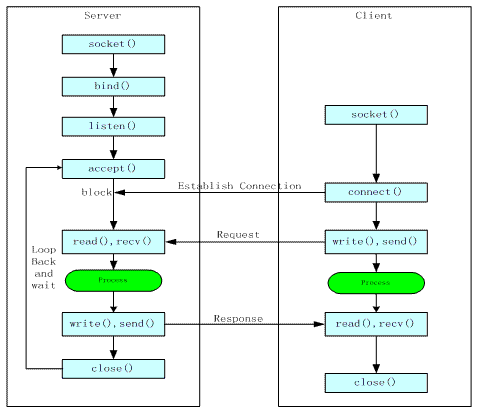
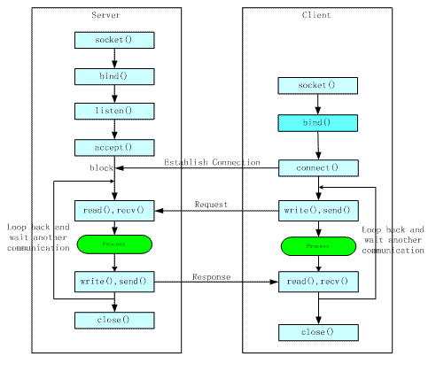

摘自：`https://blog.csdn.net/freeking101/article/details/78922846`

# 长连接和短连接


长短连接只是一个概念问题，长短连接的socket都是使用普通的socket函数，没有什么特殊的。
长连接是客户和服务器建立连接后不断开，持续用这个连接通信，持续过程中一般需要连接侦测，客户探测服务，或者服务心跳告知客户，应用层的保活机制。
短连接是通信一次后就关闭连接。长短连接是一种通信约定，需要双方一起遵守。比如在长连接时，两端都不close，客户端/服务端协议保活；短连接时两端都要主动或被动close，以完成四路释放。

如果恶意客户端就是不close怎么办？
例如服务器主动关闭，进入FIN_WAIT_1状态，这时客户端有三种情况：

① 如果客户端机器崩溃导致没有ACK响应，重传一定次数后直接回收连接。
② 如果客户端进程崩溃，客户端回送RST分节，服务器端收到RST分节后直接回收连接③ 如果客户端正常，则客户端回送ACK，服务器进入FIN_WAIT_2状态，等待客户端close，如果服务器执行了close全关闭，而客户端一直不发送FIN，则服务器等待10分75秒将进入CLOSED状态，连接被完全释放，此后客户端再close将收到RST响应。

最好的解决方案是服务器端设置SO_LINGER，当服务器执行close时就直接回收连接，发送RST分节给客户端。
什么情况下发送RST分节（复位报文段）
收到RST的连接将被系统回收，再次读写套接字端口则触发信号SIGPIPE，默认操作是终止进程。
① 客户端请求一个未监听的服务器端口，则服务器返回RST分节
② 主动异常终止一个连接。（不用4路握手释放），设置SO_LINGER选项
③ 检测半打开连接，当连接一端的主机崩溃并重启后，如果另一端发送数据，以RST响应。
④ 当监听套接字关闭时，对监听已完成队列中的连接的对端都发送RST


# 什么是半连接和半关闭

半连接是指已经建立好的连接的一端已经关闭或异常终止，而另一端却不知道（依然显示连接ESTABLISHED）的状况；半关闭是指已建立连接的一端执行半关闭，终止某个方向的数据传送，这时连接处于半关闭状态（主动关闭端FIN_WAIT_2，另一端CLOSE_WAIT）。


# 长连接和短连接概念：  

## 短连接

短连接：顾名思义，与长连接的区别就是，客户端收到服务端的响应后，立刻发送FIN消息，主动释放连接。也有服务端主动断连的情况，凡是在一次消息交互（发请求-收响应）之后立刻断开连接的情况都称为短连接。注：短连接是建立在TCP协议上的，有完整的握手挥手流程，区别于UDP协议。

短连接过程：连接->传输数据->关闭连接-> ...... -> 连接->传输数据->关闭连接 -> ...... ->连接->传输数据->关闭连接 。
也可以这样说：短连接是指SOCKET连接后发送后接收完数据后马上断开连接。
HTTP是无状态的，浏览器和服务器每进行一次HTTP操作，就建立一次连接，但任务结束就中断连接。 

HTTP协议是基于请求/响应模式的，因此只要服务端给了响应，本次HTTP连接就结束了。或者更准确的说，是本次HTTP请求就结束了，根本没有长连接这一说。那么自然也就没有短连接这一说了。之所以说HTTP分为长连接和短连接，其实本质上是说的TCP连接。TCP连接是一个双向的通道，它是可以保持一段时间不关闭的，因此TCP连接才有真正的长连接和短连接这一说。

TCP短连接的情况:

```
client 向 server 发起连接请求
server 接到请求予以相应和确认，双方建立连接
client 向 server 发送消息
server 回应 client
一次读写完成，此时双方任何一个都可以发起 close 操作，一般都是 client 先发起 close
```



## 长连接


长连接：系统通讯连接建立后就一直保持。长连接也叫持久连接，在TCP层握手成功后，不立即断开连接，并在此连接的基础上进行多次消息（包括心跳）交互，直至连接的任意一方（客户端OR服务端）主动断开连接，此过程称为一次完整的长连接。长连接意味着连接会被复用。既然长连接是指的TCP连接，也就是说复用的是TCP连接。当多个HTTP请求可以复用同一个TCP连接，这就节省了很多TCP连接建立和断开的消耗。HTTP 1.1相对于1.0最重要的新特性就是引入了长连接。

长连接过程：连接(只建立一次连接) -> 传输数据 -> 保持连接 -> ...... -> 传输数据 -> 保持连接 -> 关闭连接(只有一次关闭)。
长连接指建立SOCKET连接后不管是否使用都保持连接，但安全性较差。其实长连接是相对于通常的短连接而说的，也就是长时间保持客户端与服务端的连接状态。这就要求长连接在没有数据通信时，定时发送数据包，以维持连接状态，这就是心跳机制。短连接在没有数据传输时直接关闭就行了。

场景：比如你请求了CSDN的一个网页，这个网页里肯定还包含了CSS、JS等等一系列资源，如果你是短连接（也就是每次都要重新建立TCP连接）的话，那你每打开一个网页，基本要建立几个甚至几十个TCP连接，这就浪费了很多资源。但如果是长连接的话，那么这么多次HTTP请求（这些请求包括请求网页内容，CSS文件，JS文件，图片等等），其实使用的都是一个TCP连接，很显然是可以节省很多资源。最后关于长连接还要多提一句，那就是，长连接并不是永久连接的。如果一段时间内（具体的时间长短，是可以在header当中进行设置的，也就是所谓的超时时间），这个连接没有HTTP请求发出的话，那么这个长连接就会被断掉。这一点其实很容易理解，否则的话，TCP连接将会越来越多，直到把服务器的TCP连接数量撑爆到上限为止。现在想想，对于服务器来说，服务器里的这些个长连接其实很有数据库连接池的味道，都是为了节省连接并重复利用。


TCP长连接的操作流程:

```
client 向 server 发起连接
一次读写完成，连接不关闭
后续读写操作...
```



长连接：client方与server方先建立连接，连接建立后不断开，然后再进行报文发送和接收。这种方式下由于通讯连接一直存在。此种方式常用于P2P通信。
短连接：Client方与server每进行一次报文收发交易时才进行通讯连接，交易完毕后立即断开连接。此方式常用于一点对多点通讯。C/S通信。


如何快速区分当前连接使用的是长连接还是短连接

凡是在一次完整的消息交互（发请求-收响应）之后，立刻断开连接（有一方发送FIN消息）的情况都称为短连接；
长连接的一个明显特征是会有心跳消息（也有没有心跳的情况），且一般心跳间隔都在30S或者1MIN左右，用wireshark抓包可以看到有规律的心跳消息交互（可能会存在毫秒级别的误差）。

## 长连接与短连接的使用时机

长连接多用于操作频繁，点对点的通讯，而且连接数不能太多的情况。每个TCP连接的建立都需要三次握手，每个TCP连接的断开要四次握手。如果每次操作都要建立连接然后再操作的话处理速度会降低，所以每次操作下次操作时直接发送数据就可以了，不用再建立TCP连接。例如：数据库的连接用长连接，如果用短连接频繁的通信会造成socket错误，频繁的socket创建也是对资源的浪费。

短连接：web网站的http服务一般都用短连接。因为长连接对于服务器来说要耗费一定的资源。像web网站这么频繁的成千上万甚至上亿客户端的连接用短连接更省一些资源。试想如果都用长连接，而且同时用成千上万的用户，每个用户都占有一个连接的话，可想而知服务器的压力有多大。所以并发量大，但是每个用户又不需频繁操作的情况下需要短连接。

总之：长连接和短连接的选择要视需求而定。

## 长连接的心跳机制

通讯实体间使用长连接时，一般还需要定义心跳消息，定期发送来检测系统间链路是否异常，每隔一定时间发送一次心跳，如果一定次数没有收到心跳消息，这认为此连接出现问题，需要断开连接重新建立。具体心跳消息的格式，以及发送间隔，以及多少次没有收到心跳就认为链路异常，以及数据部是否算作心跳消息（有的系统如果接收到数据包则会清除心跳计时器也就相当于系统中的数据包也算作心跳消息）；这个需要两端进行协商。比如GSM常用的短消息中心和其他网络实体互连的SMPP协议，要求建立的就是长连接.

心跳包之所以叫心跳包是因为：它像心跳一样每隔固定时间发一次，以此来告诉服务器，这个客户端还活着。事实上这是为了保持长连接，至于这个包的内容，是没有什么特别规定的，不过一般都是很小的包，或者只包含包头的一个空包。

在TCP的机制里面，本身是存在有心跳包的机制的，也就是TCP的选项：SO_KEEPALIVE。系统默认是设置的2小时的心跳频率。但是它检查不到机器断电、网线拔出、防火墙这些断线。而且逻辑层处理断线可能也不是那么好处理。一般，如果只是用于保活还是可以的。

心跳包一般来说都是在逻辑层发送空的echo包来实现的。下一个定时器，在一定时间间隔下发送一个空包给客户端，然后客户端反馈一个同样的空包回来，服务器如果在一定时间内收不到客户端发送过来的反馈包，那就只有认定说掉线了。

其实，要判定掉线，只需要send或者recv一下，如果结果为零，则为掉线。但是，在长连接下，有可能很长一段时间都没有数据往来。理论上说，这个连接是一直保持连接的，但是实际情况中，如果中间节点出现什么故障是难以知道的。更要命的是，有的节点（防火墙）会自动把一定时间之内没有数据交互的连接给断掉。在这个时候，就需要我们的心跳包了，用于维持长连接，保活。

在获知了断线之后，服务器逻辑可能需要做一些事情，比如断线后的数据清理呀，重新连接呀……当然，这个自然是要由逻辑层根据需求去做了。


TCP的socket本身就是长连接，为什么还需要心跳包?

内网机器如果不主动向外发起连接，外网机没法直接连接内网的，这也是内网机安全的原因之一，又因为路由器会把这个关系记录下来，但是过一段时间这个纪录可能会丢失，所以每一个客户端每个一定时间就会向服务器发送消息，以确保服务器可以随时找到你，这个东西被称为心跳包。
理论上说，这个连接事一直保持连接的，但实际情况中，如果中间出现什么情况是难以想象的。更要命的是，有的节点（防火墙）会自动把一定时间之内没有数据交互的连接给断掉。这个时候我们就需要心跳包了，用于维持长连接，保活。
总之：心跳包主要也就是用于长连接的保活和断线处理。一般的应用下，判定时间在30-40秒比较不错。如果实在要求高，那就在6-9秒。在TCP socket心跳机制中，心跳包可以由服务器发送给客户端，也可以由客户端发送给服务器，不过比较起来，前者开销可能更大。


一个由客户端给服务器发送心跳包，基本思路是：

服务器为每个客户端保存了IP和计数器count，即map<fd, pair<ip, count>>。服务端主线程采用 select 实现多路IO复用监听新连接以及接受数据包（心跳包），子线程用于检测心跳：
如果主线程接收到的是心跳包，将该客户端对应的计数器 count 清零；
在子线程中，每隔3秒遍历一次所有客户端的计数器 count： 
若 count 小于 5，将 count 计数器加 1；
若 count 等于 5，说明已经15秒未收到该用户心跳包，判定该用户已经掉线；
客户端则只是开辟子线程，定时给服务器发送心跳包（本示例中定时时间为3秒）。

# 长轮询和短轮询

HTTP协议中的短轮询、长轮询、长连接和短连接：http://web.jobbole.com/85541/


**保护消息边界和流**

保护消息边界，就是指传输协议把数据当作一条独立的消息在网上传输，接收端只能接收独立的消息。也就是说存在保护消息边界，接收端一次只能接收发送端发出的一个数据包。而面向流则是指无保护消息保护边界的，如果发送端连续发送数据，接收端有可能在一次接收动作中，会接收两个或者更多的数据包。
例如，我们连续发送三个数据包，大小分别是2k，4k ，8k,这三个数据包，都已经到达了接收端的网络堆栈中，如果使用UDP协议，不管我们使用多大的接收缓冲区去接收数据，我们必须有三次接收动作，才能够把所有的数据包接收完.而使用TCP协议，我们只要把接收的缓冲区大小设置在14k以上，我们就能够一次把所有的数据包接收下来，只需要有一次接收动作。

注意：这就是因为UDP协议的保护消息边界使得每一个消息都是独立的。而流传输却把数据当作一串数据流，他不认为数据是一个一个的消息。所以有很多人在使用tcp协议通讯的时候，并不清楚tcp是基于流的传输，当连续发送数据的时候，他们时常会认识tcp会丢包。其实不然，因为当他们使用的缓冲区足够大时，他们有可能会一次接收到两个甚至更多的数据包，而很多人往往会忽视这一点，只解析检查了第一个数据包，而已经接收的其他数据包却被忽略了。所以大家如果要作这类的网络编程的时候,必须要注意这一点。


剩余部分以后再研究。。。

