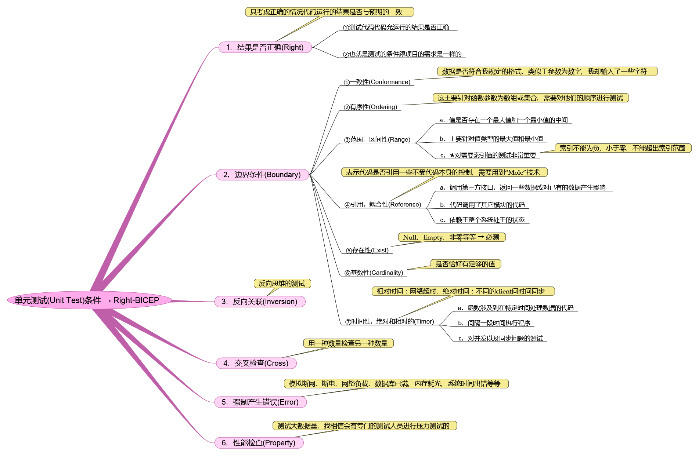

摘自：`https://www.cnblogs.com/yangcaogui/archive/2012/02/08/2336123.html`

前言

　　笼*统的来说测试条件无非就是两个方面：① 正向测试 ，② 反向测试！*

　　如果单从这两个方面来思考，肯定出现丢三落四的情况，也就是说不全面，所以应该在上面两种情况的基础上再进行具体划分，那么只要我们能够遵循这些条件基本上就能做到全面(如果能做到，大约80%的问题应该都解决了)，于是就出现了下面要说的六个方面内容！

　　前辈们把这些测试条件总结为：**Right – BICEP**

　***1.Right - 做正确的事，可以说是“正向测试”***

　　　　这种测试前期任务是要准备足够的正确数据（前提是要保证数据的正确性，这个很重要），运行代码后返回的值或产生的影响是要跟自己的预期是一致的！

　　　　注意：如果准备的数据太大或容易丢失，建议把它放在数据文件中，然后让单元测试读取这个文件，这种方法会在下一篇会说到！

 

　***2.B - 边界条件(Boundary)***

　　　　边界条件是测试里面的重中之重，必须要有足够的认识和重视！

　　　　而它又被分为七个方面的子条件，下面就让我们来一一熟悉它！

　　　　①一致性(Conformance)

　　　　　　数据是否符合我规定的格式（也可以说是非法字符吧）！

　　　　　　案例：比如我传入的参数文件名需要的格式是：文件名 + 日期(yy-mm-dd) + 扩展名，那么我就要写一个测试传入的文件名为 ：`“sa#$#$#$#”`这样的格式！

　　　　②有序性(Ordering)

　　　　　　这方面主要是对涉及到数组和集合的数据，而且对数据的顺序有严格要求的函数，需要对它们里面数据的顺序进行测试！

　　　　　　比如：点菜系统菜谱中每道菜的顺序，或者去银行办理业务的排队系统等等！

　　　　③范围，区间性(Range)

　　　　　　值是否存在于一个最大值和一个最小值之间，主要是对值类型的数据做的测试！

　　　　　　这里面还有一个重要的测试点是 → 对数组，集合，以及Table，DataSet中的索引值进行测试，比如索引值不能为负，不能超出索引的范围等等情况！

　　　　　　比如：一个通过ID来搜索信息的函数，应该对这个ID进行最大值和最小值的测试！

　　　　④引用，耦合性(Reference)

　　　　　　这方面主要是：代码是否引用了一些不受本身代码控制的外部因素(比如：调用第三方接口，调用其它模块的接口等等)！

　　　　　　对于这些情况我们是没有办法控制的，所以在测试的时候只能模拟，而在模拟时我们会用到“Mole”技术，让它来帮助我们创建一个模拟环境(下一篇会介绍)！

　　　　　　比如：有的项目会调用银行接口，这种情况下只能先创造一个虚拟银行接口，然后再进行测试！

　　　　⑤存在性(Exist)

　　　　　　固定的测试，如Null，Empty，非零等等，这些都是必须考虑的！

　　　　⑥基数性(Cardinality)

　　　　　　对于这个测试说起来还是蛮难理解，这个测试只有在特定的场合下才会去考虑它！

　　　　　　它遵循一个原则：“0-1-N”！ 　　　　　　

　　　　⑦时间性(Timer)

　　　　　　对时间比较有依赖的软件或系统应该在这个方面着重测试！

　　　　　　主要考虑：事情是否按时间的顺序执行，是否在正确的时间执行，是否出现执行事情延误了！

​                  相对时间：网站超时，数据更新超时等等！

​                  绝对时间：不同的client间的时间是否同步！

​                  并发问题在时间性测试中比较重要！　　　

　　

　**3.I - 反向关联(Inversion)**　　　　　　

　　　　在准备数据或者验证数据时的一种反向思维，涉及到个人的思维方式问题了！

　　　　比如：有个函数对数据库进行了操作，但是它没任何返回值也没有任何提示，如果你是对正确的数据进行了测试，那么你要怎么知道测试结果跟你的预期一致呢，这里你就应该去查找数据库，看数据库里面的数据是否有真的改动，这就是一种反向的思维方式！

 

　**4.C - 交叉检查(Cross)**

　　　　用一种数量检查另一种数量(需要考虑的情况不是很多)！

 

　**5.E - 强制产生错误(Error)**

　　　　通过代码强制产生软件在运行过程中出现的特殊情况!

　　　　可以参考下面几种测试方面：内存耗光，磁盘用满，断电，正在执行更新数据时出现断网现象，网络负载严重导致瘫痪，系统时间出现导致和国际时间不一致等等一些情况！

 

　**6.P - 性能特性(Property)**

　　　　性能测试工具的使用，没具体研究过性能测试工具，知道的朋友可以说下你们的经验！

​              进行压力测试，一点一点的加大数据量，10000条，100000条，1000000条这样进行压力测试！

 

　　总结：本人对反向关联和交叉检查这两个测试条件不是很理解，知道的朋友可以留言给我，我会把它补充到文章中去！

　　下一篇：走进单元测试三：创建自己的单元测试

　　

