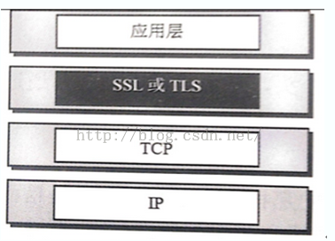

### `TCP`建立连接和断开连接的过程

参考：`https://andrewpqc.github.nio/2018/07/17/tcp-connection-manage/`

`TCP`是一个面向连接的服务,面向连接的服务是电话系统服务模式的抽象,每一次完整的数据传输都必须经过建立连接,数据传输和终止连接三个过程,TCP建立连接的过程称为三次握手,下面说一下三次握手的具体过程:

**TCP三次握手过程**

* 1、主机`A`通过向主机`B`发送一个含有同步序列号的标志位的数据段给主机`B` ,向主机`B`请求建立连接,通过这个数据段,主机`A`告诉主机`B`两件事:**我想要和你通信;你可以用哪个序列号作为起始数据段来回应我**。
* 2、主机`B `收到主机`A`的请求后,用一个带有确认应答(`ACK`)和同步序列号(`SYN`)标志位的数据段响应主机`A`,也告诉主机`A`两件事:**我已经收到你的请求了,你可以传输数据了;你要用哪个序列号作为起始数据段来回应我**。
* 3、主机`A`收到这个数据段后,再发送一个确认应答,确认已收到主机`B `的数据段:**我已收到回复,我现在要开始传输实际数据了**。这样TCP三次握手就完成了,主机`A`和主机`B `就可以传输数据了。三次握手的特点：没有应用层的数据,`SYN`这个标志位只有在`TCP`建产连接时才会被置`1`,握手完成后`SYN`标志位被置`0`。

`TCP`建立连接要进行三次握手,而断开连接要进行四次,这是由于`TCP`的**半关闭造成**的,因为`TCP`连接是**全双工**的(即数据可在两个方向上同时传递),所以进行关闭时每个方向上都要单独进行关闭,这个**单方向的关闭就叫半关闭**.关闭的方法是一方完成它的数据传输后,就发送一个`FIN`来向另一方通告将要终止这个方向的连接.当一端收到一个`FIN`,它必须通知应用层`TCP`连接已终止了这个方向的数据传送,发送`FIN`通常是应用层进行关闭的结果。

**四次断开过程**

* 1、当主机`A`完成数据传输后,将控制位`FIN`置`1`,提出停止`TCP`连接的请求
* 2、主机`B`收到`FIN`后对其作出响应,确认这一方向上的`TCP`连接将关闭,将`ACK`置`1`
* 3、由`B` 端再提出反方向的关闭请求,将`FIN`置`1`
* 4、主机`A`对主机`B`的请求进行确认,将`ACK`置`1`,双方向的关闭结束。

### TCP 的可靠性是指什么

tcp的可靠性与安全性是两个不同的概念

TCP的可靠性应该是相对于UDP不可靠传输来说的，因为UDP提供的是不可靠的数据报服务，不保证数据报能到达接收端，可能会有丢失；

另外处于传输层之下的IP层也是不可靠的，仅提供尽力而为的端到端数据传输服务（best-effort delivery service），不作任何保证。所以TCP的可靠性是指基于不可靠的IP层在传输层提供可靠的数据传输服务，主要是指传输数据不会损坏或丢失，而且所有数据都是按照发送顺序进行传送。

实现TCP的可靠传输有以下机制：

1，校验和（校验数据是否损坏）；

2，定时器（分组丢失则重传）；

3，序号（用于检测丢失的分组和冗余的分组）；

4，确认（接收方告知发送方正确接收分组以及期望的下一个分组）；

5，否定确认（接收方通知发送方未被正确接收的分组）；

6，窗口和流水线（用于增加信道的吞吐量）。

至于数据是否在中途被修改或者被窃听，这应该是属于安全性问题。提高安全性最根本的办法就是加密数据，比如远程登录用ssh而非telnet。可靠性并不能避免你的明文数据被嗅探或被篡改。网络上的各种第三方设备随时可能截获数据包查看内容，或者伪造数据包——checksum这种校验非常弱，规则都是透明的，同时篡改数据内容和校验数即可轻而易举地狸猫换太子。也就是我们所谓的**不安全**。

应对的办法就是**加密**。没有密钥的第三方即使拿到数据包也无法还原成有意义的内容，更无法修改替换。还有一个很重要的是**身份认证**，防止双方从最开始就被中间人两头骗。SSL/TLS是一个比较成熟通用的解决方案。

加密算法还有很多，参考：`https://blog.csdn.net/maxiao124/article/details/75103637`

一般来说，信息量较少的数据使用RSA（非对称加密），信息量较大的数据使用AES（对称加密）

### 网路安全协议

摘自：`https://blog.csdn.net/stilling2006/article/details/4150265`

网络安全协议一般有`PKI SSH SSL SET`。这里针对SSL进行说明

一个应用程序的安全需求在很大程度上依赖于将如何使用该应用程序和该应用程序将要保护什么。不过，用现有技术实现强大的、 一般用途的安全通常是可能的。认证就是一个很好的示例。

当顾客想从 Web 站点购买某个产品时，顾客和 Web 站点都要进行认证。顾客通常是以提供名字和密码的方式来认证他自己。 另一方面，Web 站点通过交换一块签名数据和一个有效的 X.509 证书（作为 SSL 握手的一部分）来认证它自己。 顾客的浏览器验证该证书并用所附的公用密钥验证签名数据。一旦双方都认证了，则交易就可以开始了。

SSL 能用相同的机制处理服务器认证（就如在上面的示例中）和客户机认证。 Web 站点典型地对客户机认证不依赖 SSL — 要求用户提供密码是较容易的。而 SSL 客户机和服务器认证对于透明认证是完美的， 对等机 — 如 p2p 应用程序中的对等机之间一定会发生透明认证。

安全套接字层（Secure Sockets Layer（SSL）） ，SSL 是一种安全协议，它为网络（例如因特网）的通信提供私密性。SSL 使应用程序在通信时不用担心被窃听和篡改。 SSL 实际上是共同工作的两个协议：“SSL 记录协议”（SSL Record Protocol）和“SSL 握手协议” （SSL Handshake Protocol）。“SSL 记录协议”是两个协议中较低级别的协议，它为较高级别的协议， 例如 SSL 握手协议对数据的变长的记录进行加密和解密。SSL 握手协议处理应用程序凭证的交换和验证。

当一个应用程序（客户机）想和另 一个应用程序（服务器）通信时，客户机打开一个与服务器相连接的套接字连接。然后， 客户机和服务器对安全连接进行协商。作为协商的一部分，服务器向客户机作自我认证。客户机可以选择向服务器作或不作自我认证。 一旦完成了认证并且建立了安全连接，则两个应用程序就可以安全地进行通信。按照惯例，我将把发起该通信的对等机看作客户机， 另一个对等机则看作服务器，不管连接之后它们充当什么角色。

名为 A 和 B 的两台对等机想安全地进行通信。在我们简单的 p2p 应用程序的环境中，对等机 A 想查询对等机 B 上的一个资源。 每个对等机都有包含其专用密钥的一个数据库（名为 keystore）和包含其公用密钥的证书。密码保护数据库的内容。 该数据库还包含一个或多个来自被信任的对等机的自签名证书。 对等机 A 发起这项事务，每台对等机相互认证，两台对等机协商采用的密码及其长度并建立一个安全通道。完成这些操作之后， 每个对等机都知道它正在跟谁交谈并且知道通道是安全的。 SSL (Secure socket Layer)安全套接层协议主要是使用公开密钥体制和X.509数字证书技术保护信息传输的机密性和完整性， 它不能保证信息的不可抵赖性，主要适用于点对点之间的信息传输，常用Web Server方式。

安全套接层协议（SSL，Security Socket Layer）是网景（Netscape）公司提出的基于WEB应用的安全协议，它包括：服务器认证、 客户认证（可选）、SSL链路上的数据

完整性和SSL链路上的数据保密性。对于电子商务应用来说，使用SSL可保证信息的真实性、 完整性和保密性。但由于SSL不对应用层的消息进行数字签名，因此不能提供交易的不可否认性，这是SSL在电子商务中使用的最大不足。 有鉴于此，网景公司在从Communicator 4.04版开始的所有浏览器中引入了一种被称作“表单签名（Form Signing）”的功能， 在电子商务中，可利用这一功能来对包含购买者的订购信息和付款指令的表单进行数字签名，从而保证交易信息的不可否认性。综上所述， 在电子商务中采用单一的SSL协议来保证交易的安全是不够的，但采用"SSL+表单签名"模式能够为电子商务提供较好的安全性保证。 

### `HTTP`协议的交互流程以及`HTTP`和`HTTPS`的差异

**`HTTPS`协议**
`HTTPS`协议就是基于`SSL`的`HTTP`协议
`HTTPS`使用与`HTTP`不同的端口（`HTTP:80 ， HTTPS:443`）
提供了身份验证与加密通信方法，被广泛用于互联网上安全敏感的通信。

**交互过程：客户端在使用`HTTPS`方式与`Web`服务器通信时有以下几个步骤 **

* 客户端请求`SSL`连接，并将自己支持的加密规则发给网站。
* 服务器端将自己的身份信息以证书形式发回给客户端。证书里面包含了网站地址，加密公钥，以及证书的颁发机构。
* 获得证书后，客户要做以下工作： 
    * 验证证书合法性 
    * 如果证书受信任，客户端会生成一串随机数的密码，并用证书提供的公钥进行加密。
    * 将加密好的随机数发给服务器。
* 获得到客户端发的加密了的随机数之后，服务器用自己的私钥进行解密，得到这个随机数，把这个随机数作为对称加密的密钥
* 之后服务器与客户之间就可以用随机数对各自的信息进行加密，解密。

注意的是：证书是一个公钥，这个公钥是进行加密用的。而私钥是进行解密用的。公钥任何都知道，私钥只有自己知道。这是非对称加密。而对称加密就是钥匙只有一把，我们都知道。之所以用到对称加密，是因为对称加密的速度更快。而非对称加密的可靠性更高。

**`HTTP`与`HTTPS`的区别**

* 1.`HTTPS`协议需要申请证书。 
* 2.`HTTP`是明文传输；`HTTPS`使用的是具有安全性的`SSL`加密传输协议 
* 3.`HTTP`端口是`80`；`HTTPS`端口号是`443 `
* 4.`HTTP`连接简单无状态；`HTTPS`由`SSL+HTTP`协议构件的可进行加密传输、身份验证的网络协议。

详细参考：`https://juejin.im/entry/58d7635e5c497d0057fae036`

### https优缺点

#### 优点

**1、SEO方面**

谷歌曾在2014年8月份调整搜索引擎算法，并称“比起同等HTTP网站，采用HTTPS加密的网站在搜索结果中的排名将会更高”。

**2、安全性**

尽管HTTPS并非绝对安全，掌握根证书的机构、掌握加密算法的组织同样可以进行中间人形式的攻击，但HTTPS仍是现行架构下最安全的解决方案，主要有以下几个好处：

（1）、使用HTTPS协议可认证用户和服务器，确保数据发送到正确的客户机和服务器；

（2）、HTTPS协议是由SSL+HTTP协议构建的可进行加密传输、身份认证的网络协议，要比http协议安全，可防止数据在传输过程中不被窃取、改变，确保数据的完整性。

（3）、HTTPS是现行架构下最安全的解决方案，虽然不是绝对安全，但它大幅增加了中间人攻击的成本。

#### 缺点

虽然说HTTPS有很大的优势，但其相对来说，还是有些不足之处的，具体来说，有以下2点：

**1、SEO方面**

据ACM CoNEXT数据显示，使用HTTPS协议会使页面的加载时间延长近50%，增加10%到20%的耗电，此外，HTTPS协议还会影响缓存，增加数据开销和功耗，甚至已有安全措施也会受到影响也会因此而受到影响。

而且HTTPS协议的加密范围也比较有限，在黑客攻击、拒绝服务攻击、服务器劫持等方面几乎起不到什么作用。

最关键的，SSL证书的信用链体系并不安全，特别是在某些国家可以控制CA根证书的情况下，中间人攻击一样可行。

**2、经济方面**

（1）、SSL证书需要钱，功能越强大的证书费用越高，个人网站、小网站没有必要一般不会用。

（2）、SSL证书通常需要绑定IP，不能在同一IP上绑定多个域名，IPv4资源不可能支撑这个消耗（SSL有扩展可以部分解决这个问题，但是比较麻烦，而且要求浏览器、操作系统支持，Windows XP就不支持这个扩展，考虑到XP的装机量，这个特性几乎没用）。

（3）、HTTPS连接缓存不如HTTP高效，大流量网站如非必要也不会采用，流量成本太高。

（4）、HTTPS连接服务器端资源占用高很多，支持访客稍多的网站需要投入更大的成本，如果全部采用HTTPS，基于大部分计算资源闲置的假设的VPS的平均成本会上去。

（5）、HTTPS协议握手阶段比较费时，对网站的相应速度有负面影响，如非必要，没有理由牺牲用户体验。

### HTTP`相关请求响应格式

参考：`http://blog.jobbole.com/106632/`

`HTTP`请求格式主要有四部分组成，分别是：请求行、请求头、空行、消息体，每部分内容占一行

* 请求行：请求行是请求消息的第一行，由三部分组成：分别是请求方法（`GET/POST/DELETE/PUT/HEAD`）、请求资源的`URI`路径、`HTTP`的版本号
* 请求头：请求头中的信息有和缓存相关的头（`Cache-Control，If-Modified-Since`）、客户端身份信息（`User-Agent`）等等
* 消息体：请求体是客户端发给服务端的请求数据，这部分数据并不是每个请求必须的。

`HTTP`响应消息的格式包括：状态行、响应头、空行、消息体。每部分内容占一行

* 状态行：状态行位于相应消息的第一行，有`HTTP`协议版本号，状态码和状态说明三部分构成。
* 响应头：响应头是服务器传递给客户端用于说明服务器的一些信息，以及将来继续访问该资源时的策略
* 响应体：响应体是服务端返回给客户端的`HTML`文本内容，或者其他格式的数据，比如：视频流、图片或者音频数据。

### `SSL`的交互流程

参考：`https://kefeng.wang/2018/03/12/https-protocol/`

`SSL`协议（安全套接字协议）是`Web`浏览器与`Web`服务器之间安全交换信息的协议

`SSL`协议的三个特性

* 保密：在握手协议中定义了会话的密钥后，所有的消息都被加密
* 鉴别：可选的客户端验证，和强制的服务器端验证
* 完整性：传送的消息包括消息完整性检查

`SSL`的位置 

### Socket交互的基本流程

参考：`https://uule.iteye.com/blog/2429228`

**服务器端：**

* 第一步：用指定的端口号和服务器的`ip`建立一个`EndPoint`对象；
* 第二步：建立一个`Socket`对象；
* 第三步：用`socket`对象的`Bind()`方法绑定`EndPoint`；
* 第四步：用`socket`对象的`Listen()`方法开始监听；
* 第五步：接受到客户端的连接，用`socket`对象的`Accept()`方法创建新的`socket`对象用于和请求的客户端进行通信;
* 第六步：通信结束后一定记得关闭`socket`;

**客户端：**

* 第一步：用指定的端口号和服务器的`ip`建立一个`EndPoint`对象
* 第二步：建立一个`Socket`对象；
* 第三步：用`socket`对象的`Connect()`方法以上面建立的`EndPoint`对象做为参数，向服务器发出连接请求；
* 第四步：如果连接成功，就用`socket`对象的`Send()`方法向服务器发送信息；
* 第五步：用`socket`对象的`Receive()`方法接受服务器发来的信息 ;
* 第六步：通信结束后一定记得关闭`socket`；

### 解决丢包、网络抖动、延时

丢包一般使用重传方式解决。网络抖动和延时一般使用动态路由和就近接入。就近接入是指规划最近的服务器为其提供服务，让其更快的接入骨干网络。动态路由就是在没到达一个节点的时候动态的为其规划最优的传输路径。

