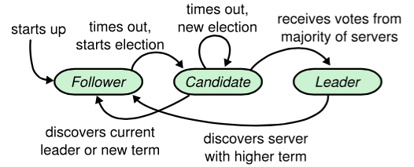
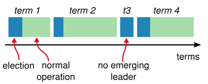

摘自：`http://weizijun.cn/2015/04/30/Raft%E5%8D%8F%E8%AE%AE%E5%AE%9E%E6%88%98%E4%B9%8BRedis%20Sentinel%E7%9A%84%E9%80%89%E4%B8%BELeader%E6%BA%90%E7%A0%81%E8%A7%A3%E6%9E%90/`


# Raft协议实战之Redis Sentinel的选举Leader源码解析


Raft协议是用来解决分布式系统一致性问题的协议，在很长一段时间，Paxos被认为是解决分布式系统一致性的代名词。但是Paxos难于理解，更难以实现，诸如Google大牛们开发的分布式锁系统Chubby都遭遇了很多坑。Raft协议设计的初衷就是容易实现，保证对于普遍的人群都可以十分舒适容易的去理解。另外，它必须能够让人形成直观的认识，这样系统的构建者才能够在现实中进行必然的扩展。

本文从Redis Sentinel集群选择Leader的具体流程和源码分析，描述Raft协议中的选举Leader算法。关于Redis Sentinel的介绍可以参看本人的另一篇文章[《redis sentinel设计与实现》](http://weizijun.cn/2015/04/30/redis sentinel 设计与实现/)。

当Sentinel集群有Sentinel发现master客观下线了，就会开始故障转移流程，故障转移流程的第一步就是在Sentinel集群选择一个Leader，让Leader完成故障转移流程。

### Raft协议选举流程

描述Raft选举流程之前需要了解一些概念。

#### 节点的状态

Raft协议描述的节点共有三种状态：Leader, Follower, Candidate。在系统运行正常的时候只有Leader和Follower两种状态的节点。一个Leader节点，其他的节点都是Follower。Candidate是系统运行不稳定时期的中间状态，当一个Follower对Leader的的心跳出现异常，就会转变成Candidate，Candidate会去竞选新的Leader，它会向其他节点发送竞选投票，如果大多数节点都投票给它，它就会替代原来的Leader，变成新的Leader，原来的Leader会降级成Follower。



#### term

在分布式系统中，各个节点的时间同步是一个很大的难题，但是为了识别过期时间，时间信息又必不可少。Raft协议为了解决这个问题，引入了term（任期）的概念。Raft协议将时间切分为一个个的Term，可以认为是一种“逻辑时间”。



#### RPC

Raft协议在选举阶段交互的RPC有两类：RequestVote和AppendEntries。

- RequestVote是用来向其他节点发送竞选投票。
- AppendEntries是当该节点得到更多的选票后，成为Leader，向其他节点确认消息。

#### 选举流程

Raft采用心跳机制触发Leader选举。系统启动后，全部节点初始化为Follower，term为0.节点如果收到了RequestVote或者AppendEntries，就会保持自己的Follower身份。如果一段时间内没收到AppendEntries消息直到选举超时，说明在该节点的超时时间内还没发现Leader，Follower就会转换成Candidate，自己开始竞选Leader。一旦转化为Candidate，该节点立即开始下面几件事情：

- 1、增加自己的term。
- 2、启动一个新的定时器。
- 3、给自己投一票。
- 4、向所有其他节点发送RequestVote，并等待其他节点的回复。

如果在这过程中收到了其他节点发送的AppendEntries，就说明已经有Leader产生，自己就转换成Follower，选举结束。

如果在计时器超时前，节点收到多数节点的同意投票，就转换成Leader。同时向所有其他节点发送AppendEntries，告知自己成为了Leader。

每个节点在一个term内只能投一票，采取先到先得的策略，Candidate前面说到已经投给了自己，Follower会投给第一个收到RequestVote的节点。每个Follower有一个计时器，在计时器超时时仍然没有接受到来自Leader的心跳RPC, 则自己转换为Candidate, 开始请求投票，就是上面的的竞选Leader步骤。

如果多个Candidate发起投票，每个Candidate都没拿到多数的投票（Split Vote），那么就会等到计时器超时后重新成为Candidate，重复前面竞选Leader步骤。

Raft协议的定时器采取随机超时时间，这是选举Leader的关键。每个节点定时器的超时时间随机设置，随机选取配置时间的1倍到2倍之间。由于随机配置，所以各个Follower同时转成Candidate的时间一般不一样，在同一个term内，先转为Candidate的节点会先发起投票，从而获得多数票。多个节点同时转换为Candidate的可能性很小。即使几个Candidate同时发起投票，在该term内有几个节点获得一样高的票数，只是这个term无法选出Leader。由于各个节点定时器的超时时间随机生成，那么最先进入下一个term的节点，将更有机会成为Leader。连续多次发生在一个term内节点获得一样高票数在理论上几率很小，实际上可以认为完全不可能发生。一般1-2个term类，Leader就会被选出来。

### Sentinel的选举流程

Sentinel集群正常运行的时候每个节点epoch相同，当需要故障转移的时候会在集群中选出Leader执行故障转移操作。Sentinel采用了Raft协议实现了Sentinel间选举Leader的算法，不过也不完全跟论文描述的步骤一致。Sentinel集群运行过程中故障转移完成，所有Sentinel又会恢复平等。Leader仅仅是故障转移操作出现的角色。

#### 选举流程

- 1、某个Sentinel认定master客观下线的节点后，该Sentinel会先看看自己有没有投过票，如果自己已经投过票给其他Sentinel了，在2倍故障转移的超时时间自己就不会成为Leader。相当于它是一个Follower。
- 2、如果该Sentinel还没投过票，那么它就成为Candidate。
- 3、和Raft协议描述的一样，成为Candidate，Sentinel需要完成几件事情
    - 1）更新故障转移状态为start
    - 2）当前epoch加1，相当于进入一个新term，在Sentinel中epoch就是Raft协议中的term。
    - 3）更新自己的超时时间为当前时间随机加上一段时间，随机时间为1s内的随机毫秒数。
    - 4）向其他节点发送`is-master-down-by-addr`命令请求投票。命令会带上自己的epoch。
    - 5）给自己投一票，在Sentinel中，投票的方式是把自己master结构体里的leader和leader_epoch改成投给的Sentinel和它的epoch。
- 4、其他Sentinel会收到Candidate的`is-master-down-by-addr`命令。如果Sentinel当前epoch和Candidate传给他的epoch一样，说明他已经把自己master结构体里的leader和leader_epoch改成其他Candidate，相当于把票投给了其他Candidate。投过票给别的Sentinel后，在当前epoch内自己就只能成为Follower。
- 5、Candidate会不断的统计自己的票数，直到他发现认同他成为Leader的票数超过一半而且超过它配置的quorum（quorum可以参考[《redis sentinel设计与实现》](http://weizijun.cn/2015/04/30/redis sentinel 设计与实现/)）。Sentinel比Raft协议增加了quorum，这样一个Sentinel能否当选Leader还取决于它配置的quorum。
- 6、如果在一个选举时间内，Candidate没有获得超过一半且超过它配置的quorum的票数，自己的这次选举就失败了。
- 7、如果在一个epoch内，没有一个Candidate获得更多的票数。那么等待超过2倍故障转移的超时时间后，Candidate增加epoch重新投票。
- 8、如果某个Candidate获得超过一半且超过它配置的quorum的票数，那么它就成为了Leader。
- 9、与Raft协议不同，Leader并不会把自己成为Leader的消息发给其他Sentinel。其他Sentinel等待Leader从slave选出master后，检测到新的master正常工作后，就会去掉客观下线的标识，从而不需要进入故障转移流程。

#### 关于Sentinel超时时间的说明

Sentinel超时机制有几个超时概念。

- failover_start_time 下一选举启动的时间。默认是当前时间加上1s内的随机毫秒数
- failover_state_change_time 故障转移中状态变更的时间。
- failover_timeout 故障转移超时时间。默认是3分钟。
- election_timeout 选举超时时间，是默认选举超时时间和failover_timeout的最小值。默认是10s。

Follower成为Candidate后，会更新failover_start_time为当前时间加上1s内的随机毫秒数。更新failover_state_change_time为当前时间。

Candidate的当前时间减去failover_start_time大于election_timeout，说明Candidate还没获得足够的选票，此次epoch的选举已经超时，那么转变成Follower。需要等到`mstime() - failover_start_time < failover_timeout*2`的时候才开始下一次获得成为Candidate的机会。

如果一个Follower把某个Candidate设为自己认为的Leader，那么它的failover_start_time会设置为当前时间加上1s内的随机毫秒数。这样它就进入了上面说的需要等到`mstime() - failover_start_time < failover_timeout*2`的时候才开始下一次获得成为Candidate的机会。

因为每个Sentinel判断节点客观下线的时间不是同时开始的，一般都有先后，这样先开始的Sentinel就更有机会赢得更多选票，另外failover_state_change_time为1s内的随机毫秒数，这样也把各个节点的超时时间分散开来。本人尝试过很多次，Sentinel间的Leader选举过程基本上一个epoch内就完成了。

### Sentinel 选举流程源码解析

Sentinel的选举流程的代码基本都在sentinel.c文件中，下面结合源码对Sentinel的选举流程进行说明。

#### 定时任务

```
void sentinelHandleRedisInstance(sentinelRedisInstance *ri) {

    ...

    // 判断 master 是否进入SDOWN 状态
    sentinelCheckSubjectivelyDown(ri);

    /* Masters and slaves */
    if (ri->flags & (SRI_MASTER|SRI_SLAVE)) {
        /* Nothing so far. */
    }        

    if (ri->flags & SRI_MASTER) {

        // 判断 master 是否进入 ODOWN 状态
        sentinelCheckObjectivelyDown(ri);

        // 查看是否需要开始故障转移
        if (sentinelStartFailoverIfNeeded(ri))
            // 向其他 Sentinel 发送 SENTINEL is-master-down-by-addr 命令
            // 刷新其他 Sentinel 关于主服务器的状态
            sentinelAskMasterStateToOtherSentinels(ri,SENTINEL_ASK_FORCED);

        // 执行故障转移
        sentinelFailoverStateMachine(ri);

        //此处调用sentinelAskMasterStateToOtherSentinels，只是为了获取其他Sentinel对于master是否存活的判断，
        //用来下一次判断master是否进入ODOWN状态
        sentinelAskMasterStateToOtherSentinels(ri,SENTINEL_NO_FLAGS);
    }
}
```

Sentinel会每隔100ms执行一次sentinelHandleRedisInstance函数。流程会检查master是否进入SDOWN状态，接着会检查master是否进入ODOWN状态，接着会查看是否需要开始故障转移，如果开始故障转移就会向其他节点拉去投票，接下来有个故障转移的状态机，根据不同的`failover_state`，决定完成不同的操作，正常的时候failover_state为SENTINEL_FAILOVER_STATE_NONE。

#### 向其他Sentinel获取投票或者获取对master存活状态的判断结果

```
#define SENTINEL_ASK_FORCED (1<<0)
void sentinelAskMasterStateToOtherSentinels(sentinelRedisInstance *master, int flags) {
    dictIterator *di;
    dictEntry *de;

    // 遍历正在监视相同 master 的所有 sentinel
    // 向它们发送 SENTINEL is-master-down-by-addr 命令
    di = dictGetIterator(master->sentinels);
    while((de = dictNext(di)) != NULL) {
        sentinelRedisInstance *ri = dictGetVal(de);

        // 距离该 sentinel 最后一次回复 SENTINEL master-down-by-addr 命令已经过了多久
        mstime_t elapsed = mstime() - ri->last_master_down_reply_time;
        char port[32];
        int retval;

        /* If the master state from other sentinel is too old, we clear it. */
        // 如果目标 Sentinel 关于主服务器的信息已经太久没更新，那么我们清除它
        if (elapsed > SENTINEL_ASK_PERIOD*5) {
            ri->flags &= ~SRI_MASTER_DOWN;
            sdsfree(ri->leader);
            ri->leader = NULL;
        }

        /* Only ask if master is down to other sentinels if:
         *
         * 只在以下情况满足时，才向其他 sentinel 询问主服务器是否已下线
         *
         * 1) We believe it is down, or there is a failover in progress.
         *    本 sentinel 相信服务器已经下线，或者针对该主服务器的故障转移操作正在执行
         * 2) Sentinel is connected.
         *    目标 Sentinel 与本 Sentinel 已连接
         * 3) We did not received the info within SENTINEL_ASK_PERIOD ms. 
         *    当前 Sentinel 在 SENTINEL_ASK_PERIOD 毫秒内没有获得过目标 Sentinel 发来的信息
         * 4) 条件 1 和条件 2 满足而条件 3 不满足，但是 flags 参数给定了 SENTINEL_ASK_FORCED 标识
         */
        if ((master->flags & SRI_S_DOWN) == 0) continue;
        if (ri->flags & SRI_DISCONNECTED) continue;
        if (!(flags & SENTINEL_ASK_FORCED) &&
            mstime() - ri->last_master_down_reply_time < SENTINEL_ASK_PERIOD)
            continue;

        /* Ask */
        // 发送 SENTINEL is-master-down-by-addr 命令
        ll2string(port,sizeof(port),master->addr->port);
        retval = redisAsyncCommand(ri->cc,
                    sentinelReceiveIsMasterDownReply, NULL,
                    "SENTINEL is-master-down-by-addr %s %s %llu %s",
                    master->addr->ip, port,
                    sentinel.current_epoch,
                    // 如果本 Sentinel 已经检测到 master 进入 ODOWN 
                    // 并且要开始一次故障转移，那么向其他 Sentinel 发送自己的运行 ID
                    // 让对方将给自己投一票（如果对方在这个纪元内还没有投票的话）
                    (master->failover_state > SENTINEL_FAILOVER_STATE_NONE) ?
                    server.runid : "*");
        if (retval == REDIS_OK) ri->pending_commands++;
    }
    dictReleaseIterator(di);
}
```

对于每个节点，Sentinel都会确认节点是否SDOWN，对于master，还需要确认ODOWN。`sentinelAskMasterStateToOtherSentinels`方法会在master进入SDOWN或者ODOWN调用`sentinel is-master-down-by-addr`命令，SDOWN时，该命令用来获取其他Sentinel对于master的存活状态，ODOWN是用来像其他节点投票的。SDOWN时，flags是SENTINEL_NO_FLAGS，ODOWN时，flags是SENTINEL_ASK_FORCED。

#### 检查是否开始故障转移

```
/* This function checks if there are the conditions to start the failover,
 * that is:
 *
 * 这个函数检查是否需要开始一次故障转移操作：
 *
 * 1) Master must be in ODOWN condition.
 *    主服务器已经计入 ODOWN 状态。
 * 2) No failover already in progress.
 *    当前没有针对同一主服务器的故障转移操作在执行。
 * 3) No failover already attempted recently.
 *    最近时间内，这个主服务器没有尝试过执行故障转移
 *    （应该是为了防止频繁执行）。
 * 
 * We still don't know if we'll win the election so it is possible that we
 * start the failover but that we'll not be able to act.
 *
 * 虽然 Sentinel 可以发起一次故障转移，但因为故障转移操作是由领头 Sentinel 执行的，
 * 所以发起故障转移的 Sentinel 不一定就是执行故障转移的 Sentinel 。
 *
 * Return non-zero if a failover was started. 
 *
 * 如果故障转移操作成功开始，那么函数返回非 0 值。
 */
int sentinelStartFailoverIfNeeded(sentinelRedisInstance *master) {
    /* We can't failover if the master is not in O_DOWN state. */
    if (!(master->flags & SRI_O_DOWN)) return 0;

    /* Failover already in progress? */
    if (master->flags & SRI_FAILOVER_IN_PROGRESS) return 0;

    /* Last failover attempt started too little time ago? */
    if (mstime() - master->failover_start_time <
        master->failover_timeout*2)
    {
        if (master->failover_delay_logged != master->failover_start_time) {
            time_t clock = (master->failover_start_time +
                            master->failover_timeout*2) / 1000;
            char ctimebuf[26];

            ctime_r(&clock,ctimebuf);
            ctimebuf[24] = '\0'; /* Remove newline. */
            master->failover_delay_logged = master->failover_start_time;
            redisLog(REDIS_WARNING,
                "Next failover delay: I will not start a failover before %s",
                ctimebuf);
        }
        return 0;
    }

    sentinelStartFailover(master);
    return 1;
}     
```

`sentinelStartFailoverIfNeeded`方法会检查master是否为ODOWN状态。因为定时任务每次就会执行到该函数，所以还要确认故障转移状态`SRI_FAILOVER_IN_PROGRESS`是否已经开始。然后会看定时任务是否超时，只有以上条件都满足才能开始故障转移。关于定时任务是否超时，failover_start_time默认为0，它有2个地方会被修改，一个是开始故障转移后，一个是收到其他Sentinel的投票请求。failover_start_time被修改的值为 mstime()+rand()%SENTINEL_MAX_DESYNC，这就是Raft协议说的随机因子。SENTINEL_MAX_DESYNC是1000，相当于failover_start_time是当前时间加上1s内的随机值，这个保证了，不同Sentinel在超时后，下次申请Leader时间的随机。所以故障转移开始，像Raft协议描述的“`启动一个新的定时器`”，设置了failover_start_time。在投票的时候设置failover_start_time，那么先投票，再通过ODOWN和SRI_FAILOVER_IN_PROGRESS的节点，在检查定时任务是否超时的时候就无法通过，相当于是Raft协议中的`Follower`，它不会参与竞争Leader。

#### 成为Candidate，开始竞选Leader

```
/* Setup the master state to start a failover. */
// 设置主服务器的状态，开始一次故障转移
void sentinelStartFailover(sentinelRedisInstance *master) {
    redisAssert(master->flags & SRI_MASTER);

    // 更新故障转移状态
    master->failover_state = SENTINEL_FAILOVER_STATE_WAIT_START;

    // 更新主服务器状态
    master->flags |= SRI_FAILOVER_IN_PROGRESS;

    // 更新纪元
    master->failover_epoch = ++sentinel.current_epoch;

    sentinelEvent(REDIS_WARNING,"+new-epoch",master,"%llu",
        (unsigned long long) sentinel.current_epoch);

    sentinelEvent(REDIS_WARNING,"+try-failover",master,"%@");

    // 记录故障转移状态的变更时间
    master->failover_start_time = mstime()+rand()%SENTINEL_MAX_DESYNC;
    master->failover_state_change_time = mstime();
}
```

如果Sentinel通过三重检查，进入了`sentinelStartFailover`，相当于成为了`Candidate`，它会做以下几件事情：

- 1、把failover_state改成SENTINEL_FAILOVER_STATE_WAIT_START。
- 2、把master的状态改成故障转移中SRI_FAILOVER_IN_PROGRESS。
- 3、增加master的current_epoch，并赋值给failover_epoch。
- 4、把failover_start_time改成mstime()+rand()%SENTINEL_MAX_DESYNC。
- 5、把failover_state_change_time改成mstime()。

sentinelStartFailover完成了成为Candidate的前面两步，接着要回到前面的定时任务sentinelHandleRedisInstance。因为sentinelStartFailoverIfNeeded返回了1，所以进入if流程，执行`sentinelAskMasterStateToOtherSentinels(ri,SENTINEL_ASK_FORCED);`，开始向其他Sentinel拉票。然后就进入`sentinelFailoverStateMachine`。

#### Follower投票

这里先来看下投票的源码。

```
/* Vote for the sentinel with 'req_runid' or return the old vote if already
 * voted for the specifed 'req_epoch' or one greater.
 *
 * 为运行 ID 为 req_runid 的 Sentinel 投上一票，有两种额外情况可能出现：
 * 1) 如果 Sentinel 在 req_epoch 纪元已经投过票了，那么返回之前投的票。
 * 2) 如果 Sentinel 已经为大于 req_epoch 的纪元投过票了，那么返回更大纪元的投票。
 *
 * If a vote is not available returns NULL, otherwise return the Sentinel
 * runid and populate the leader_epoch with the epoch of the vote. 
 *
 * 如果投票暂时不可用，那么返回 NULL 。
 * 否则返回 Sentinel 的运行 ID ，并将被投票的纪元保存到 leader_epoch 指针的值里面。
 */
char *sentinelVoteLeader(sentinelRedisInstance *master, uint64_t req_epoch, char *req_runid, uint64_t *leader_epoch) {
    if (req_epoch > sentinel.current_epoch) {
        sentinel.current_epoch = req_epoch;
        sentinelFlushConfig();
        sentinelEvent(REDIS_WARNING,"+new-epoch",master,"%llu",
            (unsigned long long) sentinel.current_epoch);
    }

    if (master->leader_epoch < req_epoch && sentinel.current_epoch <= req_epoch)
    {
        sdsfree(master->leader);
        master->leader = sdsnew(req_runid);
        master->leader_epoch = sentinel.current_epoch;
        sentinelFlushConfig();
        sentinelEvent(REDIS_WARNING,"+vote-for-leader",master,"%s %llu",
            master->leader, (unsigned long long) master->leader_epoch);
        /* If we did not voted for ourselves, set the master failover start
         * time to now, in order to force a delay before we can start a
         * failover for the same master. */
        if (strcasecmp(master->leader,server.runid))
            master->failover_start_time = mstime()+rand()%SENTINEL_MAX_DESYNC;
    }

    *leader_epoch = master->leader_epoch;
    return master->leader ? sdsnew(master->leader) : NULL;
}
```

前面说到Candidate开始竞选后，会把当前epoch加1，这样就比Follower大1，Follower收到第一个Candidate的投票后，因为自己当前的epoch比Candidate小，所以把当前的epoch改成第一个Candidate的epoch，然后把自己认为的Leader设置成该Candidate。然后其他Candidate再发起对该Follower的投票时，由于这些Candidate的epoch与自己选出Leader的epoch一样，所以不会再改变自己认为的Leader。这样，在一个epoch内，Follower就只能投出一票，给它第一个收到投票请求的Candidate。最后有个`if (strcasecmp(master->leader,server.runid))`，这个是为了设置failover_start_time，这样Follower在当前epoch内，就无法成为Candidate了。

#### Sentinel执行任务的状态机

```
void sentinelFailoverStateMachine(sentinelRedisInstance *ri) {
    redisAssert(ri->flags & SRI_MASTER);

    if (!(ri->flags & SRI_FAILOVER_IN_PROGRESS)) return;

    switch(ri->failover_state) {
        case SENTINEL_FAILOVER_STATE_WAIT_START:
            // 统计选票，查看是否成为leader
            sentinelFailoverWaitStart(ri);
            break;
        case SENTINEL_FAILOVER_STATE_SELECT_SLAVE:
            // 从slave列表中选出最佳slave
            sentinelFailoverSelectSlave(ri);
            break;
        case SENTINEL_FAILOVER_STATE_SEND_SLAVEOF_NOONE:
            // 把选出的slave设置为master
            sentinelFailoverSendSlaveOfNoOne(ri);
            break;
        case SENTINEL_FAILOVER_STATE_WAIT_PROMOTION:
            // 等待升级生效，如果升级超时，那么重新选择新主服务器
            sentinelFailoverWaitPromotion(ri);
            break;
        case SENTINEL_FAILOVER_STATE_RECONF_SLAVES:
            // 向从服务器发送 SLAVEOF 命令，让它们同步新主服务器
            sentinelFailoverReconfNextSlave(ri);
            break;
    }
}
```

Sentinel处理故障转移流程是采用状态处理的模式，不同状态处理不同任务，任务完成后更新状态到下一个状态。sentinelFailoverStateMachine函数根据failover_state决定进入什么流程。在sentinelFailoverWaitStart函数里面，Leader就被选出了，其他几个状态是Leader进行故障转移的流程。

#### 确认自己是否成为Leader

```
void sentinelFailoverWaitStart(sentinelRedisInstance *ri) {
    char *leader;
    int isleader;

    /* Check if we are the leader for the failover epoch. */
    // 获取给定纪元的领头 Sentinel
    leader = sentinelGetLeader(ri, ri->failover_epoch);
    // 本 Sentinel 是否为领头 Sentinel ？
    isleader = leader && strcasecmp(leader,server.runid) == 0;
    sdsfree(leader);

    /* If I'm not the leader, and it is not a forced failover via
     * SENTINEL FAILOVER, then I can't continue with the failover. */
    // 如果本 Sentinel 不是领头，并且这次故障迁移不是一次强制故障迁移操作
    // 那么本 Sentinel 不做动作
    if (!isleader && !(ri->flags & SRI_FORCE_FAILOVER)) {
        int election_timeout = SENTINEL_ELECTION_TIMEOUT;

        /* The election timeout is the MIN between SENTINEL_ELECTION_TIMEOUT
         * and the configured failover timeout. */
        // 当选的时长（类似于任期）是 SENTINEL_ELECTION_TIMEOUT
        // 和 Sentinel 设置的故障迁移时长之间的较小那个值
        if (election_timeout > ri->failover_timeout)
            election_timeout = ri->failover_timeout;

        /* Abort the failover if I'm not the leader after some time. */
        // Sentinel 的当选时间已过，取消故障转移计划
        if (mstime() - ri->failover_start_time > election_timeout) {
            sentinelEvent(REDIS_WARNING,"-failover-abort-not-elected",ri,"%@");
            // 取消故障转移
            sentinelAbortFailover(ri);
        }
        return;
    }

    // 本 Sentinel 作为领头，开始执行故障迁移操作...

    sentinelEvent(REDIS_WARNING,"+elected-leader",ri,"%@");

    // 进入选择从服务器状态
    ri->failover_state = SENTINEL_FAILOVER_STATE_SELECT_SLAVE;
    ri->failover_state_change_time = mstime();

    sentinelEvent(REDIS_WARNING,"+failover-state-select-slave",ri,"%@");
}
```

前面说到的`sentinelStartFailover`把failover_state设置成SENTINEL_FAILOVER_STATE_WAIT_START，于是进入`sentinelFailoverWaitStart`。

sentinelFailoverWaitStart会先查看leader是否已经选出。如果Leader是自己或者这是一次强制故障转移，failover_state就设置为`SENTINEL_FAILOVER_STATE_SELECT_SLAVE`。强制故障转移是通过Sentinel的`SENTINEL FAILOVER <master-name>`命令设置的，这里不做讨论。

如果自己当选Leader，就会进入下一个任务处理状态，开始故障转移流程。如果在election_timeout内还没当选为Leader，那么本次epoch内，Candidate就没有当选，需要等待failover_timeout超时，进入下一次竞选，或者本次epoch内，有Leader被选出，自己变会Follower。

#### 统计投票

```
/* Scan all the Sentinels attached to this master to check if there
 * is a leader for the specified epoch.
 *
 * 扫描所有监视 master 的 Sentinels ，查看是否有 Sentinels 是这个纪元的领头。
 *
 * To be a leader for a given epoch, we should have the majorify of
 * the Sentinels we know that reported the same instance as
 * leader for the same epoch. 
 *
 * 要让一个 Sentinel 成为本纪元的领头，
 * 这个 Sentinel 必须让大多数其他 Sentinel 承认它是该纪元的领头才行。
 */
// 选举出 master 在指定 epoch 上的领头
char *sentinelGetLeader(sentinelRedisInstance *master, uint64_t epoch) {
    dict *counters;
    dictIterator *di;
    dictEntry *de;
    unsigned int voters = 0, voters_quorum;
    char *myvote;
    char *winner = NULL;
    uint64_t leader_epoch;
    uint64_t max_votes = 0;

    redisAssert(master->flags & (SRI_O_DOWN|SRI_FAILOVER_IN_PROGRESS));

    // 统计器
    counters = dictCreate(&leaderVotesDictType,NULL);

    /* Count other sentinels votes */
    // 统计其他 sentinel 的主观 leader 投票
    di = dictGetIterator(master->sentinels);
    while((de = dictNext(di)) != NULL) {
        sentinelRedisInstance *ri = dictGetVal(de);

        // 为目标 Sentinel 选出的领头 Sentinel 增加一票
        if (ri->leader != NULL && ri->leader_epoch == sentinel.current_epoch)
            sentinelLeaderIncr(counters,ri->leader);

        // 统计投票数量
        voters++;
    }
    dictReleaseIterator(di);

    /* Check what's the winner. For the winner to win, it needs two conditions:
     *
     * 选出领头 leader ，它必须满足以下两个条件：
     *
     * 1) Absolute majority between voters (50% + 1).
     *    有多于一般的 Sentinel 支持
     * 2) And anyway at least master->quorum votes. 
     *    投票数至少要有 master->quorum 那么多
     */
    di = dictGetIterator(counters);
    while((de = dictNext(di)) != NULL) {

        // 取出票数
        uint64_t votes = dictGetUnsignedIntegerVal(de);

        // 选出票数最大的人
        if (votes > max_votes) {
            max_votes = votes;
            winner = dictGetKey(de);
        }
    }
    dictReleaseIterator(di);

    /* Count this Sentinel vote:
     * if this Sentinel did not voted yet, either vote for the most
     * common voted sentinel, or for itself if no vote exists at all. */
    // 本 Sentinel 进行投票
    // 如果 Sentinel 之前还没有进行投票，那么有两种选择：
    // 1）如果选出了 winner （最多票数支持的 Sentinel ），那么这个 Sentinel 也投 winner 一票
    // 2）如果没有选出 winner ，那么 Sentinel 投自己一票
    if (winner)
        myvote = sentinelVoteLeader(master,epoch,winner,&leader_epoch);
    else
        myvote = sentinelVoteLeader(master,epoch,server.runid,&leader_epoch);

    // 领头 Sentinel 已选出，并且领头的纪元和给定的纪元一样
    if (myvote && leader_epoch == epoch) {

        // 为领头 Sentinel 增加一票（这一票来自本 Sentinel ）
        uint64_t votes = sentinelLeaderIncr(counters,myvote);

        // 如果投票之后的票数比最大票数要大，那么更换领头 Sentinel
        if (votes > max_votes) {
            max_votes = votes;
            winner = myvote;
        }
    }
    voters++; /* Anyway, count me as one of the voters. */

    // 如果支持领头的投票数量不超过半数
    // 并且支持票数不超过 master 配置指定的投票数量
    // 那么这次领头选举无效
    voters_quorum = voters/2+1;
    if (winner && (max_votes < voters_quorum || max_votes < master->quorum))
        winner = NULL;

    // 返回领头 Sentinel ，或者 NULL
    winner = winner ? sdsnew(winner) : NULL;
    sdsfree(myvote);
    dictRelease(counters);
    return winner;
}
```

`sentinelGetLeader`会统计所有其他Sentinel的投票结果，如果投票结果中有个Sentinel获得了超过半数且超过master的quorum，那么Leader就被选出了。

Candidate第一次进入sentinelGetLeader函数的时候是还没向其他Sentinel发起投票，winner为NULL，于是就会给自己投上一票，这就是前面Raft协议说到的，在开始竞选前“`3、给自己投一票`“，这样竞选前的4个步骤就全部完成了。以后再进入sentinelGetLeader就可以统计其他Sentinel的投票数目。当发现有个Sentinel的投票数据超过半数且超过quorum，就会返回该Sentinel，sentinelFailoverWaitStart会判断该Sentinel是否是自己，如果是自己，那么自己就成为了Leader，开始进行故障转移，不是自己，那么等待竞选超时，成为Follower。

#### 关于Leader通知其他Sentinel自己成为Leader的说明

在Sentinel的实现里面。关于Leader发送竞选成功的消息给其他Sentinel，并没有专门的逻辑。某个Sentinel成为Leader后，他就默默的干起活。故障转移中Leader通过获取选出的slave的INFO信息，发现其确认了master身份，Leader就会修改config_epoch为最新的epoch。

```
/* Process the INFO output from masters. */
void sentinelRefreshInstanceInfo(sentinelRedisInstance *ri, const char *info) {
    ...
    /* Handle slave -> master role switch. */
    // 处理从服务器转变为主服务器的情况
    if ((ri->flags & SRI_SLAVE) && role == SRI_MASTER) {
        /* If this is a promoted slave we can change state to the
         * failover state machine. */
        if ((ri->master->flags & SRI_FAILOVER_IN_PROGRESS) &&
            (ri->master->failover_state ==
                SENTINEL_FAILOVER_STATE_WAIT_PROMOTION))
        {
            /* Now that we are sure the slave was reconfigured as a master
             * set the master configuration epoch to the epoch we won the
             * election to perform this failover. This will force the other
             * Sentinels to update their config (assuming there is not
             * a newer one already available). */
            ri->master->config_epoch = ri->master->failover_epoch;
            ri->master->failover_state = SENTINEL_FAILOVER_STATE_RECONF_SLAVES;
            ri->master->failover_state_change_time = mstime();
            sentinelFlushConfig();
            sentinelEvent(REDIS_WARNING,"+promoted-slave",ri,"%@");
            sentinelEvent(REDIS_WARNING,"+failover-state-reconf-slaves",
                ri->master,"%@");
            sentinelCallClientReconfScript(ri->master,SENTINEL_LEADER,
                "start",ri->master->addr,ri->addr);
            sentinelForceHelloUpdateForMaster(ri->master);
        }
        ...
    }
    ...
}
```

config_epoch会通过hello频道发送给其他Sentinel。其他Sentinel发现config_epoch更新了，就会更新最新的master地址和config_epoch。这相当于Leader把当选消息告知了其他Sentinel。

```
/* Process an hello message received via Pub/Sub in master or slave instance,
 * or sent directly to this sentinel via the (fake) PUBLISH command of Sentinel.
 *
 * If the master name specified in the message is not known, the message is
 * discarded. */
void sentinelProcessHelloMessage(char *hello, int hello_len) {
    ...
        /* Update master info if received configuration is newer. */
        if (master->config_epoch < master_config_epoch) {
            master->config_epoch = master_config_epoch;
            if (master_port != master->addr->port ||
                strcmp(master->addr->ip, token[5]))
            {
                sentinelAddr *old_addr;

                sentinelEvent(REDIS_WARNING,"+config-update-from",si,"%@");
                sentinelEvent(REDIS_WARNING,"+switch-master",
                    master,"%s %s %d %s %d",
                    master->name,
                    master->addr->ip, master->addr->port,
                    token[5], master_port);

                old_addr = dupSentinelAddr(master->addr);
                sentinelResetMasterAndChangeAddress(master, token[5], master_port);
                sentinelCallClientReconfScript(master,
                    SENTINEL_OBSERVER,"start",
                    old_addr,master->addr);
                releaseSentinelAddr(old_addr);
            }
        } 
    ...
}
```

参考资料：

[Redis 2.8.19 source code](https://github.com/antirez/redis/tree/2.8.19)

<http://redis.io/topics/sentinel>

《In Search of an Understandable Consensus Algorithm》 Diego Ongaro and John Ousterhout Stanford University

《Redis设计与实现》黄健宏 机械工业出版社