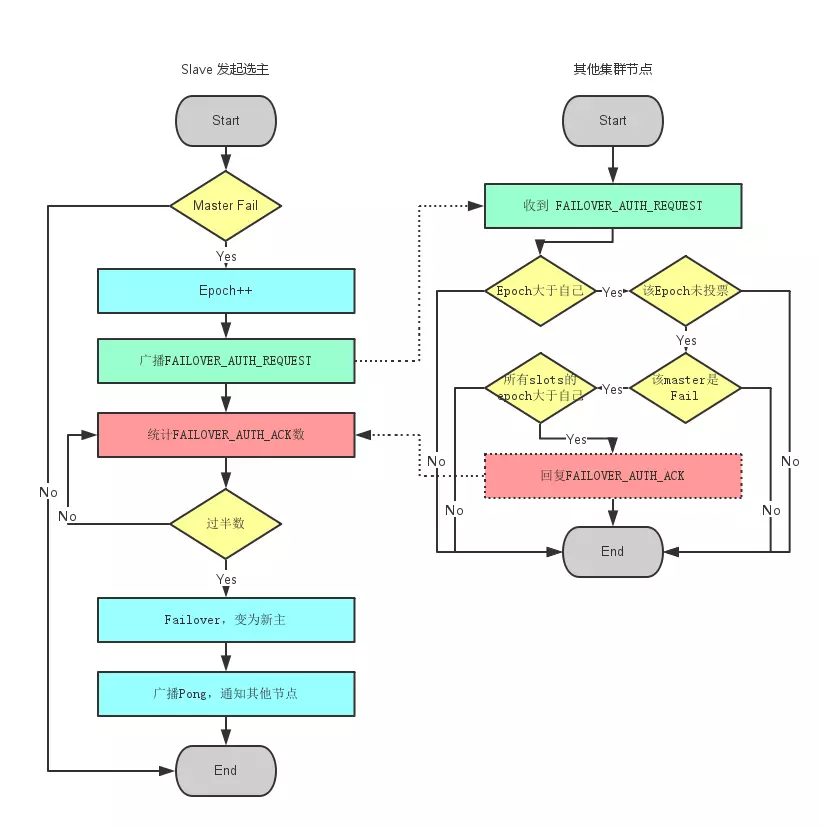

# Redis 主从架构

单机的 redis，能够承载的 QPS 大概就在上万到几万不等。对于缓存来说，一般都是用来支撑**读高并发**的。因此架构做成主从(master-slave)架构，一主多从，主负责写，并且将数据复制到其它的 slave 节点，从节点负责读。所有的**读请求全部走从节点**。这样也可以很轻松实现水平扩容，**支撑读高并发**。


redis replication -> 主从架构 -> 读写分离 -> 水平扩容支撑读高并发

## redis replication 的核心机制
- redis 采用**异步方式**复制数据到 slave 节点，不过 redis2.8 开始，slave node 会周期性地确认自己每次复制的数据量；
- 一个 master node 是可以配置多个 slave node 的；
- slave node 也可以连接其他的 slave node；
- slave node 做复制的时候，不会 block master node 的正常工作；
- slave node 在做复制的时候，也不会 block 对自己的查询操作，它会用旧的数据集来提供服务；但是复制完成的时候，需要删除旧数据集，加载新数据集，这个时候就会暂停对外服务了；
- slave node 主要用来进行横向扩容，做读写分离，扩容的 slave node 可以提高读的吞吐量。

注意，如果采用了主从架构，那么建议必须**开启** master node 的[持久化](./redis持久化.md)，不建议用 slave node 作为 master node 的数据热备，因为那样的话，如果你关掉 master 的持久化，可能在 master 宕机重启的时候数据是空的，然后可能一经过复制， slave node 的数据也丢了。

另外，master 的各种备份方案，也需要做。万一本地的所有文件丢失了，从备份中挑选一份 rdb 去恢复 master，这样才能**确保启动的时候，是有数据的**，即使采用了后续讲解的[高可用机制](./redis高可用.md)，slave node 可以自动接管 master node，但也可能 sentinel 还没检测到 master failure，master node 就自动重启了，还是可能导致上面所有的 slave node 数据被清空。

## redis 主从复制的核心原理
当启动一个 slave node 的时候，它会发送一个 `PSYNC` 命令给 master node。

如果这是 slave node 初次连接到 master node，那么会触发一次 `full resynchronization` 全量复制。此时 master 会启动一个后台线程，开始生成一份 `RDB` 快照文件，同时还会将从客户端 client 新收到的所有写命令缓存在内存中。`RDB` 文件生成完毕后， master 会将这个 `RDB` 发送给 slave，slave 会先**写入本地磁盘，然后再从本地磁盘加载到内存**中，接着 master 会将内存中缓存的写命令发送到 slave，slave 也会同步这些数据。slave node 如果跟 master node 有网络故障，断开了连接，会自动重连，连接之后 master node 仅会复制给 slave 部分缺少的数据。


### 主从复制的断点续传
从 redis2.8 开始，就支持主从复制的断点续传，如果主从复制过程中，网络连接断掉了，那么可以接着上次复制的地方，继续复制下去，而不是从头开始复制一份。

master node 会在内存中维护一个 backlog，master 和 slave 都会保存一个 replica offset 还有一个 master run id，offset 就是保存在 backlog 中的。如果 master 和 slave 网络连接断掉了，slave 会让 master 从上次 replica offset 开始继续复制，如果没有找到对应的 offset，那么就会执行一次 `resynchronization`。

> 如果根据 host+ip 定位 master node，是不靠谱的，如果 master node 重启或者数据出现了变化，那么 slave node 应该根据不同的 run id 区分。

### 无磁盘化复制
master 在内存中直接创建 `RDB`，然后发送给 slave，不会在自己本地落地磁盘了。只需要在配置文件中开启 `repl-diskless-sync yes` 即可。
```bash
repl-diskless-sync yes

# 等待 5s 后再开始复制，因为要等更多 slave 重新连接过来
repl-diskless-sync-delay 5
```

### 过期 key 处理
slave 不会过期 key，只会等待 master 过期 key。如果 master 过期了一个 key，或者通过 LRU 淘汰了一个 key，那么会模拟一条 del 命令发送给 slave。

## 复制的完整流程
slave node 启动时，会在自己本地保存 master node 的信息，包括 master node 的`host`和`ip`，但是复制流程没开始。

slave node 内部有个定时任务，每秒检查是否有新的 master node 要连接和复制，如果发现，就跟 master node 建立 socket 网络连接。然后 slave node 发送 `ping` 命令给 master node。如果 master 设置了 requirepass，那么 slave node 必须发送 masterauth 的口令过去进行认证。master node **第一次执行全量复制**，将所有数据发给 slave node。而在后续，master node 持续将写命令，异步复制给 slave node。


### 全量复制
- master 执行 bgsave ，在本地生成一份 rdb 快照文件。
- master node 将 rdb 快照文件发送给 slave node，如果 rdb 复制时间超过 60秒（repl-timeout），那么 slave node 就会认为复制失败，可以适当调大这个参数(对于千兆网卡的机器，一般每秒传输 100MB，6G 文件，很可能超过 60s)
- master node 在生成 rdb 时，会将所有新的写命令缓存在内存中，在 slave node 保存了 rdb 之后，再将新的写命令复制给 slave node。
- 如果在复制期间，内存缓冲区持续消耗超过 64MB，或者一次性超过 256MB，那么停止复制，复制失败。
```bash
client-output-buffer-limit slave 256MB 64MB 60
```
- slave node 接收到 rdb 之后，清空自己的旧数据，然后重新加载 rdb 到自己的内存中，同时**基于旧的数据版本**对外提供服务。
- 如果 slave node 开启了 AOF，那么会立即执行 BGREWRITEAOF，重写 AOF。

### 增量复制
- 如果全量复制过程中，master-slave 网络连接断掉，那么 slave 重新连接 master 时，会触发增量复制。
- master 直接从自己的 backlog 中获取部分丢失的数据，发送给 slave node，默认 backlog 就是 1MB。
- master 就是根据 slave 发送的 psync 中的 offset 来从 backlog 中获取数据的。

### heartbeat
主从节点互相都会发送 heartbeat 信息。

master 默认每隔 10秒 发送一次 heartbeat，slave node 每隔 1秒 发送一个 heartbeat。

### 异步复制
master 每次接收到写命令之后，先在内部写入数据，然后异步发送给 slave node。

## redis 如何才能做到高可用
如果系统在 365 天内，有 99.99% 的时间，都是可以哗哗对外提供服务的，那么就说系统是高可用的。

一个 slave 挂掉了，是不会影响可用性的，还有其它的 slave 在提供相同数据下的相同的对外的查询服务。

但是，如果 master node 死掉了，会怎么样？没法写数据了，写缓存的时候，全部失效了。slave node 还有什么用呢，没有 master 给它们复制数据了，系统相当于不可用了。

redis 的高可用架构，叫做 `failover` **故障转移**，也可以叫做主备切换。

master node 在故障时，自动检测，并且将某个 slave node 自动切换为 master node 的过程，叫做主备切换。这个过程，实现了 redis 的主从架构下的高可用。

## redis 集群选主过程分析
当slave发现自己的master变为FAIL状态时，便尝试进行Failover，以期成为新的master。由于挂掉的master可能会有多个slave。Failover的过程需要经过类Raft协议的过程在整个集群内达到一致， 其过程如下：

slave发现自己的master变为FAIL。将自己记录的集群currentEpoch加1（其实就和一个写入偏移量一样的参数），并广播Failover Request信息。其他节点收到该信息，只有master响应，判断请求者的合法性，并发送`FAILOVER_AUTH_ACK`，对每一个epoch只发送一次ack，尝试failover的slave收集`FAILOVER_AUTH_ACK`，超过半数后变成新Master，广播Pong通知其他集群节点




## Redis 集群中的纪元(epoch)

纪元（epoch）
Redis Cluster 使用了类似于 Raft 算法 term（任期）的概念称为 epoch（纪元），用来给事件增加版本号。Redis 集群中的纪元主要是两种：currentEpoch 和 configEpoch。

currentEpoch
这是一个集群状态相关的概念，可以当做记录集群状态变更的递增版本号。每个集群节点，都会通过 server.cluster->currentEpoch 记录当前的 currentEpoch。

集群节点创建时，不管是 master 还是 slave，都置 currentEpoch 为 0。当前节点接收到来自其他节点的包时，如果发送者的 currentEpoch（消息头部会包含发送者的 currentEpoch）大于当前节点的currentEpoch，那么当前节点会更新 currentEpoch 为发送者的 currentEpoch。因此，集群中所有节点的 currentEpoch 最终会达成一致，相当于对集群状态的认知达成了一致。

currentEpoch 作用
currentEpoch 作用在于，当集群的状态发生改变，某个节点为了执行一些动作需要寻求其他节点的同意时，就会增加 currentEpoch 的值。目前 currentEpoch 只用于 slave 的故障转移流程，这就跟哨兵中的sentinel.current_epoch 作用是一模一样的。当 slave A 发现其所属的 master 下线时，就会试图发起故障转移流程。首先就是增加 currentEpoch 的值，这个增加后的 currentEpoch 是所有集群节点中最大的。然后slave A 向所有节点发起拉票请求，请求其他 master 投票给自己，使自己能成为新的 master。其他节点收到包后，发现发送者的 currentEpoch 比自己的 currentEpoch 大，就会更新自己的 currentEpoch，并在尚未投票的情况下，投票给 slave A，表示同意使其成为新的 master。

configEpoch
这是一个集群节点配置相关的概念，每个集群节点都有自己独一无二的 configepoch。所谓的节点配置，实际上是指节点所负责的槽位信息。

每一个 master 在向其他节点发送包时，都会附带其 configEpoch 信息，以及一份表示它所负责的 slots 信息。而 slave 向其他节点发送包时，其包中的 configEpoch 和负责槽位信息，是其 master 的 configEpoch 和负责的 slot 信息。节点收到包之后，就会根据包中的 configEpoch 和负责的 slots 信息，记录到相应节点属性中。

configEpoch 作用
configEpoch 主要用于解决不同的节点的配置发生冲突的情况。举个例子就明白了：节点A 宣称负责 slot 1，其向外发送的包中，包含了自己的 configEpoch 和负责的 slots 信息。节点 C 收到 A 发来的包后，发现自己当前没有记录 slot 1 的负责节点（也就是 server.cluster->slots[1] 为 NULL），就会将 A 置为 slot 1 的负责节点（server.cluster->slots[1] = A），并记录节点 A 的 configEpoch。后来，节点 C 又收到了 B 发来的包，它也宣称负责 slot 1，此时，如何判断 slot 1 到底由谁负责呢？

这就是 configEpoch 起作用的时候了，C 在 B 发来的包中，发现它的 configEpoch，要比 A 的大，说明 B 是更新的配置。因此，就将 slot 1 的负责节点设置为 B（server.cluster->slots[1] = B）。在 slave 发起选举，获得足够多的选票之后，成功当选时，也就是 slave 试图替代其已经下线的旧 master，成为新的 master 时，会增加它自己的 configEpoch，使其成为当前所有集群节点的 configEpoch 中的最大值。这样，该 slave 成为 master 后，就会向所有节点发送广播包，强制其他节点更新相关 slots 的负责节点为自己。


