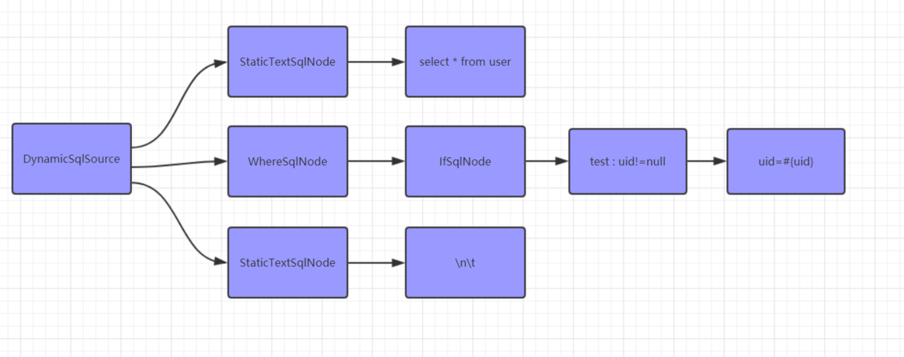
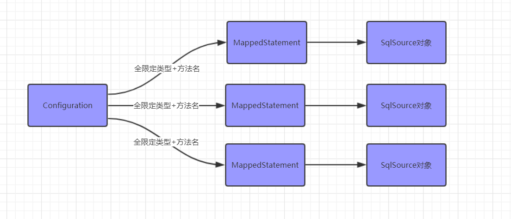
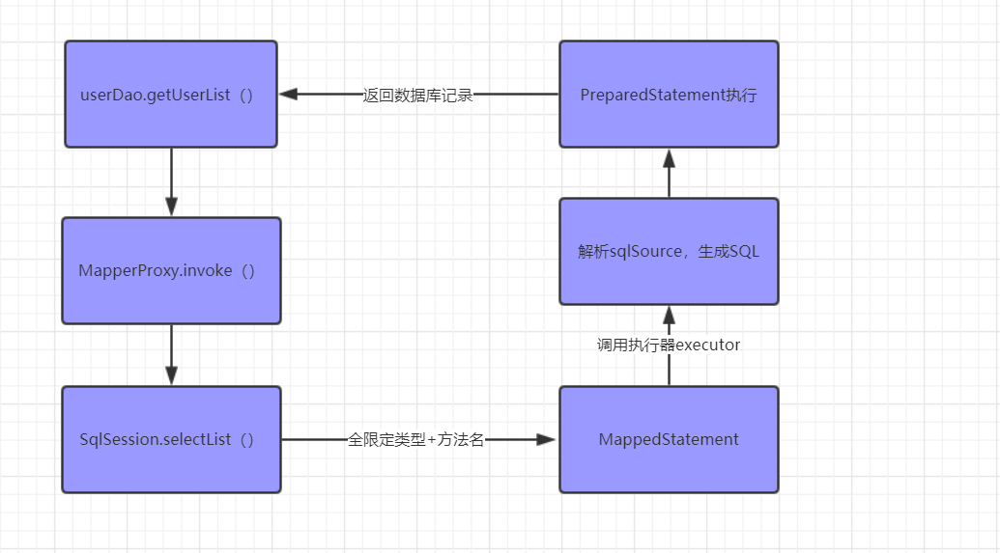

摘自：`https://react-juejin.foreversnsd.cn/post/5c9f4af6f265da30bf15c45a?pos=comment`

**`Mybatis`中的`Dao`接口和`XML`文件里的`SQL`是如何建立关系的？**

## 一、解析`XML`

首先，`Mybatis`在初始化`SqlSessionFactoryBean`的时候，找到`mapperLocations`路径去解析里面所有的`XML`文件，这里我们重点关注两部分。

1、创建`SqlSource`
`Mybatis`会把每个`SQL`标签封装成`SqlSource`对象。然后根据`SQL`语句的不同，又分为动态`SQL`和静态`SQL`。其中，静态`SQL`包含一段`String`类型的`sql`语句；而动态`SQL`则是由一个个`SqlNode`组成。


假如我们有这样一个`SQL`：

```sql
<select id="getUserById" resultType="user">
	select * from user 
	<where>
		<if test="uid!=null">
			and uid=#{uid}
		</if>
	</where>
</select>
```

它对应的`SqlSource`对象看起来应该是这样的：



2、创建`MappedStatement`
`XML`文件中的每一个`SQL`标签就对应一个`MappedStatement`对象，这里面有两个属性很重要。

`id`：全限定类名+方法名组成的`ID`。

`sqlSource`：当前`SQL`标签对应的`SqlSource`对象。

创建完`MappedStatement`对象，将它缓存到`Configuration#mappedStatements`中。`Configuration`对象，我们知道它就是`Mybatis`中的大管家，基本所有的配置信息都维护在这里。把所有的`XML`都解析完成之后，`Configuration`就包含了所有的`SQL`信息。



到目前为止，`XML`就解析完成了。看到上面的图示，聪明如你，也许就大概知道了。当我们执行`Mybatis`方法的时候，就通过`全限定类名+方法名`找到`MappedStatement`对象，然后解析里面的`SQL`内容，执行即可。

## 二、`Dao`接口代理
我们的`Dao`接口并没有实现类，那么，我们在调用它的时候，它是怎样最终执行到我们的`SQL`语句的呢？

首先，我们在`Spring`配置文件中，一般会这样配置：

```xml
<bean class="org.mybatis.spring.mapper.MapperScannerConfigurer">
	<property name="basePackage" value="com.viewscenes.netsupervisor.dao" />
	<property name="sqlSessionFactoryBeanName" value="sqlSessionFactory"></property>
</bean>
```

或者你的项目是基于`SpringBoot`的，那么肯定也见过这种： `@MapperScan("com.xxx.dao")`

它们的作用是一样的。将包路径下的所有类注册到`Spring Bean`中，并且将它们的`beanClass`设置为`MapperFactoryBean`。有意思的是，`MapperFactoryBean`实现了`FactoryBean`接口，俗称工厂`Bean`。那么，当我们通过`@Autowired`注入这个`Dao`接口的时候，返回的对象就是`MapperFactoryBean`这个工厂`Bean`中的`getObject()`方法对象。

那么，这个方法干了些什么呢？

简单来说，它就是通过`JDK`动态代理，返回了一个`Dao`接口的代理对象，这个代理对象的处理器是`MapperProxy`对象。所有，我们通过`@Autowired`注入`Dao`接口的时候，注入的就是这个代理对象，我们调用到`Dao`接口的方法时，则会调用到`MapperProxy`对象的`invoke`方法。

曾经有个朋友问过这样一个问题：

> 对于有实现的`dao`接口，`mapper`还会用代理么？

**答案是肯定，只要你配置了`MapperScan`，它就会去扫描，然后生成代理。但是，如果你的`dao`接口有实现类，并且这个实现类也是一个`Spring Bean`，那就要看你在`Autowired`的时候，去注入哪一个了。**

具体什么意思呢？我们来到一个例子。

如果我们给`userDao`搞一个实现类，并且把它注册到`Spring`。

```java
@Component
public class UserDaoImpl implements UserDao{
	public List<User> getUserList(Map<String,Object> map){
		return new ArrayList<User>();
	}
}
```

然后我们在`Service`方法中，注入这个`userDao`。猜猜会发生什么？

```
@Service
public class UserServiceImpl implements UserService{

	@Autowired
	UserMapper userDao1;

	public List<User> getUserList(Map<String,Object> map) {
		return userDao1.getUserList(map);
	}
}
```

也许你已经猜到了，是的，它会启动报错。因为在注入的时候，找到了两个`UserMapper`的实例对象。日志是这样的： `No qualifying bean of type [com.viewscenes.netsupervisor.dao.UserDao] is defined: expected single matching bean but found 2: userDaoImpl,userDao`

当然了，也许我们的命名不太规范。其实我们通过名字注入就可以了，像这样： `@Autowired UserMapper userDao;` 或者 `@Autowired UserMapper userDaoImpl;` 再或者给你其中一个`Bean`加上`@Primary`注解。

## 三、执行

如上所述，当我们调用`Dao`接口方法的时候，实际调用到代理对象的`invoke`方法。 在这里，实际上调用的就是`SqlSession`里面的东西了。

```
public class DefaultSqlSession implements SqlSession {

	public <E> List<E> selectList(String statement, Object parameter, RowBounds rowBounds) {
		try {
			MappedStatement ms = configuration.getMappedStatement(statement);
			return executor.query(ms, 
				wrapCollection(parameter), rowBounds, Executor.NO_RESULT_HANDLER);
		}
	}
}
```

看到以上代码，说明我们想的不错。它就是通过`statement 全限定类型+方法名`拿到`MappedStatement `对象，然后通过执行器`Executor`去执行具体`SQL`并返回。



## 四、总结

到这里，再回到开头我们提到的问题，也许你能更好的回答。同时笔者觉得，这道题目，如果你覆盖到以下几个关键词，面试官可能会觉得很满意。

- `SqlSource`以及动态标签`SqlNode`
- `MappedStatement`对象
- `Spring `工厂`Bean` 以及动态代理
- `SqlSession`以及执行器

那么，针对第二个问题：如果有两个`XML`文件和这个`Dao`建立关系，岂不是冲突了？

答案也是显而易见，不管有几个`XML`和`Dao`建立关系，只要保证`namespace+id`唯一即可。


