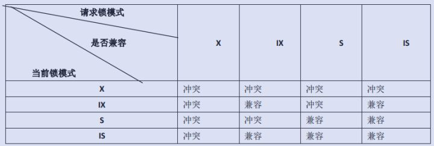
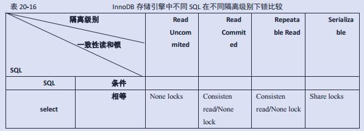
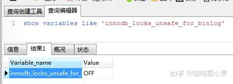

摘自:`https://zhuanlan.zhihu.com/p/29150809`

## **锁机制**

## **共享锁与排他锁**

- 共享锁（读锁）：其他事务可以读，但不能写。
- 排他锁（写锁） ：其他事务不能读取，也不能写。

## **粒度锁**

MySQL 不同的存储引擎支持不同的锁机制，所有的存储引擎都以自己的方式显现了锁机制，服务器层完全不了解存储引擎中的锁实现：

- MyISAM 和 MEMORY 存储引擎采用的是表级锁（table-level locking）
- BDB 存储引擎采用的是页面锁（page-level locking），但也支持表级锁
- InnoDB 存储引擎既支持行级锁（row-level locking），也支持表级锁，但默认情况下是采用行级锁。

默认情况下，表锁和行锁都是自动获得的， 不需要额外的命令。

但是在有的情况下， 用户需要明确地进行锁表或者进行事务的控制， 以便确保整个事务的完整性，这样就需要使用事务控制和锁定语句来完成。

## **不同粒度锁的比较：**

- 表级*锁：开销小，加锁快；不会出现死锁；锁定粒度大，发生锁冲突的概率最高，并发度最低。*

- - *这些存储引擎通过总是一次性同时获取所有需要的锁以及总是按相同的顺序获取表锁来避免死锁。*
    - *表级锁更适合于以查询为主，并发用户少，只有少量按索引条件更新数据的应用，如Web 应用*

- *行级锁：开销大，加锁慢；会出现死锁；锁定粒度最小，发生锁冲突的概率最低，并发度也最高。*

- - *最大程度的支持并发，同时也带来了最大的锁开销。*
    - *在 InnoDB 中，除单个 SQL* 组成的事务外，
        锁是逐步获得的，这就决定了在 InnoDB 中发生死锁是可能的。
    - 行级锁只在存储引擎层实现，而Mysql服务器层没有实现。 行级锁更适合于有大量按索引条件并发更新少量不同数据，同时又有并发查询的应用，如一些在线事务处理（OLTP）系统

- 页面锁：开销和加锁时间界于表锁和行锁之间；会出现死锁；锁定粒度界于表锁和行锁之间，并发度一般。

## **MyISAM 表锁**

## **MyISAM表级锁模式：**

- 表共享读锁 （Table Read Lock）：不会阻塞其他用户对同一表的读请求，但会阻塞对同一表的写请求；
- 表独占写锁 （Table Write Lock）：会阻塞其他用户对同一表的读和写操作；

MyISAM 表的读操作与写操作之间，以及写操作之间是串行的。当一个线程获得对一个表的写锁后， 只有持有锁的线程可以对表进行更新操作。 其他线程的读、 写操作都会等待，直到锁被释放为止。

默认情况下，写锁比读锁具有更高的优先级：当一个锁释放时，这个锁会优先给写锁队列中等候的获取锁请求，然后再给读锁队列中等候的获取锁请求。 （This ensures that updates to a table are not “starved” even when there is heavy SELECT activity for the table. However, if there are many updates for a table, SELECT statements wait until there are no more updates.）。

这也正是 MyISAM 表不太适合于有大量更新操作和查询操作应用的原因，因为，大量的更新操作会造成查询操作很难获得读锁，从而可能永远阻塞。同时，一些需要长时间运行的查询操作，也会使写线程“饿死” ，应用中应尽量避免出现长时间运行的查询操作（在可能的情况下可以通过使用中间表等措施对SQL语句做一定的“分解” ，使每一步查询都能在较短时间完成，从而减少锁冲突。如果复杂查询不可避免，应尽量安排在数据库空闲时段执行，比如一些定期统计可以安排在夜间执行）。

可以设置改变读锁和写锁的优先级：

- 通过指定启动参数low-priority-updates，使MyISAM引擎默认给予读请求以优先的权利。
- 通过执行命令SET LOW_PRIORITY_UPDATES=1，使该连接发出的更新请求优先级降低。
- 通过指定INSERT、UPDATE、DELETE语句的LOW_PRIORITY属性，降低该语句的优先级。
- 给系统参数max_write_lock_count设置一个合适的值，当一个表的读锁达到这个值后，MySQL就暂时将写请求的优先级降低，给读进程一定获得锁的机会。

## **MyISAM加表锁方法：**

MyISAM 在执行查询语句（SELECT）前，会自动给涉及的表加读锁，在执行更新操作
（UPDATE、DELETE、INSERT 等）前，会自动给涉及的表加写锁，这个过程并不需要用户干预，因此，用户一般不需要直接用 LOCK TABLE 命令给 MyISAM 表显式加锁。

在自动加锁的情况下，MyISAM 总是一次获得 SQL 语句所需要的全部锁，这也正是 MyISAM 表不会出现死锁（Deadlock Free）的原因。


MyISAM存储引擎支持并发插入，以减少给定表的读和写操作之间的争用：

如果MyISAM表在数据文件中间没有空闲块，则行始终插入数据文件的末尾。 在这种情况下，你可以自由混合并发使用MyISAM表的INSERT和SELECT语句而不需要加锁——你可以在其他线程进行读操作的时候，同时将行插入到MyISAM表中。 文件中间的空闲块可能是从表格中间删除或更新的行而产生的。 如果文件中间有空闲快，则并发插入会被禁用，但是当所有空闲块都填充有新数据时，它又会自动重新启用。 要控制此行为，可以使用MySQL的concurrent_insert系统变量。

如果你使用LOCK TABLES显式获取表锁，则可以请求READ LOCAL锁而不是READ锁，以便在锁定表时，其他会话可以使用并发插入。

- 当concurrent_insert设置为0时，不允许并发插入。
- 当concurrent_insert设置为1时，如果MyISAM表中没有空洞（即表的中间没有被删除的行），MyISAM允许在一个线程读表的同时，另一个线程从表尾插入记录。这也是MySQL的默认设置。
- 当concurrent_insert设置为2时，无论MyISAM表中有没有空洞，都允许在表尾并发插入记录。

## **查询表级锁争用情况：**

可以通过检查 table_locks_waited 和 table_locks_immediate 状态变量来分析系统上的表锁的争夺，如果 Table_locks_waited 的值比较高，则说明存在着较严重的表级锁争用情况：

```text
mysql> SHOW STATUS LIKE 'Table%';
+-----------------------+---------+
| Variable_name | Value |
+-----------------------+---------+
| Table_locks_immediate | 1151552 |
| Table_locks_waited | 15324 |
+-----------------------+---------+
```

## **InnoDB行级锁和表级锁**

## **InnoDB锁模式：**

InnoDB 实现了以下两种类型的**行锁**：

- 共享锁（S）：允许一个事务去读一行，阻止其他事务获得相同数据集的排他锁。
- 排他锁（X）：允许获得排他锁的事务更新数据，阻止其他事务取得相同数据集的共享读锁和排他写锁。

为了允许行锁和表锁共存，实现多粒度锁机制，InnoDB 还有两种内部使用的意向锁（Intention Locks），这两种意向锁都是**表锁**：

- 意向共享锁（IS）：事务打算给数据行加行共享锁，事务在给一个数据行加共享锁前必须先取得该表的 IS 锁。
- 意向排他锁（IX）：事务打算给数据行加行排他锁，事务在给一个数据行加排他锁前必须先取得该表的 IX 锁。

**锁模式的兼容情况：**



（如果一个事务请求的锁模式与当前的锁兼容， InnoDB 就将请求的锁授予该事务； 反之， 如果两者不兼容，该事务就要等待锁释放。）

## **InnoDB加锁方法：**

- 意向锁是 InnoDB 自动加的， 不需用户干预。

- 对于 UPDATE、 DELETE 和 INSERT 语句， InnoDB
    会自动给涉及数据集加排他锁（X)；

- 对于普通 SELECT 语句，InnoDB 不会加任何锁；
    事务可以通过以下语句显式给记录集加共享锁或排他锁：

- - 共享锁（S）：SELECT * FROM table_name WHERE ... LOCK IN SHARE MODE。 其他 session 仍然可以查询记录，并也可以对该记录加 share mode 的共享锁。但是如果当前事务需要对该记录进行更新操作，则很有可能造成死锁。
    - 排他锁（X)：SELECT * FROM table_name WHERE ... FOR UPDATE。其他 session 可以查询该记录，但是不能对该记录加共享锁或排他锁，而是等待获得锁


- **隐式锁定：**

InnoDB在事务执行过程中，使用两阶段锁协议：

随时都可以执行锁定，InnoDB会根据隔离级别在需要的时候自动加锁；

锁只有在执行commit或者rollback的时候才会释放，并且所有的锁都是在**同一时刻**被释放。

- **显式锁定 ：**

```text
select ... lock in share mode //共享锁 
select ... for update //排他锁 
```

**select for update：**

在执行这个 select 查询语句的时候，会将对应的索引访问条目进行上排他锁（X 锁），也就是说这个语句对应的锁就相当于update带来的效果。

select *** for update 的使用场景：为了让自己查到的数据确保是最新数据，并且查到后的数据只允许自己来修改的时候，需要用到 for update 子句。

**select lock in share mode ：**in share mode 子句的作用就是将查找到的数据加上一个 share 锁，这个就是表示其他的事务只能对这些数据进行简单的select 操作，并不能够进行 DML 操作。select *** lock in share mode 使用场景：为了确保自己查到的数据没有被其他的事务正在修改，也就是说确保查到的数据是最新的数据，并且不允许其他人来修改数据。但是自己不一定能够修改数据，因为有可能其他的事务也对这些数据 使用了 in share mode 的方式上了 S 锁。

**性能影响：**
select for update 语句，相当于一个 update 语句。在业务繁忙的情况下，如果事务没有及时的commit或者rollback 可能会造成其他事务长时间的等待，从而影响数据库的并发使用效率。
select lock in share mode 语句是一个给查找的数据上一个共享锁（S 锁）的功能，它允许其他的事务也对该数据上S锁，但是不能够允许对该数据进行修改。如果不及时的commit 或者rollback 也可能会造成大量的事务等待。

**for update 和 lock in share mode 的区别：**

前一个上的是排他锁（X 锁），一旦一个事务获取了这个锁，其他的事务是没法在这些数据上执行 for update ；后一个是共享锁，多个事务可以同时的对相同数据执行 lock in share mode。

## **InnoDB 行锁实现方式：**

- InnoDB 行锁是通过给索引上的索引项加锁来实现的，这一点 MySQL 与 Oracle 不同，后者是通过在数据块中对相应数据行加锁来实现的。InnoDB 这种行锁实现特点意味着：只有通过索引条件检索数据，InnoDB 才使用行级锁，否则，InnoDB 将使用表锁！
- 不论是使用主键索引、唯一索引或普通索引，InnoDB 都会使用行锁来对数据加锁。
- 只有执行计划真正使用了索引，才能使用行锁：即便在条件中使用了索引字段，但是否使用索引来检索数据是由 MySQL 通过判断不同执行计划的代价来决定的，如果 MySQL 认为全表扫描效率更高，比如对一些很小的表，它就不会使用索引，这种情况下 InnoDB 将使用表锁，而不是行锁。因此，在分析锁冲突时，
    别忘了检查 SQL 的执行计划（可以通过 explain 检查 SQL 的执行计划），以确认是否真正使用了索引。（更多阅读：[MySQL索引总结](https://link.zhihu.com/?target=http%3A//mp.weixin.qq.com/s/h4B84UmzAUJ81iBY_FXNOg)）
- 由于 MySQL 的行锁是针对索引加的锁，不是针对记录加的锁，所以虽然多个session是访问不同行的记录， 但是如果是使用相同的索引键， 是会出现锁冲突的（后使用这些索引的session需要等待先使用索引的session释放锁后，才能获取锁）。 应用设计的时候要注意这一点。

## **InnoDB的间隙锁：**

当我们用范围条件而不是相等条件检索数据，并请求共享或排他锁时，InnoDB会给符合条件的已有数据记录的索引项加锁；对于键值在条件范围内但并不存在的记录，叫做“间隙（GAP)”，InnoDB也会对这个“间隙”加锁，这种锁机制就是所谓的间隙锁（Next-Key锁）。

很显然，在使用范围条件检索并锁定记录时，InnoDB这种加锁机制会阻塞符合条件范围内键值的并发插入，这往往会造成严重的锁等待。因此，在实际应用开发中，尤其是并发插入比较多的应用，我们要尽量优化业务逻辑，尽量使用相等条件来访问更新数据，避免使用范围条件。

**InnoDB使用间隙锁的目的：**

1. 防止幻读，以满足相关隔离级别的要求；
2. 满足恢复和复制的需要：

MySQL 通过 BINLOG 录入执行成功的 INSERT、UPDATE、DELETE 等更新数据的 SQL 语句，并由此实现 MySQL 数据库的恢复和主从复制。MySQL 的恢复机制（复制其实就是在 Slave Mysql 不断做基于 BINLOG 的恢复）有以下特点：

一是 MySQL 的恢复是 SQL 语句级的，也就是重新执行 BINLOG 中的 SQL 语句。

二是 MySQL 的 Binlog 是按照事务提交的先后顺序记录的， 恢复也是按这个顺序进行的。

由此可见，MySQL 的恢复机制要求：在一个事务未提交前，其他并发事务不能插入满足其锁定条件的任何记录，也就是不允许出现幻读。

## **InnoDB 在不同隔离级别下的一致性读及锁的差异：**

锁和多版本数据（MVCC）是 InnoDB 实现一致性读和 ISO/ANSI SQL92 隔离级别的手段。

因此，在不同的隔离级别下，InnoDB 处理 SQL 时采用的一致性读策略和需要的锁是不同的：




对于许多 SQL，隔离级别越高，InnoDB 给记录集加的锁就越严格（尤其是使用范围条件的时候），产生锁冲突的可能性也就越高，从而对并发性事务处理性能的 影响也就越大。

因此， 我们在应用中， 应该尽量使用较低的隔离级别， 以减少锁争用的机率。实际上，通过优化事务逻辑，大部分应用使用 Read Commited 隔离级别就足够了。对于一些确实需要更高隔离级别的事务， 可以通过在程序中执行 SET SESSION TRANSACTION ISOLATION

LEVEL REPEATABLE READ 或 SET SESSION TRANSACTION ISOLATION LEVEL SERIALIZABLE 动态改变隔离级别的方式满足需求。

## **获取 InnoDB 行锁争用情况：**

可以通过检查 InnoDB_row_lock 状态变量来分析系统上的行锁的争夺情况：

```text
mysql> show status like 'innodb_row_lock%'; 
+-------------------------------+-------+ 
| Variable_name | Value | 
+-------------------------------+-------+ 
| InnoDB_row_lock_current_waits | 0 | 
| InnoDB_row_lock_time | 0 | 
| InnoDB_row_lock_time_avg | 0 | 
| InnoDB_row_lock_time_max | 0 | 
| InnoDB_row_lock_waits | 0 | 
+-------------------------------+-------+ 
5 rows in set (0.01 sec)
```

## **LOCK TABLES 和 UNLOCK TABLES**

Mysql也支持lock tables和unlock tables，这都是在服务器层（MySQL Server层）实现的，和存储引擎无关，它们有自己的用途，并不能替代事务处理。 （除了禁用了autocommint后可以使用，其他情况不建议使用）：

- LOCK TABLES 可以锁定用于当前线程的表。如果表被其他线程锁定，则当前线程会等待，直到可以获取所有锁定为止。
- UNLOCK TABLES 可以释放当前线程获得的任何锁定。当前线程执行另一个 LOCK TABLES 时，
    或当与服务器的连接被关闭时，所有由当前线程锁定的表被隐含地解锁

## **LOCK TABLES语法：**

- 在用 LOCK TABLES 对 InnoDB 表加锁时要注意，要将 AUTOCOMMIT 设为 0，否则MySQL 不会给表加锁；
- 事务结束前，不要用 UNLOCK TABLES 释放表锁，因为 UNLOCK TABLES会隐含地提交事务；
- COMMIT 或 ROLLBACK 并不能释放用 LOCK TABLES 加的表级锁，必须用UNLOCK TABLES 释放表锁。

正确的方式见如下语句：
例如，如果需要写表 t1 并从表 t 读，可以按如下做：

```text
SET AUTOCOMMIT=0; 
LOCK TABLES t1 WRITE, t2 READ, ...; 
[do something with tables t1 and t2 here]; 
COMMIT; 
UNLOCK TABLES;
```

## **使用LOCK TABLES的场景：**

给表显示加表级锁（InnoDB表和MyISAM都可以），一般是为了在一定程度模拟事务操作，实现对某一时间点多个表的一致性读取。（与MyISAM默认的表锁行为类似）

在用 LOCK TABLES 给表显式加表锁时，必须同时取得所有涉及到表的锁，并且 MySQL 不支持锁升级。也就是说，在执行 LOCK TABLES 后，只能访问显式加锁的这些表，不能访问未加锁的表；同时，如果加的是读锁，那么只能执行查询操作，而不能执行更新操作。

其实，在MyISAM自动加锁（表锁）的情况下也大致如此，MyISAM 总是一次获得 SQL 语句所需要的全部锁，这也正是 MyISAM 表不会出现死锁（Deadlock Free）的原因。

例如，有一个订单表 orders，其中记录有各订单的总金额 total，同时还有一个 订单明细表 order_detail，其中记录有各订单每一产品的金额小计 subtotal，假设我们需要检 查这两个表的金额合计是否相符，可能就需要执行如下两条 SQL：

```text
Select sum(total) from orders; 
Select sum(subtotal) from order_detail; 
```

这时，如果不先给两个表加锁，就可能产生错误的结果，因为第一条语句执行过程中，
order_detail 表可能已经发生了改变。因此，正确的方法应该是：

```text
Lock tables orders read local, order_detail read local; 
Select sum(total) from orders; 
Select sum(subtotal) from order_detail; 
Unlock tables;
```

（在 LOCK TABLES 时加了“local”选项，其作用就是允许当你持有表的读锁时，其他用户可以在满足 MyISAM 表并发插入条件的情况下，在表尾并发插入记录（MyISAM 存储引擎支持“并发插入”））

## **死锁（Deadlock Free）**

- **死锁产生：**

- - 死锁是指两个或多个事务在同一资源上相互占用，并请求锁定对方占用的资源，从而导致恶性循环。
    - 当事务试图以不同的顺序锁定资源时，就可能产生死锁。多个事务同时锁定同一个资源时也可能会产生死锁。
    - 锁的行为和顺序和存储引擎相关。以同样的顺序执行语句，有些存储引擎会产生死锁有些不会——死锁有双重原因：真正的数据冲突；存储引擎的实现方式。

- **检测死锁：**数据库系统实现了各种死锁检测和死锁超时的机制。InnoDB存储引擎能检测到死锁的循环依赖并立即返回一个错误。

- **死锁恢复：**死锁发生以后，只有部分或完全回滚其中一个事务，才能打破死锁，InnoDB目前处理死锁的方法是，将持有最少行级排他锁的事务进行回滚。所以事务型应用程序在设计时必须考虑如何处理死锁，多数情况下只需要重新执行因死锁回滚的事务即可。

- **外部锁的死锁检测：**发生死锁后，InnoDB 一般都能自动检测到，并使一个事务释放锁并回退，另一个事务获得锁，继续完成事务。但在涉及外部锁，或涉及表锁的情况下，InnoDB 并不能完全自动检测到死锁， 这需要通过设置锁等待超时参数 innodb_lock_wait_timeout 来解决

- **死锁影响性能：**死锁会影响性能而不是会产生严重错误，因为InnoDB会自动检测死锁状况并回滚其中一个受影响的事务。在高并发系统上，当许多线程等待同一个锁时，死锁检测可能导致速度变慢。 有时当发生死锁时，禁用死锁检测（使用innodb_deadlock_detect配置选项）可能会更有效，这时可以依赖innodb_lock_wait_timeout设置进行事务回滚。

## **MyISAM避免死锁：**

- *在自动加锁的情况下，MyISAM 总是一次获得 SQL 语句所需要的全部锁，所以 MyISAM 表不会出现死锁。*

## **InnoDB避免死锁：**

- 为了在单个InnoDB表上执行多个并发写入操作时避免死锁，可以在事务开始时通过为预期要修改的每个元祖（行）使用SELECT ... FOR UPDATE语句来获取必要的锁，即使这些行的更改语句是在之后才执行的。
- 在事务中，如果要更新记录，应该直接申请足够级别的锁，即排他锁，而不应先申请共享锁、更新时再申请排他锁，因为这时候当用户再申请排他锁时，其他事务可能又已经获得了相同记录的共享锁，从而造成锁冲突，甚至死锁
- 如果事务需要修改或锁定多个表，则应在每个事务中以相同的顺序使用加锁语句。 在应用中，如果不同的程序会并发存取多个表，应尽量约定以相同的顺序来访问表，这样可以大大降低产生死锁的机会
- 通过SELECT ... LOCK IN SHARE MODE获取行的读锁后，如果当前事务再需要对该记录进行更新操作，则很有可能造成死锁。
- 改变事务隔离级别

如果出现死锁，可以用 SHOW INNODB STATUS 命令来确定最后一个死锁产生的原因。返回结果中包括死锁相关事务的详细信息，如引发死锁的 SQL 语句，事务已经获得的锁，正在等待什么锁，以及被回滚的事务等。据此可以分析死锁产生的原因和改进措施。

## **一些优化锁性能的建议**

- *尽量使用较低的隔离级别；*
- *精心设计索引， 并尽量使用索引访问数据， 使加锁更精确， 从而减少锁冲突的机会*
- *选择合理的事务大小，小事*务发生锁冲突的几率也更小
- 给记录集显示加锁时，最好一次性请求足够级别的锁。比如要修改数据的话，最好直接申请排他锁，而不是先申请共享锁，修改时再请求排他锁，这样容易产生死锁
- 不同的程序访问一组表时，应尽量约定以相同的顺序访问各表，对一个表而言，尽可能以固定的顺序存取表中的行。这样可以大大减少死锁的机会
- 尽量用相等条件访问数据，这样可以避免间隙锁对并发插入的影响
- 不要申请超过实际需要的锁级别
- 除非必须，查询时不要显示加锁。 MySQL的MVCC可以实现事务中的查询不用加锁，优化事务性能；MVCC只在COMMITTED READ（读提交）和REPEATABLE READ（可重复读）两种隔离级别下工作
- 对于一些特定的事务，可以使用表锁来提高处理速度或减少死锁的可能

## **乐观锁、悲观锁**

- **乐观锁(Optimistic Lock)**：假设不会发生并发冲突，只在提交操作时检查是否违反数据完整性。 乐观锁不能解决脏读的问题。

乐观锁, 顾名思义，就是很乐观，每次去拿数据的时候都认为别人不会修改，所以不会上锁，但是在更新的时候会判断一下在此期间别人有没有去更新这个数据，可以使用版本号等机制。乐观锁适用于多读的应用类型，这样可以提高吞吐量，像数据库如果提供类似于write_condition机制的其实都是提供的乐观锁。

- **悲观锁(Pessimistic Lock)**：假定会发生并发冲突，屏蔽一切可能违反数据完整性的操作。

悲观锁，顾名思义，就是很悲观，每次去拿数据的时候都认为别人会修改，所以每次在拿数据的时候都会上锁，这样别人想拿这个数据就会block直到它拿到锁。传统的关系型数据库里边就用到了很多这种锁机制，比如行锁，表锁等，读锁，写锁等，都是在做操作之前先上锁。


## 记录锁、间隙锁、临键锁

摘自：`https://zhuanlan.zhihu.com/p/48269420`


### 记录锁(Record Locks)

记录锁是 **封锁记录，记录锁也叫行锁**，例如：

```sql
SELECT * FROM `test` WHERE `id`=1 FOR UPDATE;
```

它会在 id=1 的记录上加上记录锁，以阻止其他事务插入，更新，删除 id=1 这一行。


**记录锁、间隙锁、临键锁都是排它锁**，而记录锁的使用方法跟之前的一篇文章 [共享/排它锁](https://zhuanlan.zhihu.com/p/48127815) 里的排它锁介绍一致，这里就不详细多讲。


### 间隙锁(Gap Locks)（重点）

**间隙锁是封锁索引记录中的间隔**，或者第一条索引记录之前的范围，又或者最后一条索引记录之后的范围。


**产生间隙锁的条件（RR事务隔离级别下；）：**

1. 使用普通索引锁定；
2. 使用多列唯一索引；
3. 使用唯一索引锁定多行记录。

以上情况，都会产生间隙锁，下面是小编看了官方文档理解的：

> 对于使用唯一索引来搜索并给某一行记录加锁的语句，不会产生间隙锁。（这不包括搜索条件仅包括多列唯一索引的一些列的情况；在这种情况下，会产生间隙锁。）例如，如果id列具有唯一索引，则下面的语句仅对具有id值100的行使用记录锁，并不会产生间隙锁：

```sql
SELECT * FROM child WHERE id = 100 FOR UPDATE;
```

这条语句，就只会产生记录锁，不会产生间隙锁。


**打开间隙锁设置**

首先查看 innodb_locks_unsafe_for_binlog 是否禁用：

```sql
show variables like 'innodb_locks_unsafe_for_binlog';
```

查看结果：



innodb_locks_unsafe_for_binlog：默认值为OFF，即启用间隙锁。因为此参数是只读模式，如果想要禁用间隙锁，需要修改 my.cnf（windows是my.ini） 重新启动才行。

```sql
# 在 my.cnf 里面的[mysqld]添加
[mysqld]
innodb_locks_unsafe_for_binlog = 1
```


### 唯一索引的间隙锁

**测试环境：**

环境：MySQL，InnoDB，默认的隔离级别（RR）

数据表：

```sql
CREATE TABLE `test` (
  `id` int(1) NOT NULL AUTO_INCREMENT,
  `name` varchar(8) DEFAULT NULL,
  PRIMARY KEY (`id`)
) ENGINE=InnoDB DEFAULT CHARSET=utf8;
```

数据：

```sql
INSERT INTO `test` VALUES ('1', '小罗');
INSERT INTO `test` VALUES ('5', '小黄');
INSERT INTO `test` VALUES ('7', '小明');
INSERT INTO `test` VALUES ('11', '小红');
```

在进行测试之前，我们先来看看test表中存在的隐藏间隙：

1. (-infinity, 1]
2. (1, 5]
3. (5, 7]
4. (7, 11]
5. (11, +infinity]


**只使用记录锁，不会产生间隙锁**

我们现在进行以下几个事务的测试：

```sql
/* 开启事务1 */
BEGIN;
/* 查询 id = 5 的数据并加记录锁 */
SELECT * FROM `test` WHERE `id` = 5 FOR UPDATE;
/* 延迟30秒执行，防止锁释放 */
SELECT SLEEP(30);

# 注意：以下的语句不是放在一个事务中执行，而是分开多次执行，每次事务中只有一条添加语句

/* 事务2插入一条 name = '小张' 的数据 */
INSERT INTO `test` (`id`, `name`) VALUES (4, '小张'); # 正常执行

/* 事务3插入一条 name = '小张' 的数据 */
INSERT INTO `test` (`id`, `name`) VALUES (8, '小东'); # 正常执行

/* 提交事务1，释放事务1的锁 */
COMMIT;
```

上诉的案例，由于主键是唯一索引，而且是只使用一个索引查询，并且只锁定一条记录，所以以上的例子，只会对 id = 5 的数据加上记录锁，而不会产生间隙锁。


**产生间隙锁**

我们继续在 id 唯一索引列上做以下的测试：

```sql
/* 开启事务1 */
BEGIN;
/* 查询 id 在 7 - 11 范围的数据并加记录锁 */
SELECT * FROM `test` WHERE `id` BETWEEN 5 AND 7 FOR UPDATE;
/* 延迟30秒执行，防止锁释放 */
SELECT SLEEP(30);

# 注意：以下的语句不是放在一个事务中执行，而是分开多次执行，每次事务中只有一条添加语句

/* 事务2插入一条 id = 3，name = '小张1' 的数据 */
INSERT INTO `test` (`id`, `name`) VALUES (3, '小张1'); # 正常执行

/* 事务3插入一条 id = 4，name = '小白' 的数据 */
INSERT INTO `test` (`id`, `name`) VALUES (4, '小白'); # 正常执行

/* 事务4插入一条 id = 6，name = '小东' 的数据 */
INSERT INTO `test` (`id`, `name`) VALUES (6, '小东'); # 阻塞

/* 事务5插入一条 id = 8， name = '大罗' 的数据 */
INSERT INTO `test` (`id`, `name`) VALUES (8, '大罗'); # 阻塞

/* 事务6插入一条 id = 9， name = '大东' 的数据 */
INSERT INTO `test` (`id`, `name`) VALUES (9, '大东'); # 阻塞

/* 事务7插入一条 id = 11， name = '李西' 的数据 */
INSERT INTO `test` (`id`, `name`) VALUES (11, '李西'); # 阻塞

/* 事务8插入一条 id = 12， name = '张三' 的数据 */
INSERT INTO `test` (`id`, `name`) VALUES (12, '张三'); # 正常执行

/* 提交事务1，释放事务1的锁 */
COMMIT;
```

从上面我们可以看到，(5, 7]、(7, 11] 这两个区间，都不可插入数据，其它区间，都可以正常插入数据。所以我们可以得出结论：**当我们给 (5, 7] 这个区间加锁的时候，会锁住 (5, 7]、(7, 11] 这两个区间。**


我们再来测试如果我们锁住不存在的数据时，会怎样：

```sql
/* 开启事务1 */
BEGIN;
/* 查询 id = 3 这一条不存在的数据并加记录锁 */
SELECT * FROM `test` WHERE `id` = 3 FOR UPDATE;
/* 延迟30秒执行，防止锁释放 */
SELECT SLEEP(30);

# 注意：以下的语句不是放在一个事务中执行，而是分开多次执行，每次事务中只有一条添加语句

/* 事务2插入一条 id = 3，name = '小张1' 的数据 */
INSERT INTO `test` (`id`, `name`) VALUES (2, '小张1'); # 阻塞

/* 事务3插入一条 id = 4，name = '小白' 的数据 */
INSERT INTO `test` (`id`, `name`) VALUES (4, '小白'); # 阻塞

/* 事务4插入一条 id = 6，name = '小东' 的数据 */
INSERT INTO `test` (`id`, `name`) VALUES (6, '小东'); # 正常执行

/* 事务5插入一条 id = 8， name = '大罗' 的数据 */
INSERT INTO `test` (`id`, `name`) VALUES (8, '大罗'); # 正常执行

/* 提交事务1，释放事务1的锁 */
COMMIT;
```

我们可以看出，指定查询某一条记录时，如果这条记录不存在，会产生间隙锁。


**结论**

1. 对于指定查询某一条记录的加锁语句，**如果该记录不存在，会产生记录锁和间隙锁，如果记录存在，则只会产生记录锁**，如：WHERE `id` = 5 FOR UPDATE;
2. 对于查找某一范围内的查询语句，会产生间隙锁，如：WHERE `id` BETWEEN 5 AND 7 FOR UPDATE;


### 普通索引的间隙锁


**数据准备**

创建 test1 表：

```sql
# 注意：number 不是唯一值

CREATE TABLE `test1` (
  `id` int(1) NOT NULL AUTO_INCREMENT,
  `number` int(1) NOT NULL COMMENT '数字',
  PRIMARY KEY (`id`),
  KEY `number` (`number`) USING BTREE
) ENGINE=InnoDB AUTO_INCREMENT=1 DEFAULT CHARSET=utf8;
```

在这张表上，我们有 id number 这两个字段，id 是我们的主键，我们在 number 上，建立了一个普通索引，为了方便我们后面的测试。现在我们要先加一些数据：

```sql
INSERT INTO `test1` VALUES (1, 1);
INSERT INTO `test1` VALUES (5, 3);
INSERT INTO `test1` VALUES (7, 8);
INSERT INTO `test1` VALUES (11, 12);
```

在进行测试之前，我们先来看看test1表中 number 索引存在的隐藏间隙：

1. (-infinity, 1]
2. (1, 3]
3. (3, 8]
4. (8, 12]
5. (12, +infinity]


**案例说明**

我们执行以下的事务（事务1最后提交），分别执行下面的语句：

```sql
/* 开启事务1 */
BEGIN;
/* 查询 number = 5 的数据并加记录锁 */
SELECT * FROM `test1` WHERE `number` = 3 FOR UPDATE;
/* 延迟30秒执行，防止锁释放 */
SELECT SLEEP(30);

# 注意：以下的语句不是放在一个事务中执行，而是分开多次执行，每次事务中只有一条添加语句

/* 事务2插入一条 number = 0 的数据 */
INSERT INTO `test1` (`number`) VALUES (0); # 正常执行

/* 事务3插入一条 number = 1 的数据 */
INSERT INTO `test1` (`number`) VALUES (1); # 被阻塞

/* 事务4插入一条 number = 2 的数据 */
INSERT INTO `test1` (`number`) VALUES (2); # 被阻塞

/* 事务5插入一条 number = 4 的数据 */
INSERT INTO `test1` (`number`) VALUES (4); # 被阻塞

/* 事务6插入一条 number = 8 的数据 */
INSERT INTO `test1` (`number`) VALUES (8); # 正常执行

/* 事务7插入一条 number = 9 的数据 */
INSERT INTO `test1` (`number`) VALUES (9); # 正常执行

/* 事务8插入一条 number = 10 的数据 */
INSERT INTO `test1` (`number`) VALUES (10); # 正常执行

/* 提交事务1 */
COMMIT;
```

我们会发现有些语句可以正常执行，有些语句被阻塞了。我们再来看看我们表中的数据：


这里可以看到，number (1 - 8) 的间隙中，插入语句都被阻塞了，而不在这个范围内的语句，正常执行，这就是因为有间隙锁的原因。我们再进行以下的测试，方便我们更好的理解间隙锁的区域（我们要将数据还原成原来的那样）：

```sql
/* 开启事务1 */
BEGIN;
/* 查询 number = 5 的数据并加记录锁 */
SELECT * FROM `test1` WHERE `number` = 3 FOR UPDATE;
/* 延迟30秒执行，防止锁释放 */
SELECT SLEEP(30);

/* 事务1插入一条 id = 2， number = 1 的数据 */
INSERT INTO `test1` (`id`, `number`) VALUES (2, 1); # 阻塞

/* 事务2插入一条 id = 3， number = 2 的数据 */
INSERT INTO `test1` (`id`, `number`) VALUES (3, 2); # 阻塞

/* 事务3插入一条 id = 6， number = 8 的数据 */
INSERT INTO `test1` (`id`, `number`) VALUES (6, 8); # 阻塞

/* 事务4插入一条 id = 8， number = 8 的数据 */
INSERT INTO `test1` (`id`, `number`) VALUES (8, 8); # 正常执行

/* 事务5插入一条 id = 9， number = 9 的数据 */
INSERT INTO `test1` (`id`, `number`) VALUES (9, 9); # 正常执行

/* 事务6插入一条 id = 10， number = 12 的数据 */
INSERT INTO `test1` (`id`, `number`) VALUES (10, 12); # 正常执行

/* 事务7修改 id = 11， number = 12 的数据 */
UPDATE `test1` SET `number` = 5 WHERE `id` = 11 AND `number` = 12; # 阻塞

/* 提交事务1 */
COMMIT;
```

我们来看看结果：


这里有一个奇怪的现象：

- 事务3添加 id = 6，number = 8 的数据，给阻塞了；
- 事务4添加 id = 8，number = 8 的数据，正常执行了。
- 事务7将 id = 11，number = 12 的数据修改为 id = 11， number = 5的操作，给阻塞了；

这是为什么呢？我们来看看下边的图，大家就明白了。


从图中可以看出，当 number 相同时，会根据主键 id 来排序，所以：

1. 事务3添加的 id = 6，number = 8，这条数据是在 （3, 8） 的区间里边，所以会被阻塞；
2. 事务4添加的 id = 8，number = 8，这条数据则是在（8, 12）区间里边，所以不会被阻塞；
3. 事务7的修改语句相当于在 （3, 8） 的区间里边插入一条数据，所以也被阻塞了。


**结论**

1. 在普通索引列上，**不管是何种查询，只要加锁，都会产生间隙锁，这跟唯一索引不一样；**
2. 在普通索引跟唯一索引中，数据间隙的分析，数据行是优先根据普通索引排序，再根据唯一索引排序。


### 临键锁(Next-key Locks)


**临键锁**，是**记录锁与间隙锁的组合**，它的封锁范围，既包含索引记录，又包含索引区间。


**注：**临键锁的主要目的，也是为了避免**幻读**(Phantom Read)。如果把事务的隔离级别降级为RC，临键锁则也会失效。


### 本文要点

1. 记录锁、间隙锁、临键锁，都属于排它锁；
2. 记录锁就是锁住一行记录；
3. 间隙锁只有在事务隔离级别 RR 中才会产生；
4. 唯一索引只有锁住多条记录或者一条不存在的记录的时候，才会产生间隙锁，指定给某条存在的记录加锁的时候，只会加记录锁，不会产生间隙锁；
5. 普通索引不管是锁住单条，还是多条记录，都会产生间隙锁；
6. 间隙锁会封锁该条记录相邻两个键之间的空白区域，防止其它事务在这个区域内插入、修改、删除数据，这是为了防止出现 幻读 现象；
7. 普通索引的间隙，优先以普通索引排序，然后再根据主键索引排序（多普通索引情况还未研究）；
8. 事务级别是RC（读已提交）级别的话，间隙锁将会失效。

