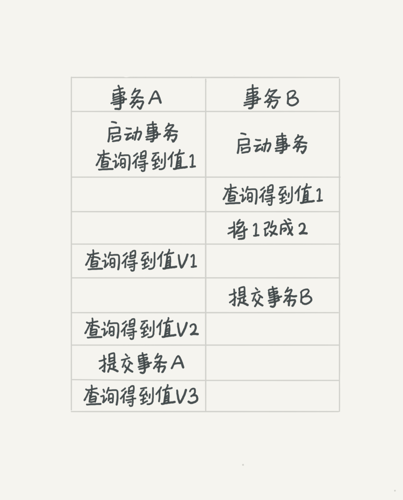
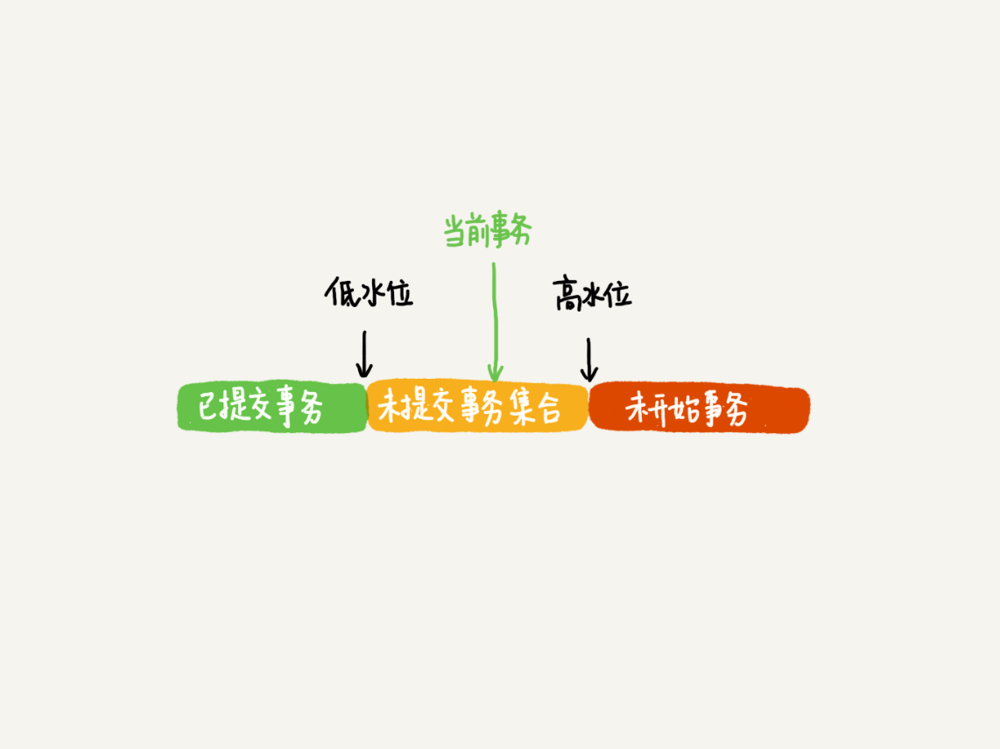

摘自：`http://xuyangyang.club/articles/2019/03/13/1552460434876.html`

## 1、事务的启动

`begin/start transaction`命令并不是一个事务的起点，在执行到它们之后的第一个操作`InnoDB`表的语句，事务才真正启动。如果你想要马上启动一个事务，可以使用`start transaction with consistent snapshot`这个命令。

## 2、事务的隔离级别

* 未提交读是指，一个事务还没提交时，它做的变更就能被别的事务看到。
* 提交读是指，一个事务提交之后，它做的变更才会被其他事务看到。
* 可重复读是指，一个事务在执行过程中看到的数据，总是跟这个事务在启动时看到的数据是一致的。当然在可重复读隔离级别下，未提交变更对其他事务也是不可见的。
* 串行化，顾名思义是对于同一行记录，“写"会加"写锁”,“读"会加"读锁”。当出现读写锁冲突的时候，后访问的事务必须等前一个事务执行完成，才能继续执行。

在不同的隔离级别下，事务`A`会有哪些不同的返回结果：

* 若隔离级别是"未提交读"，则`V1`的值就是2。这时候事务`B`虽然还没有提交，但是结果已经被`A`看到了。因此，`V2，V3`也都是2。

* 若隔离级别是"提交读"，则`V1`是1，`V2`的值是2，事务`B`的更新在提交之后才能被`A`看到。所以，`V3`的值也是2。

* 若隔离级别是"可重复读"，则`V1`是1，`V2`是1，`V3`是2。之所以`V2`还是1，遵循的就是这个要求：事务在执行期间看到的数据前后是一致的。

* 若隔离级别是"串行化"，则在事务`B`执行”将1改成2“的时候，会被锁住。直到事务A提交后，事务B才可以继续执行，所以从A的角度看，`V1、V2`的值时1，`V3`的值是2。

在实现上，数据库里面会创建一个**视图**，访问的时候以视图的逻辑结果为准。在"可重复性读"隔离级别下，这个视图是在事务启动时创建的，整个事务存在期间都用这个视图。在"提交读"隔离级别下，这个视图是在每个`SQL`语句开始执行的时候创建的。"未提交读"隔离级别下直接返回记录上的最新值，没有视图概念；而"串行化"隔离级别下直接用加锁的方式来避免并行访问。

## 3、"快照"在`MVCC`里是这么工作的？

`InnoDB`里面每个事务有一个唯一的事务`ID`，叫做`transaction id`。它是事务开始的时候想`InnoDB`的事务系统申请的，是按申请顺序严格递增的。

而每行数据也是有多个版本的。每次事务更新数据的时候，都会生成一个新的数据版本，并且把这个`transaction id`赋值给这个数据版本的事务`ID`，记作`row trx_id`。同时，旧的数据版本要保留，并且在新的数据版本中，能够有信息可以直接拿到它。

`InnoDB`为每个事务构造了一个数组，用来保存这个事务启动瞬间，当前正在"活跃"的所有事务`ID`。"活跃"指的是启动了但还未提交。数组里面事务`ID`的最小值记作低水位，当前系统里面已经创建过的事务`ID`的最大值加1记作高水位。这个视图数组和高低水平，就组成了当前事务的一致性视图。而数据版本的可见性规则，就是基于数据的`row trx_id`和这个一致性视图的对比结果得到的。这个视图数组把所有的`row trx_id`分成了几种不同的情况：

这样对于当前事务的启动瞬间来说，一个数据版本的`row trx_id`，有以下几种可能。

1. 如果落在绿色部分，表示这个版本是已提交的事务或者当前事务自己生成的，这个数据是可见的。
2. 如果落在红色部分，表示这个版本有将来启动的事务生成的，是肯定不可见的。
3. 如果落在黄色部分，那么就有两种情况：

- 若`row trx_id`在数组中，表示这个版本是还没提交的事务生成的，不可见。
- 若`row trx_id`不在数组中，表示这个版本是已经提交了事务生成的，可见。

## 4、更新逻辑

更新数据都是先读后写的，而这个读，只能都当前的值，称为"当前读"。

除了`update`语句外，`select`语句如果加锁，也是当前读。

## 5、幻读是什么

幻读指的是一个事务在前后两次查询同一个范围的时候，后一次查询看到了前一次查询没有看到的行。（这个查询必须为当前读），并且有如下说明：

1. 在可重复读隔离级别下，普通的查询是快照读，是不会看到别的事务插入的数据的。因此，幻读在"当前读"下才会出现。
2. 在另外一个事务中修改了数据，当前事务用“当前读”看到，不能称之为幻读。幻读仅专指“新插入的行”。

## 6、如何解决幻读？

产生幻读的原因是，行锁只能锁住行，但是新插入记录这个动作，要更新的是记录之前的“间隙”。因此，为了解决幻读问题，`InnoDB`只好引入新的锁，也就是间隙锁（`Gap Lock`）。

间隙锁跟行锁不一样，跟间隙锁存在冲突关系的，是“往这个间隙中插入一个记录”这个操作，间隙锁之间都不存在冲突关系。间隙锁和行锁合称`next-key lock`，每个`next-key lock`是前开后闭区间。间隙锁只在可重复读隔离级别下才会生效。

## 7、加锁规则

1. 原则1：加锁的基本单位是`next-key lock`，`next-key lock`是前开后闭区间。
2. 原则2：查找过程中访问到的对象才会加锁。
3. 优化1：索引上的等值查询，给唯一索引加锁的时候，`next-key lock`退化为行锁。
4. 优化2：索引上的等值查询，向右遍历时且最后一个值不满足等值条件时,`next-key lock`退化为间隙锁。
5. 一个`bug`：唯一索引上的范围查询会访问到不满足条件的第一个值为止。

## 8、举例

摘自：`https://www.cnblogs.com/fidelQuan/p/4549068.html`

事务并发会产生什么问题

1）第一类丢失更新：在没有事务隔离的情况下，两个事务都同时更新一行数据，但是第二个事务却中途失败退出， 导致对数据的两个修改都失效了。

例如：

张三的工资为5000，事务A中获取工资为5000，事务B获取工资为5000，汇入100，并提交数据库，工资变为5100，随后，事务A发生异常，回滚了，恢复张三的工资为5000，这样就导致事务B的更新丢失了。

2）脏读：脏读就是指当一个事务正在访问数据，并且对数据进行了修改，而这种修改还没有提交到数据库中，这时，另外一个事务也访问这个数据，然后使用了这个数据。
例如：

张三的工资为5000,事务A中把他的工资改为8000,但事务A尚未提交。与此同时，事务B正在读取张三的工资，读取到张三的工资为8000。随后，事务A发生异常，而回滚了事务。张三的工资又回滚为5000。最后，事务B读取到的张三工资为8000的数据即为脏数据，事务B做了一次脏读。

3）不可重复读：是指在一个事务内，多次读同一数据。在这个事务还没有结束时，另外一个事务也访问该同一数据。那么，在第一个事务中的两次读数据之间，由于第二个事务的修改，那么第一个事务两次读到的的数据可能是不一样的。这样就发生了在一个事务内两次读到的数据是不一样的，因此称为是不可重复读。
例如：

在事务A中，读取到张三的工资为5000，操作没有完成，事务还没提交。与此同时，事务B把张三的工资改为8000，并提交了事务。随后，在事务A中，再次读取张三的工资，此时工资变为8000。在一个事务中前后两次读取的结果并不致，导致了不可重复读。

4）第二类丢失更新：不可重复读的特例。有两个并发事务同时读取同一行数据，然后其中一个对它进行修改提交，而另一个也进行了修改提交。这就会造成第一次写操作失效。 

例如：

在事务A中，读取到张三的存款为5000，操作没有完成，事务还没提交。与此同时，事务B，存储1000，把张三的存款改为6000，并提交了事务。随后，在事务A中，存储500，把张三的存款改为5500，并提交了事务，这样事务A的更新覆盖了事务B的更新。

5）幻读：是指当事务不是独立执行时发生的一种现象，例如第一个事务对一个表中的数据进行了修改，这种修改涉及到表中的全部数据行。同时，第二个事务也修改这个表中的数据，这种修改是向表中插入一行新数据。那么，以后就会发生操作第一个事务的用户发现表中还有没有修改的数据行，就好象发生了幻觉一样。
例如：

目前工资为5000的员工有10人，事务A读取所有工资为5000的人数为10人。此时，事务B插入一条工资也为5000的记录。这是，事务A再次读取工资为5000的员工，记录为11人。此时产生了幻读。

提醒：
不可重复读的重点是修改，同样的条件，你读取过的数据，再次读取出来发现值不一样了
幻读的重点在于新增或者删除，同样的条件，第 1 次和第 2 次读出来的记录数不一样

3、事务隔离级别，解决什么并发问题，以及存在什么并发问题

（1）READ_UNCOMMITTED
这是事务最低的隔离级别，它充许另外一个事务可以看到这个事务未提交的数据。解决第一类丢失更新的问题，但是会出现脏读、不可重复读、第二类丢失更新的问题，幻读 。
（2）READ_COMMITTED
保证一个事务修改的数据提交后才能被另外一个事务读取，即另外一个事务不能读取该事务未提交的数据。解决第一类丢失更新和脏读的问题，但会出现不可重复读、第二类丢失更新的问题，幻读问题
（3）REPEATABLE_READ
保证一个事务相同条件下前后两次获取的数据是一致的。解决第一类丢失更新，脏读、不可重复读、第二类丢失更新的问题，但会出幻读。
（4）SERIALIZABLE
事务被处理为顺序执行。解决所有问题

提醒：
Mysql默认的事务隔离级别为repeatable_read

4、InnoDB引擎的锁机制

（之所以以InnoDB为主介绍锁，是因为InnoDB支持事务，支持行锁和表锁用的比较多，Myisam不支持事务，只支持表锁）

共享锁（S）：允许一个事务去读一行，阻止其他事务获得相同数据集的排他锁。
排他锁（X)：允许获得排他锁的事务更新数据，阻止其他事务取得相同数据集的共享读锁和排他写锁。
意向共享锁（IS）：事务打算给数据行加行共享锁，事务在给一个数据行加共享锁前必须先取得该表的IS锁。
意向排他锁（IX）：事务打算给数据行加行排他锁，事务在给一个数据行加排他锁前必须先取得该表的IX锁。
说明：

1）共享锁和排他锁都是行锁，意向锁都是表锁，应用中我们只会使用到共享锁和排他锁，意向锁是mysql内部使用的，不需要用户干预。

2）对于UPDATE、DELETE和INSERT语句，InnoDB会自动给涉及数据集加排他锁（X)；对于普通SELECT语句，InnoDB不会加任何锁，事务可以通过以下语句显示给记录集加共享锁或排他锁。
共享锁（S）：SELECT * FROM table_name WHERE ... LOCK IN SHARE MODE。
排他锁（X)：SELECT * FROM table_name WHERE ... FOR UPDATE。

3）InnoDB行锁是通过给索引上的索引项加锁来实现的，因此InnoDB这种行锁实现特点意味着：只有通过索引条件检索数据，InnoDB才使用行级锁，否则，InnoDB将使用表锁！。

