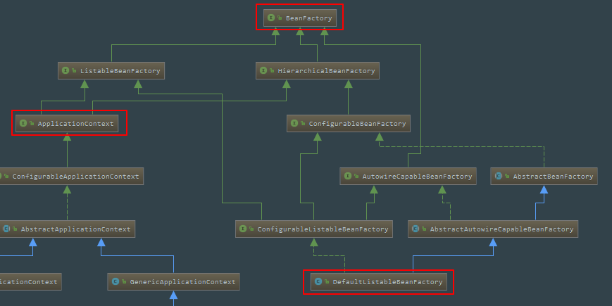

参考：`http://www.importnew.com/27469.html`

创建一个工程`spring_study`

```xml
// pom.xml
<?xml version="1.0" encoding="UTF-8"?>
<project xmlns="http://maven.apache.org/POM/4.0.0"
         xmlns:xsi="http://www.w3.org/2001/XMLSchema-instance"
         xsi:schemaLocation="http://maven.apache.org/POM/4.0.0 http://maven.apache.org/xsd/maven-4.0.0.xsd">
	<modelVersion>4.0.0</modelVersion>

	<groupId>win.iot4yj</groupId>
	<artifactId>spring_study</artifactId>
	<version>1.0-SNAPSHOT</version>

	<dependencies>
		<dependency>
			<groupId>org.springframework</groupId>
			<artifactId>spring-context</artifactId>
			<version>5.1.5.RELEASE</version>
		</dependency>
		<dependency>
			<groupId>junit</groupId>
			<artifactId>junit</artifactId>
			<version>4.12</version>
		</dependency>
	</dependencies>
</project>
```

配置文件

```xml
// application.xml，直接放在resources目录中
<?xml version="1.0" encoding="UTF-8"?>
<beans xmlns="http://www.springframework.org/schema/beans"
       xmlns:xsi="http://www.w3.org/2001/XMLSchema-instance"
       xsi:schemaLocation="http://www.springframework.org/schema/beans http://www.springframework.org/schema/beans/spring-beans.xsd">
	<bean id="messageService" class="win.iot4yj.service.impl.MessageServiceImpl"/>
</beans>
```

业务类

```java
package win.iot4yj.service;
public interface MessageService {
	String getMessage();
}

package win.iot4yj.service.impl;
import win.iot4yj.service.MessageService;
public class MessageServiceImpl implements MessageService {

	public String getMessage() {
		return "hello world";
	}
}
```

主类

```java
package win.iot4yj;
import org.springframework.context.ApplicationContext;
import org.springframework.context.support.ClassPathXmlApplicationContext;
import win.iot4yj.service.MessageService;

public class IocAnalysis {

	public static void main(String[] args) {
		userXmlPattern();
	}

	private static void userXmlPattern() {
		// 用我们的配置文件来启动一个 ApplicationContext
		ApplicationContext context = new ClassPathXmlApplicationContext("classpath:application.xml");
		System.out.println("context 启动成功");
		// 从 context 中取出我们的 Bean，而不是用 new MessageServiceImpl() 这种方式
		MessageService messageService = context.getBean(MessageService.class);
		// 这句将输出: hello world
		System.out.println(messageService.getMessage());
	}
}
```


一下是`ApplicationContext`和`BeanFactory`的类结构图





## 1. `ClassPathXmlApplicationContext` 的构造方法：

```java
//调用
ApplicationContext context = new ClassPathXmlApplicationContext("classpath:application.xml");

//构造方法中就是解析xml配置文件，如果已经有 ApplicationContext 并需要配置成父子关系，解析xml此
//处不细说
public ClassPathXmlApplicationContext(String configLocation) throws BeansException {
	this(new String[] {configLocation}, true, null);
}
public ClassPathXmlApplicationContext(
		String[] configLocations, boolean refresh, @Nullable ApplicationContext parent) throws BeansException {

	super(parent);
    //解析配置文件列表，放置到上面说的那个 configResources 数组中
	setConfigLocations(configLocations);
	if (refresh) {
        //核心方法
		refresh();
	}
}
```

这里简单说下为什么是` refresh()`，而不是` init() `这种名字的方法。因为 `ApplicationContext `建立起来以后，其实我们是可以通过调用` refresh() `这个方法重建的，这样会将原来的 `ApplicationContext` 销毁，然后再重新执行一次初始化操作。

## 2. `AbstractApplicationContext#refresh`方法

```java
public void refresh() throws BeansException, IllegalStateException {
	// 加锁，避免 refresh() 还没结束，又启动或销毁容器的操作
    synchronized (this.startupShutdownMonitor) {
		// 准备工作，记录下容器的启动时间、标记“已启动”状态、处理配置文件中的占位符
		prepareRefresh();
        // 关键步骤（1）
		// 这步比较关键，这步完成后，配置文件就会解析成一个个 Bean 定义，注册到 BeanFactory 中，
		// 当然，这里说的 Bean 还没有初始化，只是配置信息都提取出来了，生成了BeanDefinition，
		// 注册也只是将这些信息都保存到了注册中心(说到底核心是一个 beanName-> beanDefinition 的 		// map)
		ConfigurableListableBeanFactory beanFactory = obtainFreshBeanFactory();
		
        // 关键步骤（2）
		// 设置 BeanFactory 的类加载器，添加几个 BeanPostProcessor，手动注册几个特殊的 bean
		prepareBeanFactory(beanFactory);

		try {
            // 关键步骤（3）
			// 这里是提供给子类的扩展点，到这里的时候，所有的 Bean 都加载、注册完成了，但是都还没
            // 有初始化,具体的子类可以在这步的时候添加一些特殊的 BeanFactoryPostProcessor 的实
            // 现类或做点什么事
			postProcessBeanFactory(beanFactory);

            // 关键步骤（4）
			// 调用 BeanFactoryPostProcessor 各个实现类的 					  
            // postProcessBeanFactory(factory) 方法
			invokeBeanFactoryPostProcessors(beanFactory);

            // 关键步骤（5）
			// 注册 BeanPostProcessor 的实现类，注意看和 BeanFactoryPostProcessor 的区别。
            // 此接口两个方法: postProcessBeforeInitialization 和 
            // postProcessAfterInitialization。两个方法分别在 Bean 初始化之前和初始化之后得到
            // 执行。注意，到这里 Bean 还没初始化
			registerBeanPostProcessors(beanFactory);

			// 国际化
			initMessageSource();
			// 初始化当前 ApplicationContext 的事件广播器，这里也不展开了
			initApplicationEventMulticaster();
			// 典型的模板方法(钩子方法)，具体的子类可以在这里初始化一些特殊的 Bean（在初始化 
            // singleton beans 之前）
			onRefresh();
			// 注册事件监听器，监听器需要实现 ApplicationListener 接口
			registerListeners();

            // 关键步骤（6）
			// 初始化所有的 singleton beans（lazy-init 的除外）
			finishBeanFactoryInitialization(beanFactory);

			// 最后，广播事件，ApplicationContext 初始化完成
			finishRefresh();
		} catch (BeansException ex) {
			if (logger.isWarnEnabled()) {
				logger.warn("Exception encountered during context initialization - " +
						"cancelling refresh attempt: " + ex);
			}

			// Destroy already created singletons to avoid dangling resources.
			destroyBeans();
			// Reset 'active' flag.
			cancelRefresh(ex);
			// Propagate exception to caller.
			throw ex;
		}
		finally {
			// Reset common introspection caches in Spring's core, since we
			// might not ever need metadata for singleton beans anymore...
			resetCommonCaches();
		}
	}
}
```

### 2.1 创建`Bean`容器前的准备工作`prepareRefresh()`

```java
protected void prepareRefresh() {
	// ......
	// 初始化一些占位符
	initPropertySources();

	// 校验 xml 配置文件
	getEnvironment().validateRequiredProperties();
	
	// ......
}
```

### 2.2 创建`Bean`容器，加载并注册`Bean，obtainFreshBeanFactory`

这个方法是全文最重要的部分之一，这里将会初始化 `BeanFactory`、加载 `Bean`、注册` Bean `等等。当然，这步结束后，`Bean` 并没有完成初始化。

```java
// AbstractApplicationContext extends DefaultResourceLoader
// implements ConfigurableApplicationContext
protected ConfigurableListableBeanFactory obtainFreshBeanFactory() {
    // 关闭旧的 BeanFactory (如果有)，创建新的 BeanFactory，加载 Bean 定义、注册 Bean 等等
	refreshBeanFactory();
    // 获取刚创建的BeanFactory
	return getBeanFactory();
}

// 如果时注解方式则调用GenericApplicationContext
// AbstractRefreshableApplicationContext extends AbstractApplicationContext
protected final void refreshBeanFactory() throws BeansException {
    // 如果 ApplicationContext 中已经加载过 BeanFactory 了，销毁所有 Bean，关闭 BeanFactory
    // 注意，应用中 BeanFactory 本来就是可以多个的，这里可不是说应用全局是否有 BeanFactory，而是
    // 当前 ApplicationContext 是否有 BeanFactory
	if (hasBeanFactory()) {
		destroyBeans();
		closeBeanFactory();
	}
	try {
        // 初始化一个 DefaultListableBeanFactory
		DefaultListableBeanFactory beanFactory = createBeanFactory();
        // 用于 BeanFactory 的序列化，当前不分析
		beanFactory.setSerializationId(getId());
        // 设置 BeanFactory 的两个配置属性：是否允许 Bean 覆盖、是否允许循环引用
		customizeBeanFactory(beanFactory);
        // 加载 Bean 到 BeanFactory 中
		loadBeanDefinitions(beanFactory);
		synchronized (this.beanFactoryMonitor) {
			this.beanFactory = beanFactory;
		}
	}
	catch (IOException ex) {
		throw new ApplicationContextException("I/O error parsing bean definition source for " + getDisplayName(), ex);
	}
}
```

看到这里的时候，我觉得读者就应该站在高处看 `ApplicationContext` 了，`ApplicationContext `继承自 `BeanFactory`，但是它不应该被理解为 `BeanFactory` 的实现类，而是说其内部持有一个实例化的 `BeanFactory（DefaultListableBeanFactory）`。以后所有的` BeanFactory `相关的操作其实是给这个实例来处理的。我们说说为什么选择实例化 `DefaultListableBeanFactory `前面我们说了有个很重要的接口 `ConfigurableListableBeanFactory`，它实现了 `BeanFactory `下面一层的所有三个接口，这基本上就是功能最全的`BeanFactory`了。

这里介绍一下BeanDefinition这个类，从代码层面上来说，Bean就是BeanDefinition的实例，它保存了Bean的定义信息，如指向哪个类、是否时单例、是否懒加载等。


#### 2.2.1 设置`Bean`的两个属性`customizeBeanFactory`

```java
//AbstractRefreshableApplicationContext extends AbstractApplicationContext
protected void customizeBeanFactory(DefaultListableBeanFactory beanFactory) {
    // 是否允许 Bean 定义覆盖
	if (this.allowBeanDefinitionOverriding != null) {
		beanFactory.setAllowBeanDefinitionOverriding(this.allowBeanDefinitionOverriding);
	}
	if (this.allowCircularReferences != null) {
        // 是否允许 Bean 之间的循环依赖
		beanFactory.setAllowCircularReferences(this.allowCircularReferences);
	}
}
```

默认情况下是允许`bean`定义在不同文件之间是可以覆盖的。

一般来说默认是允许循环依赖的，但是如果两个`Bean`的构造函数循环依赖是不被允许的，会直接抛出异常，循环依赖可以使用`setter`方法。


#### 2.2.2 加载`Bean，loadBeanDefinitions`

这个方法根据配置加载各个`Bean`，然后放到`BeanFactory`中。

```java
//AbstractXmlApplicationContext extends AbstractRefreshableConfigApplicationContext
protected void loadBeanDefinitions(DefaultListableBeanFactory beanFactory) throws BeansException, IOException {
	// 实例化一个 XmlBeanDefinitionReader 用于读取配置
	XmlBeanDefinitionReader beanDefinitionReader = new XmlBeanDefinitionReader(beanFactory);

	// Configure the bean definition reader with this context's
	// resource loading environment.
	beanDefinitionReader.setEnvironment(this.getEnvironment());
	beanDefinitionReader.setResourceLoader(this);
	beanDefinitionReader.setEntityResolver(new ResourceEntityResolver(this));

	// 初始化 BeanDefinitionReader，其实这个是提供给子类覆写的
	initBeanDefinitionReader(beanDefinitionReader);
    // 加载 Bean 的定义信息
	loadBeanDefinitions(beanDefinitionReader);
}
// 这里虽然有两个分支，但是第二个分支还是会转化为第一个分支的，
// 其实就是将配置文件路径信息转化为具体的配置信息
protected void loadBeanDefinitions(XmlBeanDefinitionReader reader) throws BeansException, IOException {
	Resource[] configResources = getConfigResources();
	if (configResources != null) {
        //主要看这里
		reader.loadBeanDefinitions(configResources);
	}
	String[] configLocations = getConfigLocations();
	if (configLocations != null) {
		reader.loadBeanDefinitions(configLocations);
	}
}

// AbstractBeanDefinitionReader implements BeanDefinitionReader, EnvironmentCapable
public int loadBeanDefinitions(Resource... resources) throws BeanDefinitionStoreException {
	Assert.notNull(resources, "Resource array must not be null");
	int count = 0;
	for (Resource resource : resources) {
        // 依次加载每个配置文件
		count += loadBeanDefinitions(resource);
	}
	return count;
}
// XmlBeanDefinitionReader extends AbstractBeanDefinitionReader
public int loadBeanDefinitions(Resource resource) throws BeanDefinitionStoreException {
	return loadBeanDefinitions(new EncodedResource(resource));
}
public int loadBeanDefinitions(EncodedResource encodedResource) throws BeanDefinitionStoreException {
    // ......
    // 用一个 ThreadLocal 来存放所有的配置文件资源
	Set<EncodedResource> currentResources = this.resourcesCurrentlyBeingLoaded.get();
	if (currentResources == null) {
		currentResources = new HashSet<>(4);
		this.resourcesCurrentlyBeingLoaded.set(currentResources);
	}
	if (!currentResources.add(encodedResource)) {
		throw new BeanDefinitionStoreException(
				"Detected cyclic loading of " + encodedResource + " - check your import definitions!");
	}
	try {
		InputStream inputStream = encodedResource.getResource().getInputStream();
		try {
			InputSource inputSource = new InputSource(inputStream);
			if (encodedResource.getEncoding() != null) {
				inputSource.setEncoding(encodedResource.getEncoding());
			}
            // 真正进行加载 Bean 定义
			return doLoadBeanDefinitions(inputSource, encodedResource.getResource());
		} finally {
			inputStream.close();
		}
	}
    // ......
}
protected int doLoadBeanDefinitions(InputSource inputSource, Resource resource)
		throws BeanDefinitionStoreException {
	try {
        // 解析XML 配置文件，生成一颗DOM树
		Document doc = doLoadDocument(inputSource, resource);
        // 注册 bean 的定义信息
		int count = registerBeanDefinitions(doc, resource);
		if (logger.isDebugEnabled()) {
			logger.debug("Loaded " + count + " bean definitions from " + resource);
		}
		return count;
	}
	// ...... 
}
public int registerBeanDefinitions(Document doc, Resource resource) throws BeanDefinitionStoreException {
	BeanDefinitionDocumentReader documentReader = createBeanDefinitionDocumentReader();
	int countBefore = getRegistry().getBeanDefinitionCount();
    // 注册
	documentReader.registerBeanDefinitions(doc, createReaderContext(resource));
	return getRegistry().getBeanDefinitionCount() - countBefore;
}

// DefaultBeanDefinitionDocumentReader implements BeanDefinitionDocumentReader
public void registerBeanDefinitions(Document doc, XmlReaderContext readerContext) {
	this.readerContext = readerContext;
	doRegisterBeanDefinitions(doc.getDocumentElement());
}
protected void doRegisterBeanDefinitions(Element root) {
    // 解析 Bean 定义，由于<beans/>内部可以定义<beans/>，所以递归解析
	BeanDefinitionParserDelegate parent = this.delegate;
	this.delegate = createDelegate(getReaderContext(), root, parent);

	if (this.delegate.isDefaultNamespace(root)) {
        // 这块说的是根节点 <beans ... profile="dev" /> 中的 profile 是否是当前环境需要的，
		// 如果当前环境配置的 profile 不包含此 profile，那就直接 return 了，不对此 <beans /> 
        // 解析
		String profileSpec = root.getAttribute(PROFILE_ATTRIBUTE);
		if (StringUtils.hasText(profileSpec)) {
			String[] specifiedProfiles = StringUtils.tokenizeToStringArray(
					profileSpec, BeanDefinitionParserDelegate.MULTI_VALUE_ATTRIBUTE_DELIMITERS);
			if (!getReaderContext().getEnvironment().acceptsProfiles(specifiedProfiles)) {
				if (logger.isDebugEnabled()) {
					logger.debug("Skipped XML bean definition file due to specified profiles [" + profileSpec +
							"] not matching: " + getReaderContext().getResource());
				}
				return;
			}
		}
	}

	preProcessXml(root);
    // 核心方法
	parseBeanDefinitions(root, this.delegate);
	postProcessXml(root);
	this.delegate = parent;
}
// default namespace 涉及到的就四个标签 <import />、<alias />、<bean /> 和 <beans />，
// 其他的属于 custom 的
protected void parseBeanDefinitions(Element root, BeanDefinitionParserDelegate delegate) {
	if (delegate.isDefaultNamespace(root)) {
		NodeList nl = root.getChildNodes();
		for (int i = 0; i < nl.getLength(); i++) {
			Node node = nl.item(i);
			if (node instanceof Element) {
				Element ele = (Element) node;
				if (delegate.isDefaultNamespace(ele)) {
                    // 代表解析的节点是 <import />、<alias />、<bean />、<beans />
					parseDefaultElement(ele, delegate);
				} else {
                    // 对于其他的标签，将进入到这个分支。如我们经常会使用到的 <mvc />、
                    // <task />、<context />、<aop />等
					delegate.parseCustomElement(ele);
				}
			}
		}
	} else {
		delegate.parseCustomElement(root);
	}
}
```

这里`<import />、<alias />、<bean />、<beans />`之所以是默认的，是因为它们是处于这个` namespace `下定义的：`http://www.springframework.org/schema/beans`，这里的第二行 `xmlns` 就是咯。

```xml
<beans xmlns:xsi="http://www.w3.org/2001/XMLSchema-instance"
       xmlns="http://www.springframework.org/schema/beans"
       xsi:schemaLocation="http://www.springframework.org/schema/beans
http://www.springframework.org/schema/beans/spring-beans.xsd" default-autowire="byName">
```

后面有关`Bean`的解析及注册就不再细说了。这里就已经完成了`BeanFactory`的实例化操作了。


### 2.3 准备 `Bean` 容器: `prepareBeanFactory`

```java
protected void prepareBeanFactory(ConfigurableListableBeanFactory beanFactory) {
	// 设置 BeanFactory 的类加载器，我们知道 BeanFactory 需要加载类，也就需要类加载器，
	// 这里设置为当前 ApplicationContext 的类加载器
	beanFactory.setBeanClassLoader(getClassLoader());
	beanFactory.setBeanExpressionResolver(new StandardBeanExpressionResolver(beanFactory.getBeanClassLoader()));
	beanFactory.addPropertyEditorRegistrar(new ResourceEditorRegistrar(this, getEnvironment()));

	// 添加一个 BeanPostProcessor，这个 processor 比较简单，
	// 实现了 Aware 接口的几个特殊的 beans 在初始化的时候，这个 processor 负责回调
	beanFactory.addBeanPostProcessor(new ApplicationContextAwareProcessor(this));
    // 下面几行的意思就是，如果某个 bean 依赖于以下几个接口的实现类，在自动装配的时候忽略它们，
    // Spring 会通过其他方式来处理这些依赖。
	beanFactory.ignoreDependencyInterface(EnvironmentAware.class);
	beanFactory.ignoreDependencyInterface(EmbeddedValueResolverAware.class);
	beanFactory.ignoreDependencyInterface(ResourceLoaderAware.class);
	beanFactory.ignoreDependencyInterface(ApplicationEventPublisherAware.class);
	beanFactory.ignoreDependencyInterface(MessageSourceAware.class);
	beanFactory.ignoreDependencyInterface(ApplicationContextAware.class);

	/**
    * 下面几行就是为特殊的几个 bean 赋值，如果有 bean 依赖了以下几个，会注入这边相应的值，
    * 之前我们说过，"当前 ApplicationContext 持有一个 BeanFactory"，这里解释了第一行
    * ApplicationContext 继承了 ResourceLoader、ApplicationEventPublisher、
    * MessageSource 所以对于这几个，可以赋值为 this，注意 this 是一个 ApplicationContext
    * 那这里怎么没看到为 MessageSource 赋值呢？那是因为 MessageSource 被注册成为了一个普通的 
    * bean
    */
	beanFactory.registerResolvableDependency(BeanFactory.class, beanFactory);
	beanFactory.registerResolvableDependency(ResourceLoader.class, this);
	beanFactory.registerResolvableDependency(ApplicationEventPublisher.class, this);
	beanFactory.registerResolvableDependency(ApplicationContext.class, this);

	// 在 bean 实例化后，如果是 ApplicationListener 的子
    // 类，那么将其添加到 listener 列表中，可以理解成：注册事件监听器
	beanFactory.addBeanPostProcessor(new ApplicationListenerDetector(this));

	// Detect a LoadTimeWeaver and prepare for weaving, if found.
	if (beanFactory.containsBean(LOAD_TIME_WEAVER_BEAN_NAME)) {
		beanFactory.addBeanPostProcessor(new LoadTimeWeaverAwareProcessor(beanFactory));
		// Set a temporary ClassLoader for type matching.
		beanFactory.setTempClassLoader(new ContextTypeMatchClassLoader(beanFactory.getBeanClassLoader()));
	}

	// Spring 往往很 "智能" 就是因为它会帮我们默认注册一些有用的 bean，我们也可以选择覆盖
    // 如果没有定义 "environment" 这个 bean，那么 Spring 会 "手动" 注册一个
	if (!beanFactory.containsLocalBean(ENVIRONMENT_BEAN_NAME)) {
		beanFactory.registerSingleton(ENVIRONMENT_BEAN_NAME, getEnvironment());
	}
    // 如果没有定义 "systemProperties" 这个 bean，那么 Spring 会 "手动" 注册一个
	if (!beanFactory.containsLocalBean(SYSTEM_PROPERTIES_BEAN_NAME)) {
		beanFactory.registerSingleton(SYSTEM_PROPERTIES_BEAN_NAME, getEnvironment().getSystemProperties());
	}
    // 如果没有定义 "systemEnvironment" 这个 bean，那么 Spring 会 "手动" 注册一个
	if (!beanFactory.containsLocalBean(SYSTEM_ENVIRONMENT_BEAN_NAME)) {
		beanFactory.registerSingleton(SYSTEM_ENVIRONMENT_BEAN_NAME, getEnvironment().getSystemEnvironment());
	}
}
```

这里对`BeanFactory`做一些准备工作。

### 2.4 对实例化之前的`Bean`做处理#`postProcessBeanFactory`

 `BeanFactoryPostProcessor`接口实现类可以在当前`BeanFactory`初始化后，`bean`实例化之前对`BeanFactory`做一些处理。**`BeanFactoryPostProcessor`是针对于`bean`容器的，在调用它时，`BeanFactory`只加载了`bean`的定义，还没有对它们进行实例化，所以我们可以通过对`BeanFactory`的处理来达到影响之后实例化`bean`的效果**。跟`BeanPostProcessor`一样，`ApplicationContext`也能自动检测和调用容器中的`BeanFactoryPostProcessor`。  

```java
// AbstractApplicationContext extends DefaultResourceLoader
// implements ConfigurableApplicationContext
protected void postProcessBeanFactory(ConfigurableListableBeanFactory beanFactory) {
}
```

可以看到这里是一个空方法，我们可以实现`BeanFactoryPostProcessor`接口实现该方法达到对`bean`实例化进行控制。


### 2.5 调用`postProcessBeanFactory`方法#`invokeBeanFactoryPostProcessors`

调用 `BeanFactoryPostProcessor `各个实现类的` postProcessBeanFactory(factory) `方法

```java
protected void invokeBeanFactoryPostProcessors(ConfigurableListableBeanFactory beanFactory) {
	PostProcessorRegistrationDelegate.invokeBeanFactoryPostProcessors(beanFactory, getBeanFactoryPostProcessors());

	// Detect a LoadTimeWeaver and prepare for weaving, if found in the meantime
	// (e.g. through an @Bean method registered by ConfigurationClassPostProcessor)
	if (beanFactory.getTempClassLoader() == null && beanFactory.containsBean(LOAD_TIME_WEAVER_BEAN_NAME)) {
		beanFactory.addBeanPostProcessor(new LoadTimeWeaverAwareProcessor(beanFactory));
		beanFactory.setTempClassLoader(new ContextTypeMatchClassLoader(beanFactory.getBeanClassLoader()));
	}
}
```

该方法不细说。


### 2.6 `Bean`初始化前后相关操作#`registerBeanPostProcessors`

注意：此时我们还只是将相关的`BeanDefinition`注册到了`BeanFactory`容器中，这里将相关`Bean`初始化操作注册进去。即调用`registerBeanPostProcessors`方法，注册所有实现`BeanPostProcessor`接口的`bean`。注意，这里实现了`BeanPostProcessor`接口的`bean`在这里进行了初始化。

```java
// AbstractApplicationContext extends DefaultResourceLoader
// implements ConfigurableApplicationContext
protected void registerBeanPostProcessors(ConfigurableListableBeanFactory beanFactory) {
	PostProcessorRegistrationDelegate.registerBeanPostProcessors(beanFactory, this);
}
```


### 2.7 所有单例非懒加载的`bean`进行实例化初始化#`finishBeanFactoryInitialization`

到目前为止，应该说 `BeanFactory `已经创建完成，并且所有的实现了 `BeanFactoryPostProcessor` 接口的 `Bean` 都已经初始化并且其中的 `postProcessBeanFactory(factory)` 方法已经得到执行了。所有实现了 `BeanPostProcessor` 接口的 `Bean` 也都完成了初始化。

```java
	protected void finishBeanFactoryInitialization(ConfigurableListableBeanFactory beanFactory) {
		// 初始化名字为 conversionService 的 Bean，当前还没有对Bean进行初始化
        // 初始化的动作包装在 beanFactory.getBean(...) 中
		if (beanFactory.containsBean(CONVERSION_SERVICE_BEAN_NAME) &&
				beanFactory.isTypeMatch(CONVERSION_SERVICE_BEAN_NAME, ConversionService.class)) {
			beanFactory.setConversionService(
					beanFactory.getBean(CONVERSION_SERVICE_BEAN_NAME, ConversionService.class));
		}
		if (!beanFactory.hasEmbeddedValueResolver()) {
			beanFactory.addEmbeddedValueResolver(strVal -> getEnvironment().resolvePlaceholders(strVal));
		}

		// 先初始化 LoadTimeWeaverAware 类型的 Bean
		// 一般用于织入第三方模块，在 class 文件载入 JVM 的时候动态织入，这里不展开说
		String[] weaverAwareNames = beanFactory.getBeanNamesForType(LoadTimeWeaverAware.class, false, false);
		for (String weaverAwareName : weaverAwareNames) {
			getBean(weaverAwareName);
		}
		beanFactory.setTempClassLoader(null);

		// 没什么别的目的，因为到这一步的时候，Spring 已经开始预初始化 singleton beans 了，
		// 肯定不希望这个时候还出现 bean 定义解析、加载、注册。
		beanFactory.freezeConfiguration();

		// 开始初始化剩下的
		beanFactory.preInstantiateSingletons();
	}
```


#### 2.7.1 `conversionService`

最有用的场景就是，它用来将前端传过来的参数和后端的 `controller `方法上的参数进行绑定的时候用。像前端传过来的字符串、整数要转换为后端的 `String、Integer `很容易，但是如果 `controller `方法需要的是一个枚举值，或者是` Date `这些非基础类型（含基础类型包装类）值的时候，我们就可以考虑采用` ConversionService` 来进行转换。

```java
<bean id="conversionService"
  class="org.springframework.context.support.ConversionServiceFactoryBean">
  <property name="converters">
    <list>
      <bean class="com.javadoop.learning.utils.StringToEnumConverterFactory"/>
    </list>
  </property>
</bean>
```

`ConversionService` 接口很简单，所以要自定义一个` convert `的话也很简单。下面再说一个实现这种转换很简单的方式，那就是实现 `Converter` 接口。来看一个很简单的例子，这样比什么都管用

```java
public class StringToDateConverter implements Converter<String, Date> {
    @Override
    public Date convert(String source) {
        try {
            return DateUtils.parseDate(source, "yyyy-MM-dd", "yyyy-MM-dd HH:mm:ss", "yyyy-MM-dd HH:mm", "HH:mm:ss", "HH:mm");
        } catch (ParseException e) {
            return null;
        }
    }
}
```

只要注册这个 `Bean` 就可以了。这样，前端往后端传的时间描述字符串就很容易绑定成` Date` 类型了，不需要其他任何操作。


#### 2.7.2 初始化`preInstantiateSingletons`

```java
public void preInstantiateSingletons() throws BeansException {
	if (logger.isTraceEnabled()) {
		logger.trace("Pre-instantiating singletons in " + this);
	}
	List<String> beanNames = new ArrayList<>(this.beanDefinitionNames);
	// 所有的非懒加载的 singleton beans 的初始化操作
	for (String beanName : beanNames) {
        // 合并父 Bean 中的配置，注意 <bean id="" class="" parent="" /> 中的 parent，
        // 用的不多吧
		RootBeanDefinition bd = getMergedLocalBeanDefinition(beanName);
        // 非抽象、非懒加载的 singletons。如果配置了 'abstract = true'，那是不需要初始化的
		if (!bd.isAbstract() && bd.isSingleton() && !bd.isLazyInit()) {
            // 处理 FactoryBean
			if (isFactoryBean(beanName)) {
                // 如果是 FactoryBean，在 beanName 前面加上 ‘&’ 符号，再调用 getBean
				Object bean = getBean(FACTORY_BEAN_PREFIX + beanName);
				if (bean instanceof FactoryBean) {
					final FactoryBean<?> factory = (FactoryBean<?>) bean;
                    // 判断当前 FactoryBean 是否是 SmartFactoryBean 的实现，此处忽略，
                    // 直接跳过
					boolean isEagerInit;
					if (System.getSecurityManager() != null && factory instanceof SmartFactoryBean) {
						isEagerInit = AccessController.doPrivileged((PrivilegedAction<Boolean>)
										((SmartFactoryBean<?>) factory)::isEagerInit,
								getAccessControlContext());
					}
					else {
						isEagerInit = (factory instanceof SmartFactoryBean &&
								((SmartFactoryBean<?>) factory).isEagerInit());
					}
					if (isEagerInit) {
                        // 对于普通的 Bean，只要调用 getBean(beanName) 这个方法
                        // 就可以进行初始化了
						getBean(beanName);
					}
				}
			}
			else {
				getBean(beanName);
			}
		}
	}

	// 到这里说明所有的非懒加载的 singleton beans 已经完成了初始化
    // 如果我们定义的 bean 是实现了 SmartInitializingSingleton 接口的，那么在这里得到回调，忽略
	for (String beanName : beanNames) {
		Object singletonInstance = getSingleton(beanName);
		if (singletonInstance instanceof SmartInitializingSingleton) {
			final SmartInitializingSingleton smartSingleton = (SmartInitializingSingleton) singletonInstance;
			if (System.getSecurityManager() != null) {
				AccessController.doPrivileged((PrivilegedAction<Object>) () -> {
					smartSingleton.afterSingletonsInstantiated();
					return null;
				}, getAccessControlContext());
			}
			else {
				smartSingleton.afterSingletonsInstantiated();
			}
		}
	}
}
```

##### 2.7.2.1`FactoryBean`

`FactoryBean` 适用于 `Bean` 的创建过程比较复杂的场景，比如数据库连接池的创建。

```java
public interface FactoryBean<T> {
    T getObject() throws Exception;
    Class<T> getObjectType();
    boolean isSingleton();
}
public class Person { 
    private Car car ;
    private void setCar(Car car){ this.car = car;  }  
}
```

我们假设现在需要创建一个 `Person` 的 `Bean`，首先我们需要一个 `Car` 的实例，我们这里假设` Car `的实例创建很麻烦，那么我们可以把创建` Car` 的复杂过程包装起来：

```java
public class MyCarFactoryBean implements FactoryBean<Car>{
    private String make; 
    private int year ;
    public void setMake(String m){ this.make =m ; }
    public void setYear(int y){ this.year = y; }
    public Car getObject(){ 
      // 这里我们假设 Car 的实例化过程非常复杂，反正就不是几行代码可以写完的那种
      CarBuilder cb = CarBuilder.car();
 
      if(year!=0) cb.setYear(this.year);
      if(StringUtils.hasText(this.make)) cb.setMake( this.make ); 
      return cb.factory(); 
    }
    public Class<Car> getObjectType() { return Car.class ; } 
    public boolean isSingleton() { return false; }
}
```

我们看看装配的时候是怎么配置的：

```java
<bean class = "com.javadoop.MyCarFactoryBean" id = "car">
  <property name = "make" value ="Honda"/>
  <property name = "year" value ="1984"/>
</bean>
<bean class = "com.javadoop.Person" id = "josh">
  <property name = "car" ref = "car"/>
</bean>
```

看到不一样了吗？`id `为` “car” `的 `bean` 其实指定的是一个 `FactoryBean`，不过配置的时候，我们直接让配置 `Person `的` Bean` 直接依赖于这个` FactoryBean` 就可以了。中间的过程 `Spring `已经封装好了。说到这里，我们再来点干货。我们知道，现在还用` xml` 配置 `Bean `依赖的越来越少了，更多时候，我们可能会采用` java config `的方式来配置，这里有什么不一样呢？

```java
@Configuration
public class CarConfiguration { 
 
    @Bean
    public MyCarFactoryBean carFactoryBean(){ 
      MyCarFactoryBean cfb = new MyCarFactoryBean();
      cfb.setMake("Honda");
      cfb.setYear(1984);
      return cfb;
    }
 
    @Bean
    public Person aPerson(){ 
    Person person = new Person();
      // 注意这里的不同
    person.setCar(carFactoryBean().getObject());
    return person; 
    } 
}
```

这个时候，其实我们的思路也很简单，把 `MyCarFactoryBean `看成是一个简单的` Bean` 就可以了，不必理会什么 `FactoryBean`，它是不是 `FactoryBean` 和我们没关系。**就是说`FactoryBean`是一个用来创建`Bean`的工厂，而`BeanFactory`是一个`Bean`的容器。**


##### 2.7.2.2 `getBean`获取`Bean`

在这里进行`Bean`的实例化及初始化

```java
// AbstractBeanFactory extends FactoryBeanRegistrySupport implements 
// ConfigurableBeanFactory
public Object getBean(String name) throws BeansException {
	return doGetBean(name, null, null, false);
}
// 我们在剖析初始化 Bean 的过程，但是 getBean 方法我们经常是用来从容器中获取 Bean 用的，
// 已经初始化过了就从容器中直接返回，否则就先初始化再返回
protected <T> T doGetBean(final String name, @Nullable final Class<T> requiredType,
		@Nullable final Object[] args, boolean typeCheckOnly) throws BeansException {
    // 获取一个 “正统的” beanName，处理两种情况，一个是前面说的 FactoryBean(前面带 ‘&’)，
	// 一个是别名问题，因为这个方法是 getBean，获取 Bean 用的，你要是传一个别名进来，是完全可以的
	final String beanName = transformedBeanName(name);
	Object bean;

	// 检查下是不是已经创建过了
	Object sharedInstance = getSingleton(beanName);
    // 前面我们一路进来的时候都是 getBean(beanName)，所以 args 其实是 null 的，但是如果 args 
    // 不为空的时候，那么意味着调用方不是希望获取 Bean，而是创建 Bean
	if (sharedInstance != null && args == null) {
		if (logger.isTraceEnabled()) {
			if (isSingletonCurrentlyInCreation(beanName)) {
				logger.trace("Returning eagerly cached instance of singleton bean '" + beanName +
						"' that is not fully initialized yet - a consequence of a circular reference");
			}
			else {
				logger.trace("Returning cached instance of singleton bean '" + beanName + "'");
			}
		}
        // 下面这个方法：如果是普通 Bean 的话，直接返回 sharedInstance，
		// 如果是 FactoryBean 的话，返回它创建的那个实例对象
		bean = getObjectForBeanInstance(sharedInstance, name, beanName, null);
	} else {
		// 当前线程已经创建过了此 beanName 的 prototype 类型的 bean，那么抛异常
		if (isPrototypeCurrentlyInCreation(beanName)) {
			throw new BeanCurrentlyInCreationException(beanName);
		}
		// 检查一下这个 BeanDefinition 在容器中是否存在
		BeanFactory parentBeanFactory = getParentBeanFactory();
		if (parentBeanFactory != null && !containsBeanDefinition(beanName)) {
			// 如果当前容器不存在这个 BeanDefinition，试试父容器中有没有
			String nameToLookup = originalBeanName(name);
			if (parentBeanFactory instanceof AbstractBeanFactory) {
                // 返回父容器的查询结果
				return ((AbstractBeanFactory) parentBeanFactory).doGetBean(
						nameToLookup, requiredType, args, typeCheckOnly);
			} else if (args != null) {
				// Delegation to parent with explicit args.
				return (T) parentBeanFactory.getBean(nameToLookup, args);
			} else if (requiredType != null) {
				// typeCheckOnly 为 false，将当前 beanName 放入一个 alreadyCreated 的 
                // Set 集合中
				return parentBeanFactory.getBean(nameToLookup, requiredType);
			}
			else {
				return (T) parentBeanFactory.getBean(nameToLookup);
			}
		}

		if (!typeCheckOnly) {
			markBeanAsCreated(beanName);
		}
	  /*
       * 稍稍总结一下：
       * 到这里的话，要准备创建 Bean 了，对于 singleton 的 Bean 来说，容器中还没创建过此 		   * Bean；对于 prototype 的 Bean 来说，本来就是要创建一个新的 Bean。
       */
		try {
			final RootBeanDefinition mbd = getMergedLocalBeanDefinition(beanName);
			checkMergedBeanDefinition(mbd, beanName, args);
			// 先初始化依赖的所有 Bean，这个很好理解。
			// 注意，这里的依赖指的是 depends-on 中定义的依赖
			String[] dependsOn = mbd.getDependsOn();
			if (dependsOn != null) {
				for (String dep : dependsOn) {
                    // 检查是不是有循环依赖，这里的循环依赖和我们前面说的循环依赖又不一样，这里肯
                    // 定是不允许出现的，不然要乱套了
					if (isDependent(beanName, dep)) {
						throw new BeanCreationException(mbd.getResourceDescription(), beanName,
								"Circular depends-on relationship between '" + beanName + "' and '" + dep + "'");
					}
                    // 注册一下依赖关系
					registerDependentBean(dep, beanName);
					try {
                        // 先初始化被依赖项
						getBean(dep);
					} catch (NoSuchBeanDefinitionException ex) {
						throw new BeanCreationException(mbd.getResourceDescription(), beanName,
								"'" + beanName + "' depends on missing bean '" + dep + "'", ex);
					}
				}
			}
			// 创建 singleton 的实例
			if (mbd.isSingleton()) {
                // 执行创建 Bean，详情后面再说
				sharedInstance = getSingleton(beanName, () -> {
					try {
                        // 执行创建 Bean
						return createBean(beanName, mbd, args);
					} catch (BeansException ex) {
						destroySingleton(beanName);
						throw ex;
					}
				});
				bean = getObjectForBeanInstance(sharedInstance, name, beanName, mbd);
			}
			// 创建 prototype 的实例
			else if (mbd.isPrototype()) {
				// It's a prototype -> create a new instance.
				Object prototypeInstance = null;
				try {
					beforePrototypeCreation(beanName);
                    // 执行创建 Bean
					prototypeInstance = createBean(beanName, mbd, args);
				}
				finally {
					afterPrototypeCreation(beanName);
				}
				bean = getObjectForBeanInstance(prototypeInstance, name, beanName, mbd);
			} else {
                // 如果不是 singleton 和 prototype 的话，需要委托给相应的实现类来处理
				String scopeName = mbd.getScope();
				final Scope scope = this.scopes.get(scopeName);
				if (scope == null) {
					throw new IllegalStateException("No Scope registered for scope name '" + scopeName + "'");
				}
				try {
					Object scopedInstance = scope.get(beanName, () -> {
						beforePrototypeCreation(beanName);
						try {
                            // 执行创建 Bean
							return createBean(beanName, mbd, args);
						}
						finally {
							afterPrototypeCreation(beanName);
						}
					});
					bean = getObjectForBeanInstance(scopedInstance, name, beanName, mbd);
				} catch (IllegalStateException ex) {
					throw new BeanCreationException(beanName,
							"Scope '" + scopeName + "' is not active for the current thread; consider " +
							"defining a scoped proxy for this bean if you intend to refer to it from a singleton",
							ex);
				}
			}
		} catch (BeansException ex) {
			cleanupAfterBeanCreationFailure(beanName);
			throw ex;
		}
	}

	// 最后，检查一下类型对不对，不对的话就抛异常，对的话就返回了
	if (requiredType != null && !requiredType.isInstance(bean)) {
		try {
			T convertedBean = getTypeConverter().convertIfNecessary(bean, requiredType);
			if (convertedBean == null) {
				throw new BeanNotOfRequiredTypeException(name, requiredType, bean.getClass());
			}
			return convertedBean;
		}
		catch (TypeMismatchException ex) {
			if (logger.isTraceEnabled()) {
				logger.trace("Failed to convert bean '" + name + "' to required type '" +
						ClassUtils.getQualifiedName(requiredType) + "'", ex);
			}
			throw new BeanNotOfRequiredTypeException(name, requiredType, bean.getClass());
		}
	}
	return (T) bean;
}
```

##### 2.7.2.3 创建`Bean#createBean`

通过此方法所在类的名字可以看出主要是为了以下场景，采用 `@Autowired` 注解注入属性值

```java
public class MessageServiceImpl implements MessageService {
    @Autowired
    private UserService userService;
 
    public String getMessage() {
        return userService.getMessage();
    }
}
<bean id="messageService" class="com.javadoop.example.MessageServiceImpl" />
```


```java
// AbstractAutowireCapableBeanFactory extends AbstractBeanFactory
// implements AutowireCapableBeanFactory
// 第三个参数 args 数组代表创建实例需要的参数，不就是给构造方法用的参数，或者是工厂 Bean 的参数，
// 不过要注意，在我们的初始化阶段，args 是 null
protected Object createBean(String beanName, RootBeanDefinition mbd, @Nullable Object[] args) throws BeanCreationException {
	if (logger.isTraceEnabled()) {
		logger.trace("Creating instance of bean '" + beanName + "'");
	}
	RootBeanDefinition mbdToUse = mbd;
	// 确保 BeanDefinition 中的 Class 被加载
	Class<?> resolvedClass = resolveBeanClass(mbd, beanName);
	if (resolvedClass != null && !mbd.hasBeanClass() && mbd.getBeanClassName() != null) {
		mbdToUse = new RootBeanDefinition(mbd);
		mbdToUse.setBeanClass(resolvedClass);
	}
	// 准备方法覆写，这里又涉及到一个概念：MethodOverrides，它来自于 bean 定义中的 
    // <lookup-method />  和 <replaced-method />
	try {
		mbdToUse.prepareMethodOverrides();
	} catch (BeanDefinitionValidationException ex) {
		throw new BeanDefinitionStoreException(mbdToUse.getResourceDescription(),
				beanName, "Validation of method overrides failed", ex);
	}
	try {
		// 让 BeanPostProcessor 在这一步有机会返回代理，而不是 bean 实例，
		// 要彻底了解清楚这个，需要去看 InstantiationAwareBeanPostProcessor 接口
		Object bean = resolveBeforeInstantiation(beanName, mbdToUse);
		if (bean != null) {
			return bean;
		}
	} catch (Throwable ex) {
		throw new BeanCreationException(mbdToUse.getResourceDescription(), beanName,
				"BeanPostProcessor before instantiation of bean failed", ex);
	}
	try {
        // 重头戏，创建 bean
		Object beanInstance = doCreateBean(beanName, mbdToUse, args);
		if (logger.isTraceEnabled()) {
			logger.trace("Finished creating instance of bean '" + beanName + "'");
		}
		return beanInstance;
	} catch (BeanCreationException | ImplicitlyAppearedSingletonException ex) {
		throw ex;
	} catch (Throwable ex) {
		throw new BeanCreationException(
				mbdToUse.getResourceDescription(), beanName, "Unexpected exception during bean creation", ex);
	}
}
```

##### 2.7.2.4 创建`Bean#doCreateBean`


```java
protected Object doCreateBean(final String beanName, final RootBeanDefinition mbd, final @Nullable Object[] args)
		throws BeanCreationException {

	// Instantiate the bean.
	BeanWrapper instanceWrapper = null;
	if (mbd.isSingleton()) {
		instanceWrapper = this.factoryBeanInstanceCache.remove(beanName);
	}
	if (instanceWrapper == null) {
        // （1）说明不是 FactoryBean，这里实例化 Bean，这里非常关键
		instanceWrapper = createBeanInstance(beanName, mbd, args);
	}
    // 这个就是 Bean 里面的 我们定义的类 的实例，很多地方我描述成 "bean 实例"
	final Object bean = instanceWrapper.getWrappedInstance();
	Class<?> beanType = instanceWrapper.getWrappedClass();
	if (beanType != NullBean.class) {
		mbd.resolvedTargetType = beanType;
	}

	// Allow post-processors to modify the merged bean definition.
	synchronized (mbd.postProcessingLock) {
		if (!mbd.postProcessed) {
			try {
                // 把被@Autowired标注的属性放到AutowiredAnnotationBeanPostProcessor的
                // this.injectionMetadataCache缓存里
				applyMergedBeanDefinitionPostProcessors(mbd, beanType, beanName);
			}
			catch (Throwable ex) {
				throw new BeanCreationException(mbd.getResourceDescription(), beanName,
						"Post-processing of merged bean definition failed", ex);
			}
			mbd.postProcessed = true;
		}
	}

	// 下面这块代码是为了解决循环依赖的问题
	boolean earlySingletonExposure = (mbd.isSingleton() && this.allowCircularReferences &&
			isSingletonCurrentlyInCreation(beanName));
	if (earlySingletonExposure) {
		if (logger.isTraceEnabled()) {
			logger.trace("Eagerly caching bean '" + beanName +
					"' to allow for resolving potential circular references");
		}
		addSingletonFactory(beanName, () -> getEarlyBeanReference(beanName, mbd, bean));
	}

	// Initialize the bean instance.
	Object exposedObject = bean;
	try {
        // （2）这一步也是非常关键的，这一步负责属性装配，因为前面的实例只是实例化了，并没有设值，
        // 这里就是设值，同时进行注入
		populateBean(beanName, mbd, instanceWrapper);
        // （3）还记得 init-method 吗？还有 InitializingBean 接口？还有 BeanPostProcessor 
        // 接口？ 这里就是处理 bean 初始化完成后的各种回调
		exposedObject = initializeBean(beanName, exposedObject, mbd);
	} catch (Throwable ex) {
		if (ex instanceof BeanCreationException && beanName.equals(((BeanCreationException) ex).getBeanName())) {
			throw (BeanCreationException) ex;
		} else {
			throw new BeanCreationException(
					mbd.getResourceDescription(), beanName, "Initialization of bean failed", ex);
		}
	}
	// ...... 略

	return exposedObject;
}
```

接下来我们挑` doCreateBean` 中的三个细节出来说说。一个是创建 `Bean `实例的 `createBeanInstance `方法，一个是依赖注入的 `populateBean` 方法，还有就是回调方法` initializeBean`。

（1）创建`Bean`实例`createBeanInstance`

```java
// AbstractAutowireCapableBeanFactory
protected BeanWrapper createBeanInstance(String beanName, RootBeanDefinition mbd, @Nullable Object[] args) {
	// 确保已经加载了此 class
	Class<?> beanClass = resolveBeanClass(mbd, beanName);
	// 校验一下这个类的访问权限
	if (beanClass != null && !Modifier.isPublic(beanClass.getModifiers()) && !mbd.isNonPublicAccessAllowed()) {
		throw new BeanCreationException(mbd.getResourceDescription(), beanName,
				"Bean class isn't public, and non-public access not allowed: " + beanClass.getName());
	}

	Supplier<?> instanceSupplier = mbd.getInstanceSupplier();
	if (instanceSupplier != null) {
        // 采用工厂方法实例化,注意，不是 FactoryBean
		return obtainFromSupplier(instanceSupplier, beanName);
	}
	if (mbd.getFactoryMethodName() != null) {
		return instantiateUsingFactoryMethod(beanName, mbd, args);
	}

	// 如果不是第一次创建，比如第二次创建 prototype bean。
	// 这种情况下，我们可以从第一次创建知道，采用无参构造函数，还是构造函数依赖注入 来完成实例化
	boolean resolved = false;
	boolean autowireNecessary = false;
	if (args == null) {
		synchronized (mbd.constructorArgumentLock) {
			if (mbd.resolvedConstructorOrFactoryMethod != null) {
				resolved = true;
				autowireNecessary = mbd.constructorArgumentsResolved;
			}
		}
	}
	if (resolved) {
		if (autowireNecessary) {
            // 构造函数依赖注入
			return autowireConstructor(beanName, mbd, null, null);
		} else {
            // 无参构造函数
			return instantiateBean(beanName, mbd);
		}
	}
	// 判断是否采用有参构造函数
	Constructor<?>[] ctors = determineConstructorsFromBeanPostProcessors(beanClass, beanName);
	if (ctors != null || mbd.getResolvedAutowireMode() == AUTOWIRE_CONSTRUCTOR ||
			mbd.hasConstructorArgumentValues() || !ObjectUtils.isEmpty(args)) {
		return autowireConstructor(beanName, mbd, ctors, args);
	}
	ctors = mbd.getPreferredConstructors();
	if (ctors != null) {
		return autowireConstructor(beanName, mbd, ctors, null);
	}
	return instantiateBean(beanName, mbd);
}
// 无参构造函数
protected BeanWrapper instantiateBean(final String beanName, final RootBeanDefinition mbd) {
   try {
      Object beanInstance;
      final BeanFactory parent = this;
      if (System.getSecurityManager() != null) {
         beanInstance = AccessController.doPrivileged(new PrivilegedAction<Object>() {
            @Override
            public Object run() {
               return getInstantiationStrategy().instantiate(mbd, beanName, parent);
            }
         }, getAccessControlContext());
      } else {
         // 实例化（重点）
         beanInstance = getInstantiationStrategy().instantiate(mbd, beanName, parent);
      }
      // 包装一下，返回
      BeanWrapper bw = new BeanWrapperImpl(beanInstance);
      initBeanWrapper(bw);
      return bw;
   } catch (Throwable ex) {
      throw new BeanCreationException(
            mbd.getResourceDescription(), beanName, "Instantiation of bean failed", ex);
   }
}
// SimpleInstantiationStrategy
public Object instantiate(RootBeanDefinition bd, @Nullable String beanName, BeanFactory owner) {
	// 如果不存在方法覆写，那就使用 java 反射进行实例化，否则使用 CGLIB,
    // 即是否由实现接口
	if (!bd.hasMethodOverrides()) {
		Constructor<?> constructorToUse;
		synchronized (bd.constructorArgumentLock) {
			constructorToUse = (Constructor<?>) bd.resolvedConstructorOrFactoryMethod;
			if (constructorToUse == null) {
				final Class<?> clazz = bd.getBeanClass();
				if (clazz.isInterface()) {
					throw new BeanInstantiationException(clazz, "Specified class is an interface");
				}
				try {
					if (System.getSecurityManager() != null) {
						constructorToUse = AccessController.doPrivileged(
								(PrivilegedExceptionAction<Constructor<?>>) clazz::getDeclaredConstructor);
					}
					else {
						constructorToUse = clazz.getDeclaredConstructor();
					}
					bd.resolvedConstructorOrFactoryMethod = constructorToUse;
				}
				catch (Throwable ex) {
					throw new BeanInstantiationException(clazz, "No default constructor found", ex);
				}
			}
		}
        // 利用构造方法进行实例化
		return BeanUtils.instantiateClass(constructorToUse);
	} else {
		// 存在方法覆写，利用 CGLIB 来完成实例化，需要依赖于 CGLIB 生成子类
		return instantiateWithMethodInjection(bd, beanName, owner);
	}
}
```

（2）`bean` 属性注入`#populateBean`

方法`populateBean`执行了最终的`Autowired`动作，我们看一下它做了什么？话说这块有点麻烦了，开始之前想讲几个比较重要的类和接口吧：

* A)` PropertyValue`：这是一个用来表示`Bean`属性的对象，其中定义了属性的名字和值等信息，如`simpleService`，和`simpleDao`属性。

* B)` PropertyDescriptor`：这个是`Bean`属性的描述符，其中定义了该属性可能存在的`setter`和`getter`方法，以及所有`Bean`的`Class`对象。

* C)` InjectionMetadata`：这个是注入元数据，包含了目标`Bean`的`Class`对象，和注入元素（`InjectionElement`）集合

* D) `InjectionElement`：这个是注入元素，包含了注入元素的`java.lang.reflect.Member `的对象，以及一个`PropertyDescriptor`对象。就是对`java.lang.reflect.Member`的一个封装，用来执行最终的注入动作，它有两个子类，分别是：`AutowiredFieldElement`表示字段属性，`AutowiredMethodElement`表示方法。其实最终的目标就是将`PropertyValue`中的`value`值赋给`InjectionElement`中的`Member`对象

* 在`populateBean()`的时候，会调用`AutowiredAnnotationBeanPostProcessor.postProcessPropertyValues()`进而调用`findAutowiringMetadata`直接从上面构建的缓存中取出`InjectionMetadata`，然后执行注入（`inject`）流程。

    相关详细调用栈参考：

    ```http
    https://blog.csdn.net/jshayzf/article/details/84428595
    https://blog.csdn.net/qq_27529917/article/details/78454912
    ```

    

```java
// AbstractAutowireCapableBeanFactory
protected void populateBean(String beanName, RootBeanDefinition mbd, @Nullable BeanWrapper bw) {
	if (bw == null) {
		if (mbd.hasPropertyValues()) {
			throw new BeanCreationException(
					mbd.getResourceDescription(), beanName, "Cannot apply property values to null instance");
		} else {
			// Skip property population phase for null instance.
			return;
		}
	}
	// ...... 略

	if (!continueWithPropertyPopulation) {
		return;
	}
	// bean 实例的所有属性都在这里了
	PropertyValues pvs = (mbd.hasPropertyValues() ? mbd.getPropertyValues() : null);
	// 在这里进行判断是否有@Autowired注解
	if (mbd.getResolvedAutowireMode() == AUTOWIRE_BY_NAME || mbd.getResolvedAutowireMode() == AUTOWIRE_BY_TYPE) {
		MutablePropertyValues newPvs = new MutablePropertyValues(pvs);
		// 通过名字找到所有属性值，如果是 bean 依赖，先初始化依赖的 bean。记录依赖关系
		if (mbd.getResolvedAutowireMode() == AUTOWIRE_BY_NAME) {
			autowireByName(beanName, mbd, bw, newPvs);
		}
		// 通过类型装配
		if (mbd.getResolvedAutowireMode() == AUTOWIRE_BY_TYPE) {
			autowireByType(beanName, mbd, bw, newPvs);
		}
		pvs = newPvs;
	}

	boolean hasInstAwareBpps = hasInstantiationAwareBeanPostProcessors();
	boolean needsDepCheck = (mbd.getDependencyCheck() != AbstractBeanDefinition.DEPENDENCY_CHECK_NONE);

	PropertyDescriptor[] filteredPds = null;
	if (hasInstAwareBpps) {
		if (pvs == null) {
			pvs = mbd.getPropertyValues();
		}
		for (BeanPostProcessor bp : getBeanPostProcessors()) {
			if (bp instanceof InstantiationAwareBeanPostProcessor) {
				InstantiationAwareBeanPostProcessor ibp = (InstantiationAwareBeanPostProcessor) bp;
				PropertyValues pvsToUse = ibp.postProcessProperties(pvs, bw.getWrappedInstance(), beanName);
				if (pvsToUse == null) {
					if (filteredPds == null) {
						filteredPds = filterPropertyDescriptorsForDependencyCheck(bw, mbd.allowCaching);
					}
                    // 这里有个非常有用的 BeanPostProcessor 进到这里: 
                    // AutowiredAnnotationBeanPostProcessor
					// 对采用 @Autowired、@Value 注解的依赖进行设值
					pvsToUse = ibp.postProcessPropertyValues(pvs, filteredPds, bw.getWrappedInstance(), beanName);
					if (pvsToUse == null) {
						return;
					}
				}
				pvs = pvsToUse;
			}
		}
	}
	if (needsDepCheck) {
		if (filteredPds == null) {
			filteredPds = filterPropertyDescriptorsForDependencyCheck(bw, mbd.allowCaching);
		}
		checkDependencies(beanName, mbd, filteredPds, pvs);
	}

	if (pvs != null) {
        // 设置 bean 实例的属性值
		applyPropertyValues(beanName, mbd, bw, pvs);
	}
}
```

（3）处理回调`initializeBean`

属性注入完成后，这一步其实就是处理各种回调了

```java
protected Object initializeBean(final String beanName, final Object bean, @Nullable RootBeanDefinition mbd) {
	if (System.getSecurityManager() != null) {
		AccessController.doPrivileged((PrivilegedAction<Object>) () -> {
			invokeAwareMethods(beanName, bean);
			return null;
		}, getAccessControlContext());
	} else {
        // 如果 bean 实现了 BeanNameAware、BeanClassLoaderAware 或 BeanFactoryAware
        // 接口，回调
		invokeAwareMethods(beanName, bean);
	}

	Object wrappedBean = bean;
	if (mbd == null || !mbd.isSynthetic()) {
        // BeanPostProcessor 的 postProcessBeforeInitialization 回调
		wrappedBean = applyBeanPostProcessorsBeforeInitialization(wrappedBean, beanName);
	}

	try {
        // 处理 bean 中定义的 init-method 初始化
		// 或者如果 bean 实现了 InitializingBean 接口，调用 afterPropertiesSet() 方法
		invokeInitMethods(beanName, wrappedBean, mbd);
	} catch (Throwable ex) {
		throw new BeanCreationException(
				(mbd != null ? mbd.getResourceDescription() : null),
				beanName, "Invocation of init method failed", ex);
	}
	if (mbd == null || !mbd.isSynthetic()) {
        // BeanPostProcessor 的 postProcessAfterInitialization 回调
		wrappedBean = applyBeanPostProcessorsAfterInitialization(wrappedBean, beanName);
	}

	return wrappedBean;
}
```


spring相关扩展机制参考:`https://github.com/javagrowing/JGrowing/blob/master/%E5%B8%B8%E7%94%A8%E6%A1%86%E6%9E%B6/Spring%E5%85%A8%E5%AE%B6%E6%A1%B6/Spring/%E8%81%8A%E8%81%8Aspring%E7%9A%84%E9%82%A3%E4%BA%9B%E6%89%A9%E5%B1%95%E6%9C%BA%E5%88%B6.md`


