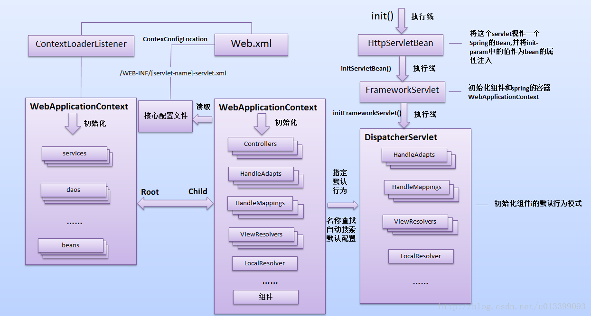
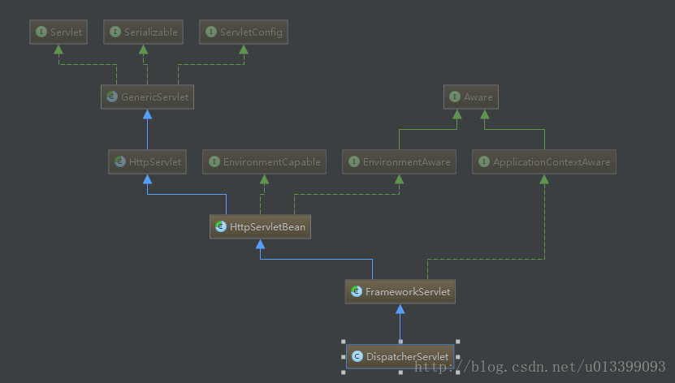
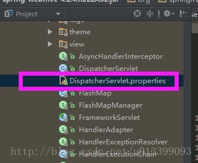
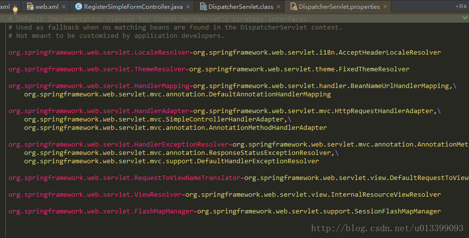

摘自：`https://blog.csdn.net/u013399093/article/details/54889879`

#### Spring DispatcherServlet初始化详解（应用上下文的初始化）

Spring的初始化主线如下： 




DispatcherServlet的继承体系结构图如下: 




这个继承体系结构中HttpServletBean和FrameworkServlet是 对spring的支持。 
HttpServletBean 是 Spring 对于 Servlet 最低层次的抽象。在这一层抽象中，Spring 会将这个Servlet 视作是一个 Spring 的 bean，并将 init-param 中的值作为 bean 的属性注入进来。 
FrameworkServlet 是一个在其内部初始化了一个 Spring 的容器（WebApplicationContext ）并暴露了相关的操作接口， 因而继承自 FrameworkServlet 的 DispatcherServlet ， 也就直接拥有了与 WebApplicationContext 进行 通信的能力。DispatcherServlet的继承体系架起了 DispatcherServlet与 Spring 容器进行沟通的桥梁。

从图中可以看出HttpServletBean继承HttpServlet，因此在Web容器启动时将调用它的init方法，该初始化方法的主要作用： 
1. 将Servlet初始化参数（init-param）设置到该组件上（如contextAttribute、contextClass、namespace、contextConfigLocation），通过BeanWrapper简化设值过程，方便后续使用； 
2. 提供给子类初始化扩展点，initServletBean()，该方法由FrameworkServlet覆盖。


```java
public abstract class HttpServletBean extends HttpServlet implements EnvironmentAware{
    @Override
    public final void init() throws ServletException {
    //省略部分代码
    //1、如下代码的作用是将Servlet初始化参数设置到该组件上
    //如contextAttribute、contextClass、namespace、contextConfigLocation；
            try {
                    PropertyValues pvs = new ServletConfigPropertyValues(getServletConfig(), this.requiredProperties);
                    BeanWrapper bw = PropertyAccessorFactory.forBeanPropertyAccess(this);
                    ResourceLoader resourceLoader = new ServletContextResourceLoader(getServletContext());
                    bw.registerCustomEditor(Resource.class, new ResourceEditor(resourceLoader, this.environment));
                    initBeanWrapper(bw);
                    bw.setPropertyValues(pvs, true);
            }
            catch (BeansException ex) {

            }
            //2、提供给子类初始化的扩展点，该方法由FrameworkServlet覆盖
            initServletBean();
            if (logger.isDebugEnabled()) {
                logger.debug("Servlet '" + getServletName() + "' configured successfully");
            }
    }
    //…………省略其他代码
}
```

FrameworkServlet继承HttpServletBean，通过initServletBean()进行Web上下文初始化，该方法主要覆盖以下两件事情： 初始化web上下文； 提供给子类初始化扩展点；

```java
public abstract class FrameworkServlet extends HttpServletBean {
    @Override
    protected final void initServletBean() throws ServletException {
    //省略部分代码
    try {
    //1、初始化Web上下文
        this.webApplicationContext = initWebApplicationContext();
        //2、提供给子类初始化的扩展点
        initFrameworkServlet();
    }
    //省略部分代码
    }
}

protected WebApplicationContext initWebApplicationContext() {
    //ROOT上下文（ContextLoaderListener加载的）
    WebApplicationContext rootContext =
    WebApplicationContextUtils.getWebApplicationContext(getServletContext());
    WebApplicationContext wac = null;
    if (this.webApplicationContext != null) {
    // 1、在创建该Servlet注入的上下文
        wac = this.webApplicationContext;
        if (wac instanceof ConfigurableWebApplicationContext) {
            ConfigurableWebApplicationContext cwac = (ConfigurableWebApplicationContext) wac;
            if (!cwac.isActive()) {
                if (cwac.getParent() == null) {
                    cwac.setParent(rootContext);
                }
            configureAndRefreshWebApplicationContext(cwac);
            }
        }
    }
    if (wac == null) {
        //2、查找已经绑定的上下文
        wac = findWebApplicationContext();
    }
    if (wac == null) {
        //3、如果没有找到相应的上下文，并指定父亲为ContextLoaderListener
        wac = createWebApplicationContext(rootContext);
    }
    if (!this.refreshEventReceived) {
        //4、刷新上下文（执行一些初始化）
        onRefresh(wac);
    }
    if (this.publishContext) {
        // Publish the context as a servlet context attribute.
        String attrName = getServletContextAttributeName();
        getServletContext().setAttribute(attrName, wac);
        //省略部分代码
    }
    return wac;
    }
```

从initWebApplicationContext（）方法可以看出，基本上如果ContextLoaderListener加载了上下文将作为根上下文（DispatcherServlet的父容器）。最后调用了onRefresh()方法执行容器的一些初始化，这个方法由子类实现，来进行扩展。DispatcherServlet继承FrameworkServlet，并实现了onRefresh()方法提供一些前端控制器相关的配置


```java
 protected void onRefresh(ApplicationContext context) {
    this.initStrategies(context);
}

protected void initStrategies(ApplicationContext context) {
    this.initMultipartResolver(context);
    this.initLocaleResolver(context);
    this.initThemeResolver(context);
    this.initHandlerMappings(context);
    this.initHandlerAdapters(context);
    this.initHandlerExceptionResolvers(context);
    this.initRequestToViewNameTranslator(context);
    this.initViewResolvers(context);
    this.initFlashMapManager(context);
}
```

从如上代码我们可以看出，整个DispatcherServlet初始化的过程，具体主要做了如下两件事情： 
1、初始化Spring Web MVC使用的Web上下文，并且可能指定父容器为（ContextLoaderListener加载了根上下 
文）； 
2、初始化DispatcherServlet使用的策略，如HandlerMapping、HandlerAdapter等。

DispatcherServlet的默认配置在DispatcherServlet.properties文件中，DispatcherServlet.properties的位置在与DispatcherServlet同一个包中当Spring配置文件中没有指定配置时使用的默认策略。



具体默认配置内容如下： 




从如上配置可以看出DispatcherServlet在启动时会自动注册这些特殊的Bean，无需我们注册，如果我们设置注册了，默认的将不会注册。

DispatcherServlet默认使用WebApplicationContext作为上下文，因此我们来看一下该上下文中特殊的Bean： 
1、Controller：处理器/页面控制器，做的是MVC中的C的事情，但控制逻辑转移到前端控制器了，用于对请求进行处理； 
2、HandlerMapping：请求到处理器的映射，如果映射成功返回一个HandlerExecutionChain对象（包含一个Handler处理器（页面控制器）对象、多个HandlerInterceptor拦截器）对象；如BeanNameUrlHandlerMapping将URL与Bean名字映射，映射成功的Bean就是此处的处理器； 
3、HandlerAdapter：HandlerAdapter将会把处理器包装为适配器，从而支持多种类型的处理器，即适配器设计模式的应用，从而很容易支持很多类型的处理器；如SimpleControllerHandlerAdapter将对实现了Controller接口的Bean进行适配，并且掉处理器的handleRequest方法进行功能处理； 
4、ViewResolver：ViewResolver将把逻辑视图名解析为具体的View，通过这种策略模式，很容易更换其他视图技术；如InternalResourceViewResolver将逻辑视图名映射为jsp视图； 
5、LocalResover：本地化解析，因为Spring支持国际化，因此LocalResover解析客户端的Locale信息从而方便进行国际化； 
6、ThemeResovler：主题解析，通过它来实现一个页面多套风格，即常见的类似于软件皮肤效果； 
7、MultipartResolver：文件上传解析，用于支持文件上传； 
8、HandlerExceptionResolver：处理器异常解析，可以将异常映射到相应的统一错误界面，从而显示用户友好的界面（而不是给用户看到具体的错误信息）； 
9、RequestToViewNameTranslator：当处理器没有返回逻辑视图名等相关信息时，自动将请求URL映射为逻辑视图名； 
10、FlashMapManager：用于管理FlashMap的策略接口，FlashMap用于存储一个请求的输出，当进入另一个请求时作为该请求的输入，通常用于重定向场景。
