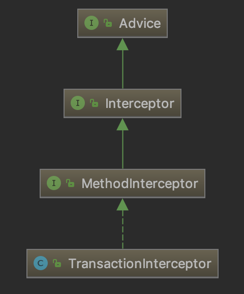
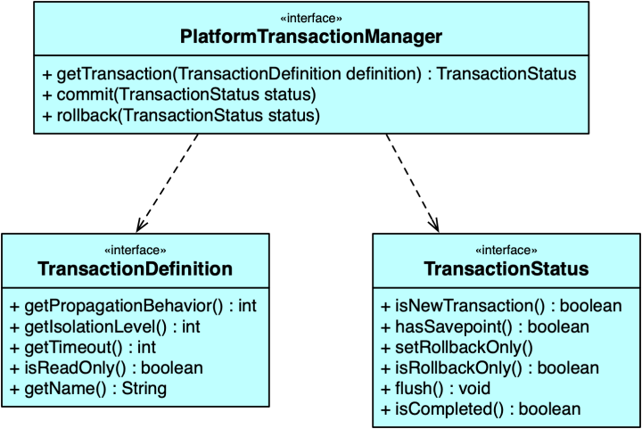
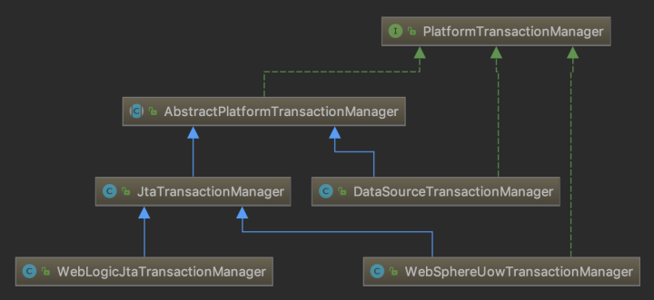
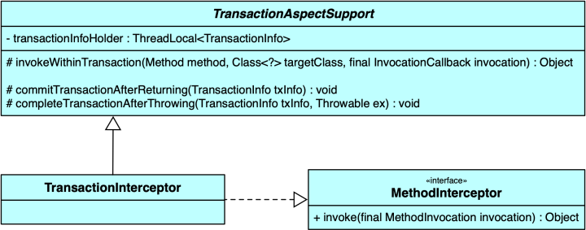
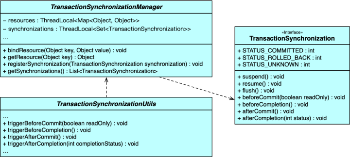

摘自：`https://zhuanlan.zhihu.com/p/54067384`

## **Spring事务原理一探**

概括来讲，事务是一个由有限操作集合组成的逻辑单元。事务操作包含两个目的，数据一致以及操作隔离。数据一致是指事务提交时保证事务内的所有操作都成功完成，并且更改永久生效；事务回滚时，保证能够恢复到事务执行之前的状态。操作隔离则是指多个同时执行的事务之间应该相互独立，互不影响。

事务是一个比较广泛的概念，事务管理资源除了我们熟知的数据库外，还可以包含消息队列、文件系统等。当然，一般来说，我们说的事务单指“数据库事务”。接下来我们会以MySQL数据库、Spring声明式事务为主要研究对象，但是很多事务概念、接口抽象和实现方式同时适用于其他情况。

## **事务属性和行为**

**ACID属性**

提到事务，不可避免需要涉及到事务的ACID属性：

- 原子性（Atomicity）：事务作为一个整体被执行，包含在其中的对数据库的操作要么全部被执行，要么都不执行。
- 一致性（Consistency）：事务应确保数据库的状态从一个一致状态转变为另一个一致状态。一致状态的含义是数据库中的数据应满足完整性约束。
- 隔离性（Isolation）：多个事务并发执行时，一个事务的执行不应影响其他事务的执行。
- 持久性（Durability）：已被提交的事务对数据库的修改应该永久保存在数据库中。

我们将严格遵循ACID属性的事务称为**刚性事务**。与之相对，期望最终一致性，在事务执行的中间状态允许暂时不遵循ACID属性的事务称为**柔性事务**，可参考[传统事务与柔性事务](https://link.zhihu.com/?target=https%3A//www.jianshu.com/p/ab1a1c6b08a1)，柔性事务的使用涉及到**分布式事务**方案，可以后续扩展，这里我们先将注意集中在事务实现原理上。

**隔离级别**

根据SQL92标准，MySQL的InnoDB引擎提供四种**隔离级别**（即ACID中的I）：**读未提交（READ UNCOMMITTED）、读已提交（READ COMMITTED）、可重复读（REPEATABLE READ）和串行化（SERIALIZABLE）**，InnoDB默认的隔离级别是`REPEATABLE READ`，其可避免*脏读*和*不可重复读*，但不能避免*幻读*，需要指出的是，InnoDB引擎的多版本并发控制机制（MVCC）并没有完全避免*幻读*，关于该问题以及隔离级别说明，可参考[MySQL的InnoDB的幻读问题](https://link.zhihu.com/?target=http%3A//blog.sina.com.cn/s/blog_499740cb0100ugs7.html)。

**传播机制**

Spring针对方法嵌套调用时事务的创建行为定义了七种**事务传播机制**，分别是PROPAGATION_REQUIRED、PROPAGATION_SUPPORT、PROPAGATION_MANDATORY、PROPAGATION_REQUIRES_NEW、PROPAGATION_NOT_SUPPORTED、PROPAGATION_NEVER以及PROPAGATION_NESTED，基本上从字面意思就能知道每种传播机制各自的行为表现，Spring默认的事务传播机制是`PROPAGATION_REQUIRED`，即如果当前存在事务，则使用当前事务，否则创建新的事务。详情可参考[Spring事务传播行为](https://link.zhihu.com/?target=https%3A//juejin.im/post/5ae9639af265da0b926564e7)。

**事务行为**

事务的行为包括事务开启、事务提交和事务回滚。InnoDB所有的用户SQL执行都在事务控制之内，在默认情况下，**autocommit**设置为`true`，单条SQL执行成功后，MySQL会自动提交事务，或者如果SQL执行出错，则根据异常类型执行事务提交或者回滚。可以使用`START TRANSACTION`（SQL标准）或者`BEGIN`开启事务，使用`COMMIT`和`ROLLBACK`提交和回滚事务；也可以通过设置autocommit属性来控制事务行为，当设置autocommit为`false`时，其后执行的多条SQL语句将在一个事务内，直到执行`COMMIT`或者`ROLLBACK`事务才会提交或者回滚。

## **AOP增强**

Spring使用**AOP**（面向切面编程）来实现**声明式事务**，后续在讲Spring事务具体实现的时候会详细说明，关于AOP的概念可参考[Spring AOP概念理解（通俗易懂）](https://link.zhihu.com/?target=https%3A//blog.csdn.net/qukaiwei/article/details/50367761)，这里不再细说。说下**动态代理**和**AOP增强**。

动态代理是Spring实现AOP的默认方式，分为两种：**JDK动态代理**和**CGLIB动态代理**。JDK动态代理面向接口，通过反射生成目标代理接口的匿名实现类；CGLIB动态代理则通过继承，使用字节码增强技术（或者`objenesis`类库）为目标代理类生成代理子类。Spring默认对接口实现使用JDK动态代理，对具体类使用CGLIB，同时也支持配置全局使用CGLIB来生成代理对象。

我们在切面配置中会使用到`@Aspect`注解，这里用到了**Aspectj**的切面表达式。Aspectj是java语言实现的一个AOP框架，使用静态代理模式，拥有完善的AOP功能，与Spring AOP互为补充。Spring采用了Aspectj强大的切面表达式定义方式，但是默认情况下仍然使用动态代理方式，并未使用Aspectj的编译器和织入器，当然也支持配置使用Aspectj静态代理替代动态代理方式。Aspectj功能更强大，比方说它支持对字段、POJO类进行增强，与之相对，Spring只支持对Bean方法级别进行增强。

Spring对方法的增强有五种方式：

- 前置增强（`org.springframework.aop.BeforeAdvice`）：在目标方法执行之前进行增强；
- 后置增强（`org.springframework.aop.AfterReturningAdvice`）：在目标方法执行之后进行增强；
- 环绕增强（`org.aopalliance.intercept.MethodInterceptor`）：在目标方法执行前后都执行增强；
- 异常抛出增强（`org.springframework.aop.ThrowsAdvice`）：在目标方法抛出异常后执行增强；
- 引介增强（`org.springframework.aop.IntroductionInterceptor`）：为目标类添加新的方法和属性。

声明式事务的实现就是通过环绕增强的方式，在目标方法执行之前开启事务，在目标方法执行之后提交或者回滚事务，事务拦截器的继承关系图可以体现这一点：



## Spring事务抽象

统一一致的事务抽象是Spring框架的一大优势，无论是全局事务还是本地事务，JTA、JDBC、Hibernate还是JPA，Spring都使用统一的编程模型，使得应用程序可以很容易地在全局事务与本地事务，或者不同的事务框架之间进行切换。下图是Spring事务抽象的核心类图：



接口`PlatformTransactionManager`定义了事务操作的行为，其依赖`TransactionDefinition`和`TransactionStatus`接口，其实大部分的事务属性和行为我们以MySQL数据库为例已经有过了解，这里再对应介绍下。

- `PlatformTransactionManager`：事务管理器
- `getTransaction`方法：事务获取操作，根据事务属性定义，获取当前事务或者创建新事物；
- `commit`方法：事务提交操作，注意这里所说的提交并非直接提交事务，而是根据当前事务状态执行提交或者回滚操作；
- `rollback`方法：事务回滚操作，同样，也并非一定直接回滚事务，也有可能只是标记事务为只读，等待其他调用方执行回滚。
- `TransactionDefinition`：事务属性定义
- `getPropagationBehavior`方法：返回事务的传播属性，默认是`PROPAGATION_REQUIRED`；
- `getIsolationLevel`方法：返回事务隔离级别，事务隔离级别只有在创建新事务时才有效，也就是说只对应传播属性`PROPAGATION_REQUIRED`和`PROPAGATION_REQUIRES_NEW`；
- `getTimeout`方法：返回事务超时时间，以秒为单位，同样只有在创建新事务时才有效；
- `isReadOnly`方法：是否优化为只读事务，支持这项属性的事务管理器会将事务标记为只读，只读事务不允许有写操作，不支持只读属性的事务管理器需要忽略这项设置，这一点跟其他事务属性定义不同，针对其他不支持的属性设置，事务管理器应该抛出异常。
- `getName`方法：返回事务名称，声明式事务中默认值为“类的完全限定名.方法名”。
- `TransactionStatus`：当前事务状态
- `isNewTransaction`方法：当前方法是否创建了新事务（区别于使用现有事务以及没有事务）；
- `hasSavepoint`方法：在嵌套事务场景中，判断当前事务是否包含保存点；
- `setRollbackOnly`和`isRollbackOnly`方法：只读属性设置（主要用于标记事务，等待回滚）和查询；
- `flush`方法：刷新底层会话中的修改到数据库，一般用于刷新如Hibernate/JPA的会话，是否生效由具体事务资源实现决定；
- `isCompleted`方法：判断当前事务是否已完成（已提交或者已回滚）。

部分Spring包含的对`PlatformTransactionManager`的实现类如下图所示：



`AbstractPlatformTransactionManager`抽象类实现了Spring事务的标准流程，其子类`DataSourceTransactionManager`是我们使用较多的JDBC单数据源事务管理器，而`JtaTransactionManager`是JTA（Java Transaction API）规范的实现类，另外两个则分别是JavaEE容器*WebLogic*和*WebSphere*的JTA事务管理器的具体实现。

## Spring事务切面

*之前提到，**Spring采用AOP来实现声明式事务**，那么事务的AOP切面是如何织入的呢？这一点涉及到AOP动态代理对象的生成过程*。

代理对象生成的核心类是`AbstractAutoProxyCreator`，实现了`BeanPostProcessor`接口，会在**Bean初始化完成之后**，通过`postProcessAfterInitialization`方法生成代理对象，关于`BeanPostProcessor`在Bean生命周期中的作用，可参考[一些常用的Spring扩展接口](https://link.zhihu.com/?target=https%3A//www.cnblogs.com/xrq730/p/5721366.html)。

看一下`AbstractAutoProxyCreator`类的核心代码，主要关注三个方法：postProcessAfterInitialization、wrapIfNecessary和createProxy，为了突出核心流程，以注释代替了部分代码的具体实现，后续的源码分析也采用相同的处理。

```java
// AbstractAutoProxyCreator.class
@Override
public Object postProcessAfterInitialization(Object bean, String beanName) throws BeansException {
    if (bean != null) {
        Object cacheKey = getCacheKey(bean.getClass(), beanName);
        if (!this.earlyProxyReferences.contains(cacheKey)) {
            // 创建代理对象
            return wrapIfNecessary(bean, beanName, cacheKey);
        }
    }
    return bean;
}

protected Object wrapIfNecessary(Object bean, String beanName, Object cacheKey) {
    // 参数检查，跳过已经执行过代理对象生成，或者已知的不需要生成代理对象的Bean
    ...

    // Create proxy if we have advice.
    // 查询当前Bean所有的AOP增强配置，最终是通过AOPUtils工具类实现
    Object[] specificInterceptors = getAdvicesAndAdvisorsForBean(bean.getClass(), beanName, null);
    if (specificInterceptors != DO_NOT_PROXY) {
        this.advisedBeans.put(cacheKey, Boolean.TRUE);
        // 执行AOP织入，创建代理对象
        Object proxy = createProxy(
                bean.getClass(), beanName, specificInterceptors, new SingletonTargetSource(bean));
        this.proxyTypes.put(cacheKey, proxy.getClass());
        return proxy;
    }

    this.advisedBeans.put(cacheKey, Boolean.FALSE);
    return bean;
}

protected Object createProxy(Class<?> beanClass, String beanName, Object[] specificInterceptors, TargetSource targetSource) {

    if (this.beanFactory instanceof ConfigurableListableBeanFactory) {
        AutoProxyUtils.exposeTargetClass((ConfigurableListableBeanFactory) this.beanFactory, beanName, beanClass);
    }

    // 实例化代理工厂类
    ProxyFactory proxyFactory = new ProxyFactory();
    proxyFactory.copyFrom(this);

    // 当全局使用动态代理时，设置是否需要对目标Bean强制使用CGLIB动态代理
    ...

    // 构建AOP增强顾问，包含框架公共增强和应用程序自定义增强
    // 设置proxyFactory属性，如增强、目标类、是否允许变更等
    ...

    // 创建代理对象
    return proxyFactory.getProxy(getProxyClassLoader());
}
```

最后是通过调用`ProxyFactory#getProxy(java.lang.ClassLoader)`方法来创建代理对象：

```java
// ProxyFactory.class
public Object getProxy(ClassLoader classLoader) {
    return createAopProxy().getProxy(classLoader);
}

// ProxyFactory父类ProxyCreatorSupport.class
protected final synchronized AopProxy createAopProxy() {
    if (!this.active) {
        activate();
    }
    return getAopProxyFactory().createAopProxy(this);
}

public ProxyCreatorSupport() {
    this.aopProxyFactory = new DefaultAopProxyFactory();
}
```

`ProxyFactory`的父类构造器实例化了`DefaultAopProxyFactory`类，从其源代码我们可以看到Spring动态代理方式选择策略的实现：如果目标类optimize，proxyTargetClass属性设置为`true`或者未指定需要代理的接口，**则使用CGLIB生成代理对象，否则使用JDK动态代理**。

```java
public class DefaultAopProxyFactory implements AopProxyFactory, Serializable {
    @Override
    public AopProxy createAopProxy(AdvisedSupport config) throws AopConfigException {
        // 如果optimize，proxyTargetClass属性设置为true或者未指定代理接口，则使用CGLIB生成代理对象
        if (config.isOptimize() || config.isProxyTargetClass() || hasNoUserSuppliedProxyInterfaces(config)) {
            Class<?> targetClass = config.getTargetClass();
            // 参数检查，targetClass为空抛出异常
            ...
            // 目标类本身是接口或者代理对象，仍然使用JDK动态代理
            if (targetClass.isInterface() || Proxy.isProxyClass(targetClass)) {
                return new JdkDynamicAopProxy(config);
            }
            // Objenesis是一个可以不通过构造器创建子类的java工具类库
            // 作为Spring 4.0后CGLIB的默认实现
            return new ObjenesisCglibAopProxy(config);
        }
        else {
            // 否则使用JDK动态代理
            return new JdkDynamicAopProxy(config);
        }
    }
    ...
}
```

## Spring事务拦截

我们已经了解了AOP切面织入生成代理对象的过程，**当Bean方法通过代理对象调用时，会触发对应的AOP增强拦截器，前面提到声明式事务是一种环绕增强**，对应接口为`MethodInterceptor`，事务增强对该接口的实现为`TransactionInterceptor`，类图如下：



事务拦截器`TransactionInterceptor`在`invoke`方法中，通过调用父类`TransactionAspectSupport`的`invokeWithinTransaction`方法进行事务处理，该方法支持声明式事务和编程式事务。

```java
// TransactionInterceptor.class
@Override
public Object invoke(final MethodInvocation invocation) throws Throwable {
    // 获取targetClass
    ...

    // Adapt to TransactionAspectSupport's invokeWithinTransaction...
    return invokeWithinTransaction(invocation.getMethod(), targetClass, new InvocationCallback() {
        @Override
        public Object proceedWithInvocation() throws Throwable {
            // 实际执行目标方法
            return invocation.proceed();
        }
    });
}

// TransactionInterceptor父类TransactionAspectSupport.class
protected Object invokeWithinTransaction(Method method, Class<?> targetClass, final InvocationCallback invocation)
        throws Throwable {

    // If the transaction attribute is null, the method is non-transactional.
    // 查询目标方法事务属性、确定事务管理器、构造连接点标识（用于确认事务名称）
    final TransactionAttribute txAttr = getTransactionAttributeSource().getTransactionAttribute(method, targetClass);
    final PlatformTransactionManager tm = determineTransactionManager(txAttr);
    final String joinpointIdentification = methodIdentification(method, targetClass, txAttr);

    if (txAttr == null || !(tm instanceof CallbackPreferringPlatformTransactionManager)) {
        // 事务获取
        TransactionInfo txInfo = createTransactionIfNecessary(tm, txAttr, joinpointIdentification);
        Object retVal = null;
        try {
            // 通过回调执行目标方法
            retVal = invocation.proceedWithInvocation();
        }
        catch (Throwable ex) {
            // 目标方法执行抛出异常，根据异常类型执行事务提交或者回滚操作
            completeTransactionAfterThrowing(txInfo, ex);
            throw ex;
        }
        finally {
            // 清理当前线程事务信息
            cleanupTransactionInfo(txInfo);
        }
        // 目标方法执行成功，提交事务
        commitTransactionAfterReturning(txInfo);
        return retVal;
    } else {
        // 带回调的事务执行处理，一般用于编程式事务
        ...
    }
}
```

在讲Spring事务抽象时，有提到事务抽象的核心接口为`PlatformTransactionManager`，它负责管理事务行为，包括事务的获取、提交和回滚。在`invokeWithinTransaction`方法中，我们可以看到`createTransactionIfNecessary`、`commitTransactionAfterReturning`和`completeTransactionAfterThrowing`都是针对该接口编程，并不依赖于特定事务管理器，这里是对Spring事务抽象的实现。

```java
//TransactionAspectSupport.class
protected TransactionInfo createTransactionIfNecessary(
        PlatformTransactionManager tm, TransactionAttribute txAttr, final String joinpointIdentification) {
    ...
    TransactionStatus status = null;
    if (txAttr != null) {
        if (tm != null) {
            // 获取事务
            status = tm.getTransaction(txAttr);
            ...
}

protected void commitTransactionAfterReturning(TransactionInfo txInfo) {
    if (txInfo != null && txInfo.hasTransaction()) {
        ...
        // 提交事务
        txInfo.getTransactionManager().commit(txInfo.getTransactionStatus());
    }
}

protected void completeTransactionAfterThrowing(TransactionInfo txInfo, Throwable ex) {
    if (txInfo != null && txInfo.hasTransaction()) {
        ...
        if (txInfo.transactionAttribute.rollbackOn(ex)) {
            try {
                // 异常类型为回滚异常，执行事务回滚
                txInfo.getTransactionManager().rollback(txInfo.getTransactionStatus());
            }
            ...
        } else {
            try {
                // 异常类型为非回滚异常，仍然执行事务提交
                txInfo.getTransactionManager().commit(txInfo.getTransactionStatus());
            }
            ...
}

protected final class TransactionInfo {
    private final PlatformTransactionManager transactionManager;
    ...
```

另外，在获取事务时，`AbstractPlatformTransactionManager#doBegin`方法负责开启新事务，在`DataSourceTransactionManager`有如下代码：

```java
@Override
protected void doBegin(Object transaction, TransactionDefinition definition) {
    // 获取数据库连接con
    ...
    if (con.getAutoCommit()) {
        txObject.setMustRestoreAutoCommit(true);
        if (logger.isDebugEnabled()) {
            logger.debug("Switching JDBC Connection [" + con + "] to manual commit");
        }
        con.setAutoCommit(false);
    }
    ...
}
```

这里才真正开启了数据库事务。

## Spring事务同步

提到事务传播机制时，我们经常提到一个条件“如果当前已有事务”，那么Spring是如何知道当前是否已经开启了事务呢？在`AbstractPlatformTransactionManager`中是这样做的：

```java
// AbstractPlatformTransactionManager.class
@Override
public final TransactionStatus getTransaction(TransactionDefinition definition) throws TransactionException {
    Object transaction = doGetTransaction();
    // 参数为null时构造默认值
    ...
    if (isExistingTransaction(transaction)) {
        // Existing transaction found -> check propagation behavior to find out how to behave.
        return handleExistingTransaction(definition, transaction, debugEnabled);
    }
    ...

// 获取当前事务对象
protected abstract Object doGetTransaction() throws TransactionException;

// 判断当前事务对象是否包含活跃事务
protected boolean isExistingTransaction(Object transaction) throws TransactionException {
    return false;
}
```

注意`getTransaction`方法是`final`的，无法被子类覆盖，保证了获取事务流程的一致和稳定。抽象方法`doGetTransaction`获取当前事务对象，方法`isExistingTransaction`判断当前事务对象是否存在活跃事务，具体逻辑由特定事务管理器实现，看下我们使用最多的`DataSourceTransactionManager`对应的实现：

```java
// DataSourceTransactionManager.class
@Override
protected Object doGetTransaction() {
    DataSourceTransactionObject txObject = new DataSourceTransactionObject();
    txObject.setSavepointAllowed(isNestedTransactionAllowed());
    ConnectionHolder conHolder =
            (ConnectionHolder) TransactionSynchronizationManager.getResource(this.dataSource);
    txObject.setConnectionHolder(conHolder, false);
    return txObject;
}

@Override
protected boolean isExistingTransaction(Object transaction) {
    DataSourceTransactionObject txObject = (DataSourceTransactionObject) transaction;
    return (txObject.hasConnectionHolder() && txObject.getConnectionHolder().isTransactionActive());
}
```

可以看到，获取当前事务对象时，使用了`TransactionSynchronizationManager#getResource`方法，类图如下：



`TransactionSynchronizationManager`通过`ThreadLocal`对象在当前线程记录了`resources`和`synchronizations`属性。`resources`是一个HashMap，用于记录当前参与事务的事务资源，方便进行事务同步，在`DataSourceTransactionManager`的例子中就是以`dataSource`作为key，保存了数据库连接，这样在同一个线程中，不同的方法调用就可以通过`dataSource`获取相同的数据库连接，从而保证所有操作在一个事务中进行。`synchronizations`属性是一个`TransactionSynchronization`对象的集合，`AbstractPlatformTransactionManager`类中定义了事务操作各个阶段的调用流程，以事务提交为例：

```java
// AbstractPlatformTransactionManager.class
private void processCommit(DefaultTransactionStatus status) throws TransactionException {
    try {
        boolean beforeCompletionInvoked = false;
        try {
            prepareForCommit(status);
            triggerBeforeCommit(status);
            triggerBeforeCompletion(status);
            ....
            else if (status.isNewTransaction()) {
                // 记录日志
                ...
                doCommit(status);
            }
            ...
        // 事务调用异常处理
        ...
        try {
            triggerAfterCommit(status);
        }
        finally {
            triggerAfterCompletion(status, TransactionSynchronization.STATUS_COMMITTED);
        }
    }
}
```

我们可以看到，有很多*trigger*前缀的方法，这些方法用于在事务操作的各个阶段触发回调，从而可以精确控制在事务执行的不同阶段所要执行的操作，这些回调实际上都通过`TransactionSynchronizationUtils`来实现，它会遍历`TransactionSynchronizationManager#synchronizations`集合中的`TransactionSynchronization`对象，然后分别触发集合中各个元素对应方法的调用。例如：

```java
TransactionSynchronizationManager.registerSynchronization(new TransactionSynchronizationAdapter() {
    @Override
    public void afterCommit() {
        // do something after commit
    }
});
```

这段代码就在当前线程的事务`synchronizations`属性中，添加了一个自定义同步类，如果当前存在事务，那么在事务管理器执行事务提交之后，就会触发`afterCommit`方法，可以通过这种方式在事务执行的不同阶段自定义一些操作。

## 具体使用出错案例

摘自：`https://www.cnblogs.com/yougewe/p/7466677.html`

事务的作用，使我们操作能够连贯起来。而spring则是提供了一个更简单的方法，只要使用 @Transactional 一个注解，就可以保证操作的连贯性了。

 在最外面的方法中，有一个@Transactional 的注解，当有抛出异常时，则进行回滚操作：

```java
@Transactional(readOnly = false, rollbackFor = Throwable.class, isolation = Isolation.REPEATABLE_READ)
```

原本这个方法运行得好好的，但是有一天，我们需要在这个方法里添加一个新业务操作，而且这个业务操作是不要求回滚的，类似于做日志记录一类的。怎么办 ?

由于业务的独特性，我能够快速想到的是，在这个类里面加一个private方法，然后直接去调用就ok了，如果说还是考虑到回滚的话，我也快速想到 @Transactional 的NOT_SUPPORTED传播特性，如：

```java
@Transactional(propagation = Propagation.NOT_SUPPORTED)
private void doMyExJob(UserDebitCardBean userDebitCard) {
    System.out.println("do my job...");
    //do my job...
}
```

这看起来很合理，没毛病。然而就是运行不起来，只要外面调用的方法一抛出异常，那么这个新方法的数据操作将会被回滚。到底哪里出了问题？？？仔细查了下资料，原来 @Transactional 注解由于原理决定了他只能作用于public方法中，而这里改为private，就完全被忽略无视了。OK，改呗：

```java
@Transactional(propagation = Propagation.NOT_SUPPORTED)
public void doMyExJob(UserDebitCardBean userDebitCard) {
    System.out.println("do my job...");
    //do my job...
}
```

感觉应该好了，然而并没有。网上看到一哥们说，还必须要将方法写到另一个类中，而且要通过spring的注入方式进行调用，才可以。好吧，那我就按照他的来，结果真的成功了。

```java
//在接口中进行了定义，能够注入
@Override 
@Transactional(propagation = Propagation.NOT_SUPPORTED)
public void doMyExJob(UserDebitCardBean userDebitCard) {
    System.out.println("do my job...");
    //do my job...
}
```


总算可以了，在赶时间的时候，能够解决问题的，就是好方法。至此，问题解决。1. 使用public访求；2. 写在接口类中（我们在注入的时候一般是按接口注入的，所以这里方法需要在接口里面定义），可被调用； 3. 使用注入的方式进行该方法的执行。

下面我们来看看spring事务的讲解：
@Transactional注解可以标注在类和方法上，也可以标注在定义的接口和接口方法上。
如果我们在接口上标注@Transactional注解，会留下这样的隐患：因为注解不能被继承，所以业务接口中标注的@Transactional注解不会被业务实现类继承。所以可能会出现不启动事务的情况。所以，spring建议我们将@Transaction注解在实现类上。在方法上的@Transactional注解会覆盖掉类上的@Transactional。

注意：

@Transactional 可以作用于接口、接口方法、类以及类方法上。当作用于类上时，该类的所有 public 方法将都具有该类型的事务属性，同时，我们也可以在方法级别使用该标注来覆盖类级别的定义。

虽然 @Transactional 注解可以作用于接口、接口方法、类以及类方法上，但是 Spring 建议不要在接口或者接口方法上使用该注解，因为这只有在使用基于接口的代理时它才会生效。另外， @Transactional 注解应该只被应用到 public 方法上，这是由 Spring AOP 的本质决定的。如果你在 protected、private 或者默认可见性的方法上使用 @Transactional 注解，这将被忽略，也不会抛出任何异常。

默认情况下，只有来自外部的方法调用才会被AOP代理捕获，也就是，类内部方法调用本类内部的其他方法并不会引起事务行为，即使被调用方法使用@Transactional注解进行修饰。