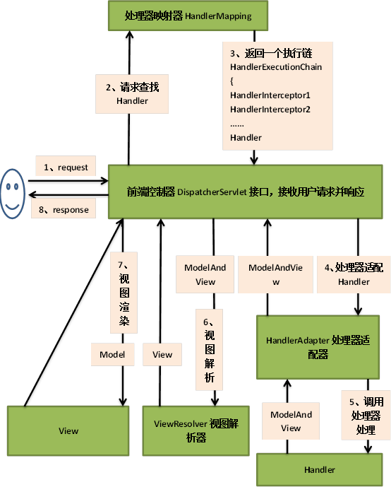
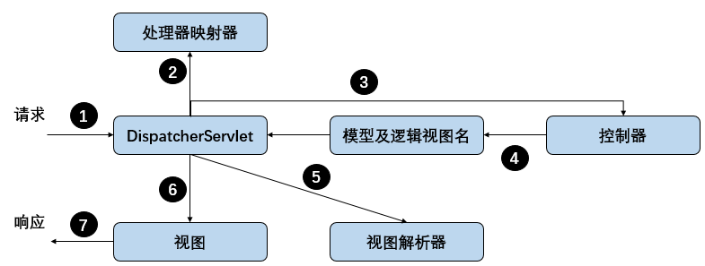

#一、Spring MVC起步
##1.1 跟踪Spring MVC的请求




在请求离开浏览器时（步骤`1`），会带有用户所请求内容的信息，至少会包含请求的`URL`，但是还可能带有其他信息。

* 请求的第一站是前端控制器`DispatcherServlet`。`SpringMVC`所有的请求都会通过这个前端控制器，前端控制器是常用的`Web`应用程序模式，在这里是一个单实例的`Servlet`将请求委托给应用程序的其他组件来执行实际的处理。

* **`DispatcherServlet`**的任务是将请求转发给控制器（`Controller`）。为了达到此目的，`DispatcherServlet`需要查询一个或多个处理器映射器（`handler mapping`）（步骤`2`）来确定请求所需要的控制器是哪一个（因为控制器会有很多），处理器映射器会根据请求所携带的`URL`信息进行决策。

* 一旦选择了合适的控制器，`DispatcherServlet`会将请求发送给选中的控制器（步骤`3`）。到了控制器，请求会卸下其负载（用户 提交的信息）并耐心等待控制器处理这些信息。

* 控制器在完成逻辑处理后，通常会产生一些信息，这些信息需要返回给用户并在浏览器上显示。这些信息被称为模型（`model`）。不过，仅仅给用户返回原始的信息是不够的——这些信息需要以用户友好的方式进行格式化，一般会是`HTML`。所以，信息需要发送给一个视图（`view`），通常是`JSP`。

* 控制器做的最后一件事就是将模型数据打包，并且标识出用于渲染输出的视图名。然后发送回`DispatcherServlet`（步骤`4`）。

* 而返回给`DispatcherServlet`的视图名并不直接表示某个特定的`JSP`，可能并不是`JSP`。相反，它仅仅传递的是一个逻辑名称，这个名称用来查找产生结果的真正视图。这就需要使用视图解析器对逻辑视图名进行解析（步骤`5`）。

* 解析完之后就会找到相关视图对数据进行渲染（步骤`6`），在这里交付模型数据，之后对用户响应（步骤`7`）。


##1.2 搭建Spring MVC
###1.2.1 配置DispatcherServlet
按照传统方式，像`DispatcherServlet`这样的`Servlet`会配置在`web.xml`文件中。但是借助`Servlet3.1`和`Spring3.1`的功能增强，这里使用`Java`将`DispatcherServlet`配置在`Servlet`容器中。

```java
package spittr.config;
import org.springframework.web.servlet.support.AbstractAnnotationConfigDispatcherServletInitializer;
import spittr.web.WebConfig;

public class SpitterWebInitializer extends AbstractAnnotationConfigDispatcherServletInitializer {
  
  @Override
  protected Class<?>[] getRootConfigClasses() {
    return new Class<?>[] { RootConfig.class };
  }

  @Override
  protected Class<?>[] getServletConfigClasses() {
    return new Class<?>[] { WebConfig.class };
  }

  @Override
  protected String[] getServletMappings() {
    return new String[] { "/" };
  }
}
```

**说明：**
* 这里我们创建的应用的名称为`Spittr`。要理解上述代码是如何工作的，可能只需要知道扩展`AbstractAnnotationConfigDispatcherServletInitializer`的任意类都会自动地配置`DispatcherServlet`和`Spring`应用上下文，`Spring`的应用上下文位于应用程序的`Servlet`上下文之中。

* **`AbstractAnnotationConfigDispatcherServletInitializer`**剖析：
在`Servlet3.0`环境中，容器会在类路径中查找实现了`javax.servlet.ServletContainerInitializer`接口的类，如果能发现的话，就用它来配置`Servlet`容器。`Spring`提供了这个接口的实现，名为`SpringServletContainerInitializer`，这个类反过来会查找`WebApplicationInitializer`的类并将配置的任务交给它们来完成。`Spring3.2`引入了一个便利的`WebApplicationInitializer`基础实现，即`AbstractAnnotationConfigDispatcherServletInitializer`。因为我们的`SpitterWebInitializer`扩展了`AbstractAnnotationConfigDispatcherServletInitializer`（同时也就实现了`WebApplicationInitializer`），因此部署到`Servlet3.0`容器中的时候，容器会自动发现它，并用它来配置`Servlet`上下文。

* 这里的第一个方法`getServletMappings()`，它会将一个或多个路径映射到`DispatcherServlet`上。本例中，它映射的是`“/”`，这表示它会是应用的默认`Servlet`。会处理进入应用的所有请求。其他两个方法在后面说明。

* **注意：**这里使用的是`Java`方式，和`web.xml`方式不同在于，应用启动时，容器会在**类路径**下查找`ServletContainerInitializer`的实现（`SpringServletContainerInitializer`），此实现又查找`WebApplicationInitializer`的实现（`AbstractAnnotationConfigDispatcherServletInitializer`），这个类会创建`DispatcherServlet`和`ContextLoaderListener`，而这里应用的配置类`SpitterWebInitializer`继承了`AbstractAnnotationConfigDispatcherServletInitializer`。

###1.2.2 两个应用上下文之间的故事
当`DispatcherServlet`启动的时候，会创建`Spring`应用上下文，并加载配置文件或配置类中所声明的`bean`。在上述代码中的`getServletConfigClasses()`方法中，我们要求`DispatcherServlet`加载应用上下文时，使用定义在`WebConfig`配置类中的`bean`（相关代码在后面给出）。

但是在`Spring Web`应用中，通常还会有另外一个应用上下文。这个上下文是由`ContextLoaderListener`创建的。一般情况是，我们**希望`DispatcherServlet`加载包含`Web`组件的`bean`，如控制器、视图解析器以及处理器映射器，而`ContextLoaderListener`要加载应用中其他的`bean`。这些`bean`通常是驱动应用后端的中间层和数据层组件（如`IoC`容器）**。

实际上，`AbstractAnnotationConfigDispatcherServletInitializer`会同时创建`DispatcherServlet和ContextLoaderListener`。`getServletConfigClasses()`方法返回的带有`@Configuration`注解的类将会用来定义`DispatcherServlet`应用上下文中的`bean`。`getRootConfgiClasses()`方法返回的带有`@Configuration`注解的类将会用来配置`ContextLoaderListener`创建应用上下文中的`bean`。

当然我们也可以使用传统的`web.xml`配置，但是其实没有必要，而这种配置方式下的应用必须部署到支持`Servlet3.0`的服务器中才能正常工作。

###1.2.3 启用Spring MVC
有多种方式配置`DispatcherServlet`，于是，启用`Spring MVC`组件的方式也不仅一种。可以使用`<mvc:annotation-driven>`启用注解驱动的`Spring MVC`（在后面说明），这里使用`Java`进行配置。

```java
package spittr.web;
import org.springframework.context.annotation.*;
import org.springframework.web.servlet.ViewResolver;
import org.springframework.web.servlet.config.annotation.*;
import org.springframework.web.servlet.view.InternalResourceViewResolver;

@Configuration
@EnableWebMvc//启用Spring MVC
@ComponentScan("spittr.web")//启用组件扫描
public class WebConfig extends WebMvcConfigurerAdapter {

  @Bean
  public ViewResolver viewResolver() {
    //配置JSP视图解析器
    InternalResourceViewResolver resolver = new InternalResourceViewResolver();
    resolver.setPrefix("/WEB-INF/views/");
    resolver.setSuffix(".jsp");
    return resolver;
  }
  
  @Override
  public void configureDefaultServletHandling(DefaultServletHandlerConfigurer configurer) {
    // 配置静态资源的处理
    configurer.enable();
  }
  
  @Override
  public void addResourceHandlers(ResourceHandlerRegistry registry) {
    // 在后面进行说明
    super.addResourceHandlers(registry);
  }
}
```

**说明：**
* 这里启用了组件扫描，后面带有`@Controller`注解的控制器会称为扫描时的候选`bean`。因此，我们不需要在配置类中显式的声明任何控制器。

* 接下来，我们添加了一个`ViewResolver bean`。更具体来讲`InternalResourceViewResolver`。在后面会更为详细的讨论视图解析器。在查找的时候，它会在视图名称上加一个特定的前缀和后缀（例如，名为`home`的视图将会解析为`/WEB-INF/views/home.jsp`）。

* 最后，`WebConfig`类还扩展了`WebMvcConfigurerAdapter`并重写了其`configureDefaultServletHandling()`方法。通过调用`enable()`方法，我们要求`DispatcherServlet`将对静态资源的请求转发到`Servlet`容器中默认的`Servlet`上，而不是使用`DispatcherServlet`本身来处理此类请求。

* 下面给出`RootConfig`：

```java
package spittr.config;
import java.util.regex.Pattern;
import org.springframework.context.annotation.*;
import org.springframework.core.type.filter.RegexPatternTypeFilter;
import spittr.config.RootConfig.WebPackage;

@Configuration
@ComponentScan(basePackages={"spittr"}, 
    excludeFilters={
        @Filter(type=FilterType.ANNOTATION, value=EnableWebMvc.class)
    })
public class RootConfig {

}
```

**说明：**这里我们使用了自动扫描配置，在后面可以使用非`Web`组件来完善`RootConfig`。这里的因为前面`@EnableWebMvc`已经被加载了，这里使用`@excludeFilters`将其排除掉。

其实`ContextLoaderListener`会根据根配置文件`RootConfig`会加载相关`bean`，而上述配置中将`EnableWebMvc`类排除了，其实还应该将`spittr.web`包中的类排除（修改后的代码后面给出），因为那个包中的类是由`DispatcherServlet`来加载的，这样两者就不会产生重复的`bean`了，如果产生了重复，则优先使用`DispatcherServlet`返回的`bean`，而`ContextLoaderListener`产生的`bean`无法被调用，称为内存泄漏。

```java
@Configuration
@Import(DataConfig.class)
@ComponentScan(basePackages={"spittr"},
        excludeFilters={
                @Filter(type=FilterType.CUSTOM, value=WebPackage.class)
        })
public class RootConfig {
    public static class WebPackage extends RegexPatternTypeFilter {
        public WebPackage() {
            super(Pattern.compile("spittr\\.web"));
        }
    }
}
```

##1.3 Spittr简介
这里`Spittr`表示一个类似微博的应用，其中`Spitter`用于表示应用的用户，而`Spittle`表示用户发布的简短状态更新。

#二、编写基本的控制器
在`Spring MVC`中，控制器只是方法上添加了`@RequestMapping`注解的类，这个注解声明了它们所要处理的请求。这里控制器尽可能简单，假设控制器类要处理对`“/”`的请求，并渲染应用的首页。

```java
package spittr.web;
import org.springframework.stereotype.Controller;
import org.springframework.web.bind.annotation.RequestMapping;
import org.springframework.web.bind.annotation.RequestMethod;

@Controller
public class HomeController {

    @RequestMapping(value = "/", method = RequestMethod.GET)
    public String home(){
        return "home";
    }
}
```

**说明：**
* 很显然，这个类带有`@Controller`注解，表示这个类是一个控制器。`@Controller`是一个构造型（`stereotype`）的注解，基于`@Component`注解。在这里，它的目的就是辅助实现组件扫描。因为这个类带有`@Controller`注解，因此组件扫描的时候会自动找到此类，并将其声明为一个`bean`。

* **`HomeController`**有一个方法`home()`方法，带有`@RequestMapping`注解。它的`value`属性指定了这个方法所要处理的请求路径，`method`属性细化了它所处理的`HTTP`方法。在本例中，当收到对`“/”`的`HTTP GET`请求时，就会调用此方法处理。

* 这里`home()`方法返回的是一个视图的逻辑名，之后`DispatcherServlet`会调用视图解析器对其进行解析，找到真正的视图（`/WEB-INF/views/home.jsp`）。

##2.1 测试控制器
以前我们经常使用单元测试对某个方法进行测试，但是对于这种`Web`应用来说，测试总是要启动应用和服务器，这是较为麻烦的。从`Spring3.2`开始，可以按照控制器的方式来测试控制器，而不仅仅将控制器作为一个`POJO`来测试。`Spring`现在包含了一种`mock Spring MVC`并针对控制器执行`HTTP`请求的机制。这样就不需要启动应用和服务器了。

```java
package spittr.web;
import org.junit.Test;
import org.springframework.test.web.servlet.MockMvc;
import org.springframework.test.web.servlet.request.MockMvcRequestBuilders;
import org.springframework.test.web.servlet.result.MockMvcResultMatchers;
import org.springframework.test.web.servlet.setup.MockMvcBuilders;

public class HomeControllerTest {

    @Test
    public void testHomePage() throws Exception{
        HomeController controller = new HomeController();
        //初始化MockMvc对象
        MockMvc mockMvc = MockMvcBuilders.standaloneSetup(controller).build();
        mockMvc.perform(MockMvcRequestBuilders.get("/"))
                .andExpect(MockMvcResultMatchers.view().name("home"));
    }
}
```

**说明：**这里首先使用真实控制器对象初始化`MockMvc`对象，然后使用`perform()`方法发起`GET`请求，然后使用`view()`方法检查返回的结果是否是`“name”`（也就是检查返回的逻辑视图名是否是`“name”`）。

##2.2 定义类级别的请求处理
之前我们是将请求定义在方法级别上（在方法上使用`@RequestMapping`注解），下面将请求定义在类级别上。

```java
package spittr.web;
import org.springframework.web.bind.annotation.RequestMethod;
import org.springframework.stereotype.Controller;
import org.springframework.ui.Model;
import org.springframework.web.bind.annotation.RequestMapping;

@Controller
@RequestMapping("/")
public class HomeController {

  @RequestMapping(method = RequestMethod.GET)
  public String home(Model model) {
    return "home";
  }
}
```

**说明：**
* 这里在控制器中，路径现在被转移到类级别的`@RequestMapping`上，而`HTTP`方法依然映射在方法级别上，此时这个注解会应用到控制器的所有处理器方法上。当然我们可以同时在方法上使用`@RequestMapping`注解，此时，方法级别上的注解就是对类上注解的一种补充，这里两个注解合并之后（没有方法级别上的注解）标明`home()`方法将会处理对`“/”`路径的`GET`请求。

* 这里注意，`@RequestMapping`的`value`属性能够接收一个`String`类型的数组。

```java
@Controller
@RequestMapping({"/", "/homepage"})
public class HomeController {
...
}
```

此时，控制器的`home()`方法能够映射到对`“/”`和`“/homepage”`的`GET`请求。

##2.3 传递模型数据到视图中
大多数控制器可能并不像上面那样简单，在`Spittr`应用中，我们需要一个页面展现最近提交的`Spittle`列表。因此，我们需要一个新的方法来处理这个页面。

为了避免对数据库进行访问，这里定义一个数据访问的`Repository`接口，稍后实现它。

```java
package spittr.data;
import java.util.List;
import spittr.Spittle;

public interface SpittleRepository {

  List<Spittle> findSpittles(long max, int count);
}
```

**说明：**`findSpittles()`方法接受两个参数。其中`max`参数代表所返回的`Spittle`中，`Spittle ID`属性的最大值，而`count`参数表明要返回多少个`Spittle`对象。为了获得最新的`20`个`Spittle`对象，可以这样使用：

```java
List<Spittle> recent = spittleRepository.findSpittles(Long.MAX_VALUE, 20);
```

下面给出`Spittle`对象：

```java
package spittr;
import java.util.Date;
import org.apache.commons.lang3.builder.EqualsBuilder;
import org.apache.commons.lang3.builder.HashCodeBuilder;

public class Spittle {

  private final Long id;
  private final String message;
  private final Date time;
  private Double latitude;//经度
  private Double longitude;//纬度

  public Spittle(String message, Date time) {
    this(null, message, time, null, null);
  }
  
  public Spittle(Long id, String message, Date time, Double longitude, Double latitude) {
    this.id = id;
    this.message = message;
    this.time = time;
    this.longitude = longitude;
    this.latitude = latitude;
  }

  public long getId() {
    return id;
  }

  public String getMessage() {
    return message;
  }

  public Date getTime() {
    return time;
  }
  
  public Double getLongitude() {
    return longitude;
  }
  
  public Double getLatitude() {
    return latitude;
  }
  
  @Override
  public boolean equals(Object that) {
    return EqualsBuilder.reflectionEquals(this, that, "id", "time");
  }
  
  @Override
  public int hashCode() {
    return HashCodeBuilder.reflectionHashCode(this, "id", "time");
  }
}
```

**说明：**这里唯一要注意的是使用了`Apache Common Lang`包实现`equals()`和`hashCode()`方法。下面对新的控制器进行测试。

```java
@Test
public void houldShowRecentSpittles() throws Exception {
    List<Spittle> expectedSpittles = createSpittleList(20);
    SpittleRepository mockRepository = Mockito.mock(SpittleRepository.class);
    Mockito.when(mockRepository.findSpittles(Long.MAX_VALUE, 20))
            .thenReturn(expectedSpittles);

    SpittleController controller = new SpittleController(mockRepository);
    MockMvc mockMvc = MockMvcBuilders.standaloneSetup(controller)
            .setSingleView(new InternalResourceView("/WEB-INF/views/spittles.jsp"))
            .build();

    mockMvc.perform(MockMvcRequestBuilders.get("/spittles"))
            .andExpect(MockMvcResultMatchers.view().name("spittles"))
            .andExpect(MockMvcResultMatchers.model().attributeExists("spittleList"))
            .andExpect(MockMvcResultMatchers.model().attribute("spittleList",
                    Matchers.hasItems(expectedSpittles.toArray())));


}
```

**说明：**这里需要导入`mockito-all-2.0.2-beta.jar`和`hamcrest-all-1.3.jar`两个包。这里先是使用`SpittleRepository`接口创建了一个`mock`实例，之后的`when(XXX).thenReturn(XXX)`其实是一种配置，即调用某个方法应该返回什么值。然后使用`mock`对象构造一个控制器，而这里在`MockMvc`构造器上调用`setSingleView()`。这样的话，`mock`框架就不用解析控制器中的试图名了。在很多场景中，其实没有必要这样做。但是对于这个控制器方法，试图名与请求路径非常相似，这样如果按照默认的视图解析规则，`MockMvc`就会发生失败，因为无法区分视图路径和控制器路径。之后使用`perform()`方法发起`GET`请求，同时对视图和模型都设置了一些条件，即首先断言试图名为`“spittles”`，同时断言模型中有`key`为`“spittleList”`的对象同时对象中包含相关预期内容。在运行测试之前还需要给出相关控制器：

```java
package spittr.web;
import java.util.Date;
import java.util.List;
import org.springframework.beans.factory.annotation.Autowired;
import org.springframework.stereotype.Controller;
import org.springframework.ui.Model;
import org.springframework.web.bind.annotation.*;
import spittr.web.Spittle;
import spittr.web.SpittleRepository;

@Controller
@RequestMapping("/spittles")
public class SpittleController {

    private static final String MAX_LONG_AS_STRING = "9223372036854775807";
    private SpittleRepository spittleRepository;

    @Autowired
    public SpittleController(SpittleRepository spittleRepository) {
        this.spittleRepository = spittleRepository;
    }

    @RequestMapping(method=RequestMethod.GET)
    public String spittles(Model model) {
        model.addAttribute(spittleRepository.findSpittles(Long.MAX_VALUE, 20));
        return "spittles";
    }
}
```

**说明：**
* 这里在构造器中注入`spittleRepository`。需要注意的是，在`spittles()`方法中定义了一个`Model`作为参数。这样，此方法就能将`Repository`中获取到的`Spittle`列表填充到模型中。`Model`实际上就是一个`Map`，它会传递给视图，这样数据就能渲染到客户端了。当调用`addAttribute()`方法并且不指定`key`的时候，那么`key`会根据值的对象类型推断。在本例中，因为它是一个`List<Spittle>`，因此，`key`推断为`spittleList`。最后返回视图名`spittles`。

* 当然在使用`addAttribute()`方法的时候也可以指定`key`：

```java
@RequestMapping(method=RequestMethod.GET)
public String spittles(Model model) {
  model.addAttribute("spittleList", spittleRepository.findSpittles(Long.MAX_VALUE, 20));
  return "spittles";
}
```

* 如果你希望使用非`Spring`类型的话，那么可以使用`Map`来代替`Model`：

```java
@RequestMapping(method=RequestMethod.GET)
public String spittles(Map model) {
  model.put("spittleList", spittleRepository.findSpittles(Long.MAX_VALUE, 20));
  return "spittles";
}
```

* 还有另一种方式来编写`spittles()`方法：

```java
@RequestMapping(method=RequestMethod.GET)
public List<Spittle> spittles(
	return spittleRepository.findSpittles(Long.MAX_VALUE, 20);
}
```

当处理器方法像这样返回对象或集合时，这个返回值会放到模型中，模型`key`会根据其类型推断得出（此处为`spittleList`），而逻辑视图名会根据请求路径推断出，因为这个方法处理针对`“/spittles”`，于是逻辑视图名为`spittles`。下面给出`/WEB-INF/views/spittles.jsp`：

```xml
<c:forEach items="${spittleList}" var="spittle" >
  <li id="spittle_<c:out value="spittle.id"/>">
    <div class="spittleMessage"><c:out value="${spittle.message}" /></div>
    <div>
      <span class="spittleTime"><c:out value="${spittle.time}" /></span>
      <span class="spittleLocation">(<c:out value="${spittle.latitude}" />,
	  <c:out value="${spittle.longitude}" />)</span>
    </div>
  </li>
```

此处使用了一些`JSTL`表达式。