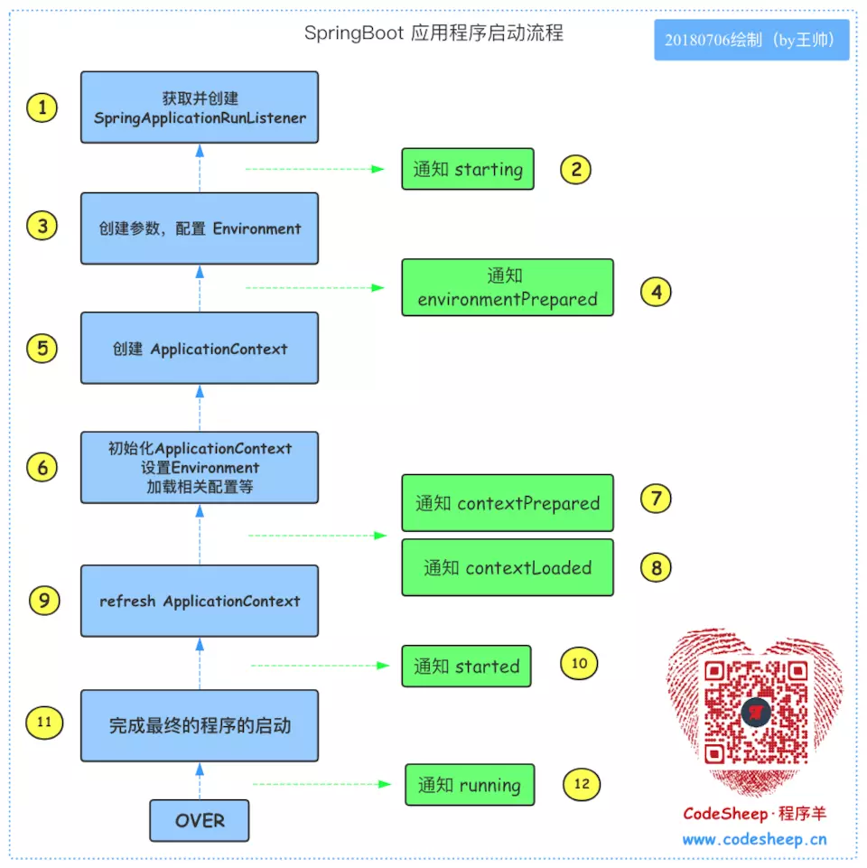

SpringBoot启动流程

参考：

```
https://juejin.im/post/5b8f05a5f265da43296c6102
https://zhuanlan.zhihu.com/p/53022678
```


# 一、初始化SpringApplication

```java
@SpringBootApplication
public class DemoApplication {
	public static void main(String[] args) {
		SpringApplication.run(DemoApplication.class, args);
	}
}
```

我们看看内部情况

```java
public static ConfigurableApplicationContext run(Class<?> primarySource,
		String... args) {
	return run(new Class<?>[] { primarySource }, args);
}

public static ConfigurableApplicationContext run(Class<?>[] primarySources,
		String[] args) {
    //先初始化一个SpringApplication实例，再进行启动
	return new SpringApplication(primarySources).run(args);
}

public SpringApplication(Class<?>... primarySources) {
	this(null, primarySources);
}

public SpringApplication(ResourceLoader resourceLoader, Class<?>... primarySources) {
	this.resourceLoader = resourceLoader;
	Assert.notNull(primarySources, "PrimarySources must not be null");
	this.primarySources = new LinkedHashSet<>(Arrays.asList(primarySources));
    //(1) 推断应用的类型：创建的是 REACTIVE应用、SERVLET应用、NONE 三种中的某一种
	this.webApplicationType = deduceWebApplicationType();
    //(2)使用 SpringFactoriesLoader查找并加载 classpath下 META-INF/spring.factories
    //文件中所有可用的 ApplicationContextInitializer
	setInitializers((Collection) getSpringFactoriesInstances(
			ApplicationContextInitializer.class));
    //(3)使用 SpringFactoriesLoader查找并加载 classpath下 META-INF/spring.factories
    //文件中的所有可用的 ApplicationListener
	setListeners((Collection) getSpringFactoriesInstances(ApplicationListener.class));
    //(4)推断并设置 main方法的定义类
	this.mainApplicationClass = deduceMainApplicationClass();
}
```

说明：

* （1）推断应用的类型：创建的是` REACTIVE`应用、`SERVLET`应用、`NONE `三种中的某一种

    ```java
    private WebApplicationType deduceWebApplicationType() {
    	if (ClassUtils.isPresent(REACTIVE_WEB_ENVIRONMENT_CLASS, null)
    			&& !ClassUtils.isPresent(MVC_WEB_ENVIRONMENT_CLASS, null)) {
    		return WebApplicationType.REACTIVE;
    	}
    	for (String className : WEB_ENVIRONMENT_CLASSES) {
    		if (!ClassUtils.isPresent(className, null)) {
    			return WebApplicationType.NONE;
    		}
    	}
    	return WebApplicationType.SERVLET;
    }
    ```

    根据应用是否存在某些类推断应用类型，分为响应式`web`应用，`servlet`类型`web`应用和非`web`应用，在后面用于确定实例化`applicationContext`的类型。

    

* （2）使用 `SpringFactoriesLoader`查找并加载 classpath下 `META-INF/spring.factories`文件中所有可用的 `ApplicationContextInitializer`

    ```java
    private <T> Collection<T> getSpringFactoriesInstances(Class<T> type) {
    	return getSpringFactoriesInstances(type, new Class<?>[] {});
    }
    
    private <T> Collection<T> getSpringFactoriesInstances(Class<T> type,
    		Class<?>[] parameterTypes, Object... args) {
    	ClassLoader classLoader = Thread.currentThread().getContextClassLoader();
    	// Use names and ensure unique to protect against duplicates
    	Set<String> names = new LinkedHashSet<>(
    			SpringFactoriesLoader.loadFactoryNames(type, classLoader));
    	List<T> instances = createSpringFactoriesInstances(type, parameterTypes,
    			classLoader, args, names);
    	AnnotationAwareOrderComparator.sort(instances);
    	return instances;
    }
    ```

    ```properties
    # Application Context Initializers
    org.springframework.context.ApplicationContextInitializer=\
    org.springframework.boot.context.ConfigurationWarningsApplicationContextInitializer,\
    org.springframework.boot.context.ContextIdApplicationContextInitializer,\
    org.springframework.boot.context.config.DelegatingApplicationContextInitializer,\
    org.springframework.boot.web.context.ServerPortInfoApplicationContextInitializer
    ```

    设置初始化器，读取`spring.factories`文件`key `，`ApplicationContextInitializer`对应的`value`并实例化`ApplicationContextInitializer`接口用于在`Spring`上下文被刷新之前进行初始化的操作。

    

* （3）使用 `SpringFactoriesLoader`查找并加载 classpath下 `META-INF/spring.factories`文件中的所有可用的 `ApplicationListener`

    ```java
    private <T> Collection<T> getSpringFactoriesInstances(Class<T> type) {
    	return getSpringFactoriesInstances(type, new Class<?>[] {});
    }
    
    private <T> Collection<T> getSpringFactoriesInstances(Class<T> type,
    		Class<?>[] parameterTypes, Object... args) {
    	ClassLoader classLoader = Thread.currentThread().getContextClassLoader();
    	// Use names and ensure unique to protect against duplicates
    	Set<String> names = new LinkedHashSet<>(
    			SpringFactoriesLoader.loadFactoryNames(type, classLoader));
    	List<T> instances = createSpringFactoriesInstances(type, parameterTypes,
    			classLoader, args, names);
    	AnnotationAwareOrderComparator.sort(instances);
    	return instances;
    }
    ```

    ```properties
    # Application Listeners
    org.springframework.context.ApplicationListener=\
    org.springframework.boot.ClearCachesApplicationListener,\
    org.springframework.boot.builder.ParentContextCloserApplicationListener,\
    org.springframework.boot.context.FileEncodingApplicationListener,\
    org.springframework.boot.context.config.AnsiOutputApplicationListener,\
    org.springframework.boot.context.config.ConfigFileApplicationListener,\
    org.springframework.boot.context.config.DelegatingApplicationListener,\
    org.springframework.boot.context.logging.ClasspathLoggingApplicationListener,\
    org.springframework.boot.context.logging.LoggingApplicationListener,\
    org.springframework.boot.liquibase.LiquibaseServiceLocatorApplicationListener
    ```

    设置监听器，读取`spring.factories`文件`key`,` ApplicationListener`对应的`value`并实例化
    `interface ApplicationListener<E extends ApplicationEvent> extends EventListener
    ApplicationListener`继承`EventListener`，实现了观察者模式。对于`Spring`框架的观察者模式实现，它限定感兴趣的事件类型需要是`ApplicationEvent`类型事件。

    

* （4）推断并设置 `main`方法的定义类

    ```java
    private Class<?> deduceMainApplicationClass() {
    	try {
    		StackTraceElement[] stackTrace = new RuntimeException().getStackTrace();
    		for (StackTraceElement stackTraceElement : stackTrace) {
    			if ("main".equals(stackTraceElement.getMethodName())) {
    				return Class.forName(stackTraceElement.getClassName());
    			}
    		}
    	}
    	catch (ClassNotFoundException ex) {
    		// Swallow and continue
    	}
    	return null;
    }
    ```


# 二、注解@SpringBootApplication

```
@Target(ElementType.TYPE)
@Retention(RetentionPolicy.RUNTIME)
@Documented
@Inherited
@SpringBootConfiguration
@EnableAutoConfiguration
@ComponentScan(excludeFilters = {
		@Filter(type = FilterType.CUSTOM, classes = TypeExcludeFilter.class),
		@Filter(type = FilterType.CUSTOM, classes = AutoConfigurationExcludeFilter.class) })
public @interface SpringBootApplication {...}
```


```
@SpringBootApplication=
@SpringBootConfiguration使用此注解表明类是一个配置类
+@EnableAutoConfiguration自动读取配置
+@ComponentScan自动扫描组件
```


## 2.1 @SpringBootConfiguration

```java
@Target(ElementType.TYPE)
@Retention(RetentionPolicy.RUNTIME)
@Documented
@Configuration
public @interface SpringBootConfiguration {
}
```

`SpringBootConfiguration`注解和`Spring`的`@Configuration`注解作用一样。标注当前类是配置类，并会将当前类内声明的一个或多个以`@Bean`注解标记的方法的实例纳入到`spring`容器中。


## 2.2 @EnableAutoConfiguration

```java
@SuppressWarnings("deprecation")
@Target(ElementType.TYPE)
@Retention(RetentionPolicy.RUNTIME)
@Documented
@Inherited
@AutoConfigurationPackage
@Import(EnableAutoConfigurationImportSelector.class)
public @interface EnableAutoConfiguration {
}
```

这个注解是`SpringBoot`能进行自动配置的关键。`@Import`注解用于导入配置类，我们看下导入类`EnableAutoConfigurationImportSelector`。容器刷新时，会调用`AutoConfigurationImportSelector`类的`selectImports`方法，扫描`META-INF/spring.factories`文件自动配置类（`key`为`EnableAutoConfiguration`），然后`Spring`容器处理配置类。


## 2.3 @ComponentScan

```java
@ComponentScan(excludeFilters = {
      @Filter(type = FilterType.CUSTOM, classes = TypeExcludeFilter.class),
      @Filter(type = FilterType.CUSTOM, classes = AutoConfigurationExcludeFilter.class) })

@Retention(RetentionPolicy.RUNTIME)
@Target(ElementType.TYPE)
@Documented
@Repeatable(ComponentScans.class)
public @interface ComponentScan {...}
```

`@ComponentScan`扫描指定的包路径，若未指定包路径，则以声明这个注解的类作为基本包路径。比如`@SpringBootApplication`就没有指定包路径，则`DemoApplication`的包路径将作为扫描的基本包路径，因此强烈建议将主类放在顶层目录下。

`excludeFilters`属性指定哪些类型不符合组件扫描的条件，会在扫描的时候过滤掉。


# 三、应用启动

`SpringApplication`创建完之后通过`run`方法进行启动

```java
public ConfigurableApplicationContext run(String... args) {
    //计时器
	StopWatch stopWatch = new StopWatch();
	stopWatch.start();
	ConfigurableApplicationContext context = null;
	Collection<SpringBootExceptionReporter> exceptionReporters = new ArrayList<>();
	configureHeadlessProperty();
    //(1)通过 SpringFactoriesLoader 加载 META-INF/spring.factories 
    //文件，获取并创建 SpringApplicationRunListener 对象
	SpringApplicationRunListeners listeners = getRunListeners(args);
    //(2)然后由 SpringApplicationRunListener 来发出 starting 消息
	listeners.starting();
	try {
        //(3)创建参数，并配置当前 SpringBoot 应用将要使用的 Environment
		ApplicationArguments applicationArguments = new DefaultApplicationArguments(
				args);
        //(4)完成之后，依然由 SpringApplicationRunListener 来发出 environmentPrepared 消息
        //根据扫描到的监听器对象和函数传入参数，进行环境准备
		ConfigurableEnvironment environment = prepareEnvironment(listeners,
				applicationArguments);
		configureIgnoreBeanInfo(environment);
		Banner printedBanner = printBanner(environment);
        //(5)创建 ApplicationContext
		context = createApplicationContext();
        //和上面套路一样，读取spring.factories文件key 
        //SpringBootExceptionReporter对应的value
		exceptionReporters = getSpringFactoriesInstances(
				SpringBootExceptionReporter.class,
				new Class[] { ConfigurableApplicationContext.class }, context);
        //(6)初始化 ApplicationContext，并设置 Environment，加载相关配置等
        //(7)由 SpringApplicationRunListener 来发出 contextPrepared 消息，
        //告知SpringBoot 应用使用的 ApplicationContext 已准备OK
        //(8)将各种 beans 装载入 ApplicationContext，
        //继续由 SpringApplicationRunListener 来发出 contextLoaded 消息，
        //告知 SpringBoot 应用使用的 ApplicationContext 已装填OK
		prepareContext(context, environment, listeners, applicationArguments,
				printedBanner);
        //(9)refresh ApplicationContext，完成IoC容器可用的最后一步
		refreshContext(context);
		afterRefresh(context, applicationArguments);
		stopWatch.stop();
		if (this.logStartupInfo) {
			new StartupInfoLogger(this.mainApplicationClass)
					.logStarted(getApplicationLog(), stopWatch);
		}
        //(10)由 SpringApplicationRunListener 来发出 started 消息
		listeners.started(context);
        //(11)完成最终的程序的启动，在某些情况下，我们希望在容器bean加载完成后执行一些操作，
        //会实现ApplicationRunner或者CommandLineRunner接口后置操作，就是在容器完成刷
        //新后，依次调用注册的Runners，还可以通过@Order注解设置各runner的执行顺序。
		callRunners(context, applicationArguments);
	}
	catch (Throwable ex) {
		handleRunFailure(context, ex, exceptionReporters, listeners);
		throw new IllegalStateException(ex);
	}
	try {
        //(12)由 SpringApplicationRunListener 来发出 running 消息，告知程序已运行起来了
		listeners.running(context);
	}
	catch (Throwable ex) {
		handleRunFailure(context, ex, exceptionReporters, null);
		throw new IllegalStateException(ex);
	}
	return context;
}
```

整体流程说明：



详细说明：

* （1）通过 `SpringFactoriesLoader` 加载 `META-INF/spring.factories` 文件，获取并创建 `SpringApplicationRunListener` 对象

    ```java
    private SpringApplicationRunListeners getRunListeners(String[] args) {
    	Class<?>[] types = new Class<?>[] { SpringApplication.class, String[].class };
    	return new SpringApplicationRunListeners(logger, getSpringFactoriesInstances(
    			SpringApplicationRunListener.class, types, this, args));
    }
    ```

    ```properties
    # Run Listeners
    org.springframework.boot.SpringApplicationRunListener=\
    org.springframework.boot.context.event.EventPublishingRunListener
    ```

    `EventPublishingRunListener`的作用是发布`SpringApplicationEvent`事件。`EventPublishingRunListener`更像是被监听对象。

    ```java
    public class EventPublishingRunListener implements SpringApplicationRunListener, Ordered {
        ......
       @Override
       public void starting() {
          this.initialMulticaster.multicastEvent(
                new ApplicationStartingEvent(this.application, this.args));
       }
    
       @Override
       public void environmentPrepared(ConfigurableEnvironment environment) {
          this.initialMulticaster.multicastEvent(new ApplicationEnvironmentPreparedEvent(
                this.application, this.args, environment));
       }
        ........
        
    }
    ```

    

* （2）然后由 `SpringApplicationRunListener` 来发出 `starting` 消息

    ```java
    public void starting() {
       this.initialMulticaster.multicastEvent(
             new ApplicationStartingEvent(this.application, this.args));
    }
    //获取ApplicationStartingEvent类型的事件后，发布事件
    @Override
    public void multicastEvent(final ApplicationEvent event, @Nullable ResolvableType eventType) {
        ResolvableType type = (eventType != null ? eventType : resolveDefaultEventType(event));
        for (final ApplicationListener<?> listener : getApplicationListeners(event, type)) {
            Executor executor = getTaskExecutor();
            if (executor != null) {
                executor.execute(() -> invokeListener(listener, event));
            }
            else {
                invokeListener(listener, event);
            }
        }
    }
    //继续跟进invokeListener方法,最后调用ApplicationListener监听者的onApplicationEvent
    //处理事件
    private void doInvokeListener(ApplicationListener listener, ApplicationEvent event) {
        try {
            listener.onApplicationEvent(event);
        }
        catch (ClassCastException ex) {
            .....
        }
    }
    ```

    这里是典型的观察者模式。

    ```java
    //观察者：监听<E extends ApplicationEvent>类型事件
    ApplicationListener<E extends ApplicationEvent> extends EventListener
    
    //事件类型：
    Event extends SpringApplicationEvent  extends ApplicationEvent extends EventObject
    
    //被观察者：发布事件
    EventPublishingRunListener implements SpringApplicationRunListener
    ```

    `SpringApplication`根据当前事件`Event`类型，比如`ApplicationStartingEvent`，查找到监听`ApplicationStartingEvent`的观察者`EventPublishingRunListener`，调用观察者的`onApplicationEvent`处理事件。

* （3）创建参数，并配置当前 `SpringBoot `应用将要使用的` Environment`

    ```java
    //根据main函数传入的参数，创建DefaultApplicationArguments对象
    ApplicationArguments applicationArguments = new DefaultApplicationArguments(
          args);
    //根据扫描到的listeners对象和函数传入参数，进行环境准备。
    ConfigurableEnvironment environment = prepareEnvironment(listeners,
          applicationArguments);
    ```

    `ApplicationArguments`提供运行`application`的参数，后面会作为一个`Bean`注入到容器。这里重点说下`prepareEnvironment`方法做了些什么。

    ```java
    private ConfigurableEnvironment prepareEnvironment(
    	SpringApplicationRunListeners listeners,
    	ApplicationArguments applicationArguments) {
    	
    	// Create and configure the environment
    	ConfigurableEnvironment environment = getOrCreateEnvironment();
    	
    	configureEnvironment(environment, applicationArguments.getSourceArgs());
    	
    	//和listeners.starting一样的流程
    	listeners.environmentPrepared(environment);
    	
    	//上述完成了环境的创建和配置，传入的参数和资源加载到environment
    	
    	//绑定环境到SpringApplication
    	bindToSpringApplication(environment);
    	if (!this.isCustomEnvironment) {
    	environment = new EnvironmentConverter(getClassLoader())
    			.convertEnvironmentIfNecessary(environment, deduceEnvironmentClass());
    	}
    	ConfigurationPropertySources.attach(environment);
    	return environment;
    }
    ```

    这段代码核心有3个。

    * `configureEnvironment`，用于基本运行环境的配置。

    * 发布事件`ApplicationEnvironmentPreparedEvent`。和发布`ApplicationStartingEvent`事件的流程一样。

    * 绑定环境到`SpringApplication`

        

* （4）完成之后，依然由 `SpringApplicationRunListener` 来发出 `environmentPrepared `消息

* （5）创建 `ApplicationContext`

    在实例化`context`之前，首先需要确定`context`的类型，这个是根据应用类型确定的。应用类型`webApplicationType`在构造器已经推断出来了。获取`context`类型后，进行实例化，这里根据`class`类型获取无参构造器进行实例化。

    ```java
    public static <T> T instantiateClass(Class<T> clazz) throws BeanInstantiationException {
       Assert.notNull(clazz, "Class must not be null");
       if (clazz.isInterface()) {
          throw new BeanInstantiationException(clazz, "Specified class is an interface");
       }
       try {
           //clazz.getDeclaredConstructor()获取无参的构造器，然后进行实例化
          return instantiateClass(clazz.getDeclaredConstructor());
       }
       catch (NoSuchMethodException ex) {
        .......
    }
    ```

    比如`web`类型为`servlet`类型，就会实例化`org.springframework.boot.web.servlet.context.AnnotationConfigServletWebServerApplicationContext`类型的`context`。

    

* （6）初始化 `ApplicationContext`，并设置 `Environment`，加载相关配置等

* （7）由 `SpringApplicationRunListener` 来发出 `contextPrepared` 消息，告知`SpringBoot` 应用使用的 `ApplicationContext` 已准备`OK`

* （8）将各种 beans 装载入 `ApplicationContext`，继续由 `SpringApplicationRunListener` 来发出 `contextLoaded` 消息，告知 `SpringBoot` 应用使用的 `ApplicationContext` 已装填`OK`

    这三步是`context`前置处理阶段

    ```java
    private void prepareContext(ConfigurableApplicationContext context,
          ConfigurableEnvironment environment, SpringApplicationRunListeners listeners,
          ApplicationArguments applicationArguments, Banner printedBanner) {
       //关联环境
       context.setEnvironment(environment);
    
       //ApplicationContext预处理，主要配置Bean生成器以及资源加载器
       postProcessApplicationContext(context);
        
       //调用初始化器，执行initialize方法，前面set的初始化器终于用上了
       applyInitializers(context);
       //发布contextPrepared事件，和发布starting事件一样，不多说
       listeners.contextPrepared(context);
       if (this.logStartupInfo) {
          logStartupInfo(context.getParent() == null);
          logStartupProfileInfo(context);
       }
    
       // Add boot specific singleton beans
       ConfigurableListableBeanFactory beanFactory = context.getBeanFactory();
       //bean, springApplicationArguments,用于获取启动application所需的参数
       beanFactory.registerSingleton("springApplicationArguments", applicationArguments);
        
       //加载打印Banner的Bean
       if (printedBanner != null) {
          beanFactory.registerSingleton("springBootBanner", printedBanner);
       }
       
       if (beanFactory instanceof DefaultListableBeanFactory) {
          ((DefaultListableBeanFactory) beanFactory)
                .setAllowBeanDefinitionOverriding(this.allowBeanDefinitionOverriding);
       }
       // Load the sources，根据primarySources加载resource。
       //primarySources:一般为主类的class对象
       Set<Object> sources = getAllSources();
       Assert.notEmpty(sources, "Sources must not be empty");
       //构造BeanDefinitionLoader并完成定义的Bean的加载
       load(context, sources.toArray(new Object[0]));
       //发布ApplicationPreparedEvent事件，表示application已准备完成
       listeners.contextLoaded(context);
    }
    ```

    

* （9）refresh ApplicationContext`，完成`IoC`容器可用的最后一步

    ```java
    private void refreshContext(ConfigurableApplicationContext context) {
       //调用父类AbstractApplicationContext刷新容器的操作
       refresh(context);
       // 注册一个关闭容器时的钩子函数,在jvm关闭时调用
       if (this.registerShutdownHook) {
          try {
             context.registerShutdownHook();
          }
          catch (AccessControlException ex) {
             // Not allowed in some environments.
          }
       }
    }
    ```

    

* （10）由 `SpringApplicationRunListener` 来发出 `started` 消息

* （11）完成最终的程序的启动

* （12）由 `SpringApplicationRunListener` 来发出 `running` 消息，告知程序已运行起来了


