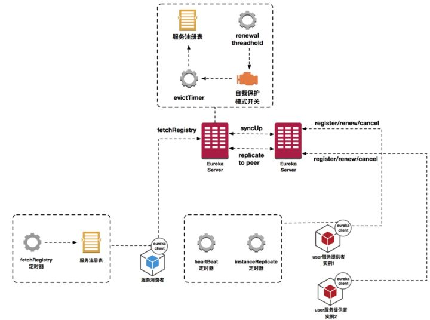
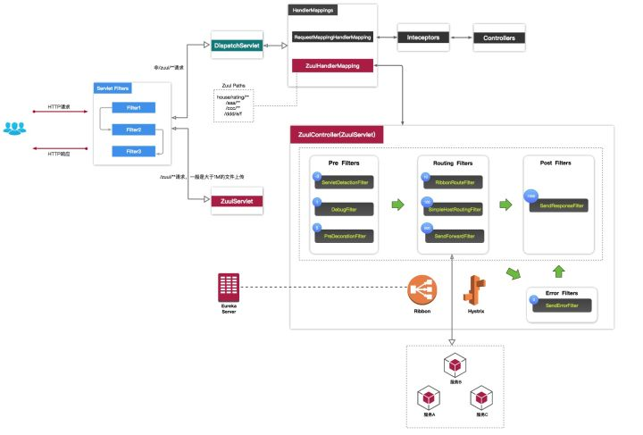
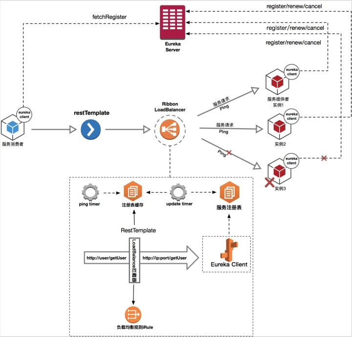
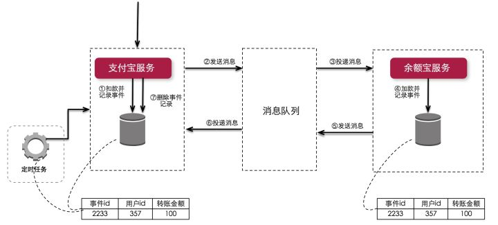
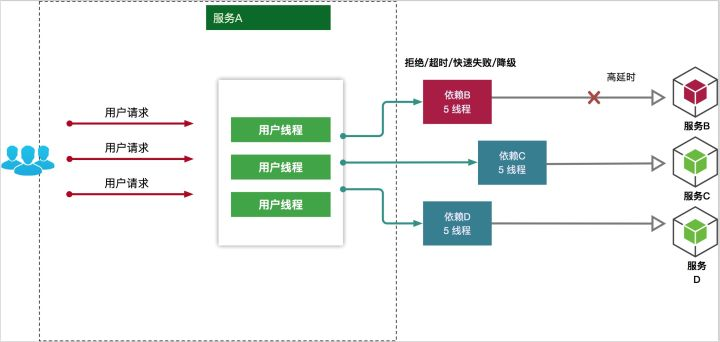
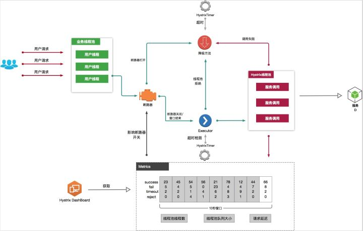
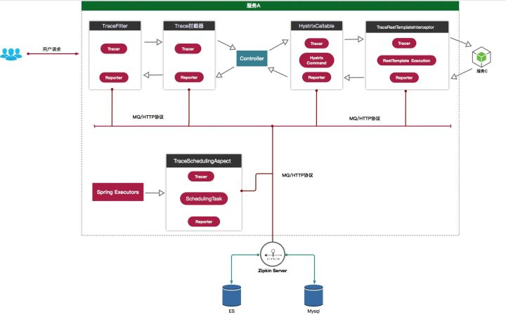
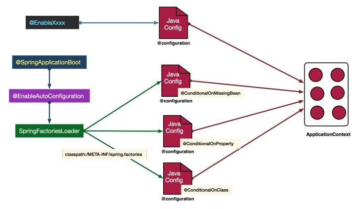

1、什么是`SpringBoot`

用来简化`spring`初始搭建和开发过程的脚手架

2、`Eureka`注册中心

服务注册
服务提供者在启动的时候通过发送`REST`请求，将自己注册到`Eureka Server`注册中心，注册信息包含一些元数据信息。`Eureka Server`接收到请求后，将元数据存储在一个双层结构`Map`中，第一层的`key`是服务名，第二层的`key`是具体服务的实例名。

服务同步
因为服务注册中心为集群部署，注册中心互相注册，当服务提供者发送请求到一个注册中心时，注册中心会将注册的信息转发给其它集群相连的注册中心，完成注册中心之间的服务同步。通过注册中心之间的服务同步，集群注册中心服务信息保持一致，这样就可以通过任意一台注册中心获取服务列表。

服务续约
服务提供者注册完成后，会维护一个**心跳**，用来持续的告诉注册中心，我还活着，避免`Eureka Server` 将服务提供者从注册中心剔除，这种操作行为我们称为服务续约。

自我保护
默认情况下，如果`Eureka Server`在一定时间内（默认`90`秒）没有接收到某个微服务实例的心跳，`Eureka Server`将会移除该实例。

3、`Feign`请求转发

使用动态代理来简化服务间调用中服务建立连接、构造请求、发起靕求、获取响应、解析响应，等一些列同质繁琐的工作。

4、`Ribbon`负载均衡

一个服务可能部署在多台服务器上，服务调用者并不知道这些信息，那具体调用哪台服务器上的服务呢？此时`Ribbon`首先会从`Eureka`注册中心那里获取各个服务的部署信息，然后使用最经典的**`Round Robin`轮询算法**来将请求平均的发送到各台服务器上。

5、`Hystrix`熔断器（断路器）

各个微服务可能存在相互依赖的情况，如果其中一个服务挂了，那么可能产生连锁反应，导致雪崩效应，即整个服务全部挂掉。但是有时候其中一个服务挂了，其实其他的服务还是可以单独使用的，此时就需要用到`Hystrix`了，`Hystrix`是隔离、熔断以及降级的一个框架。啥意思呢？说白了，**`Hystrix`会搞很多个小小的线程池**，比如订单服务请求库存服务是一个线程池，请求仓储服务是一个线程池，请求积分服务是一个线程池，每个线程池里的线程就仅仅用于请求那个服务，各个线程池相互不影响。

如果某个服务挂了，那每次还是去调用一下，这会抛异常，而且每次都去请求也是一种浪费，还不如直接“停掉”，这就是熔断。但是直接停掉也不行，这样相当于这个服务啥也没干，于是就涉及到降级：每次调用积分服务，你就在数据库里记录一条消息，说给某某用户增加了多少积分，因为积分服务挂了，导致没增加成功！这样等积分服务恢复了，你可以根据这些记录手工加一下积分。**这个过程，就是所谓的降级。**

6、`Zuul`网关

网关框架，可以处理如**统一的降级、限流、认证授权、安全**，等等工作。

7、ribbon和 feign 的区别

1、Ribbon 和 feign 都是客户端的负载均衡的工具，Feign的底层就是通过Ribbon实现的，它是对Ribbon的进一步的封装，让Ribbon 更加好用。
2、Ribbon 使用HttpClient 或 RestTemplate 模拟http请求，步骤相当繁琐。而Feign采用接口+注解的方式 ，将需要调用的其他服务的方法定义成抽象方法即可， 不需要自己构建http请求。然后就像是调用自身工程的方法调用，而感觉不到是调用远程方法，使得编写 客户端变得非常容易。类似于 mybatis 的 @Mapper注解 。

8、什么是自我保护模式？
默认情况下，如果EurekaServer在一定时间内没有接收到某个微服务实例的心跳，EurekaServer将会进入自我保护模式，在该模式下EurekaServer就会保护服务注册表中的信息，不再删除服务注册表中的数据（也就是不会注销任何微服务）。当网络故障恢复后，该Eureka Server节点会自动退出自我保护模式。 它的设计哲学就是宁可保留错误的服务注册信息，也不盲目注销任何可能健康的服务实例。一句话讲解：好死不如赖活着 。

9、Eureka和ZooKeeper都可以提供服务注册与发现的功能,请说说两个的区别

* ZooKeeper保证的是CP,Eureka保证的是AP

    * ZooKeeper在选举期间注册服务瘫痪,虽然服务最终会恢复,但是选举期间不可用的
        Eureka各个节点是平等关系,只要有一台Eureka就可以保证服务可用,而查询到的数据并不是最新的

    * 自我保护机制会导致

        Eureka不再从注册列表移除因长时间没收到心跳而应该过期的服务
        Eureka仍然能够接受新服务的注册和查询请求,但是不会被同步到其他节点(高可用)
        当网络稳定时,当前实例新的注册信息会被同步到其他节点中(最终一致性)
        Eureka可以很好的应对因网络故障导致部分节点失去联系的情况,而不会像ZooKeeper一样使得整个注册系统瘫痪

* ZooKeeper有Leader和Follower角色,Eureka各个节点平等

* ZooKeeper采用过半数存活原则,Eureka采用自我保护机制解决分区问题

* Eureka本质上是一个工程,而ZooKeeper只是一个进程

10、相关实现原理

摘自：`https://zhuanlan.zhihu.com/p/54634405`

（1）服务注册发现组件Eureka工作原理

（2）服务网关组件Zuul工作原理

（3）跨域时序图

（4）Eureka与Ribbon整合工作原理

（5）解决分布式一致性

（6）级联故障流程

（7）断路器组件Hystrix工作原理

（8）分布式追踪Sleuth工作原理

（9）SpringBoot自动配置工作原理

