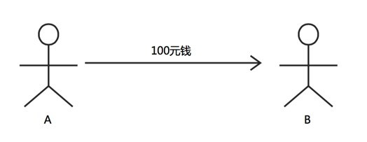
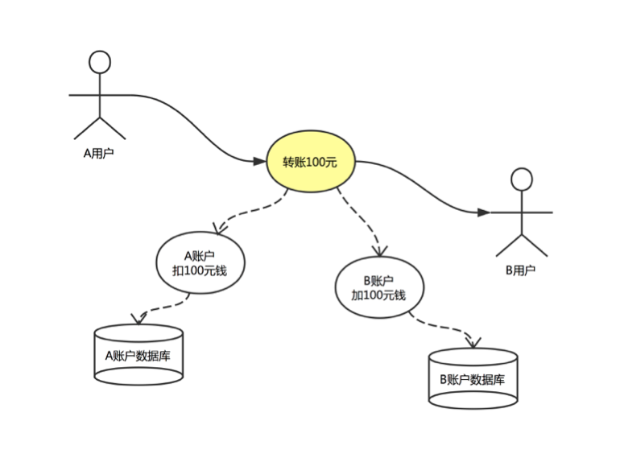
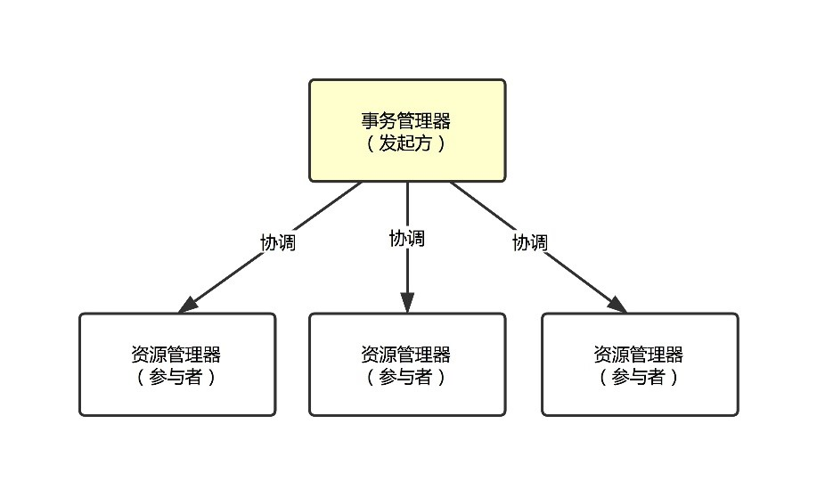
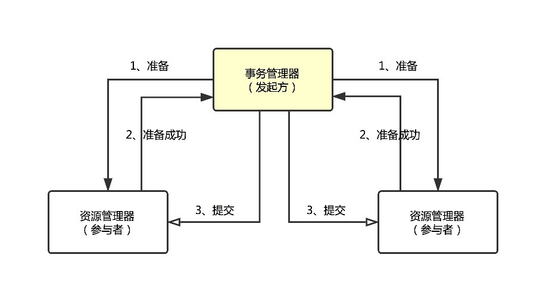
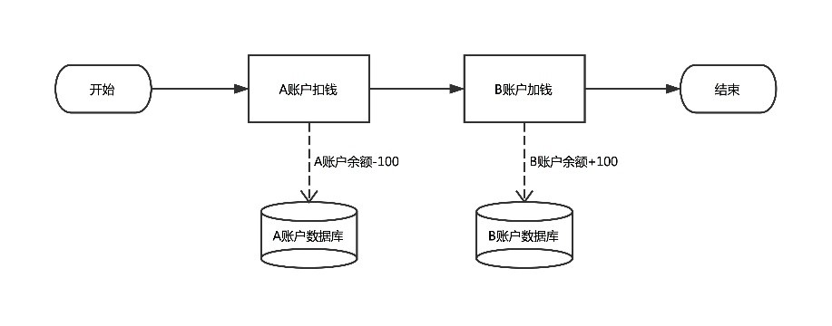
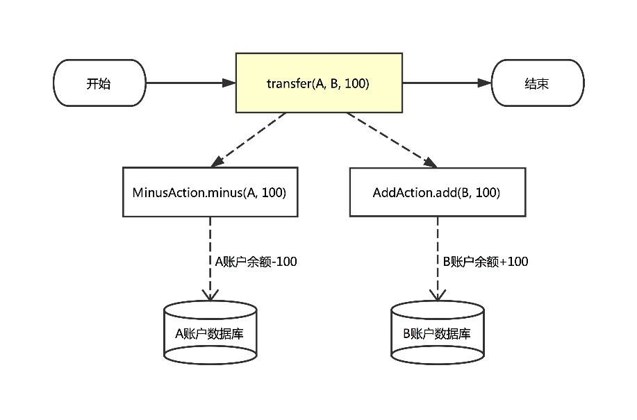
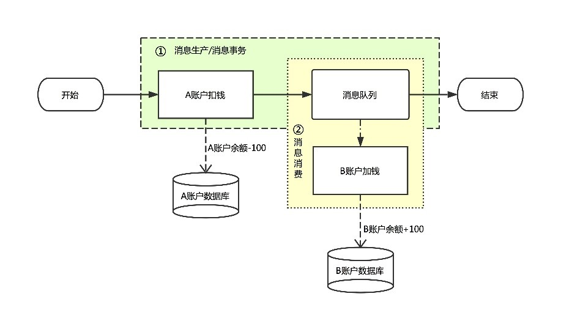
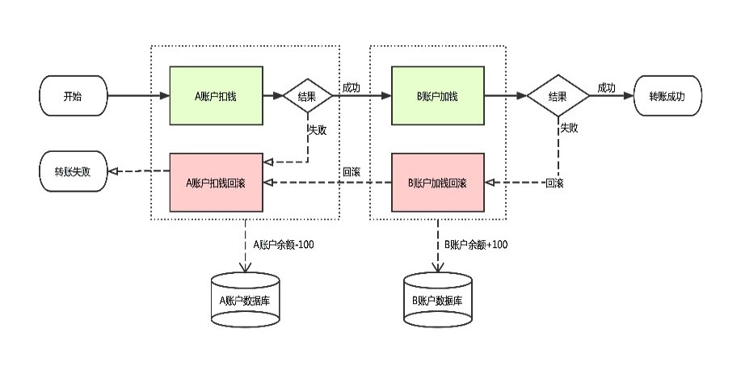
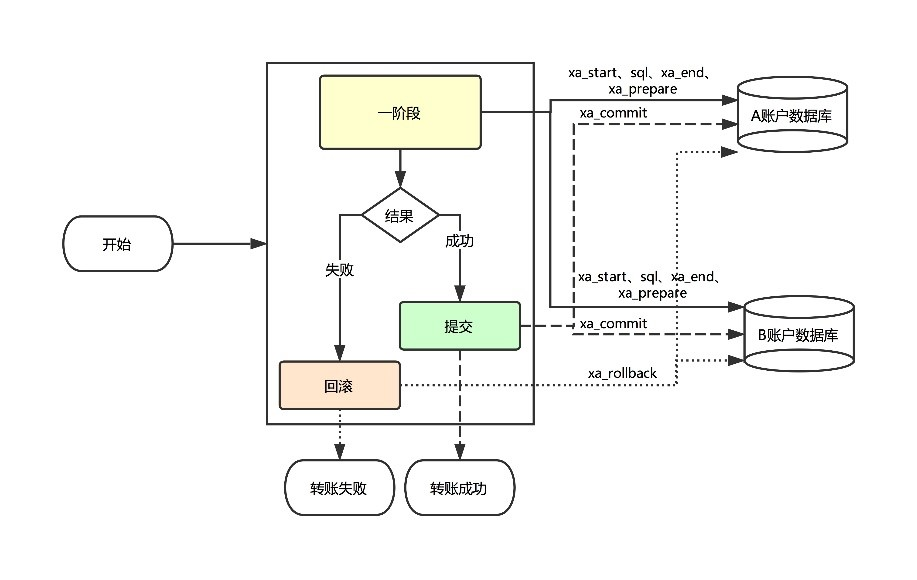
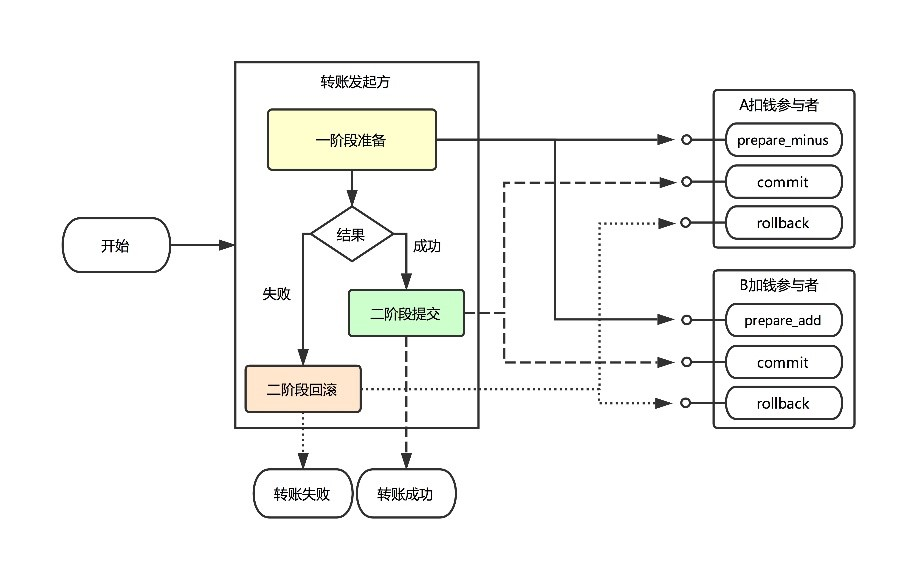

摘自：`https://www.yuque.com/antfincloud/middleware/transfer_solutions`

# 概述

本文以分布式架构下的转账服务为业务场景，先阐述分布式架构下跨数据库转账遇到的数据一致性问题；再详细介绍如何使用行业常见的分布式事务解决方案（消息事务、冲正补偿、JTA/XA），以及蚂蚁的分布式事务（DTX），解决跨库转账的数据一致性问题，并列举了各种解决方案的优劣势。

通过对比各种分布式事务解决方案，您会发现，分布式事务有丰富的接入模式，能应对各种复杂的业务场景，接入维护简单，性能优异，行业优势明显。

# 需求背景和技术问题

## 需求描述

转账是金融机构日常业务中的常见场景。假设用户 A为转账发起方，从自己的账户余额中转出一笔资金至用户 B 的账户中。此操作涉及两部分：“A 账户的扣钱”和“B 账户的加钱”，这两个操作要都成功才算转账成功。

如果一个操作成功而另一个操作失败（比如：B 账户加钱成功，A 账户扣钱失败），则会出现总体资金数据不一致，造成资金损失；故转账服务的中的“加钱”和“扣钱”操作必须在一个事务内，要么都成功，要么都失败。

在非分布式架构下，用户 A、用户 B 的账户数据都在同一个数据库中，可以使用数据库事务来保证“加钱”和“扣钱”操作的在一个事务内。

但在分布式架构下，用户 A 的账户数据、用户 B 的账户数据会分别存储在不同数据库中，此时便无法再使用数据库事务来保证“加钱”和“扣钱”操作的原子性，需要考虑能保证数据一致性的解决方案。

## 需求分析

如上图所示，在分布式架构下，用户 A 发起转账操作，向用户 B 转账 100 元。

转账过程中，首先是在数据库 A 中扣除账号 A 的 100 元，紧接着是在数据库 B 中给账户 B 加 100 元。

“数据库 A 上账户 A 扣款操作”、“数据库 B 上账户 B 加钱操作”都成功才算转账成功；如果一个操作成功，另一操作失败（比如：账户 B 加钱成功，账户 A 扣钱失败），则会出现资金数据不一致，造成资金损失；如果加钱操作和扣钱操作丢失败，那么转账是失败的，但是不会有资金损失。

故需要保证数据库 A、数据库 B 上的更新操作都成功或者都失败；整个资金数据最终是一致的。

## 技术问题

分布式架构下，用户 A、用户 B 的账户数据存储在不同的数据库中，需要引入能保证跨数据库的多个操作在一个事务内的解决方案，以保证转账操作的原子性，保障跨库转账时的资金安全。

下文将介绍目前常见的分布式事务解决方案，并将其应用到转账场景，以解决跨库转账时的数据一致性问题。

# 行业分布式事务解决方案

分布式事务是指事务中资源分布于网络中的多个不同节点的事务。

如上图所示，分布式事务有一个事务管理器（Transaction Manager）和多个资源管理器（Resource Manager）组成：

- **事务管理器**：通常被称为事务发起方，负责发起方分布式事务，编排、协调所有资源管理器完成业务活动。

- **资源管理器**：也被称为事务参与者，对应单个业务动作，由事务管理器协调、编排。

 在本文的转账案例中，转账服务便是事务管理器（发起方），转账服务内部执行“扣钱”、“加钱”动作是事务的参与者。

二阶段提交协议（2PC）是分布式事务的基础协议，在此协议中，事务管理器分两个阶段协调资源管理器。

如上图所示，在第一阶段，事务管理器向所有资源管理器发生准备请求，如果所有资源管理返回准备成功，那么在第二阶段事务管理器向所有资源发生提交请求，完成所有资源的提交。

如果有任一资源管理一阶段准备失败，那么在第二阶段事务管理器向所有资源发生回滚请求，完成所有资源的回滚。

目前常见的分布式事务解决方案均采用二阶段提交协议实现。

下文将以转账场景为例，分别介绍非事务解决方案和常见的分布式事务解决方案，了解它们是如何保障分布式架构下跨库转账的原子性，保障资金数据的一致性。

## 非事务解决方案

如上图所示，在非分布式事务解决方案中，转账操作会依次执行“A 账户扣除 100 元”、“B 账户增加 100 元”，最后完成转账操作。整个转账操作内部有两个操作，分别是：“A 账户扣钱”、“B 账户加钱”，我们把这两个操作抽象成扣钱服务（MinusAction）和加钱服务（AddAction）：

- **扣钱服务：**负责在 A 账户余额上扣除转账资金。

- **加钱服务：**负责向 B 账户加钱。

如上图所示，转账服务会依次调用 MinusAction 服务的 minus 方法完成 A 账户的扣款，AddAction 服务的 add 方法完成 B 账户的加钱。整个转账过程中，未引入任何分布式事务解决方案来保证转账操作（加钱操作、扣钱操作）的原子性。正常情况下，加钱操作和扣钱操作都执行成功，这种实现方式不会有问题。但是在异常情况下（比如：A 账户扣钱成功，但是 B 账户加钱失败，此时 A 账户扣掉的钱将无法恢复），会出现资金数据不一致，给用户造成资金损失。因此，在金融行业，这种解决方案是不可取的，必需引入分布式事务解决方案来保障转账服务的原子性。

## 消息事务解决方案

消息事务是一种比较常见的分布式事务解决方案。如上图所示，引入了消息事务解决方案来解决转账操作的事务问题。

转账服务内部使用消息事务功能，发送加钱消息给加钱服务，同时在消息事务回调方法内调用扣钱服务完成 A 账户的扣钱；A 账户扣钱成功则加钱消息发送成功，否则加钱消息发送失败；消息发送完成之后，转账服务返回结果，消息事务一阶段完成。

在第二阶段订阅消息，消息消费时，调用加钱服务完成 B 账户的加钱；B 账户加钱成功则消息消费成功；否则消息消费失败，消息队列下个周期重试投递消息。

### **消息事务解决方案分析**

- 消息事务的转账操作分为两个阶段，在一阶段执行的操作是：“A 账户扣除 100 元钱”和发送“B 账户加钱”消息至消息队列，这两个操作要么都成功，要么都失败。

- 在一阶段结束之后，整个转账操作便结束，用户会收到转账结果；此时用户会认为转账完成。

- 二阶段“B 账户加钱”消息的消费是异步的，由消息队列将“B 账户加钱”消息发送至“B 账户扣钱”服务，此服务消费消息并完成账户 B 的加钱；消息队列会一直重复投递消息，直到“B 账户加钱”成功为止。

### **消息事务解决方案问题**

- 消息消费延迟。一阶段“A 账户扣款”之后，转账操作便结束，此时用户认为转账操作已经完成；但实际上“B 账户加钱操作”未执行；需要等待消息队列投递“B 账户加钱”消息方可执行，消息投递延迟时间是不确定的，造成“B 账户加钱操作”执行实际不确定。

- 要求二阶段的消息消费必须 100% 成功。一阶段“账户 A 扣除 100 元钱”成功之后，如果二阶段“账户 B 加钱 100 元钱操作”无法成功（比如：账户 B 不存在、B账户被冻结等原因导致账户 B 加钱永远不会成功），此时整个资金就处于不一致状态，账户 A 扣除的 100 元钱将永远无法得到补偿；所以使用消息事务必须保证二阶段的消息消费一定能成功。

- 引入“消息队列”风险点。消息事务可用的前提是消息队列可用。消息队列宕机会导致整个转账操作完全不可用；消息队列出现消息积压会导致二阶段延迟更加严重。因此，消息队列可能成为消息事务解决方案的一个潜在瓶颈。

## 冲正补偿解决方案

冲正补偿也是分布式事务比较常用的一种解决方案，冲正补偿可以解决消息事务二阶段不可逆的问题。

各个业务参与者（加钱、扣钱动作）需要分别实现正向业务操作，以及其逆向回滚操作。

事务协调者先执行所有参与者正向业务操作，如果所有参与者正向操作均成功，那么整个业务就算成功；如果任意参与者正向操作执行失败，那么协调者会去执行所有参与者的逆向操作，让事务回滚。转账的冲正补偿实现如下图所示：

冲正补偿解决方案中，每一个业务操作均需要实现正向和逆向两个操作；对于扣钱服务，除了扣钱操作外，还需要实现其方法的回滚操作；对于加钱服务，除了加钱操作外，还需要实现其回滚操作。

### **冲正补偿解决方案分析**

- 在冲正补偿下，各服务均需要用户设计和实现“正向”和“逆向”两个操作。

- 转账操作开始之后，先执行 A 账户的正向操作“A 账户扣钱操作”，如果执行失败，则执行逆向操作“A 账户扣钱回滚操作”，最终转账操作失败。

- 如果 A 账户正向操作成功，则执行 B 账户的正向操作“B账户加钱操作”；如果“B 账户加钱”执行失败，则会执行 B 账户逆向操作“B账户加钱回滚操作”，以及 A 账户的逆向操作“A 账户扣钱回滚操作”，最终转账失败。

- 如果 A 账户正向和 B 账户的正向操作均成功，那么转账成功。

### **冲正补偿解决方案问题**

- 接入成本高。冲正补偿需要用户设计实现各服务的正向和逆向操作，用户在设计正向操作时，需要同时考虑逆向操作该如何执行；需要在正向操作中保存一些中间数据，供逆向操作运行时使用，系统设计实现较复杂。

- 资金安全问题。假如在某些场景下，对 B 账户“加钱”（正向）成功之后，出现一些其他异常导致整个转账操作需要回滚，此时会触发“加钱”操作的逆向操作去扣除 B 账户上的资金；但是如果 B 用户在此之前已经把账户上的资金全部转走，“扣除 B 账户上的资金”这个逆向操作可能永远不会成功，此时就出现资金无法追回的问题。为了解决资金安全问题，编排冲正补偿各动作时，需要考虑如何保障资金安全；系统设计的方方面面均需考虑资金安全，无疑系统设计会复杂繁琐，日后的代码维护也需谨慎。

- 维护成本高。正向、逆向操作执行过程中，可能出现服务器宕机、重启等异常情况导致转账流程中断（比如正向操作中，A账户扣钱成功之后，B 账户加钱还未开始，执行流程中断），此时就需要用户维护一个恢复程序，不断找到这种未完成的转账任务，执行该笔转账剩余的未完成的操作，使转账成功或者转账回滚，以保障数据的最终一致。但目前冲正补偿并没有标准的恢复程序可用，这个恢复程序就需要用户自己设计实现，成本较高。

## JTA/XA 解决方案

JTA/XA 解决方案通过 JTA API 调用数据库的 XA 接口，协调各个数据库上的 XA 事务的提交和回滚。

如上图所示，加钱操作、扣钱操作分别调用数据库 A、数据库 B 的 JTA/XA API。JTA/XA API 能帮助用户分二阶段协调各个数据库上 XA 事务的同步提交和回滚。

### **JTA/XA 解决方案分析**

- 用户编写 JTA 接口，内部分别开启“A 数据库”、“B 数据库”上的 XA 事务。

- 开启 XA 事务之后，分别在“A 数据库”XA 事务上执行 A 账户扣钱任务，在“B 数据库”XA 事务中执行 B 账号加钱任务；并结束 XA 事务。

- 执行 XA 事务一阶段的预提交。

- 如果“A 数据库”、“B 数据库”上的 XA 事务预提交均成功，则提交 XA 事务。

- 如果“A 数据库”、“B 数据库”上的 XA 事务预提交出现失败，则回滚 XA 事务。

JTA/XA 解决方法下，数据库 XA 事务作为资源管理器，用户自己作为事务协调者，调用 JTA 接口操作 XA 事务。

### **JTA/XA 解决方案的问题**

- XA 并发性能受限。XA 事务内访问的数据都会被数据库加锁，直到 XA 事务提交或者回滚，这些数据锁才会被释放。这个数据库层的全局锁限制了 XA 事务的并发性，极大影响了 XA 事务的性能。

- 运维成本高。与冲正补偿一样，XA 解决方案下，事务协调者执行转账操作的任意阶段，都可能出现服务器宕机、重启等异常情况导致转账流程中断，此时就需要用户维护一个恢复程序，不断找到这种未完成的转账任务，执行该笔转账剩余的未完成的操作，使转账成功或者转账回滚，以保障数据的最终一致。

    同样的，JTA/XA 解决方案并没有标准的恢复程序可用，这个恢复程序就需要用户自己设计实现，成本较高。

# 蚂蚁金服分布式事务解决方案

前文介绍了消息事务、冲正补偿等解决方案及其问题，接下来我们将介绍使用蚂蚁金服的分布式事务（DTX）解决方案来实现转账操作。

分布式事务有两种模式：TCC 模式和 FMT 模式：

- TCC 模式由用户实现 TCC 参与者，供事务发起方协调。

- FMT 模式无需用户实现 TCC 参与者，用户的业务将作为一阶段操作，每一个业务的二阶段操作由分布式事务框架自动生成。

下面我们将分别介绍如何使用 TCC 模式、FMT 模式实现转账操作。

## TCC 模式解决方案

TCC 即 Try-Confirm-Cancel 的缩写，是服务化的二阶段提交（2PC）编程模型：

- Try：资源检查和预留

- Confirm：发生实际的业务操作；要求 Try 成功 Confirm 一定能成功

- Cancel：预留资源的释放，Try 阶段的逆向操作

TCC 模式需要用户将“A 账户扣钱”、“B 账户加钱”均分成二阶段实现，在第一阶段检查预留资源，在二阶段提交时执行实际的扣钱、加钱操作，二阶段回滚时释放预留资源。

使用分布式事务的 TCC 模式，需要用户设计、实现个业务动作的 TCC 服务，此 TCC 服务有 3 个方法，分别是一阶段的准备方法（Try）、二阶段的提交方法（Confirm）和二阶段的回滚方法（Cancel）。

如上图所示，TCC 模式的转账操作描述：

- 转账操作内，首先执行各 TCC 参与者的一阶段方法，做转账准备操作；一阶段准备成功，则二阶段的提交一定能成功。

- 如果所有一阶段参与者方法均执行成功，那么二阶段转账操作会去执行所有 TCC 参与者的提交方法，执行 A 账户的扣钱和 B 账户的加钱，完成真正用户余额的转账。

- 如果一阶段有任一参与者出现失败，那么二阶段便会执行所有 TCC参与者的回滚方法，使得各账户恢复至转账前的状态。

在转账方法内部，用户只需要显示调用各个参与者（A 账户扣钱参与者、B 账户加钱参与者）的一阶段方法，无需关注参与者的二阶段方法调用（参与者二阶段方法由分布式事务框架来调用，分布式事务框架会根据转账方法返回结果是成功还是失败，来决定是去调用各参与者二季度的提交方法还是回滚方法）。

### TCC 模式优点

- 无资金安全风险。一阶段只会冻结转账资金，不会发生真正的资金转账。一阶段成功之后才回去执行二阶段的提交操作，完成真正的资金转账；与冲正补偿相比，TCC 模式资金更加安全。

- 运维成本低；在转账操作执行过程中出现异常中断时，TCC 模式无需用户自己维护异常事务恢复程序，分布式事务提供了标准的统一的恢复服务帮助用户恢复异常事务；这个恢复服务用户完全无感知。

- 性能优越。TCC 参与者各阶段方法由用户实现；相对于 XA 这种数据库层的全局锁，用户可自定义其数据库的操作粒度，使数据库层面的锁冲突最小、最大限度的提高吞吐量。

### TCC 模式问题

接入成本较高。用户接入过程中，需要考虑如何将业务动作分成二阶段完成，需要在第一阶段预留资源，以保证第二阶段的提交一定能成功。此外，TCC 参与者实现时还需要考虑幂等控制、防悬挂等，这些都增加了 TCC 模式的接入成本。

## FMT 模式解决方案

针对 TCC 模式接入成本高的问题，分布式事务开发了 FMT 模式。FMT 模式的接入成本极低，用户无需实现 TCC 参与者，只需要极少的改动业务代码即可接入分布式事务。

### FMT 模式优点

接入简单、快捷；对业务代码改动少。

### FMT 模式问题

在实现上，为了防止数据的无效读写等问题，添加了行锁；相对于几乎无锁的 TCC 模式，性能稍弱。

# 分布式事务与行业解决方案对比

## 与消息事务相比

- 消息事务存在消息消费延迟的问题；分布式事务所有操作均是同步调用，无任何延迟。

- 消息事务在一阶段成功后，要求二阶段的消息消费必须成功。分布式事务的 TCC 模式也是二阶段操作，但在一阶段准备操作后，可以保证二阶段一定成功；而 FMT 模式在一阶段准备操作后，会自动生成二阶段操作，可以保证操作 100% 成功。

- 消息事务依赖消息队列服务；分布式事务不依赖任何第三方服务。

## 与冲正补偿相比

- 冲正补偿要求各个业务动作均实现“正向”、“逆向”2 个操作；TCC 要求业务动作分 2 阶段实现，分别是一阶段的准备，和二阶段的提交/回滚。对于接入成本来说，二者可以说的等价的。但是FMT 模式下，无需用户实现这些复杂操作，用户只需按自身业务逻辑实现其代码。

- 冲正补偿在正向操作中就完成用户账户资金的修改，存在资金安全风险；TCC 模式一阶段只是冻结资金，二阶段才完成真正的资金变更，无资金安全问题；FMT 模式有全局行锁对用户数据进行加锁，用户在转账事务未完成前，无法动用账户资金，同样无资金安全问题。

- 冲正补偿需要用户维护一个事务的恢复服务；而分布式事务提高了统一的标准的异常恢复程序，分布式事务维护成本更低。

## 与 JTA/XA 相比

- TCC 模式可以认为是无任何数据库层面的全局数据锁，性能比 XA 高很多；FMT 模式虽然有类 XA 的全局数据锁，但是我们对 FMT 的行锁做了大量优化，引入乐观锁、自旋锁、控制行锁粒度等优化策略，FMT 的行锁性能比 XA 稍高。

- JTA/XA 解决方案需要用户维护一个事务的恢复服务；而分布式事务提高了统一的标准的异常恢复程序，维护成本更低。

# 总结

相较于消息事务、冲正补偿、JTA/XA 等解决方案，分布式事务提供了多种模式和解决方案，在性能、易用性、运维成本等方面均有较出色的表现，是目前行业内领先的分布式事务解决方案。

分布式事务提供了两种模式：TCC 模式、FMT 模式。如果比较看重易用性，可以选择使用 FMT 模式；如果业务逻辑比较复杂，对性能要求比较高，可以选择 TCC 模式。