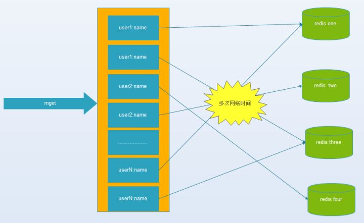
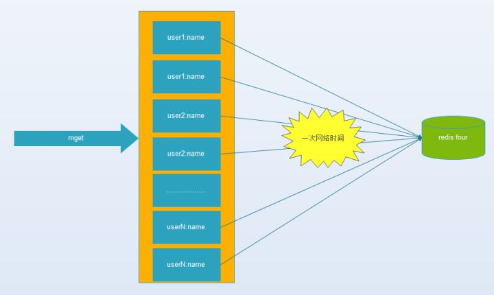
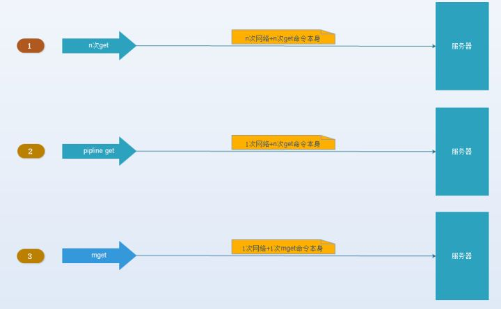
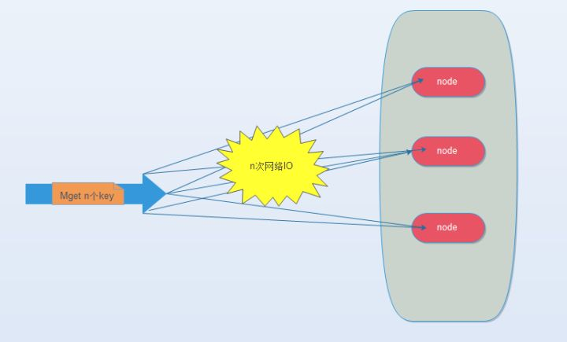
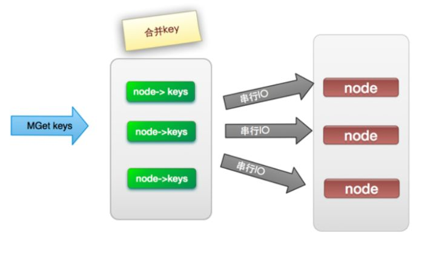
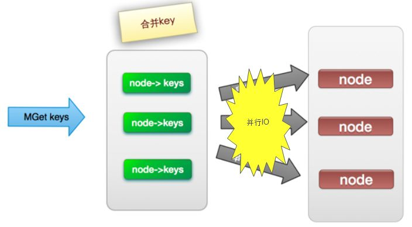
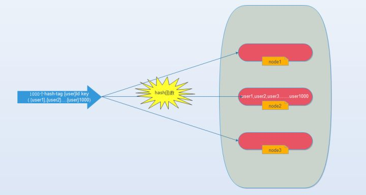
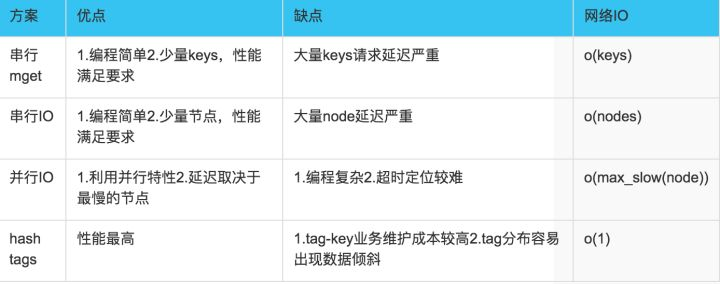

摘自：`https://zhuanlan.zhihu.com/p/55303228`

## 缓存的收益与成本

使用缓存我们得到以下收益：

- 加速读写。因为缓存通常是全内存的，比如Redis、Memcache。对内存的直接读写会比传统的存储层如MySQL，性能好很多。举个例子：同等配置单机Redis QPS可轻松上万，MySQL则只有几千。加速读写之后，响应时间加快，相比之下系统的用户体验能得到更好的提升。


- 降低后端的负载。缓存一些复杂计算或者耗时得出的结果可以降低后端系统对CPU、IO、线程这些资源的需求，让系统运行在一个相对资源健康的环境。


但随之以来也有一些成本：

- 数据不一致性：缓存层与存储层的数据存在着一定时间窗口一致，时间窗口与缓存的过期时间更新策略有关。
- 代码维护成本：加入缓存后，需要同时处理缓存层和存储层的逻辑，增加了开发者维护代码的成本。
- 运维成本：引入缓存层，比如Redis。为保证高可用，需要做主从，高并发需要做集群。


**综合起来，只要收益大于成本，我们就可以采用缓存。**


## 缓存的更新

缓存的数据一般都是有生命时间的，过了一段时间之后就会失效，再次访问时需要重新加载。**缓存的失效是为了保证与数据源真实的数据保证一致性和缓存空间的有效利用性。下面将从使用场景、数据一致性、开发运维维护成本三个方面来介绍几种缓存的更新策略。**

**1、LRU/LFU/FIFO**

*这三种算法都是属于当***缓存不够用***时采用的更新算法。只是选出的淘汰元素的规则不一样：LRU淘汰最久没有被访问过的，LFU淘汰访问次数最少的，FIFO先进先出*。

一致性：要清理哪些数据是由具体的算法定的，开发人员只能选择其中的一种，一致性差。

开发维护成本：算法不需要开发人员维护，只需要配置最大可使用内存即可，然后选择淘汰算法即可，故成本低。

使用场景：**适合内存空间有限，数据长期不变动，基本不存在数据一不致性业务。比如一些一经确定就不允许变更的信息。**

**2、超时剔除**

给**缓存数据手动设置一个过期时间**，比如Redis expire命令。当超过时间后，再次访问时从数据源重新加载并设回缓存。

一致性：主要处决于缓存的生命时间窗口，这点由开发人员控制。但仍不能保证实时一致性，估一致性一般。

开发维护成本：成本不是很高，很多缓存系统都自带过期时间API。比如Redis expire

使用场景：**适合于能够容忍一定时间内数据不一致性的业务，比如促销活动的描述文案**。

**3、主动更新**

**如果数据源的数据有更新，则主动更新缓存。**

一致性：**三者当中一致性最高**，只要能确定正确更新，一致性就能有保证。

开发维护成本：这个相对来说就高了，**业务数据更新与缓存更新藕合了一起。需要处理业务数据更新成功，而缓存更新失败的情景，**为了解耦一般用来消息队列的方式更新。**不过为了提高容错性，一般会结合超时剔除方案，避免缓存更新失败，缓存得不到更新的场景。**

使用场景：对于数据的一致性要求很高，比如交易系统，优惠劵的总张数。

**所以总的来说缓存更新的最佳实践是：**

**低一致性业务：可以选择第一并结合第二种策略。**

**高一致性业务：二、三策略结合。**


## 穿透优化

缓存穿透指查询一个根本不存在的数据，缓存层和存储层都不命中。**一般的处理逻辑是如果存储层都不命中的话，缓存层就没有对应的数据。但在高并发场景中大量的缓存穿透，请求直接落到存储层，稍微不慎后端系统就会被压垮。所以对于缓存穿透我们有以下方案来优化。**

**1、缓存空对象**

第一种方案就是缓存一个空对象。对于存储层都没有命中请求，我们默认返回一个业务上的对象。这样就可以抵挡**大量重复的没有意义**的请求，起到了保护后端的作用。不过这个方案还是不能应对大量高并发且不相同的缓存穿透，**如果有人之前摸清楚了你业务有效范围，一瞬间发起大量不相同的请求，你第一次查询还是会穿透到DB**。另外这个方案的一种缺点就是**：每一次不同的缓存穿透，缓存一个空对象。大量不同的穿透，缓存大量空对象。内存被大量白白占用，使真正有效的数据不能被缓存起来。**

**所以对于这种方案需要做到：第一，做好业务过滤。比如我们确定业务ID的范围是[a, b]，只要不属于[a,b]的，系统直接返回，直接不走查询。第二，给缓存的空对象设置一个较短的过期时间，在内存空间不足时可以被有效快速清除。**

**2、布隆过滤器**

布隆过滤器是一种结合hash函数与bitmap的一种数据结构。相关定义如下：

> **布隆过滤器**（英语：Bloom Filter）是1970年由布隆提出的。它实际上是一个很长的[二进制](https://link.zhihu.com/?target=https%3A//zh.wikipedia.org/wiki/%E4%BA%8C%E8%BF%9B%E5%88%B6)向量和一系列随机[映射函数](https://link.zhihu.com/?target=https%3A//zh.wikipedia.org/wiki/%E6%98%A0%E5%B0%84)。布隆过滤器可以用于检索一个元素是否在一个集合中。它的优点是空间效率和查询时间都远远超过一般的算法，缺点是有一定的误识别率和删除困难。

关于布隆过滤器的原理与实现网上有很多介绍，大家百度/GOOGLE一下便可。

布隆过滤器可以有效的判别元素是否集合中，比如上面的业务ID，并且即使是上亿的数据布隆过滤器也能运用得很好。**所以对于一些历史数据的查询布隆过滤器是极佳的防穿透的选择**。**对于实时数据，则需要在业务数据时主动更新布隆过滤器，这里会增加开发维护更新的成本，与主动更新缓存逻辑一样需要处理各种异常结果。**

**综上所述，其实我觉得布隆过滤器和缓存空对象是完全可以结合起来的。具体做法是布隆过滤器用本地缓存实现，因为内存占用极低，不命中时再走redis/memcache这种远程缓存查询。**

## 无底洞优化

1. 什么是缓存无底洞问题：

Facebook的工作人员反应2010年已达到3000个memcached节点，储存数千G的缓存。他们发现一个问题–memcached的连接效率下降了，于是添加memcached节点，添加完之后，并没有好转。称为“无底洞”现象

2. 缓存无底洞产生的原因：

键值数据库或者缓存系统，由于通常采用hash函数将key映射到对应的实例，造成key的分布与业务无关，但是由于数据量、访问量的需求，需要使用分布式后（无论是客户端一致性哈性、redis-cluster、codis），批量操作比如批量获取多个key(例如redis的mget操作)，通常需要从不同实例获取key值，相比于单机批量操作只涉及到一次网络操作，分布式批量操作会涉及到多次网络io。





\3. 无底洞问题带来的危害：

(1) 客户端一次批量操作会涉及多次网络操作，也就意味着批量操作会随着实例的增多，耗时会不断增大。

(2) 服务端网络连接次数变多，对实例的性能也有一定影响。

所以无底洞似乎是一个无解的问题。实际上我们只要了解无底洞产生原因在业务前期规划好就可以减轻甚至避免无底洞的产生。

1、首先如果你的业务查询没有，像mget这种批量操作，恭喜你，无底洞将远离你。

2、将集群以项目组做隔离，这样每组业务的redis/memcache集群就不会太大。

3、如果你公司的最大峰值流量远不及FB，可能也不需要担心这个问题。

那技术上有没有一些优先点？解决思路如下：

\1. IO的优化思路：

(1) 命令本身的效率：例如sql优化，命令优化。

(2) 网络次数：减少通信次数。

(3) 降低接入成本:长连/连接池,NIO等。

(4) IO访问合并:O(n)到O(1)过程:批量接口(mget)。

(1)、(3)、(4)通常是由缓存系统的设计开发者来决定的，作为使用者我们可以从(2)减少通信次数上做优化

以mget来说有四种方案：

(1).串行mget

将mget操作(n个key)拆分为逐次执行N次get操作, 很明显这种操作时间复杂度较高，它的操作时间=n次网络时间+n次命令时间，网络次数是n，很显然这种方案不是最优的，但是足够简单。



(2). 串行IO

将mget操作(n个key)，利用已知的hash函数算出key对应的节点，这样就可以得到一个这样的关系：Map<node, somekeys>，也就是每个节点对应的一些keys

它的操作时间=node次网络时间+n次命令时间，网络次数是node的个数，很明显这种方案比第一种要好很多，但是如果节点数足够多，还是有一定的性能问题。



(3). 并行IO

此方案是将方案（2）中的最后一步，改为多线程执行，网络次数虽然还是nodes.size()，但网络时间变为o(1)，但是这种方案会增加编程的复杂度。

它的操作时间=1次网络时间+n次命令时间




(4). hash-tag实现。

由于hash函数会造成key随机分配到各个节点，那么有没有一种方法能够强制一些key到指定节点到指定的节点呢?

redis提供了这样的功能，叫做hash-tag。什么意思呢？假如我们现在使用的是redis-cluster（10个redis节点组成），我们现在有1000个k-v，那么按照hash函数(crc16)规则，这1000个key会被打散到10个节点上，那么时间复杂度还是上述(1)~(3)


那么我们能不能像使用单机redis一样，一次IO将所有的key取出来呢？hash-tag提供了这样的功能，如果将上述的key改为如下，也就是用大括号括起来相同的内容，那么这些key就会到指定的一个节点上。



它的操作时间=1次网络时间+n次命令时间


3. 四种批量操作解决方案对比：



关于无底洞优化这块的内容，详细可参考并发编程网上面的一篇文章。

```
https://link.zhihu.com/?target=http%3A//ifeve.com/redis-multiget-hole/
```

**提一下，生产中串行IO和并行IO的方案，我都有用过，其实效果还好。**毕竟结点都是有限，不是FB、BAT这种流量那么多。**并行IO如果你是用java，并且JDK8或以上，只要开启labmda并行流就可以实现并行IO了，很方便的，编程起来并不复杂，超时定位的话，可以加多些日志。**

## 雪崩优化

缓存雪崩：由于缓存层承载着大量请求，有效保护了存储层，但是如果缓存层由于某些原因不能提供服务，于是所有的请求到达存储层，存储层的调用量会暴增，造成存储层级联宕机的情况。预防和解决缓存雪崩问题可以从以下几方面入手。

(1)保证缓存层服务的高可用性，比如一主多从，Redis Sentine机制。

(2)依赖隔离组件为后端限流并降级，比如netflix的hystrix。

(3)项目资源隔离。避免某个项目的bug，影响了整个系统架构，有问题也局限在项目内部。


## 热点key重建优化

开发人员使用"缓存+过期时间"的策略来加速读写，又保证数据的定期更新，这种模式基本能满足绝大部分需求。但是如果有两个问题同时出现，可能会对应用造成致命的伤害。

1. 当前key是一个hot key，比如热点娱乐新闻，并发量非常大。
2. 重建缓存不能在短时间完成，可能是一个复杂计算，例如复杂的SQL, 多次IO，多个依赖等。


当缓存失效的瞬间，将会有大量线程来重建缓存，造成后端负载加大，甚至让应该崩溃。要解决这个问题有以下方案：

**1、互斥锁**

具体做法是只允许一个线程重建缓存，其它线程等待重建缓存的线程执行完，重新从缓存获取数据即可。**这种方案的话，有个风险就是重建的时间太长或者并发量太大，将会大量的线程阻塞，同样会加大系统负载。优化方法：除了重建线程之外，其它线程拿旧值直接返回。比如Google 的 Guava Cache 的refreshAfterWrite采用的就是这种方案避免雪崩效应。**

**2、永不过期**

这种就是缓存更新操作是独立的，可以通过跑定时任务来定期更新，或者变更数据时主动更新。

**3、后端限流**

**以上两种方案都是建立在我们事先知道hot key的情况下，如果我们事先知道哪些是hot key的话，其实问题都不是很大。问题是我们不知道的情况！既然hot key的危害是因为有大量的重建请求落到了后端，如果后端自己做了限流呢，**只有部分请求落到了后端, 其它的都打回去了。**一个hot key 只要有一个重建请求处理成功了,后面的请求都是直接走缓存了，问题就解决了**。

**所以高并发情况下，后端限流是必不可少。**