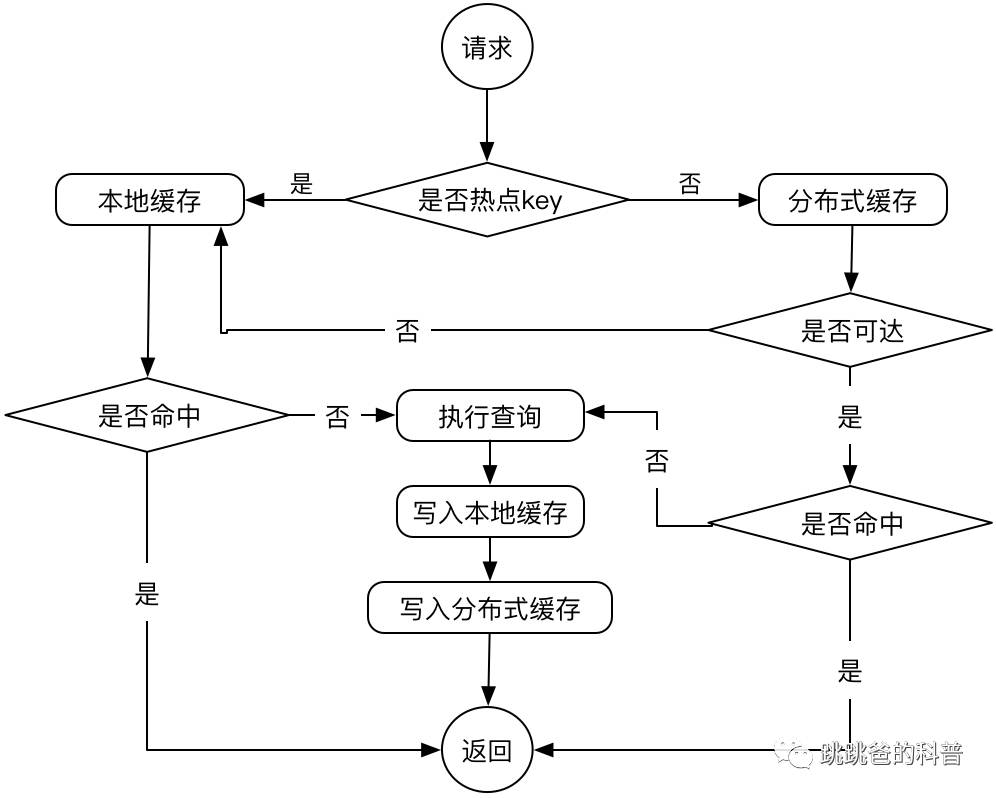
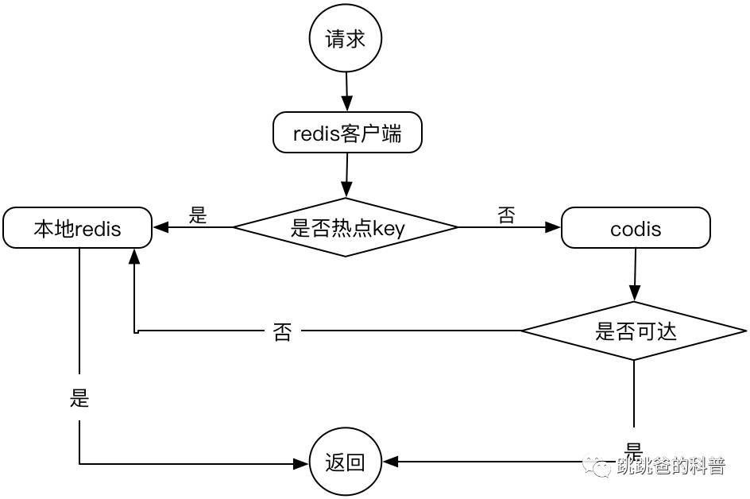

摘自：`https://toutiao.io/posts/56yqwd/preview`

**“** 本地缓存是解决缓存热点问题的良药，关键服务都要考虑降级**”**

# 选型

缓存是提高服务性能的关键，同时也是防止后端服务雪崩的良药，缓存应用比较广泛的主要是memcached或者redis，而redis甚至还有扩展为集群版本的codis，但本质上还是将key哈希之后路由到集群中某台机器上存储，也就是单key只能存在于单台机器。这种情况下，如果有热点key存在，即使是分布式缓存，仍然可能会因为流量过大导致单机网卡过载而无法正常工作。

对症下药，要解决单点存在hot key的问题，就通过多机分流来解决，而本地缓存就是一种分流方案，这次就来聊聊缓存特技之本地缓存。

本地缓存按字面理解就是在业务系统本机或者本进程内再启动一个缓存实例，解决集中式的缓存访问方式，由本地缓存来分担流量，这样即使有热点key存在，有多少业务系统进程就有多少相互独立的缓存来分担流量，可以很好的解决热点key的问题。

本地缓存解决了热点，但同时也带来了数据一致性的问题，在短时间内同一客户端访问业务系统可能会取到不一致的缓存结果：


（图中蓝色区域就是本地缓存不一致的窗口时间，这段时间内不同机器上读取到的值可能是不一致的）

分布式缓存一般来说都是作为共享基础服务的，在稳定优先的前提下，分布式缓存的存活必须优先保障，以免其他业务因为分布式缓存崩溃而雪崩（缓存崩溃之后如果查询直接落到db，那么db也很容易跟着崩溃），此时本地缓存就必须有，即使存在一定程度上的数据不一致。

本地缓存实现的载体大致有EhCache／MapDB／Guava Cache，相对来说Guava Cache更加轻量一点，考虑到实际情况（key不多，快速上线），我们选择了Guava Cache来实现自己的本地缓存（EhCache／MapDB如果小伙伴们有兴趣也可以去了解下，还是不错的）。

简单介绍下Guava Cache主要用到的参数配置：

- maximumSize：最大条数
- maximumWeight：如果限制占用内存大小，可以设置
- weigher：比如限制了内存大小，这里就返回每个key返回的字节数
- expireAfterWrite：写数据后多久过期（更新也算写入）
- expireAfterAccess：操作数据多久后过期（读写都算）
- refreshAfterWrite：写数据后多久执行重载（其实不是过期后立刻重载，而是过期后再次访问时重载，一般做成异步方式）
- recordStats：开启数据统计（命中率之类的统计）

# 设计

总结本地缓存和分布式缓存的优缺点，本地缓存没有热点key的问题，但是牺牲了数据一致性，而分布式缓存没有数据一致性的问题，但是会因为热点key存在而影响吞吐，那么可以考虑将这两者做一个结合来实现一个比较好的本地缓存系统，优势互补，通过一定的策略在保证解决热点key问题的基础上达到最高的数据一致性。

我们的方案简单来说：

- 正常流量情况下，读写共享缓存，同时写本地缓存
- 出现热点key情况下，读写都落到本地缓存



（本地缓存作为热点key存在时的降级方案，同时当分布式缓存无法响应时也可以临时作为主缓存使用）

# 实现

1. 堆内缓存实例

我们觉得堆内缓存方案是稳定性和性能最好的方案，主要的优势在于：

- 一般来说只要进程还存活，堆内缓存就也存活
- 定制缓存策略比较容易
- 堆内缓存和业务系统运行在一个进程内，既可以免去进程间通信多余的io操作和编解码
- 单进程启动即可，可以降低运维成本

而缺点也很明显：

- *增加开发成本*
- *各个业务系统间共享技术的难度相对高一点*
- *占用主进程heap空间*

虽然Guava也有expireAfterWrite的接口，但这是个全局配置，不能针对单个key设置ttl，然而实际的业务场景常常是根据不同业务甚至同一业务不同查询设置不同时长的ttl，这样就需要我们自己模拟一下ttl了，我们的实现如下：

```
 CacheEntry entry = new CacheEntry();
 entry.setTtl(System.currentTimeMillis() + ttl * 1000);
 entry.setValue(value);
 firstCache.put(key, entry); // 写缓存只操作firstCache
```

- 将当前时间＋ttl作为过期时间点，与缓存value组合为entry存储到缓存

```
if (entry.getTtl() < System.currentTimeMillis()) {
    // 过期缓存主动失效
    secondCache.invalidate(key);
    return null;
} else {
    return entry.getValue();
}
```

- 取缓存时判断过期时间点是否已过期，已过期的主动失效（在缓存再次命中时覆盖或在容量达到上限时清除），在有效时间内则返回

因为本地缓存容量受限，所以需要尽量保证缓存中存储的是高复用率的数据。实际场景下偶尔会有大量的单次查询出现（比如爬虫），由于采用的是LRU策略，如果没有合适的清洗策略，很容易发生新产生的低复用率缓存将正常运行的高复用率缓存踢出的情况，为此，我们参考了lru-2的方式来避免缓存污染。

```
CacheEntry entry = firstCache.getIfPresent(key);
if (null == entry) {
    // 用cache当做fifo队列
    // 如果队列中不存在，则到lru中查询
    entry = secondCache.getIfPresent(key);
    if (null == entry) {
        return null;
    } else {
        if (entry.getTtl() < System.currentTimeMillis()) {
            // 过期缓存主动失效
            secondCache.invalidate(key);
            return null;
        } else {
            return entry.getValue();
        }
    }
} else {
    // 如果队列中存在，说明已经是第二次访问了，放到lru缓存中
    // 只有访问过2次（及以上）的缓存才被当做是稳定缓存，放到lru缓存中
    firstCache.invalidate(key); // 从第一缓存去掉
    if (entry.getTtl() < System.currentTimeMillis()) {
        // 过期缓存主动失效
        return null;
    } else {
        // 命中2次，放入secondCache
        secondCache.put(key, entry);
        return entry.getValue();
    }
}
```

基于数据一致性的考虑，我们希望正常情况下缓存读取都通过分布式缓存实现，只在出现热key的情况下自动切换到本地缓存，这样就需要一个热key检测工具（HawkEye）。

这里我们通过统计一个时间窗口内缓存key的命中次数，根据其是否超过阈值来做缓存自动降级，主要的实现思路是统计一个时间窗口内的查询次数总量，换算为单位时间的qps。具体的实现用了点奇技淫巧，利用了Guava的expireAfterWrite功能来实现时间窗口：

```
hotKey = CacheBuilder.newBuilder()
        .maximumSize(hotKeySize)
        .expireAfterWrite(2, TimeUnit.SECONDS) // 统计时间窗口
        .recordStats()
        .build();
// 其他逻辑
// 热点统计
LongAdder adder = hotKey.getIfPresent(key);
if (null == adder) {
    adder = new LongAdder();
    adder.increment();
    hotKey.put(key, adder);
    // 初始状态
    return false;
} else {
    adder.increment();
    // 是否大于临界值
    return adder.sum() > atomicCritical.get();
}
```

这个实现不是很完美，热点key统计（HawkEye）上有滑动窗口的问题，统计不是很准。

# 天马行空

2. 本机启动缓存实例

用codis来做分布式缓存，其实相当于在多台redis前增加一个proxy，通过对key进行hash将其映射到后端某台redis上来实现容量扩增，天马行空的感觉对业务影响最小的本地缓存方案是本机启动一个redis做本地缓存实例，通过统一的redis客户端来决策缓存key的路由。



（通过redis客户端路由本地缓存或分布式缓存）

相对于堆内启动缓存实例，redis客户端路由方案的优缺点。

优点：

- 业务对接简单，可以将缓存路由策略封装在统一的redis客户端内
- 包装在统一redis客户端内，通用型强
- 不占用主进程内存

缺点：

- 运维成本增加，需要同时保障业务系统本机的redis进程存活
- 增加了进程间通信（不过感觉影响不大，除非体量巨大）

# 后记

这次的缓存设计比较轻量，另外目前只有堆内缓存，如果业务进程heap比较大，还是得考虑堆外缓存的方案。